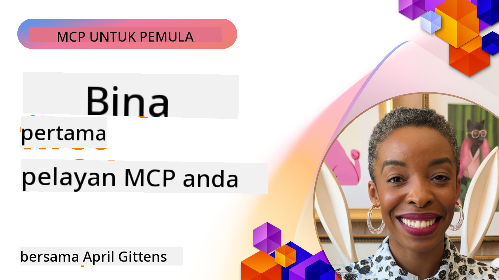

<!--
CO_OP_TRANSLATOR_METADATA:
{
  "original_hash": "1197b6dbde36773e04a5ae826557fdb9",
  "translation_date": "2025-08-26T18:05:32+00:00",
  "source_file": "03-GettingStarted/README.md",
  "language_code": "ms"
}
-->
## Memulakan  

_(Klik imej di atas untuk menonton video pelajaran ini)_

Bahagian ini terdiri daripada beberapa pelajaran:

- **1 Pelayan pertama anda**, dalam pelajaran pertama ini, anda akan belajar cara mencipta pelayan pertama anda dan memeriksanya dengan alat pemeriksa, cara yang berguna untuk menguji dan menyahpepijat pelayan anda, [ke pelajaran](01-first-server/README.md)

- **2 Klien**, dalam pelajaran ini, anda akan belajar cara menulis klien yang boleh berhubung dengan pelayan anda, [ke pelajaran](02-client/README.md)

- **3 Klien dengan LLM**, cara yang lebih baik untuk menulis klien adalah dengan menambah LLM supaya ia boleh "berunding" dengan pelayan anda tentang apa yang perlu dilakukan, [ke pelajaran](03-llm-client/README.md)

- **4 Menggunakan pelayan dalam mod GitHub Copilot Agent di Visual Studio Code**. Di sini, kita akan melihat cara menjalankan Pelayan MCP kita dari dalam Visual Studio Code, [ke pelajaran](04-vscode/README.md)

- **5 Pelayan Pengangkutan stdio** stdio transport adalah standard yang disyorkan untuk komunikasi pelayan-ke-klien MCP dalam spesifikasi semasa, menyediakan komunikasi berasaskan subprocess yang selamat [ke pelajaran](05-stdio-server/README.md)

- **6 Penstriman HTTP dengan MCP (HTTP Boleh Distrim)**. Pelajari tentang penstriman HTTP moden, pemberitahuan kemajuan, dan cara melaksanakan pelayan dan klien MCP yang boleh diskalakan secara masa nyata menggunakan HTTP Boleh Distrim. [ke pelajaran](06-http-streaming/README.md)

- **7 Menggunakan AI Toolkit untuk VSCode** untuk menggunakan dan menguji Klien dan Pelayan MCP anda [ke pelajaran](07-aitk/README.md)

- **8 Pengujian**. Di sini kita akan memberi tumpuan kepada cara kita boleh menguji pelayan dan klien kita dengan pelbagai cara, [ke pelajaran](08-testing/README.md)

- **9 Penerapan**. Bab ini akan melihat pelbagai cara untuk menerapkan penyelesaian MCP anda, [ke pelajaran](09-deployment/README.md)

Protokol Model Context (MCP) adalah protokol terbuka yang menyeragamkan cara aplikasi menyediakan konteks kepada LLM. Fikirkan MCP seperti port USB-C untuk aplikasi AI - ia menyediakan cara standard untuk menyambungkan model AI kepada pelbagai sumber data dan alat.

## Objektif Pembelajaran

Menjelang akhir pelajaran ini, anda akan dapat:

- Menyediakan persekitaran pembangunan untuk MCP dalam C#, Java, Python, TypeScript, dan JavaScript
- Membina dan menerapkan pelayan MCP asas dengan ciri tersuai (sumber, arahan, dan alat)
- Mencipta aplikasi hos yang berhubung dengan pelayan MCP
- Menguji dan menyahpepijat pelaksanaan MCP
- Memahami cabaran persediaan biasa dan penyelesaiannya
- Menyambungkan pelaksanaan MCP anda kepada perkhidmatan LLM popular

## Menyediakan Persekitaran MCP Anda

Sebelum anda mula bekerja dengan MCP, adalah penting untuk menyediakan persekitaran pembangunan anda dan memahami aliran kerja asas. Bahagian ini akan membimbing anda melalui langkah-langkah persediaan awal untuk memastikan permulaan yang lancar dengan MCP.

### Prasyarat

Sebelum mendalami pembangunan MCP, pastikan anda mempunyai:

- **Persekitaran Pembangunan**: Untuk bahasa pilihan anda (C#, Java, Python, TypeScript, atau JavaScript)
- **IDE/Editor**: Visual Studio, Visual Studio Code, IntelliJ, Eclipse, PyCharm, atau mana-mana editor kod moden
- **Pengurus Pakej**: NuGet, Maven/Gradle, pip, atau npm/yarn
- **Kunci API**: Untuk sebarang perkhidmatan AI yang anda rancang untuk digunakan dalam aplikasi hos anda

### SDK Rasmi

Dalam bab-bab yang akan datang, anda akan melihat penyelesaian yang dibina menggunakan Python, TypeScript, Java dan .NET. Berikut adalah semua SDK yang disokong secara rasmi.

MCP menyediakan SDK rasmi untuk pelbagai bahasa:
- [C# SDK](https://github.com/modelcontextprotocol/csharp-sdk) - Diselenggara bersama Microsoft
- [Java SDK](https://github.com/modelcontextprotocol/java-sdk) - Diselenggara bersama Spring AI
- [TypeScript SDK](https://github.com/modelcontextprotocol/typescript-sdk) - Pelaksanaan rasmi TypeScript
- [Python SDK](https://github.com/modelcontextprotocol/python-sdk) - Pelaksanaan rasmi Python
- [Kotlin SDK](https://github.com/modelcontextprotocol/kotlin-sdk) - Pelaksanaan rasmi Kotlin
- [Swift SDK](https://github.com/modelcontextprotocol/swift-sdk) - Diselenggara bersama Loopwork AI
- [Rust SDK](https://github.com/modelcontextprotocol/rust-sdk) - Pelaksanaan rasmi Rust

## Poin Penting

- Menyediakan persekitaran pembangunan MCP adalah mudah dengan SDK khusus bahasa
- Membina pelayan MCP melibatkan penciptaan dan pendaftaran alat dengan skema yang jelas
- Klien MCP berhubung dengan pelayan dan model untuk memanfaatkan keupayaan lanjutan
- Pengujian dan penyahpepijatan adalah penting untuk pelaksanaan MCP yang boleh dipercayai
- Pilihan penerapan merangkumi pembangunan tempatan hingga penyelesaian berasaskan awan

## Latihan

Kami mempunyai set sampel yang melengkapi latihan yang akan anda lihat dalam semua bab di bahagian ini. Selain itu, setiap bab juga mempunyai latihan dan tugasan mereka sendiri.

- [Java Calculator](./samples/java/calculator/README.md)
- [.Net Calculator](../../../03-GettingStarted/samples/csharp)
- [JavaScript Calculator](./samples/javascript/README.md)
- [TypeScript Calculator](./samples/typescript/README.md)
- [Python Calculator](../../../03-GettingStarted/samples/python)

## Sumber Tambahan

- [Bina Ejen menggunakan Model Context Protocol di Azure](https://learn.microsoft.com/azure/developer/ai/intro-agents-mcp)
- [MCP Jarak Jauh dengan Azure Container Apps (Node.js/TypeScript/JavaScript)](https://learn.microsoft.com/samples/azure-samples/mcp-container-ts/mcp-container-ts/)
- [.NET OpenAI MCP Agent](https://learn.microsoft.com/samples/azure-samples/openai-mcp-agent-dotnet/openai-mcp-agent-dotnet/)

## Apa Seterusnya

Seterusnya: [Mencipta Pelayan MCP Pertama Anda](01-first-server/README.md)

---

**Penafian**:  
Dokumen ini telah diterjemahkan menggunakan perkhidmatan terjemahan AI [Co-op Translator](https://github.com/Azure/co-op-translator). Walaupun kami berusaha untuk memastikan ketepatan, sila ambil perhatian bahawa terjemahan automatik mungkin mengandungi kesilapan atau ketidaktepatan. Dokumen asal dalam bahasa asalnya harus dianggap sebagai sumber yang berwibawa. Untuk maklumat penting, terjemahan manusia profesional adalah disyorkan. Kami tidak bertanggungjawab atas sebarang salah faham atau salah tafsir yang timbul daripada penggunaan terjemahan ini.  