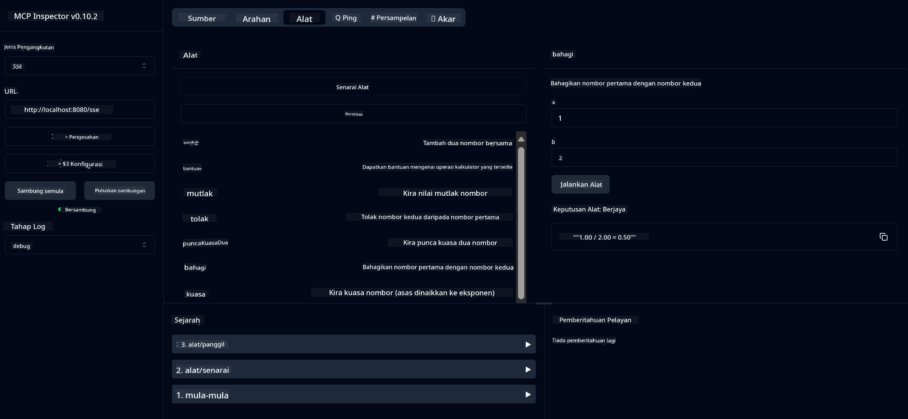

<!--
CO_OP_TRANSLATOR_METADATA:
{
  "original_hash": "13231e9951b68efd9df8c56bd5cdb27e",
  "translation_date": "2025-07-13T22:29:31+00:00",
  "source_file": "03-GettingStarted/samples/java/calculator/README.md",
  "language_code": "ms"
}
-->
# Perkhidmatan Kalkulator Asas MCP

Perkhidmatan ini menyediakan operasi kalkulator asas melalui Model Context Protocol (MCP) menggunakan Spring Boot dengan pengangkutan WebFlux. Ia direka sebagai contoh mudah untuk pemula yang ingin mempelajari tentang pelaksanaan MCP.

Untuk maklumat lanjut, lihat dokumentasi rujukan [MCP Server Boot Starter](https://docs.spring.io/spring-ai/reference/api/mcp/mcp-server-boot-starter-docs.html).

## Gambaran Keseluruhan

Perkhidmatan ini mempamerkan:
- Sokongan untuk SSE (Server-Sent Events)
- Pendaftaran alat automatik menggunakan anotasi `@Tool` dari Spring AI
- Fungsi kalkulator asas:
  - Penambahan, penolakan, pendaraban, pembahagian
  - Pengiraan kuasa dan punca kuasa dua
  - Modulus (baki) dan nilai mutlak
  - Fungsi bantuan untuk penerangan operasi

## Ciri-ciri

Perkhidmatan kalkulator ini menawarkan keupayaan berikut:

1. **Operasi Aritmetik Asas**:
   - Penambahan dua nombor
   - Penolakan satu nombor daripada nombor lain
   - Pendaraban dua nombor
   - Pembahagian satu nombor dengan nombor lain (dengan pemeriksaan pembahagian dengan sifar)

2. **Operasi Lanjutan**:
   - Pengiraan kuasa (menaikkan asas kepada eksponen)
   - Pengiraan punca kuasa dua (dengan pemeriksaan nombor negatif)
   - Pengiraan modulus (baki)
   - Pengiraan nilai mutlak

3. **Sistem Bantuan**:
   - Fungsi bantuan terbina dalam yang menerangkan semua operasi yang tersedia

## Menggunakan Perkhidmatan

Perkhidmatan ini mendedahkan API berikut melalui protokol MCP:

- `add(a, b)`: Menambah dua nombor
- `subtract(a, b)`: Menolak nombor kedua daripada nombor pertama
- `multiply(a, b)`: Mendarab dua nombor
- `divide(a, b)`: Membahagi nombor pertama dengan nombor kedua (dengan pemeriksaan sifar)
- `power(base, exponent)`: Mengira kuasa nombor
- `squareRoot(number)`: Mengira punca kuasa dua (dengan pemeriksaan nombor negatif)
- `modulus(a, b)`: Mengira baki pembahagian
- `absolute(number)`: Mengira nilai mutlak
- `help()`: Mendapatkan maklumat tentang operasi yang tersedia

## Klien Ujian

Klien ujian ringkas disertakan dalam pakej `com.microsoft.mcp.sample.client`. Kelas `SampleCalculatorClient` menunjukkan operasi yang tersedia dalam perkhidmatan kalkulator.

## Menggunakan Klien LangChain4j

Projek ini termasuk contoh klien LangChain4j dalam `com.microsoft.mcp.sample.client.LangChain4jClient` yang menunjukkan cara mengintegrasikan perkhidmatan kalkulator dengan LangChain4j dan model GitHub:

### Prasyarat

1. **Persediaan Token GitHub**:
   
   Untuk menggunakan model AI GitHub (seperti phi-4), anda memerlukan token akses peribadi GitHub:

   a. Pergi ke tetapan akaun GitHub anda: https://github.com/settings/tokens
   
   b. Klik "Generate new token" → "Generate new token (classic)"
   
   c. Beri nama yang jelas untuk token anda
   
   d. Pilih skop berikut:
      - `repo` (Kawalan penuh repositori peribadi)
      - `read:org` (Baca keahlian organisasi dan pasukan, baca projek organisasi)
      - `gist` (Cipta gist)
      - `user:email` (Akses alamat emel pengguna (baca sahaja))
   
   e. Klik "Generate token" dan salin token baru anda
   
   f. Tetapkan sebagai pembolehubah persekitaran:
      
      Pada Windows:
      ```
      set GITHUB_TOKEN=your-github-token
      ```
      
      Pada macOS/Linux:
      ```bash
      export GITHUB_TOKEN=your-github-token
      ```

   g. Untuk persediaan kekal, tambahkannya ke pembolehubah persekitaran melalui tetapan sistem

2. Tambah kebergantungan LangChain4j GitHub ke projek anda (sudah termasuk dalam pom.xml):
   ```xml
   <dependency>
       <groupId>dev.langchain4j</groupId>
       <artifactId>langchain4j-github</artifactId>
       <version>${langchain4j.version}</version>
   </dependency>
   ```

3. Pastikan pelayan kalkulator berjalan di `localhost:8080`

### Menjalankan Klien LangChain4j

Contoh ini menunjukkan:
- Sambungan ke pelayan MCP kalkulator melalui pengangkutan SSE
- Menggunakan LangChain4j untuk mencipta chatbot yang menggunakan operasi kalkulator
- Integrasi dengan model AI GitHub (kini menggunakan model phi-4)

Klien menghantar pertanyaan contoh berikut untuk menunjukkan fungsi:
1. Mengira jumlah dua nombor
2. Mencari punca kuasa dua nombor
3. Mendapatkan maklumat bantuan tentang operasi kalkulator yang tersedia

Jalankan contoh dan periksa output konsol untuk melihat bagaimana model AI menggunakan alat kalkulator untuk menjawab pertanyaan.

### Konfigurasi Model GitHub

Klien LangChain4j dikonfigurasikan untuk menggunakan model phi-4 GitHub dengan tetapan berikut:

```java
ChatLanguageModel model = GitHubChatModel.builder()
    .apiKey(System.getenv("GITHUB_TOKEN"))
    .timeout(Duration.ofSeconds(60))
    .modelName("phi-4")
    .logRequests(true)
    .logResponses(true)
    .build();
```

Untuk menggunakan model GitHub yang berbeza, tukar sahaja parameter `modelName` kepada model lain yang disokong (contoh: "claude-3-haiku-20240307", "llama-3-70b-8192", dan lain-lain).

## Kebergantungan

Projek memerlukan kebergantungan utama berikut:

```xml
<!-- For MCP Server -->
<dependency>
    <groupId>org.springframework.ai</groupId>
    <artifactId>spring-ai-starter-mcp-server-webflux</artifactId>
</dependency>

<!-- For LangChain4j integration -->
<dependency>
    <groupId>dev.langchain4j</groupId>
    <artifactId>langchain4j-mcp</artifactId>
    <version>${langchain4j.version}</version>
</dependency>

<!-- For GitHub models support -->
<dependency>
    <groupId>dev.langchain4j</groupId>
    <artifactId>langchain4j-github</artifactId>
    <version>${langchain4j.version}</version>
</dependency>
```

## Membina Projek

Bina projek menggunakan Maven:
```bash
./mvnw clean install -DskipTests
```

## Menjalankan Pelayan

### Menggunakan Java

```bash
java -jar target/calculator-server-0.0.1-SNAPSHOT.jar
```

### Menggunakan MCP Inspector

MCP Inspector adalah alat berguna untuk berinteraksi dengan perkhidmatan MCP. Untuk menggunakannya dengan perkhidmatan kalkulator ini:

1. **Pasang dan jalankan MCP Inspector** dalam tetingkap terminal baru:
   ```bash
   npx @modelcontextprotocol/inspector
   ```

2. **Akses UI web** dengan mengklik URL yang dipaparkan oleh aplikasi (biasanya http://localhost:6274)

3. **Konfigurasikan sambungan**:
   - Tetapkan jenis pengangkutan kepada "SSE"
   - Tetapkan URL ke titik akhir SSE pelayan anda yang sedang berjalan: `http://localhost:8080/sse`
   - Klik "Connect"

4. **Gunakan alat**:
   - Klik "List Tools" untuk melihat operasi kalkulator yang tersedia
   - Pilih alat dan klik "Run Tool" untuk menjalankan operasi



### Menggunakan Docker

Projek ini termasuk Dockerfile untuk penghantaran berasaskan kontena:

1. **Bina imej Docker**:
   ```bash
   docker build -t calculator-mcp-service .
   ```

2. **Jalankan kontena Docker**:
   ```bash
   docker run -p 8080:8080 calculator-mcp-service
   ```

Ini akan:
- Membina imej Docker berperingkat dengan Maven 3.9.9 dan Eclipse Temurin 24 JDK
- Mencipta imej kontena yang dioptimumkan
- Mendedahkan perkhidmatan pada port 8080
- Memulakan perkhidmatan kalkulator MCP di dalam kontena

Anda boleh mengakses perkhidmatan di `http://localhost:8080` setelah kontena berjalan.

## Penyelesaian Masalah

### Isu Biasa dengan Token GitHub

1. **Masalah Kebenaran Token**: Jika anda mendapat ralat 403 Forbidden, periksa bahawa token anda mempunyai kebenaran yang betul seperti yang diterangkan dalam prasyarat.

2. **Token Tidak Dijumpai**: Jika anda mendapat ralat "No API key found", pastikan pembolehubah persekitaran GITHUB_TOKEN telah ditetapkan dengan betul.

3. **Had Kadar**: API GitHub mempunyai had kadar. Jika anda menghadapi ralat had kadar (kod status 429), tunggu beberapa minit sebelum mencuba lagi.

4. **Token Tamat Tempoh**: Token GitHub boleh tamat tempoh. Jika anda menerima ralat pengesahan selepas beberapa masa, jana token baru dan kemas kini pembolehubah persekitaran anda.

Jika anda memerlukan bantuan lanjut, semak [dokumentasi LangChain4j](https://github.com/langchain4j/langchain4j) atau [dokumentasi API GitHub](https://docs.github.com/en/rest).

**Penafian**:  
Dokumen ini telah diterjemahkan menggunakan perkhidmatan terjemahan AI [Co-op Translator](https://github.com/Azure/co-op-translator). Walaupun kami berusaha untuk ketepatan, sila ambil maklum bahawa terjemahan automatik mungkin mengandungi kesilapan atau ketidaktepatan. Dokumen asal dalam bahasa asalnya harus dianggap sebagai sumber yang sahih. Untuk maklumat penting, terjemahan profesional oleh manusia adalah disyorkan. Kami tidak bertanggungjawab atas sebarang salah faham atau salah tafsir yang timbul daripada penggunaan terjemahan ini.