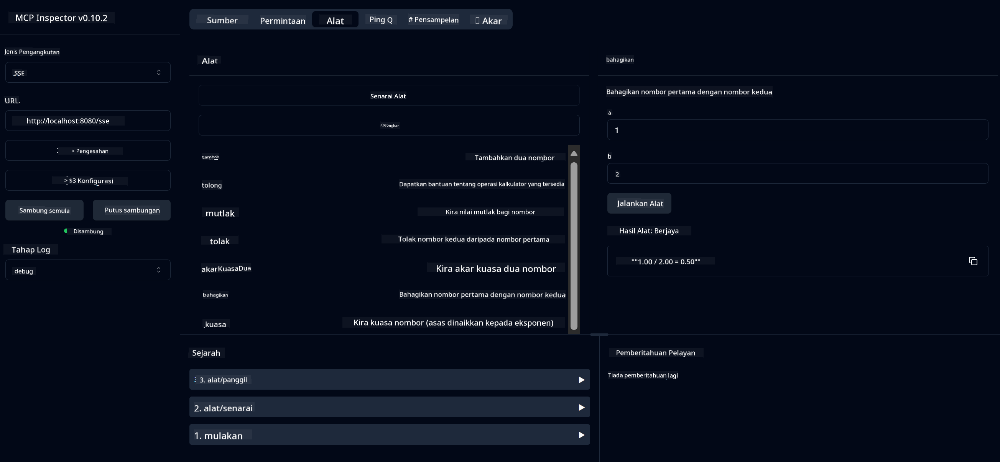

<!--
CO_OP_TRANSLATOR_METADATA:
{
  "original_hash": "13231e9951b68efd9df8c56bd5cdb27e",
  "translation_date": "2025-05-17T13:15:22+00:00",
  "source_file": "03-GettingStarted/samples/java/calculator/README.md",
  "language_code": "ms"
}
-->
# Perkhidmatan MCP Kalkulator Asas

Perkhidmatan ini menyediakan operasi kalkulator asas melalui Model Context Protocol (MCP) menggunakan Spring Boot dengan pengangkutan WebFlux. Ia direka sebagai contoh mudah untuk pemula yang belajar tentang pelaksanaan MCP.

Untuk maklumat lanjut, lihat dokumentasi rujukan [MCP Server Boot Starter](https://docs.spring.io/spring-ai/reference/api/mcp/mcp-server-boot-starter-docs.html).

## Gambaran Keseluruhan

Perkhidmatan ini menampilkan:
- Sokongan untuk SSE (Server-Sent Events)
- Pendaftaran alat automatik menggunakan anotasi `@Tool` Spring AI
- Fungsi kalkulator asas:
  - Penambahan, pengurangan, pendaraban, pembahagian
  - Pengiraan kuasa dan punca kuasa dua
  - Modulus (baki) dan nilai mutlak
  - Fungsi bantuan untuk penerangan operasi

## Ciri-ciri

Perkhidmatan kalkulator ini menawarkan keupayaan berikut:

1. **Operasi Aritmetik Asas**:
   - Penambahan dua nombor
   - Pengurangan satu nombor daripada nombor lain
   - Pendaraban dua nombor
   - Pembahagian satu nombor dengan nombor lain (dengan semakan pembahagian sifar)

2. **Operasi Lanjutan**:
   - Pengiraan kuasa (menaikkan asas kepada eksponen)
   - Pengiraan punca kuasa dua (dengan semakan nombor negatif)
   - Pengiraan modulus (baki)
   - Pengiraan nilai mutlak

3. **Sistem Bantuan**:
   - Fungsi bantuan terbina dalam yang menerangkan semua operasi yang tersedia

## Menggunakan Perkhidmatan

Perkhidmatan ini mendedahkan titik akhir API berikut melalui protokol MCP:

- `add(a, b)`: Tambah dua nombor bersama
- `subtract(a, b)`: Kurangkan nombor kedua daripada nombor pertama
- `multiply(a, b)`: Gandakan dua nombor
- `divide(a, b)`: Bahagikan nombor pertama dengan nombor kedua (dengan semakan sifar)
- `power(base, exponent)`: Kira kuasa nombor
- `squareRoot(number)`: Kira punca kuasa dua (dengan semakan nombor negatif)
- `modulus(a, b)`: Kira baki apabila membahagikan
- `absolute(number)`: Kira nilai mutlak
- `help()`: Dapatkan maklumat tentang operasi yang tersedia

## Pelanggan Ujian

Pelanggan ujian mudah disertakan dalam pakej `com.microsoft.mcp.sample.client`. Kelas `SampleCalculatorClient` menunjukkan operasi yang tersedia daripada perkhidmatan kalkulator.

## Menggunakan Pelanggan LangChain4j

Projek ini termasuk contoh pelanggan LangChain4j dalam `com.microsoft.mcp.sample.client.LangChain4jClient` yang menunjukkan cara mengintegrasikan perkhidmatan kalkulator dengan LangChain4j dan model GitHub:

### Prasyarat

1. **Persediaan Token GitHub**:
   
   Untuk menggunakan model AI GitHub (seperti phi-4), anda memerlukan token akses peribadi GitHub:

   a. Pergi ke tetapan akaun GitHub anda: https://github.com/settings/tokens
   
   b. Klik "Generate new token" → "Generate new token (classic)"
   
   c. Berikan nama deskriptif kepada token anda
   
   d. Pilih skop berikut:
      - `repo` (Kawalan penuh repositori peribadi)
      - `read:org` (Baca keahlian org dan pasukan, baca projek org)
      - `gist` (Buat gists)
      - `user:email` (Akses alamat e-mel pengguna (baca sahaja))
   
   e. Klik "Generate token" dan salin token baru anda
   
   f. Tetapkannya sebagai pembolehubah persekitaran:
      
      Pada Windows:
      ```
      set GITHUB_TOKEN=your-github-token
      ```
      
      Pada macOS/Linux:
      ```bash
      export GITHUB_TOKEN=your-github-token
      ```

   g. Untuk persediaan berterusan, tambahkannya kepada pembolehubah persekitaran anda melalui tetapan sistem

2. Tambahkan kebergantungan GitHub LangChain4j kepada projek anda (sudah termasuk dalam pom.xml):
   ```xml
   <dependency>
       <groupId>dev.langchain4j</groupId>
       <artifactId>langchain4j-github</artifactId>
       <version>${langchain4j.version}</version>
   </dependency>
   ```

3. Pastikan pelayan kalkulator berjalan di `localhost:8080`

### Menjalankan Pelanggan LangChain4j

Contoh ini menunjukkan:
- Menyambung ke pelayan MCP kalkulator melalui pengangkutan SSE
- Menggunakan LangChain4j untuk membuat bot sembang yang memanfaatkan operasi kalkulator
- Mengintegrasikan dengan model AI GitHub (kini menggunakan model phi-4)

Pelanggan menghantar pertanyaan sampel berikut untuk menunjukkan fungsi:
1. Mengira jumlah dua nombor
2. Mencari punca kuasa dua nombor
3. Mendapatkan maklumat bantuan tentang operasi kalkulator yang tersedia

Jalankan contoh dan semak output konsol untuk melihat bagaimana model AI menggunakan alat kalkulator untuk menjawab pertanyaan.

### Konfigurasi Model GitHub

Pelanggan LangChain4j dikonfigurasikan untuk menggunakan model phi-4 GitHub dengan tetapan berikut:

```java
ChatLanguageModel model = GitHubChatModel.builder()
    .apiKey(System.getenv("GITHUB_TOKEN"))
    .timeout(Duration.ofSeconds(60))
    .modelName("phi-4")
    .logRequests(true)
    .logResponses(true)
    .build();
```

Untuk menggunakan model GitHub yang berbeza, hanya ubah parameter `modelName` kepada model lain yang disokong (contohnya, "claude-3-haiku-20240307", "llama-3-70b-8192", dll.).

## Kebergantungan

Projek ini memerlukan kebergantungan utama berikut:

```xml
<!-- For MCP Server -->
<dependency>
    <groupId>org.springframework.ai</groupId>
    <artifactId>spring-ai-starter-mcp-server-webflux</artifactId>
</dependency>

<!-- For LangChain4j integration -->
<dependency>
    <groupId>dev.langchain4j</groupId>
    <artifactId>langchain4j-mcp</artifactId>
    <version>${langchain4j.version}</version>
</dependency>

<!-- For GitHub models support -->
<dependency>
    <groupId>dev.langchain4j</groupId>
    <artifactId>langchain4j-github</artifactId>
    <version>${langchain4j.version}</version>
</dependency>
```

## Membina Projek

Bina projek menggunakan Maven:
```bash
./mvnw clean install -DskipTests
```

## Menjalankan Pelayan

### Menggunakan Java

```bash
java -jar target/calculator-server-0.0.1-SNAPSHOT.jar
```

### Menggunakan MCP Inspector

MCP Inspector adalah alat berguna untuk berinteraksi dengan perkhidmatan MCP. Untuk menggunakannya dengan perkhidmatan kalkulator ini:

1. **Pasang dan jalankan MCP Inspector** dalam tetingkap terminal baru:
   ```bash
   npx @modelcontextprotocol/inspector
   ```

2. **Akses UI web** dengan mengklik URL yang dipaparkan oleh aplikasi (biasanya http://localhost:6274)

3. **Konfigurasi sambungan**:
   - Tetapkan jenis pengangkutan kepada "SSE"
   - Tetapkan URL kepada titik akhir SSE pelayan anda yang sedang berjalan: `http://localhost:8080/sse`
   - Klik "Connect"

4. **Gunakan alat**:
   - Klik "List Tools" untuk melihat operasi kalkulator yang tersedia
   - Pilih alat dan klik "Run Tool" untuk melaksanakan operasi



### Menggunakan Docker

Projek ini termasuk Dockerfile untuk penyebaran dalam bekas:

1. **Bina imej Docker**:
   ```bash
   docker build -t calculator-mcp-service .
   ```

2. **Jalankan bekas Docker**:
   ```bash
   docker run -p 8080:8080 calculator-mcp-service
   ```

Ini akan:
- Membina imej Docker multi-tahap dengan Maven 3.9.9 dan Eclipse Temurin 24 JDK
- Membuat imej bekas yang dioptimumkan
- Mendedahkan perkhidmatan pada port 8080
- Memulakan perkhidmatan kalkulator MCP dalam bekas

Anda boleh mengakses perkhidmatan di `http://localhost:8080` setelah bekas berjalan.

## Penyelesaian Masalah

### Isu Biasa dengan Token GitHub

1. **Isu Kebenaran Token**: Jika anda mendapat ralat 403 Forbidden, periksa bahawa token anda mempunyai kebenaran yang betul seperti yang digariskan dalam prasyarat.

2. **Token Tidak Ditemui**: Jika anda mendapat ralat "No API key found", pastikan pembolehubah persekitaran GITHUB_TOKEN ditetapkan dengan betul.

3. **Had Kadar**: API GitHub mempunyai had kadar. Jika anda menghadapi ralat had kadar (kod status 429), tunggu beberapa minit sebelum mencuba lagi.

4. **Tamat Tempoh Token**: Token GitHub boleh tamat tempoh. Jika anda menerima ralat pengesahan selepas beberapa waktu, hasilkan token baru dan kemas kini pembolehubah persekitaran anda.

Jika anda memerlukan bantuan lanjut, semak dokumentasi [LangChain4j](https://github.com/langchain4j/langchain4j) atau dokumentasi [GitHub API](https://docs.github.com/en/rest).

**Penafian**:  
Dokumen ini telah diterjemahkan menggunakan perkhidmatan terjemahan AI [Co-op Translator](https://github.com/Azure/co-op-translator). Walaupun kami berusaha untuk ketepatan, sila ambil perhatian bahawa terjemahan automatik mungkin mengandungi kesilapan atau ketidaktepatan. Dokumen asal dalam bahasa asalnya harus dianggap sebagai sumber yang berwibawa. Untuk maklumat penting, terjemahan manusia profesional adalah disyorkan. Kami tidak bertanggungjawab atas sebarang salah faham atau salah tafsir yang timbul daripada penggunaan terjemahan ini.