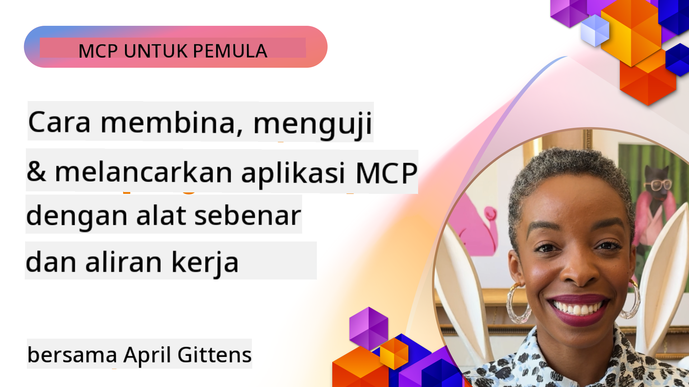

<!--
CO_OP_TRANSLATOR_METADATA:
{
  "original_hash": "83efa75a69bc831277263a6f1ae53669",
  "translation_date": "2025-08-18T17:53:17+00:00",
  "source_file": "04-PracticalImplementation/README.md",
  "language_code": "ms"
}
-->
# Pelaksanaan Praktikal

[](https://youtu.be/vCN9-mKBDfQ)

_(Klik imej di atas untuk menonton video pelajaran ini)_

Pelaksanaan praktikal adalah di mana kekuatan Model Context Protocol (MCP) menjadi nyata. Walaupun memahami teori dan seni bina di sebalik MCP adalah penting, nilai sebenar muncul apabila anda menerapkan konsep ini untuk membina, menguji, dan melancarkan penyelesaian yang menyelesaikan masalah dunia sebenar. Bab ini merapatkan jurang antara pengetahuan konseptual dan pembangunan secara langsung, membimbing anda melalui proses menghidupkan aplikasi berasaskan MCP.

Sama ada anda sedang membangunkan pembantu pintar, mengintegrasikan AI ke dalam aliran kerja perniagaan, atau membina alat khusus untuk pemprosesan data, MCP menyediakan asas yang fleksibel. Reka bentuknya yang bebas bahasa dan SDK rasmi untuk bahasa pengaturcaraan popular menjadikannya mudah diakses oleh pelbagai jenis pembangun. Dengan memanfaatkan SDK ini, anda boleh dengan cepat membuat prototaip, mengulangi, dan menskalakan penyelesaian anda di pelbagai platform dan persekitaran.

Dalam bahagian berikut, anda akan menemui contoh praktikal, kod sampel, dan strategi pelancaran yang menunjukkan cara melaksanakan MCP dalam C#, Java dengan Spring, TypeScript, JavaScript, dan Python. Anda juga akan belajar cara menyahpepijat dan menguji pelayan MCP anda, mengurus API, dan melancarkan penyelesaian ke awan menggunakan Azure. Sumber langsung ini direka untuk mempercepatkan pembelajaran anda dan membantu anda membina aplikasi MCP yang kukuh dan sedia untuk pengeluaran dengan yakin.

## Gambaran Keseluruhan

Pelajaran ini memberi tumpuan kepada aspek praktikal pelaksanaan MCP merentasi pelbagai bahasa pengaturcaraan. Kami akan meneroka cara menggunakan SDK MCP dalam C#, Java dengan Spring, TypeScript, JavaScript, dan Python untuk membina aplikasi yang kukuh, menyahpepijat dan menguji pelayan MCP, serta mencipta sumber, arahan, dan alat yang boleh digunakan semula.

## Objektif Pembelajaran

Menjelang akhir pelajaran ini, anda akan dapat:

- Melaksanakan penyelesaian MCP menggunakan SDK rasmi dalam pelbagai bahasa pengaturcaraan
- Menyahpepijat dan menguji pelayan MCP secara sistematik
- Mencipta dan menggunakan ciri pelayan (Sumber, Arahan, dan Alat)
- Merancang aliran kerja MCP yang berkesan untuk tugas yang kompleks
- Mengoptimumkan pelaksanaan MCP untuk prestasi dan kebolehpercayaan

## Sumber SDK Rasmi

Model Context Protocol menawarkan SDK rasmi untuk pelbagai bahasa:

- [C# SDK](https://github.com/modelcontextprotocol/csharp-sdk)
- [Java dengan Spring SDK](https://github.com/modelcontextprotocol/java-sdk) **Nota:** memerlukan pergantungan pada [Project Reactor](https://projectreactor.io). (Lihat [isu perbincangan 246](https://github.com/orgs/modelcontextprotocol/discussions/246).)
- [TypeScript SDK](https://github.com/modelcontextprotocol/typescript-sdk)
- [Python SDK](https://github.com/modelcontextprotocol/python-sdk)
- [Kotlin SDK](https://github.com/modelcontextprotocol/kotlin-sdk)

## Bekerja dengan SDK MCP

Bahagian ini menyediakan contoh praktikal pelaksanaan MCP merentasi pelbagai bahasa pengaturcaraan. Anda boleh menemui kod sampel dalam direktori `samples` yang diatur mengikut bahasa.

### Sampel Tersedia

Repositori ini termasuk [pelaksanaan sampel](../../../04-PracticalImplementation/samples) dalam bahasa berikut:

- [C#](./samples/csharp/README.md)
- [Java dengan Spring](./samples/java/containerapp/README.md)
- [TypeScript](./samples/typescript/README.md)
- [JavaScript](./samples/javascript/README.md)
- [Python](./samples/python/README.md)

Setiap sampel menunjukkan konsep utama MCP dan corak pelaksanaan untuk bahasa dan ekosistem tertentu.

## Ciri Utama Pelayan

Pelayan MCP boleh melaksanakan sebarang gabungan ciri berikut:

### Sumber

Sumber menyediakan konteks dan data untuk digunakan oleh pengguna atau model AI:

- Repositori dokumen
- Pangkalan pengetahuan
- Sumber data berstruktur
- Sistem fail

### Arahan

Arahan adalah mesej dan aliran kerja yang telah ditentukan untuk pengguna:

- Templat perbualan yang telah ditentukan
- Corak interaksi berpandu
- Struktur dialog khusus

### Alat

Alat adalah fungsi untuk model AI melaksanakan:

- Utiliti pemprosesan data
- Integrasi API luaran
- Keupayaan pengiraan
- Fungsi carian

## Pelaksanaan Sampel: Pelaksanaan C#

Repositori SDK C# rasmi mengandungi beberapa pelaksanaan sampel yang menunjukkan aspek berbeza MCP:

- **Pelanggan MCP Asas**: Contoh mudah menunjukkan cara mencipta pelanggan MCP dan memanggil alat
- **Pelayan MCP Asas**: Pelaksanaan pelayan minimum dengan pendaftaran alat asas
- **Pelayan MCP Lanjutan**: Pelayan penuh dengan pendaftaran alat, pengesahan, dan pengendalian ralat
- **Integrasi ASP.NET**: Contoh yang menunjukkan integrasi dengan ASP.NET Core
- **Corak Pelaksanaan Alat**: Pelbagai corak untuk melaksanakan alat dengan tahap kerumitan yang berbeza

SDK MCP C# sedang dalam pratonton dan API mungkin berubah. Kami akan terus mengemas kini blog ini apabila SDK berkembang.

### Ciri Utama

- [C# MCP Nuget ModelContextProtocol](https://www.nuget.org/packages/ModelContextProtocol)
- Membina [pelayan MCP pertama anda](https://devblogs.microsoft.com/dotnet/build-a-model-context-protocol-mcp-server-in-csharp/).

Untuk sampel pelaksanaan C# lengkap, lawati [repositori sampel SDK C# rasmi](https://github.com/modelcontextprotocol/csharp-sdk)

## Pelaksanaan Sampel: Pelaksanaan Java dengan Spring

SDK Java dengan Spring menawarkan pilihan pelaksanaan MCP yang kukuh dengan ciri-ciri kelas perusahaan.

### Ciri Utama

- Integrasi Spring Framework
- Keselamatan jenis yang kuat
- Sokongan pengaturcaraan reaktif
- Pengendalian ralat yang komprehensif

Untuk sampel pelaksanaan Java dengan Spring yang lengkap, lihat [sampel Java dengan Spring](samples/java/containerapp/README.md) dalam direktori sampel.

## Pelaksanaan Sampel: Pelaksanaan JavaScript

SDK JavaScript menyediakan pendekatan ringan dan fleksibel untuk pelaksanaan MCP.

### Ciri Utama

- Sokongan Node.js dan pelayar
- API berasaskan janji
- Integrasi mudah dengan Express dan rangka kerja lain
- Sokongan WebSocket untuk penstriman

Untuk sampel pelaksanaan JavaScript yang lengkap, lihat [sampel JavaScript](samples/javascript/README.md) dalam direktori sampel.

## Pelaksanaan Sampel: Pelaksanaan Python

SDK Python menawarkan pendekatan Pythonic untuk pelaksanaan MCP dengan integrasi rangka kerja ML yang sangat baik.

### Ciri Utama

- Sokongan async/await dengan asyncio
- Integrasi FastAPI
- Pendaftaran alat yang mudah
- Integrasi asli dengan perpustakaan ML popular

Untuk sampel pelaksanaan Python yang lengkap, lihat [sampel Python](samples/python/README.md) dalam direktori sampel.

## Pengurusan API

Azure API Management adalah jawapan yang hebat untuk bagaimana kita boleh melindungi pelayan MCP. Idea utamanya adalah meletakkan instans Azure API Management di hadapan pelayan MCP anda dan membiarkannya mengendalikan ciri-ciri yang mungkin anda perlukan seperti:

- had kadar
- pengurusan token
- pemantauan
- pengimbangan beban
- keselamatan

### Sampel Azure

Berikut adalah Sampel Azure yang melakukan perkara tersebut, iaitu [mencipta pelayan MCP dan melindunginya dengan Azure API Management](https://github.com/Azure-Samples/remote-mcp-apim-functions-python).

Lihat bagaimana aliran pengesahan berlaku dalam imej di bawah:


Dalam imej terdahulu, perkara berikut berlaku:

- Pengesahan/Pengesahan berlaku menggunakan Microsoft Entra.
- Azure API Management bertindak sebagai pintu masuk dan menggunakan polisi untuk mengarahkan dan mengurus trafik.
- Azure Monitor mencatat semua permintaan untuk analisis lanjut.

#### Aliran Pengesahan

Mari kita lihat aliran pengesahan dengan lebih terperinci:


#### Spesifikasi pengesahan MCP

Ketahui lebih lanjut tentang [spesifikasi Pengesahan MCP](https://modelcontextprotocol.io/specification/2025-03-26/basic/authorization#2-10-third-party-authorization-flow)

## Melancarkan Pelayan MCP Jarak Jauh ke Azure

Mari kita lihat jika kita boleh melancarkan sampel yang disebutkan tadi:

1. Klon repositori

    ```bash
    git clone https://github.com/Azure-Samples/remote-mcp-apim-functions-python.git
    cd remote-mcp-apim-functions-python
    ```

1. Daftar penyedia sumber `Microsoft.App`.

   - Jika anda menggunakan Azure CLI, jalankan `az provider register --namespace Microsoft.App --wait`.
   - Jika anda menggunakan Azure PowerShell, jalankan `Register-AzResourceProvider -ProviderNamespace Microsoft.App`. Kemudian jalankan `(Get-AzResourceProvider -ProviderNamespace Microsoft.App).RegistrationState` selepas beberapa waktu untuk memeriksa jika pendaftaran selesai.

1. Jalankan perintah [azd](https://aka.ms/azd) ini untuk menyediakan perkhidmatan pengurusan api, aplikasi fungsi (dengan kod) dan semua sumber Azure yang diperlukan

    ```shell
    azd up
    ```

    Perintah ini seharusnya melancarkan semua sumber awan di Azure

### Menguji pelayan anda dengan MCP Inspector

1. Dalam **tetingkap terminal baru**, pasang dan jalankan MCP Inspector

    ```shell
    npx @modelcontextprotocol/inspector
    ```

    Anda seharusnya melihat antara muka yang serupa dengan:

    

1. Klik CTRL untuk memuatkan aplikasi web MCP Inspector dari URL yang dipaparkan oleh aplikasi (contoh: [http://127.0.0.1:6274/#resources](http://127.0.0.1:6274/#resources))
1. Tetapkan jenis pengangkutan kepada `SSE`
1. Tetapkan URL kepada titik akhir SSE Pengurusan API anda yang sedang berjalan yang dipaparkan selepas `azd up` dan **Sambung**:

    ```shell
    https://<apim-servicename-from-azd-output>.azure-api.net/mcp/sse
    ```

1. **Senarai Alat**. Klik pada alat dan **Jalankan Alat**.  

Jika semua langkah telah berjaya, anda seharusnya kini disambungkan ke pelayan MCP dan anda telah dapat memanggil alat.

## Pelayan MCP untuk Azure

[Remote-mcp-functions](https://github.com/Azure-Samples/remote-mcp-functions-dotnet): Set repositori ini adalah templat permulaan pantas untuk membina dan melancarkan pelayan MCP (Model Context Protocol) jarak jauh khusus menggunakan Azure Functions dengan Python, C# .NET atau Node/TypeScript.

Sampel ini menyediakan penyelesaian lengkap yang membolehkan pembangun:

- Membina dan menjalankan secara tempatan: Membangun dan menyahpepijat pelayan MCP pada mesin tempatan
- Melancarkan ke Azure: Melancarkan ke awan dengan mudah menggunakan perintah azd up
- Sambung dari pelanggan: Sambung ke pelayan MCP dari pelbagai pelanggan termasuk mod agen Copilot VS Code dan alat MCP Inspector

### Ciri Utama

- Keselamatan secara reka bentuk: Pelayan MCP dilindungi menggunakan kunci dan HTTPS
- Pilihan pengesahan: Menyokong OAuth menggunakan pengesahan terbina dalam dan/atau Pengurusan API
- Pengasingan rangkaian: Membolehkan pengasingan rangkaian menggunakan Rangkaian Maya Azure (VNET)
- Seni bina tanpa pelayan: Memanfaatkan Azure Functions untuk pelaksanaan yang boleh diskalakan dan didorong oleh acara
- Pembangunan tempatan: Sokongan pembangunan dan penyahpepijatan tempatan yang komprehensif
- Proses pelancaran mudah: Proses pelancaran yang dipermudahkan ke Azure

Repositori ini termasuk semua fail konfigurasi yang diperlukan, kod sumber, dan definisi infrastruktur untuk memulakan pelaksanaan pelayan MCP yang sedia untuk pengeluaran dengan cepat.

- [Azure Remote MCP Functions Python](https://github.com/Azure-Samples/remote-mcp-functions-python) - Pelaksanaan sampel MCP menggunakan Azure Functions dengan Python

- [Azure Remote MCP Functions .NET](https://github.com/Azure-Samples/remote-mcp-functions-dotnet) - Pelaksanaan sampel MCP menggunakan Azure Functions dengan C# .NET

- [Azure Remote MCP Functions Node/Typescript](https://github.com/Azure-Samples/remote-mcp-functions-typescript) - Pelaksanaan sampel MCP menggunakan Azure Functions dengan Node/TypeScript.

## Poin Penting

- SDK MCP menyediakan alat khusus bahasa untuk melaksanakan penyelesaian MCP yang kukuh
- Proses penyahpepijatan dan pengujian adalah kritikal untuk aplikasi MCP yang boleh dipercayai
- Templat arahan yang boleh digunakan semula membolehkan interaksi AI yang konsisten
- Aliran kerja yang direka dengan baik boleh mengatur tugas yang kompleks menggunakan pelbagai alat
- Melaksanakan penyelesaian MCP memerlukan pertimbangan terhadap keselamatan, prestasi, dan pengendalian ralat

## Latihan

Reka bentuk aliran kerja MCP praktikal yang menangani masalah dunia sebenar dalam domain anda:

1. Kenal pasti 3-4 alat yang berguna untuk menyelesaikan masalah ini
2. Cipta diagram aliran kerja yang menunjukkan bagaimana alat ini berinteraksi
3. Laksanakan versi asas salah satu alat menggunakan bahasa pilihan anda
4. Cipta templat arahan yang membantu model menggunakan alat anda dengan berkesan

## Sumber Tambahan

---

Seterusnya: [Topik Lanjutan](../05-AdvancedTopics/README.md)

**Penafian**:  
Dokumen ini telah diterjemahkan menggunakan perkhidmatan terjemahan AI [Co-op Translator](https://github.com/Azure/co-op-translator). Walaupun kami berusaha untuk memastikan ketepatan, sila ambil maklum bahawa terjemahan automatik mungkin mengandungi kesilapan atau ketidaktepatan. Dokumen asal dalam bahasa asalnya harus dianggap sebagai sumber yang berwibawa. Untuk maklumat yang kritikal, terjemahan manusia profesional adalah disyorkan. Kami tidak bertanggungjawab atas sebarang salah faham atau salah tafsir yang timbul daripada penggunaan terjemahan ini.