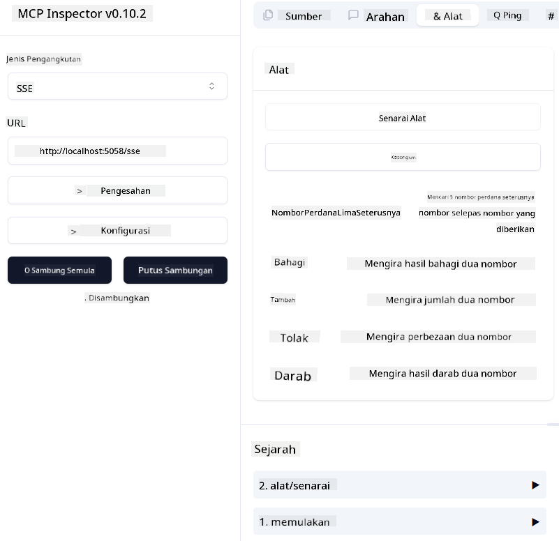
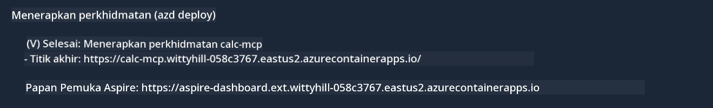

<!--
CO_OP_TRANSLATOR_METADATA:
{
  "original_hash": "5020a3e1a1c7f30c00f9e37f1fa208e3",
  "translation_date": "2025-05-17T14:10:54+00:00",
  "source_file": "04-PracticalImplementation/samples/csharp/README.md",
  "language_code": "ms"
}
-->
# Contoh

Contoh sebelumnya menunjukkan cara menggunakan projek .NET tempatan dengan jenis `sdio`. Dan cara menjalankan pelayan secara tempatan dalam kontena. Ini adalah penyelesaian yang baik dalam banyak situasi. Namun, ia boleh berguna untuk menjalankan pelayan secara jauh, seperti dalam persekitaran awan. Di sinilah jenis `http` digunakan.

Melihat penyelesaian dalam folder `04-PracticalImplementation`, ia mungkin kelihatan lebih kompleks daripada yang sebelumnya. Tetapi sebenarnya, tidak begitu. Jika anda lihat dengan teliti projek `src/mcpserver/mcpserver.csproj`, anda akan melihat bahawa ia kebanyakannya adalah kod yang sama seperti contoh sebelumnya. Perbezaan utama adalah kita menggunakan perpustakaan yang berbeza `ModelContextProtocol.AspNetCore` untuk mengendalikan permintaan HTTP. Dan kita mengubah kaedah `IsPrime` menjadi peribadi, hanya untuk menunjukkan bahawa anda boleh mempunyai kaedah peribadi dalam kod anda. Selebihnya kod adalah sama seperti sebelumnya.

Projek lain adalah dari [.NET Aspire](https://learn.microsoft.com/dotnet/aspire/get-started/aspire-overview). Mempunyai .NET Aspire dalam penyelesaian akan meningkatkan pengalaman pembangun semasa membangun dan menguji dan membantu dengan keterlihatan. Ia tidak diperlukan untuk menjalankan pelayan, tetapi adalah amalan yang baik untuk memilikinya dalam penyelesaian anda.

## Mulakan pelayan secara tempatan

1. Dari VS Code (dengan sambungan C# DevKit), buka penyelesaian `04-PracticalImplementation\samples\csharp\src\Calculator-chap4.sln`.
2. Tekan `F5` untuk memulakan pelayan. Ia sepatutnya membuka pelayar web dengan papan pemuka .NET Aspire.

atau

1. Dari terminal, pergi ke folder `04-PracticalImplementation\samples\csharp\src`
2. Jalankan arahan berikut untuk memulakan pelayan:
   ```bash
    dotnet run --project .\AppHost
   ```

3. Dari Papan Pemuka, perhatikan URL `http`. Ia sepatutnya kelihatan seperti `http://localhost:5058/`.

## Test `SSE` dengan ModelContext Protocol Inspector

Jika anda mempunyai Node.js 22.7.5 dan ke atas, anda boleh menggunakan ModelContext Protocol Inspector untuk menguji pelayan anda.

Mulakan pelayan dan jalankan arahan berikut dalam terminal:

```bash
npx @modelcontextprotocol/inspector@latest
```



- Pilih `SSE` as the Transport type. SSE stand for Server-Sent Events. 
- In the Url field, enter the URL of the server noted earlier,and append `/sse`. Ia sepatutnya `http` (bukan `https`) something like `http://localhost:5058/sse`.
- select the Connect button.

A nice thing about the Inspector is that it provide a nice visibility on what is happening.

- Try listing the availables tools
- Try some of them, it should works just like before.


## Test `SSE` with Github Copilot Chat in VS Code

To use the `SSE` transport with Github Copilot Chat, change the configuration of the `mcp-calc` pelayan yang dibuat sebelumnya untuk kelihatan seperti ini:

```json
"mcp-calc": {
    "type": "sse",
    "url": "http://localhost:5058/sse"
}
```

Lakukan beberapa ujian:
- Minta 3 nombor perdana selepas 6780. Perhatikan bagaimana Copilot akan menggunakan alat baru `NextFivePrimeNumbers` dan hanya mengembalikan 3 nombor perdana pertama.
- Minta 7 nombor perdana selepas 111, untuk melihat apa yang berlaku.

# Lakukan penyebaran pelayan ke Azure

Mari kita sebarkan pelayan ke Azure supaya lebih ramai orang boleh menggunakannya.

Dari terminal, pergi ke folder `04-PracticalImplementation\samples\csharp\src` dan jalankan arahan berikut:

```bash
azd init
```

Ini akan mencipta beberapa fail secara tempatan untuk menyimpan konfigurasi sumber Azure, dan Infrastruktur anda sebagai kod (IaC).

Kemudian, jalankan arahan berikut untuk menyebarkan pelayan ke Azure:

```bash
azd up
```

Setelah penyebaran selesai, anda sepatutnya melihat mesej seperti ini:



Pergi ke papan pemuka Aspire dan perhatikan URL `HTTP` untuk menggunakannya dalam MCP Inspector dan dalam Github Copilot Chat.

## Apa yang seterusnya?

Kami mencuba pelbagai jenis pengangkutan, dan alat ujian serta kami juga menyebarkan pelayan MCP kami ke Azure. Tetapi bagaimana jika pelayan kami perlu mengakses sumber peribadi? Contohnya, pangkalan data atau API peribadi? Dalam bab seterusnya, kita akan melihat bagaimana kita boleh meningkatkan keselamatan pelayan kita.

**Penafian**:  
Dokumen ini telah diterjemahkan menggunakan perkhidmatan terjemahan AI [Co-op Translator](https://github.com/Azure/co-op-translator). Walaupun kami berusaha untuk ketepatan, sila ambil perhatian bahawa terjemahan automatik mungkin mengandungi kesilapan atau ketidaktepatan. Dokumen asal dalam bahasa asalnya harus dianggap sebagai sumber yang berwibawa. Untuk maklumat kritikal, terjemahan manusia profesional adalah disyorkan. Kami tidak bertanggungjawab atas sebarang salah faham atau salah tafsir yang timbul daripada penggunaan terjemahan ini.