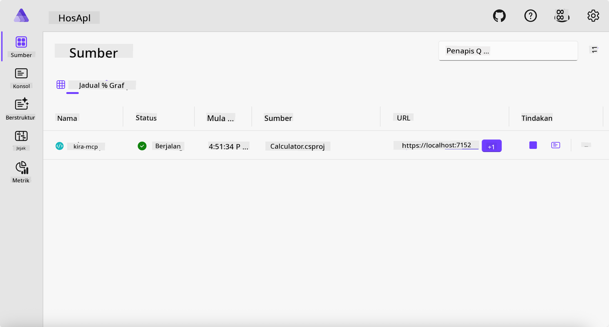
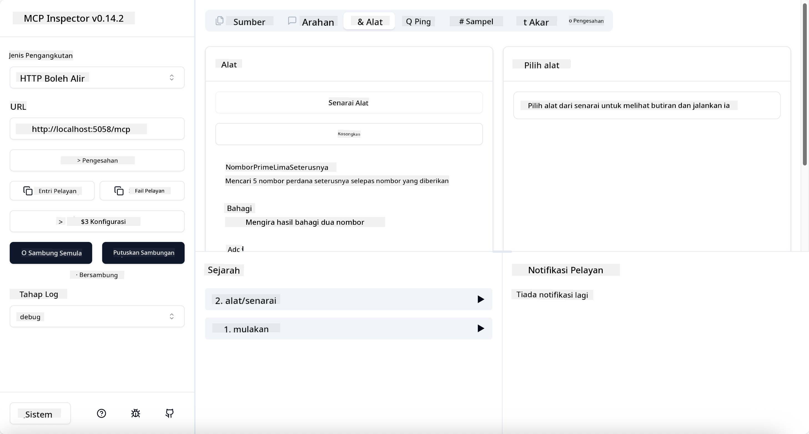

<!--
CO_OP_TRANSLATOR_METADATA:
{
  "original_hash": "0bc7bd48f55f1565f1d95ccb2c16f728",
  "translation_date": "2025-07-13T23:08:39+00:00",
  "source_file": "04-PracticalImplementation/samples/csharp/README.md",
  "language_code": "ms"
}
-->
# Sample

Contoh sebelum ini menunjukkan cara menggunakan projek .NET tempatan dengan jenis `stdio`. Dan bagaimana untuk menjalankan pelayan secara tempatan dalam sebuah kontena. Ini adalah penyelesaian yang baik dalam banyak situasi. Walau bagaimanapun, ia boleh menjadi berguna untuk menjalankan pelayan secara jauh, seperti dalam persekitaran awan. Di sinilah jenis `http` digunakan.

Melihat penyelesaian dalam folder `04-PracticalImplementation`, ia mungkin kelihatan lebih kompleks berbanding yang sebelumnya. Tetapi sebenarnya, ia tidak begitu. Jika anda perhatikan dengan teliti projek `src/Calculator`, anda akan lihat bahawa ia kebanyakannya adalah kod yang sama seperti contoh sebelum ini. Perbezaan satu-satunya ialah kita menggunakan perpustakaan berbeza `ModelContextProtocol.AspNetCore` untuk mengendalikan permintaan HTTP. Dan kita mengubah kaedah `IsPrime` menjadi peribadi, hanya untuk menunjukkan bahawa anda boleh mempunyai kaedah peribadi dalam kod anda. Selebihnya kod adalah sama seperti sebelum ini.

Projek lain adalah dari [.NET Aspire](https://learn.microsoft.com/dotnet/aspire/get-started/aspire-overview). Mempunyai .NET Aspire dalam penyelesaian akan meningkatkan pengalaman pembangun semasa membangunkan dan menguji serta membantu dengan kebolehlihatan. Ia tidak diwajibkan untuk menjalankan pelayan, tetapi adalah amalan yang baik untuk memasukkannya dalam penyelesaian anda.

## Mulakan pelayan secara tempatan

1. Dari VS Code (dengan sambungan C# DevKit), navigasi ke direktori `04-PracticalImplementation/samples/csharp`.
1. Jalankan arahan berikut untuk memulakan pelayan:

   ```bash
    dotnet watch run --project ./src/AppHost
   ```

1. Apabila pelayar web membuka papan pemuka .NET Aspire, perhatikan URL `http`. Ia sepatutnya seperti `http://localhost:5058/`.

   

## Uji Streamable HTTP dengan MCP Inspector

Jika anda mempunyai Node.js 22.7.5 dan ke atas, anda boleh menggunakan MCP Inspector untuk menguji pelayan anda.

Mulakan pelayan dan jalankan arahan berikut dalam terminal:

```bash
npx @modelcontextprotocol/inspector http://localhost:5058
```



- Pilih `Streamable HTTP` sebagai jenis Pengangkutan.
- Dalam medan Url, masukkan URL pelayan yang dicatat tadi, dan tambah `/mcp`. Ia sepatutnya `http` (bukan `https`) seperti `http://localhost:5058/mcp`.
- pilih butang Connect.

Satu perkara yang bagus tentang Inspector ialah ia memberikan kebolehlihatan yang baik tentang apa yang sedang berlaku.

- Cuba senaraikan alat yang tersedia
- Cuba beberapa daripadanya, ia sepatutnya berfungsi seperti sebelum ini.

## Uji MCP Server dengan GitHub Copilot Chat dalam VS Code

Untuk menggunakan pengangkutan Streamable HTTP dengan GitHub Copilot Chat, ubah konfigurasi pelayan `calc-mcp` yang dibuat sebelum ini supaya kelihatan seperti ini:

```jsonc
// .vscode/mcp.json
{
  "servers": {
    "calc-mcp": {
      "type": "http",
      "url": "http://localhost:5058/mcp"
    }
  }
}
```

Lakukan beberapa ujian:

- Minta "3 nombor perdana selepas 6780". Perhatikan bagaimana Copilot akan menggunakan alat baru `NextFivePrimeNumbers` dan hanya mengembalikan 3 nombor perdana pertama.
- Minta "7 nombor perdana selepas 111", untuk melihat apa yang berlaku.
- Minta "John mempunyai 24 gula-gula dan ingin mengagihkannya kepada 3 anaknya. Berapa gula-gula yang setiap anak dapat?", untuk melihat apa yang berlaku.

## Hantar pelayan ke Azure

Mari kita hantar pelayan ke Azure supaya lebih ramai orang boleh menggunakannya.

Dari terminal, navigasi ke folder `04-PracticalImplementation/samples/csharp` dan jalankan arahan berikut:

```bash
azd up
```

Setelah penghantaran selesai, anda sepatutnya melihat mesej seperti ini:


Salin URL tersebut dan gunakan dalam MCP Inspector dan GitHub Copilot Chat.

```jsonc
// .vscode/mcp.json
{
  "servers": {
    "calc-mcp": {
      "type": "http",
      "url": "https://calc-mcp.gentleriver-3977fbcf.australiaeast.azurecontainerapps.io/mcp"
    }
  }
}
```

## Apa seterusnya?

Kita cuba pelbagai jenis pengangkutan dan alat ujian. Kita juga menghantar pelayan MCP anda ke Azure. Tetapi bagaimana jika pelayan kita perlu mengakses sumber peribadi? Contohnya, pangkalan data atau API peribadi? Dalam bab seterusnya, kita akan lihat bagaimana kita boleh meningkatkan keselamatan pelayan kita.

**Penafian**:  
Dokumen ini telah diterjemahkan menggunakan perkhidmatan terjemahan AI [Co-op Translator](https://github.com/Azure/co-op-translator). Walaupun kami berusaha untuk ketepatan, sila ambil perhatian bahawa terjemahan automatik mungkin mengandungi kesilapan atau ketidaktepatan. Dokumen asal dalam bahasa asalnya harus dianggap sebagai sumber yang sahih. Untuk maklumat penting, terjemahan profesional oleh manusia adalah disyorkan. Kami tidak bertanggungjawab atas sebarang salah faham atau salah tafsir yang timbul daripada penggunaan terjemahan ini.