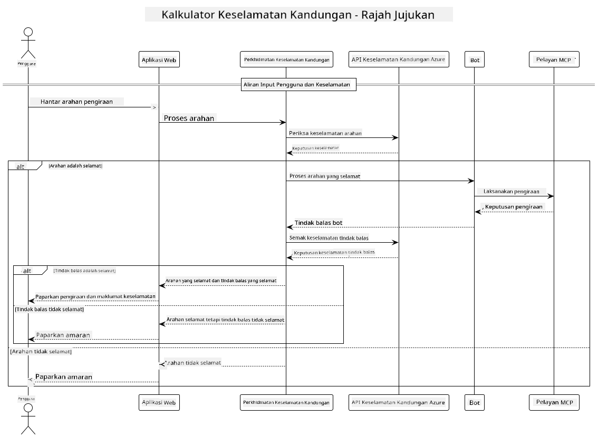

<!--
CO_OP_TRANSLATOR_METADATA:
{
  "original_hash": "e5ea5e7582f70008ea9bec3b3820f20a",
  "translation_date": "2025-05-17T14:29:44+00:00",
  "source_file": "04-PracticalImplementation/samples/java/containerapp/README.md",
  "language_code": "ms"
}
-->
## Seni Bina Sistem

Projek ini menunjukkan aplikasi web yang menggunakan pemeriksaan keselamatan kandungan sebelum menghantar permintaan pengguna kepada perkhidmatan kalkulator melalui Model Context Protocol (MCP).



### Bagaimana Ia Berfungsi

1. **Input Pengguna**: Pengguna memasukkan permintaan pengiraan dalam antara muka web
2. **Pemeriksaan Keselamatan Kandungan (Input)**: Permintaan dianalisis oleh Azure Content Safety API
3. **Keputusan Keselamatan (Input)**:
   - Jika kandungan selamat (keparahan < 2 dalam semua kategori), ia diteruskan kepada kalkulator
   - Jika kandungan ditandai sebagai berpotensi membahayakan, proses berhenti dan memberi amaran
4. **Integrasi Kalkulator**: Kandungan yang selamat diproses oleh LangChain4j, yang berkomunikasi dengan pelayan kalkulator MCP
5. **Pemeriksaan Keselamatan Kandungan (Output)**: Respons bot dianalisis oleh Azure Content Safety API
6. **Keputusan Keselamatan (Output)**:
   - Jika respons bot selamat, ia ditunjukkan kepada pengguna
   - Jika respons bot ditandai sebagai berpotensi membahayakan, ia digantikan dengan amaran
7. **Respons**: Hasil (jika selamat) dipaparkan kepada pengguna bersama dengan kedua-dua analisis keselamatan

## Menggunakan Model Context Protocol (MCP) dengan Perkhidmatan Kalkulator

Projek ini menunjukkan cara menggunakan Model Context Protocol (MCP) untuk memanggil perkhidmatan kalkulator MCP dari LangChain4j. Pelaksanaan menggunakan pelayan MCP tempatan yang berjalan di port 8080 untuk menyediakan operasi kalkulator.

### Menyediakan Perkhidmatan Keselamatan Kandungan Azure

Sebelum menggunakan ciri keselamatan kandungan, anda perlu mencipta sumber perkhidmatan Keselamatan Kandungan Azure:

1. Log masuk ke [Azure Portal](https://portal.azure.com)
2. Klik "Create a resource" dan cari "Content Safety"
3. Pilih "Content Safety" dan klik "Create"
4. Masukkan nama unik untuk sumber anda
5. Pilih langganan dan kumpulan sumber anda (atau cipta yang baru)
6. Pilih kawasan yang disokong (semak [Region availability](https://azure.microsoft.com/en-us/global-infrastructure/services/?products=cognitive-services) untuk maklumat lanjut)
7. Pilih tingkat harga yang sesuai
8. Klik "Create" untuk melancarkan sumber
9. Setelah pelancaran selesai, klik "Go to resource"
10. Di panel kiri, di bawah "Resource Management", pilih "Keys and Endpoint"
11. Salin salah satu kunci dan URL endpoint untuk digunakan dalam langkah seterusnya

### Menyediakan Pemboleh Ubah Persekitaran

Tetapkan pemboleh ubah persekitaran `GITHUB_TOKEN` untuk pengesahan model GitHub:
```sh
export GITHUB_TOKEN=<your_github_token>
```

Untuk ciri keselamatan kandungan, tetapkan:
```sh
export CONTENT_SAFETY_ENDPOINT=<your_content_safety_endpoint>
export CONTENT_SAFETY_KEY=<your_content_safety_key>
```

Pemboleh ubah persekitaran ini digunakan oleh aplikasi untuk mengesahkan dengan perkhidmatan Keselamatan Kandungan Azure. Jika pemboleh ubah ini tidak ditetapkan, aplikasi akan menggunakan nilai pemegang tempat untuk tujuan demonstrasi, tetapi ciri keselamatan kandungan tidak akan berfungsi dengan baik.

### Memulakan Pelayan Kalkulator MCP

Sebelum menjalankan klien, anda perlu memulakan pelayan kalkulator MCP dalam mod SSE pada localhost:8080.

## Penerangan Projek

Projek ini menunjukkan integrasi Model Context Protocol (MCP) dengan LangChain4j untuk memanggil perkhidmatan kalkulator. Ciri-ciri utama termasuk:

- Menggunakan MCP untuk berhubung dengan perkhidmatan kalkulator bagi operasi matematik asas
- Pemeriksaan keselamatan kandungan dua lapisan pada permintaan pengguna dan respons bot
- Integrasi dengan model gpt-4.1-nano GitHub melalui LangChain4j
- Menggunakan Server-Sent Events (SSE) untuk pengangkutan MCP

## Integrasi Keselamatan Kandungan

Projek ini merangkumi ciri keselamatan kandungan yang komprehensif untuk memastikan bahawa kedua-dua input pengguna dan respons sistem bebas daripada kandungan berbahaya:

1. **Pemeriksaan Input**: Semua permintaan pengguna dianalisis untuk kategori kandungan berbahaya seperti ucapan benci, keganasan, mencederakan diri sendiri, dan kandungan seksual sebelum diproses.

2. **Pemeriksaan Output**: Walaupun menggunakan model yang berpotensi tidak ditapis, sistem memeriksa semua respons yang dihasilkan melalui penapis keselamatan kandungan yang sama sebelum memaparkannya kepada pengguna.

Pendekatan dua lapisan ini memastikan sistem tetap selamat tanpa mengira model AI yang digunakan, melindungi pengguna daripada input berbahaya dan output AI yang berpotensi bermasalah.

## Klien Web

Aplikasi ini termasuk antara muka web yang mesra pengguna yang membolehkan pengguna berinteraksi dengan sistem Kalkulator Keselamatan Kandungan:

### Ciri-ciri Antara Muka Web

- Borang mudah dan intuitif untuk memasukkan permintaan pengiraan
- Pengesahan keselamatan kandungan dua lapisan (input dan output)
- Maklum balas masa nyata mengenai keselamatan permintaan dan respons
- Penunjuk keselamatan berkod warna untuk tafsiran mudah
- Reka bentuk bersih dan responsif yang berfungsi pada pelbagai peranti
- Contoh permintaan selamat untuk membimbing pengguna

### Menggunakan Klien Web

1. Mulakan aplikasi:
   ```sh
   mvn spring-boot:run
   ```

2. Buka pelayar anda dan pergi ke `http://localhost:8087`

3. Masukkan permintaan pengiraan dalam kawasan teks yang disediakan (contohnya, "Hitung jumlah 24.5 dan 17.3")

4. Klik "Submit" untuk memproses permintaan anda

5. Lihat hasilnya, yang akan merangkumi:
   - Analisis keselamatan kandungan permintaan anda
   - Hasil pengiraan (jika permintaan selamat)
   - Analisis keselamatan kandungan respons bot
   - Sebarang amaran keselamatan jika sama ada input atau output ditandai

Klien web secara automatik mengendalikan kedua-dua proses pengesahan keselamatan kandungan, memastikan semua interaksi selamat dan sesuai tanpa mengira model AI yang digunakan.

**Penafian**:  
Dokumen ini telah diterjemahkan menggunakan perkhidmatan terjemahan AI [Co-op Translator](https://github.com/Azure/co-op-translator). Walaupun kami berusaha untuk ketepatan, sila ambil perhatian bahawa terjemahan automatik mungkin mengandungi kesilapan atau ketidaktepatan. Dokumen asal dalam bahasa asalnya harus dianggap sebagai sumber yang berwibawa. Untuk maklumat kritikal, terjemahan manusia profesional adalah disyorkan. Kami tidak bertanggungjawab atas sebarang salah faham atau salah tafsir yang timbul daripada penggunaan terjemahan ini.