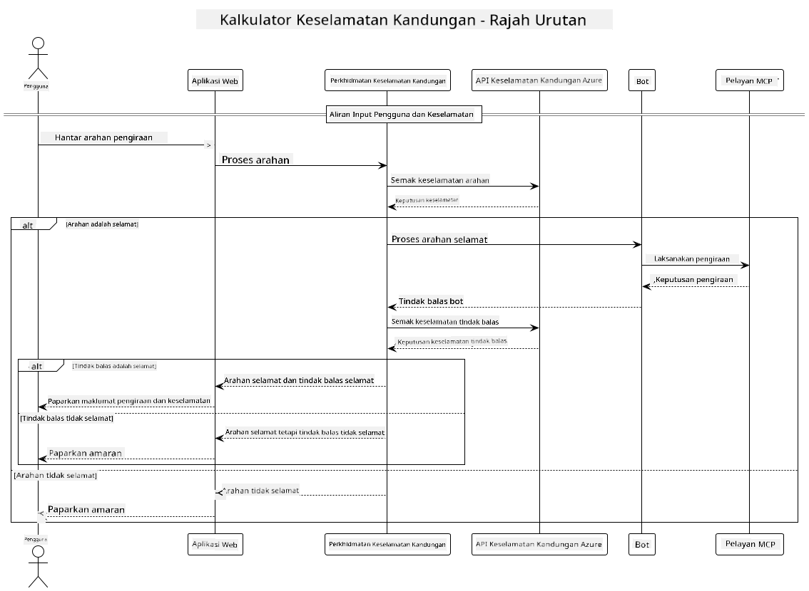

<!--
CO_OP_TRANSLATOR_METADATA:
{
  "original_hash": "e5ea5e7582f70008ea9bec3b3820f20a",
  "translation_date": "2025-07-13T23:18:40+00:00",
  "source_file": "04-PracticalImplementation/samples/java/containerapp/README.md",
  "language_code": "ms"
}
-->
## Seni Bina Sistem

Projek ini menunjukkan aplikasi web yang menggunakan pemeriksaan keselamatan kandungan sebelum menghantar arahan pengguna ke perkhidmatan kalkulator melalui Model Context Protocol (MCP).



### Cara Ia Berfungsi

1. **Input Pengguna**: Pengguna memasukkan arahan pengiraan dalam antara muka web  
2. **Saringan Keselamatan Kandungan (Input)**: Arahan dianalisis oleh Azure Content Safety API  
3. **Keputusan Keselamatan (Input)**:  
   - Jika kandungan selamat (keparahan < 2 dalam semua kategori), ia diteruskan ke kalkulator  
   - Jika kandungan ditandakan sebagai berpotensi berbahaya, proses dihentikan dan amaran dipaparkan  
4. **Integrasi Kalkulator**: Kandungan selamat diproses oleh LangChain4j, yang berkomunikasi dengan pelayan kalkulator MCP  
5. **Saringan Keselamatan Kandungan (Output)**: Respons bot dianalisis oleh Azure Content Safety API  
6. **Keputusan Keselamatan (Output)**:  
   - Jika respons bot selamat, ia dipaparkan kepada pengguna  
   - Jika respons bot ditandakan sebagai berpotensi berbahaya, ia digantikan dengan amaran  
7. **Respons**: Keputusan (jika selamat) dipaparkan kepada pengguna bersama kedua-dua analisis keselamatan

## Menggunakan Model Context Protocol (MCP) dengan Perkhidmatan Kalkulator

Projek ini menunjukkan cara menggunakan Model Context Protocol (MCP) untuk memanggil perkhidmatan kalkulator MCP dari LangChain4j. Pelaksanaan menggunakan pelayan MCP tempatan yang berjalan pada port 8080 untuk menyediakan operasi kalkulator.

### Menyediakan Perkhidmatan Azure Content Safety

Sebelum menggunakan ciri keselamatan kandungan, anda perlu mencipta sumber perkhidmatan Azure Content Safety:

1. Log masuk ke [Azure Portal](https://portal.azure.com)  
2. Klik "Create a resource" dan cari "Content Safety"  
3. Pilih "Content Safety" dan klik "Create"  
4. Masukkan nama unik untuk sumber anda  
5. Pilih langganan dan kumpulan sumber anda (atau cipta yang baru)  
6. Pilih rantau yang disokong (semak [Ketersediaan Rantau](https://azure.microsoft.com/en-us/global-infrastructure/services/?products=cognitive-services) untuk maklumat lanjut)  
7. Pilih pelan harga yang sesuai  
8. Klik "Create" untuk melancarkan sumber  
9. Setelah pelancaran selesai, klik "Go to resource"  
10. Di panel kiri, di bawah "Resource Management", pilih "Keys and Endpoint"  
11. Salin salah satu kunci dan URL endpoint untuk digunakan dalam langkah seterusnya

### Mengkonfigurasi Pembolehubah Persekitaran

Tetapkan pembolehubah persekitaran `GITHUB_TOKEN` untuk pengesahan model GitHub:  
```sh
export GITHUB_TOKEN=<your_github_token>
```

Untuk ciri keselamatan kandungan, tetapkan:  
```sh
export CONTENT_SAFETY_ENDPOINT=<your_content_safety_endpoint>
export CONTENT_SAFETY_KEY=<your_content_safety_key>
```

Pembolehubah persekitaran ini digunakan oleh aplikasi untuk mengesahkan dengan perkhidmatan Azure Content Safety. Jika pembolehubah ini tidak ditetapkan, aplikasi akan menggunakan nilai tempat untuk tujuan demonstrasi, tetapi ciri keselamatan kandungan tidak akan berfungsi dengan betul.

### Memulakan Pelayan MCP Kalkulator

Sebelum menjalankan klien, anda perlu memulakan pelayan MCP kalkulator dalam mod SSE pada localhost:8080.

## Penerangan Projek

Projek ini menunjukkan integrasi Model Context Protocol (MCP) dengan LangChain4j untuk memanggil perkhidmatan kalkulator. Ciri utama termasuk:

- Menggunakan MCP untuk menyambung ke perkhidmatan kalkulator bagi operasi matematik asas  
- Pemeriksaan keselamatan kandungan dua lapisan pada arahan pengguna dan respons bot  
- Integrasi dengan model gpt-4.1-nano GitHub melalui LangChain4j  
- Menggunakan Server-Sent Events (SSE) untuk pengangkutan MCP

## Integrasi Keselamatan Kandungan

Projek ini merangkumi ciri keselamatan kandungan yang menyeluruh untuk memastikan input pengguna dan respons sistem bebas daripada kandungan berbahaya:

1. **Saringan Input**: Semua arahan pengguna dianalisis untuk kategori kandungan berbahaya seperti ucapan kebencian, keganasan, mencederakan diri sendiri, dan kandungan seksual sebelum diproses.

2. **Saringan Output**: Walaupun menggunakan model yang mungkin tidak disensor, sistem memeriksa semua respons yang dijana melalui penapis keselamatan kandungan yang sama sebelum memaparkannya kepada pengguna.

Pendekatan dua lapisan ini memastikan sistem kekal selamat tanpa mengira model AI yang digunakan, melindungi pengguna daripada input berbahaya dan output AI yang berpotensi bermasalah.

## Klien Web

Aplikasi ini termasuk antara muka web mesra pengguna yang membolehkan pengguna berinteraksi dengan sistem Content Safety Calculator:

### Ciri Antara Muka Web

- Borang mudah dan intuitif untuk memasukkan arahan pengiraan  
- Pengesahan keselamatan kandungan dua lapisan (input dan output)  
- Maklum balas masa nyata mengenai keselamatan arahan dan respons  
- Penunjuk keselamatan berwarna untuk memudahkan tafsiran  
- Reka bentuk bersih dan responsif yang berfungsi pada pelbagai peranti  
- Contoh arahan selamat untuk membimbing pengguna

### Menggunakan Klien Web

1. Mulakan aplikasi:  
   ```sh
   mvn spring-boot:run
   ```

2. Buka pelayar anda dan pergi ke `http://localhost:8087`

3. Masukkan arahan pengiraan dalam ruang teks yang disediakan (contoh: "Calculate the sum of 24.5 and 17.3")

4. Klik "Submit" untuk memproses permintaan anda

5. Lihat keputusan, yang akan merangkumi:  
   - Analisis keselamatan kandungan arahan anda  
   - Keputusan pengiraan (jika arahan selamat)  
   - Analisis keselamatan kandungan respons bot  
   - Sebarang amaran keselamatan jika input atau output ditandakan

Klien web secara automatik mengendalikan kedua-dua proses pengesahan keselamatan kandungan, memastikan semua interaksi selamat dan sesuai tanpa mengira model AI yang digunakan.

**Penafian**:  
Dokumen ini telah diterjemahkan menggunakan perkhidmatan terjemahan AI [Co-op Translator](https://github.com/Azure/co-op-translator). Walaupun kami berusaha untuk ketepatan, sila ambil maklum bahawa terjemahan automatik mungkin mengandungi kesilapan atau ketidaktepatan. Dokumen asal dalam bahasa asalnya harus dianggap sebagai sumber yang sahih. Untuk maklumat penting, terjemahan profesional oleh manusia adalah disyorkan. Kami tidak bertanggungjawab atas sebarang salah faham atau salah tafsir yang timbul daripada penggunaan terjemahan ini.