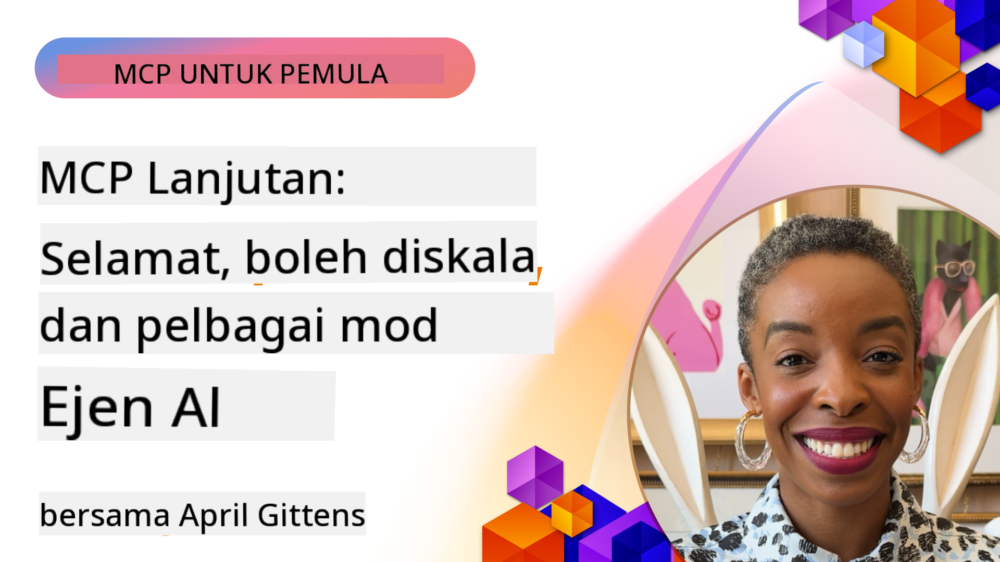

<!--
CO_OP_TRANSLATOR_METADATA:
{
  "original_hash": "d204bc94ea6027d06a703b21b711ca57",
  "translation_date": "2025-08-18T17:54:58+00:00",
  "source_file": "05-AdvancedTopics/README.md",
  "language_code": "ms"
}
-->
# Topik Lanjutan dalam MCP

_(Klik imej di atas untuk menonton video pelajaran ini)_

Bab ini merangkumi siri topik lanjutan dalam pelaksanaan Model Context Protocol (MCP), termasuk integrasi multi-modal, skalabiliti, amalan terbaik keselamatan, dan integrasi perusahaan. Topik-topik ini penting untuk membina aplikasi MCP yang kukuh dan sedia untuk pengeluaran yang dapat memenuhi keperluan sistem AI moden.

## Gambaran Keseluruhan

Pelajaran ini meneroka konsep lanjutan dalam pelaksanaan Model Context Protocol, dengan fokus pada integrasi multi-modal, skalabiliti, amalan terbaik keselamatan, dan integrasi perusahaan. Topik-topik ini penting untuk membina aplikasi MCP yang berkualiti pengeluaran yang mampu menangani keperluan kompleks dalam persekitaran perusahaan.

## Objektif Pembelajaran

Pada akhir pelajaran ini, anda akan dapat:

- Melaksanakan keupayaan multi-modal dalam rangka kerja MCP
- Merancang seni bina MCP yang skalabel untuk senario permintaan tinggi
- Mengaplikasikan amalan terbaik keselamatan yang selaras dengan prinsip keselamatan MCP
- Mengintegrasikan MCP dengan sistem dan rangka kerja AI perusahaan
- Mengoptimumkan prestasi dan kebolehpercayaan dalam persekitaran pengeluaran

## Pelajaran dan Projek Contoh

| Pautan | Tajuk | Penerangan |
|--------|-------|------------|
| [5.1 Integrasi dengan Azure](./mcp-integration/README.md) | Integrasi dengan Azure | Belajar cara mengintegrasikan MCP Server anda di Azure |
| [5.2 Contoh Multi-modal](./mcp-multi-modality/README.md) | Contoh Multi-modal MCP | Contoh untuk audio, imej, dan respons multi-modal |
| [5.3 Contoh MCP OAuth2](../../../05-AdvancedTopics/mcp-oauth2-demo) | Demo MCP OAuth2 | Aplikasi Spring Boot minimal yang menunjukkan OAuth2 dengan MCP, sebagai Authorization dan Resource Server. Menunjukkan pengeluaran token yang selamat, titik akhir yang dilindungi, penyebaran Azure Container Apps, dan integrasi Pengurusan API. |
| [5.4 Konteks Root](./mcp-root-contexts/README.md) | Konteks Root | Ketahui lebih lanjut tentang konteks root dan cara melaksanakannya |
| [5.5 Penghalaan](./mcp-routing/README.md) | Penghalaan | Belajar jenis-jenis penghalaan |
| [5.6 Persampelan](./mcp-sampling/README.md) | Persampelan | Belajar cara bekerja dengan persampelan |
| [5.7 Skalabiliti](./mcp-scaling/README.md) | Skalabiliti | Ketahui tentang skalabiliti |
| [5.8 Keselamatan](./mcp-security/README.md) | Keselamatan | Lindungi MCP Server anda |
| [5.9 Contoh Carian Web](./web-search-mcp/README.md) | MCP Carian Web | MCP server dan klien Python yang mengintegrasikan dengan SerpAPI untuk carian web, berita, produk secara masa nyata, dan Q&A. Menunjukkan orkestrasi alat multi, integrasi API luaran, dan pengendalian ralat yang kukuh. |
| [5.10 Penstriman Masa Nyata](./mcp-realtimestreaming/README.md) | Penstriman | Penstriman data masa nyata menjadi penting dalam dunia yang didorong oleh data hari ini, di mana perniagaan dan aplikasi memerlukan akses segera kepada maklumat untuk membuat keputusan tepat pada masanya. |
| [5.11 Carian Web Masa Nyata](./mcp-realtimesearch/README.md) | Carian Web | Carian web masa nyata bagaimana MCP mengubah carian web masa nyata dengan menyediakan pendekatan standard untuk pengurusan konteks di seluruh model AI, enjin carian, dan aplikasi. |
| [5.12 Pengesahan Entra ID untuk Pelayan Model Context Protocol](./mcp-security-entra/README.md) | Pengesahan Entra ID | Microsoft Entra ID menyediakan penyelesaian pengurusan identiti dan akses berasaskan awan yang kukuh, membantu memastikan hanya pengguna dan aplikasi yang diberi kuasa dapat berinteraksi dengan pelayan MCP anda. |
| [5.13 Integrasi Ejen Azure AI Foundry](./mcp-foundry-agent-integration/README.md) | Integrasi Azure AI Foundry | Belajar cara mengintegrasikan pelayan Model Context Protocol dengan ejen Azure AI Foundry, membolehkan orkestrasi alat yang kuat dan keupayaan AI perusahaan dengan sambungan sumber data luaran yang standard. |
| [5.14 Kejuruteraan Konteks](./mcp-contextengineering/README.md) | Kejuruteraan Konteks | Peluang masa depan teknik kejuruteraan konteks untuk pelayan MCP, termasuk pengoptimuman konteks, pengurusan konteks dinamik, dan strategi untuk kejuruteraan prompt yang berkesan dalam rangka kerja MCP. |

## Rujukan Tambahan

Untuk maklumat terkini mengenai topik MCP lanjutan, rujuk:
- [Dokumentasi MCP](https://modelcontextprotocol.io/)
- [Spesifikasi MCP](https://spec.modelcontextprotocol.io/)
- [Repositori GitHub](https://github.com/modelcontextprotocol)

## Poin Penting

- Pelaksanaan MCP multi-modal memperluaskan keupayaan AI melebihi pemprosesan teks
- Skalabiliti adalah penting untuk penyebaran perusahaan dan boleh ditangani melalui skalabiliti mendatar dan menegak
- Langkah keselamatan yang komprehensif melindungi data dan memastikan kawalan akses yang betul
- Integrasi perusahaan dengan platform seperti Azure OpenAI dan Microsoft AI Foundry meningkatkan keupayaan MCP
- Pelaksanaan MCP lanjutan mendapat manfaat daripada seni bina yang dioptimumkan dan pengurusan sumber yang teliti

## Latihan

Reka bentuk pelaksanaan MCP berkualiti perusahaan untuk kes penggunaan tertentu:

1. Kenal pasti keperluan multi-modal untuk kes penggunaan anda
2. Gariskan kawalan keselamatan yang diperlukan untuk melindungi data sensitif
3. Reka bentuk seni bina yang skalabel yang dapat menangani beban yang berbeza
4. Rancang titik integrasi dengan sistem AI perusahaan
5. Dokumentasikan potensi halangan prestasi dan strategi mitigasi

## Sumber Tambahan

- [Dokumentasi Azure OpenAI](https://learn.microsoft.com/en-us/azure/ai-services/openai/)
- [Dokumentasi Microsoft AI Foundry](https://learn.microsoft.com/en-us/ai-services/)

---

## Apa Seterusnya

- [5.1 Integrasi MCP](./mcp-integration/README.md)

**Penafian**:  
Dokumen ini telah diterjemahkan menggunakan perkhidmatan terjemahan AI [Co-op Translator](https://github.com/Azure/co-op-translator). Walaupun kami berusaha untuk memastikan ketepatan, sila ambil maklum bahawa terjemahan automatik mungkin mengandungi kesilapan atau ketidaktepatan. Dokumen asal dalam bahasa asalnya harus dianggap sebagai sumber yang berwibawa. Untuk maklumat penting, terjemahan manusia profesional adalah disyorkan. Kami tidak bertanggungjawab atas sebarang salah faham atau salah tafsir yang timbul daripada penggunaan terjemahan ini.