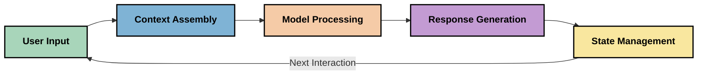
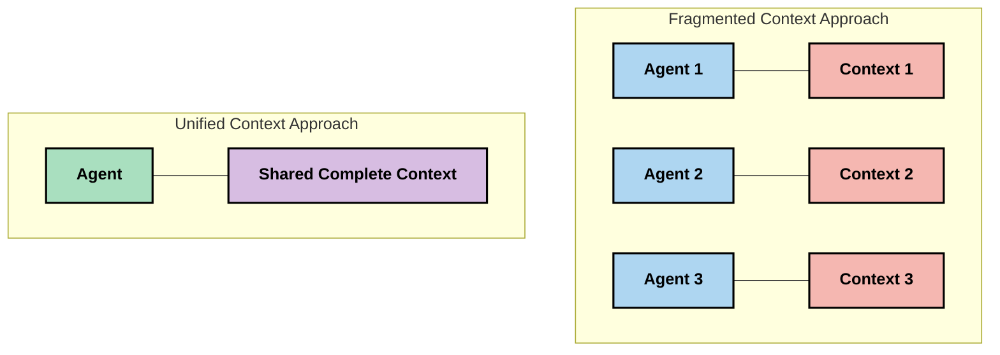
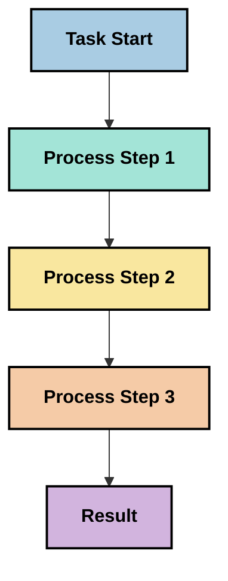
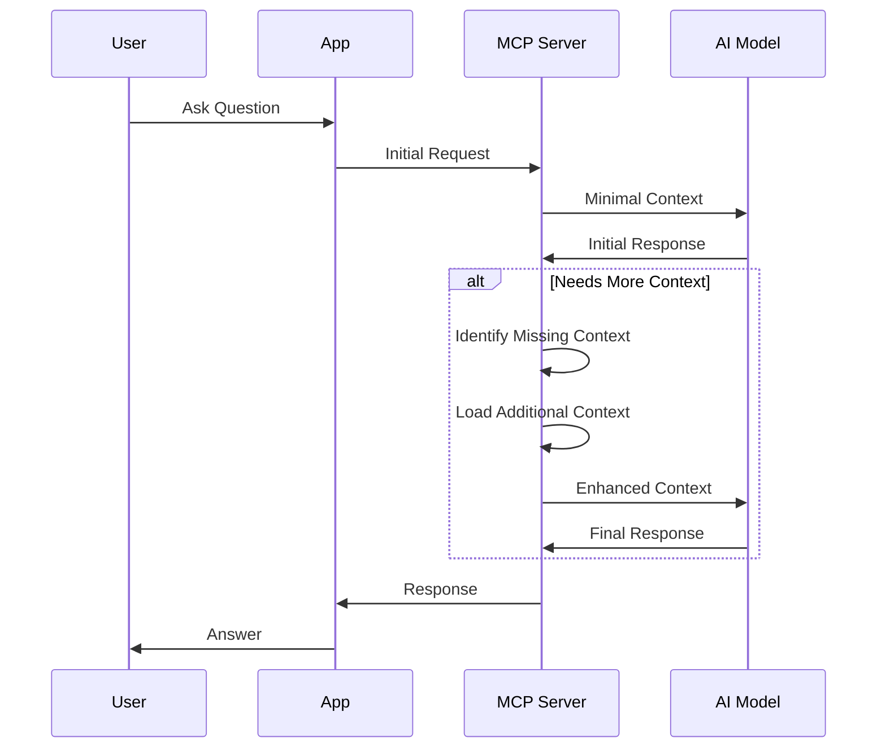
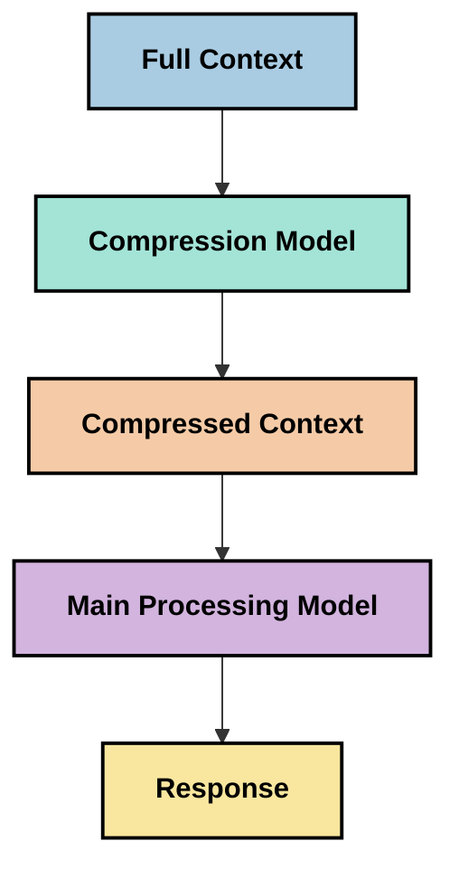
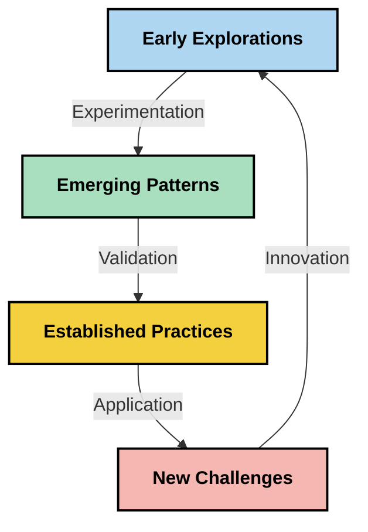

<!--
CO_OP_TRANSLATOR_METADATA:
{
  "original_hash": "5762e8e74dd99d8b7dbb31e69a82561e",
  "translation_date": "2025-07-17T08:41:59+00:00",
  "source_file": "05-AdvancedTopics/mcp-contextengineering/README.md",
  "language_code": "ms"
}
-->
# Kejuruteraan Konteks: Konsep Baru dalam Ekosistem MCP

## Gambaran Keseluruhan

Kejuruteraan konteks adalah konsep baru dalam ruang AI yang meneroka bagaimana maklumat disusun, disampaikan, dan dikekalkan sepanjang interaksi antara pelanggan dan perkhidmatan AI. Seiring dengan evolusi ekosistem Model Context Protocol (MCP), pemahaman tentang cara mengurus konteks dengan berkesan menjadi semakin penting. Modul ini memperkenalkan konsep kejuruteraan konteks dan meneroka potensi aplikasinya dalam pelaksanaan MCP.

## Objektif Pembelajaran

Menjelang akhir modul ini, anda akan dapat:

- Memahami konsep baru kejuruteraan konteks dan peranannya dalam aplikasi MCP
- Mengenal pasti cabaran utama dalam pengurusan konteks yang ditangani oleh reka bentuk protokol MCP
- Meneroka teknik untuk meningkatkan prestasi model melalui pengurusan konteks yang lebih baik
- Mempertimbangkan pendekatan untuk mengukur dan menilai keberkesanan konteks
- Mengaplikasikan konsep baru ini untuk memperbaiki pengalaman AI melalui rangka kerja MCP

## Pengenalan kepada Kejuruteraan Konteks

Kejuruteraan konteks adalah konsep baru yang menumpukan pada reka bentuk dan pengurusan aliran maklumat antara pengguna, aplikasi, dan model AI secara sengaja. Berbeza dengan bidang yang sudah mantap seperti kejuruteraan prompt, kejuruteraan konteks masih dalam proses definisi oleh para pengamal yang berusaha menyelesaikan cabaran unik dalam menyediakan maklumat yang tepat kepada model AI pada masa yang sesuai.

Seiring dengan evolusi model bahasa besar (LLM), kepentingan konteks menjadi semakin jelas. Kualiti, kesesuaian, dan struktur konteks yang kita berikan secara langsung mempengaruhi output model. Kejuruteraan konteks meneroka hubungan ini dan berusaha membangunkan prinsip untuk pengurusan konteks yang berkesan.

> "Pada tahun 2025, model-model yang ada sangat pintar. Tetapi walaupun manusia paling bijak tidak akan dapat menjalankan tugas mereka dengan berkesan tanpa konteks apa yang diminta... 'Kejuruteraan konteks' adalah tahap seterusnya dalam kejuruteraan prompt. Ia mengenai melakukan ini secara automatik dalam sistem dinamik." — Walden Yan, Cognition AI

Kejuruteraan konteks mungkin merangkumi:

1. **Pemilihan Konteks**: Menentukan maklumat yang relevan untuk tugasan tertentu  
2. **Penyusunan Konteks**: Mengatur maklumat untuk memaksimumkan kefahaman model  
3. **Penyampaian Konteks**: Mengoptimumkan cara dan masa maklumat dihantar kepada model  
4. **Penyelenggaraan Konteks**: Mengurus keadaan dan evolusi konteks dari masa ke masa  
5. **Penilaian Konteks**: Mengukur dan memperbaiki keberkesanan konteks  

Bidang fokus ini sangat relevan dengan ekosistem MCP, yang menyediakan cara standard untuk aplikasi memberikan konteks kepada LLM.

## Perspektif Perjalanan Konteks

Salah satu cara untuk memvisualisasikan kejuruteraan konteks adalah dengan menjejaki perjalanan maklumat melalui sistem MCP:



### Tahap Utama dalam Perjalanan Konteks:

1. **Input Pengguna**: Maklumat mentah dari pengguna (teks, imej, dokumen)  
2. **Penyusunan Konteks**: Menggabungkan input pengguna dengan konteks sistem, sejarah perbualan, dan maklumat lain yang diperoleh  
3. **Pemprosesan Model**: Model AI memproses konteks yang telah disusun  
4. **Penjanaan Respons**: Model menghasilkan output berdasarkan konteks yang diberikan  
5. **Pengurusan Keadaan**: Sistem mengemas kini keadaan dalaman berdasarkan interaksi  

Perspektif ini menonjolkan sifat dinamik konteks dalam sistem AI dan menimbulkan persoalan penting tentang cara terbaik mengurus maklumat pada setiap tahap.

## Prinsip Baru dalam Kejuruteraan Konteks

Seiring bidang kejuruteraan konteks berkembang, beberapa prinsip awal mula muncul daripada para pengamal. Prinsip ini mungkin membantu dalam membuat pilihan pelaksanaan MCP:

### Prinsip 1: Kongsi Konteks Secara Lengkap

Konteks harus dikongsi sepenuhnya antara semua komponen sistem dan tidak terpecah-pecah di antara agen atau proses yang berbeza. Apabila konteks diagihkan, keputusan yang dibuat di satu bahagian sistem mungkin bertentangan dengan keputusan di bahagian lain.



Dalam aplikasi MCP, ini mencadangkan reka bentuk sistem di mana konteks mengalir lancar melalui keseluruhan rangkaian dan tidak dipisahkan.

### Prinsip 2: Sedari Bahawa Tindakan Membawa Keputusan Tersirat

Setiap tindakan yang diambil oleh model mengandungi keputusan tersirat tentang cara mentafsir konteks. Apabila beberapa komponen bertindak berdasarkan konteks yang berbeza, keputusan tersirat ini boleh bertentangan, menyebabkan hasil yang tidak konsisten.

Prinsip ini mempunyai implikasi penting untuk aplikasi MCP:  
- Utamakan pemprosesan linear untuk tugasan kompleks berbanding pelaksanaan selari dengan konteks yang terpecah  
- Pastikan semua titik keputusan mempunyai akses kepada maklumat konteks yang sama  
- Reka bentuk sistem supaya langkah-langkah berikut dapat melihat keseluruhan konteks keputusan terdahulu  

### Prinsip 3: Imbangi Kedalaman Konteks dengan Had Tetingkap

Apabila perbualan dan proses menjadi lebih panjang, tetingkap konteks akhirnya akan penuh. Kejuruteraan konteks yang berkesan meneroka pendekatan untuk mengurus ketegangan antara konteks yang menyeluruh dan had teknikal.

Pendekatan yang sedang diteroka termasuk:  
- Pemampatan konteks yang mengekalkan maklumat penting sambil mengurangkan penggunaan token  
- Pemuatan konteks secara progresif berdasarkan kepentingan kepada keperluan semasa  
- Ringkasan interaksi sebelumnya sambil mengekalkan keputusan dan fakta utama  

## Cabaran Konteks dan Reka Bentuk Protokol MCP

Model Context Protocol (MCP) direka dengan kesedaran terhadap cabaran unik dalam pengurusan konteks. Memahami cabaran ini membantu menjelaskan aspek utama reka bentuk protokol MCP:

### Cabaran 1: Had Tetingkap Konteks  
Kebanyakan model AI mempunyai saiz tetingkap konteks yang tetap, mengehadkan jumlah maklumat yang boleh diproses sekaligus.

**Respons Reka Bentuk MCP:**  
- Protokol menyokong konteks berstruktur berasaskan sumber yang boleh dirujuk dengan cekap  
- Sumber boleh dipaginasi dan dimuatkan secara progresif  

### Cabaran 2: Penentuan Kesesuaian  
Menentukan maklumat mana yang paling relevan untuk dimasukkan dalam konteks adalah sukar.

**Respons Reka Bentuk MCP:**  
- Alat fleksibel membolehkan pengambilan maklumat secara dinamik berdasarkan keperluan  
- Prompt berstruktur membolehkan organisasi konteks yang konsisten  

### Cabaran 3: Ketahanan Konteks  
Mengurus keadaan sepanjang interaksi memerlukan penjejakan konteks yang teliti.

**Respons Reka Bentuk MCP:**  
- Pengurusan sesi yang distandardkan  
- Corak interaksi yang jelas untuk evolusi konteks  

### Cabaran 4: Konteks Multi-Modal  
Jenis data yang berbeza (teks, imej, data berstruktur) memerlukan pengendalian yang berbeza.

**Respons Reka Bentuk MCP:**  
- Reka bentuk protokol mengakomodasi pelbagai jenis kandungan  
- Representasi standard maklumat multi-modal  

### Cabaran 5: Keselamatan dan Privasi  
Konteks sering mengandungi maklumat sensitif yang mesti dilindungi.

**Respons Reka Bentuk MCP:**  
- Sempadan jelas antara tanggungjawab klien dan pelayan  
- Pilihan pemprosesan tempatan untuk meminimumkan pendedahan data  

Memahami cabaran ini dan bagaimana MCP menanganinya menyediakan asas untuk meneroka teknik kejuruteraan konteks yang lebih maju.

## Pendekatan Baru dalam Kejuruteraan Konteks

Seiring bidang kejuruteraan konteks berkembang, beberapa pendekatan menjanjikan mula muncul. Ini mewakili pemikiran semasa dan bukan amalan terbaik yang sudah mantap, dan mungkin akan berkembang seiring pengalaman pelaksanaan MCP bertambah.

### 1. Pemprosesan Linear Berbenang Tunggal

Berbeza dengan seni bina multi-agen yang mengagihkan konteks, sesetengah pengamal mendapati pemprosesan linear berbenang tunggal menghasilkan keputusan yang lebih konsisten. Ini selaras dengan prinsip mengekalkan konteks yang bersatu.



Walaupun pendekatan ini mungkin kelihatan kurang cekap berbanding pemprosesan selari, ia sering menghasilkan keputusan yang lebih koheren dan boleh dipercayai kerana setiap langkah dibina atas pemahaman lengkap keputusan sebelumnya.

### 2. Pemecahan dan Keutamaan Konteks

Memecahkan konteks besar kepada bahagian yang boleh diurus dan mengutamakan apa yang paling penting.

```python
# Conceptual Example: Context Chunking and Prioritization
def process_with_chunked_context(documents, query):
    # 1. Break documents into smaller chunks
    chunks = chunk_documents(documents)
    
    # 2. Calculate relevance scores for each chunk
    scored_chunks = [(chunk, calculate_relevance(chunk, query)) for chunk in chunks]
    
    # 3. Sort chunks by relevance score
    sorted_chunks = sorted(scored_chunks, key=lambda x: x[1], reverse=True)
    
    # 4. Use the most relevant chunks as context
    context = create_context_from_chunks([chunk for chunk, score in sorted_chunks[:5]])
    
    # 5. Process with the prioritized context
    return generate_response(context, query)
```

Konsep di atas menggambarkan bagaimana kita boleh memecahkan dokumen besar kepada bahagian yang boleh diurus dan memilih hanya bahagian yang paling relevan untuk konteks. Pendekatan ini membantu bekerja dalam had tetingkap konteks sambil memanfaatkan pangkalan pengetahuan yang besar.

### 3. Pemuatan Konteks Progresif

Memuatkan konteks secara progresif mengikut keperluan dan bukan sekaligus.



Pemuatan konteks progresif bermula dengan konteks minimum dan berkembang hanya apabila perlu. Ini boleh mengurangkan penggunaan token dengan ketara untuk pertanyaan mudah sambil mengekalkan keupayaan untuk menangani soalan kompleks.

### 4. Pemampatan dan Ringkasan Konteks

Mengurangkan saiz konteks sambil mengekalkan maklumat penting.



Pemampatan konteks menumpukan pada:  
- Menghapuskan maklumat berulang  
- Meringkaskan kandungan panjang  
- Mengekstrak fakta dan butiran utama  
- Mengekalkan elemen konteks kritikal  
- Mengoptimumkan penggunaan token  

Pendekatan ini amat berguna untuk mengekalkan perbualan panjang dalam tetingkap konteks atau memproses dokumen besar dengan cekap. Sesetengah pengamal menggunakan model khusus untuk pemampatan konteks dan ringkasan sejarah perbualan.

## Pertimbangan Eksploratori dalam Kejuruteraan Konteks

Semasa meneroka bidang baru kejuruteraan konteks, beberapa pertimbangan penting perlu diambil kira ketika bekerja dengan pelaksanaan MCP. Ini bukan amalan terbaik yang preskriptif tetapi bidang eksplorasi yang mungkin membawa penambahbaikan dalam kes penggunaan anda.

### Pertimbangkan Matlamat Konteks Anda

Sebelum melaksanakan penyelesaian pengurusan konteks yang kompleks, nyatakan dengan jelas apa yang ingin dicapai:  
- Maklumat khusus apa yang model perlukan untuk berjaya?  
- Maklumat mana yang penting dan mana yang tambahan?  
- Apakah kekangan prestasi anda (kelewatan, had token, kos)?  

### Terokai Pendekatan Konteks Berlapis

Sesetengah pengamal berjaya dengan konteks yang disusun dalam lapisan konseptual:  
- **Lapisan Teras**: Maklumat penting yang sentiasa diperlukan model  
- **Lapisan Situasi**: Konteks khusus untuk interaksi semasa  
- **Lapisan Sokongan**: Maklumat tambahan yang mungkin berguna  
- **Lapisan Sandaran**: Maklumat yang diakses hanya apabila perlu  

### Selidik Strategi Pengambilan

Keberkesanan konteks sering bergantung pada cara anda mengambil maklumat:  
- Carian semantik dan embeddings untuk mencari maklumat yang relevan secara konseptual  
- Carian berdasarkan kata kunci untuk butiran fakta tertentu  
- Pendekatan hibrid yang menggabungkan pelbagai kaedah pengambilan  
- Penapisan metadata untuk mengecilkan skop berdasarkan kategori, tarikh, atau sumber  

### Uji Koherensi Konteks

Struktur dan aliran konteks boleh mempengaruhi kefahaman model:  
- Mengelompokkan maklumat berkaitan bersama  
- Menggunakan format dan organisasi yang konsisten  
- Mengekalkan susunan logik atau kronologi apabila sesuai  
- Mengelakkan maklumat yang bertentangan  

### Timbang Kebaikan dan Keburukan Seni Bina Multi-Agen

Walaupun seni bina multi-agen popular dalam banyak rangka kerja AI, ia membawa cabaran besar dalam pengurusan konteks:  
- Fragmentasi konteks boleh menyebabkan keputusan tidak konsisten antara agen  
- Pemprosesan selari mungkin memperkenalkan konflik yang sukar diselesaikan  
- Overhead komunikasi antara agen boleh mengurangkan peningkatan prestasi  
- Pengurusan keadaan yang kompleks diperlukan untuk mengekalkan koherensi  

Dalam banyak kes, pendekatan agen tunggal dengan pengurusan konteks menyeluruh mungkin menghasilkan keputusan yang lebih boleh dipercayai berbanding beberapa agen khusus dengan konteks terpecah.

### Bangunkan Kaedah Penilaian

Untuk memperbaiki kejuruteraan konteks dari masa ke masa, pertimbangkan cara anda mengukur kejayaan:  
- Ujian A/B dengan struktur konteks berbeza  
- Memantau penggunaan token dan masa respons  
- Menjejak kepuasan pengguna dan kadar penyelesaian tugasan  
- Menganalisis bila dan mengapa strategi konteks gagal  

Pertimbangan ini mewakili bidang eksplorasi aktif dalam ruang kejuruteraan konteks. Seiring bidang ini matang, corak dan amalan yang lebih pasti mungkin muncul.

## Mengukur Keberkesanan Konteks: Rangka Kerja yang Berkembang

Seiring kejuruteraan konteks muncul sebagai konsep, para pengamal mula meneroka cara mengukur keberkesanannya. Tiada rangka kerja yang mantap lagi, tetapi pelbagai metrik sedang dipertimbangkan yang boleh membantu membimbing kerja masa depan.

### Dimensi Pengukuran Potensi

#### 1. Pertimbangan Kecekapan Input

- **Nisbah Konteks-ke-Respons**: Berapa banyak konteks diperlukan berbanding saiz respons?  
- **Penggunaan Token**: Berapa peratus token konteks yang nampaknya mempengaruhi respons?  
- **Pengurangan Konteks**: Sejauh mana kita boleh memampatkan maklumat mentah?  

#### 2. Pertimbangan Prestasi

- **Impak Kelewatan**: Bagaimana pengurusan konteks mempengaruhi masa respons?  
- **Ekonomi Token**: Adakah kita mengoptimumkan penggunaan token dengan berkesan?  
- **Ketepatan Pengambilan**: Sejauh mana maklumat yang diambil relevan?  
- **Penggunaan Sumber**: Apakah sumber pengkomputeran yang diperlukan?  

#### 3. Pertimbangan Kualiti

- **Kesesuaian Respons**: Sejauh mana respons menjawab pertanyaan?  
- **Ketepatan Fakta**: Adakah pengurusan konteks meningkatkan ketepatan fakta?  
- **Konsistensi**: Adakah respons konsisten untuk pertanyaan serupa?  
- **Kadar Halusinasi**: Adakah konteks yang lebih baik mengurangkan halusinasi model?  

#### 4. Pertimbangan Pengalaman Pengguna

- **Kadar Susulan**: Berapa kerap pengguna memerlukan penjelasan lanjut?  
- **Penyelesaian Tugasan**: Adakah pengguna berjaya mencapai matlamat mereka?  
- **Penunjuk Kepuasan**: Bagaimana pengguna menilai pengalaman mereka?  

### Pendekatan Eksploratori untuk Pengukuran

Semasa bereksperimen dengan kejuruteraan konteks dalam pelaksanaan MCP, pertimbangkan pendekatan eksploratori ini:

1. **Perbandingan Asas**: Tetapkan asas dengan pendekatan konteks mudah sebelum menguji kaedah lebih canggih  
2. **Perubahan Berperingkat**: Ubah satu aspek pengurusan konteks pada satu masa untuk mengasingkan kesannya  
3. **Penilaian Berpusatkan Pengguna**: Gabungkan metrik kuantitatif dengan maklum balas kualitatif pengguna  
4. **Analisis Kegagalan**: Teliti kes di mana strategi konteks gagal untuk memahami penambahbaikan berpotensi  
5. **Penilaian Pelbagai Dimensi**: Pertimbangkan pertukaran antara kecekapan, kualiti, dan pengalaman pengguna  

Pendekatan eksperimen dan pelbagai aspek ini selaras dengan sifat kejuruteraan konteks yang sedang berkembang.

## Pemikiran Penutup

Kejuruteraan konteks adalah bidang eksplorasi baru yang mungkin menjadi pusat kepada aplikasi MCP yang berkesan. Dengan mempertimbangkan dengan teliti bagaimana maklumat mengalir melalui sistem anda, anda berpotensi mencipta pengalaman AI yang lebih cekap, tepat, dan bernilai kepada pengguna.

Teknik dan pendekatan yang diterangkan dalam modul ini mewakili pemikiran awal dalam bidang ini, bukan amalan yang sudah mantap. Kejuruteraan konteks mungkin berkembang menjadi disiplin yang lebih terperinci seiring dengan kemajuan keupayaan AI dan pemahaman kita yang mendalam. Buat masa ini, eksperimen digabungkan dengan pengukuran yang teliti nampaknya pendekatan paling produktif.

## Arah Masa Depan Potensi

Bidang kejuruteraan konteks masih di peringkat awal, tetapi beberapa arah yang menjanjikan mula muncul:

- Prinsip kejuruteraan konteks mungkin memberi impak besar kepada prestasi model, kecekapan, pengalaman pengguna, dan kebolehpercayaan  
- Pendekatan berbenang tunggal dengan pengurusan konteks menyeluruh mungkin mengatasi seni bina multi-agen untuk banyak kes penggunaan  
- Model pemampatan konteks khusus mungkin menjadi komponen standard dalam rangkaian AI  
- Ketegangan antara kelengkapan konteks dan had token mungkin mendorong inovasi dalam pengendalian konteks  
- Apabila model menjadi lebih cekap dalam komunikasi seperti manusia, kerjasama multi-agen sebenar mungkin menjadi lebih praktikal  
- Pelaksanaan MCP mungkin berkembang untuk menstandardkan corak pengurusan konteks yang muncul daripada eksperimen semasa  



## Sumber

### Sumber Rasmi MCP
- [Model Context Protocol Website](https://modelcontextprotocol.io/)
- [Model Context Protocol Specification](https://github.com/modelcontextprotocol/modelcontextprotocol)
- [Dokumentasi MCP](https://modelcontextprotocol.io/docs)
- [MCP C# SDK](https://github.com/modelcontextprotocol/csharp-sdk)
- [MCP Python SDK](https://github.com/modelcontextprotocol/python-sdk)
- [MCP TypeScript SDK](https://github.com/modelcontextprotocol/typescript-sdk)
- [MCP Inspector](https://github.com/modelcontextprotocol/inspector) - Alat ujian visual untuk pelayan MCP

### Artikel Kejuruteraan Konteks
- [Jangan Bina Multi-Ejen: Prinsip Kejuruteraan Konteks](https://cognition.ai/blog/dont-build-multi-agents) - Pandangan Walden Yan mengenai prinsip kejuruteraan konteks
- [Panduan Praktikal untuk Membina Ejen](https://cdn.openai.com/business-guides-and-resources/a-practical-guide-to-building-agents.pdf) - Panduan OpenAI tentang reka bentuk ejen yang berkesan
- [Membina Ejen yang Berkesan](https://www.anthropic.com/engineering/building-effective-agents) - Pendekatan Anthropic dalam pembangunan ejen

### Penyelidikan Berkaitan
- [Pengambilan Dinamik untuk Model Bahasa Besar](https://arxiv.org/abs/2310.01487) - Penyelidikan mengenai pendekatan pengambilan dinamik
- [Hilang di Tengah: Bagaimana Model Bahasa Menggunakan Konteks Panjang](https://arxiv.org/abs/2307.03172) - Penyelidikan penting mengenai corak pemprosesan konteks
- [Penjanaan Imej Berhierarki Berdasarkan Teks dengan CLIP Latents](https://arxiv.org/abs/2204.06125) - Kertas DALL-E 2 dengan pandangan tentang penyusunan konteks
- [Meneroka Peranan Konteks dalam Seni Bina Model Bahasa Besar](https://aclanthology.org/2023.findings-emnlp.124/) - Penyelidikan terkini mengenai pengendalian konteks
- [Kerjasama Multi-Ejen: Satu Tinjauan](https://arxiv.org/abs/2304.03442) - Penyelidikan mengenai sistem multi-ejen dan cabarannya

### Sumber Tambahan
- [Teknik Pengoptimuman Tetingkap Konteks](https://learn.microsoft.com/en-us/azure/ai-services/openai/concepts/context-window)
- [Teknik RAG Lanjutan](https://www.microsoft.com/en-us/research/blog/retrieval-augmented-generation-rag-and-frontier-models/)
- [Dokumentasi Semantic Kernel](https://github.com/microsoft/semantic-kernel)
- [Alat AI untuk Pengurusan Konteks](https://github.com/microsoft/aitoolkit)

## Apa Seterusnya
- [6. Sumbangan Komuniti](../../06-CommunityContributions/README.md)

**Penafian**:  
Dokumen ini telah diterjemahkan menggunakan perkhidmatan terjemahan AI [Co-op Translator](https://github.com/Azure/co-op-translator). Walaupun kami berusaha untuk ketepatan, sila ambil maklum bahawa terjemahan automatik mungkin mengandungi kesilapan atau ketidaktepatan. Dokumen asal dalam bahasa asalnya harus dianggap sebagai sumber yang sahih. Untuk maklumat penting, terjemahan profesional oleh manusia adalah disyorkan. Kami tidak bertanggungjawab atas sebarang salah faham atau salah tafsir yang timbul daripada penggunaan terjemahan ini.