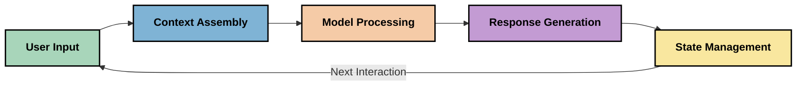
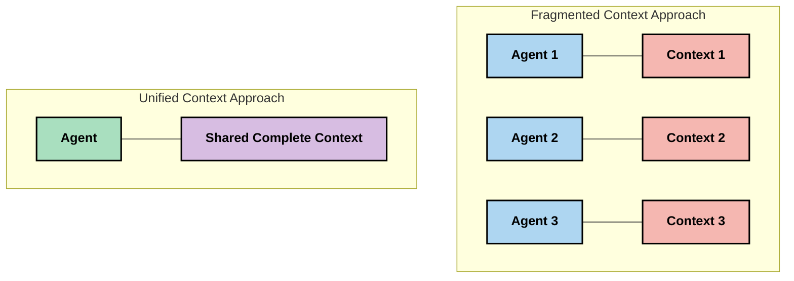
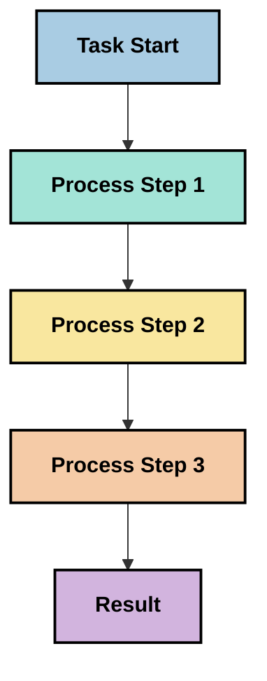
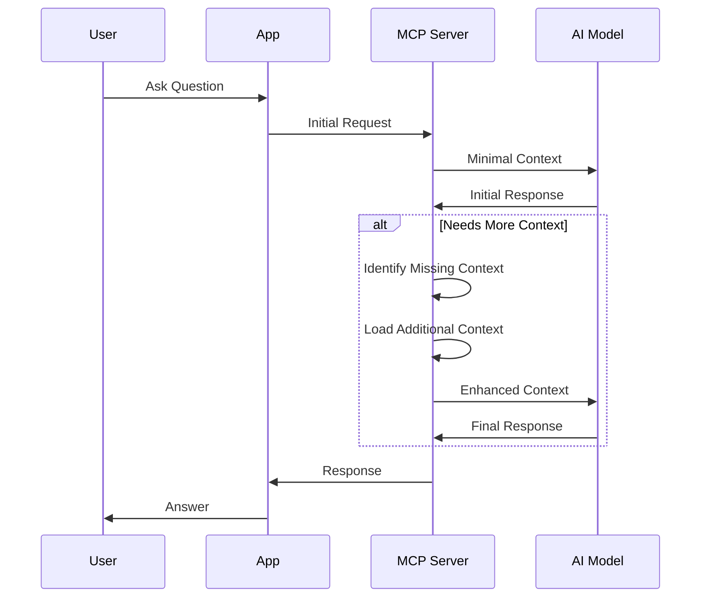
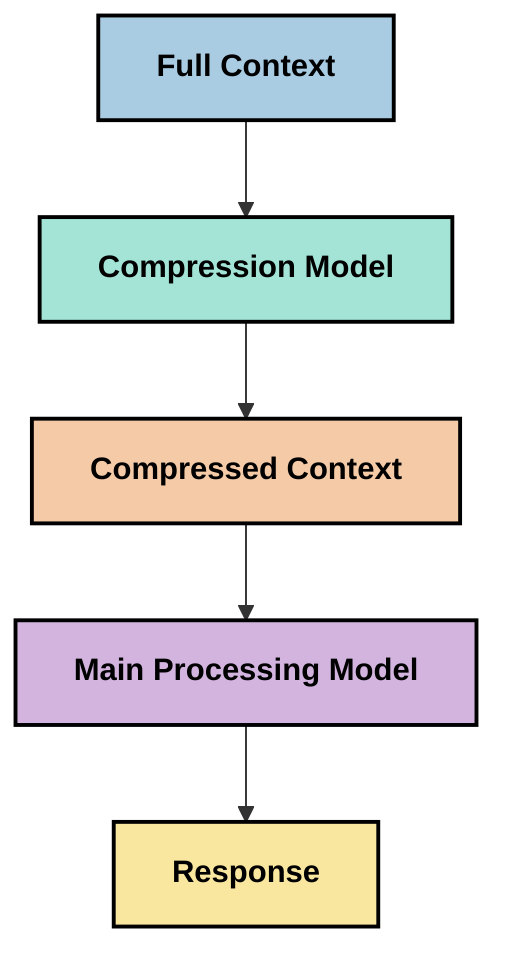
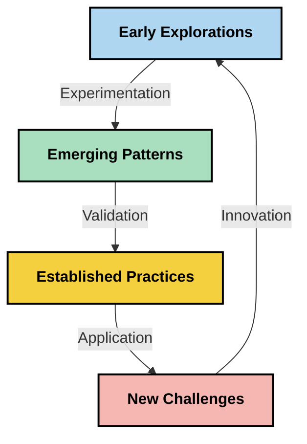

<!--
CO_OP_TRANSLATOR_METADATA:
{
  "original_hash": "fd169ca3071b81b5ee282e194bc823df",
  "translation_date": "2025-09-15T20:50:55+00:00",
  "source_file": "05-AdvancedTopics/mcp-contextengineering/README.md",
  "language_code": "ms"
}
-->
# Kejuruteraan Konteks: Konsep Baru dalam Ekosistem MCP

## Gambaran Keseluruhan

Kejuruteraan konteks adalah konsep baru dalam ruang AI yang meneroka bagaimana maklumat disusun, disampaikan, dan dikekalkan sepanjang interaksi antara pelanggan dan perkhidmatan AI. Apabila ekosistem Model Context Protocol (MCP) berkembang, memahami cara mengurus konteks dengan berkesan menjadi semakin penting. Modul ini memperkenalkan konsep kejuruteraan konteks dan meneroka potensi aplikasinya dalam pelaksanaan MCP.

## Objektif Pembelajaran

Pada akhir modul ini, anda akan dapat:

- Memahami konsep baru kejuruteraan konteks dan peranannya dalam aplikasi MCP
- Mengenal pasti cabaran utama dalam pengurusan konteks yang ditangani oleh reka bentuk protokol MCP
- Meneroka teknik untuk meningkatkan prestasi model melalui pengendalian konteks yang lebih baik
- Mempertimbangkan pendekatan untuk mengukur dan menilai keberkesanan konteks
- Mengaplikasikan konsep baru ini untuk meningkatkan pengalaman AI melalui rangka kerja MCP

## Pengenalan kepada Kejuruteraan Konteks

Kejuruteraan konteks adalah konsep baru yang memberi tumpuan kepada reka bentuk dan pengurusan aliran maklumat secara sengaja antara pengguna, aplikasi, dan model AI. Berbeza dengan bidang yang telah ditetapkan seperti kejuruteraan arahan, kejuruteraan konteks masih sedang ditakrifkan oleh pengamal yang berusaha menyelesaikan cabaran unik dalam menyediakan model AI dengan maklumat yang tepat pada masa yang tepat.

Apabila model bahasa besar (LLM) berkembang, kepentingan konteks menjadi semakin jelas. Kualiti, relevansi, dan struktur konteks yang kita sediakan secara langsung mempengaruhi output model. Kejuruteraan konteks meneroka hubungan ini dan berusaha untuk membangunkan prinsip untuk pengurusan konteks yang berkesan.

> "Pada tahun 2025, model yang ada sangat pintar. Tetapi walaupun manusia paling bijak tidak akan dapat melakukan tugas mereka dengan berkesan tanpa konteks tentang apa yang diminta untuk mereka lakukan... 'Kejuruteraan konteks' adalah tahap seterusnya dalam kejuruteraan arahan. Ia tentang melakukannya secara automatik dalam sistem dinamik." — Walden Yan, Cognition AI

Kejuruteraan konteks mungkin merangkumi:

1. **Pemilihan Konteks**: Menentukan maklumat yang relevan untuk tugas tertentu
2. **Penyusunan Konteks**: Mengatur maklumat untuk memaksimumkan pemahaman model
3. **Penyampaian Konteks**: Mengoptimumkan cara dan masa maklumat dihantar kepada model
4. **Penyelenggaraan Konteks**: Mengurus keadaan dan evolusi konteks dari masa ke masa
5. **Penilaian Konteks**: Mengukur dan meningkatkan keberkesanan konteks

Bidang fokus ini sangat relevan dengan ekosistem MCP, yang menyediakan cara standard untuk aplikasi memberikan konteks kepada LLM.

## Perspektif Perjalanan Konteks

Salah satu cara untuk menggambarkan kejuruteraan konteks adalah dengan menjejaki perjalanan maklumat melalui sistem MCP:



### Peringkat Utama dalam Perjalanan Konteks:

1. **Input Pengguna**: Maklumat mentah daripada pengguna (teks, imej, dokumen)
2. **Penyusunan Konteks**: Menggabungkan input pengguna dengan konteks sistem, sejarah perbualan, dan maklumat lain yang diperoleh
3. **Pemprosesan Model**: Model AI memproses konteks yang telah disusun
4. **Penjanaan Respons**: Model menghasilkan output berdasarkan konteks yang diberikan
5. **Pengurusan Keadaan**: Sistem mengemas kini keadaan dalaman berdasarkan interaksi

Perspektif ini menonjolkan sifat dinamik konteks dalam sistem AI dan menimbulkan persoalan penting tentang cara terbaik mengurus maklumat pada setiap peringkat.

## Prinsip Baru dalam Kejuruteraan Konteks

Apabila bidang kejuruteraan konteks mula terbentuk, beberapa prinsip awal mula muncul daripada pengamal. Prinsip ini mungkin membantu memaklumkan pilihan pelaksanaan MCP:

### Prinsip 1: Kongsi Konteks Secara Lengkap

Konteks harus dikongsi sepenuhnya antara semua komponen sistem dan bukannya terpecah-pecah di antara beberapa agen atau proses. Apabila konteks diedarkan, keputusan yang dibuat dalam satu bahagian sistem mungkin bercanggah dengan keputusan yang dibuat di tempat lain.



Dalam aplikasi MCP, ini mencadangkan reka bentuk sistem di mana konteks mengalir dengan lancar melalui keseluruhan saluran dan bukannya dipecahkan.

### Prinsip 2: Kenali Bahawa Tindakan Membawa Keputusan Tersirat

Setiap tindakan yang diambil oleh model mengandungi keputusan tersirat tentang cara mentafsir konteks. Apabila pelbagai komponen bertindak pada konteks yang berbeza, keputusan tersirat ini boleh bercanggah, menyebabkan hasil yang tidak konsisten.

Prinsip ini mempunyai implikasi penting untuk aplikasi MCP:
- Lebih suka pemprosesan linear untuk tugas kompleks berbanding pelaksanaan selari dengan konteks yang terpecah
- Pastikan semua titik keputusan mempunyai akses kepada maklumat konteks yang sama
- Reka bentuk sistem di mana langkah-langkah kemudian dapat melihat konteks penuh keputusan sebelumnya

### Prinsip 3: Imbangi Kedalaman Konteks dengan Had Tetingkap

Apabila perbualan dan proses menjadi lebih panjang, tetingkap konteks akhirnya melimpah. Kejuruteraan konteks yang berkesan meneroka pendekatan untuk mengurus ketegangan ini antara konteks yang komprehensif dan batasan teknikal.

Pendekatan yang sedang diteroka termasuk:
- Pemampatan konteks yang mengekalkan maklumat penting sambil mengurangkan penggunaan token
- Pemuatan progresif konteks berdasarkan relevansi kepada keperluan semasa
- Ringkasan interaksi sebelumnya sambil mengekalkan keputusan dan fakta utama

## Cabaran Konteks dan Reka Bentuk Protokol MCP

Model Context Protocol (MCP) direka dengan kesedaran tentang cabaran unik pengurusan konteks. Memahami cabaran ini membantu menjelaskan aspek utama reka bentuk protokol MCP:

### Cabaran 1: Had Tetingkap Konteks
Kebanyakan model AI mempunyai saiz tetingkap konteks tetap, yang mengehadkan jumlah maklumat yang boleh diproses sekaligus.

**Respons Reka Bentuk MCP:** 
- Protokol menyokong konteks berasaskan sumber yang berstruktur yang boleh dirujuk dengan cekap
- Sumber boleh dipaginasi dan dimuatkan secara progresif

### Cabaran 2: Penentuan Relevansi
Menentukan maklumat mana yang paling relevan untuk dimasukkan dalam konteks adalah sukar.

**Respons Reka Bentuk MCP:**
- Alat fleksibel membolehkan pengambilan maklumat secara dinamik berdasarkan keperluan
- Arahan berstruktur membolehkan organisasi konteks yang konsisten

### Cabaran 3: Ketekalan Konteks
Mengurus keadaan merentasi interaksi memerlukan penjejakan konteks yang teliti.

**Respons Reka Bentuk MCP:**
- Pengurusan sesi yang standard
- Corak interaksi yang jelas untuk evolusi konteks

### Cabaran 4: Konteks Multi-Mod
Jenis data yang berbeza (teks, imej, data berstruktur) memerlukan pengendalian yang berbeza.

**Respons Reka Bentuk MCP:**
- Reka bentuk protokol menampung pelbagai jenis kandungan
- Representasi standard maklumat multi-mod

### Cabaran 5: Keselamatan dan Privasi
Konteks sering mengandungi maklumat sensitif yang mesti dilindungi.

**Respons Reka Bentuk MCP:**
- Sempadan yang jelas antara tanggungjawab pelanggan dan pelayan
- Pilihan pemprosesan tempatan untuk meminimumkan pendedahan data

Memahami cabaran ini dan bagaimana MCP menanganinya memberikan asas untuk meneroka teknik kejuruteraan konteks yang lebih maju.

## Pendekatan Baru dalam Kejuruteraan Konteks

Apabila bidang kejuruteraan konteks berkembang, beberapa pendekatan yang menjanjikan mula muncul. Pendekatan ini mewakili pemikiran semasa dan bukannya amalan terbaik yang telah ditetapkan, dan kemungkinan akan berkembang apabila kita memperoleh lebih banyak pengalaman dengan pelaksanaan MCP.

### 1. Pemprosesan Linear Berbenang Tunggal

Berbeza dengan seni bina multi-agen yang mengedarkan konteks, sesetengah pengamal mendapati bahawa pemprosesan linear berbenang tunggal menghasilkan hasil yang lebih konsisten. Ini selaras dengan prinsip mengekalkan konteks yang bersatu.



Walaupun pendekatan ini mungkin kelihatan kurang cekap daripada pemprosesan selari, ia sering menghasilkan hasil yang lebih koheren dan boleh dipercayai kerana setiap langkah dibina berdasarkan pemahaman lengkap tentang keputusan sebelumnya.

### 2. Pemecahan dan Keutamaan Konteks

Memecahkan konteks besar kepada bahagian yang boleh diurus dan mengutamakan apa yang paling penting.

```python
# Conceptual Example: Context Chunking and Prioritization
def process_with_chunked_context(documents, query):
    # 1. Break documents into smaller chunks
    chunks = chunk_documents(documents)
    
    # 2. Calculate relevance scores for each chunk
    scored_chunks = [(chunk, calculate_relevance(chunk, query)) for chunk in chunks]
    
    # 3. Sort chunks by relevance score
    sorted_chunks = sorted(scored_chunks, key=lambda x: x[1], reverse=True)
    
    # 4. Use the most relevant chunks as context
    context = create_context_from_chunks([chunk for chunk, score in sorted_chunks[:5]])
    
    # 5. Process with the prioritized context
    return generate_response(context, query)
```

Konsep di atas menggambarkan bagaimana kita boleh memecahkan dokumen besar kepada bahagian yang boleh diurus dan memilih hanya bahagian yang paling relevan untuk konteks. Pendekatan ini boleh membantu bekerja dalam had tetingkap konteks sambil tetap memanfaatkan pangkalan pengetahuan yang besar.

### 3. Pemuatan Konteks Progresif

Memuatkan konteks secara progresif mengikut keperluan dan bukannya sekaligus.



Pemuatan konteks progresif bermula dengan konteks minimum dan berkembang hanya apabila diperlukan. Ini boleh mengurangkan penggunaan token dengan ketara untuk pertanyaan mudah sambil mengekalkan keupayaan untuk menangani soalan yang kompleks.

### 4. Pemampatan dan Ringkasan Konteks

Mengurangkan saiz konteks sambil mengekalkan maklumat penting.



Pemampatan konteks memberi tumpuan kepada:
- Menghapuskan maklumat yang berulang
- Meringkaskan kandungan yang panjang
- Mengekstrak fakta dan butiran utama
- Mengekalkan elemen konteks kritikal
- Mengoptimumkan kecekapan token

Pendekatan ini boleh sangat berharga untuk mengekalkan perbualan panjang dalam tetingkap konteks atau untuk memproses dokumen besar dengan cekap. Sesetengah pengamal menggunakan model khusus secara khusus untuk pemampatan konteks dan ringkasan sejarah perbualan.

## Pertimbangan Eksplorasi Kejuruteraan Konteks

Apabila kita meneroka bidang baru kejuruteraan konteks, beberapa pertimbangan patut diambil kira semasa bekerja dengan pelaksanaan MCP. Ini bukan amalan terbaik yang preskriptif tetapi kawasan penerokaan yang mungkin menghasilkan penambahbaikan dalam kes penggunaan khusus anda.

### Pertimbangkan Matlamat Konteks Anda

Sebelum melaksanakan penyelesaian pengurusan konteks yang kompleks, nyatakan dengan jelas apa yang anda cuba capai:
- Maklumat khusus apa yang diperlukan oleh model untuk berjaya?
- Maklumat mana yang penting berbanding tambahan?
- Apakah kekangan prestasi anda (kelewatan, had token, kos)?

### Terokai Pendekatan Konteks Berlapis

Sesetengah pengamal mendapati kejayaan dengan konteks yang disusun dalam lapisan konsep:
- **Lapisan Teras**: Maklumat penting yang sentiasa diperlukan oleh model
- **Lapisan Situasi**: Konteks khusus untuk interaksi semasa
- **Lapisan Sokongan**: Maklumat tambahan yang mungkin berguna
- **Lapisan Sandaran**: Maklumat yang diakses hanya apabila diperlukan

### Selidiki Strategi Pengambilan

Keberkesanan konteks anda sering bergantung pada cara anda mengambil maklumat:
- Carian semantik dan embedding untuk mencari maklumat yang relevan secara konsep
- Carian berdasarkan kata kunci untuk butiran fakta tertentu
- Pendekatan hibrid yang menggabungkan pelbagai kaedah pengambilan
- Penapisan metadata untuk menyempitkan skop berdasarkan kategori, tarikh, atau sumber

### Bereksperimen dengan Koherensi Konteks

Struktur dan aliran konteks anda mungkin mempengaruhi pemahaman model:
- Mengelompokkan maklumat yang berkaitan bersama-sama
- Menggunakan format dan organisasi yang konsisten
- Mengekalkan susunan logik atau kronologi di mana sesuai
- Mengelakkan maklumat yang bercanggah

### Timbang Kelebihan dan Kekurangan Seni Bina Multi-Agen

Walaupun seni bina multi-agen popular dalam banyak rangka kerja AI, ia datang dengan cabaran yang signifikan untuk pengurusan konteks:
- Pemecahan konteks boleh menyebabkan keputusan yang tidak konsisten di antara agen
- Pemprosesan selari mungkin memperkenalkan konflik yang sukar diselesaikan
- Overhead komunikasi antara agen boleh mengimbangi keuntungan prestasi
- Pengurusan keadaan yang kompleks diperlukan untuk mengekalkan koherensi

Dalam banyak kes, pendekatan agen tunggal dengan pengurusan konteks yang komprehensif mungkin menghasilkan hasil yang lebih boleh dipercayai daripada beberapa agen khusus dengan konteks yang terpecah.

### Bangunkan Kaedah Penilaian

Untuk meningkatkan kejuruteraan konteks dari masa ke masa, pertimbangkan cara anda akan mengukur kejayaan:
- Ujian A/B struktur konteks yang berbeza
- Memantau penggunaan token dan masa respons
- Menjejaki kepuasan pengguna dan kadar penyelesaian tugas
- Menganalisis bila dan mengapa strategi konteks gagal

Pertimbangan ini mewakili kawasan penerokaan aktif dalam ruang kejuruteraan konteks. Apabila bidang ini matang, corak dan amalan yang lebih pasti mungkin muncul.

## Mengukur Keberkesanan Konteks: Kerangka yang Berkembang

Apabila kejuruteraan konteks muncul sebagai konsep, pengamal mula meneroka bagaimana kita mungkin mengukur keberkesanannya. Tiada kerangka yang ditetapkan wujud lagi, tetapi pelbagai metrik sedang dipertimbangkan yang boleh membantu membimbing kerja masa depan.

### Dimensi Pengukuran Potensi

#### 1. Pertimbangan Kecekapan Input

- **Nisbah Konteks-ke-Respons**: Berapa banyak konteks yang diperlukan berbanding saiz respons?
- **Penggunaan Token**: Peratusan token konteks yang disediakan yang mempengaruhi respons?
- **Pengurangan Konteks**: Seberapa berkesan kita boleh memampatkan maklumat mentah?

#### 2. Pertimbangan Prestasi

- **Kesan Kelewatan**: Bagaimana pengurusan konteks mempengaruhi masa respons?
- **Ekonomi Token**: Adakah kita mengoptimumkan penggunaan token dengan berkesan?
- **Ketepatan Pengambilan**: Seberapa relevan maklumat yang diambil?
- **Penggunaan Sumber**: Sumber pengkomputeran apa yang diperlukan?

#### 3. Pertimbangan Kualiti

- **Relevansi Respons**: Seberapa baik respons menangani pertanyaan?
- **Ketepatan Fakta**: Adakah pengurusan konteks meningkatkan ketepatan fakta?
- **Konsistensi**: Adakah respons konsisten merentasi pertanyaan yang serupa?
- **Kadar Halusinasi**: Adakah konteks yang lebih baik mengurangkan halusinasi model?

#### 4. Pertimbangan Pengalaman Pengguna

- **Kadar Susulan**: Seberapa kerap pengguna memerlukan penjelasan?
- **Penyelesaian Tugas**: Adakah pengguna berjaya mencapai matlamat mereka?
- **Petunjuk Kepuasan**: Bagaimana pengguna menilai pengalaman mereka?

### Pendekatan Eksplorasi untuk Pengukuran

Apabila bereksperimen dengan kejuruteraan konteks dalam pelaksanaan MCP, pertimbangkan pendekatan eksplorasi ini:

1. **Perbandingan Asas**: Tetapkan asas dengan pendekatan konteks yang mudah sebelum menguji kaedah yang lebih canggih

2. **Perubahan Bertahap**: Ubah satu aspek pengurusan konteks pada satu masa untuk mengasingkan kesannya

3. **Penilaian Berpusatkan Pengguna**: Gabungkan metrik kuantitatif dengan maklum balas kualitatif pengguna

4. **Analisis Kegagalan**: Periksa kes di mana strategi konteks gagal untuk memahami potensi penambahbaikan

5. **Penilaian Pelbagai Dimensi**: Pertimbangkan pertukaran antara kecekapan, kualiti, dan pengalaman pengguna

Pendekatan eksperimen dan pelbagai dimensi ini untuk pengukuran selaras dengan sifat baru kejuruteraan konteks.

## Pemikiran Penutup

Kejuruteraan konteks adalah bidang penerokaan baru yang mungkin menjadi pusat kepada aplikasi MCP yang berkesan. Dengan mempertimbangkan dengan teliti bagaimana maklumat mengalir melalui sistem anda, anda berpotensi mencipta pengalaman AI yang lebih cekap, tepat, dan bernilai kepada pengguna.

Teknik dan pendekatan yang digariskan dalam modul ini mewakili pemikiran awal dalam ruang ini, bukan amalan yang telah ditetapkan. Kejuruteraan konteks mungkin berkembang menjadi disiplin yang lebih terdefinisi apabila keupayaan AI berkembang dan pemahaman kita semakin mendalam. Buat masa ini, eksperimen yang digabungkan dengan pengukuran yang teliti nampaknya menjadi pendekatan yang paling produktif.

## Arah Masa Depan yang Berpotensi

Bidang kejuruteraan konteks masih dalam peringkat awal, tetapi beberapa arah yang menjanjikan mula muncul:

- Prinsip kejuruteraan konteks mungkin memberi kesan besar kepada prestasi model, kecekapan, pengalaman pengguna, dan kebolehpercayaan
- Pendekatan berbenang tunggal dengan pengurusan konteks yang komprehensif mungkin mengatasi seni bina multi-agen untuk banyak kes penggunaan
- Model pemampatan konteks khusus mungkin menjadi komponen standard dalam saluran AI
- Ketegangan antara kelengkapan konteks dan had token mungkin mendorong inovasi dalam pengendalian konteks
- Apabila model menjadi lebih mampu berkomunikasi secara cekap seperti manusia, kerjasama multi-agen sebenar mungkin menjadi lebih layak
- Pelaksanaan MCP mungkin berkembang untuk menyeragamkan corak pengurusan konteks yang muncul daripada eksperimen semasa



## Sumber

### Sumber Rasmi MCP
- [Laman Web Model Context Protocol](https://modelcontextprotocol.io/)
- [Spesifikasi Model Context Protocol](https://github.com/modelcontextprotocol/modelcontextprotocol)
- [Dokumentasi MCP](https://modelcontextprotocol.io/docs)
- [MCP C# SDK](https://github.com/modelcontextprotocol/csharp-sdk)
- [MCP Python SDK](https://github.com/modelcontextprotocol/python-sdk)
- [MCP TypeScript SDK](https://github.com/modelcontextprotocol/typescript-sdk)
- [MCP Inspector](https://github.com/modelcontextprotocol/inspector) - Alat ujian visual untuk pelayan MCP

### Artikel Kejuruteraan Konteks
- [Jangan Bina Multi-Ejen: Prinsip Kejuruteraan Konteks](https://cognition.ai/blog/dont-build-multi-agents) - Pandangan Walden Yan tentang prinsip kejuruteraan konteks
- [Panduan Praktikal untuk Membina Ejen](https://cdn.openai.com/business-guides-and-resources/a-practical-guide-to-building-agents.pdf) - Panduan OpenAI tentang reka bentuk ejen yang berkesan
- [Membina Ejen yang Berkesan](https://www.anthropic.com/engineering/building-effective-agents) - Pendekatan Anthropic terhadap pembangunan ejen

### Penyelidikan Berkaitan
- [Augmentasi Pengambilan Dinamik untuk Model Bahasa Besar](https://arxiv.org/abs/2310.01487) - Penyelidikan tentang pendekatan pengambilan dinamik
- [Hilang di Tengah: Bagaimana Model Bahasa Menggunakan Konteks Panjang](https://arxiv.org/abs/2307.03172) - Penyelidikan penting tentang pola pemprosesan konteks
- [Penjanaan Imej Berasaskan Teks Secara Hierarki dengan CLIP Latents](https://arxiv.org/abs/2204.06125) - Kertas kerja DALL-E 2 dengan pandangan tentang struktur konteks
- [Meneroka Peranan Konteks dalam Seni Bina Model Bahasa Besar](https://aclanthology.org/2023.findings-emnlp.124/) - Penyelidikan terkini tentang pengendalian konteks
- [Kerjasama Multi-Ejen: Kajian](https://arxiv.org/abs/2304.03442) - Penyelidikan tentang sistem multi-ejen dan cabarannya

### Sumber Tambahan
- [Teknik Pengoptimuman Tetingkap Konteks](https://learn.microsoft.com/en-us/azure/ai-services/openai/concepts/context-window)
- [Teknik RAG Lanjutan](https://www.microsoft.com/en-us/research/blog/retrieval-augmented-generation-rag-and-frontier-models/)
- [Dokumentasi Kernel Semantik](https://github.com/microsoft/semantic-kernel)
- [Toolkit AI untuk Pengurusan Konteks](https://github.com/microsoft/aitoolkit)

## Apa yang seterusnya

- [5.15 MCP Custom Transport](../mcp-transport/README.md)

---

**Penafian**:  
Dokumen ini telah diterjemahkan menggunakan perkhidmatan terjemahan AI [Co-op Translator](https://github.com/Azure/co-op-translator). Walaupun kami berusaha untuk memastikan ketepatan, sila ambil perhatian bahawa terjemahan automatik mungkin mengandungi kesilapan atau ketidaktepatan. Dokumen asal dalam bahasa asalnya harus dianggap sebagai sumber yang berwibawa. Untuk maklumat yang kritikal, terjemahan manusia profesional adalah disyorkan. Kami tidak bertanggungjawab atas sebarang salah faham atau salah tafsir yang timbul daripada penggunaan terjemahan ini.