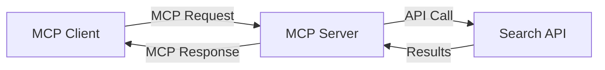
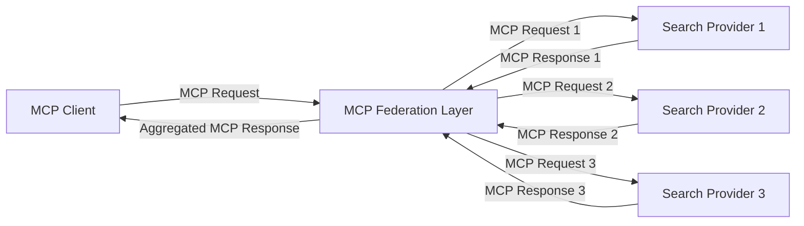
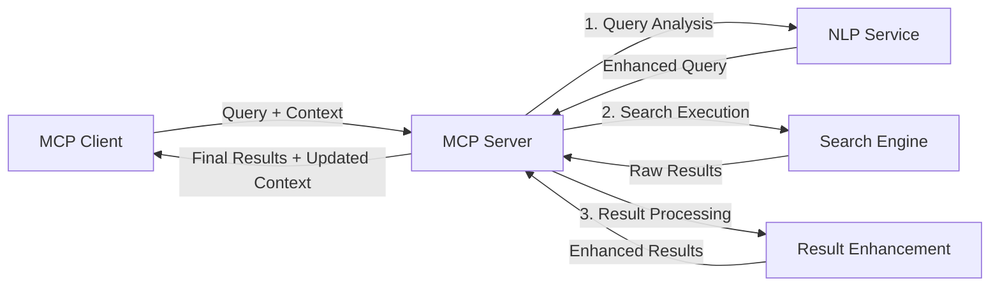

<!--
CO_OP_TRANSLATOR_METADATA:
{
  "original_hash": "eb12652eb7bd17f2193b835a344425c6",
  "translation_date": "2025-06-26T14:14:06+00:00",
  "source_file": "05-AdvancedTopics/mcp-realtimesearch/README.md",
  "language_code": "ms"
}
-->
## Penafian Contoh Kod

> **Nota Penting**: Contoh kod di bawah menunjukkan integrasi Model Context Protocol (MCP) dengan fungsi carian web. Walaupun ia mengikuti corak dan struktur SDK MCP rasmi, ia telah dipermudahkan untuk tujuan pembelajaran.
> 
> Contoh-contoh ini mempamerkan:
> 
> 1. **Implementasi Python**: Pelaksanaan pelayan FastMCP yang menyediakan alat carian web dan bersambung ke API carian luaran. Contoh ini menunjukkan pengurusan jangka hayat yang betul, pengendalian konteks, dan pelaksanaan alat mengikut corak [SDK Python MCP rasmi](https://github.com/modelcontextprotocol/python-sdk). Pelayan menggunakan pengangkutan HTTP Streamable yang disyorkan yang telah menggantikan pengangkutan SSE lama untuk pengeluaran.
> 
> 2. **Implementasi JavaScript**: Pelaksanaan TypeScript/JavaScript menggunakan corak FastMCP dari [SDK TypeScript MCP rasmi](https://github.com/modelcontextprotocol/typescript-sdk) untuk mencipta pelayan carian dengan definisi alat dan sambungan klien yang betul. Ia mengikuti corak terkini yang disyorkan untuk pengurusan sesi dan pemeliharaan konteks.
> 
> Contoh-contoh ini memerlukan pengendalian ralat tambahan, pengesahan, dan kod integrasi API khusus untuk kegunaan produksi. Titik akhir API carian yang ditunjukkan (`https://api.search-service.example/search`) adalah tempat letak dan perlu digantikan dengan titik akhir perkhidmatan carian sebenar.
> 
> Untuk butiran pelaksanaan lengkap dan pendekatan terkini, sila rujuk [spesifikasi MCP rasmi](https://spec.modelcontextprotocol.io/) dan dokumentasi SDK.

## Konsep Teras

### Rangka Kerja Model Context Protocol (MCP)

Pada asasnya, Model Context Protocol menyediakan cara standard untuk model AI, aplikasi, dan perkhidmatan bertukar konteks. Dalam carian web masa nyata, rangka kerja ini penting untuk mencipta pengalaman carian berbilang pusingan yang koheren. Komponen utama termasuk:

1. **Seni Bina Klien-Pelayan**: MCP menetapkan pemisahan jelas antara klien carian (peminta) dan pelayan carian (penyedia), membolehkan model pengeluaran yang fleksibel.

2. **Komunikasi JSON-RPC**: Protokol menggunakan JSON-RPC untuk pertukaran mesej, menjadikannya serasi dengan teknologi web dan mudah dilaksanakan di pelbagai platform.

3. **Pengurusan Konteks**: MCP mentakrifkan kaedah berstruktur untuk mengekalkan, mengemas kini, dan memanfaatkan konteks carian merentasi pelbagai interaksi.

4. **Definisi Alat**: Keupayaan carian didedahkan sebagai alat standard dengan parameter dan nilai pulangan yang jelas.

5. **Sokongan Penstriman**: Protokol menyokong keputusan penstriman, penting untuk carian masa nyata di mana keputusan mungkin tiba secara berperingkat.

### Corak Integrasi Carian Web

Apabila mengintegrasikan MCP dengan carian web, beberapa corak muncul:

#### 1. Integrasi Penyedia Carian Langsung

Dalam corak ini, pelayan MCP berinteraksi secara langsung dengan satu atau lebih API carian, menterjemah permintaan MCP ke panggilan API khusus dan memformat keputusan sebagai respons MCP.

#### 2. Carian Federasi dengan Pemeliharaan Konteks

Corak ini mengagihkan pertanyaan carian ke pelbagai penyedia carian yang serasi MCP, yang masing-masing mungkin pakar dalam jenis kandungan atau keupayaan carian berbeza, sambil mengekalkan konteks yang bersatu.

#### 3. Rantaian Carian Dipertingkatkan Konteks

Dalam corak ini, proses carian dibahagikan kepada beberapa peringkat, dengan konteks diperkaya pada setiap langkah, menghasilkan keputusan yang semakin relevan.

### Komponen Konteks Carian

Dalam carian web berasaskan MCP, konteks biasanya termasuk:

- **Sejarah Pertanyaan**: Pertanyaan carian sebelumnya dalam sesi
- **Keutamaan Pengguna**: Bahasa, wilayah, tetapan carian selamat
- **Sejarah Interaksi**: Keputusan yang diklik, masa yang dihabiskan pada keputusan
- **Parameter Carian**: Penapis, susunan susun, dan pengubah carian lain
- **Pengetahuan Domain**: Konteks khusus subjek yang relevan dengan carian
- **Konteks Temporal**: Faktor relevan berdasarkan masa
- **Keutamaan Sumber**: Sumber maklumat yang dipercayai atau disukai

## Kes Penggunaan dan Aplikasi

### Penyelidikan dan Pengumpulan Maklumat

MCP meningkatkan aliran kerja penyelidikan dengan:

- Memelihara konteks penyelidikan merentasi sesi carian
- Membolehkan pertanyaan yang lebih canggih dan relevan secara kontekstual
- Menyokong federasi carian pelbagai sumber
- Memudahkan ekstraksi pengetahuan dari hasil carian

### Pemantauan Berita dan Tren Masa Nyata

Carian berkuasa MCP menawarkan kelebihan untuk pemantauan berita:

- Penemuan hampir masa nyata cerita berita yang muncul
- Penapisan kontekstual maklumat yang relevan
- Penjejakan topik dan entiti merentasi pelbagai sumber
- Amaran berita peribadi berdasarkan konteks pengguna

### Pelayaran dan Penyelidikan Beraugmen AI

MCP mencipta kemungkinan baru untuk pelayaran beraugmen AI:

- Cadangan carian kontekstual berdasarkan aktiviti pelayar semasa
- Integrasi lancar carian web dengan pembantu berkuasa LLM
- Penapisan carian berbilang pusingan dengan konteks dikekalkan
- Peningkatan pemeriksaan fakta dan pengesahan maklumat

## Tren dan Inovasi Masa Depan

### Evolusi MCP dalam Carian Web

Melihat ke hadapan, kami menjangkakan MCP akan berkembang untuk menangani:

- **Carian Multimodal**: Mengintegrasikan carian teks, imej, audio, dan video dengan konteks yang dikekalkan
- **Carian Terdesentralisasi**: Menyokong ekosistem carian teragih dan federasi
- **Privasi Carian**: Mekanisme carian yang peka konteks dan melindungi privasi
- **Pemahaman Pertanyaan**: Penguraian semantik mendalam bagi pertanyaan carian bahasa semula jadi

### Kemajuan Potensi dalam Teknologi

Teknologi baru yang akan membentuk masa depan carian MCP:

1. **Seni Bina Carian Neural**: Sistem carian berasaskan penyematan yang dioptimumkan untuk MCP
2. **Konteks Carian Peribadi**: Mempelajari corak carian pengguna individu dari masa ke masa
3. **Integrasi Graf Pengetahuan**: Carian kontekstual dipertingkat dengan graf pengetahuan khusus domain
4. **Konteks Rentas Mod**: Mengekalkan konteks merentasi modaliti carian berbeza

## Latihan Praktikal

### Latihan 1: Menyediakan Saluran Carian MCP Asas

Dalam latihan ini, anda akan belajar bagaimana untuk:
- Mengkonfigurasi persekitaran carian MCP asas
- Melaksanakan pengendali konteks untuk carian web
- Menguji dan mengesahkan pemeliharaan konteks merentasi iterasi carian

### Latihan 2: Membangun Pembantu Penyelidikan dengan Carian MCP

Cipta aplikasi lengkap yang:
- Memproses soalan penyelidikan bahasa semula jadi
- Melakukan carian web peka konteks
- Mensintesis maklumat dari pelbagai sumber
- Membentangkan penemuan penyelidikan yang tersusun

### Latihan 3: Melaksanakan Federasi Carian Pelbagai Sumber dengan MCP

Latihan lanjutan merangkumi:
- Penghantaran pertanyaan peka konteks ke pelbagai enjin carian
- Penyusunan dan penggabungan keputusan
- Deduplicasi kontekstual hasil carian
- Pengendalian metadata khusus sumber

## Sumber Tambahan

- [Spesifikasi Model Context Protocol](https://spec.modelcontextprotocol.io/) - Spesifikasi rasmi MCP dan dokumentasi protokol terperinci
- [Dokumentasi Model Context Protocol](https://modelcontextprotocol.io/) - Tutorial terperinci dan panduan pelaksanaan
- [SDK Python MCP](https://github.com/modelcontextprotocol/python-sdk) - Pelaksanaan Python rasmi protokol MCP
- [SDK TypeScript MCP](https://github.com/modelcontextprotocol/typescript-sdk) - Pelaksanaan TypeScript rasmi protokol MCP
- [Pelayan Rujukan MCP](https://github.com/modelcontextprotocol/servers) - Pelaksanaan rujukan pelayan MCP
- [Dokumentasi Bing Web Search API](https://learn.microsoft.com/en-us/bing/search-apis/bing-web-search/overview) - API carian web Microsoft
- [Google Custom Search JSON API](https://developers.google.com/custom-search/v1/overview) - Enjin carian boleh atur Google
- [Dokumentasi SerpAPI](https://serpapi.com/search-api) - API halaman keputusan enjin carian
- [Dokumentasi Meilisearch](https://www.meilisearch.com/docs) - Enjin carian sumber terbuka
- [Dokumentasi Elasticsearch](https://www.elastic.co/guide/index.html) - Enjin carian dan analitik teragih
- [Dokumentasi LangChain](https://python.langchain.com/docs/get_started/introduction) - Membangun aplikasi dengan LLM

## Hasil Pembelajaran

Dengan menamatkan modul ini, anda akan dapat:

- Memahami asas carian web masa nyata dan cabarannya
- Menerangkan bagaimana Model Context Protocol (MCP) meningkatkan keupayaan carian web masa nyata
- Melaksanakan penyelesaian carian berasaskan MCP menggunakan rangka kerja dan API popular
- Mereka bentuk dan melaksanakan seni bina carian yang boleh diskala dan berprestasi tinggi dengan MCP
- Mengaplikasikan konsep MCP kepada pelbagai kes penggunaan termasuk carian semantik, pembantu penyelidikan, dan pelayaran beraugmen AI
- Menilai tren yang muncul dan inovasi masa depan dalam teknologi carian berasaskan MCP

### Pertimbangan Kepercayaan dan Keselamatan

Apabila melaksanakan penyelesaian carian web berasaskan MCP, ingat prinsip penting berikut dari spesifikasi MCP:

1. **Persetujuan dan Kawalan Pengguna**: Pengguna mesti memberi persetujuan secara jelas dan memahami semua akses data dan operasi. Ini amat penting untuk pelaksanaan carian web yang mungkin mengakses sumber data luaran.

2. **Privasi Data**: Pastikan pengendalian yang sesuai bagi pertanyaan dan keputusan carian, terutamanya jika mengandungi maklumat sensitif. Laksanakan kawalan akses yang sesuai untuk melindungi data pengguna.

3. **Keselamatan Alat**: Laksanakan pengesahan dan kebenaran yang betul untuk alat carian, kerana ia mewakili risiko keselamatan melalui pelaksanaan kod sewenang-wenangnya. Penerangan tingkah laku alat harus dianggap tidak dipercayai kecuali diperoleh dari pelayan yang dipercayai.

4. **Dokumentasi Jelas**: Sediakan dokumentasi yang jelas mengenai keupayaan, had, dan pertimbangan keselamatan pelaksanaan carian berasaskan MCP anda, mengikut garis panduan pelaksanaan dari spesifikasi MCP.

5. **Aliran Persetujuan Kukuh**: Bangunkan aliran persetujuan dan kebenaran yang kukuh yang menerangkan dengan jelas apa yang dilakukan setiap alat sebelum membenarkan penggunaannya, terutamanya untuk alat yang berinteraksi dengan sumber web luaran.

Untuk butiran lengkap mengenai keselamatan dan pertimbangan kepercayaan MCP, rujuk [dokumentasi rasmi](https://modelcontextprotocol.io/specification/2025-03-26#security-and-trust-%26-safety).

## Apa Seterusnya

- [5.11 Pengesahan Entra ID untuk Pelayan Model Context Protocol](../mcp-security-entra/README.md)

**Penafian**:  
Dokumen ini telah diterjemahkan menggunakan perkhidmatan terjemahan AI [Co-op Translator](https://github.com/Azure/co-op-translator). Walaupun kami berusaha untuk ketepatan, sila ambil maklum bahawa terjemahan automatik mungkin mengandungi kesilapan atau ketidaktepatan. Dokumen asal dalam bahasa asalnya hendaklah dianggap sebagai sumber yang sahih. Untuk maklumat yang kritikal, terjemahan profesional oleh manusia adalah disyorkan. Kami tidak bertanggungjawab atas sebarang salah faham atau salah tafsir yang timbul daripada penggunaan terjemahan ini.