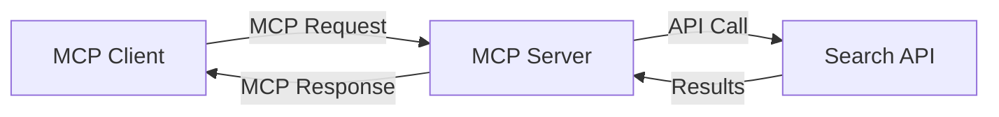
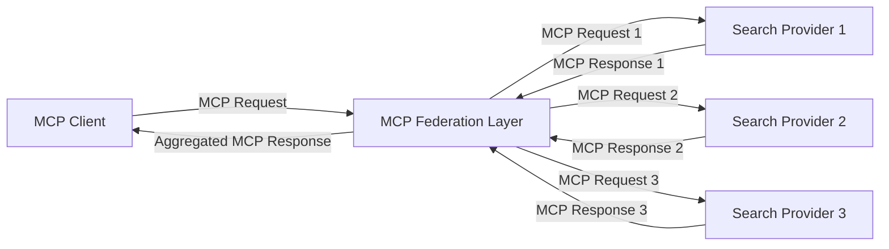
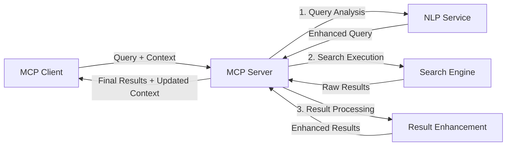

<!--
CO_OP_TRANSLATOR_METADATA:
{
  "original_hash": "16bef2c93c6a86d4ca6a8ce9e120e384",
  "translation_date": "2025-06-13T02:56:06+00:00",
  "source_file": "05-AdvancedTopics/mcp-realtimesearch/README.md",
  "language_code": "ms"
}
-->
## Code Examples Disclaimer

> **Important Note**: The code examples below demonstrate how to integrate the Model Context Protocol (MCP) with web search functionality. While they follow the structure and patterns of the official MCP SDKs, they have been simplified for learning purposes.
> 
> These examples illustrate:
> 
> 1. **Python Implementation**: A FastMCP server that offers a web search tool connected to an external search API. This example highlights proper lifespan management, context handling, and tool implementation, following the conventions of the [official MCP Python SDK](https://github.com/modelcontextprotocol/python-sdk). The server uses the recommended Streamable HTTP transport, which has replaced the older SSE transport for production use.
> 
> 2. **JavaScript Implementation**: A TypeScript/JavaScript example using the FastMCP pattern from the [official MCP TypeScript SDK](https://github.com/modelcontextprotocol/typescript-sdk) to create a search server with appropriate tool definitions and client connections. It follows the latest best practices for session management and context preservation.
> 
> These samples would require additional error handling, authentication, and specific API integration code for production environments. The search API endpoints shown (`https://api.search-service.example/search`) are placeholders and should be replaced with actual search service URLs.
> 
> For full implementation details and the latest recommendations, please consult the [official MCP specification](https://spec.modelcontextprotocol.io/) and SDK documentation.

## Core Concepts

### The Model Context Protocol (MCP) Framework

At its core, the Model Context Protocol provides a standardized method for AI models, applications, and services to exchange context. In real-time web search, this framework is crucial for delivering coherent, multi-turn search experiences. Key elements include:

1. **Client-Server Architecture**: MCP clearly separates search clients (requesters) from search servers (providers), supporting flexible deployment options.

2. **JSON-RPC Communication**: The protocol uses JSON-RPC for message exchange, ensuring compatibility with web technologies and ease of implementation across platforms.

3. **Context Management**: MCP defines structured ways to maintain, update, and utilize search context across multiple interactions.

4. **Tool Definitions**: Search functionalities are exposed as standardized tools with clearly defined parameters and return values.

5. **Streaming Support**: The protocol supports streaming of results, which is essential for real-time search where results may arrive incrementally.

### Web Search Integration Patterns

When integrating MCP with web search, several common patterns arise:

#### 1. Direct Search Provider Integration

In this approach, the MCP server communicates directly with one or more search APIs, converting MCP requests into API-specific calls and formatting the responses back into MCP format.

#### 2. Federated Search with Context Preservation

This pattern spreads search queries across multiple MCP-compatible search providers, each possibly specializing in different content types or search capabilities, while maintaining a unified context.

#### 3. Context-Enhanced Search Chain

Here, the search process is split into multiple stages, enriching the context at each step to progressively deliver more relevant results.

### Search Context Components

In MCP-based web search, context typically includes:

- **Query History**: Previous queries in the session
- **User Preferences**: Language, region, safe search settings
- **Interaction History**: Which results were clicked, time spent on results
- **Search Parameters**: Filters, sorting options, and other modifiers
- **Domain Knowledge**: Subject-specific context relevant to the search
- **Temporal Context**: Time-based relevance factors
- **Source Preferences**: Trusted or preferred information sources

## Use Cases and Applications

### Research and Information Gathering

MCP improves research workflows by:

- Preserving research context across sessions
- Enabling more advanced and contextually relevant queries
- Supporting multi-source federated search
- Facilitating knowledge extraction from search results

### Real-Time News and Trend Monitoring

MCP-powered search benefits news monitoring by:

- Near-real-time discovery of breaking news stories
- Contextual filtering to surface relevant information
- Tracking topics and entities across multiple sources
- Delivering personalized news alerts based on user context

### AI-Augmented Browsing and Research

MCP opens new opportunities for AI-enhanced browsing:

- Contextual search suggestions tied to current browsing activity
- Seamless integration of web search with large language model assistants
- Multi-turn search refinement with persistent context
- Improved fact-checking and information verification

## Future Trends and Innovations

### Evolution of MCP in Web Search

Looking forward, MCP is expected to evolve to address:

- **Multimodal Search**: Combining text, images, audio, and video search with preserved context
- **Decentralized Search**: Enabling distributed and federated search ecosystems
- **Search Privacy**: Implementing context-aware, privacy-preserving search mechanisms
- **Query Understanding**: Deep semantic parsing of natural language queries

### Potential Advancements in Technology

Emerging technologies that will influence MCP search include:

1. **Neural Search Architectures**: Embedding-based search systems optimized for MCP
2. **Personalized Search Context**: Learning and adapting to individual user search patterns over time
3. **Knowledge Graph Integration**: Enhancing contextual search with domain-specific knowledge graphs
4. **Cross-Modal Context**: Maintaining context across different search modalities

## Hands-On Exercises

### Exercise 1: Setting Up a Basic MCP Search Pipeline

In this exercise, you will:

- Configure a basic MCP search environment
- Implement context handlers for web search
- Test and verify context preservation across search iterations

### Exercise 2: Building a Research Assistant with MCP Search

Create a full application that:

- Processes natural language research questions
- Performs context-aware web searches
- Synthesizes information from multiple sources
- Presents organized research findings

### Exercise 3: Implementing Multi-Source Search Federation with MCP

An advanced exercise covering:

- Context-aware query dispatch to multiple search engines
- Result ranking and aggregation
- Contextual deduplication of search results
- Handling source-specific metadata

## Additional Resources

- [Model Context Protocol Specification](https://spec.modelcontextprotocol.io/) – Official MCP specification and detailed protocol documentation
- [Model Context Protocol Documentation](https://modelcontextprotocol.io/) – Tutorials and implementation guides
- [MCP Python SDK](https://github.com/modelcontextprotocol/python-sdk) – Official Python MCP implementation
- [MCP TypeScript SDK](https://github.com/modelcontextprotocol/typescript-sdk) – Official TypeScript MCP implementation
- [MCP Reference Servers](https://github.com/modelcontextprotocol/servers) – Reference MCP server implementations
- [Bing Web Search API Documentation](https://learn.microsoft.com/en-us/bing/search-apis/bing-web-search/overview) – Microsoft’s web search API
- [Google Custom Search JSON API](https://developers.google.com/custom-search/v1/overview) – Google’s programmable search engine
- [SerpAPI Documentation](https://serpapi.com/search-api) – Search engine results API
- [Meilisearch Documentation](https://www.meilisearch.com/docs) – Open-source search engine
- [Elasticsearch Documentation](https://www.elastic.co/guide/index.html) – Distributed search and analytics engine
- [LangChain Documentation](https://python.langchain.com/docs/get_started/introduction) – Building applications with LLMs

## Learning Outcomes

By completing this module, you will be able to:

- Understand the fundamentals and challenges of real-time web search
- Explain how the Model Context Protocol (MCP) enhances real-time web search
- Implement MCP-based search solutions with popular frameworks and APIs
- Design and deploy scalable, high-performance search architectures using MCP
- Apply MCP concepts to use cases such as semantic search, research assistance, and AI-augmented browsing
- Evaluate emerging trends and innovations in MCP-based search technologies

### Trust and Safety Considerations

When building MCP-based web search solutions, keep these important principles from the MCP specification in mind:

1. **User Consent and Control**: Users must explicitly consent to and understand all data access and operations. This is especially important when accessing external data sources.

2. **Data Privacy**: Handle search queries and results carefully, especially if they contain sensitive information. Implement appropriate access controls to protect user data.

3. **Tool Safety**: Properly authorize and validate search tools, as they can pose security risks through arbitrary code execution. Treat tool behavior descriptions as untrusted unless they come from a trusted server.

4. **Clear Documentation**: Provide transparent documentation about your MCP-based search implementation’s capabilities, limitations, and security considerations, following MCP guidelines.

5. **Robust Consent Flows**: Design strong consent and authorization flows that clearly explain each tool’s function before enabling its use, particularly for tools that interact with external web resources.

For full details on MCP security and trust, see the [official documentation](https://modelcontextprotocol.io/specification/2025-03-26#security-and-trust-%26-safety).

## What's next 

- [6. Community Contributions](../../06-CommunityContributions/README.md)

**Penafian**:  
Dokumen ini telah diterjemahkan menggunakan perkhidmatan terjemahan AI [Co-op Translator](https://github.com/Azure/co-op-translator). Walaupun kami berusaha untuk ketepatan, sila ambil perhatian bahawa terjemahan automatik mungkin mengandungi kesilapan atau ketidaktepatan. Dokumen asal dalam bahasa asalnya hendaklah dianggap sebagai sumber yang sahih. Untuk maklumat penting, terjemahan profesional oleh manusia adalah disyorkan. Kami tidak bertanggungjawab atas sebarang salah faham atau salah tafsir yang timbul daripada penggunaan terjemahan ini.