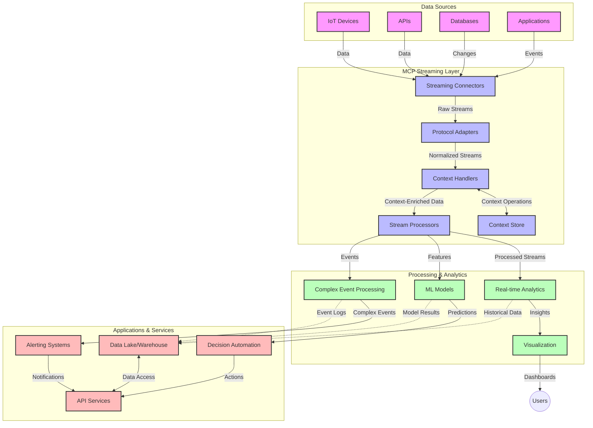

<!--
CO_OP_TRANSLATOR_METADATA:
{
  "original_hash": "195f7287638b77a549acadd96c8f981c",
  "translation_date": "2025-07-14T01:46:31+00:00",
  "source_file": "05-AdvancedTopics/mcp-realtimestreaming/README.md",
  "language_code": "ms"
}
-->
# Protokol Konteks Model untuk Penstriman Data Masa Nyata

## Gambaran Keseluruhan

Penstriman data masa nyata telah menjadi penting dalam dunia yang dipacu data hari ini, di mana perniagaan dan aplikasi memerlukan akses segera kepada maklumat untuk membuat keputusan tepat pada masanya. Protokol Konteks Model (MCP) mewakili kemajuan penting dalam mengoptimumkan proses penstriman masa nyata ini, meningkatkan kecekapan pemprosesan data, mengekalkan integriti konteks, dan memperbaiki prestasi sistem secara keseluruhan.

Modul ini meneroka bagaimana MCP mengubah penstriman data masa nyata dengan menyediakan pendekatan standard untuk pengurusan konteks merentasi model AI, platform penstriman, dan aplikasi.

## Pengenalan kepada Penstriman Data Masa Nyata

Penstriman data masa nyata adalah paradigma teknologi yang membolehkan pemindahan, pemprosesan, dan analisis data secara berterusan semasa ia dijana, membolehkan sistem bertindak balas dengan segera terhadap maklumat baru. Berbeza dengan pemprosesan kelompok tradisional yang beroperasi pada set data statik, penstriman memproses data dalam pergerakan, menyampaikan pandangan dan tindakan dengan kelewatan yang minimum.

### Konsep Teras Penstriman Data Masa Nyata:

- **Aliran Data Berterusan**: Data diproses sebagai aliran peristiwa atau rekod yang berterusan dan tidak berkesudahan.
- **Pemprosesan Latensi Rendah**: Sistem direka untuk meminimumkan masa antara penjanaan data dan pemprosesan.
- **Kebolehsuaian Skala**: Seni bina penstriman mesti mampu mengendalikan volum dan kelajuan data yang berubah-ubah.
- **Ketahanan Ralat**: Sistem perlu tahan terhadap kegagalan untuk memastikan aliran data tidak terganggu.
- **Pemprosesan Berkeadaan**: Mengekalkan konteks merentasi peristiwa adalah penting untuk analisis yang bermakna.

### Protokol Konteks Model dan Penstriman Masa Nyata

Protokol Konteks Model (MCP) menangani beberapa cabaran kritikal dalam persekitaran penstriman masa nyata:

1. **Kesinambungan Konteks**: MCP menstandardkan cara konteks dikekalkan merentasi komponen penstriman yang diedarkan, memastikan model AI dan nod pemprosesan mempunyai akses kepada konteks sejarah dan persekitaran yang relevan.

2. **Pengurusan Keadaan yang Efisien**: Dengan menyediakan mekanisme berstruktur untuk penghantaran konteks, MCP mengurangkan beban pengurusan keadaan dalam saluran penstriman.

3. **Kebolehoperasian**: MCP mencipta bahasa umum untuk perkongsian konteks antara teknologi penstriman dan model AI yang pelbagai, membolehkan seni bina yang lebih fleksibel dan boleh dikembangkan.

4. **Konteks Dioptimumkan untuk Penstriman**: Pelaksanaan MCP boleh mengutamakan elemen konteks yang paling relevan untuk membuat keputusan masa nyata, mengoptimumkan prestasi dan ketepatan.

5. **Pemprosesan Adaptif**: Dengan pengurusan konteks yang betul melalui MCP, sistem penstriman boleh menyesuaikan pemprosesan secara dinamik berdasarkan keadaan dan corak yang berubah dalam data.

Dalam aplikasi moden dari rangkaian sensor IoT hingga platform perdagangan kewangan, integrasi MCP dengan teknologi penstriman membolehkan pemprosesan yang lebih pintar dan peka konteks yang dapat bertindak balas dengan sewajarnya terhadap situasi kompleks dan berubah-ubah secara masa nyata.

## Objektif Pembelajaran

Menjelang akhir pelajaran ini, anda akan dapat:

- Memahami asas penstriman data masa nyata dan cabarannya
- Menerangkan bagaimana Protokol Konteks Model (MCP) meningkatkan penstriman data masa nyata
- Melaksanakan penyelesaian penstriman berasaskan MCP menggunakan rangka kerja popular seperti Kafka dan Pulsar
- Mereka bentuk dan melaksanakan seni bina penstriman yang tahan ralat dan berprestasi tinggi dengan MCP
- Mengaplikasikan konsep MCP kepada kes penggunaan IoT, perdagangan kewangan, dan analitik berasaskan AI
- Menilai trend terkini dan inovasi masa depan dalam teknologi penstriman berasaskan MCP

### Definisi dan Kepentingan

Penstriman data masa nyata melibatkan penjanaan, pemprosesan, dan penghantaran data secara berterusan dengan latensi yang minimum. Berbeza dengan pemprosesan kelompok, di mana data dikumpul dan diproses dalam kumpulan, data penstriman diproses secara berperingkat semasa ia tiba, membolehkan pandangan dan tindakan segera.

Ciri utama penstriman data masa nyata termasuk:

- **Latensi Rendah**: Memproses dan menganalisis data dalam milisaat hingga saat
- **Aliran Berterusan**: Aliran data yang tidak terputus dari pelbagai sumber
- **Pemprosesan Segera**: Menganalisis data semasa ia tiba dan bukan secara berkumpulan
- **Seni Bina Berpandukan Peristiwa**: Bertindak balas terhadap peristiwa semasa ia berlaku

### Cabaran dalam Penstriman Data Tradisional

Pendekatan penstriman data tradisional menghadapi beberapa kekangan:

1. **Kehilangan Konteks**: Sukar mengekalkan konteks merentasi sistem yang diedarkan
2. **Isu Kebolehsuaian Skala**: Cabaran dalam mengendalikan data berkelajuan dan berjumlah tinggi
3. **Kerumitan Integrasi**: Masalah kebolehoperasian antara sistem yang berbeza
4. **Pengurusan Latensi**: Mengimbangi kadar pemprosesan dengan masa pemprosesan
5. **Konsistensi Data**: Memastikan ketepatan dan kelengkapan data merentasi aliran

## Memahami Protokol Konteks Model (MCP)

### Apakah MCP?

Protokol Konteks Model (MCP) adalah protokol komunikasi standard yang direka untuk memudahkan interaksi yang cekap antara model AI dan aplikasi. Dalam konteks penstriman data masa nyata, MCP menyediakan rangka kerja untuk:

- Memelihara konteks sepanjang saluran data
- Menstandardkan format pertukaran data
- Mengoptimumkan penghantaran set data besar
- Meningkatkan komunikasi antara model dan antara model dengan aplikasi

### Komponen Teras dan Seni Bina

Seni bina MCP untuk penstriman masa nyata terdiri daripada beberapa komponen utama:

1. **Pengendali Konteks**: Mengurus dan mengekalkan maklumat konteks merentasi saluran penstriman
2. **Pemproses Aliran**: Memproses aliran data masuk menggunakan teknik peka konteks
3. **Penyesuai Protokol**: Menukar antara protokol penstriman yang berbeza sambil mengekalkan konteks
4. **Penyimpan Konteks**: Menyimpan dan mengambil maklumat konteks dengan cekap
5. **Penyambung Penstriman**: Menyambung ke pelbagai platform penstriman (Kafka, Pulsar, Kinesis, dan lain-lain)



### Bagaimana MCP Meningkatkan Pengendalian Data Masa Nyata

MCP menangani cabaran penstriman tradisional melalui:

- **Integriti Konteks**: Mengekalkan hubungan antara titik data sepanjang saluran
- **Penghantaran Dioptimumkan**: Mengurangkan pengulangan dalam pertukaran data melalui pengurusan konteks yang pintar
- **Antara Muka Standard**: Menyediakan API yang konsisten untuk komponen penstriman
- **Latensi Dikurangkan**: Meminimumkan beban pemprosesan melalui pengendalian konteks yang cekap
- **Kebolehsuaian Skala Ditingkatkan**: Menyokong penskalaan mendatar sambil mengekalkan konteks

## Integrasi dan Pelaksanaan

Sistem penstriman data masa nyata memerlukan reka bentuk seni bina dan pelaksanaan yang teliti untuk mengekalkan prestasi dan integriti konteks. Protokol Konteks Model menawarkan pendekatan standard untuk mengintegrasikan model AI dan teknologi penstriman, membolehkan saluran pemprosesan yang lebih canggih dan peka konteks.

### Gambaran Keseluruhan Integrasi MCP dalam Seni Bina Penstriman

Pelaksanaan MCP dalam persekitaran penstriman masa nyata melibatkan beberapa pertimbangan utama:

1. **Penyerlahan dan Pengangkutan Konteks**: MCP menyediakan mekanisme cekap untuk menyandikan maklumat konteks dalam paket data penstriman, memastikan konteks penting mengikuti data sepanjang saluran pemprosesan. Ini termasuk format penyerlahan standard yang dioptimumkan untuk pengangkutan penstriman.

2. **Pemprosesan Aliran Berkeadaan**: MCP membolehkan pemprosesan berkeadaan yang lebih pintar dengan mengekalkan representasi konteks yang konsisten merentasi nod pemprosesan. Ini sangat bernilai dalam seni bina penstriman diedarkan di mana pengurusan keadaan biasanya mencabar.

3. **Masa Peristiwa vs. Masa Pemprosesan**: Pelaksanaan MCP dalam sistem penstriman mesti menangani cabaran biasa membezakan antara masa peristiwa berlaku dan masa ia diproses. Protokol boleh menggabungkan konteks temporal yang mengekalkan semantik masa peristiwa.

4. **Pengurusan Tekanan Balik (Backpressure)**: Dengan menstandardkan pengendalian konteks, MCP membantu mengurus tekanan balik dalam sistem penstriman, membolehkan komponen berkomunikasi keupayaan pemprosesan mereka dan menyesuaikan aliran dengan sewajarnya.

5. **Penetapan Jendela dan Pengagregatan Konteks**: MCP memudahkan operasi penetapan jendela yang lebih canggih dengan menyediakan representasi berstruktur bagi konteks temporal dan hubungan, membolehkan pengagregatan yang lebih bermakna merentasi aliran peristiwa.

6. **Pemprosesan Tepat-Satu Kali (Exactly-Once)**: Dalam sistem penstriman yang memerlukan semantik tepat-satu kali, MCP boleh menggabungkan metadata pemprosesan untuk membantu menjejak dan mengesahkan status pemprosesan merentasi komponen diedarkan.

Pelaksanaan MCP merentasi pelbagai teknologi penstriman mencipta pendekatan bersatu untuk pengurusan konteks, mengurangkan keperluan kod integrasi khusus sambil meningkatkan keupayaan sistem untuk mengekalkan konteks bermakna semasa data mengalir melalui saluran.

### MCP dalam Pelbagai Rangka Kerja Penstriman Data

Contoh-contoh ini mengikuti spesifikasi MCP semasa yang menumpukan pada protokol berasaskan JSON-RPC dengan mekanisme pengangkutan yang berbeza. Kod menunjukkan bagaimana anda boleh melaksanakan pengangkutan tersuai yang mengintegrasikan platform penstriman seperti Kafka dan Pulsar sambil mengekalkan keserasian penuh dengan protokol MCP.

Contoh ini direka untuk menunjukkan bagaimana platform penstriman boleh diintegrasikan dengan MCP untuk menyediakan pemprosesan data masa nyata sambil mengekalkan kesedaran konteks yang menjadi teras MCP. Pendekatan ini memastikan contoh kod mencerminkan keadaan semasa spesifikasi MCP sehingga Jun 2025.

MCP boleh diintegrasikan dengan rangka kerja penstriman popular termasuk:

#### Integrasi Apache Kafka

```python
import asyncio
import json
from typing import Dict, Any, Optional
from confluent_kafka import Consumer, Producer, KafkaError
from mcp.client import Client, ClientCapabilities
from mcp.core.message import JsonRpcMessage
from mcp.core.transports import Transport

# Custom transport class to bridge MCP with Kafka
class KafkaMCPTransport(Transport):
    def __init__(self, bootstrap_servers: str, input_topic: str, output_topic: str):
        self.bootstrap_servers = bootstrap_servers
        self.input_topic = input_topic
        self.output_topic = output_topic
        self.producer = Producer({'bootstrap.servers': bootstrap_servers})
        self.consumer = Consumer({
            'bootstrap.servers': bootstrap_servers,
            'group.id': 'mcp-client-group',
            'auto.offset.reset': 'earliest'
        })
        self.message_queue = asyncio.Queue()
        self.running = False
        self.consumer_task = None
        
    async def connect(self):
        """Connect to Kafka and start consuming messages"""
        self.consumer.subscribe([self.input_topic])
        self.running = True
        self.consumer_task = asyncio.create_task(self._consume_messages())
        return self
        
    async def _consume_messages(self):
        """Background task to consume messages from Kafka and queue them for processing"""
        while self.running:
            try:
                msg = self.consumer.poll(1.0)
                if msg is None:
                    await asyncio.sleep(0.1)
                    continue
                
                if msg.error():
                    if msg.error().code() == KafkaError._PARTITION_EOF:
                        continue
                    print(f"Consumer error: {msg.error()}")
                    continue
                
                # Parse the message value as JSON-RPC
                try:
                    message_str = msg.value().decode('utf-8')
                    message_data = json.loads(message_str)
                    mcp_message = JsonRpcMessage.from_dict(message_data)
                    await self.message_queue.put(mcp_message)
                except Exception as e:
                    print(f"Error parsing message: {e}")
            except Exception as e:
                print(f"Error in consumer loop: {e}")
                await asyncio.sleep(1)
    
    async def read(self) -> Optional[JsonRpcMessage]:
        """Read the next message from the queue"""
        try:
            message = await self.message_queue.get()
            return message
        except Exception as e:
            print(f"Error reading message: {e}")
            return None
    
    async def write(self, message: JsonRpcMessage) -> None:
        """Write a message to the Kafka output topic"""
        try:
            message_json = json.dumps(message.to_dict())
            self.producer.produce(
                self.output_topic,
                message_json.encode('utf-8'),
                callback=self._delivery_report
            )
            self.producer.poll(0)  # Trigger callbacks
        except Exception as e:
            print(f"Error writing message: {e}")
    
    def _delivery_report(self, err, msg):
        """Kafka producer delivery callback"""
        if err is not None:
            print(f'Message delivery failed: {err}')
        else:
            print(f'Message delivered to {msg.topic()} [{msg.partition()}]')
    
    async def close(self) -> None:
        """Close the transport"""
        self.running = False
        if self.consumer_task:
            self.consumer_task.cancel()
            try:
                await self.consumer_task
            except asyncio.CancelledError:
                pass
        self.consumer.close()
        self.producer.flush()

# Example usage of the Kafka MCP transport
async def kafka_mcp_example():
    # Create MCP client with Kafka transport
    client = Client(
        {"name": "kafka-mcp-client", "version": "1.0.0"},
        ClientCapabilities({})
    )
    
    # Create and connect the Kafka transport
    transport = KafkaMCPTransport(
        bootstrap_servers="localhost:9092",
        input_topic="mcp-responses",
        output_topic="mcp-requests"
    )
    
    await client.connect(transport)
    
    try:
        # Initialize the MCP session
        await client.initialize()
        
        # Example of executing a tool via MCP
        response = await client.execute_tool(
            "process_data",
            {
                "data": "sample data",
                "metadata": {
                    "source": "sensor-1",
                    "timestamp": "2025-06-12T10:30:00Z"
                }
            }
        )
        
        print(f"Tool execution response: {response}")
        
        # Clean shutdown
        await client.shutdown()
    finally:
        await transport.close()

# Run the example
if __name__ == "__main__":
    asyncio.run(kafka_mcp_example())
```

#### Pelaksanaan Apache Pulsar

```python
import asyncio
import json
import pulsar
from typing import Dict, Any, Optional
from mcp.core.message import JsonRpcMessage
from mcp.core.transports import Transport
from mcp.server import Server, ServerOptions
from mcp.server.tools import Tool, ToolExecutionContext, ToolMetadata

# Create a custom MCP transport that uses Pulsar
class PulsarMCPTransport(Transport):
    def __init__(self, service_url: str, request_topic: str, response_topic: str):
        self.service_url = service_url
        self.request_topic = request_topic
        self.response_topic = response_topic
        self.client = pulsar.Client(service_url)
        self.producer = self.client.create_producer(response_topic)
        self.consumer = self.client.subscribe(
            request_topic,
            "mcp-server-subscription",
            consumer_type=pulsar.ConsumerType.Shared
        )
        self.message_queue = asyncio.Queue()
        self.running = False
        self.consumer_task = None
    
    async def connect(self):
        """Connect to Pulsar and start consuming messages"""
        self.running = True
        self.consumer_task = asyncio.create_task(self._consume_messages())
        return self
    
    async def _consume_messages(self):
        """Background task to consume messages from Pulsar and queue them for processing"""
        while self.running:
            try:
                # Non-blocking receive with timeout
                msg = self.consumer.receive(timeout_millis=500)
                
                # Process the message
                try:
                    message_str = msg.data().decode('utf-8')
                    message_data = json.loads(message_str)
                    mcp_message = JsonRpcMessage.from_dict(message_data)
                    await self.message_queue.put(mcp_message)
                    
                    # Acknowledge the message
                    self.consumer.acknowledge(msg)
                except Exception as e:
                    print(f"Error processing message: {e}")
                    # Negative acknowledge if there was an error
                    self.consumer.negative_acknowledge(msg)
            except Exception as e:
                # Handle timeout or other exceptions
                await asyncio.sleep(0.1)
    
    async def read(self) -> Optional[JsonRpcMessage]:
        """Read the next message from the queue"""
        try:
            message = await self.message_queue.get()
            return message
        except Exception as e:
            print(f"Error reading message: {e}")
            return None
    
    async def write(self, message: JsonRpcMessage) -> None:
        """Write a message to the Pulsar output topic"""
        try:
            message_json = json.dumps(message.to_dict())
            self.producer.send(message_json.encode('utf-8'))
        except Exception as e:
            print(f"Error writing message: {e}")
    
    async def close(self) -> None:
        """Close the transport"""
        self.running = False
        if self.consumer_task:
            self.consumer_task.cancel()
            try:
                await self.consumer_task
            except asyncio.CancelledError:
                pass
        self.consumer.close()
        self.producer.close()
        self.client.close()

# Define a sample MCP tool that processes streaming data
@Tool(
    name="process_streaming_data",
    description="Process streaming data with context preservation",
    metadata=ToolMetadata(
        required_capabilities=["streaming"]
    )
)
async def process_streaming_data(
    ctx: ToolExecutionContext,
    data: str,
    source: str,
    priority: str = "medium"
) -> Dict[str, Any]:
    """
    Process streaming data while preserving context
    
    Args:
        ctx: Tool execution context
        data: The data to process
        source: The source of the data
        priority: Priority level (low, medium, high)
        
    Returns:
        Dict containing processed results and context information
    """
    # Example processing that leverages MCP context
    print(f"Processing data from {source} with priority {priority}")
    
    # Access conversation context from MCP
    conversation_id = ctx.conversation_id if hasattr(ctx, 'conversation_id') else "unknown"
    
    # Return results with enhanced context
    return {
        "processed_data": f"Processed: {data}",
        "context": {
            "conversation_id": conversation_id,
            "source": source,
            "priority": priority,
            "processing_timestamp": ctx.get_current_time_iso()
        }
    }

# Example MCP server implementation using Pulsar transport
async def run_mcp_server_with_pulsar():
    # Create MCP server
    server = Server(
        {"name": "pulsar-mcp-server", "version": "1.0.0"},
        ServerOptions(
            capabilities={"streaming": True}
        )
    )
    
    # Register our tool
    server.register_tool(process_streaming_data)
    
    # Create and connect Pulsar transport
    transport = PulsarMCPTransport(
        service_url="pulsar://localhost:6650",
        request_topic="mcp-requests",
        response_topic="mcp-responses"
    )
    
    try:
        # Start the server with the Pulsar transport
        await server.run(transport)
    finally:
        await transport.close()

# Run the server
if __name__ == "__main__":
    asyncio.run(run_mcp_server_with_pulsar())
```

### Amalan Terbaik untuk Pelaksanaan

Apabila melaksanakan MCP untuk penstriman masa nyata:

1. **Reka Bentuk untuk Ketahanan Ralat**:
   - Laksanakan pengendalian ralat yang betul
   - Gunakan antrian dead-letter untuk mesej yang gagal
   - Reka pemproses idempotent

2. **Optimumkan Prestasi**:
   - Konfigurasikan saiz penimbal yang sesuai
   - Gunakan pengumpulan (batching) apabila sesuai
   - Laksanakan mekanisme tekanan balik (backpressure)

3. **Pantau dan Perhatikan**:
   - Jejaki metrik pemprosesan aliran
   - Pantau penyebaran konteks
   - Tetapkan amaran untuk anomali

4. **Amankan Aliran Anda**:
   - Laksanakan penyulitan untuk data sensitif
   - Gunakan pengesahan dan kebenaran
   - Terapkan kawalan akses yang betul

### MCP dalam IoT dan Pengkomputeran Edge

MCP meningkatkan penstriman IoT dengan:

- Memelihara konteks peranti merentasi saluran pemprosesan
- Membolehkan penstriman data efisien dari edge ke awan
- Menyokong analitik masa nyata pada aliran data IoT
- Memudahkan komunikasi peranti-ke-peranti dengan konteks

Contoh: Rangkaian Sensor Bandar Pintar  
```
Sensors → Edge Gateways → MCP Stream Processors → Real-time Analytics → Automated Responses
```

### Peranan dalam Transaksi Kewangan dan Perdagangan Frekuensi Tinggi

MCP menyediakan kelebihan ketara untuk penstriman data kewangan:

- Pemprosesan latensi ultra-rendah untuk keputusan perdagangan
- Mengekalkan konteks transaksi sepanjang pemprosesan
- Menyokong pemprosesan peristiwa kompleks dengan kesedaran konteks
- Memastikan konsistensi data merentasi sistem perdagangan diedarkan

### Meningkatkan Analitik Data Berpandukan AI

MCP membuka kemungkinan baru untuk analitik penstriman:

- Latihan dan inferens model masa nyata
- Pembelajaran berterusan dari data penstriman
- Pengekstrakan ciri peka konteks
- Saluran inferens pelbagai model dengan konteks yang dipelihara

## Trend dan Inovasi Masa Depan

### Evolusi MCP dalam Persekitaran Masa Nyata

Melangkah ke hadapan, kami menjangkakan MCP akan berkembang untuk menangani:

- **Integrasi Pengkomputeran Kuantum**: Bersedia untuk sistem penstriman berasaskan kuantum
- **Pemprosesan Asli Edge**: Memindahkan lebih banyak pemprosesan peka konteks ke peranti edge
- **Pengurusan Aliran Autonomi**: Saluran penstriman yang mengoptimumkan diri sendiri
- **Penstriman Berfederasi**: Pemprosesan diedarkan sambil mengekalkan privasi

### Kemajuan Potensi dalam Teknologi

Teknologi baru yang akan membentuk masa depan penstriman MCP:

1. **Protokol Penstriman Dioptimumkan AI**: Protokol khusus direka untuk beban kerja AI
2. **Integrasi Pengkomputeran Neuromorfik**: Pengkomputeran berinspirasikan otak untuk pemprosesan aliran
3. **Penstriman Tanpa Pelayan (Serverless)**: Penstriman berasaskan peristiwa, boleh diskala tanpa pengurusan infrastruktur
4. **Penyimpan Konteks Teragih**: Pengurusan konteks yang diedarkan secara global tetapi sangat konsisten

## Latihan Praktikal

### Latihan 1: Menyediakan Saluran Penstriman MCP Asas

Dalam latihan ini, anda akan belajar bagaimana untuk:  
- Mengkonfigurasi persekitaran penstriman MCP asas  
- Melaksanakan pengendali konteks untuk pemprosesan aliran  
- Menguji dan mengesahkan pemeliharaan konteks  

### Latihan 2: Membangunkan Papan Pemuka Analitik Masa Nyata

Cipta aplikasi lengkap yang:  
- Mengambil data penstriman menggunakan MCP  
- Memproses aliran sambil mengekalkan konteks  
- Memvisualisasikan keputusan secara masa nyata  

### Latihan 3: Melaksanakan Pemprosesan Peristiwa Kompleks dengan MCP

Latihan lanjutan merangkumi:  
- Pengecaman corak dalam aliran  
- Korelasi konteks merentasi pelbagai aliran  
- Menjana peristiwa kompleks dengan konteks yang dipelihara  

## Sumber Tambahan

- [Model Context Protocol Specification](https://github.com/modelcontextprotocol) - Spesifikasi dan dokumentasi rasmi MCP  
- [Apache Kafka Documentation](https://kafka.apache.org/documentation/) - Pelajari tentang Kafka untuk pemprosesan aliran  
- [Apache Pulsar](https://pulsar.apache.org/) - Platform pesanan dan penstriman bersatu  
- [Streaming Systems: The What, Where, When, and How of Large-Scale Data Processing](https://www.oreilly.com/library/view/streaming-systems/9781491983867/) - Buku komprehensif mengenai seni bina penstriman  
- [Microsoft Azure Event Hubs](https://learn.microsoft.com/azure/event-hubs/event-hubs-about) - Perkhidmatan penstriman peristiwa terurus  
- [MLflow Documentation](https://mlflow.org/docs/latest/index.html) - Untuk penjejakan dan pelaksanaan model ML  
- [Real-Time Analytics with Apache Storm](https://storm.apache.org/releases/current/index.html) - Rangka kerja pemprosesan untuk pengiraan masa nyata  
- [Flink ML](https://nightlies.apache.org/flink/flink-ml-docs-master/) - Perpustakaan pembelajaran mesin untuk Apache Flink  
- [LangChain Documentation](https://python.langchain.com/docs/get_started/introduction) - Membangun aplikasi dengan LLM  

## Hasil Pembelajaran

Dengan menamatkan modul ini, anda akan dapat:

- Memahami asas penstriman data masa nyata dan cabarannya  
- Menerangkan bagaimana Protokol Konteks Model (MCP) meningkatkan penstriman data masa nyata  
- Melaksanakan penyelesaian penstriman berasaskan MCP menggunakan rangka kerja popular seperti Kafka dan Pulsar  
- Mereka bentuk dan melaksanakan seni bina penstriman yang tahan ralat dan berprestasi tinggi dengan MCP  
- Mengaplikasikan konsep MCP kepada kes penggunaan IoT, perdagangan kewangan, dan analitik berasaskan AI  
- Menilai trend terkini dan inovasi masa depan dalam teknologi penstriman berasaskan MCP  

## Apa Seterusnya

- [5.11 Realtime Search](../mcp-realtimesearch/README.md)

**Penafian**:  
Dokumen ini telah diterjemahkan menggunakan perkhidmatan terjemahan AI [Co-op Translator](https://github.com/Azure/co-op-translator). Walaupun kami berusaha untuk ketepatan, sila ambil maklum bahawa terjemahan automatik mungkin mengandungi kesilapan atau ketidaktepatan. Dokumen asal dalam bahasa asalnya harus dianggap sebagai sumber yang sahih. Untuk maklumat penting, terjemahan profesional oleh manusia adalah disyorkan. Kami tidak bertanggungjawab atas sebarang salah faham atau salah tafsir yang timbul daripada penggunaan terjemahan ini.