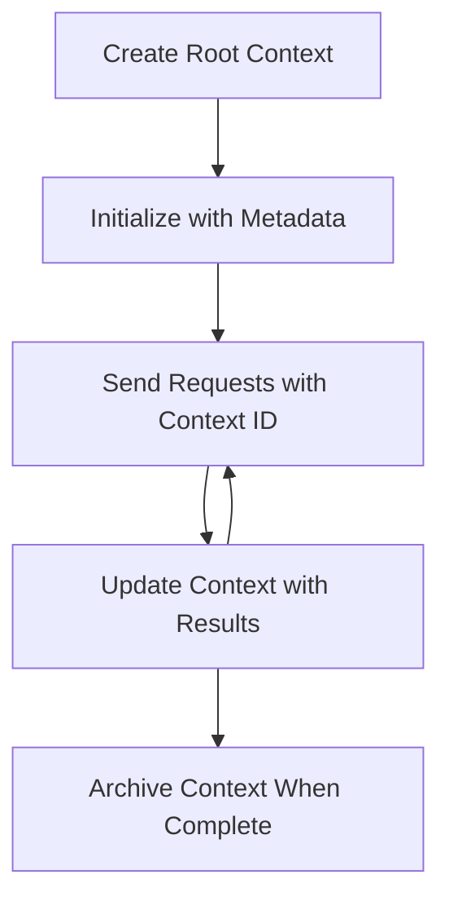

<!--
CO_OP_TRANSLATOR_METADATA:
{
  "original_hash": "ebdb86db46113f1cbd59ce4c74caaa79",
  "translation_date": "2025-07-17T08:05:06+00:00",
  "source_file": "05-AdvancedTopics/mcp-root-contexts/README.md",
  "language_code": "ms"
}
-->
# MCP Root Contexts

Root contexts adalah konsep asas dalam Model Context Protocol yang menyediakan lapisan berterusan untuk mengekalkan sejarah perbualan dan keadaan dikongsi merentasi pelbagai permintaan dan sesi.

## Pengenalan

Dalam pelajaran ini, kita akan meneroka cara untuk mencipta, mengurus, dan menggunakan root contexts dalam MCP.

## Objektif Pembelajaran

Menjelang akhir pelajaran ini, anda akan dapat:

- Memahami tujuan dan struktur root contexts  
- Mencipta dan mengurus root contexts menggunakan perpustakaan klien MCP  
- Melaksanakan root contexts dalam aplikasi .NET, Java, JavaScript, dan Python  
- Menggunakan root contexts untuk perbualan berbilang pusingan dan pengurusan keadaan  
- Melaksanakan amalan terbaik untuk pengurusan root context  

## Memahami Root Contexts

Root contexts berfungsi sebagai bekas yang menyimpan sejarah dan keadaan untuk siri interaksi yang berkaitan. Ia membolehkan:

- **Kekekalan Perbualan**: Mengekalkan perbualan berbilang pusingan yang koheren  
- **Pengurusan Memori**: Menyimpan dan mengambil maklumat merentasi interaksi  
- **Pengurusan Keadaan**: Menjejak kemajuan dalam aliran kerja yang kompleks  
- **Perkongsian Konteks**: Membenarkan pelbagai klien mengakses keadaan perbualan yang sama  

Dalam MCP, root contexts mempunyai ciri-ciri utama berikut:

- Setiap root context mempunyai pengecam unik.  
- Ia boleh mengandungi sejarah perbualan, keutamaan pengguna, dan metadata lain.  
- Ia boleh dicipta, diakses, dan diarkibkan mengikut keperluan.  
- Ia menyokong kawalan akses dan kebenaran yang terperinci.  

## Kitaran Hayat Root Context



## Bekerja dengan Root Contexts

Berikut adalah contoh cara untuk mencipta dan mengurus root contexts.

### Pelaksanaan C#

```csharp
// .NET Example: Root Context Management
using Microsoft.Mcp.Client;
using System;
using System.Threading.Tasks;
using System.Collections.Generic;

public class RootContextExample
{
    private readonly IMcpClient _client;
    private readonly IRootContextManager _contextManager;
    
    public RootContextExample(IMcpClient client, IRootContextManager contextManager)
    {
        _client = client;
        _contextManager = contextManager;
    }
    
    public async Task DemonstrateRootContextAsync()
    {
        // 1. Create a new root context
        var contextResult = await _contextManager.CreateRootContextAsync(new RootContextCreateOptions
        {
            Name = "Customer Support Session",
            Metadata = new Dictionary<string, string>
            {
                ["CustomerName"] = "Acme Corporation",
                ["PriorityLevel"] = "High",
                ["Domain"] = "Cloud Services"
            }
        });
        
        string contextId = contextResult.ContextId;
        Console.WriteLine($"Created root context with ID: {contextId}");
        
        // 2. First interaction using the context
        var response1 = await _client.SendPromptAsync(
            "I'm having issues scaling my web service deployment in the cloud.", 
            new SendPromptOptions { RootContextId = contextId }
        );
        
        Console.WriteLine($"First response: {response1.GeneratedText}");
        
        // Second interaction - the model will have access to the previous conversation
        var response2 = await _client.SendPromptAsync(
            "Yes, we're using containerized deployments with Kubernetes.", 
            new SendPromptOptions { RootContextId = contextId }
        );
        
        Console.WriteLine($"Second response: {response2.GeneratedText}");
        
        // 3. Add metadata to the context based on conversation
        await _contextManager.UpdateContextMetadataAsync(contextId, new Dictionary<string, string>
        {
            ["TechnicalEnvironment"] = "Kubernetes",
            ["IssueType"] = "Scaling"
        });
        
        // 4. Get context information
        var contextInfo = await _contextManager.GetRootContextInfoAsync(contextId);
        
        Console.WriteLine("Context Information:");
        Console.WriteLine($"- Name: {contextInfo.Name}");
        Console.WriteLine($"- Created: {contextInfo.CreatedAt}");
        Console.WriteLine($"- Messages: {contextInfo.MessageCount}");
        
        // 5. When the conversation is complete, archive the context
        await _contextManager.ArchiveRootContextAsync(contextId);
        Console.WriteLine($"Archived context {contextId}");
    }
}
```

Dalam kod di atas, kami telah:

1. Mencipta root context untuk sesi sokongan pelanggan.  
1. Menghantar beberapa mesej dalam konteks tersebut, membolehkan model mengekalkan keadaan.  
1. Mengemas kini konteks dengan metadata yang berkaitan berdasarkan perbualan.  
1. Mendapatkan maklumat konteks untuk memahami sejarah perbualan.  
1. Mengarkibkan konteks apabila perbualan selesai.  

## Contoh: Pelaksanaan Root Context untuk analisis kewangan

Dalam contoh ini, kita akan mencipta root context untuk sesi analisis kewangan, menunjukkan cara mengekalkan keadaan merentasi pelbagai interaksi.

### Pelaksanaan Java

```java
// Java Example: Root Context Implementation
package com.example.mcp.contexts;

import com.mcp.client.McpClient;
import com.mcp.client.ContextManager;
import com.mcp.models.RootContext;
import com.mcp.models.McpResponse;

import java.util.HashMap;
import java.util.Map;
import java.util.UUID;

public class RootContextsDemo {
    private final McpClient client;
    private final ContextManager contextManager;
    
    public RootContextsDemo(String serverUrl) {
        this.client = new McpClient.Builder()
            .setServerUrl(serverUrl)
            .build();
            
        this.contextManager = new ContextManager(client);
    }
    
    public void demonstrateRootContext() throws Exception {
        // Create context metadata
        Map<String, String> metadata = new HashMap<>();
        metadata.put("projectName", "Financial Analysis");
        metadata.put("userRole", "Financial Analyst");
        metadata.put("dataSource", "Q1 2025 Financial Reports");
        
        // 1. Create a new root context
        RootContext context = contextManager.createRootContext("Financial Analysis Session", metadata);
        String contextId = context.getId();
        
        System.out.println("Created context: " + contextId);
        
        // 2. First interaction
        McpResponse response1 = client.sendPrompt(
            "Analyze the trends in Q1 financial data for our technology division",
            contextId
        );
        
        System.out.println("First response: " + response1.getGeneratedText());
        
        // 3. Update context with important information gained from response
        contextManager.addContextMetadata(contextId, 
            Map.of("identifiedTrend", "Increasing cloud infrastructure costs"));
        
        // Second interaction - using the same context
        McpResponse response2 = client.sendPrompt(
            "What's driving the increase in cloud infrastructure costs?",
            contextId
        );
        
        System.out.println("Second response: " + response2.getGeneratedText());
        
        // 4. Generate a summary of the analysis session
        McpResponse summaryResponse = client.sendPrompt(
            "Summarize our analysis of the technology division financials in 3-5 key points",
            contextId
        );
        
        // Store the summary in context metadata
        contextManager.addContextMetadata(contextId, 
            Map.of("analysisSummary", summaryResponse.getGeneratedText()));
            
        // Get updated context information
        RootContext updatedContext = contextManager.getRootContext(contextId);
        
        System.out.println("Context Information:");
        System.out.println("- Created: " + updatedContext.getCreatedAt());
        System.out.println("- Last Updated: " + updatedContext.getLastUpdatedAt());
        System.out.println("- Analysis Summary: " + 
            updatedContext.getMetadata().get("analysisSummary"));
            
        // 5. Archive context when done
        contextManager.archiveContext(contextId);
        System.out.println("Context archived");
    }
}
```

Dalam kod di atas, kami telah:

1. Mencipta root context untuk sesi analisis kewangan.  
2. Menghantar beberapa mesej dalam konteks tersebut, membolehkan model mengekalkan keadaan.  
3. Mengemas kini konteks dengan metadata yang berkaitan berdasarkan perbualan.  
4. Menjana ringkasan sesi analisis dan menyimpannya dalam metadata konteks.  
5. Mengarkibkan konteks apabila perbualan selesai.  

## Contoh: Pengurusan Root Context

Pengurusan root contexts dengan berkesan adalah penting untuk mengekalkan sejarah perbualan dan keadaan. Berikut adalah contoh cara melaksanakan pengurusan root context.

### Pelaksanaan JavaScript

```javascript
// JavaScript Example: Managing MCP Root Contexts
const { McpClient, RootContextManager } = require('@mcp/client');

class ContextSession {
  constructor(serverUrl, apiKey = null) {
    // Initialize the MCP client
    this.client = new McpClient({
      serverUrl,
      apiKey
    });
    
    // Initialize context manager
    this.contextManager = new RootContextManager(this.client);
  }
  
  /**
   * Create a new conversation context
   * @param {string} sessionName - Name of the conversation session
   * @param {Object} metadata - Additional metadata for the context
   * @returns {Promise<string>} - Context ID
   */
  async createConversationContext(sessionName, metadata = {}) {
    try {
      const contextResult = await this.contextManager.createRootContext({
        name: sessionName,
        metadata: {
          ...metadata,
          createdAt: new Date().toISOString(),
          status: 'active'
        }
      });
      
      console.log(`Created root context '${sessionName}' with ID: ${contextResult.id}`);
      return contextResult.id;
    } catch (error) {
      console.error('Error creating root context:', error);
      throw error;
    }
  }
  
  /**
   * Send a message in an existing context
   * @param {string} contextId - The root context ID
   * @param {string} message - The user's message
   * @param {Object} options - Additional options
   * @returns {Promise<Object>} - Response data
   */
  async sendMessage(contextId, message, options = {}) {
    try {
      // Send the message using the specified context
      const response = await this.client.sendPrompt(message, {
        rootContextId: contextId,
        temperature: options.temperature || 0.7,
        allowedTools: options.allowedTools || []
      });
      
      // Optionally store important insights from the conversation
      if (options.storeInsights) {
        await this.storeConversationInsights(contextId, message, response.generatedText);
      }
      
      return {
        message: response.generatedText,
        toolCalls: response.toolCalls || [],
        contextId
      };
    } catch (error) {
      console.error(`Error sending message in context ${contextId}:`, error);
      throw error;
    }
  }
  
  /**
   * Store important insights from a conversation
   * @param {string} contextId - The root context ID
   * @param {string} userMessage - User's message
   * @param {string} aiResponse - AI's response
   */
  async storeConversationInsights(contextId, userMessage, aiResponse) {
    try {
      // Extract potential insights (in a real app, this would be more sophisticated)
      const combinedText = userMessage + "\n" + aiResponse;
      
      // Simple heuristic to identify potential insights
      const insightWords = ["important", "key point", "remember", "significant", "crucial"];
      
      const potentialInsights = combinedText
        .split(".")
        .filter(sentence => 
          insightWords.some(word => sentence.toLowerCase().includes(word))
        )
        .map(sentence => sentence.trim())
        .filter(sentence => sentence.length > 10);
      
      // Store insights in context metadata
      if (potentialInsights.length > 0) {
        const insights = {};
        potentialInsights.forEach((insight, index) => {
          insights[`insight_${Date.now()}_${index}`] = insight;
        });
        
        await this.contextManager.updateContextMetadata(contextId, insights);
        console.log(`Stored ${potentialInsights.length} insights in context ${contextId}`);
      }
    } catch (error) {
      console.warn('Error storing conversation insights:', error);
      // Non-critical error, so just log warning
    }
  }
  
  /**
   * Get summary information about a context
   * @param {string} contextId - The root context ID
   * @returns {Promise<Object>} - Context information
   */
  async getContextInfo(contextId) {
    try {
      const contextInfo = await this.contextManager.getContextInfo(contextId);
      
      return {
        id: contextInfo.id,
        name: contextInfo.name,
        created: new Date(contextInfo.createdAt).toLocaleString(),
        lastUpdated: new Date(contextInfo.lastUpdatedAt).toLocaleString(),
        messageCount: contextInfo.messageCount,
        metadata: contextInfo.metadata,
        status: contextInfo.status
      };
    } catch (error) {
      console.error(`Error getting context info for ${contextId}:`, error);
      throw error;
    }
  }
  
  /**
   * Generate a summary of the conversation in a context
   * @param {string} contextId - The root context ID
   * @returns {Promise<string>} - Generated summary
   */
  async generateContextSummary(contextId) {
    try {
      // Ask the model to generate a summary of the conversation so far
      const response = await this.client.sendPrompt(
        "Please summarize our conversation so far in 3-4 sentences, highlighting the main points discussed.",
        { rootContextId: contextId, temperature: 0.3 }
      );
      
      // Store the summary in context metadata
      await this.contextManager.updateContextMetadata(contextId, {
        conversationSummary: response.generatedText,
        summarizedAt: new Date().toISOString()
      });
      
      return response.generatedText;
    } catch (error) {
      console.error(`Error generating context summary for ${contextId}:`, error);
      throw error;
    }
  }
  
  /**
   * Archive a context when it's no longer needed
   * @param {string} contextId - The root context ID
   * @returns {Promise<Object>} - Result of the archive operation
   */
  async archiveContext(contextId) {
    try {
      // Generate a final summary before archiving
      const summary = await this.generateContextSummary(contextId);
      
      // Archive the context
      await this.contextManager.archiveContext(contextId);
      
      return {
        status: "archived",
        contextId,
        summary
      };
    } catch (error) {
      console.error(`Error archiving context ${contextId}:`, error);
      throw error;
    }
  }
}

// Example usage
async function demonstrateContextSession() {
  const session = new ContextSession('https://mcp-server-example.com');
  
  try {
    // 1. Create a new context for a product support conversation
    const contextId = await session.createConversationContext(
      'Product Support - Database Performance',
      {
        customer: 'Globex Corporation',
        product: 'Enterprise Database',
        severity: 'Medium',
        supportAgent: 'AI Assistant'
      }
    );
    
    // 2. First message in the conversation
    const response1 = await session.sendMessage(
      contextId,
      "I'm experiencing slow query performance on our database cluster after the latest update.",
      { storeInsights: true }
    );
    console.log('Response 1:', response1.message);
    
    // Follow-up message in the same context
    const response2 = await session.sendMessage(
      contextId,
      "Yes, we've already checked the indexes and they seem to be properly configured.",
      { storeInsights: true }
    );
    console.log('Response 2:', response2.message);
    
    // 3. Get information about the context
    const contextInfo = await session.getContextInfo(contextId);
    console.log('Context Information:', contextInfo);
    
    // 4. Generate and display conversation summary
    const summary = await session.generateContextSummary(contextId);
    console.log('Conversation Summary:', summary);
    
    // 5. Archive the context when done
    const archiveResult = await session.archiveContext(contextId);
    console.log('Archive Result:', archiveResult);
    
    // 6. Handle any errors gracefully
  } catch (error) {
    console.error('Error in context session demonstration:', error);
  }
}

demonstrateContextSession();
```

Dalam kod di atas, kami telah:

1. Mencipta root context untuk perbualan sokongan produk dengan fungsi `createConversationContext`. Dalam kes ini, konteks berkaitan isu prestasi pangkalan data.  

1. Menghantar beberapa mesej dalam konteks tersebut, membolehkan model mengekalkan keadaan dengan fungsi `sendMessage`. Mesej yang dihantar berkaitan prestasi pertanyaan yang perlahan dan konfigurasi indeks.  

1. Mengemas kini konteks dengan metadata yang berkaitan berdasarkan perbualan.  

1. Menjana ringkasan perbualan dan menyimpannya dalam metadata konteks dengan fungsi `generateContextSummary`.  

1. Mengarkibkan konteks apabila perbualan selesai dengan fungsi `archiveContext`.  

1. Mengendalikan ralat dengan baik untuk memastikan ketahanan.  

## Root Context untuk Bantuan Berbilang Pusingan

Dalam contoh ini, kita akan mencipta root context untuk sesi bantuan berbilang pusingan, menunjukkan cara mengekalkan keadaan merentasi pelbagai interaksi.

### Pelaksanaan Python

```python
# Python Example: Root Context for Multi-Turn Assistance
import asyncio
from datetime import datetime
from mcp_client import McpClient, RootContextManager

class AssistantSession:
    def __init__(self, server_url, api_key=None):
        self.client = McpClient(server_url=server_url, api_key=api_key)
        self.context_manager = RootContextManager(self.client)
    
    async def create_session(self, name, user_info=None):
        """Create a new root context for an assistant session"""
        metadata = {
            "session_type": "assistant",
            "created_at": datetime.now().isoformat(),
        }
        
        # Add user information if provided
        if user_info:
            metadata.update({f"user_{k}": v for k, v in user_info.items()})
            
        # Create the root context
        context = await self.context_manager.create_root_context(name, metadata)
        return context.id
    
    async def send_message(self, context_id, message, tools=None):
        """Send a message within a root context"""
        # Create options with context ID
        options = {
            "root_context_id": context_id
        }
        
        # Add tools if specified
        if tools:
            options["allowed_tools"] = tools
        
        # Send the prompt within the context
        response = await self.client.send_prompt(message, options)
        
        # Update context metadata with conversation progress
        await self.context_manager.update_context_metadata(
            context_id,
            {
                f"message_{datetime.now().timestamp()}": message[:50] + "...",
                "last_interaction": datetime.now().isoformat()
            }
        )
        
        return response
    
    async def get_conversation_history(self, context_id):
        """Retrieve conversation history from a context"""
        context_info = await self.context_manager.get_context_info(context_id)
        messages = await self.client.get_context_messages(context_id)
        
        return {
            "context_info": context_info,
            "messages": messages
        }
    
    async def end_session(self, context_id):
        """End an assistant session by archiving the context"""
        # Generate a summary prompt first
        summary_response = await self.client.send_prompt(
            "Please summarize our conversation and any key points or decisions made.",
            {"root_context_id": context_id}
        )
        
        # Store summary in metadata
        await self.context_manager.update_context_metadata(
            context_id,
            {
                "summary": summary_response.generated_text,
                "ended_at": datetime.now().isoformat(),
                "status": "completed"
            }
        )
        
        # Archive the context
        await self.context_manager.archive_context(context_id)
        
        return {
            "status": "completed",
            "summary": summary_response.generated_text
        }

# Example usage
async def demo_assistant_session():
    assistant = AssistantSession("https://mcp-server-example.com")
    
    # 1. Create session
    context_id = await assistant.create_session(
        "Technical Support Session",
        {"name": "Alex", "technical_level": "advanced", "product": "Cloud Services"}
    )
    print(f"Created session with context ID: {context_id}")
    
    # 2. First interaction
    response1 = await assistant.send_message(
        context_id, 
        "I'm having trouble with the auto-scaling feature in your cloud platform.",
        ["documentation_search", "diagnostic_tool"]
    )
    print(f"Response 1: {response1.generated_text}")
    
    # Second interaction in the same context
    response2 = await assistant.send_message(
        context_id,
        "Yes, I've already checked the configuration settings you mentioned, but it's still not working."
    )
    print(f"Response 2: {response2.generated_text}")
    
    # 3. Get history
    history = await assistant.get_conversation_history(context_id)
    print(f"Session has {len(history['messages'])} messages")
    
    # 4. End session
    end_result = await assistant.end_session(context_id)
    print(f"Session ended with summary: {end_result['summary']}")

if __name__ == "__main__":
    asyncio.run(demo_assistant_session())
```

Dalam kod di atas, kami telah:

1. Mencipta root context untuk sesi sokongan teknikal dengan fungsi `create_session`. Konteks termasuk maklumat pengguna seperti nama dan tahap teknikal.  

1. Menghantar beberapa mesej dalam konteks tersebut, membolehkan model mengekalkan keadaan dengan fungsi `send_message`. Mesej yang dihantar berkaitan isu dengan ciri auto-scaling.  

1. Mendapatkan sejarah perbualan menggunakan fungsi `get_conversation_history`, yang menyediakan maklumat konteks dan mesej.  

1. Menamatkan sesi dengan mengarkibkan konteks dan menjana ringkasan dengan fungsi `end_session`. Ringkasan menangkap perkara penting dari perbualan.  

## Amalan Terbaik Root Context

Berikut adalah beberapa amalan terbaik untuk mengurus root contexts dengan berkesan:

- **Cipta Konteks Fokus**: Cipta root contexts berasingan untuk tujuan atau domain perbualan yang berbeza bagi mengekalkan kejelasan.  

- **Tetapkan Polisi Luput**: Laksanakan polisi untuk mengarkib atau memadam konteks lama bagi mengurus storan dan mematuhi polisi penyimpanan data.  

- **Simpan Metadata Berkaitan**: Gunakan metadata konteks untuk menyimpan maklumat penting tentang perbualan yang mungkin berguna kemudian.  

- **Gunakan ID Konteks Secara Konsisten**: Setelah konteks dicipta, gunakan ID tersebut secara konsisten untuk semua permintaan berkaitan bagi mengekalkan kesinambungan.  

- **Jana Ringkasan**: Apabila konteks menjadi besar, pertimbangkan untuk menjana ringkasan bagi menangkap maklumat penting sambil mengurus saiz konteks.  

- **Laksanakan Kawalan Akses**: Untuk sistem berbilang pengguna, laksanakan kawalan akses yang betul untuk memastikan privasi dan keselamatan konteks perbualan.  

- **Tangani Had Konteks**: Sedar akan had saiz konteks dan laksanakan strategi untuk mengendalikan perbualan yang sangat panjang.  

- **Arkibkan Apabila Selesai**: Arkibkan konteks apabila perbualan selesai untuk membebaskan sumber sambil mengekalkan sejarah perbualan.  

## Apa Seterusnya

- [5.5 Routing](../mcp-routing/README.md)

**Penafian**:  
Dokumen ini telah diterjemahkan menggunakan perkhidmatan terjemahan AI [Co-op Translator](https://github.com/Azure/co-op-translator). Walaupun kami berusaha untuk ketepatan, sila ambil maklum bahawa terjemahan automatik mungkin mengandungi kesilapan atau ketidaktepatan. Dokumen asal dalam bahasa asalnya harus dianggap sebagai sumber yang sahih. Untuk maklumat penting, terjemahan profesional oleh manusia adalah disyorkan. Kami tidak bertanggungjawab atas sebarang salah faham atau salah tafsir yang timbul daripada penggunaan terjemahan ini.