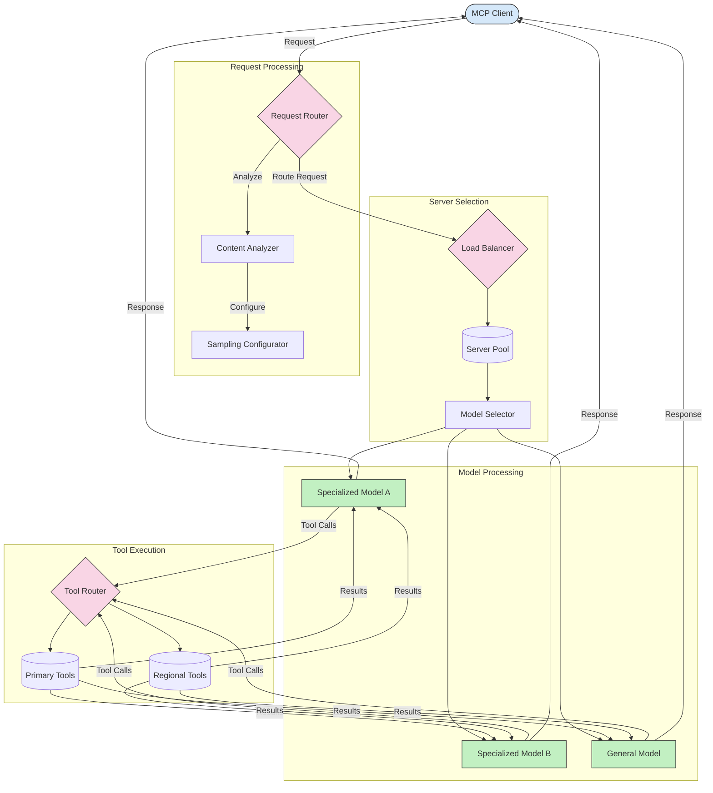

<!--
CO_OP_TRANSLATOR_METADATA:
{
  "original_hash": "af40eab7bd6ebf7e607f982a5506a5b5",
  "translation_date": "2025-06-13T00:37:52+00:00",
  "source_file": "05-AdvancedTopics/mcp-routing/README.md",
  "language_code": "ms"
}
-->
## MCP-ում նմուշառում և երթուղավորումի ճարտարապետություն

Նմուշարումը Model Context Protocol (MCP)-ի կարևոր բաղադրիչ է, որը հնարավորություն է տալիս արդյունավետ մշակել և երթուղավորել հարցումները: Այն ներառում է ներթափանցող հարցումների վերլուծություն՝ որոշելու համար ամենահարմար մոդելը կամ ծառայությունը, որը կկառավարի դրանք՝ հիմնվելով տարբեր չափանիշների վրա, ինչպիսիք են բովանդակության տեսակը, օգտվողի կոնտեքստը և համակարգի բեռնվածությունը:

Նմուշարումը և երթուղավորումը կարող են համատեղ օգտագործվել՝ ստեղծելով ամուր ճարտարապետություն, որը օպտիմալացնում է ռեսուրսների օգտագործումը և ապահովում բարձր հասանելիություն: Նմուշարումն օգտագործվում է հարցումների դասակարգման համար, իսկ երթուղավորումը ուղղորդում է դրանք համապատասխան մոդելներին կամ ծառայություններին:

Ստորև ներկայացված է դիագրամ, որը ցույց է տալիս, թե ինչպես են նմուշարումն ու երթուղավորումը միասին աշխատում MCP-ի համապարփակ ճարտարապետության մեջ:

## Ի՞նչ է հաջորդը

- [5.6 Նմուշառում](../mcp-sampling/README.md)

**Penafian**:  
Dokumen ini telah diterjemahkan menggunakan perkhidmatan terjemahan AI [Co-op Translator](https://github.com/Azure/co-op-translator). Walaupun kami berusaha untuk ketepatan, sila ambil perhatian bahawa terjemahan automatik mungkin mengandungi kesilapan atau ketidaktepatan. Dokumen asal dalam bahasa asalnya hendaklah dianggap sebagai sumber yang sahih. Untuk maklumat penting, terjemahan profesional oleh manusia adalah disyorkan. Kami tidak bertanggungjawab terhadap sebarang salah faham atau salah tafsir yang timbul daripada penggunaan terjemahan ini.