<!--
CO_OP_TRANSLATOR_METADATA:
{
  "original_hash": "0abf26a6c4dbe905d5d49ccdc0ccfe92",
  "translation_date": "2025-06-26T16:36:26+00:00",
  "source_file": "05-AdvancedTopics/mcp-security-entra/README.md",
  "language_code": "ms"
}
-->
# Melindungi Aliran Kerja AI: Pengesahan Entra ID untuk Pelayan Protokol Konteks Model

## Pengenalan  
Melindungi pelayan Model Context Protocol (MCP) anda sama pentingnya seperti mengunci pintu depan rumah anda. Membiarkan pelayan MCP anda terbuka mendedahkan alat dan data anda kepada akses tanpa kebenaran, yang boleh menyebabkan pelanggaran keselamatan. Microsoft Entra ID menyediakan penyelesaian pengurusan identiti dan akses berasaskan awan yang kukuh, membantu memastikan hanya pengguna dan aplikasi yang dibenarkan dapat berinteraksi dengan pelayan MCP anda. Dalam bahagian ini, anda akan belajar bagaimana melindungi aliran kerja AI anda menggunakan pengesahan Entra ID.

## Objektif Pembelajaran  
Menjelang akhir bahagian ini, anda akan dapat:

- Memahami kepentingan melindungi pelayan MCP.  
- Menerangkan asas Microsoft Entra ID dan pengesahan OAuth 2.0.  
- Mengenal pasti perbezaan antara klien awam dan klien sulit.  
- Melaksanakan pengesahan Entra ID dalam senario pelayan MCP tempatan (klien awam) dan jauh (klien sulit).  
- Mengaplikasikan amalan terbaik keselamatan ketika membangunkan aliran kerja AI.  

## Keselamatan dan MCP  

Sama seperti anda tidak akan membiarkan pintu depan rumah anda terbuka, anda juga tidak seharusnya membiarkan pelayan MCP anda boleh diakses oleh sesiapa sahaja. Melindungi aliran kerja AI anda adalah penting untuk membina aplikasi yang kukuh, boleh dipercayai, dan selamat. Bab ini akan memperkenalkan anda kepada penggunaan Microsoft Entra ID untuk mengamankan pelayan MCP anda, memastikan hanya pengguna dan aplikasi yang dibenarkan dapat berinteraksi dengan alat dan data anda.

## Mengapa Keselamatan Penting untuk Pelayan MCP  

Bayangkan pelayan MCP anda mempunyai alat yang boleh menghantar emel atau mengakses pangkalan data pelanggan. Pelayan yang tidak selamat bermakna sesiapa sahaja boleh menggunakan alat tersebut, menyebabkan akses data tanpa kebenaran, spam, atau aktiviti berniat jahat lain.

Dengan melaksanakan pengesahan, anda memastikan setiap permintaan ke pelayan anda disahkan, mengesahkan identiti pengguna atau aplikasi yang membuat permintaan tersebut. Ini adalah langkah pertama dan paling kritikal dalam melindungi aliran kerja AI anda.

## Pengenalan kepada Microsoft Entra ID  

[**Microsoft Entra ID**](https://adoption.microsoft.com/microsoft-security/entra/) adalah perkhidmatan pengurusan identiti dan akses berasaskan awan. Anggap ia sebagai pengawal keselamatan sejagat untuk aplikasi anda. Ia mengendalikan proses rumit untuk mengesahkan identiti pengguna (pengesahan) dan menentukan apa yang mereka dibenarkan lakukan (autorisasi).

Dengan menggunakan Entra ID, anda boleh:

- Mengaktifkan log masuk yang selamat untuk pengguna.  
- Melindungi API dan perkhidmatan.  
- Mengurus dasar akses dari satu lokasi pusat.  

Untuk pelayan MCP, Entra ID menyediakan penyelesaian yang kukuh dan dipercayai secara meluas untuk mengurus siapa yang boleh mengakses keupayaan pelayan anda.

---

## Memahami Keajaiban: Bagaimana Pengesahan Entra ID Berfungsi  

Entra ID menggunakan standard terbuka seperti **OAuth 2.0** untuk mengendalikan pengesahan. Walaupun butirannya boleh menjadi rumit, konsep asasnya mudah dan boleh difahami melalui analogi.

### Pengenalan Ringkas kepada OAuth 2.0: Kunci Valet  

Bayangkan OAuth 2.0 seperti perkhidmatan valet untuk kereta anda. Apabila anda tiba di restoran, anda tidak memberikan kunci utama anda kepada valet. Sebaliknya, anda memberikan **kunci valet** yang mempunyai kebenaran terhad—ia boleh menghidupkan kereta dan mengunci pintu, tetapi tidak boleh membuka but atau petak sarung tangan.

Dalam analogi ini:

- **Anda** adalah **Pengguna**.  
- **Kereta anda** adalah **Pelayan MCP** dengan alat dan data berharga.  
- **Valet** adalah **Microsoft Entra ID**.  
- **Pegawai Letak Kereta** adalah **Klien MCP** (aplikasi yang cuba mengakses pelayan).  
- **Kunci Valet** adalah **Token Akses**.  

Token akses adalah rentetan teks selamat yang diterima klien MCP dari Entra ID selepas anda log masuk. Klien kemudian mempersembahkan token ini kepada pelayan MCP dengan setiap permintaan. Pelayan boleh mengesahkan token untuk memastikan permintaan itu sah dan klien mempunyai kebenaran yang diperlukan, tanpa perlu mengendalikan kelayakan sebenar anda (seperti kata laluan).

### Aliran Pengesahan  

Berikut adalah cara proses ini berfungsi dalam praktik:

```mermaid
sequenceDiagram
    actor User as 👤 User
    participant Client as ðŸ–¥ï¸ MCP Client
    participant Entra as 🔠Microsoft Entra ID
    participant Server as 🔧 MCP Server

    Client->>+User: Please sign in to continue.
    User->>+Entra: Enters credentials (username/password).
    Entra-->>Client: Here is your access token.
    User-->>-Client: (Returns to the application)

    Client->>+Server: I need to use a tool. Here is my access token.
    Server->>+Entra: Is this access token valid?
    Entra-->>-Server: Yes, it is.
    Server-->>-Client: Token is valid. Here is the result of the tool.
```



### Memperkenalkan Perpustakaan Pengesahan Microsoft (MSAL)  

Sebelum kita menyelami kod, penting untuk memperkenalkan komponen utama yang akan anda lihat dalam contoh: **Microsoft Authentication Library (MSAL)**.

MSAL adalah perpustakaan yang dibangunkan oleh Microsoft yang memudahkan pembangun mengendalikan pengesahan. Daripada anda menulis semua kod rumit untuk mengurus token keselamatan, pengurusan log masuk, dan penyegaran sesi, MSAL mengendalikan tugas berat tersebut.

Menggunakan perpustakaan seperti MSAL sangat disarankan kerana:

- **Ia Selamat:** Melaksanakan protokol standard industri dan amalan keselamatan terbaik, mengurangkan risiko kelemahan dalam kod anda.  
- **Memudahkan Pembangunan:** Mengabstrakkan kerumitan protokol OAuth 2.0 dan OpenID Connect, membolehkan anda menambah pengesahan yang kukuh ke aplikasi anda dengan hanya beberapa baris kod.  
- **Diselenggara:** Microsoft secara aktif menyelenggara dan mengemas kini MSAL untuk menangani ancaman keselamatan baru dan perubahan platform.  

MSAL menyokong pelbagai bahasa dan rangka kerja aplikasi, termasuk .NET, JavaScript/TypeScript, Python, Java, Go, dan platform mudah alih seperti iOS dan Android. Ini bermakna anda boleh menggunakan corak pengesahan yang konsisten merentasi seluruh tumpukan teknologi anda.

Untuk mengetahui lebih lanjut mengenai MSAL, anda boleh merujuk dokumentasi rasmi [gambaran keseluruhan MSAL](https://learn.microsoft.com/entra/identity-platform/msal-overview).

---

## Melindungi Pelayan MCP Anda dengan Entra ID: Panduan Langkah demi Langkah  

Sekarang, mari kita lihat bagaimana untuk melindungi pelayan MCP tempatan (yang berkomunikasi melalui `stdio`) using Entra ID. This example uses a **public client**, which is suitable for applications running on a user's machine, like a desktop app or a local development server.

### Scenario 1: Securing a Local MCP Server (with a Public Client)

In this scenario, we'll look at an MCP server that runs locally, communicates over `stdio`, and uses Entra ID to authenticate the user before allowing access to its tools. The server will have a single tool that fetches the user's profile information from the Microsoft Graph API.

#### 1. Setting Up the Application in Entra ID

Before writing any code, you need to register your application in Microsoft Entra ID. This tells Entra ID about your application and grants it permission to use the authentication service.

1. Navigate to the **[Microsoft Entra portal](https://entra.microsoft.com/)**.
2. Go to **App registrations** and click **New registration**.
3. Give your application a name (e.g., "My Local MCP Server").
4. For **Supported account types**, select **Accounts in this organizational directory only**.
5. You can leave the **Redirect URI** blank for this example.
6. Click **Register**.

Once registered, take note of the **Application (client) ID** and **Directory (tenant) ID**. You'll need these in your code.

#### 2. The Code: A Breakdown

Let's look at the key parts of the code that handle authentication. The full code for this example is available in the [Entra ID - Local - WAM](https://github.com/Azure-Samples/mcp-auth-servers/tree/main/src/entra-id-local-wam) folder of the [mcp-auth-servers GitHub repository](https://github.com/Azure-Samples/mcp-auth-servers).

**`AuthenticationService.cs`**

This class is responsible for handling the interaction with Entra ID.

- **`CreateAsync`**: This method initializes the `PublicClientApplication` from the MSAL (Microsoft Authentication Library). It's configured with your application's `clientId` and `tenantId`.
- **`WithBroker`**: This enables the use of a broker (like the Windows Web Account Manager), which provides a more secure and seamless single sign-on experience.
- **`AcquireTokenAsync`**: Ini adalah kaedah teras. Ia pertama kali cuba mendapatkan token secara senyap (bermaksud pengguna tidak perlu log masuk semula jika sudah mempunyai sesi sah). Jika token senyap tidak dapat diperoleh, ia akan menggesa pengguna untuk log masuk secara interaktif.

```csharp
// Simplified for clarity
public static async Task<AuthenticationService> CreateAsync(ILogger<AuthenticationService> logger)
{
    var msalClient = PublicClientApplicationBuilder
        .Create(_clientId) // Your Application (client) ID
        .WithAuthority(AadAuthorityAudience.AzureAdMyOrg)
        .WithTenantId(_tenantId) // Your Directory (tenant) ID
        .WithBroker(new BrokerOptions(BrokerOptions.OperatingSystems.Windows))
        .Build();

    // ... cache registration ...

    return new AuthenticationService(logger, msalClient);
}

public async Task<string> AcquireTokenAsync()
{
    try
    {
        // Try silent authentication first
        var accounts = await _msalClient.GetAccountsAsync();
        var account = accounts.FirstOrDefault();

        AuthenticationResult? result = null;

        if (account != null)
        {
            result = await _msalClient.AcquireTokenSilent(_scopes, account).ExecuteAsync();
        }
        else
        {
            // If no account, or silent fails, go interactive
            result = await _msalClient.AcquireTokenInteractive(_scopes).ExecuteAsync();
        }

        return result.AccessToken;
    }
    catch (Exception ex)
    {
        _logger.LogError(ex, "An error occurred while acquiring the token.");
        throw; // Optionally rethrow the exception for higher-level handling
    }
}
```

**`Program.cs`**

This is where the MCP server is set up and the authentication service is integrated.

- **`AddSingleton<AuthenticationService>`**: This registers the `AuthenticationService` with the dependency injection container, so it can be used by other parts of the application (like our tool).
- **`GetUserDetailsFromGraph` tool**: This tool requires an instance of `AuthenticationService`. Before it does anything, it calls `authService.AcquireTokenAsync()` untuk mendapatkan token akses yang sah. Jika pengesahan berjaya, ia menggunakan token tersebut untuk memanggil Microsoft Graph API dan mendapatkan butiran pengguna.

```csharp
// Simplified for clarity
[McpServerTool(Name = "GetUserDetailsFromGraph")]
public static async Task<string> GetUserDetailsFromGraph(
    AuthenticationService authService)
{
    try
    {
        // This will trigger the authentication flow
        var accessToken = await authService.AcquireTokenAsync();

        // Use the token to create a GraphServiceClient
        var graphClient = new GraphServiceClient(
            new BaseBearerTokenAuthenticationProvider(new TokenProvider(authService)));

        var user = await graphClient.Me.GetAsync();

        return System.Text.Json.JsonSerializer.Serialize(user);
    }
    catch (Exception ex)
    {
        return $"Error: {ex.Message}";
    }
}
```

#### 3. Bagaimana Semua Ini Berfungsi Bersama  

1. Apabila klien MCP cuba menggunakan `GetUserDetailsFromGraph` tool, the tool first calls `AcquireTokenAsync`.
2. `AcquireTokenAsync` triggers the MSAL library to check for a valid token.
3. If no token is found, MSAL, through the broker, will prompt the user to sign in with their Entra ID account.
4. Once the user signs in, Entra ID issues an access token.
5. The tool receives the token and uses it to make a secure call to the Microsoft Graph API.
6. The user's details are returned to the MCP client.

This process ensures that only authenticated users can use the tool, effectively securing your local MCP server.

### Scenario 2: Securing a Remote MCP Server (with a Confidential Client)

When your MCP server is running on a remote machine (like a cloud server) and communicates over a protocol like HTTP Streaming, the security requirements are different. In this case, you should use a **confidential client** and the **Authorization Code Flow**. This is a more secure method because the application's secrets are never exposed to the browser.

This example uses a TypeScript-based MCP server that uses Express.js to handle HTTP requests.

#### 1. Setting Up the Application in Entra ID

The setup in Entra ID is similar to the public client, but with one key difference: you need to create a **client secret**.

1. Navigate to the **[Microsoft Entra portal](https://entra.microsoft.com/)**.
2. In your app registration, go to the **Certificates & secrets** tab.
3. Click **New client secret**, give it a description, and click **Add**.
4. **Important:** Copy the secret value immediately. You will not be able to see it again.
5. You also need to configure a **Redirect URI**. Go to the **Authentication** tab, click **Add a platform**, select **Web**, and enter the redirect URI for your application (e.g., `http://localhost:3001/auth/callback`).

> **⚠️ Important Security Note:** For production applications, Microsoft strongly recommends using **secretless authentication** methods such as **Managed Identity** or **Workload Identity Federation** instead of client secrets. Client secrets pose security risks as they can be exposed or compromised. Managed identities provide a more secure approach by eliminating the need to store credentials in your code or configuration.
>
> For more information about managed identities and how to implement them, see the [Managed identities for Azure resources overview](https://learn.microsoft.com/entra/identity/managed-identities-azure-resources/overview).

#### 2. The Code: A Breakdown

This example uses a session-based approach. When the user authenticates, the server stores the access token and refresh token in a session and gives the user a session token. This session token is then used for subsequent requests. The full code for this example is available in the [Entra ID - Confidential client](https://github.com/Azure-Samples/mcp-auth-servers/tree/main/src/entra-id-cca-session) folder of the [mcp-auth-servers GitHub repository](https://github.com/Azure-Samples/mcp-auth-servers).

**`Server.ts`**

This file sets up the Express server and the MCP transport layer.

- **`requireBearerAuth`**: This is middleware that protects the `/sse` and `/message` endpoints. It checks for a valid bearer token in the `Authorization` header of the request.
- **`EntraIdServerAuthProvider`**: This is a custom class that implements the `McpServerAuthorizationProvider` interface. It's responsible for handling the OAuth 2.0 flow.
- **`/auth/callback`**: Titik akhir ini mengendalikan pengalihan dari Entra ID selepas pengguna mengesahkan identiti. Ia menukar kod kebenaran kepada token akses dan token segar semula.

```typescript
// Simplified for clarity
const app = express();
const { server } = createServer();
const provider = new EntraIdServerAuthProvider();

// Protect the SSE endpoint
app.get("/sse", requireBearerAuth({
  provider,
  requiredScopes: ["User.Read"]
}), async (req, res) => {
  // ... connect to the transport ...
});

// Protect the message endpoint
app.post("/message", requireBearerAuth({
  provider,
  requiredScopes: ["User.Read"]
}), async (req, res) => {
  // ... handle the message ...
});

// Handle the OAuth 2.0 callback
app.get("/auth/callback", (req, res) => {
  provider.handleCallback(req.query.code, req.query.state)
    .then(result => {
      // ... handle success or failure ...
    });
});
```

**`Tools.ts`**

This file defines the tools that the MCP server provides. The `getUserDetails` alat ini serupa dengan contoh sebelumnya, tetapi ia mendapatkan token akses dari sesi.

```typescript
// Simplified for clarity
server.setRequestHandler(CallToolRequestSchema, async (request) => {
  const { name } = request.params;
  const context = request.params?.context as { token?: string } | undefined;
  const sessionToken = context?.token;

  if (name === ToolName.GET_USER_DETAILS) {
    if (!sessionToken) {
      throw new AuthenticationError("Authentication token is missing or invalid. Ensure the token is provided in the request context.");
    }

    // Get the Entra ID token from the session store
    const tokenData = tokenStore.getToken(sessionToken);
    const entraIdToken = tokenData.accessToken;

    const graphClient = Client.init({
      authProvider: (done) => {
        done(null, entraIdToken);
      }
    });

    const user = await graphClient.api('/me').get();

    // ... return user details ...
  }
});
```

**`auth/EntraIdServerAuthProvider.ts`**

This class handles the logic for:

- Redirecting the user to the Entra ID sign-in page.
- Exchanging the authorization code for an access token.
- Storing the tokens in the `tokenStore`.
- Refreshing the access token when it expires.

#### 3. How It All Works Together

1. When a user first tries to connect to the MCP server, the `requireBearerAuth` middleware will see that they don't have a valid session and will redirect them to the Entra ID sign-in page.
2. The user signs in with their Entra ID account.
3. Entra ID redirects the user back to the `/auth/callback` endpoint with an authorization code.
4. The server exchanges the code for an access token and a refresh token, stores them, and creates a session token which is sent to the client.
5. The client can now use this session token in the `Authorization` header for all future requests to the MCP server.
6. When the `getUserDetails` alat ini dipanggil, ia menggunakan token sesi untuk mencari token akses Entra ID dan kemudian menggunakannya untuk memanggil Microsoft Graph API.

Aliran ini lebih kompleks daripada aliran klien awam, tetapi diperlukan untuk titik akhir yang diakses melalui internet. Oleh kerana pelayan MCP jauh boleh diakses melalui internet awam, mereka memerlukan langkah keselamatan yang lebih kuat untuk melindungi daripada akses tanpa kebenaran dan potensi serangan.

## Amalan Terbaik Keselamatan  

- **Sentiasa gunakan HTTPS**: Enkripsi komunikasi antara klien dan pelayan untuk melindungi token daripada dicegat.  
- **Laksanakan Kawalan Akses Berasaskan Peranan (RBAC)**: Jangan hanya periksa *jika* pengguna telah disahkan; periksa *apa* yang mereka dibenarkan lakukan. Anda boleh mentakrifkan peranan dalam Entra ID dan menyemaknya dalam pelayan MCP anda.  
- **Pantau dan audit**: Log semua acara pengesahan supaya anda boleh mengesan dan bertindak balas terhadap aktiviti mencurigakan.  
- **Urus had kadar dan throttling**: Microsoft Graph dan API lain melaksanakan had kadar untuk mengelakkan penyalahgunaan. Laksanakan logik backoff eksponen dan cubaan semula dalam pelayan MCP anda untuk mengendalikan respons HTTP 429 (Terlalu Banyak Permintaan) dengan lancar. Pertimbangkan untuk menyimpan data yang sering diakses dalam cache untuk mengurangkan panggilan API.  
- **Simpan token dengan selamat**: Simpan token akses dan token segar semula dengan selamat. Untuk aplikasi tempatan, gunakan mekanisme storan selamat sistem. Untuk aplikasi pelayan, pertimbangkan menggunakan storan terenkripsi atau perkhidmatan pengurusan kunci selamat seperti Azure Key Vault.  
- **Urus tamat tempoh token**: Token akses mempunyai tempoh sah yang terhad. Laksanakan penyegaran token automatik menggunakan token segar semula untuk mengekalkan pengalaman pengguna yang lancar tanpa perlu pengesahan semula.  
- **Pertimbangkan menggunakan Azure API Management**: Walaupun melaksanakan keselamatan secara langsung dalam pelayan MCP memberi anda kawalan terperinci, API Gateway seperti Azure API Management boleh mengendalikan banyak isu keselamatan ini secara automatik, termasuk pengesahan, autorisasi, had kadar, dan pemantauan. Ia menyediakan lapisan keselamatan berpusat yang terletak di antara klien anda dan pelayan MCP. Untuk maklumat lanjut mengenai penggunaan API Gateway dengan MCP, lihat [Azure API Management Your Auth Gateway For MCP Servers](https://techcommunity.microsoft.com/blog/integrationsonazureblog/azure-api-management-your-auth-gateway-for-mcp-servers/4402690).

## Perkara Penting  

- Melindungi pelayan MCP anda adalah penting untuk melindungi data dan alat anda.  
- Microsoft Entra ID menyediakan penyelesaian yang kukuh dan boleh diskalakan untuk pengesahan dan autorisasi.  
- Gunakan **klien awam** untuk aplikasi tempatan dan **klien sulit** untuk pelayan jauh.  
- **Aliran Kod Kebenaran** adalah pilihan paling selamat untuk aplikasi web.  

## Latihan  

1. Fikirkan tentang pelayan MCP yang mungkin anda bina. Adakah ia pelayan tempatan atau pelayan jauh?  
2. Berdasarkan jawapan anda, adakah anda akan menggunakan klien awam atau klien sulit?  
3. Apakah kebenaran yang akan diminta oleh pelayan MCP anda untuk melakukan tindakan terhadap Microsoft Graph?  

## Latihan Praktikal  

### Latihan 1: Daftarkan Aplikasi dalam Entra ID  
Navigasi ke portal Microsoft Entra.  
Daftarkan aplikasi baru untuk pelayan MCP anda.  
Catatkan ID Aplikasi (klien) dan ID Direktori (penyewa).  

### Latihan 2: Lindungi Pelayan MCP Tempatan (Klien Awam)  
- Ikuti contoh kod untuk mengintegrasikan MSAL (Microsoft Authentication Library) untuk pengesahan pengguna.  
- Uji aliran pengesahan dengan memanggil alat MCP yang mendapatkan butiran pengguna dari Microsoft Graph.  

### Latihan 3: Lindungi Pelayan MCP Jauh (Klien Sulit)  
- Daftarkan klien sulit dalam Entra ID dan cipta rahsia klien.  
- Konfigurasikan pelayan MCP Express.js anda untuk menggunakan Aliran Kod Kebenaran.  
- Uji titik akhir yang dilindungi dan sahkan akses berasaskan token.  

### Latihan 4: Terapkan Amalan Terbaik Keselamatan  
- Aktifkan HTTPS untuk pelayan tempatan atau jauh anda.  
- Laksanakan kawalan akses berasaskan peranan (RBAC) dalam logik pelayan anda.  
- Tambah pengurusan tamat tempoh token dan penyimpanan token yang selamat.  

## Sumber  

1. **Dokumentasi Gambaran Keseluruhan MSAL**  
   Pelajari bagaimana Microsoft Authentication Library (MSAL) membolehkan pemerolehan token yang selamat merentasi platform:  
   [Gambaran Keseluruhan MSAL di Microsoft Learn](https://learn.microsoft.com/en-gb/entra/msal/overview)  

2. **Repositori GitHub Azure-Samples/mcp-auth-servers**  
   Implementasi rujukan pelayan MCP yang menunjukkan aliran pengesahan:  
   [Azure-Samples/mcp-auth-servers di GitHub](https://github.com/Azure-Samples/mcp-auth-servers)  

3. **Gambaran Keseluruhan Identiti Terurus untuk Sumber Azure**  
   Fahami bagaimana untuk menghapuskan rahsia dengan menggunakan identiti terurus yang ditetapkan oleh sistem atau pengguna:  
   [Gambaran Keseluruhan Identiti Terurus di Microsoft Learn](https://learn.microsoft.com/en-us/entra/identity/managed-identities-azure-resources/)  

4. **Azure API Management: Pintu Gerbang Pengesahan Anda untuk Pelayan MCP**  
   Penjelasan mendalam mengenai penggunaan APIM sebagai pintu gerbang OAuth2 yang selamat untuk pelayan MCP:  
   [Azure API Management Your Auth Gateway For MCP Servers](https://techcommunity.microsoft.com/blog/integrationsonazureblog/azure-api-management-your-auth-gateway-for-mcp-servers/4402690)  

5. **Rujukan Kebenaran Microsoft Graph**  
   Senarai komprehensif kebenaran delegasi dan aplikasi untuk Microsoft Graph:  
   [Rujukan Kebenaran Microsoft Graph](https://learn.microsoft.com/zh-tw/graph/permissions-reference)  

## Hasil Pembelajaran  
Selepas menamatkan bahagian ini, anda akan dapat:

- Menjelaskan mengapa pengesahan adalah kritikal untuk pelayan MCP dan aliran kerja AI.  
- Menyediakan dan mengkonfigurasi pengesahan Entra ID untuk kedua-dua senario pelayan MCP tempatan dan jauh.  
- Memilih jenis klien yang sesuai (awam atau sulit) berdasarkan penyebaran pelayan anda.  
- Melaksanakan amalan pengkodan selamat, termasuk penyimpanan token dan autorisasi berasaskan peranan.  
- Melindungi pelayan MCP dan alatnya daripada akses tanpa kebenaran dengan yakin.  

## Apa Seterusnya  

- [6. Sumbangan Komuniti](../../06-CommunityContributions/README.md)

**Penafian**:  
Dokumen ini telah diterjemahkan menggunakan perkhidmatan terjemahan AI [Co-op Translator](https://github.com/Azure/co-op-translator). Walaupun kami berusaha untuk ketepatan, sila ambil perhatian bahawa terjemahan automatik mungkin mengandungi kesilapan atau ketidaktepatan. Dokumen asal dalam bahasa asalnya harus dianggap sebagai sumber yang sahih. Untuk maklumat penting, terjemahan profesional oleh manusia adalah disyorkan. Kami tidak bertanggungjawab atas sebarang salah faham atau salah tafsir yang timbul daripada penggunaan terjemahan ini.