<!--
CO_OP_TRANSLATOR_METADATA:
{
  "original_hash": "6e562d7e5a77c8982da4aa8f762ad1d8",
  "translation_date": "2025-07-14T03:10:59+00:00",
  "source_file": "05-AdvancedTopics/mcp-security-entra/README.md",
  "language_code": "ms"
}
-->
# Memastikan Aliran Kerja AI: Pengesahan Entra ID untuk Pelayan Protokol Konteks Model

## Pengenalan  
Memastikan keselamatan pelayan Model Context Protocol (MCP) anda adalah sama pentingnya seperti mengunci pintu depan rumah anda. Membiarkan pelayan MCP anda terbuka mendedahkan alat dan data anda kepada akses tanpa kebenaran, yang boleh menyebabkan pelanggaran keselamatan. Microsoft Entra ID menyediakan penyelesaian pengurusan identiti dan akses berasaskan awan yang kukuh, membantu memastikan hanya pengguna dan aplikasi yang dibenarkan boleh berinteraksi dengan pelayan MCP anda. Dalam bahagian ini, anda akan belajar cara melindungi aliran kerja AI anda menggunakan pengesahan Entra ID.

## Objektif Pembelajaran  
Menjelang akhir bahagian ini, anda akan dapat:

- Memahami kepentingan memastikan keselamatan pelayan MCP.  
- Menerangkan asas Microsoft Entra ID dan pengesahan OAuth 2.0.  
- Mengenal pasti perbezaan antara klien awam dan klien sulit.  
- Melaksanakan pengesahan Entra ID dalam senario pelayan MCP tempatan (klien awam) dan jauh (klien sulit).  
- Mengaplikasikan amalan terbaik keselamatan semasa membangunkan aliran kerja AI.

## Keselamatan dan MCP  
Sama seperti anda tidak akan membiarkan pintu depan rumah anda terbuka, anda juga tidak sepatutnya membiarkan pelayan MCP anda boleh diakses oleh sesiapa sahaja. Memastikan keselamatan aliran kerja AI anda adalah penting untuk membina aplikasi yang kukuh, boleh dipercayai, dan selamat. Bab ini akan memperkenalkan anda kepada penggunaan Microsoft Entra ID untuk memastikan pelayan MCP anda selamat, memastikan hanya pengguna dan aplikasi yang dibenarkan boleh berinteraksi dengan alat dan data anda.

## Mengapa Keselamatan Penting untuk Pelayan MCP  
Bayangkan pelayan MCP anda mempunyai alat yang boleh menghantar emel atau mengakses pangkalan data pelanggan. Pelayan yang tidak selamat bermakna sesiapa sahaja boleh menggunakan alat itu, menyebabkan akses data tanpa kebenaran, spam, atau aktiviti berniat jahat lain.

Dengan melaksanakan pengesahan, anda memastikan setiap permintaan ke pelayan anda disahkan, mengesahkan identiti pengguna atau aplikasi yang membuat permintaan tersebut. Ini adalah langkah pertama dan paling kritikal dalam memastikan keselamatan aliran kerja AI anda.

## Pengenalan kepada Microsoft Entra ID  
[**Microsoft Entra ID**](https://adoption.microsoft.com/microsoft-security/entra/) adalah perkhidmatan pengurusan identiti dan akses berasaskan awan. Anggap ia sebagai pengawal keselamatan sejagat untuk aplikasi anda. Ia mengendalikan proses kompleks untuk mengesahkan identiti pengguna (pengesahan) dan menentukan apa yang mereka dibenarkan lakukan (kebenaran).

Dengan menggunakan Entra ID, anda boleh:

- Membolehkan log masuk yang selamat untuk pengguna.  
- Melindungi API dan perkhidmatan.  
- Mengurus dasar akses dari satu lokasi pusat.

Untuk pelayan MCP, Entra ID menyediakan penyelesaian yang kukuh dan dipercayai secara meluas untuk mengurus siapa yang boleh mengakses keupayaan pelayan anda.

---

## Memahami Keajaiban: Bagaimana Pengesahan Entra ID Berfungsi  
Entra ID menggunakan piawaian terbuka seperti **OAuth 2.0** untuk mengendalikan pengesahan. Walaupun butirannya boleh menjadi rumit, konsep asasnya mudah dan boleh difahami melalui analogi.

### Pengenalan Ringkas kepada OAuth 2.0: Kunci Valet  
Fikirkan OAuth 2.0 seperti perkhidmatan valet untuk kereta anda. Apabila anda tiba di restoran, anda tidak memberikan kunci utama anda kepada valet. Sebaliknya, anda memberikan **kunci valet** yang mempunyai kebenaran terhad—ia boleh menghidupkan kereta dan mengunci pintu, tetapi tidak boleh membuka but atau petak sarung tangan.

Dalam analogi ini:

- **Anda** adalah **Pengguna**.  
- **Kereta anda** adalah **Pelayan MCP** dengan alat dan data berharga.  
- **Valet** adalah **Microsoft Entra ID**.  
- **Penjaga Parkir** adalah **Klien MCP** (aplikasi yang cuba mengakses pelayan).  
- **Kunci Valet** adalah **Token Akses**.

Token akses adalah rentetan teks selamat yang diterima oleh klien MCP dari Entra ID selepas anda log masuk. Klien kemudian mengemukakan token ini kepada pelayan MCP dengan setiap permintaan. Pelayan boleh mengesahkan token untuk memastikan permintaan itu sah dan klien mempunyai kebenaran yang diperlukan, tanpa perlu mengendalikan kelayakan sebenar anda (seperti kata laluan).

### Aliran Pengesahan  
Berikut adalah bagaimana proses ini berfungsi dalam praktik:



```mermaid
sequenceDiagram
    actor User as 👤 User
    participant Client as ðŸ–¥ï¸ MCP Client
    participant Entra as 🔠Microsoft Entra ID
    participant Server as 🔧 MCP Server

    Client->>+User: Please sign in to continue.
    User->>+Entra: Enters credentials (username/password).
    Entra-->>Client: Here is your access token.
    User-->>-Client: (Returns to the application)

    Client->>+Server: I need to use a tool. Here is my access token.
    Server->>+Entra: Is this access token valid?
    Entra-->>-Server: Yes, it is.
    Server-->>-Client: Token is valid. Here is the result of the tool.
```

### Memperkenalkan Microsoft Authentication Library (MSAL)  
Sebelum kita menyelami kod, penting untuk memperkenalkan komponen utama yang akan anda lihat dalam contoh: **Microsoft Authentication Library (MSAL)**.

MSAL adalah perpustakaan yang dibangunkan oleh Microsoft yang memudahkan pembangun mengendalikan pengesahan. Daripada anda perlu menulis semua kod kompleks untuk mengendalikan token keselamatan, mengurus log masuk, dan menyegarkan sesi, MSAL menguruskan kerja berat tersebut.

Menggunakan perpustakaan seperti MSAL sangat disyorkan kerana:

- **Ia Selamat:** Melaksanakan protokol piawaian industri dan amalan keselamatan terbaik, mengurangkan risiko kelemahan dalam kod anda.  
- **Memudahkan Pembangunan:** Mengabstrakkan kerumitan protokol OAuth 2.0 dan OpenID Connect, membolehkan anda menambah pengesahan kukuh ke aplikasi dengan hanya beberapa baris kod.  
- **Sentiasa Dikemaskini:** Microsoft secara aktif menyelenggara dan mengemas kini MSAL untuk menangani ancaman keselamatan baru dan perubahan platform.

MSAL menyokong pelbagai bahasa dan rangka kerja aplikasi, termasuk .NET, JavaScript/TypeScript, Python, Java, Go, dan platform mudah alih seperti iOS dan Android. Ini bermakna anda boleh menggunakan corak pengesahan yang konsisten di seluruh tumpukan teknologi anda.

Untuk mengetahui lebih lanjut tentang MSAL, anda boleh merujuk dokumentasi rasmi [gambaran keseluruhan MSAL](https://learn.microsoft.com/entra/identity-platform/msal-overview).

---

## Memastikan Pelayan MCP Anda dengan Entra ID: Panduan Langkah demi Langkah  
Sekarang, mari kita lihat cara memastikan pelayan MCP tempatan (yang berkomunikasi melalui `stdio`) menggunakan Entra ID. Contoh ini menggunakan **klien awam**, yang sesuai untuk aplikasi yang berjalan pada mesin pengguna, seperti aplikasi desktop atau pelayan pembangunan tempatan.

### Senario 1: Memastikan Pelayan MCP Tempatan (dengan Klien Awam)  
Dalam senario ini, kita akan melihat pelayan MCP yang berjalan secara tempatan, berkomunikasi melalui `stdio`, dan menggunakan Entra ID untuk mengesahkan pengguna sebelum membenarkan akses ke alatnya. Pelayan akan mempunyai satu alat yang mengambil maklumat profil pengguna dari Microsoft Graph API.

#### 1. Menyediakan Aplikasi dalam Entra ID  
Sebelum menulis sebarang kod, anda perlu mendaftarkan aplikasi anda dalam Microsoft Entra ID. Ini memberitahu Entra ID tentang aplikasi anda dan memberi kebenaran untuk menggunakan perkhidmatan pengesahan.

1. Pergi ke **[portal Microsoft Entra](https://entra.microsoft.com/)**.  
2. Pergi ke **App registrations** dan klik **New registration**.  
3. Berikan nama aplikasi anda (contohnya, "My Local MCP Server").  
4. Untuk **Supported account types**, pilih **Accounts in this organizational directory only**.  
5. Anda boleh biarkan **Redirect URI** kosong untuk contoh ini.  
6. Klik **Register**.

Setelah didaftarkan, ambil perhatian **Application (client) ID** dan **Directory (tenant) ID**. Anda akan memerlukannya dalam kod anda.

#### 2. Kod: Penjelasan  
Mari lihat bahagian utama kod yang mengendalikan pengesahan. Kod penuh untuk contoh ini tersedia dalam folder [Entra ID - Local - WAM](https://github.com/Azure-Samples/mcp-auth-servers/tree/main/src/entra-id-local-wam) dalam repositori GitHub [mcp-auth-servers](https://github.com/Azure-Samples/mcp-auth-servers).

**`AuthenticationService.cs`**  
Kelas ini bertanggungjawab mengendalikan interaksi dengan Entra ID.

- **`CreateAsync`**: Kaedah ini memulakan `PublicClientApplication` dari MSAL (Microsoft Authentication Library). Ia dikonfigurasikan dengan `clientId` dan `tenantId` aplikasi anda.  
- **`WithBroker`**: Ini membolehkan penggunaan broker (seperti Windows Web Account Manager), yang menyediakan pengalaman log masuk tunggal yang lebih selamat dan lancar.  
- **`AcquireTokenAsync`**: Ini adalah kaedah utama. Ia pertama kali cuba mendapatkan token secara senyap (bermaksud pengguna tidak perlu log masuk semula jika sudah mempunyai sesi yang sah). Jika token senyap tidak dapat diperoleh, ia akan meminta pengguna log masuk secara interaktif.

```csharp
// Simplified for clarity
public static async Task<AuthenticationService> CreateAsync(ILogger<AuthenticationService> logger)
{
    var msalClient = PublicClientApplicationBuilder
        .Create(_clientId) // Your Application (client) ID
        .WithAuthority(AadAuthorityAudience.AzureAdMyOrg)
        .WithTenantId(_tenantId) // Your Directory (tenant) ID
        .WithBroker(new BrokerOptions(BrokerOptions.OperatingSystems.Windows))
        .Build();

    // ... cache registration ...

    return new AuthenticationService(logger, msalClient);
}

public async Task<string> AcquireTokenAsync()
{
    try
    {
        // Try silent authentication first
        var accounts = await _msalClient.GetAccountsAsync();
        var account = accounts.FirstOrDefault();

        AuthenticationResult? result = null;

        if (account != null)
        {
            result = await _msalClient.AcquireTokenSilent(_scopes, account).ExecuteAsync();
        }
        else
        {
            // If no account, or silent fails, go interactive
            result = await _msalClient.AcquireTokenInteractive(_scopes).ExecuteAsync();
        }

        return result.AccessToken;
    }
    catch (Exception ex)
    {
        _logger.LogError(ex, "An error occurred while acquiring the token.");
        throw; // Optionally rethrow the exception for higher-level handling
    }
}
```

**`Program.cs`**  
Di sinilah pelayan MCP disediakan dan perkhidmatan pengesahan diintegrasikan.

- **`AddSingleton<AuthenticationService>`**: Ini mendaftarkan `AuthenticationService` dengan kontena suntikan kebergantungan, supaya ia boleh digunakan oleh bahagian lain aplikasi (seperti alat kami).  
- **Alat `GetUserDetailsFromGraph`**: Alat ini memerlukan instans `AuthenticationService`. Sebelum melakukan apa-apa, ia memanggil `authService.AcquireTokenAsync()` untuk mendapatkan token akses yang sah. Jika pengesahan berjaya, ia menggunakan token tersebut untuk memanggil Microsoft Graph API dan mengambil maklumat pengguna.

```csharp
// Simplified for clarity
[McpServerTool(Name = "GetUserDetailsFromGraph")]
public static async Task<string> GetUserDetailsFromGraph(
    AuthenticationService authService)
{
    try
    {
        // This will trigger the authentication flow
        var accessToken = await authService.AcquireTokenAsync();

        // Use the token to create a GraphServiceClient
        var graphClient = new GraphServiceClient(
            new BaseBearerTokenAuthenticationProvider(new TokenProvider(authService)));

        var user = await graphClient.Me.GetAsync();

        return System.Text.Json.JsonSerializer.Serialize(user);
    }
    catch (Exception ex)
    {
        return $"Error: {ex.Message}";
    }
}
```

#### 3. Bagaimana Ia Berfungsi Bersama  
1. Apabila klien MCP cuba menggunakan alat `GetUserDetailsFromGraph`, alat itu terlebih dahulu memanggil `AcquireTokenAsync`.  
2. `AcquireTokenAsync` mengarahkan perpustakaan MSAL untuk memeriksa token yang sah.  
3. Jika tiada token ditemui, MSAL melalui broker akan meminta pengguna log masuk dengan akaun Entra ID mereka.  
4. Setelah pengguna log masuk, Entra ID mengeluarkan token akses.  
5. Alat menerima token dan menggunakannya untuk membuat panggilan selamat ke Microsoft Graph API.  
6. Maklumat pengguna dikembalikan kepada klien MCP.

Proses ini memastikan hanya pengguna yang disahkan boleh menggunakan alat tersebut, dengan berkesan memastikan pelayan MCP tempatan anda selamat.

### Senario 2: Memastikan Pelayan MCP Jauh (dengan Klien Sulit)  
Apabila pelayan MCP anda berjalan pada mesin jauh (seperti pelayan awan) dan berkomunikasi melalui protokol seperti HTTP Streaming, keperluan keselamatan adalah berbeza. Dalam kes ini, anda harus menggunakan **klien sulit** dan **Authorization Code Flow**. Ini adalah kaedah yang lebih selamat kerana rahsia aplikasi tidak pernah didedahkan kepada pelayar.

Contoh ini menggunakan pelayan MCP berasaskan TypeScript yang menggunakan Express.js untuk mengendalikan permintaan HTTP.

#### 1. Menyediakan Aplikasi dalam Entra ID  
Persediaan dalam Entra ID adalah serupa dengan klien awam, tetapi dengan satu perbezaan utama: anda perlu mencipta **client secret**.

1. Pergi ke **[portal Microsoft Entra](https://entra.microsoft.com/)**.  
2. Dalam pendaftaran aplikasi anda, pergi ke tab **Certificates & secrets**.  
3. Klik **New client secret**, berikan penerangan, dan klik **Add**.  
4. **Penting:** Salin nilai rahsia tersebut dengan segera. Anda tidak akan dapat melihatnya lagi.  
5. Anda juga perlu mengkonfigurasi **Redirect URI**. Pergi ke tab **Authentication**, klik **Add a platform**, pilih **Web**, dan masukkan URI redirect untuk aplikasi anda (contohnya, `http://localhost:3001/auth/callback`).

> **⚠️ Nota Keselamatan Penting:** Untuk aplikasi produksi, Microsoft sangat mengesyorkan menggunakan kaedah pengesahan tanpa rahsia seperti **Managed Identity** atau **Workload Identity Federation** sebagai ganti client secret. Client secret berisiko kerana boleh didedahkan atau dikompromi. Managed identity menyediakan pendekatan yang lebih selamat dengan menghapuskan keperluan menyimpan kelayakan dalam kod atau konfigurasi anda.  
>  
> Untuk maklumat lanjut tentang managed identities dan cara melaksanakannya, lihat [Gambaran keseluruhan Managed identities untuk sumber Azure](https://learn.microsoft.com/entra/identity/managed-identities-azure-resources/overview).

#### 2. Kod: Penjelasan  
Contoh ini menggunakan pendekatan berasaskan sesi. Apabila pengguna mengesahkan, pelayan menyimpan token akses dan token segar dalam sesi dan memberikan token sesi kepada pengguna. Token sesi ini kemudian digunakan untuk permintaan seterusnya. Kod penuh untuk contoh ini tersedia dalam folder [Entra ID - Confidential client](https://github.com/Azure-Samples/mcp-auth-servers/tree/main/src/entra-id-cca-session) dalam repositori GitHub [mcp-auth-servers](https://github.com/Azure-Samples/mcp-auth-servers).

**`Server.ts`**  
Fail ini menyediakan pelayan Express dan lapisan pengangkutan MCP.

- **`requireBearerAuth`**: Ini adalah middleware yang melindungi titik akhir `/sse` dan `/message`. Ia memeriksa token bearer yang sah dalam header `Authorization` permintaan.  
- **`EntraIdServerAuthProvider`**: Ini adalah kelas khusus yang melaksanakan antara muka `McpServerAuthorizationProvider`. Ia bertanggungjawab mengendalikan aliran OAuth 2.0.  
- **`/auth/callback`**: Titik akhir ini mengendalikan redirect dari Entra ID selepas pengguna mengesahkan. Ia menukar kod kebenaran kepada token akses dan token segar.

```typescript
// Simplified for clarity
const app = express();
const { server } = createServer();
const provider = new EntraIdServerAuthProvider();

// Protect the SSE endpoint
app.get("/sse", requireBearerAuth({
  provider,
  requiredScopes: ["User.Read"]
}), async (req, res) => {
  // ... connect to the transport ...
});

// Protect the message endpoint
app.post("/message", requireBearerAuth({
  provider,
  requiredScopes: ["User.Read"]
}), async (req, res) => {
  // ... handle the message ...
});

// Handle the OAuth 2.0 callback
app.get("/auth/callback", (req, res) => {
  provider.handleCallback(req.query.code, req.query.state)
    .then(result => {
      // ... handle success or failure ...
    });
});
```

**`Tools.ts`**  
Fail ini mentakrifkan alat yang disediakan oleh pelayan MCP. Alat `getUserDetails` serupa dengan yang dalam contoh sebelumnya, tetapi ia mendapatkan token akses dari sesi.

```typescript
// Simplified for clarity
server.setRequestHandler(CallToolRequestSchema, async (request) => {
  const { name } = request.params;
  const context = request.params?.context as { token?: string } | undefined;
  const sessionToken = context?.token;

  if (name === ToolName.GET_USER_DETAILS) {
    if (!sessionToken) {
      throw new AuthenticationError("Authentication token is missing or invalid. Ensure the token is provided in the request context.");
    }

    // Get the Entra ID token from the session store
    const tokenData = tokenStore.getToken(sessionToken);
    const entraIdToken = tokenData.accessToken;

    const graphClient = Client.init({
      authProvider: (done) => {
        done(null, entraIdToken);
      }
    });

    const user = await graphClient.api('/me').get();

    // ... return user details ...
  }
});
```

**`auth/EntraIdServerAuthProvider.ts`**  
Kelas ini mengendalikan logik untuk:

- Mengarahkan pengguna ke halaman log masuk Entra ID.  
- Menukar kod kebenaran kepada token akses.  
- Menyimpan token dalam `tokenStore`.  
- Menyegarkan token akses apabila ia tamat tempoh.

#### 3. Bagaimana Ia Berfungsi Bersama  
1. Apabila pengguna pertama kali cuba menyambung ke pelayan MCP, middleware `requireBearerAuth` akan melihat bahawa mereka tidak mempunyai sesi yang sah dan akan mengarahkan mereka ke halaman log masuk Entra ID.  
2. Pengguna log masuk dengan akaun Entra ID mereka.  
3. Entra ID mengarahkan pengguna kembali ke titik akhir `/auth/callback` dengan kod kebenaran.
4. Pelayan menukar kod tersebut kepada token capaian dan token segar semula, menyimpannya, dan mencipta token sesi yang dihantar kepada klien.  
5. Klien kini boleh menggunakan token sesi ini dalam pengepala `Authorization` untuk semua permintaan akan datang ke pelayan MCP.  
6. Apabila alat `getUserDetails` dipanggil, ia menggunakan token sesi untuk mencari token capaian Entra ID dan kemudian menggunakan token tersebut untuk memanggil Microsoft Graph API.

Aliran ini lebih kompleks berbanding aliran klien awam, tetapi diperlukan untuk titik akhir yang berhadapan dengan internet. Oleh kerana pelayan MCP jauh boleh diakses melalui internet awam, mereka memerlukan langkah keselamatan yang lebih kukuh untuk melindungi daripada akses tanpa kebenaran dan potensi serangan.


## Amalan Terbaik Keselamatan

- **Sentiasa gunakan HTTPS**: Enkripsi komunikasi antara klien dan pelayan untuk melindungi token daripada diserang.
- **Laksanakan Kawalan Akses Berasaskan Peranan (RBAC)**: Jangan hanya periksa *jika* pengguna disahkan; periksa *apa* yang mereka dibenarkan lakukan. Anda boleh mentakrifkan peranan dalam Entra ID dan menyemaknya dalam pelayan MCP anda.
- **Pantau dan audit**: Log semua acara pengesahan supaya anda boleh mengesan dan bertindak balas terhadap aktiviti mencurigakan.
- **Urus had kadar dan throttling**: Microsoft Graph dan API lain melaksanakan had kadar untuk mengelakkan penyalahgunaan. Laksanakan logik backoff eksponen dan cuba semula dalam pelayan MCP anda untuk mengendalikan respons HTTP 429 (Terlalu Banyak Permintaan) dengan lancar. Pertimbangkan untuk menyimpan data yang sering diakses dalam cache untuk mengurangkan panggilan API.
- **Simpan token dengan selamat**: Simpan token capaian dan token segar semula dengan selamat. Untuk aplikasi tempatan, gunakan mekanisme penyimpanan selamat sistem. Untuk aplikasi pelayan, pertimbangkan menggunakan penyimpanan terenkripsi atau perkhidmatan pengurusan kunci selamat seperti Azure Key Vault.
- **Urus tamat tempoh token**: Token capaian mempunyai jangka hayat terhad. Laksanakan penyegaran token automatik menggunakan token segar semula untuk mengekalkan pengalaman pengguna yang lancar tanpa memerlukan pengesahan semula.
- **Pertimbangkan menggunakan Azure API Management**: Walaupun melaksanakan keselamatan secara langsung dalam pelayan MCP anda memberikan kawalan terperinci, API Gateway seperti Azure API Management boleh mengendalikan banyak kebimbangan keselamatan ini secara automatik, termasuk pengesahan, kebenaran, had kadar, dan pemantauan. Ia menyediakan lapisan keselamatan berpusat yang terletak antara klien anda dan pelayan MCP anda. Untuk maklumat lanjut mengenai penggunaan API Gateway dengan MCP, lihat [Azure API Management Your Auth Gateway For MCP Servers](https://techcommunity.microsoft.com/blog/integrationsonazureblog/azure-api-management-your-auth-gateway-for-mcp-servers/4402690).


## Perkara Penting

- Melindungi pelayan MCP anda adalah penting untuk melindungi data dan alat anda.
- Microsoft Entra ID menyediakan penyelesaian yang kukuh dan boleh diskala untuk pengesahan dan kebenaran.
- Gunakan **klien awam** untuk aplikasi tempatan dan **klien sulit** untuk pelayan jauh.
- **Aliran Kod Kebenaran** adalah pilihan paling selamat untuk aplikasi web.


## Latihan

1. Fikirkan tentang pelayan MCP yang mungkin anda bina. Adakah ia pelayan tempatan atau pelayan jauh?  
2. Berdasarkan jawapan anda, adakah anda akan menggunakan klien awam atau sulit?  
3. Apakah kebenaran yang akan diminta oleh pelayan MCP anda untuk melaksanakan tindakan terhadap Microsoft Graph?


## Latihan Praktikal

### Latihan 1: Daftar Aplikasi dalam Entra ID  
Navigasi ke portal Microsoft Entra.  
Daftarkan aplikasi baru untuk pelayan MCP anda.  
Catatkan ID Aplikasi (klien) dan ID Direktori (penyewa).

### Latihan 2: Amankan Pelayan MCP Tempatan (Klien Awam)  
- Ikuti contoh kod untuk mengintegrasikan MSAL (Microsoft Authentication Library) bagi pengesahan pengguna.  
- Uji aliran pengesahan dengan memanggil alat MCP yang mengambil butiran pengguna dari Microsoft Graph.

### Latihan 3: Amankan Pelayan MCP Jauh (Klien Sulit)  
- Daftarkan klien sulit dalam Entra ID dan cipta rahsia klien.  
- Konfigurasikan pelayan MCP Express.js anda untuk menggunakan Aliran Kod Kebenaran.  
- Uji titik akhir yang dilindungi dan sahkan akses berasaskan token.

### Latihan 4: Terapkan Amalan Terbaik Keselamatan  
- Aktifkan HTTPS untuk pelayan tempatan atau jauh anda.  
- Laksanakan kawalan akses berasaskan peranan (RBAC) dalam logik pelayan anda.  
- Tambah pengurusan tamat tempoh token dan penyimpanan token yang selamat.

## Sumber

1. **Dokumentasi Gambaran Keseluruhan MSAL**  
   Pelajari bagaimana Microsoft Authentication Library (MSAL) membolehkan pemerolehan token yang selamat merentas platform:  
   [MSAL Overview on Microsoft Learn](https://learn.microsoft.com/en-gb/entra/msal/overview)

2. **Repositori GitHub Azure-Samples/mcp-auth-servers**  
   Implementasi rujukan pelayan MCP yang menunjukkan aliran pengesahan:  
   [Azure-Samples/mcp-auth-servers on GitHub](https://github.com/Azure-Samples/mcp-auth-servers)

3. **Gambaran Keseluruhan Identiti Terurus untuk Sumber Azure**  
   Fahami cara menghapuskan rahsia dengan menggunakan identiti terurus yang ditetapkan oleh sistem atau pengguna:  
   [Managed Identities Overview on Microsoft Learn](https://learn.microsoft.com/en-us/entra/identity/managed-identities-azure-resources/)

4. **Azure API Management: Pintu Gerbang Pengesahan Anda untuk Pelayan MCP**  
   Penjelasan mendalam mengenai penggunaan APIM sebagai pintu gerbang OAuth2 yang selamat untuk pelayan MCP:  
   [Azure API Management Your Auth Gateway For MCP Servers](https://techcommunity.microsoft.com/blog/integrationsonazureblog/azure-api-management-your-auth-gateway-for-mcp-servers/4402690)

5. **Rujukan Kebenaran Microsoft Graph**  
   Senarai komprehensif kebenaran delegasi dan aplikasi untuk Microsoft Graph:  
   [Microsoft Graph Permissions Reference](https://learn.microsoft.com/zh-tw/graph/permissions-reference)


## Hasil Pembelajaran  
Selepas melengkapkan bahagian ini, anda akan dapat:

- Menjelaskan mengapa pengesahan adalah kritikal untuk pelayan MCP dan aliran kerja AI.  
- Menyediakan dan mengkonfigurasi pengesahan Entra ID untuk senario pelayan MCP tempatan dan jauh.  
- Memilih jenis klien yang sesuai (awam atau sulit) berdasarkan penyebaran pelayan anda.  
- Melaksanakan amalan pengkodan selamat, termasuk penyimpanan token dan kebenaran berasaskan peranan.  
- Melindungi pelayan MCP dan alatnya daripada akses tanpa kebenaran dengan yakin.

## Apa seterusnya

- [5.13 Integrasi Protokol Konteks Model (MCP) dengan Azure AI Foundry](../mcp-foundry-agent-integration/README.md)

**Penafian**:  
Dokumen ini telah diterjemahkan menggunakan perkhidmatan terjemahan AI [Co-op Translator](https://github.com/Azure/co-op-translator). Walaupun kami berusaha untuk ketepatan, sila ambil maklum bahawa terjemahan automatik mungkin mengandungi kesilapan atau ketidaktepatan. Dokumen asal dalam bahasa asalnya harus dianggap sebagai sumber yang sahih. Untuk maklumat penting, terjemahan profesional oleh manusia adalah disyorkan. Kami tidak bertanggungjawab atas sebarang salah faham atau salah tafsir yang timbul daripada penggunaan terjemahan ini.