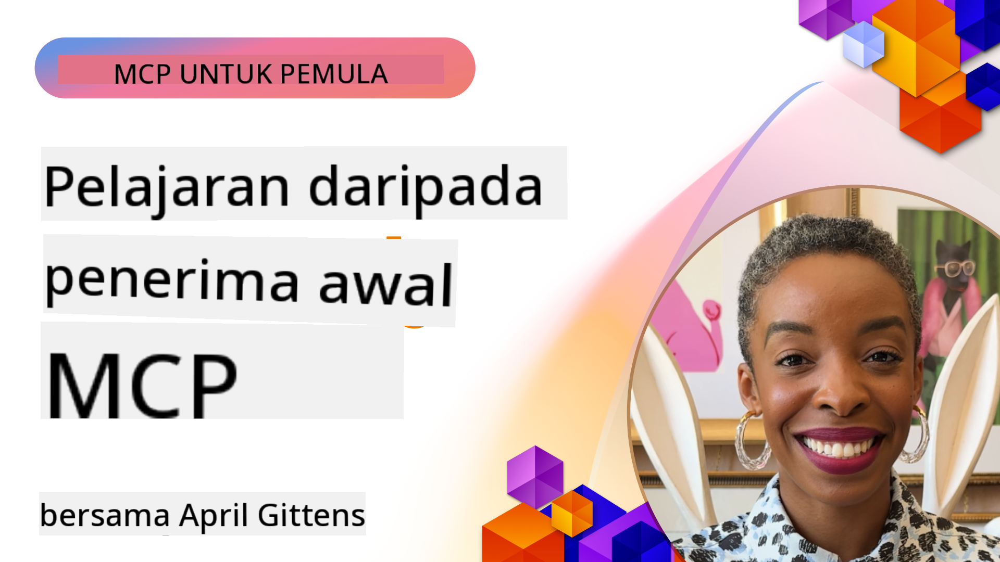

<!--
CO_OP_TRANSLATOR_METADATA:
{
  "original_hash": "41f16dac486d2086a53bc644a01cbe42",
  "translation_date": "2025-08-18T17:51:57+00:00",
  "source_file": "07-LessonsfromEarlyAdoption/README.md",
  "language_code": "ms"
}
-->
# 🌟 Pelajaran daripada Pengguna Awal

[](https://youtu.be/jds7dSmNptE)

_(Klik imej di atas untuk menonton video pelajaran ini)_

## 🎯 Apa yang Diliputi Modul Ini

Modul ini meneroka bagaimana organisasi dan pembangun sebenar menggunakan Model Context Protocol (MCP) untuk menyelesaikan cabaran sebenar dan mendorong inovasi. Melalui kajian kes terperinci dan projek praktikal, anda akan menemui bagaimana MCP membolehkan integrasi AI yang selamat dan boleh diskalakan yang menghubungkan model bahasa, alat, dan data perusahaan.

### 📚 Lihat MCP dalam Tindakan

Ingin melihat prinsip-prinsip ini diterapkan pada alat sedia produksi? Lihat [**10 Pelayan MCP Microsoft yang Mengubah Produktiviti Pembangun**](microsoft-mcp-servers.md), yang memaparkan pelayan MCP Microsoft sebenar yang boleh anda gunakan hari ini.

## Gambaran Keseluruhan

Pelajaran ini meneroka bagaimana pengguna awal telah memanfaatkan Model Context Protocol (MCP) untuk menyelesaikan cabaran dunia sebenar dan mendorong inovasi merentasi industri. Melalui kajian kes terperinci dan projek praktikal, anda akan melihat bagaimana MCP membolehkan integrasi AI yang standard, selamat, dan boleh diskalakan—menghubungkan model bahasa besar, alat, dan data perusahaan dalam rangka kerja yang bersatu. Anda akan memperoleh pengalaman praktikal dalam mereka bentuk dan membina penyelesaian berasaskan MCP, belajar daripada corak pelaksanaan yang terbukti, dan menemui amalan terbaik untuk menggunakan MCP dalam persekitaran produksi. Pelajaran ini juga menyoroti trend yang muncul, arah masa depan, dan sumber terbuka untuk membantu anda kekal di barisan hadapan teknologi MCP dan ekosistemnya yang berkembang.

## Objektif Pembelajaran

- Menganalisis pelaksanaan MCP dunia sebenar merentasi pelbagai industri
- Mereka bentuk dan membina aplikasi berasaskan MCP yang lengkap
- Meneroka trend yang muncul dan arah masa depan dalam teknologi MCP
- Menerapkan amalan terbaik dalam senario pembangunan sebenar

## Pelaksanaan MCP Dunia Sebenar

### Kajian Kes 1: Automasi Sokongan Pelanggan Perusahaan

Sebuah syarikat multinasional melaksanakan penyelesaian berasaskan MCP untuk menyeragamkan interaksi AI merentasi sistem sokongan pelanggan mereka. Ini membolehkan mereka:

- Mencipta antara muka bersatu untuk pelbagai penyedia LLM
- Mengekalkan pengurusan prompt yang konsisten merentasi jabatan
- Melaksanakan kawalan keselamatan dan pematuhan yang kukuh
- Mudah bertukar antara model AI yang berbeza berdasarkan keperluan tertentu

**Pelaksanaan Teknikal:**

```python
# Python MCP server implementation for customer support
import logging
import asyncio
from modelcontextprotocol import create_server, ServerConfig
from modelcontextprotocol.server import MCPServer
from modelcontextprotocol.transports import create_http_transport
from modelcontextprotocol.resources import ResourceDefinition
from modelcontextprotocol.prompts import PromptDefinition
from modelcontextprotocol.tool import ToolDefinition

# Configure logging
logging.basicConfig(level=logging.INFO)

async def main():
    # Create server configuration
    config = ServerConfig(
        name="Enterprise Customer Support Server",
        version="1.0.0",
        description="MCP server for handling customer support inquiries"
    )
    
    # Initialize MCP server
    server = create_server(config)
    
    # Register knowledge base resources
    server.resources.register(
        ResourceDefinition(
            name="customer_kb",
            description="Customer knowledge base documentation"
        ),
        lambda params: get_customer_documentation(params)
    )
    
    # Register prompt templates
    server.prompts.register(
        PromptDefinition(
            name="support_template",
            description="Templates for customer support responses"
        ),
        lambda params: get_support_templates(params)
    )
    
    # Register support tools
    server.tools.register(
        ToolDefinition(
            name="ticketing",
            description="Create and update support tickets"
        ),
        handle_ticketing_operations
    )
    
    # Start server with HTTP transport
    transport = create_http_transport(port=8080)
    await server.run(transport)

if __name__ == "__main__":
    asyncio.run(main())
```

**Hasil:** Pengurangan kos model sebanyak 30%, peningkatan konsistensi respons sebanyak 45%, dan pematuhan yang dipertingkatkan merentasi operasi global.

### Kajian Kes 2: Pembantu Diagnostik Penjagaan Kesihatan

Penyedia penjagaan kesihatan membangunkan infrastruktur MCP untuk mengintegrasikan pelbagai model AI perubatan khusus sambil memastikan data pesakit yang sensitif kekal dilindungi:

- Pertukaran lancar antara model perubatan umum dan khusus
- Kawalan privasi yang ketat dan jejak audit
- Integrasi dengan sistem Rekod Kesihatan Elektronik (EHR) sedia ada
- Kejuruteraan prompt yang konsisten untuk terminologi perubatan

**Pelaksanaan Teknikal:**

```csharp
// C# MCP host application implementation in healthcare application
using Microsoft.Extensions.DependencyInjection;
using ModelContextProtocol.SDK.Client;
using ModelContextProtocol.SDK.Security;
using ModelContextProtocol.SDK.Resources;

public class DiagnosticAssistant
{
    private readonly MCPHostClient _mcpClient;
    private readonly PatientContext _patientContext;
    
    public DiagnosticAssistant(PatientContext patientContext)
    {
        _patientContext = patientContext;
        
        // Configure MCP client with healthcare-specific settings
        var clientOptions = new ClientOptions
        {
            Name = "Healthcare Diagnostic Assistant",
            Version = "1.0.0",
            Security = new SecurityOptions
            {
                Encryption = EncryptionLevel.Medical,
                AuditEnabled = true
            }
        };
        
        _mcpClient = new MCPHostClientBuilder()
            .WithOptions(clientOptions)
            .WithTransport(new HttpTransport("https://healthcare-mcp.example.org"))
            .WithAuthentication(new HIPAACompliantAuthProvider())
            .Build();
    }
    
    public async Task<DiagnosticSuggestion> GetDiagnosticAssistance(
        string symptoms, string patientHistory)
    {
        // Create request with appropriate resources and tool access
        var resourceRequest = new ResourceRequest
        {
            Name = "patient_records",
            Parameters = new Dictionary<string, object>
            {
                ["patientId"] = _patientContext.PatientId,
                ["requestingProvider"] = _patientContext.ProviderId
            }
        };
        
        // Request diagnostic assistance using appropriate prompt
        var response = await _mcpClient.SendPromptRequestAsync(
            promptName: "diagnostic_assistance",
            parameters: new Dictionary<string, object>
            {
                ["symptoms"] = symptoms,
                patientHistory = patientHistory,
                relevantGuidelines = _patientContext.GetRelevantGuidelines()
            });
            
        return DiagnosticSuggestion.FromMCPResponse(response);
    }
}
```

**Hasil:** Cadangan diagnostik yang lebih baik untuk doktor sambil mengekalkan pematuhan penuh HIPAA dan pengurangan ketara dalam pertukaran konteks antara sistem.

### Kajian Kes 3: Analisis Risiko Perkhidmatan Kewangan

Sebuah institusi kewangan melaksanakan MCP untuk menyeragamkan proses analisis risiko mereka merentasi jabatan yang berbeza:

- Mencipta antara muka bersatu untuk model risiko kredit, pengesanan penipuan, dan risiko pelaburan
- Melaksanakan kawalan akses yang ketat dan versi model
- Memastikan kebolehjejakkan semua cadangan AI
- Mengekalkan pemformatan data yang konsisten merentasi sistem yang pelbagai

**Pelaksanaan Teknikal:**

```java
// Java MCP server for financial risk assessment
import org.mcp.server.*;
import org.mcp.security.*;

public class FinancialRiskMCPServer {
    public static void main(String[] args) {
        // Create MCP server with financial compliance features
        MCPServer server = new MCPServerBuilder()
            .withModelProviders(
                new ModelProvider("risk-assessment-primary", new AzureOpenAIProvider()),
                new ModelProvider("risk-assessment-audit", new LocalLlamaProvider())
            )
            .withPromptTemplateDirectory("./compliance/templates")
            .withAccessControls(new SOCCompliantAccessControl())
            .withDataEncryption(EncryptionStandard.FINANCIAL_GRADE)
            .withVersionControl(true)
            .withAuditLogging(new DatabaseAuditLogger())
            .build();
            
        server.addRequestValidator(new FinancialDataValidator());
        server.addResponseFilter(new PII_RedactionFilter());
        
        server.start(9000);
        
        System.out.println("Financial Risk MCP Server running on port 9000");
    }
}
```

**Hasil:** Pematuhan peraturan yang dipertingkatkan, kitaran pelaksanaan model yang 40% lebih pantas, dan konsistensi penilaian risiko yang lebih baik merentasi jabatan.

### Kajian Kes 4: Pelayan MCP Microsoft Playwright untuk Automasi Pelayar

Microsoft membangunkan [Pelayan MCP Playwright](https://github.com/microsoft/playwright-mcp) untuk membolehkan automasi pelayar yang selamat dan standard melalui Model Context Protocol. Pelayan sedia produksi ini membolehkan agen AI dan LLM berinteraksi dengan pelayar web dalam cara yang terkawal, boleh diaudit, dan boleh diperluas—membolehkan kes penggunaan seperti ujian web automatik, pengekstrakan data, dan aliran kerja hujung ke hujung.

> **🎯 Alat Sedia Produksi**
> 
> Kajian kes ini memaparkan pelayan MCP sebenar yang boleh anda gunakan hari ini! Ketahui lebih lanjut tentang Pelayan MCP Playwright dan 9 pelayan MCP Microsoft sedia produksi lain dalam [**Panduan Pelayan MCP Microsoft**](microsoft-mcp-servers.md#8--playwright-mcp-server).

**Ciri Utama:**
- Mendedahkan keupayaan automasi pelayar (navigasi, pengisian borang, tangkapan skrin, dll.) sebagai alat MCP
- Melaksanakan kawalan akses yang ketat dan sandboxing untuk mencegah tindakan yang tidak dibenarkan
- Menyediakan log audit terperinci untuk semua interaksi pelayar
- Menyokong integrasi dengan Azure OpenAI dan penyedia LLM lain untuk automasi yang dipacu agen
- Memberi kuasa kepada keupayaan pelayaran web GitHub Copilot's Coding Agent

**Pelaksanaan Teknikal:**

```typescript
// TypeScript: Registering Playwright browser automation tools in an MCP server
import { createServer, ToolDefinition } from 'modelcontextprotocol';
import { launch } from 'playwright';

const server = createServer({
  name: 'Playwright MCP Server',
  version: '1.0.0',
  description: 'MCP server for browser automation using Playwright'
});

// Register a tool for navigating to a URL and capturing a screenshot
server.tools.register(
  new ToolDefinition({
    name: 'navigate_and_screenshot',
    description: 'Navigate to a URL and capture a screenshot',
    parameters: {
      url: { type: 'string', description: 'The URL to visit' }
    }
  }),
  async ({ url }) => {
    const browser = await launch();
    const page = await browser.newPage();
    await page.goto(url);
    const screenshot = await page.screenshot();
    await browser.close();
    return { screenshot };
  }
);

// Start the MCP server
server.listen(8080);
```

**Hasil:**

- Membolehkan automasi pelayar programatik yang selamat untuk agen AI dan LLM
- Mengurangkan usaha ujian manual dan meningkatkan liputan ujian untuk aplikasi web
- Menyediakan rangka kerja yang boleh digunakan semula dan diperluas untuk integrasi alat berasaskan pelayar dalam persekitaran perusahaan
- Memberi kuasa kepada keupayaan pelayaran web GitHub Copilot

**Rujukan:**

- [Repositori GitHub Pelayan MCP Playwright](https://github.com/microsoft/playwright-mcp)
- [Penyelesaian AI dan Automasi Microsoft](https://azure.microsoft.com/en-us/products/ai-services/)

### Kajian Kes 5: Azure MCP – Protokol Konteks Model Bertaraf Perusahaan sebagai Perkhidmatan

Pelayan Azure MCP ([https://aka.ms/azmcp](https://aka.ms/azmcp)) ialah pelaksanaan MCP bertaraf perusahaan yang diuruskan oleh Microsoft, direka untuk menyediakan keupayaan pelayan MCP yang boleh diskalakan, selamat, dan mematuhi sebagai perkhidmatan awan. Azure MCP membolehkan organisasi dengan cepat melaksanakan, mengurus, dan mengintegrasikan pelayan MCP dengan perkhidmatan AI, data, dan keselamatan Azure, mengurangkan beban operasi dan mempercepatkan penerapan AI.

> **🎯 Alat Sedia Produksi**
> 
> Ini adalah pelayan MCP sebenar yang boleh anda gunakan hari ini! Ketahui lebih lanjut tentang Pelayan MCP Azure AI Foundry dalam [**Panduan Pelayan MCP Microsoft**](microsoft-mcp-servers.md).

- Pengehosan pelayan MCP yang diurus sepenuhnya dengan penskalaan, pemantauan, dan keselamatan terbina dalam
- Integrasi asli dengan Azure OpenAI, Azure AI Search, dan perkhidmatan Azure lain
- Pengesahan dan kebenaran perusahaan melalui Microsoft Entra ID
- Sokongan untuk alat tersuai, templat prompt, dan penyambung sumber
- Pematuhan dengan keperluan keselamatan dan peraturan perusahaan

**Pelaksanaan Teknikal:**

```yaml
# Example: Azure MCP server deployment configuration (YAML)
apiVersion: mcp.microsoft.com/v1
kind: McpServer
metadata:
  name: enterprise-mcp-server
spec:
  modelProviders:
    - name: azure-openai
      type: AzureOpenAI
      endpoint: https://<your-openai-resource>.openai.azure.com/
      apiKeySecret: <your-azure-keyvault-secret>
  tools:
    - name: document_search
      type: AzureAISearch
      endpoint: https://<your-search-resource>.search.windows.net/
      apiKeySecret: <your-azure-keyvault-secret>
  authentication:
    type: EntraID
    tenantId: <your-tenant-id>
  monitoring:
    enabled: true
    logAnalyticsWorkspace: <your-log-analytics-id>
```

**Hasil:**  
- Mengurangkan masa ke nilai untuk projek AI perusahaan dengan menyediakan platform pelayan MCP yang sedia digunakan dan mematuhi
- Mempermudah integrasi LLM, alat, dan sumber data perusahaan
- Meningkatkan keselamatan, kebolehlihatan, dan kecekapan operasi untuk beban kerja MCP
- Memperbaiki kualiti kod dengan amalan terbaik SDK Azure dan corak pengesahan semasa

**Rujukan:**  
- [Dokumentasi Azure MCP](https://aka.ms/azmcp)
- [Repositori GitHub Pelayan MCP Azure](https://github.com/Azure/azure-mcp)
- [Perkhidmatan AI Azure](https://azure.microsoft.com/en-us/products/ai-services/)
- [Pusat MCP Microsoft](https://mcp.azure.com)

### Kajian Kes 6: NLWeb

MCP (Model Context Protocol) adalah protokol yang sedang berkembang untuk Chatbot dan pembantu AI berinteraksi dengan alat. Setiap instance NLWeb juga merupakan pelayan MCP, yang menyokong satu kaedah teras, ask, yang digunakan untuk bertanya kepada laman web soalan dalam bahasa semula jadi. Respon yang dikembalikan memanfaatkan schema.org, kosa kata yang banyak digunakan untuk menerangkan data web. Secara ringkas, MCP adalah NLWeb seperti Http kepada HTML. NLWeb menggabungkan protokol, format Schema.org, dan kod contoh untuk membantu laman web dengan cepat mencipta endpoint ini, memberi manfaat kepada manusia melalui antara muka perbualan dan mesin melalui interaksi agen-ke-agen semula jadi.

Terdapat dua komponen utama NLWeb:
- Protokol, sangat mudah untuk dimulakan, untuk berinteraksi dengan laman web dalam bahasa semula jadi dan format, memanfaatkan json dan schema.org untuk jawapan yang dikembalikan. Lihat dokumentasi pada REST API untuk maklumat lanjut.
- Pelaksanaan mudah (1) yang memanfaatkan markup sedia ada, untuk laman web yang boleh diabstrakkan sebagai senarai item (produk, resipi, tarikan, ulasan, dll.). Bersama-sama dengan set widget antara muka pengguna, laman web boleh dengan mudah menyediakan antara muka perbualan kepada kandungan mereka. Lihat dokumentasi pada Life of a chat query untuk maklumat lanjut tentang cara ini berfungsi.

**Rujukan:**  
- [Dokumentasi Azure MCP](https://aka.ms/azmcp)  
- [NLWeb](https://github.com/microsoft/NlWeb)

### Kajian Kes 7: Pelayan MCP Azure AI Foundry – Integrasi Agen AI Perusahaan

Pelayan MCP Azure AI Foundry menunjukkan bagaimana MCP boleh digunakan untuk mengorkestrasi dan mengurus agen AI serta aliran kerja dalam persekitaran perusahaan. Dengan mengintegrasikan MCP dengan Azure AI Foundry, organisasi boleh menyeragamkan interaksi agen, memanfaatkan pengurusan aliran kerja Foundry, dan memastikan pelaksanaan yang selamat dan boleh diskalakan.

> **🎯 Alat Sedia Produksi**
> 
> Ini adalah pelayan MCP sebenar yang boleh anda gunakan hari ini! Ketahui lebih lanjut tentang Pelayan MCP Azure AI Foundry dalam [**Panduan Pelayan MCP Microsoft**](microsoft-mcp-servers.md#9--azure-ai-foundry-mcp-server).

**Ciri Utama:**
- Akses menyeluruh kepada ekosistem AI Azure, termasuk katalog model dan pengurusan pelaksanaan
- Pengindeksan pengetahuan dengan Azure AI Search untuk aplikasi RAG
- Alat penilaian untuk prestasi model AI dan jaminan kualiti
- Integrasi dengan Katalog dan Makmal Azure AI Foundry untuk model penyelidikan terkini
- Keupayaan pengurusan dan penilaian agen untuk senario produksi

**Hasil:**
- Prototip pantas dan pemantauan kukuh aliran kerja agen AI
- Integrasi lancar dengan perkhidmatan AI Azure untuk senario lanjutan
- Antara muka bersatu untuk membina, melaksanakan, dan memantau saluran agen
- Keselamatan, pematuhan, dan kecekapan operasi yang dipertingkatkan untuk perusahaan
- Mempercepatkan penerapan AI sambil mengekalkan kawalan ke atas proses yang dipacu agen yang kompleks

**Rujukan:**
- [Repositori GitHub Pelayan MCP Azure AI Foundry](https://github.com/azure-ai-foundry/mcp-foundry)
- [Mengintegrasikan Agen AI Azure dengan MCP (Blog Microsoft Foundry)](https://devblogs.microsoft.com/foundry/integrating-azure-ai-agents-mcp/)

### Kajian Kes 8: Foundry MCP Playground – Eksperimen dan Prototip

Foundry MCP Playground menawarkan persekitaran sedia guna untuk bereksperimen dengan pelayan MCP dan integrasi Azure AI Foundry. Pembangun boleh dengan cepat membuat prototip, menguji, dan menilai model AI serta aliran kerja agen menggunakan sumber daripada Katalog dan Makmal Azure AI Foundry. Playground ini mempermudah penyediaan, menyediakan projek contoh, dan menyokong pembangunan kolaboratif, menjadikannya mudah untuk meneroka amalan terbaik dan senario baru dengan beban kerja yang minimum. Ia sangat berguna untuk pasukan yang ingin mengesahkan idea, berkongsi eksperimen, dan mempercepatkan pembelajaran tanpa memerlukan infrastruktur yang kompleks. Dengan menurunkan halangan untuk memulakan, playground ini membantu memupuk inovasi dan sumbangan komuniti dalam ekosistem MCP dan Azure AI Foundry.

**Rujukan:**

- [Repositori GitHub Foundry MCP Playground](https://github.com/azure-ai-foundry/foundry-mcp-playground)

### Kajian Kes 9: Pelayan MCP Microsoft Learn Docs – Akses Dokumentasi Berkuasa AI

Pelayan MCP Microsoft Learn Docs ialah perkhidmatan yang dihoskan di awan yang menyediakan pembantu AI dengan akses masa nyata kepada dokumentasi rasmi Microsoft melalui Model Context Protocol. Pelayan sedia produksi ini menghubungkan kepada ekosistem Microsoft Learn yang komprehensif dan membolehkan carian semantik merentasi semua sumber rasmi Microsoft.
> **🎯 Alat Sedia untuk Pengeluaran**  
>  
> Ini adalah pelayan MCP sebenar yang anda boleh gunakan hari ini! Ketahui lebih lanjut tentang Pelayan MCP Microsoft Learn Docs dalam [**Panduan Pelayan MCP Microsoft**](microsoft-mcp-servers.md#1--microsoft-learn-docs-mcp-server).
**Ciri Utama:**
- Akses masa nyata kepada dokumentasi rasmi Microsoft, dokumen Azure, dan dokumentasi Microsoft 365
- Keupayaan carian semantik maju yang memahami konteks dan niat
- Maklumat sentiasa terkini apabila kandungan Microsoft Learn diterbitkan
- Liputan menyeluruh merangkumi Microsoft Learn, dokumentasi Azure, dan sumber Microsoft 365
- Mengembalikan sehingga 10 bahagian kandungan berkualiti tinggi dengan tajuk artikel dan URL

**Mengapa Ia Penting:**
- Menyelesaikan masalah "pengetahuan AI yang ketinggalan zaman" untuk teknologi Microsoft
- Memastikan pembantu AI mempunyai akses kepada ciri .NET, C#, Azure, dan Microsoft 365 terkini
- Memberikan maklumat yang sahih dan pihak pertama untuk penjanaan kod yang tepat
- Penting untuk pembangun yang bekerja dengan teknologi Microsoft yang berkembang pesat

**Hasil:**
- Ketepatan penjanaan kod AI untuk teknologi Microsoft meningkat dengan ketara
- Masa yang dihabiskan untuk mencari dokumentasi terkini dan amalan terbaik dikurangkan
- Produktiviti pembangun dipertingkatkan dengan pengambilan dokumentasi yang memahami konteks
- Integrasi lancar dengan aliran kerja pembangunan tanpa meninggalkan IDE

**Rujukan:**
- [Repositori GitHub Microsoft Learn Docs MCP Server](https://github.com/MicrosoftDocs/mcp)
- [Dokumentasi Microsoft Learn](https://learn.microsoft.com/)

## Projek Praktikal

### Projek 1: Membina Pelayan MCP Multi-Penyedia

**Objektif:** Mencipta pelayan MCP yang boleh mengarahkan permintaan kepada beberapa penyedia model AI berdasarkan kriteria tertentu.

**Keperluan:**

- Menyokong sekurang-kurangnya tiga penyedia model yang berbeza (contohnya, OpenAI, Anthropic, model tempatan)
- Melaksanakan mekanisme penghalaan berdasarkan metadata permintaan
- Mewujudkan sistem konfigurasi untuk menguruskan kelayakan penyedia
- Menambah caching untuk mengoptimumkan prestasi dan kos
- Membina papan pemuka ringkas untuk memantau penggunaan

**Langkah Pelaksanaan:**

1. Menyediakan infrastruktur asas pelayan MCP
2. Melaksanakan penyesuai penyedia untuk setiap perkhidmatan model AI
3. Mencipta logik penghalaan berdasarkan atribut permintaan
4. Menambah mekanisme caching untuk permintaan yang kerap
5. Membangunkan papan pemuka pemantauan
6. Uji dengan pelbagai corak permintaan

**Teknologi:** Pilih daripada Python (.NET/Java/Python berdasarkan pilihan anda), Redis untuk caching, dan rangka kerja web ringkas untuk papan pemuka.

### Projek 2: Sistem Pengurusan Prompt Enterprise

**Objektif:** Membangunkan sistem berasaskan MCP untuk mengurus, versi, dan menyebarkan templat prompt di seluruh organisasi.

**Keperluan:**

- Mewujudkan repositori pusat untuk templat prompt
- Melaksanakan sistem versi dan aliran kerja kelulusan
- Membina keupayaan ujian templat dengan input sampel
- Membangunkan kawalan akses berdasarkan peranan
- Mencipta API untuk pengambilan dan penyebaran templat

**Langkah Pelaksanaan:**

1. Reka bentuk skema pangkalan data untuk penyimpanan templat
2. Mencipta API teras untuk operasi CRUD templat
3. Melaksanakan sistem versi
4. Membina aliran kerja kelulusan
5. Membangunkan rangka kerja ujian
6. Mencipta antara muka web ringkas untuk pengurusan
7. Mengintegrasikan dengan pelayan MCP

**Teknologi:** Pilihan rangka kerja backend, pangkalan data SQL atau NoSQL, dan rangka kerja frontend untuk antara muka pengurusan.

### Projek 3: Platform Penjanaan Kandungan Berasaskan MCP

**Objektif:** Membangunkan platform penjanaan kandungan yang menggunakan MCP untuk memberikan hasil yang konsisten merentasi pelbagai jenis kandungan.

**Keperluan:**

- Menyokong pelbagai format kandungan (catatan blog, media sosial, salinan pemasaran)
- Melaksanakan penjanaan berasaskan templat dengan pilihan penyesuaian
- Mencipta sistem semakan dan maklum balas kandungan
- Menjejaki metrik prestasi kandungan
- Menyokong versi kandungan dan iterasi

**Langkah Pelaksanaan:**

1. Menyediakan infrastruktur klien MCP
2. Mencipta templat untuk pelbagai jenis kandungan
3. Membina saluran penjanaan kandungan
4. Melaksanakan sistem semakan
5. Membangunkan sistem penjejakan metrik
6. Mencipta antara muka pengguna untuk pengurusan templat dan penjanaan kandungan

**Teknologi:** Bahasa pengaturcaraan pilihan anda, rangka kerja web, dan sistem pangkalan data.

## Arah Masa Depan untuk Teknologi MCP

### Trend Baru

1. **MCP Multi-Mod**
   - Pengembangan MCP untuk menyeragamkan interaksi dengan model imej, audio, dan video
   - Pembangunan keupayaan penaakulan silang mod
   - Format prompt standard untuk pelbagai mod

2. **Infrastruktur MCP Teragih**
   - Rangkaian MCP teragih yang boleh berkongsi sumber merentasi organisasi
   - Protokol standard untuk perkongsian model yang selamat
   - Teknik pengiraan yang memelihara privasi

3. **Pasaran MCP**
   - Ekosistem untuk berkongsi dan memonetisasi templat dan plugin MCP
   - Proses jaminan kualiti dan pensijilan
   - Integrasi dengan pasaran model

4. **MCP untuk Pengkomputeran Tepi**
   - Penyesuaian standard MCP untuk peranti tepi yang terhad sumber
   - Protokol yang dioptimumkan untuk persekitaran jalur lebar rendah
   - Pelaksanaan MCP khusus untuk ekosistem IoT

5. **Rangka Kerja Peraturan**
   - Pembangunan sambungan MCP untuk pematuhan peraturan
   - Jejak audit standard dan antara muka kebolehjelasan
   - Integrasi dengan rangka kerja tadbir urus AI yang muncul

### Penyelesaian MCP dari Microsoft

Microsoft dan Azure telah membangunkan beberapa repositori sumber terbuka untuk membantu pembangun melaksanakan MCP dalam pelbagai senario:

#### Organisasi Microsoft

1. [playwright-mcp](https://github.com/microsoft/playwright-mcp) - Pelayan MCP Playwright untuk automasi dan ujian pelayar
2. [files-mcp-server](https://github.com/microsoft/files-mcp-server) - Pelaksanaan pelayan MCP OneDrive untuk ujian tempatan dan sumbangan komuniti
3. [NLWeb](https://github.com/microsoft/NlWeb) - NLWeb ialah koleksi protokol terbuka dan alat sumber terbuka yang berkaitan. Fokus utamanya ialah mewujudkan lapisan asas untuk Web AI

#### Organisasi Azure-Samples

1. [mcp](https://github.com/Azure-Samples/mcp) - Pautan kepada sampel, alat, dan sumber untuk membina dan mengintegrasikan pelayan MCP di Azure menggunakan pelbagai bahasa
2. [mcp-auth-servers](https://github.com/Azure-Samples/mcp-auth-servers) - Pelayan MCP rujukan yang menunjukkan pengesahan dengan spesifikasi Model Context Protocol semasa
3. [remote-mcp-functions](https://github.com/Azure-Samples/remote-mcp-functions) - Halaman pendaratan untuk pelaksanaan Pelayan MCP Jauh dalam Fungsi Azure dengan pautan ke repositori khusus bahasa
4. [remote-mcp-functions-python](https://github.com/Azure-Samples/remote-mcp-functions-python) - Templat permulaan pantas untuk membina dan menyebarkan pelayan MCP jauh tersuai menggunakan Fungsi Azure dengan Python
5. [remote-mcp-functions-dotnet](https://github.com/Azure-Samples/remote-mcp-functions-dotnet) - Templat permulaan pantas untuk membina dan menyebarkan pelayan MCP jauh tersuai menggunakan Fungsi Azure dengan .NET/C#
6. [remote-mcp-functions-typescript](https://github.com/Azure-Samples/remote-mcp-functions-typescript) - Templat permulaan pantas untuk membina dan menyebarkan pelayan MCP jauh tersuai menggunakan Fungsi Azure dengan TypeScript
7. [remote-mcp-apim-functions-python](https://github.com/Azure-Samples/remote-mcp-apim-functions-python) - Pengurusan API Azure sebagai Gerbang AI kepada pelayan MCP Jauh menggunakan Python
8. [AI-Gateway](https://github.com/Azure-Samples/AI-Gateway) - Eksperimen APIM ❤️ AI termasuk keupayaan MCP, mengintegrasikan dengan Azure OpenAI dan AI Foundry

Repositori ini menyediakan pelbagai pelaksanaan, templat, dan sumber untuk bekerja dengan Model Context Protocol merentasi pelbagai bahasa pengaturcaraan dan perkhidmatan Azure. Ia merangkumi pelbagai kes penggunaan daripada pelaksanaan pelayan asas kepada pengesahan, penyebaran awan, dan senario integrasi perusahaan.

#### Direktori Sumber MCP

Direktori [Sumber MCP](https://github.com/microsoft/mcp/tree/main/Resources) dalam repositori rasmi Microsoft MCP menyediakan koleksi sampel sumber, templat prompt, dan definisi alat yang dikurasi untuk digunakan dengan pelayan Model Context Protocol. Direktori ini direka untuk membantu pembangun memulakan MCP dengan cepat dengan menawarkan blok binaan yang boleh digunakan semula dan contoh amalan terbaik untuk:

- **Templat Prompt:** Templat prompt sedia guna untuk tugas dan senario AI biasa, yang boleh disesuaikan untuk pelaksanaan pelayan MCP anda sendiri.
- **Definisi Alat:** Skema alat contoh dan metadata untuk menyeragamkan integrasi dan pemanggilan alat merentasi pelayan MCP yang berbeza.
- **Sampel Sumber:** Definisi sumber contoh untuk menyambung kepada sumber data, API, dan perkhidmatan luaran dalam rangka kerja MCP.
- **Pelaksanaan Rujukan:** Sampel praktikal yang menunjukkan cara untuk menyusun dan mengatur sumber, prompt, dan alat dalam projek MCP dunia sebenar.

Sumber ini mempercepatkan pembangunan, mempromosikan penyeragaman, dan membantu memastikan amalan terbaik semasa membina dan menyebarkan penyelesaian berasaskan MCP.

#### Direktori Sumber MCP

- [Sumber MCP (Templat Prompt, Alat, dan Definisi Sumber)](https://github.com/microsoft/mcp/tree/main/Resources)

### Peluang Penyelidikan

- Teknik pengoptimuman prompt yang cekap dalam rangka kerja MCP
- Model keselamatan untuk penyebaran MCP berbilang penyewa
- Penanda aras prestasi merentasi pelaksanaan MCP yang berbeza
- Kaedah pengesahan formal untuk pelayan MCP

## Kesimpulan

Model Context Protocol (MCP) sedang membentuk masa depan integrasi AI yang standard, selamat, dan boleh beroperasi merentasi industri. Melalui kajian kes dan projek praktikal dalam pelajaran ini, anda telah melihat bagaimana pengguna awal—termasuk Microsoft dan Azure—memanfaatkan MCP untuk menyelesaikan cabaran dunia sebenar, mempercepatkan penggunaan AI, dan memastikan pematuhan, keselamatan, dan skalabiliti. Pendekatan modular MCP membolehkan organisasi menghubungkan model bahasa besar, alat, dan data perusahaan dalam rangka kerja yang bersatu dan boleh diaudit. Apabila MCP terus berkembang, kekal terlibat dengan komuniti, meneroka sumber terbuka, dan menggunakan amalan terbaik akan menjadi kunci untuk membina penyelesaian AI yang kukuh dan bersedia untuk masa depan.

## Sumber Tambahan

- [Repositori GitHub MCP Foundry](https://github.com/azure-ai-foundry/mcp-foundry)
- [Playground MCP Foundry](https://github.com/azure-ai-foundry/foundry-mcp-playground)
- [Mengintegrasikan Ejen AI Azure dengan MCP (Blog Microsoft Foundry)](https://devblogs.microsoft.com/foundry/integrating-azure-ai-agents-mcp/)
- [Repositori GitHub MCP (Microsoft)](https://github.com/microsoft/mcp)
- [Direktori Sumber MCP (Templat Prompt, Alat, dan Definisi Sumber)](https://github.com/microsoft/mcp/tree/main/Resources)
- [Komuniti & Dokumentasi MCP](https://modelcontextprotocol.io/introduction)
- [Dokumentasi MCP Azure](https://aka.ms/azmcp)
- [Repositori GitHub Pelayan MCP Playwright](https://github.com/microsoft/playwright-mcp)
- [Pelayan MCP Fail (OneDrive)](https://github.com/microsoft/files-mcp-server)
- [Azure-Samples MCP](https://github.com/Azure-Samples/mcp)
- [Pelayan Pengesahan MCP (Azure-Samples)](https://github.com/Azure-Samples/mcp-auth-servers)
- [Fungsi MCP Jauh (Azure-Samples)](https://github.com/Azure-Samples/remote-mcp-functions)
- [Fungsi MCP Jauh Python (Azure-Samples)](https://github.com/Azure-Samples/remote-mcp-functions-python)
- [Fungsi MCP Jauh .NET (Azure-Samples)](https://github.com/Azure-Samples/remote-mcp-functions-dotnet)
- [Fungsi MCP Jauh TypeScript (Azure-Samples)](https://github.com/Azure-Samples/remote-mcp-functions-typescript)
- [Fungsi MCP APIM Jauh Python (Azure-Samples)](https://github.com/Azure-Samples/remote-mcp-apim-functions-python)
- [Gerbang AI (Azure-Samples)](https://github.com/Azure-Samples/AI-Gateway)
- [Penyelesaian AI dan Automasi Microsoft](https://azure.microsoft.com/en-us/products/ai-services/)

## Latihan

1. Analisis salah satu kajian kes dan cadangkan pendekatan pelaksanaan alternatif.
2. Pilih salah satu idea projek dan cipta spesifikasi teknikal yang terperinci.
3. Kajian industri yang tidak diliputi dalam kajian kes dan gariskan bagaimana MCP boleh menangani cabaran khususnya.
4. Terokai salah satu arah masa depan dan cipta konsep untuk sambungan MCP baharu untuk menyokongnya.

Seterusnya: [Pelayan MCP Microsoft](../07-LessonsfromEarlyAdoption/microsoft-mcp-servers.md)

**Penafian**:  
Dokumen ini telah diterjemahkan menggunakan perkhidmatan terjemahan AI [Co-op Translator](https://github.com/Azure/co-op-translator). Walaupun kami berusaha untuk memastikan ketepatan, sila ambil maklum bahawa terjemahan automatik mungkin mengandungi kesilapan atau ketidaktepatan. Dokumen asal dalam bahasa asalnya harus dianggap sebagai sumber yang berwibawa. Untuk maklumat penting, terjemahan manusia profesional adalah disyorkan. Kami tidak bertanggungjawab atas sebarang salah faham atau salah tafsir yang timbul daripada penggunaan terjemahan ini.