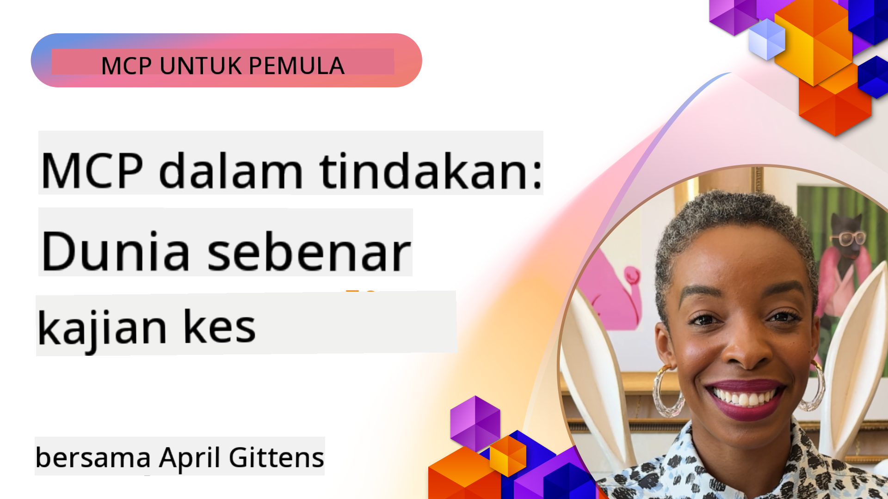

<!--
CO_OP_TRANSLATOR_METADATA:
{
  "original_hash": "1611dc5f6a2a35a789fc4c95fc5bfbe8",
  "translation_date": "2025-09-26T18:50:19+00:00",
  "source_file": "09-CaseStudy/README.md",
  "language_code": "ms"
}
-->
# MCP dalam Tindakan: Kajian Kes Dunia Sebenar

_(Klik imej di atas untuk menonton video pelajaran ini)_

Model Context Protocol (MCP) sedang mengubah cara aplikasi AI berinteraksi dengan data, alat, dan perkhidmatan. Bahagian ini mempersembahkan kajian kes dunia sebenar yang menunjukkan aplikasi praktikal MCP dalam pelbagai senario perusahaan.

## Gambaran Keseluruhan

Bahagian ini memaparkan contoh konkrit pelaksanaan MCP, menonjolkan bagaimana organisasi memanfaatkan protokol ini untuk menyelesaikan cabaran perniagaan yang kompleks. Dengan mengkaji kajian kes ini, anda akan mendapat pandangan tentang kepelbagaian, skalabiliti, dan manfaat praktikal MCP dalam senario dunia sebenar.

## Objektif Pembelajaran Utama

Dengan meneroka kajian kes ini, anda akan:

- Memahami bagaimana MCP boleh digunakan untuk menyelesaikan masalah perniagaan tertentu
- Mempelajari corak integrasi dan pendekatan seni bina yang berbeza
- Mengenali amalan terbaik untuk melaksanakan MCP dalam persekitaran perusahaan
- Mendapatkan pandangan tentang cabaran dan penyelesaian yang dihadapi dalam pelaksanaan dunia sebenar
- Mengenal pasti peluang untuk menerapkan corak serupa dalam projek anda sendiri

## Kajian Kes Pilihan

### 1. [Ejen Perjalanan Azure AI – Pelaksanaan Rujukan](./travelagentsample.md)

Kajian kes ini mengkaji penyelesaian rujukan komprehensif Microsoft yang menunjukkan cara membina aplikasi perancangan perjalanan berkuasa AI dengan ejen pelbagai menggunakan MCP, Azure OpenAI, dan Azure AI Search. Projek ini memaparkan:

- Orkestrasi ejen pelbagai melalui MCP
- Integrasi data perusahaan dengan Azure AI Search
- Seni bina yang selamat dan boleh diskalakan menggunakan perkhidmatan Azure
- Alat yang boleh diperluaskan dengan komponen MCP yang boleh digunakan semula
- Pengalaman pengguna perbualan yang dikuasakan oleh Azure OpenAI

Perincian seni bina dan pelaksanaan memberikan pandangan berharga tentang membina sistem ejen pelbagai yang kompleks dengan MCP sebagai lapisan koordinasi.

### 2. [Mengemas Kini Item Azure DevOps dari Data YouTube](./UpdateADOItemsFromYT.md)

Kajian kes ini menunjukkan aplikasi praktikal MCP untuk mengautomasi proses aliran kerja. Ia menunjukkan bagaimana alat MCP boleh digunakan untuk:

- Mengekstrak data dari platform dalam talian (YouTube)
- Mengemas kini item kerja dalam sistem Azure DevOps
- Mencipta aliran kerja automasi yang boleh diulang
- Mengintegrasikan data merentasi sistem yang berbeza

Contoh ini menggambarkan bagaimana pelaksanaan MCP yang agak mudah pun boleh memberikan peningkatan kecekapan yang ketara dengan mengautomasi tugas rutin dan meningkatkan konsistensi data merentasi sistem.

### 3. [Pengambilan Dokumentasi Masa Nyata dengan MCP](./docs-mcp/README.md)

Kajian kes ini membimbing anda melalui sambungan klien konsol Python ke pelayan Model Context Protocol (MCP) untuk mendapatkan dan mencatat dokumentasi Microsoft yang sedar konteks secara masa nyata. Anda akan belajar bagaimana untuk:

- Menyambung ke pelayan MCP menggunakan klien Python dan MCP SDK rasmi
- Menggunakan klien HTTP penstriman untuk pengambilan data masa nyata yang cekap
- Memanggil alat dokumentasi di pelayan dan mencatat respons terus ke konsol
- Mengintegrasikan dokumentasi Microsoft terkini ke dalam aliran kerja anda tanpa meninggalkan terminal

Bab ini termasuk tugasan praktikal, contoh kod kerja minimum, dan pautan ke sumber tambahan untuk pembelajaran mendalam. Lihat panduan penuh dan kod dalam bab yang dipautkan untuk memahami bagaimana MCP boleh mengubah akses dokumentasi dan produktiviti pembangun dalam persekitaran berasaskan konsol.

### 4. [Aplikasi Web Penjana Pelan Kajian Interaktif dengan MCP](./docs-mcp/README.md)

Kajian kes ini menunjukkan cara membina aplikasi web interaktif menggunakan Chainlit dan Model Context Protocol (MCP) untuk menjana pelan kajian yang diperibadikan untuk mana-mana topik. Pengguna boleh menentukan subjek (seperti "pensijilan AI-900") dan tempoh kajian (contohnya, 8 minggu), dan aplikasi akan menyediakan pecahan kandungan yang disyorkan minggu demi minggu. Chainlit membolehkan antara muka sembang perbualan, menjadikan pengalaman lebih menarik dan adaptif.

- Aplikasi web perbualan yang dikuasakan oleh Chainlit
- Arahan yang didorong pengguna untuk topik dan tempoh
- Cadangan kandungan minggu demi minggu menggunakan MCP
- Respons adaptif masa nyata dalam antara muka sembang

Projek ini menggambarkan bagaimana AI perbualan dan MCP boleh digabungkan untuk mencipta alat pendidikan yang dinamik dan didorong pengguna dalam persekitaran web moden.

### 5. [Dokumentasi Dalam Editor dengan Pelayan MCP di VS Code](./docs-mcp/README.md)

Kajian kes ini menunjukkan bagaimana anda boleh membawa Dokumentasi Microsoft Learn terus ke dalam persekitaran VS Code anda menggunakan pelayan MCP—tidak perlu lagi bertukar tab penyemak imbas! Anda akan melihat bagaimana untuk:

- Mencari dan membaca dokumentasi secara langsung dalam VS Code menggunakan panel MCP atau palet arahan
- Merujuk dokumentasi dan memasukkan pautan terus ke dalam fail README atau markdown kursus anda
- Menggunakan GitHub Copilot dan MCP bersama-sama untuk aliran kerja dokumentasi dan kod yang dikuasakan AI
- Mengesahkan dan meningkatkan dokumentasi anda dengan maklum balas masa nyata dan ketepatan yang bersumberkan Microsoft
- Mengintegrasikan MCP dengan aliran kerja GitHub untuk pengesahan dokumentasi berterusan

Pelaksanaan ini termasuk:

- Contoh konfigurasi `.vscode/mcp.json` untuk persediaan mudah
- Panduan bergambar pengalaman dalam editor
- Petua untuk menggabungkan Copilot dan MCP untuk produktiviti maksimum

Senario ini sesuai untuk penulis kursus, penulis dokumentasi, dan pembangun yang ingin kekal fokus dalam editor mereka semasa bekerja dengan dokumentasi, Copilot, dan alat pengesahan—semuanya dikuasakan oleh MCP.

### 6. [Penciptaan Pelayan MCP APIM](./apimsample.md)

Kajian kes ini menyediakan panduan langkah demi langkah tentang cara mencipta pelayan MCP menggunakan Azure API Management (APIM). Ia merangkumi:

- Menyediakan pelayan MCP dalam Azure API Management
- Mendedahkan operasi API sebagai alat MCP
- Mengkonfigurasi dasar untuk had kadar dan keselamatan
- Menguji pelayan MCP menggunakan Visual Studio Code dan GitHub Copilot

Contoh ini menggambarkan bagaimana memanfaatkan keupayaan Azure untuk mencipta pelayan MCP yang kukuh yang boleh digunakan dalam pelbagai aplikasi, meningkatkan integrasi sistem AI dengan API perusahaan.

### 7. [GitHub MCP Registry — Mempercepatkan Integrasi Agentic](https://github.com/mcp)

Kajian kes ini mengkaji bagaimana GitHub's MCP Registry, yang dilancarkan pada September 2025, menangani cabaran kritikal dalam ekosistem AI: penemuan dan penggunaan pelayan Model Context Protocol (MCP) yang terpecah-pecah.

#### Gambaran Keseluruhan
**MCP Registry** menyelesaikan masalah yang semakin meningkat berkaitan pelayan MCP yang tersebar di repositori dan registri, yang sebelum ini menjadikan integrasi lambat dan terdedah kepada kesilapan. Pelayan ini membolehkan ejen AI berinteraksi dengan sistem luaran seperti API, pangkalan data, dan sumber dokumentasi.

#### Pernyataan Masalah
Pembangun yang membina aliran kerja agentic menghadapi beberapa cabaran:
- **Penemuan yang lemah** pelayan MCP di pelbagai platform
- **Soalan persediaan yang berulang** tersebar di forum dan dokumentasi
- **Risiko keselamatan** daripada sumber yang tidak disahkan dan tidak dipercayai
- **Kekurangan standardisasi** dalam kualiti dan keserasian pelayan

#### Seni Bina Penyelesaian
GitHub's MCP Registry memusatkan pelayan MCP yang dipercayai dengan ciri utama:
- **Integrasi pemasangan satu klik** melalui VS Code untuk persediaan yang dipermudahkan
- **Penyusunan isyarat-atas-bunyi** berdasarkan bintang, aktiviti, dan pengesahan komuniti
- **Integrasi langsung** dengan GitHub Copilot dan alat lain yang serasi MCP
- **Model sumbangan terbuka** yang membolehkan kedua-dua komuniti dan rakan kongsi perusahaan untuk menyumbang

#### Impak Perniagaan
Registri telah memberikan peningkatan yang boleh diukur:
- **Penyertaan lebih cepat** untuk pembangun menggunakan alat seperti Microsoft Learn MCP Server, yang menstrim dokumentasi rasmi terus ke dalam ejen
- **Produktiviti yang lebih baik** melalui pelayan khusus seperti `github-mcp-server`, yang membolehkan automasi GitHub dalam bahasa semula jadi (penciptaan PR, pengulangan CI, pengimbasan kod)
- **Kepercayaan ekosistem yang lebih kuat** melalui senarai yang dikurasi dan standard konfigurasi yang telus

#### Nilai Strategik
Bagi pengamal yang mengkhususkan diri dalam pengurusan kitaran hayat ejen dan aliran kerja yang boleh diulang, MCP Registry menyediakan:
- **Keupayaan penyebaran ejen modular** dengan komponen yang standard
- **Saluran penilaian yang disokong registri** untuk ujian dan pengesahan yang konsisten
- **Interoperabiliti merentas alat** yang membolehkan integrasi lancar di pelbagai platform AI

Kajian kes ini menunjukkan bahawa MCP Registry bukan sekadar direktori—ia adalah platform asas untuk integrasi model yang boleh diskalakan dan penyebaran sistem agentic dunia sebenar.

## Kesimpulan

Tujuh kajian kes komprehensif ini menunjukkan kepelbagaian dan aplikasi praktikal Model Context Protocol merentasi pelbagai senario dunia sebenar. Daripada sistem perancangan perjalanan ejen pelbagai yang kompleks dan pengurusan API perusahaan kepada aliran kerja dokumentasi yang dipermudahkan dan MCP Registry GitHub yang revolusioner, contoh-contoh ini memaparkan bagaimana MCP menyediakan cara yang standard dan boleh diskalakan untuk menghubungkan sistem AI dengan alat, data, dan perkhidmatan yang mereka perlukan untuk memberikan nilai yang luar biasa.

Kajian kes ini merangkumi pelbagai dimensi pelaksanaan MCP:
- **Integrasi Perusahaan**: Pengurusan API Azure dan automasi Azure DevOps
- **Orkestrasi Ejen Pelbagai**: Perancangan perjalanan dengan ejen AI yang diselaraskan
- **Produktiviti Pembangun**: Integrasi VS Code dan akses dokumentasi masa nyata
- **Pembangunan Ekosistem**: MCP Registry GitHub sebagai platform asas
- **Aplikasi Pendidikan**: Penjana pelan kajian interaktif dan antara muka perbualan

Dengan mengkaji pelaksanaan ini, anda mendapat pandangan kritikal tentang:
- **Corak seni bina** untuk skala dan kes penggunaan yang berbeza
- **Strategi pelaksanaan** yang mengimbangi fungsi dengan kebolehselenggaraan
- **Pertimbangan keselamatan dan skalabiliti** untuk penyebaran pengeluaran
- **Amalan terbaik** untuk pembangunan pelayan MCP dan integrasi klien
- **Pemikiran ekosistem** untuk membina penyelesaian AI yang saling berkaitan

Contoh-contoh ini secara kolektif menunjukkan bahawa MCP bukan sekadar kerangka teori tetapi protokol matang yang sedia untuk pengeluaran yang membolehkan penyelesaian praktikal kepada cabaran perniagaan yang kompleks. Sama ada anda membina alat automasi yang mudah atau sistem ejen pelbagai yang canggih, corak dan pendekatan yang digambarkan di sini menyediakan asas kukuh untuk projek MCP anda sendiri.

## Sumber Tambahan

- [Repositori GitHub Ejen Perjalanan Azure AI](https://github.com/Azure-Samples/azure-ai-travel-agents)
- [Alat MCP Azure DevOps](https://github.com/microsoft/azure-devops-mcp)
- [Alat MCP Playwright](https://github.com/microsoft/playwright-mcp)
- [Pelayan MCP Dokumentasi Microsoft](https://github.com/MicrosoftDocs/mcp)
- [GitHub MCP Registry — Mempercepatkan Integrasi Agentic](https://github.com/mcp)
- [Contoh Komuniti MCP](https://github.com/microsoft/mcp)

Seterusnya: Makmal Praktikal [Mempermudah Aliran Kerja AI: Membina Pelayan MCP dengan AI Toolkit](../10-StreamliningAIWorkflowsBuildingAnMCPServerWithAIToolkit/README.md)

---

