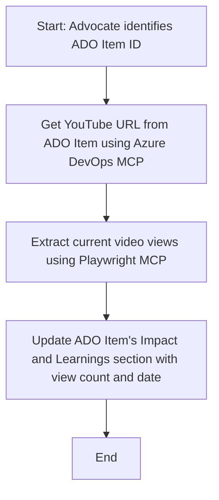

<!--
CO_OP_TRANSLATOR_METADATA:
{
  "original_hash": "14a2dfbea55ef735660a06bd6bdfe5f3",
  "translation_date": "2025-06-13T21:37:23+00:00",
  "source_file": "09-CaseStudy/UpdateADOItemsFromYT.md",
  "language_code": "ms"
}
-->
# Case Study: Aktualizace položek Azure DevOps na základě dat z YouTube pomocí MCP

> **Disclaimer:** Existují již online nástroje a reporty, které dokážou automatizovat proces aktualizace položek Azure DevOps daty z platforem jako YouTube. Následující scénář slouží pouze jako ukázkový případ, jak lze nástroje MCP využít pro automatizaci a integraci.

## Přehled

Tato případová studie ukazuje jeden příklad, jak lze Model Context Protocol (MCP) a jeho nástroje použít k automatizaci aktualizace pracovních položek Azure DevOps (ADO) informacemi získanými z online platforem, jako je YouTube. Popisovaný scénář je jen ilustrací širších možností těchto nástrojů, které lze přizpůsobit mnoha podobným automatizačním potřebám.

V tomto příkladu Advocate sleduje online sezení pomocí ADO položek, kde každá položka obsahuje URL videa na YouTube. Díky nástrojům MCP může Advocate udržovat ADO položky aktuální s nejnovějšími metrikami videa, například počtem zhlédnutí, opakovatelným a automatizovaným způsobem. Tento přístup lze obecně použít i v dalších případech, kdy je potřeba integrovat informace z online zdrojů do ADO nebo jiných systémů.

## Scénář

Advocate je zodpovědný za sledování dopadu online sezení a zapojení komunity. Každé sezení je zaznamenáno jako pracovní položka ADO v projektu 'DevRel' a pracovní položka obsahuje pole s URL videa na YouTube. Pro přesné reportování dosahu sezení musí Advocate aktualizovat ADO položku o aktuální počet zhlédnutí videa a datum, kdy byla tato informace získána.

## Použité nástroje

- [Azure DevOps MCP](https://github.com/microsoft/azure-devops-mcp): Umožňuje programatický přístup a aktualizace pracovních položek ADO přes MCP.
- [Playwright MCP](https://github.com/microsoft/playwright-mcp): Automatizuje akce v prohlížeči pro získávání živých dat ze stránek, například statistik videí na YouTube.

## Postup krok za krokem

1. **Identifikace ADO položky**: Začíná se ID pracovní položky ADO (např. 1234) v projektu 'DevRel'.
2. **Získání YouTube URL**: Pomocí Azure DevOps MCP nástroje se načte YouTube URL z pracovní položky.
3. **Získání počtu zhlédnutí**: Pomocí Playwright MCP nástroje se přejde na YouTube URL a získá se aktuální počet zhlédnutí.
4. **Aktualizace ADO položky**: Nejnovější počet zhlédnutí a datum získání se zapíší do sekce 'Impact and Learnings' pracovní položky ADO pomocí Azure DevOps MCP nástroje.

## Ukázkový prompt

```bash
- Work with the ADO Item ID: 1234
- The project is '2025-Awesome'
- Get the YouTube URL for the ADO item
- Use Playwright to get the current views from the YouTube video
- Update the ADO item with the current video views and the updated date of the information
```

## Mermaid diagram



## Technická implementace

- **Orchestrace MCP**: Průběh řídí MCP server, který koordinuje využití nástrojů Azure DevOps MCP a Playwright MCP.
- **Automatizace**: Proces lze spustit ručně nebo naplánovat, aby se pravidelně aktualizovaly položky ADO.
- **Rozšiřitelnost**: Stejný vzor lze použít pro aktualizaci ADO položek o další online metriky (např. lajky, komentáře) nebo z jiných platforem.

## Výsledky a dopad

- **Efektivita**: Snižuje manuální práci Advocate díky automatickému získávání a aktualizaci metrik videí.
- **Přesnost**: Zajišťuje, že položky ADO obsahují vždy nejaktuálnější dostupná data z online zdrojů.
- **Opakovatelnost**: Poskytuje znovupoužitelný postup pro podobné scénáře s jinými zdroji dat nebo metrikami.

## Reference

- [Azure DevOps MCP](https://github.com/microsoft/azure-devops-mcp)
- [Playwright MCP](https://github.com/microsoft/playwright-mcp)
- [Model Context Protocol (MCP)](https://modelcontextprotocol.io/)

**Penafian**:  
Dokumen ini telah diterjemahkan menggunakan perkhidmatan terjemahan AI [Co-op Translator](https://github.com/Azure/co-op-translator). Walaupun kami berusaha untuk ketepatan, sila maklum bahawa terjemahan automatik mungkin mengandungi kesilapan atau ketidaktepatan. Dokumen asal dalam bahasa asalnya harus dianggap sebagai sumber yang sahih. Untuk maklumat penting, terjemahan manusia profesional adalah disyorkan. Kami tidak bertanggungjawab atas sebarang salah faham atau tafsiran yang timbul daripada penggunaan terjemahan ini.