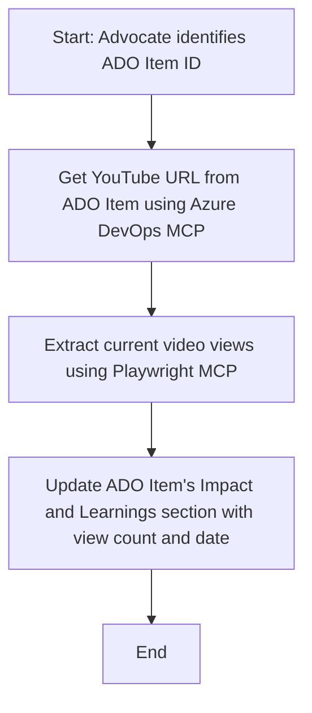

<!--
CO_OP_TRANSLATOR_METADATA:
{
  "original_hash": "14a2dfbea55ef735660a06bd6bdfe5f3",
  "translation_date": "2025-07-14T06:14:18+00:00",
  "source_file": "09-CaseStudy/UpdateADOItemsFromYT.md",
  "language_code": "ms"
}
-->
# Kajian Kes: Mengemas Kini Item Azure DevOps dari Data YouTube dengan MCP

> **Penafian:** Terdapat alat dan laporan dalam talian yang sedia ada yang boleh mengautomasikan proses mengemas kini item Azure DevOps dengan data dari platform seperti YouTube. Senario berikut disediakan semata-mata sebagai contoh penggunaan untuk menunjukkan bagaimana alat MCP boleh digunakan untuk tugasan automasi dan integrasi.

## Gambaran Keseluruhan

Kajian kes ini menunjukkan satu contoh bagaimana Model Context Protocol (MCP) dan alatnya boleh digunakan untuk mengautomasikan proses mengemas kini item kerja Azure DevOps (ADO) dengan maklumat yang diperoleh dari platform dalam talian, seperti YouTube. Senario yang diterangkan hanyalah satu ilustrasi bagi keupayaan lebih luas alat ini, yang boleh disesuaikan untuk pelbagai keperluan automasi yang serupa.

Dalam contoh ini, seorang Advocate menjejak sesi dalam talian menggunakan item ADO, di mana setiap item mengandungi URL video YouTube. Dengan menggunakan alat MCP, Advocate boleh memastikan item ADO sentiasa dikemas kini dengan metrik video terkini, seperti bilangan tontonan, secara berulang dan automatik. Pendekatan ini boleh digeneralisasikan kepada kes penggunaan lain di mana maklumat dari sumber dalam talian perlu diintegrasikan ke dalam ADO atau sistem lain.

## Senario

Seorang Advocate bertanggungjawab untuk menjejak impak sesi dalam talian dan penglibatan komuniti. Setiap sesi direkodkan sebagai item kerja ADO dalam projek 'DevRel', dan item kerja tersebut mengandungi medan untuk URL video YouTube. Untuk melaporkan capaian sesi dengan tepat, Advocate perlu mengemas kini item ADO dengan bilangan tontonan video terkini dan tarikh maklumat ini diperoleh.

## Alat Digunakan

- [Azure DevOps MCP](https://github.com/microsoft/azure-devops-mcp): Membolehkan akses dan kemas kini item kerja ADO secara programatik melalui MCP.
- [Playwright MCP](https://github.com/microsoft/playwright-mcp): Mengautomasikan tindakan pelayar untuk mengekstrak data langsung dari halaman web, seperti statistik video YouTube.

## Aliran Kerja Langkah demi Langkah

1. **Kenal pasti Item ADO**: Mulakan dengan ID item kerja ADO (contoh: 1234) dalam projek 'DevRel'.
2. **Dapatkan URL YouTube**: Gunakan alat Azure DevOps MCP untuk mendapatkan URL YouTube dari item kerja.
3. **Ekstrak Bilangan Tontonan Video**: Gunakan alat Playwright MCP untuk melayari URL YouTube dan mengekstrak bilangan tontonan terkini.
4. **Kemas Kini Item ADO**: Tulis bilangan tontonan terkini dan tarikh pengambilan maklumat ke dalam bahagian 'Impact and Learnings' item kerja ADO menggunakan alat Azure DevOps MCP.

## Contoh Prompt

```bash
- Work with the ADO Item ID: 1234
- The project is '2025-Awesome'
- Get the YouTube URL for the ADO item
- Use Playwright to get the current views from the YouTube video
- Update the ADO item with the current video views and the updated date of the information
```

## Carta Alir Mermaid



## Pelaksanaan Teknikal

- **Orkestrasi MCP**: Aliran kerja diorkestrakan oleh pelayan MCP, yang menyelaraskan penggunaan kedua-dua alat Azure DevOps MCP dan Playwright MCP.
- **Automasi**: Proses boleh dicetuskan secara manual atau dijadualkan untuk dijalankan pada selang masa tertentu bagi memastikan item ADO sentiasa dikemas kini.
- **Kebolehlanjutan**: Corak yang sama boleh diperluaskan untuk mengemas kini item ADO dengan metrik dalam talian lain (contoh: suka, komen) atau dari platform lain.

## Keputusan dan Impak

- **Kecekapan**: Mengurangkan usaha manual bagi Advocate dengan mengautomasikan pengambilan dan kemas kini metrik video.
- **Ketepatan**: Memastikan item ADO mencerminkan data terkini yang tersedia dari sumber dalam talian.
- **Pengulangan**: Menyediakan aliran kerja yang boleh digunakan semula untuk senario serupa yang melibatkan sumber data atau metrik lain.

## Rujukan

- [Azure DevOps MCP](https://github.com/microsoft/azure-devops-mcp)
- [Playwright MCP](https://github.com/microsoft/playwright-mcp)
- [Model Context Protocol (MCP)](https://modelcontextprotocol.io/)

**Penafian**:  
Dokumen ini telah diterjemahkan menggunakan perkhidmatan terjemahan AI [Co-op Translator](https://github.com/Azure/co-op-translator). Walaupun kami berusaha untuk ketepatan, sila ambil maklum bahawa terjemahan automatik mungkin mengandungi kesilapan atau ketidaktepatan. Dokumen asal dalam bahasa asalnya harus dianggap sebagai sumber yang sahih. Untuk maklumat penting, terjemahan profesional oleh manusia adalah disyorkan. Kami tidak bertanggungjawab atas sebarang salah faham atau salah tafsir yang timbul daripada penggunaan terjemahan ini.