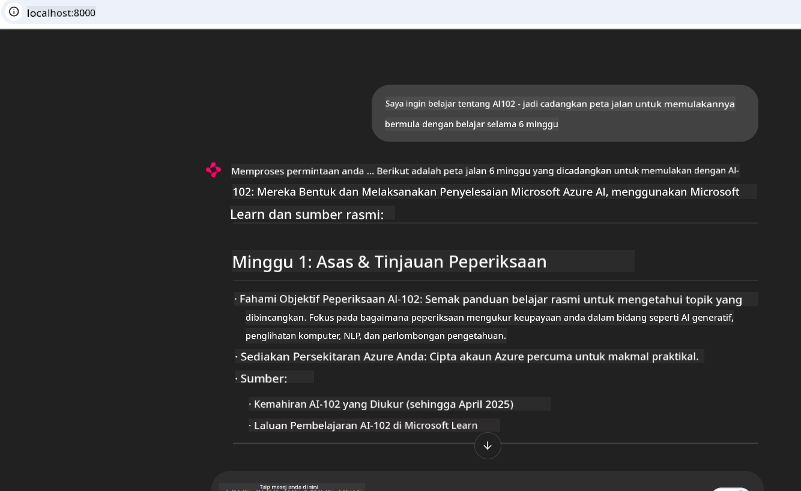
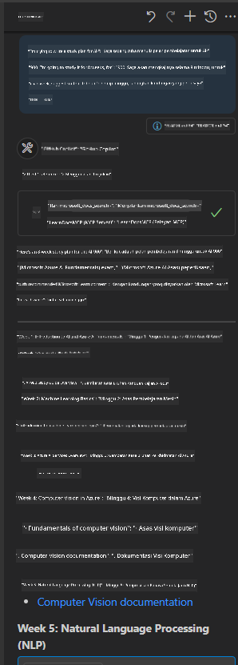

<!--
CO_OP_TRANSLATOR_METADATA:
{
  "original_hash": "4319d291c9d124ecafea52b3d04bfa0e",
  "translation_date": "2025-07-14T06:27:24+00:00",
  "source_file": "09-CaseStudy/docs-mcp/README.md",
  "language_code": "ms"
}
-->
# Kajian Kes: Menyambung ke Pelayan Microsoft Learn Docs MCP dari Klien

Pernahkah anda mendapati diri anda melompat antara laman dokumentasi, Stack Overflow, dan tab enjin carian yang tidak berkesudahan, sambil cuba menyelesaikan masalah dalam kod anda? Mungkin anda mempunyai monitor kedua hanya untuk dokumen, atau anda sentiasa menukar antara IDE dan pelayar. Bukankah lebih baik jika anda boleh membawa dokumentasi terus ke dalam aliran kerja anda—terintegrasi dalam aplikasi anda, IDE anda, atau alat khusus anda sendiri? Dalam kajian kes ini, kita akan terokai cara untuk melakukan perkara itu dengan menyambung terus ke pelayan Microsoft Learn Docs MCP dari aplikasi klien anda sendiri.

## Gambaran Keseluruhan

Pembangunan moden bukan sekadar menulis kod—ia tentang mencari maklumat yang tepat pada masa yang tepat. Dokumentasi ada di mana-mana, tetapi jarang sekali berada di tempat yang paling anda perlukan: di dalam alat dan aliran kerja anda. Dengan mengintegrasikan pengambilan dokumentasi terus ke dalam aplikasi anda, anda boleh menjimatkan masa, mengurangkan pertukaran konteks, dan meningkatkan produktiviti. Dalam bahagian ini, kami akan tunjukkan cara untuk menyambung klien ke pelayan Microsoft Learn Docs MCP, supaya anda boleh mengakses dokumentasi masa nyata yang peka konteks tanpa perlu meninggalkan aplikasi anda.

Kami akan membimbing anda melalui proses mewujudkan sambungan, menghantar permintaan, dan mengendalikan respons penstriman dengan cekap. Pendekatan ini bukan sahaja memudahkan aliran kerja anda tetapi juga membuka peluang untuk membina alat pembangun yang lebih pintar dan berguna.

## Objektif Pembelajaran

Mengapa kita melakukan ini? Kerana pengalaman pembangun terbaik adalah yang menghilangkan halangan. Bayangkan dunia di mana penyunting kod, chatbot, atau aplikasi web anda boleh menjawab soalan dokumentasi anda dengan segera, menggunakan kandungan terkini dari Microsoft Learn. Pada akhir bab ini, anda akan tahu cara untuk:

- Memahami asas komunikasi pelayan-klien MCP untuk dokumentasi
- Melaksanakan aplikasi konsol atau web untuk menyambung ke pelayan Microsoft Learn Docs MCP
- Menggunakan klien HTTP penstriman untuk pengambilan dokumentasi masa nyata
- Merekod dan mentafsir respons dokumentasi dalam aplikasi anda

Anda akan lihat bagaimana kemahiran ini boleh membantu anda membina alat yang bukan sahaja reaktif, tetapi benar-benar interaktif dan peka konteks.

## Senario 1 - Pengambilan Dokumentasi Masa Nyata dengan MCP

Dalam senario ini, kami akan tunjukkan cara untuk menyambung klien ke pelayan Microsoft Learn Docs MCP, supaya anda boleh mengakses dokumentasi masa nyata yang peka konteks tanpa perlu meninggalkan aplikasi anda.

Mari kita praktikkan. Tugas anda adalah menulis aplikasi yang menyambung ke pelayan Microsoft Learn Docs MCP, memanggil alat `microsoft_docs_search`, dan merekod respons penstriman ke konsol.

### Kenapa pendekatan ini?
Kerana ia adalah asas untuk membina integrasi yang lebih maju—sama ada anda mahu menggerakkan chatbot, sambungan IDE, atau papan pemuka web.

Anda akan dapati kod dan arahan untuk senario ini dalam folder [`solution`](./solution/README.md) dalam kajian kes ini. Langkah-langkah akan membimbing anda melalui penyediaan sambungan:
- Gunakan SDK MCP rasmi dan klien HTTP yang boleh distrim untuk sambungan
- Panggil alat `microsoft_docs_search` dengan parameter carian untuk mendapatkan dokumentasi
- Laksanakan pencatatan dan pengendalian ralat yang betul
- Cipta antara muka konsol interaktif untuk membolehkan pengguna memasukkan pelbagai pertanyaan carian

Senario ini menunjukkan cara untuk:
- Menyambung ke pelayan Docs MCP
- Menghantar pertanyaan
- Mengurai dan mencetak hasil

Ini adalah contoh bagaimana penyelesaian dijalankan:

```
Prompt> What is Azure Key Vault?
Answer> Azure Key Vault is a cloud service for securely storing and accessing secrets. ...
```

Di bawah adalah contoh penyelesaian minimum. Kod penuh dan butiran tersedia dalam folder penyelesaian.

<details>
<summary>Python</summary>

```python
import asyncio
from mcp.client.streamable_http import streamablehttp_client
from mcp import ClientSession

async def main():
    async with streamablehttp_client("https://learn.microsoft.com/api/mcp") as (read_stream, write_stream, _):
        async with ClientSession(read_stream, write_stream) as session:
            await session.initialize()
            result = await session.call_tool("microsoft_docs_search", {"query": "Azure Functions best practices"})
            print(result.content)

if __name__ == "__main__":
    asyncio.run(main())
```

- Untuk pelaksanaan lengkap dan pencatatan, lihat [`scenario1.py`](../../../../09-CaseStudy/docs-mcp/solution/python/scenario1.py).
- Untuk arahan pemasangan dan penggunaan, lihat fail [`README.md`](./solution/python/README.md) dalam folder yang sama.
</details>

## Senario 2 - Aplikasi Web Penjana Pelan Kajian Interaktif dengan MCP

Dalam senario ini, anda akan belajar cara mengintegrasikan Docs MCP ke dalam projek pembangunan web. Matlamatnya adalah membolehkan pengguna mencari dokumentasi Microsoft Learn terus dari antara muka web, menjadikan dokumentasi mudah diakses dalam aplikasi atau laman anda.

Anda akan lihat cara untuk:
- Menyediakan aplikasi web
- Menyambung ke pelayan Docs MCP
- Mengendalikan input pengguna dan memaparkan hasil

Ini adalah contoh bagaimana penyelesaian dijalankan:

```
User> I want to learn about AI102 - so suggest the roadmap to get it started from learn for 6 weeks

Assistant> Here’s a detailed 6-week roadmap to start your preparation for the AI-102: Designing and Implementing a Microsoft Azure AI Solution certification, using official Microsoft resources and focusing on exam skills areas:

---
## Week 1: Introduction & Fundamentals
- **Understand the Exam**: Review the [AI-102 exam skills outline](https://learn.microsoft.com/en-us/credentials/certifications/exams/ai-102/).
- **Set up Azure**: Sign up for a free Azure account if you don't have one.
- **Learning Path**: [Introduction to Azure AI services](https://learn.microsoft.com/en-us/training/modules/intro-to-azure-ai/)
- **Focus**: Get familiar with Azure portal, AI capabilities, and necessary tools.

....more weeks of the roadmap...

Let me know if you want module-specific recommendations or need more customized weekly tasks!
```

Di bawah adalah contoh penyelesaian minimum. Kod penuh dan butiran tersedia dalam folder penyelesaian.



<details>
<summary>Python (Chainlit)</summary>

Chainlit adalah rangka kerja untuk membina aplikasi web AI perbualan. Ia memudahkan penciptaan chatbot dan pembantu interaktif yang boleh memanggil alat MCP dan memaparkan hasil secara masa nyata. Ia sesuai untuk prototaip pantas dan antara muka mesra pengguna.

```python
import chainlit as cl
import requests

MCP_URL = "https://learn.microsoft.com/api/mcp"

@cl.on_message
def handle_message(message):
    query = {"question": message}
    response = requests.post(MCP_URL, json=query)
    if response.ok:
        result = response.json()
        cl.Message(content=result.get("answer", "No answer found.")).send()
    else:
        cl.Message(content="Error: " + response.text).send()
```

- Untuk pelaksanaan lengkap, lihat [`scenario2.py`](../../../../09-CaseStudy/docs-mcp/solution/python/scenario2.py).
- Untuk arahan penyediaan dan pelaksanaan, lihat [`README.md`](./solution/python/README.md).
</details>

## Senario 3: Dokumentasi Dalam Penyunting dengan Pelayan MCP dalam VS Code

Jika anda mahu mendapatkan Microsoft Learn Docs terus dalam VS Code (tanpa perlu menukar tab pelayar), anda boleh menggunakan pelayan MCP dalam penyunting anda. Ini membolehkan anda:
- Mencari dan membaca dokumen dalam VS Code tanpa meninggalkan persekitaran pengkodan anda.
- Merujuk dokumentasi dan memasukkan pautan terus ke dalam fail README atau kursus anda.
- Menggunakan GitHub Copilot dan MCP bersama untuk aliran kerja dokumentasi yang lancar dan dipacu AI.

**Anda akan lihat cara untuk:**
- Menambah fail `.vscode/mcp.json` yang sah ke akar ruang kerja anda (lihat contoh di bawah).
- Buka panel MCP atau gunakan palet arahan dalam VS Code untuk mencari dan memasukkan dokumen.
- Merujuk dokumentasi terus dalam fail markdown anda semasa bekerja.
- Menggabungkan aliran kerja ini dengan GitHub Copilot untuk produktiviti yang lebih tinggi.

Ini adalah contoh cara menyediakan pelayan MCP dalam VS Code:

```json
{
  "servers": {
    "LearnDocsMCP": {
      "url": "https://learn.microsoft.com/api/mcp"
    }
  }
}
```

</details>

> Untuk panduan terperinci dengan tangkapan skrin dan langkah demi langkah, lihat [`README.md`](./solution/scenario3/README.md).



Pendekatan ini sesuai untuk sesiapa yang membina kursus teknikal, menulis dokumentasi, atau membangunkan kod dengan keperluan rujukan yang kerap.

## Perkara Penting

Mengintegrasikan dokumentasi terus ke dalam alat anda bukan sekadar kemudahan—ia mengubah cara anda bekerja dan meningkatkan produktiviti. Dengan menyambung ke pelayan Microsoft Learn Docs MCP dari klien anda, anda boleh:

- Menghapuskan pertukaran konteks antara kod dan dokumentasi
- Mendapatkan dokumentasi terkini yang peka konteks secara masa nyata
- Membina alat pembangun yang lebih pintar dan interaktif

Kemahiran ini akan membantu anda mencipta penyelesaian yang bukan sahaja cekap, tetapi juga menyeronokkan untuk digunakan.

## Sumber Tambahan

Untuk memperdalam pemahaman anda, terokai sumber rasmi berikut:

- [Microsoft Learn Docs MCP Server (GitHub)](https://github.com/MicrosoftDocs/mcp)
- [Mulakan dengan Azure MCP Server (mcp-python)](https://learn.microsoft.com/en-us/azure/developer/azure-mcp-server/get-started#create-the-python-app)
- [Apakah Azure MCP Server?](https://learn.microsoft.com/en-us/azure/developer/azure-mcp-server/)
- [Pengenalan Model Context Protocol (MCP)](https://modelcontextprotocol.io/introduction)
- [Tambah plugin dari MCP Server (Python)](https://learn.microsoft.com/en-us/semantic-kernel/concepts/plugins/adding-mcp-plugins)

**Penafian**:  
Dokumen ini telah diterjemahkan menggunakan perkhidmatan terjemahan AI [Co-op Translator](https://github.com/Azure/co-op-translator). Walaupun kami berusaha untuk ketepatan, sila ambil maklum bahawa terjemahan automatik mungkin mengandungi kesilapan atau ketidaktepatan. Dokumen asal dalam bahasa asalnya harus dianggap sebagai sumber yang sahih. Untuk maklumat penting, terjemahan profesional oleh manusia adalah disyorkan. Kami tidak bertanggungjawab atas sebarang salah faham atau salah tafsir yang timbul daripada penggunaan terjemahan ini.