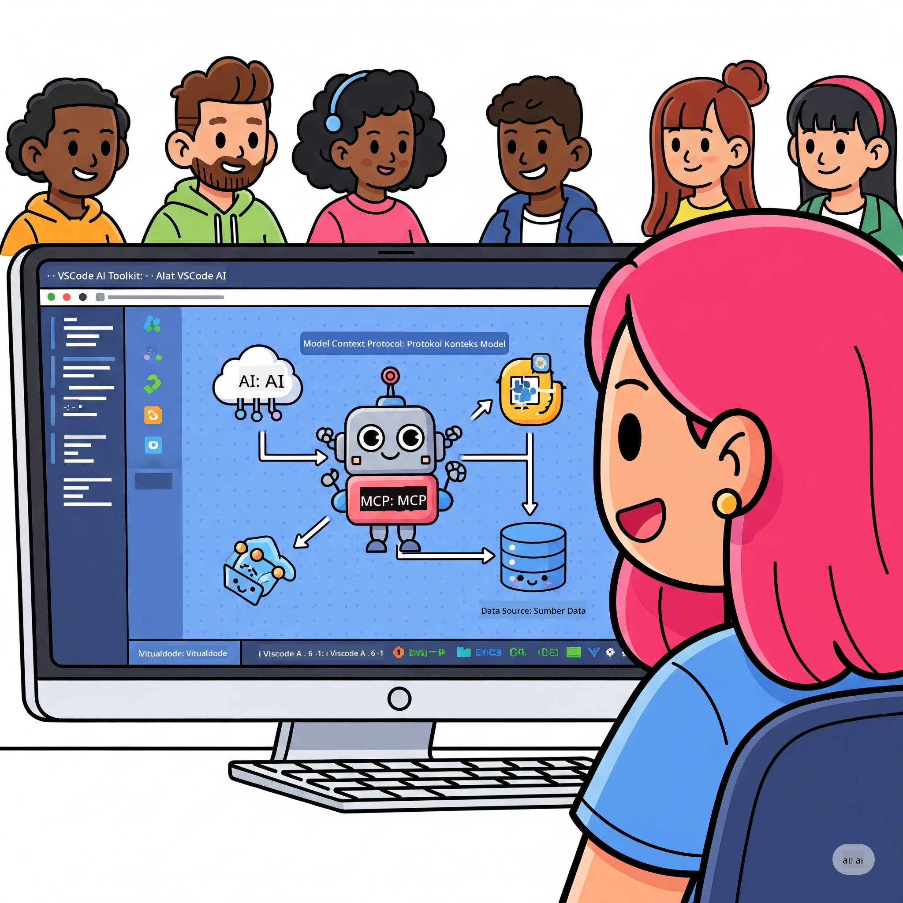
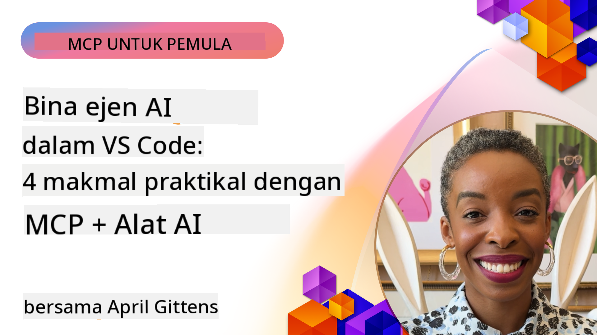

<!--
CO_OP_TRANSLATOR_METADATA:
{
  "original_hash": "1b000fd6e1b04c047578bfc5d07d54eb",
  "translation_date": "2025-08-18T18:06:14+00:00",
  "source_file": "10-StreamliningAIWorkflowsBuildingAnMCPServerWithAIToolkit/README.md",
  "language_code": "ms"
}
-->
# Memperkemas Aliran Kerja AI: Membina Pelayan MCP dengan AI Toolkit

## 🎯 Gambaran Keseluruhan

_(Klik imej di atas untuk menonton video pelajaran ini)_

Selamat datang ke **Bengkel Model Context Protocol (MCP)**! Bengkel praktikal ini menggabungkan dua teknologi terkini untuk merevolusikan pembangunan aplikasi AI:

- **🔗 Model Context Protocol (MCP)**: Standard terbuka untuk integrasi alat AI yang lancar
- **🛠️ AI Toolkit untuk Visual Studio Code (AITK)**: Sambungan pembangunan AI yang berkuasa dari Microsoft

### 🎓 Apa yang Akan Anda Pelajari

Menjelang akhir bengkel ini, anda akan menguasai seni membina aplikasi pintar yang menghubungkan model AI dengan alat dan perkhidmatan dunia sebenar. Dari ujian automatik hingga integrasi API tersuai, anda akan memperoleh kemahiran praktikal untuk menyelesaikan cabaran perniagaan yang kompleks.

## 🏗️ Tumpuan Teknologi

### 🔌 Model Context Protocol (MCP)

MCP ialah **"USB-C untuk AI"** - standard universal yang menghubungkan model AI kepada alat dan sumber data luaran.

**✨ Ciri Utama:**

- 🔄 **Integrasi Standard**: Antara muka universal untuk sambungan alat AI
- 🏛️ **Seni Bina Fleksibel**: Pelayan tempatan & jauh melalui pengangkutan stdio/SSE
- 🧰 **Ekosistem Kaya**: Alat, arahan, dan sumber dalam satu protokol
- 🔒 **Sedia untuk Perusahaan**: Keselamatan dan kebolehpercayaan terbina dalam

**🎯 Kenapa MCP Penting:**
Seperti USB-C yang menghapuskan kekusutan kabel, MCP menghapuskan kerumitan integrasi AI. Satu protokol, kemungkinan tanpa had.

### 🤖 AI Toolkit untuk Visual Studio Code (AITK)

Sambungan pembangunan AI utama Microsoft yang mengubah VS Code menjadi kuasa AI.

**🚀 Keupayaan Teras:**

- 📦 **Katalog Model**: Akses model dari Azure AI, GitHub, Hugging Face, Ollama
- ⚡ **Inferens Tempatan**: Pelaksanaan CPU/GPU/NPU yang dioptimumkan ONNX
- 🏗️ **Pembina Ejen**: Pembangunan ejen AI visual dengan integrasi MCP
- 🎭 **Multi-Mod**: Sokongan teks, penglihatan, dan output berstruktur

**💡 Kelebihan Pembangunan:**

- Penyebaran model tanpa konfigurasi
- Kejuruteraan arahan secara visual
- Taman permainan ujian masa nyata
- Integrasi pelayan MCP yang lancar

## 📚 Perjalanan Pembelajaran

### [🚀 Modul 1: Asas AI Toolkit](./lab1/README.md)

**Tempoh**: 15 minit

- 🛠️ Pasang dan konfigurasikan AI Toolkit untuk VS Code
- 🗂️ Terokai Katalog Model (100+ model dari GitHub, ONNX, OpenAI, Anthropic, Google)
- 🎮 Kuasai Taman Permainan Interaktif untuk ujian model masa nyata
- 🤖 Bina ejen AI pertama anda dengan Pembina Ejen
- 📊 Nilai prestasi model dengan metrik terbina dalam (F1, relevan, kesamaan, koheren)
- ⚡ Pelajari keupayaan pemprosesan kelompok dan sokongan multi-mod

**🎯 Hasil Pembelajaran**: Cipta ejen AI berfungsi dengan pemahaman menyeluruh tentang keupayaan AITK

### [🌐 Modul 2: Asas MCP dengan AI Toolkit](./lab2/README.md)

**Tempoh**: 20 minit

- 🧠 Kuasai seni bina dan konsep Model Context Protocol (MCP)
- 🌐 Terokai ekosistem pelayan MCP Microsoft
- 🤖 Bina ejen automasi pelayar menggunakan pelayan MCP Playwright
- 🔧 Integrasikan pelayan MCP dengan Pembina Ejen AI Toolkit
- 📊 Konfigurasikan dan uji alat MCP dalam ejen anda
- 🚀 Eksport dan sebarkan ejen berkuasa MCP untuk kegunaan produksi

**🎯 Hasil Pembelajaran**: Sebarkan ejen AI yang dipertingkatkan dengan alat luaran melalui MCP

### [🔧 Modul 3: Pembangunan MCP Lanjutan dengan AI Toolkit](./lab3/README.md)

**Tempoh**: 20 minit

- 💻 Cipta pelayan MCP tersuai menggunakan AI Toolkit
- 🐍 Konfigurasikan dan gunakan SDK Python MCP terkini (v1.9.3)
- 🔍 Sediakan dan gunakan MCP Inspector untuk penyahpepijatan
- 🛠️ Bina Pelayan MCP Cuaca dengan aliran kerja penyahpepijatan profesional
- 🧪 Nyahpepijat pelayan MCP dalam persekitaran Pembina Ejen dan MCP Inspector

**🎯 Hasil Pembelajaran**: Bangunkan dan nyahpepijat pelayan MCP tersuai dengan alat moden

### [🐙 Modul 4: Pembangunan MCP Praktikal - Pelayan Klon GitHub Tersuai](./lab4/README.md)

**Tempoh**: 30 minit

- 🏗️ Bina Pelayan MCP Klon GitHub dunia sebenar untuk aliran kerja pembangunan
- 🔄 Laksanakan klon repositori pintar dengan pengesahan dan pengendalian ralat
- 📁 Cipta pengurusan direktori pintar dan integrasi VS Code
- 🤖 Gunakan Mod Ejen GitHub Copilot dengan alat MCP tersuai
- 🛡️ Terapkan kebolehpercayaan sedia produksi dan keserasian merentas platform

**🎯 Hasil Pembelajaran**: Sebarkan pelayan MCP sedia produksi yang memperkemas aliran kerja pembangunan sebenar

## 💡 Aplikasi Dunia Sebenar & Impak

### 🏢 Kes Penggunaan Perusahaan

#### 🔄 Automasi DevOps

Transformasikan aliran kerja pembangunan anda dengan automasi pintar:

- **Pengurusan Repositori Pintar**: Semakan kod dan keputusan penggabungan yang dipacu AI
- **CI/CD Pintar**: Pengoptimuman saluran paip automatik berdasarkan perubahan kod
- **Triage Isu**: Pengelasan dan penugasan pepijat secara automatik

#### 🧪 Revolusi Jaminan Kualiti

Tingkatkan ujian dengan automasi berkuasa AI:

- **Penjanaan Ujian Pintar**: Cipta suite ujian komprehensif secara automatik
- **Ujian Regresi Visual**: Pengesanan perubahan UI berkuasa AI
- **Pemantauan Prestasi**: Pengenalpastian dan penyelesaian isu secara proaktif

#### 📊 Kecerdasan Saluran Data

Bina aliran kerja pemprosesan data yang lebih pintar:

- **Proses ETL Adaptif**: Transformasi data yang mengoptimumkan diri
- **Pengesanan Anomali**: Pemantauan kualiti data masa nyata
- **Penghalaan Pintar**: Pengurusan aliran data yang bijak

#### 🎧 Peningkatan Pengalaman Pelanggan

Cipta interaksi pelanggan yang luar biasa:

- **Sokongan Berasaskan Konteks**: Ejen AI dengan akses kepada sejarah pelanggan
- **Penyelesaian Isu Proaktif**: Perkhidmatan pelanggan ramalan
- **Integrasi Pelbagai Saluran**: Pengalaman AI bersatu merentas platform

## 🛠️ Prasyarat & Persediaan

### 💻 Keperluan Sistem

| Komponen | Keperluan | Nota |
|-----------|-------------|-------|
| **Sistem Operasi** | Windows 10+, macOS 10.15+, Linux | Mana-mana OS moden |
| **Visual Studio Code** | Versi stabil terkini | Diperlukan untuk AITK |
| **Node.js** | v18.0+ dan npm | Untuk pembangunan pelayan MCP |
| **Python** | 3.10+ | Pilihan untuk pelayan MCP Python |
| **Memori** | Minimum 8GB RAM | 16GB disyorkan untuk model tempatan |

### 🔧 Persekitaran Pembangunan

#### Sambungan VS Code yang Disyorkan

- **AI Toolkit** (ms-windows-ai-studio.windows-ai-studio)
- **Python** (ms-python.python)
- **Python Debugger** (ms-python.debugpy)
- **GitHub Copilot** (GitHub.copilot) - Pilihan tetapi berguna

#### Alat Pilihan

- **uv**: Pengurus pakej Python moden
- **MCP Inspector**: Alat penyahpepijatan visual untuk pelayan MCP
- **Playwright**: Untuk contoh automasi web

## 🎖️ Hasil Pembelajaran & Laluan Pensijilan

### 🏆 Senarai Semak Penguasaan Kemahiran

Dengan melengkapkan bengkel ini, anda akan mencapai penguasaan dalam:

#### 🎯 Kecekapan Teras

- [ ] **Penguasaan Protokol MCP**: Pemahaman mendalam tentang seni bina dan corak pelaksanaan
- [ ] **Kemahiran AITK**: Penggunaan tahap pakar AI Toolkit untuk pembangunan pantas
- [ ] **Pembangunan Pelayan Tersuai**: Bina, sebarkan, dan selenggara pelayan MCP produksi
- [ ] **Integrasi Alat yang Cemerlang**: Sambungkan AI dengan aliran kerja pembangunan sedia ada dengan lancar
- [ ] **Aplikasi Penyelesaian Masalah**: Terapkan kemahiran yang dipelajari untuk cabaran perniagaan sebenar

#### 🔧 Kemahiran Teknikal

- [ ] Sediakan dan konfigurasikan AI Toolkit dalam VS Code
- [ ] Reka bentuk dan laksanakan pelayan MCP tersuai
- [ ] Integrasikan Model GitHub dengan seni bina MCP
- [ ] Bina aliran kerja ujian automatik dengan Playwright
- [ ] Sebarkan ejen AI untuk kegunaan produksi
- [ ] Nyahpepijat dan optimalkan prestasi pelayan MCP

#### 🚀 Keupayaan Lanjutan

- [ ] Reka bentuk integrasi AI skala perusahaan
- [ ] Laksanakan amalan terbaik keselamatan untuk aplikasi AI
- [ ] Reka bentuk seni bina pelayan MCP yang boleh diskalakan
- [ ] Cipta rantai alat tersuai untuk domain tertentu
- [ ] Bimbing orang lain dalam pembangunan asli AI

## 📖 Sumber Tambahan

- [Spesifikasi MCP](https://modelcontextprotocol.io/docs)
- [Repositori GitHub AI Toolkit](https://github.com/microsoft/vscode-ai-toolkit)
- [Koleksi Pelayan MCP Contoh](https://github.com/modelcontextprotocol/servers)
- [Panduan Amalan Terbaik](https://modelcontextprotocol.io/docs/best-practices)

---

**🚀 Bersedia untuk merevolusikan aliran kerja pembangunan AI anda?**

Mari bina masa depan aplikasi pintar bersama MCP dan AI Toolkit!

**Penafian**:  
Dokumen ini telah diterjemahkan menggunakan perkhidmatan terjemahan AI [Co-op Translator](https://github.com/Azure/co-op-translator). Walaupun kami berusaha untuk memastikan ketepatan, sila ambil maklum bahawa terjemahan automatik mungkin mengandungi kesilapan atau ketidaktepatan. Dokumen asal dalam bahasa asalnya harus dianggap sebagai sumber yang berwibawa. Untuk maklumat penting, terjemahan manusia profesional adalah disyorkan. Kami tidak bertanggungjawab atas sebarang salah faham atau salah tafsir yang timbul daripada penggunaan terjemahan ini.