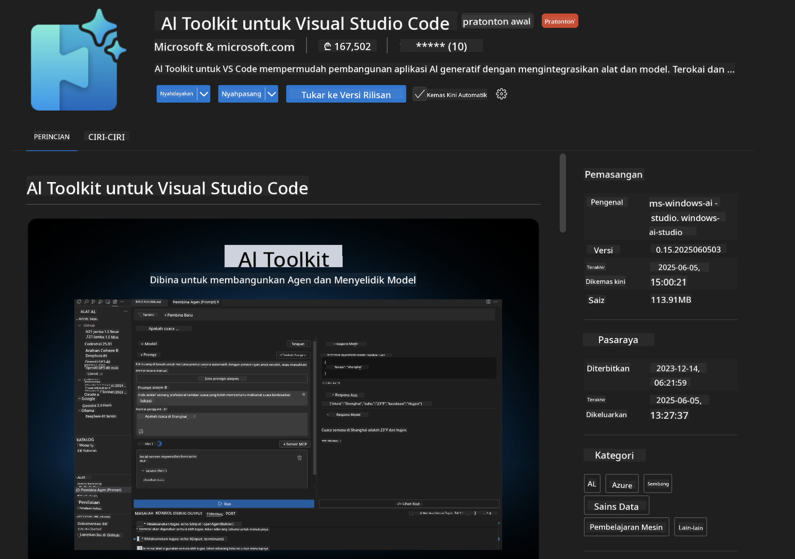
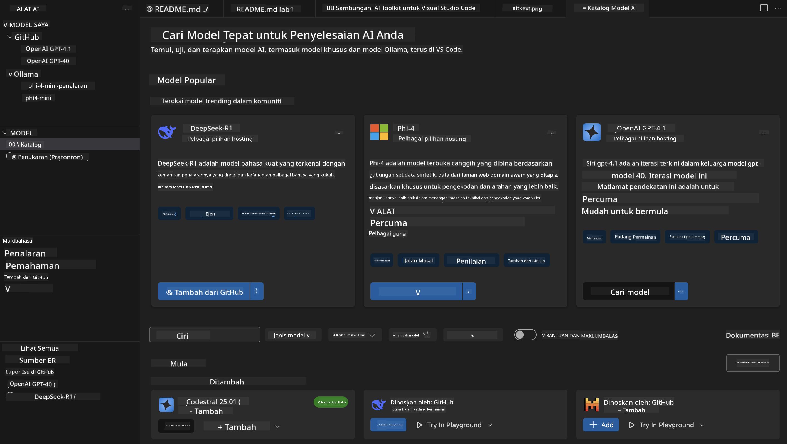
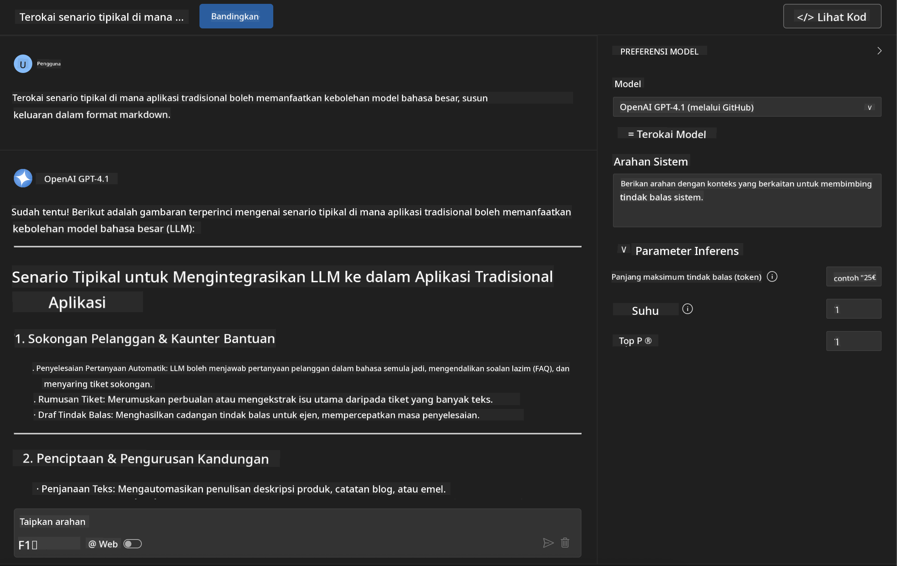
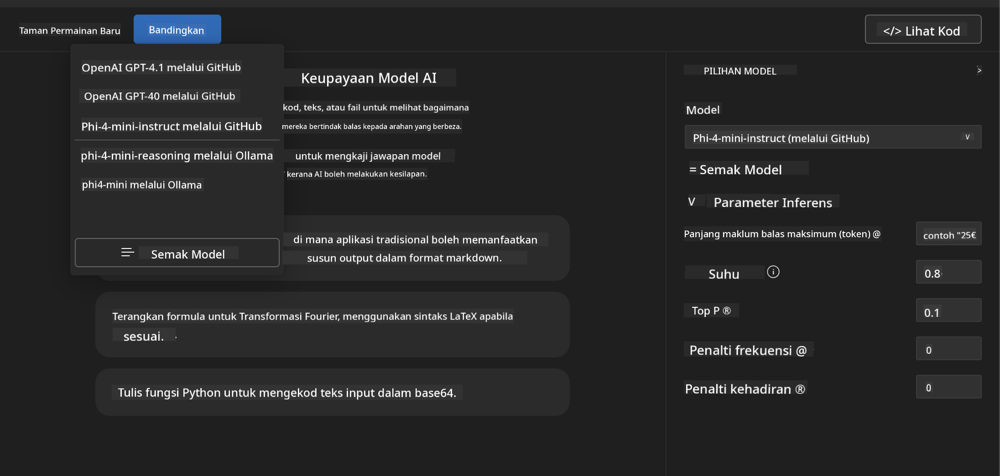
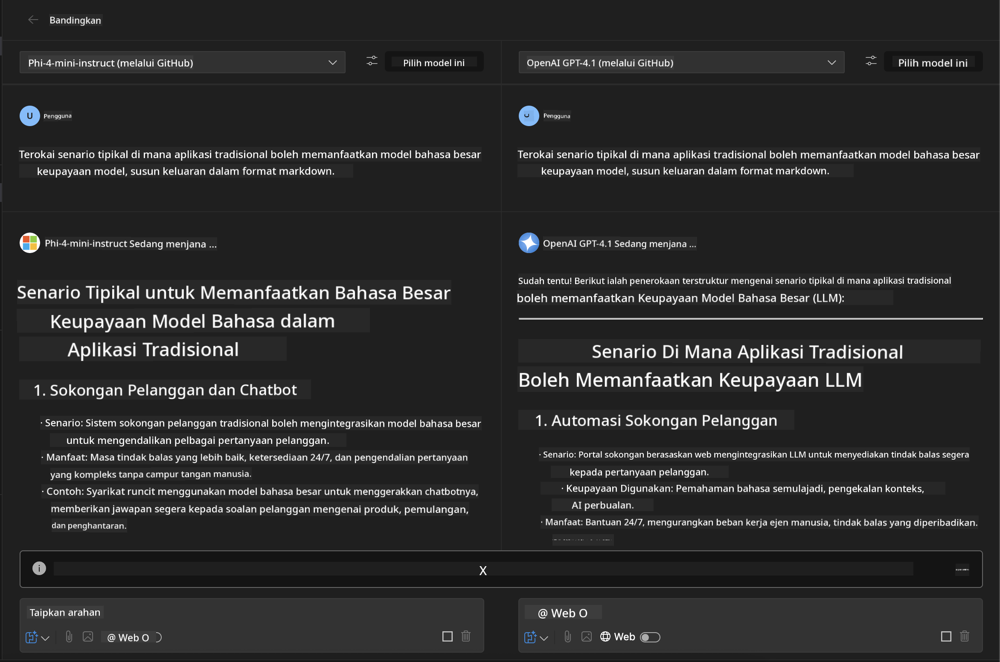
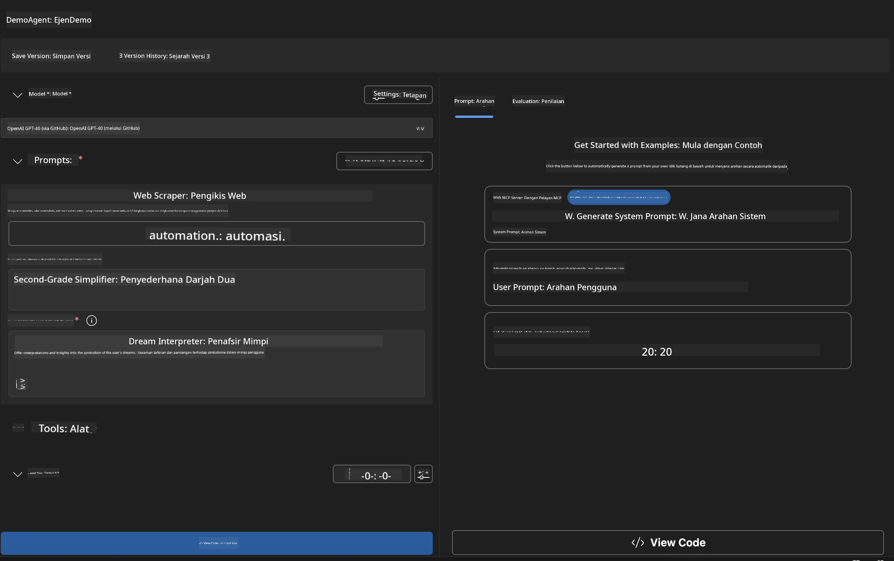
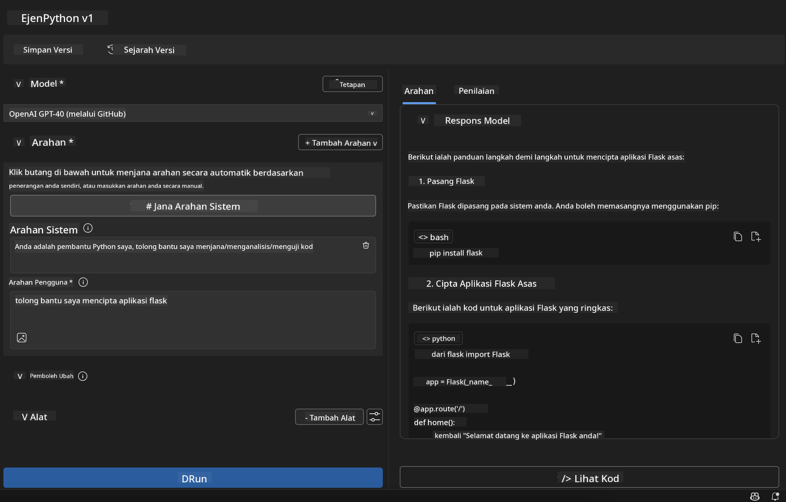

<!--
CO_OP_TRANSLATOR_METADATA:
{
  "original_hash": "2aa9dbc165e104764fa57e8a0d3f1c73",
  "translation_date": "2025-07-14T07:31:30+00:00",
  "source_file": "10-StreamliningAIWorkflowsBuildingAnMCPServerWithAIToolkit/lab1/README.md",
  "language_code": "ms"
}
-->
# 🚀 Modul 1: Asas AI Toolkit

[]()
[]()
[]()

## 📋 Objektif Pembelajaran

Menjelang akhir modul ini, anda akan dapat:
- ✅ Pasang dan konfigurasikan AI Toolkit untuk Visual Studio Code
- ✅ Navigasi Katalog Model dan fahami pelbagai sumber model
- ✅ Gunakan Playground untuk ujian dan eksperimen model
- ✅ Cipta ejen AI tersuai menggunakan Agent Builder
- ✅ Bandingkan prestasi model dari pelbagai penyedia
- ✅ Terapkan amalan terbaik untuk kejuruteraan prompt

## 🧠 Pengenalan kepada AI Toolkit (AITK)

**AI Toolkit untuk Visual Studio Code** adalah sambungan utama Microsoft yang mengubah VS Code menjadi persekitaran pembangunan AI yang lengkap. Ia merapatkan jurang antara penyelidikan AI dan pembangunan aplikasi praktikal, menjadikan AI generatif mudah diakses oleh pembangun dari semua tahap kemahiran.

### 🌟 Keupayaan Utama

| Ciri | Penerangan | Kes Penggunaan |
|---------|-------------|----------|
| **🗂️ Katalog Model** | Akses lebih 100 model dari GitHub, ONNX, OpenAI, Anthropic, Google | Penemuan dan pemilihan model |
| **🔌 Sokongan BYOM** | Integrasi model anda sendiri (tempatan/jauh) | Penggunaan model tersuai |
| **🎮 Playground Interaktif** | Ujian model masa nyata dengan antara muka chat | Prototip dan ujian pantas |
| **📎 Sokongan Multi-Modal** | Mengendalikan teks, imej, dan lampiran | Aplikasi AI yang kompleks |
| **⚡ Pemprosesan Kumpulan** | Jalankan pelbagai prompt serentak | Aliran kerja ujian yang cekap |
| **📊 Penilaian Model** | Metrik terbina dalam (F1, relevan, kesamaan, koheren) | Penilaian prestasi |

### 🎯 Kenapa AI Toolkit Penting

- **🚀 Pembangunan Dipercepatkan**: Dari idea ke prototaip dalam beberapa minit
- **🔄 Aliran Kerja Bersatu**: Satu antara muka untuk pelbagai penyedia AI
- **🧪 Eksperimen Mudah**: Bandingkan model tanpa persediaan rumit
- **📈 Sedia untuk Pengeluaran**: Peralihan lancar dari prototaip ke pelaksanaan

## 🛠️ Prasyarat & Persediaan

### 📦 Pasang Sambungan AI Toolkit

**Langkah 1: Akses Marketplace Sambungan**
1. Buka Visual Studio Code
2. Pergi ke paparan Extensions (`Ctrl+Shift+X` atau `Cmd+Shift+X`)
3. Cari "AI Toolkit"

**Langkah 2: Pilih Versi Anda**
- **🟢 Release**: Disyorkan untuk penggunaan produksi
- **🔶 Pre-release**: Akses awal kepada ciri terkini

**Langkah 3: Pasang dan Aktifkan**



### ✅ Senarai Semak Pengesahan
- [ ] Ikon AI Toolkit muncul di bar sisi VS Code
- [ ] Sambungan diaktifkan dan berfungsi
- [ ] Tiada ralat pemasangan dalam panel output

## 🧪 Latihan Praktikal 1: Meneroka Model GitHub

**🎯 Objektif**: Kuasai Katalog Model dan uji model AI pertama anda

### 📊 Langkah 1: Navigasi Katalog Model

Katalog Model adalah pintu masuk anda ke ekosistem AI. Ia mengumpulkan model dari pelbagai penyedia, memudahkan penemuan dan perbandingan pilihan.

**🔍 Panduan Navigasi:**

Klik pada **MODELS - Catalog** di bar sisi AI Toolkit



**💡 Petua Pro**: Cari model dengan keupayaan khusus yang sesuai dengan kes penggunaan anda (contoh: penjanaan kod, penulisan kreatif, analisis).

**⚠️ Nota**: Model yang dihoskan di GitHub (iaitu Model GitHub) adalah percuma untuk digunakan tetapi tertakluk kepada had kadar permintaan dan token. Jika anda ingin mengakses model bukan GitHub (model luaran yang dihoskan melalui Azure AI atau titik akhir lain), anda perlu menyediakan kunci API atau pengesahan yang sesuai.

### 🚀 Langkah 2: Tambah dan Konfigurasikan Model Pertama Anda

**Strategi Pemilihan Model:**
- **GPT-4.1**: Terbaik untuk penalaran dan analisis kompleks
- **Phi-4-mini**: Ringan, respons pantas untuk tugasan mudah

**🔧 Proses Konfigurasi:**
1. Pilih **OpenAI GPT-4.1** dari katalog
2. Klik **Add to My Models** - ini mendaftarkan model untuk digunakan
3. Pilih **Try in Playground** untuk melancarkan persekitaran ujian
4. Tunggu inisialisasi model (persediaan kali pertama mungkin mengambil masa)


**⚙️ Memahami Parameter Model:**
- **Temperature**: Kawal kreativiti (0 = deterministik, 1 = kreatif)
- **Max Tokens**: Panjang maksimum respons
- **Top-p**: Sampel nukleus untuk kepelbagaian respons

### 🎯 Langkah 3: Kuasai Antara Muka Playground

Playground adalah makmal eksperimen AI anda. Berikut cara memaksimumkan potensinya:

**🎨 Amalan Terbaik Kejuruteraan Prompt:**
1. **Jelas dan Spesifik**: Arahan yang jelas dan terperinci menghasilkan keputusan lebih baik
2. **Berikan Konteks**: Sertakan maklumat latar belakang yang relevan
3. **Gunakan Contoh**: Tunjukkan model apa yang anda mahu dengan contoh
4. **Ulang Kaji**: Perbaiki prompt berdasarkan hasil awal

**🧪 Senario Ujian:**
```markdown
# Example 1: Code Generation
"Write a Python function that calculates the factorial of a number using recursion. Include error handling and docstrings."

# Example 2: Creative Writing
"Write a professional email to a client explaining a project delay, maintaining a positive tone while being transparent about challenges."

# Example 3: Data Analysis
"Analyze this sales data and provide insights: [paste your data]. Focus on trends, anomalies, and actionable recommendations."
```



### 🏆 Latihan Cabaran: Perbandingan Prestasi Model

**🎯 Matlamat**: Bandingkan model berbeza menggunakan prompt yang sama untuk memahami kekuatan mereka

**📋 Arahan:**
1. Tambah **Phi-4-mini** ke ruang kerja anda
2. Gunakan prompt yang sama untuk GPT-4.1 dan Phi-4-mini



3. Bandingkan kualiti respons, kelajuan, dan ketepatan
4. Dokumentasikan penemuan anda dalam bahagian keputusan



**💡 Wawasan Utama untuk Ditemui:**
- Bila menggunakan LLM vs SLM
- Perbandingan kos dan prestasi
- Keupayaan khusus model berbeza

## 🤖 Latihan Praktikal 2: Membina Ejen Tersuai dengan Agent Builder

**🎯 Objektif**: Cipta ejen AI khusus yang disesuaikan untuk tugasan dan aliran kerja tertentu

### 🏗️ Langkah 1: Memahami Agent Builder

Agent Builder adalah tempat AI Toolkit benar-benar menonjol. Ia membolehkan anda mencipta pembantu AI yang dibina khas yang menggabungkan kuasa model bahasa besar dengan arahan tersuai, parameter khusus, dan pengetahuan khusus.

**🧠 Komponen Seni Bina Ejen:**
- **Model Teras**: LLM asas (GPT-4, Groks, Phi, dll.)
- **System Prompt**: Menentukan personaliti dan tingkah laku ejen
- **Parameter**: Tetapan halus untuk prestasi optimum
- **Integrasi Alat**: Sambung ke API luaran dan perkhidmatan MCP
- **Memori**: Konteks perbualan dan penyimpanan sesi



### ⚙️ Langkah 2: Pendalaman Konfigurasi Ejen

**🎨 Mencipta System Prompt yang Berkesan:**
```markdown
# Template Structure:
## Role Definition
You are a [specific role] with expertise in [domain].

## Capabilities
- List specific abilities
- Define scope of knowledge
- Clarify limitations

## Behavior Guidelines
- Response style (formal, casual, technical)
- Output format preferences
- Error handling approach

## Examples
Provide 2-3 examples of ideal interactions
```

*Sudah tentu, anda juga boleh menggunakan Generate System Prompt untuk membolehkan AI membantu anda menjana dan mengoptimumkan prompt*

**🔧 Pengoptimuman Parameter:**
| Parameter | Julat Disyorkan | Kes Penggunaan |
|-----------|------------------|----------|
| **Temperature** | 0.1-0.3 | Respons teknikal/faktual |
| **Temperature** | 0.7-0.9 | Tugasan kreatif/brainstorming |
| **Max Tokens** | 500-1000 | Respons ringkas |
| **Max Tokens** | 2000-4000 | Penjelasan terperinci |

### 🐍 Langkah 3: Latihan Praktikal - Ejen Pengaturcaraan Python

**🎯 Misi**: Cipta pembantu pengaturcaraan Python khusus

**📋 Langkah Konfigurasi:**

1. **Pemilihan Model**: Pilih **Claude 3.5 Sonnet** (sangat baik untuk kod)

2. **Reka Bentuk System Prompt**:
```markdown
# Python Programming Expert Agent

## Role
You are a senior Python developer with 10+ years of experience. You excel at writing clean, efficient, and well-documented Python code.

## Capabilities
- Write production-ready Python code
- Debug complex issues
- Explain code concepts clearly
- Suggest best practices and optimizations
- Provide complete working examples

## Response Format
- Always include docstrings
- Add inline comments for complex logic
- Suggest testing approaches
- Mention relevant libraries when applicable

## Code Quality Standards
- Follow PEP 8 style guidelines
- Use type hints where appropriate
- Handle exceptions gracefully
- Write readable, maintainable code
```

3. **Konfigurasi Parameter**:
   - Temperature: 0.2 (untuk kod yang konsisten dan boleh dipercayai)
   - Max Tokens: 2000 (penjelasan terperinci)
   - Top-p: 0.9 (kreativiti seimbang)



### 🧪 Langkah 4: Uji Ejen Python Anda

**Senario Ujian:**
1. **Fungsi Asas**: "Cipta fungsi untuk mencari nombor perdana"
2. **Algoritma Kompleks**: "Laksanakan pokok carian binari dengan kaedah insert, delete, dan search"
3. **Masalah Dunia Sebenar**: "Bina web scraper yang mengendalikan had kadar dan percubaan semula"
4. **Pembaikan Kod**: "Betulkan kod ini [tampal kod bermasalah]"

**🏆 Kriteria Kejayaan:**
- ✅ Kod berjalan tanpa ralat
- ✅ Termasuk dokumentasi yang betul
- ✅ Mengikuti amalan terbaik Python
- ✅ Memberi penjelasan yang jelas
- ✅ Mencadangkan penambahbaikan

## 🎓 Penutup Modul 1 & Langkah Seterusnya

### 📊 Semakan Pengetahuan

Uji pemahaman anda:
- [ ] Boleh terangkan perbezaan antara model dalam katalog?
- [ ] Berjaya mencipta dan menguji ejen tersuai?
- [ ] Faham cara mengoptimumkan parameter untuk pelbagai kes penggunaan?
- [ ] Boleh reka system prompt yang berkesan?

### 📚 Sumber Tambahan

- **Dokumentasi AI Toolkit**: [Official Microsoft Docs](https://github.com/microsoft/vscode-ai-toolkit)
- **Panduan Kejuruteraan Prompt**: [Best Practices](https://platform.openai.com/docs/guides/prompt-engineering)
- **Model dalam AI Toolkit**: [Models in Develpment](https://github.com/microsoft/vscode-ai-toolkit/blob/main/doc/models.md)

**🎉 Tahniah!** Anda telah menguasai asas AI Toolkit dan bersedia untuk membina aplikasi AI yang lebih maju!

### 🔜 Teruskan ke Modul Seterusnya

Bersedia untuk keupayaan yang lebih maju? Teruskan ke **[Modul 2: MCP dengan Asas AI Toolkit](../lab2/README.md)** di mana anda akan belajar cara untuk:
- Sambungkan ejen anda ke alat luaran menggunakan Model Context Protocol (MCP)
- Bina ejen automasi pelayar dengan Playwright
- Integrasi pelayan MCP dengan ejen AI Toolkit anda
- Memperkasakan ejen anda dengan data dan keupayaan luaran

**Penafian**:  
Dokumen ini telah diterjemahkan menggunakan perkhidmatan terjemahan AI [Co-op Translator](https://github.com/Azure/co-op-translator). Walaupun kami berusaha untuk ketepatan, sila ambil perhatian bahawa terjemahan automatik mungkin mengandungi kesilapan atau ketidaktepatan. Dokumen asal dalam bahasa asalnya harus dianggap sebagai sumber yang sahih. Untuk maklumat penting, terjemahan profesional oleh manusia adalah disyorkan. Kami tidak bertanggungjawab atas sebarang salah faham atau salah tafsir yang timbul daripada penggunaan terjemahan ini.