<!--
CO_OP_TRANSLATOR_METADATA:
{
  "original_hash": "a22b7dd11cd7690f99f9195877cafdc3",
  "translation_date": "2025-07-14T07:58:00+00:00",
  "source_file": "10-StreamliningAIWorkflowsBuildingAnMCPServerWithAIToolkit/lab2/README.md",
  "language_code": "ms"
}
-->
# 🌐 Modul 2: Asas MCP dengan AI Toolkit

[]()
[]()
[]()

## 📋 Objektif Pembelajaran

Menjelang akhir modul ini, anda akan dapat:
- ✅ Memahami seni bina dan manfaat Model Context Protocol (MCP)
- ✅ Meneroka ekosistem pelayan MCP Microsoft
- ✅ Mengintegrasikan pelayan MCP dengan AI Toolkit Agent Builder
- ✅ Membangunkan ejen automasi pelayar berfungsi menggunakan Playwright MCP
- ✅ Mengkonfigurasi dan menguji alat MCP dalam ejen anda
- ✅ Mengeksport dan melancarkan ejen berkuasa MCP untuk kegunaan produksi

## 🎯 Membangun dari Modul 1

Dalam Modul 1, kita menguasai asas AI Toolkit dan mencipta Ejen Python pertama kita. Kini kita akan **memperkasakan** ejen anda dengan menghubungkannya kepada alat dan perkhidmatan luaran melalui **Model Context Protocol (MCP)** yang revolusioner.

Fikirkan ini seperti menaik taraf dari kalkulator asas ke komputer penuh - ejen AI anda akan mendapat keupayaan untuk:
- 🌐 Melayari dan berinteraksi dengan laman web
- 📁 Mengakses dan mengurus fail
- 🔧 Berintegrasi dengan sistem perusahaan
- 📊 Memproses data masa nyata dari API

## 🧠 Memahami Model Context Protocol (MCP)

### 🔍 Apa itu MCP?

Model Context Protocol (MCP) adalah **"USB-C untuk aplikasi AI"** - satu piawaian terbuka revolusioner yang menghubungkan Large Language Models (LLMs) kepada alat, sumber data, dan perkhidmatan luaran. Sama seperti USB-C menghapuskan kekacauan kabel dengan menyediakan satu penyambung universal, MCP menghapuskan kerumitan integrasi AI dengan satu protokol piawai.

### 🎯 Masalah yang Diselesaikan oleh MCP

**Sebelum MCP:**
- 🔧 Integrasi khusus untuk setiap alat
- 🔄 Terikat dengan vendor melalui penyelesaian proprietari  
- 🔒 Kerentanan keselamatan akibat sambungan ad-hoc
- ⏱️ Berbulan-bulan pembangunan untuk integrasi asas

**Dengan MCP:**
- ⚡ Integrasi alat plug-and-play
- 🔄 Seni bina bebas vendor
- 🛡️ Amalan keselamatan terbina dalam
- 🚀 Beberapa minit untuk menambah keupayaan baru

### 🏗️ Mendalami Seni Bina MCP

MCP mengikuti seni bina **klien-pelayan** yang mewujudkan ekosistem yang selamat dan boleh diskala:

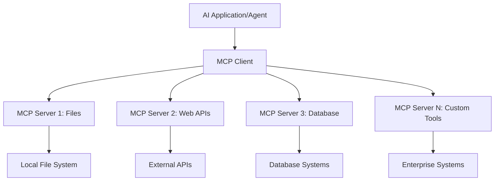

**🔧 Komponen Teras:**

| Komponen | Peranan | Contoh |
|-----------|---------|---------|
| **MCP Hosts** | Aplikasi yang menggunakan perkhidmatan MCP | Claude Desktop, VS Code, AI Toolkit |
| **MCP Clients** | Pengendali protokol (1:1 dengan pelayan) | Terbina dalam aplikasi hos |
| **MCP Servers** | Mendedahkan keupayaan melalui protokol piawai | Playwright, Files, Azure, GitHub |
| **Transport Layer** | Kaedah komunikasi | stdio, HTTP, WebSockets |

## 🏢 Ekosistem Pelayan MCP Microsoft

Microsoft mengetuai ekosistem MCP dengan suite pelayan kelas perusahaan yang menyelesaikan keperluan perniagaan sebenar.

### 🌟 Pelayan MCP Microsoft Pilihan

#### 1. ☁️ Azure MCP Server
**🔗 Repositori**: [azure/azure-mcp](https://github.com/azure/azure-mcp)  
**🎯 Tujuan**: Pengurusan sumber Azure menyeluruh dengan integrasi AI

**✨ Ciri Utama:**
- Penyediaan infrastruktur secara deklaratif
- Pemantauan sumber masa nyata
- Cadangan pengoptimuman kos
- Pemeriksaan pematuhan keselamatan

**🚀 Kes Penggunaan:**
- Infrastruktur-sebagai-Kod dengan bantuan AI
- Penskalakan sumber automatik
- Pengoptimuman kos awan
- Automasi aliran kerja DevOps

#### 2. 📊 Microsoft Dataverse MCP
**📚 Dokumentasi**: [Microsoft Dataverse Integration](https://go.microsoft.com/fwlink/?linkid=2320176)  
**🎯 Tujuan**: Antara muka bahasa semula jadi untuk data perniagaan

**✨ Ciri Utama:**
- Pertanyaan pangkalan data menggunakan bahasa semula jadi
- Pemahaman konteks perniagaan
- Templat prompt tersuai
- Tadbir urus data perusahaan

**🚀 Kes Penggunaan:**
- Laporan perisikan perniagaan
- Analisis data pelanggan
- Wawasan saluran jualan
- Pertanyaan data pematuhan

#### 3. 🌐 Playwright MCP Server
**🔗 Repositori**: [microsoft/playwright-mcp](https://github.com/microsoft/playwright-mcp)  
**🎯 Tujuan**: Keupayaan automasi pelayar dan interaksi web

**✨ Ciri Utama:**
- Automasi pelbagai pelayar (Chrome, Firefox, Safari)
- Pengecaman elemen pintar
- Penjanaan tangkapan skrin dan PDF
- Pemantauan trafik rangkaian

**🚀 Kes Penggunaan:**
- Aliran kerja ujian automatik
- Pengikisan web dan ekstraksi data
- Pemantauan UI/UX
- Automasi analisis persaingan

#### 4. 📁 Files MCP Server
**🔗 Repositori**: [microsoft/files-mcp-server](https://github.com/microsoft/files-mcp-server)  
**🎯 Tujuan**: Operasi sistem fail pintar

**✨ Ciri Utama:**
- Pengurusan fail secara deklaratif
- Penyelarasan kandungan
- Integrasi kawalan versi
- Ekstraksi metadata

**🚀 Kes Penggunaan:**
- Pengurusan dokumentasi
- Pengorganisasian repositori kod
- Aliran kerja penerbitan kandungan
- Pengendalian fail saluran data

#### 5. 📝 MarkItDown MCP Server
**🔗 Repositori**: [microsoft/markitdown](https://github.com/microsoft/markitdown)  
**🎯 Tujuan**: Pemprosesan dan manipulasi Markdown lanjutan

**✨ Ciri Utama:**
- Parsing Markdown yang kaya
- Penukaran format (MD ↔ HTML ↔ PDF)
- Analisis struktur kandungan
- Pemprosesan templat

**🚀 Kes Penggunaan:**
- Aliran kerja dokumentasi teknikal
- Sistem pengurusan kandungan
- Penjanaan laporan
- Automasi pangkalan pengetahuan

#### 6. 📈 Clarity MCP Server
**📦 Pakej**: [@microsoft/clarity-mcp-server](https://www.npmjs.com/package/@microsoft/clarity-mcp-server)  
**🎯 Tujuan**: Analitik web dan wawasan tingkah laku pengguna

**✨ Ciri Utama:**
- Analisis data heatmap
- Rakaman sesi pengguna
- Metik prestasi
- Analisis corong penukaran

**🚀 Kes Penggunaan:**
- Pengoptimuman laman web
- Kajian pengalaman pengguna
- Analisis ujian A/B
- Papan pemuka perisikan perniagaan

### 🌍 Ekosistem Komuniti

Selain pelayan Microsoft, ekosistem MCP merangkumi:
- **🐙 GitHub MCP**: Pengurusan repositori dan analisis kod
- **🗄️ Database MCPs**: Integrasi PostgreSQL, MySQL, MongoDB
- **☁️ Cloud Provider MCPs**: Alat AWS, GCP, Digital Ocean
- **📧 Communication MCPs**: Integrasi Slack, Teams, Email

## 🛠️ Makmal Praktikal: Membangun Ejen Automasi Pelayar

**🎯 Matlamat Projek**: Cipta ejen automasi pelayar pintar menggunakan pelayan Playwright MCP yang boleh melayari laman web, mengekstrak maklumat, dan melakukan interaksi web kompleks.

### 🚀 Fasa 1: Persediaan Asas Ejen

#### Langkah 1: Mulakan Ejen Anda
1. **Buka AI Toolkit Agent Builder**  
2. **Cipta Ejen Baru** dengan konfigurasi berikut:  
   - **Nama**: `BrowserAgent`  
   - **Model**: Pilih GPT-4o  

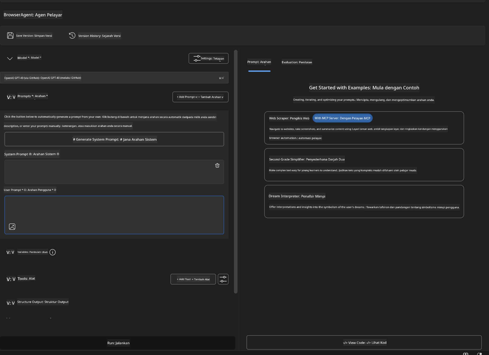

### 🔧 Fasa 2: Aliran Kerja Integrasi MCP

#### Langkah 3: Tambah Integrasi Pelayan MCP
1. **Pergi ke Bahagian Alat** dalam Agent Builder  
2. **Klik "Add Tool"** untuk membuka menu integrasi  
3. **Pilih "MCP Server"** dari pilihan yang ada  

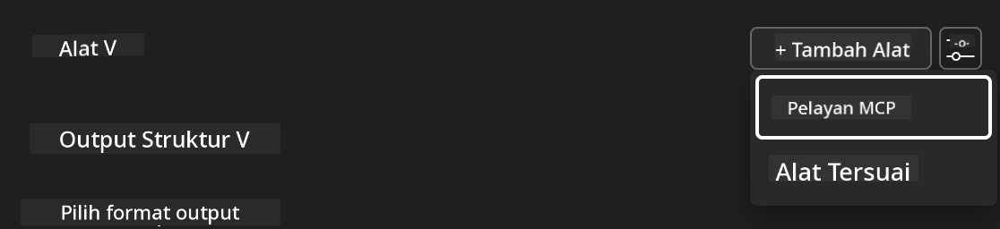

**🔍 Memahami Jenis Alat:**
- **Built-in Tools**: Fungsi AI Toolkit yang telah dikonfigurasi  
- **MCP Servers**: Integrasi perkhidmatan luaran  
- **Custom APIs**: Titik akhir perkhidmatan anda sendiri  
- **Function Calling**: Akses fungsi model secara langsung

#### Langkah 4: Pemilihan Pelayan MCP
1. **Pilih pilihan "MCP Server"** untuk meneruskan  
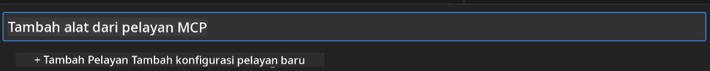

2. **Terokai Katalog MCP** untuk melihat integrasi yang tersedia  
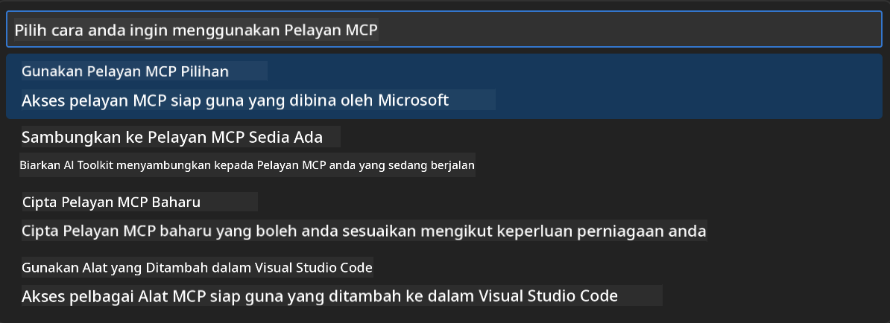

### 🎮 Fasa 3: Konfigurasi Playwright MCP

#### Langkah 5: Pilih dan Konfigurasikan Playwright
1. **Klik "Use Featured MCP Servers"** untuk akses pelayan Microsoft yang disahkan  
2. **Pilih "Playwright"** dari senarai pilihan  
3. **Terima MCP ID lalai** atau sesuaikan mengikut persekitaran anda  

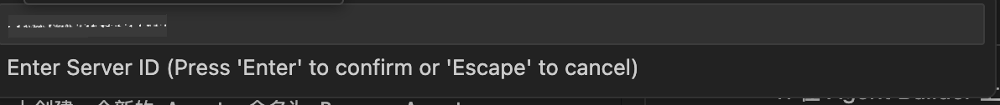

#### Langkah 6: Aktifkan Keupayaan Playwright
**🔑 Langkah Kritikal**: Pilih **SEMUA** kaedah Playwright yang tersedia untuk fungsi maksimum  

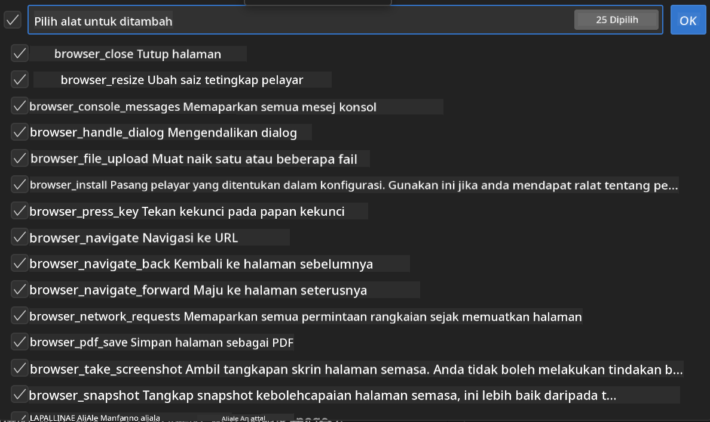

**🛠️ Alat Playwright Penting:**
- **Navigasi**: `goto`, `goBack`, `goForward`, `reload`  
- **Interaksi**: `click`, `fill`, `press`, `hover`, `drag`  
- **Ekstraksi**: `textContent`, `innerHTML`, `getAttribute`  
- **Pengesahan**: `isVisible`, `isEnabled`, `waitForSelector`  
- **Tangkap**: `screenshot`, `pdf`, `video`  
- **Rangkaian**: `setExtraHTTPHeaders`, `route`, `waitForResponse`

#### Langkah 7: Sahkan Kejayaan Integrasi
**✅ Petunjuk Kejayaan:**
- Semua alat muncul dalam antara muka Agent Builder  
- Tiada mesej ralat dalam panel integrasi  
- Status pelayan Playwright menunjukkan "Connected"  

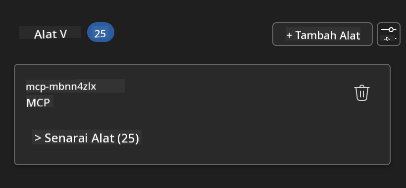

**🔧 Penyelesaian Masalah Lazim:**
- **Sambungan Gagal**: Semak sambungan internet dan tetapan firewall  
- **Alat Hilang**: Pastikan semua keupayaan dipilih semasa persediaan  
- **Ralat Kebenaran**: Sahkan VS Code mempunyai kebenaran sistem yang diperlukan

### 🎯 Fasa 4: Kejuruteraan Prompt Lanjutan

#### Langkah 8: Reka Prompt Sistem Pintar
Cipta prompt canggih yang memanfaatkan sepenuhnya keupayaan Playwright:

```markdown
# Web Automation Expert System Prompt

## Core Identity
You are an advanced web automation specialist with deep expertise in browser automation, web scraping, and user experience analysis. You have access to Playwright tools for comprehensive browser control.

## Capabilities & Approach
### Navigation Strategy
- Always start with screenshots to understand page layout
- Use semantic selectors (text content, labels) when possible
- Implement wait strategies for dynamic content
- Handle single-page applications (SPAs) effectively

### Error Handling
- Retry failed operations with exponential backoff
- Provide clear error descriptions and solutions
- Suggest alternative approaches when primary methods fail
- Always capture diagnostic screenshots on errors

### Data Extraction
- Extract structured data in JSON format when possible
- Provide confidence scores for extracted information
- Validate data completeness and accuracy
- Handle pagination and infinite scroll scenarios

### Reporting
- Include step-by-step execution logs
- Provide before/after screenshots for verification
- Suggest optimizations and alternative approaches
- Document any limitations or edge cases encountered

## Ethical Guidelines
- Respect robots.txt and rate limiting
- Avoid overloading target servers
- Only extract publicly available information
- Follow website terms of service
```

#### Langkah 9: Cipta Prompt Pengguna Dinamik
Reka prompt yang menunjukkan pelbagai keupayaan:

**🌐 Contoh Analisis Web:**  
```markdown
Navigate to github.com/kinfey and provide a comprehensive analysis including:
1. Repository structure and organization
2. Recent activity and contribution patterns  
3. Documentation quality assessment
4. Technology stack identification
5. Community engagement metrics
6. Notable projects and their purposes

Include screenshots at key steps and provide actionable insights.
```

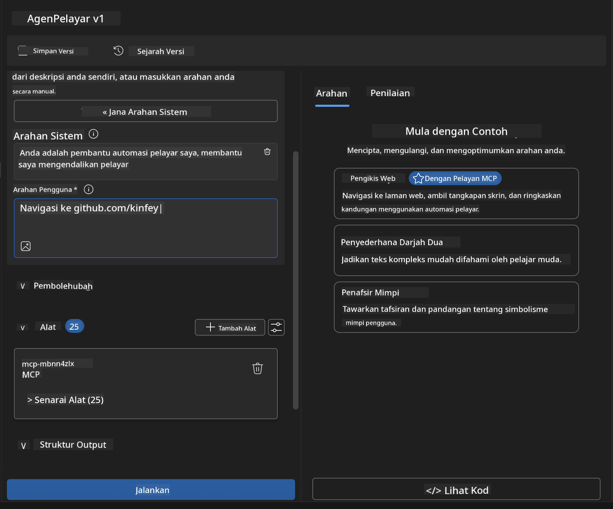

### 🚀 Fasa 5: Pelaksanaan dan Ujian

#### Langkah 10: Jalankan Automasi Pertama Anda
1. **Klik "Run"** untuk memulakan urutan automasi  
2. **Pantau Pelaksanaan Masa Nyata**:  
   - Pelayar Chrome dilancarkan secara automatik  
   - Ejen melayari laman web sasaran  
   - Tangkapan skrin diambil setiap langkah utama  
   - Keputusan analisis dipaparkan secara langsung  

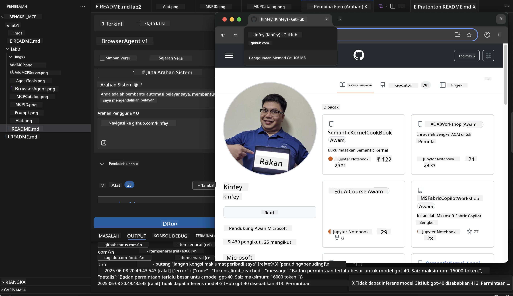

#### Langkah 11: Analisis Keputusan dan Wawasan
Semak analisis menyeluruh dalam antara muka Agent Builder:

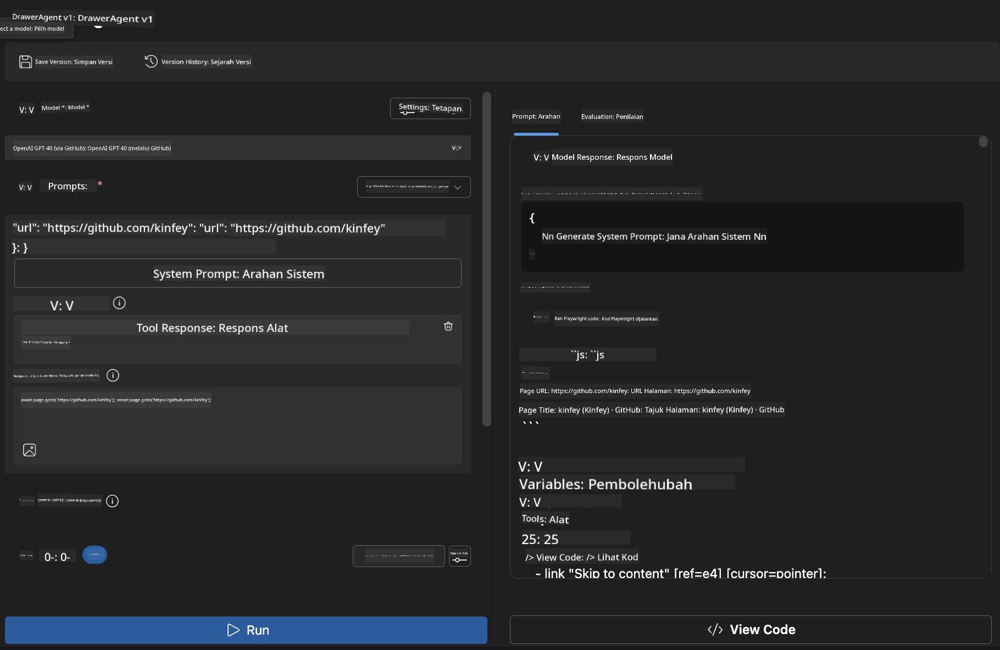

### 🌟 Fasa 6: Keupayaan Lanjutan dan Pelancaran

#### Langkah 12: Eksport dan Pelancaran Produksi
Agent Builder menyokong pelbagai pilihan pelancaran:

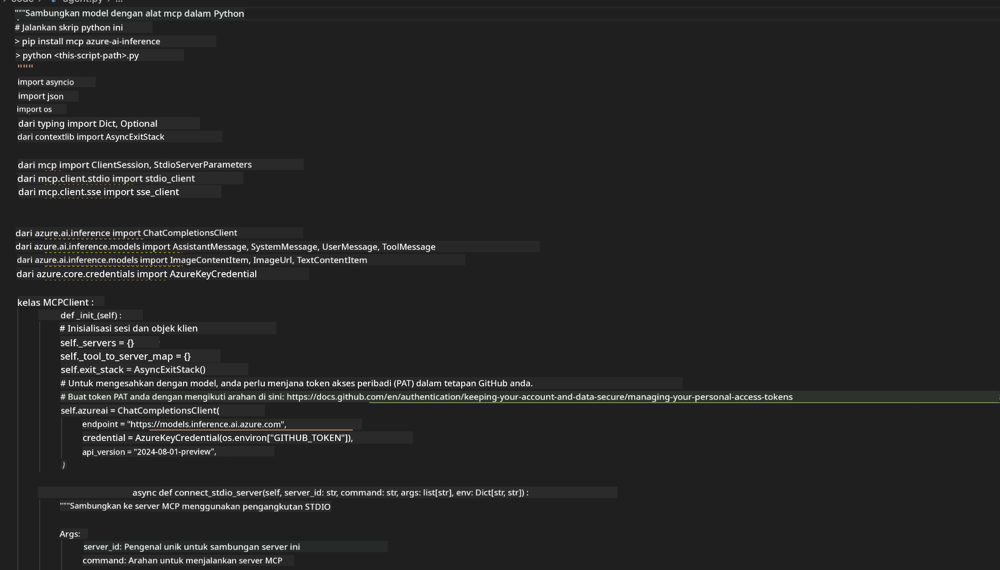

## 🎓 Ringkasan Modul 2 & Langkah Seterusnya

### 🏆 Pencapaian Dibuka: Pakar Integrasi MCP

**✅ Kemahiran Dikuasai:**
- [ ] Memahami seni bina dan manfaat MCP  
- [ ] Menavigasi ekosistem pelayan MCP Microsoft  
- [ ] Mengintegrasikan Playwright MCP dengan AI Toolkit  
- [ ] Membangun ejen automasi pelayar yang canggih  
- [ ] Kejuruteraan prompt lanjutan untuk automasi web

### 📚 Sumber Tambahan

- **🔗 Spesifikasi MCP**: [Dokumentasi Protokol Rasmi](https://modelcontextprotocol.io/)  
- **🛠️ API Playwright**: [Rujukan Kaedah Lengkap](https://playwright.dev/docs/api/class-playwright)  
- **🏢 Pelayan MCP Microsoft**: [Panduan Integrasi Perusahaan](https://github.com/microsoft/mcp-servers)  
- **🌍 Contoh Komuniti**: [Galeri Pelayan MCP](https://github.com/modelcontextprotocol/servers)

**🎉 Tahniah!** Anda telah berjaya menguasai integrasi MCP dan kini boleh membina ejen AI bersedia produksi dengan keupayaan alat luaran!

### 🔜 Teruskan ke Modul Seterusnya

Bersedia untuk meningkatkan kemahiran MCP anda? Teruskan ke **[Modul 3: Pembangunan MCP Lanjutan dengan AI Toolkit](../lab3/README.md)** di mana anda akan belajar cara untuk:
- Mencipta pelayan MCP tersuai anda sendiri  
- Mengkonfigurasi dan menggunakan SDK Python MCP terkini  
- Menyediakan MCP Inspector untuk debugging  
- Menguasai aliran kerja pembangunan pelayan MCP lanjutan
- Bina Pelayan MCP Cuaca dari awal

**Penafian**:  
Dokumen ini telah diterjemahkan menggunakan perkhidmatan terjemahan AI [Co-op Translator](https://github.com/Azure/co-op-translator). Walaupun kami berusaha untuk ketepatan, sila ambil maklum bahawa terjemahan automatik mungkin mengandungi kesilapan atau ketidaktepatan. Dokumen asal dalam bahasa asalnya harus dianggap sebagai sumber yang sahih. Untuk maklumat penting, terjemahan profesional oleh manusia adalah disyorkan. Kami tidak bertanggungjawab atas sebarang salah faham atau salah tafsir yang timbul daripada penggunaan terjemahan ini.