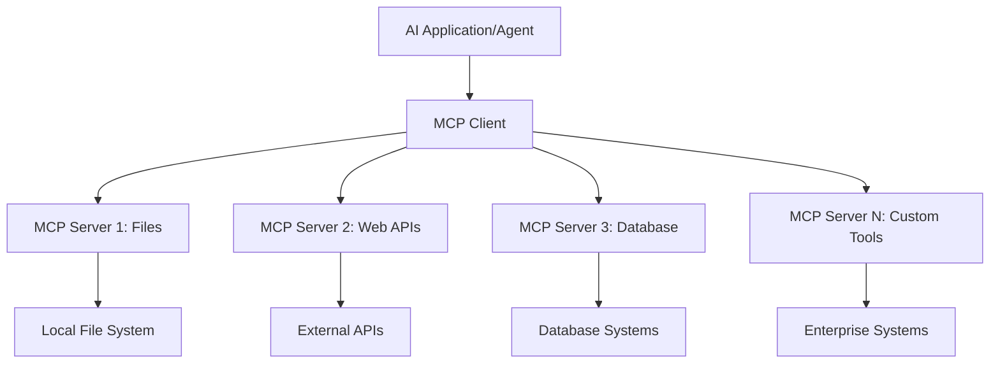

<!--
CO_OP_TRANSLATOR_METADATA:
{
  "original_hash": "a22b7dd11cd7690f99f9195877cafdc3",
  "translation_date": "2025-06-10T05:54:42+00:00",
  "source_file": "10-StreamliningAIWorkflowsBuildingAnMCPServerWithAIToolkit/lab2/README.md",
  "language_code": "ms"
}
-->
# 🌐 Module 2: MCP עם יסודות AI Toolkit

[]()
[]()
[]()

## 📋 מטרות הלמידה

בסיום המודול הזה, תוכלו:
- ✅ להבין את ארכיטקטורת Model Context Protocol (MCP) ואת יתרונותיה
- ✅ להכיר את מערך שרתי MCP של מיקרוסופט
- ✅ לשלב שרתי MCP עם AI Toolkit Agent Builder
- ✅ לבנות סוכן אוטומציה לדפדפן עובד באמצעות Playwright MCP
- ✅ להגדיר ולבדוק כלי MCP בתוך הסוכנים שלכם
- ✅ לייצא ולפרוס סוכני MCP לשימוש בייצור

## 🎯 המשך למודול 1

במודול 1 רכשנו את יסודות AI Toolkit ויצרנו את הסוכן הראשון שלנו בפייתון. עכשיו נוכל **להעצים** את הסוכנים שלכם על ידי חיבורם לכלים ושירותים חיצוניים דרך פרוטוקול מהפכני בשם **Model Context Protocol (MCP)**.

תחשבו על זה כמו שדרוג ממחשבון פשוט למחשב מלא – לסוכני ה-AI שלכם תהיה היכולת:
- 🌐 לגלוש ולהתממשק עם אתרי אינטרנט
- 📁 לגשת ולנהל קבצים
- 🔧 להשתלב עם מערכות ארגוניות
- 📊 לעבד נתונים בזמן אמת מ-APIs

## 🧠 הבנת Model Context Protocol (MCP)

### 🔍 מהו MCP?

Model Context Protocol (MCP) הוא ה"USB-C של יישומי AI" – תקן פתוח מהפכני שמחבר מודלים שפתיים גדולים (LLMs) לכלים חיצוניים, מקורות נתונים ושירותים. בדיוק כמו ש-USB-C פתר את בעיית הכבלים עם מחבר אוניברסלי אחד, כך MCP מפשט את האינטגרציה של AI עם פרוטוקול סטנדרטי אחד.

### 🎯 הבעיה ש-MCP פותר

**לפני MCP:**
- 🔧 אינטגרציות מותאמות לכל כלי
- 🔄 נעילה לספקים עם פתרונות קנייניים  
- 🔒 פגיעויות אבטחה מחיבורים לא מבוקרים
- ⏱️ פיתוח של חודשים לאינטגרציות בסיסיות

**עם MCP:**
- ⚡ אינטגרציה של כלים בהכנסה מהירה
- 🔄 ארכיטקטורה בלתי תלויה בספקים
- 🛡️ אבטחה מובנית לפי מיטב הנוהגים
- 🚀 הוספת יכולות תוך דקות

### 🏗️ מבט מעמיק על ארכיטקטורת MCP

MCP פועל על ארכיטקטורת **לקוח-שרת** היוצרת מערכת מאובטחת וסקלאבילית:



**🔧 רכיבים מרכזיים:**

| רכיב | תפקיד | דוגמאות |
|-----------|------|----------|
| **MCP Hosts** | אפליקציות שצורכות שירותי MCP | Claude Desktop, VS Code, AI Toolkit |
| **MCP Clients** | מטפלי הפרוטוקול (1:1 עם שרתים) | משולבים באפליקציות המארחות |
| **MCP Servers** | חושפים יכולות דרך פרוטוקול סטנדרטי | Playwright, Files, Azure, GitHub |
| **שכבת תקשורת** | שיטות תקשורת | stdio, HTTP, WebSockets |


## 🏢 מערך שרתי MCP של מיקרוסופט

מיקרוסופט מובילה את מערך MCP עם חבילת שרתים ארגוניים מקיפה שמטפלת בצרכי עסקים אמיתיים.

### 🌟 שרתי MCP מובילים של מיקרוסופט

#### 1. ☁️ Azure MCP Server
**🔗 מאגר קוד**: [azure/azure-mcp](https://github.com/azure/azure-mcp)
**🎯 מטרה**: ניהול משאבי Azure מקיף עם אינטגרציה ל-AI

**✨ תכונות מרכזיות:**
- פרוביזיה דקלרטיבית של תשתיות
- ניטור משאבים בזמן אמת
- המלצות לאופטימיזציה של עלויות
- בדיקת תאימות אבטחה

**🚀 מקרי שימוש:**
- תשתית כקוד עם סיוע AI
- קנה מידה אוטומטי של משאבים
- אופטימיזציה של עלויות ענן
- אוטומציה של תהליכי DevOps

#### 2. 📊 Microsoft Dataverse MCP
**📚 תיעוד**: [Microsoft Dataverse Integration](https://go.microsoft.com/fwlink/?linkid=2320176)
**🎯 מטרה**: ממשק שפה טבעית לנתוני עסקים

**✨ תכונות מרכזיות:**
- שאילתות מסדי נתונים בשפה טבעית
- הבנת הקשר עסקי
- תבניות פרומפט מותאמות אישית
- ממשל נתונים ארגוני

**🚀 מקרי שימוש:**
- דיווח בינה עסקית
- ניתוח נתוני לקוחות
- תובנות צינור מכירות
- שאילתות תאימות ורגולציה

#### 3. 🌐 Playwright MCP Server
**🔗 מאגר קוד**: [microsoft/playwright-mcp](https://github.com/microsoft/playwright-mcp)
**🎯 מטרה**: אוטומציה בדפדפן ויכולות אינטראקציה עם רשת

**✨ תכונות מרכזיות:**
- אוטומציה חוצת דפדפנים (Chrome, Firefox, Safari)
- זיהוי אלמנטים חכם
- יצירת צילומי מסך ו-PDF
- ניטור תעבורת רשת

**🚀 מקרי שימוש:**
- אוטומציה של תהליכי בדיקה
- גרידת אתרים וחילוץ נתונים
- ניטור UI/UX
- אוטומציה לניתוח תחרות

#### 4. 📁 Files MCP Server
**🔗 מאגר קוד**: [microsoft/files-mcp-server](https://github.com/microsoft/files-mcp-server)
**🎯 מטרה**: פעולות חכמות על מערכת הקבצים

**✨ תכונות מרכזיות:**
- ניהול קבצים דקלרטיבי
- סנכרון תוכן
- אינטגרציה עם בקרת גרסאות
- חילוץ מטה-דאטה

**🚀 מקרי שימוש:**
- ניהול תיעוד
- ארגון מאגרי קוד
- תהליכי פרסום תוכן
- טיפול בקבצים לצינורות נתונים

#### 5. 📝 MarkItDown MCP Server
**🔗 מאגר קוד**: [microsoft/markitdown](https://github.com/microsoft/markitdown)
**🎯 מטרה**: עיבוד מתקדם של Markdown

**✨ תכונות מרכזיות:**
- ניתוח Markdown עשיר
- המרת פורמטים (MD ↔ HTML ↔ PDF)
- ניתוח מבנה תוכן
- עיבוד תבניות

**🚀 מקרי שימוש:**
- תהליכי תיעוד טכני
- מערכות ניהול תוכן
- יצירת דוחות
- אוטומציה של בסיסי ידע

#### 6. 📈 Clarity MCP Server
**📦 חבילה**: [@microsoft/clarity-mcp-server](https://www.npmjs.com/package/@microsoft/clarity-mcp-server)
**🎯 מטרה**: ניתוח אינטרנט והתנהגות משתמשים

**✨ תכונות מרכזיות:**
- ניתוח מפות חום
- הקלטות מושבי משתמשים
- מדדי ביצועים
- ניתוח משפכי המרה

**🚀 מקרי שימוש:**
- אופטימיזציה של אתרים
- מחקר חוויית משתמש
- ניתוח A/B Testing
- לוחות מחוונים לבינה עסקית

### 🌍 קהילת MCP

מעבר לשרתי מיקרוסופט, מערך MCP כולל:
- **🐙 GitHub MCP**: ניהול מאגרים וניתוח קוד
- **🗄️ Database MCPs**: אינטגרציות ל-PostgreSQL, MySQL, MongoDB
- **☁️ Cloud Provider MCPs**: כלים ל-AWS, GCP, Digital Ocean
- **📧 Communication MCPs**: אינטגרציות ל-Slack, Teams, Email

## 🛠️ מעבדה מעשית: בניית סוכן אוטומציה לדפדפן

**🎯 מטרה בפרויקט**: ליצור סוכן אוטומציה חכם לדפדפן באמצעות שרת Playwright MCP שיכול לנווט באתרים, לחלץ מידע ולבצע אינטראקציות מורכבות ברשת.

### 🚀 שלב 1: הקמת בסיס הסוכן

#### שלב 1: אתחול הסוכן
1. **פתח את AI Toolkit Agent Builder**
2. **צור סוכן חדש** עם התצורה הבאה:
   - **שם**: `BrowserAgent`
   - **Model**: Choose GPT-4o 


### 🔧 Phase 2: MCP Integration Workflow

#### Step 3: Add MCP Server Integration
1. **Navigate to Tools Section** in Agent Builder
2. **Click "Add Tool"** to open the integration menu
3. **Select "MCP Server"** from available options


**🔍 Understanding Tool Types:**
- **Built-in Tools**: Pre-configured AI Toolkit functions
- **MCP Servers**: External service integrations
- **Custom APIs**: Your own service endpoints
- **Function Calling**: Direct model function access

#### Step 4: MCP Server Selection
1. **Choose "MCP Server"** option to proceed


2. **Browse MCP Catalog** to explore available integrations


### 🎮 Phase 3: Playwright MCP Configuration

#### Step 5: Select and Configure Playwright
1. **Click "Use Featured MCP Servers"** to access Microsoft's verified servers
2. **Select "Playwright"** from the featured list
3. **Accept Default MCP ID** or customize for your environment


#### Step 6: Enable Playwright Capabilities
**🔑 Critical Step**: Select **ALL** available Playwright methods for maximum functionality


**🛠️ Essential Playwright Tools:**
- **Navigation**: `goto`, `goBack`, `goForward`, `reload`
- **Interaction**: `click`, `fill`, `press`, `hover`, `drag`
- **Extraction**: `textContent`, `innerHTML`, `getAttribute`
- **Validation**: `isVisible`, `isEnabled`, `waitForSelector`
- **Capture**: `screenshot`, `pdf`, `video`
- **Network**: `setExtraHTTPHeaders`, `route`, `waitForResponse`

#### שלב 7: אימות הצלחת האינטגרציה
**✅ אינדיקטורים להצלחה:**
- כל הכלים מופיעים בממשק Agent Builder
- אין הודעות שגיאה בלוח האינטגרציה
- סטטוס שרת Playwright מציג "Connected"


**🔧 פתרון תקלות נפוצות:**
- **כשל חיבור**: בדוק את חיבור האינטרנט והגדרות חומת האש
- **כלים חסרים**: ודא שכל היכולות נבחרו במהלך ההגדרה
- **שגיאות הרשאה**: וודא של-VS Code יש הרשאות מערכת נדרשות

### 🎯 שלב 4: הנדסת פרומפטים מתקדמת

#### שלב 8: עיצוב פרומפטים חכמים למערכת
צרו פרומפטים מתוחכמים המנצלים את כל יכולות Playwright:

```markdown
# Web Automation Expert System Prompt

## Core Identity
You are an advanced web automation specialist with deep expertise in browser automation, web scraping, and user experience analysis. You have access to Playwright tools for comprehensive browser control.

## Capabilities & Approach
### Navigation Strategy
- Always start with screenshots to understand page layout
- Use semantic selectors (text content, labels) when possible
- Implement wait strategies for dynamic content
- Handle single-page applications (SPAs) effectively

### Error Handling
- Retry failed operations with exponential backoff
- Provide clear error descriptions and solutions
- Suggest alternative approaches when primary methods fail
- Always capture diagnostic screenshots on errors

### Data Extraction
- Extract structured data in JSON format when possible
- Provide confidence scores for extracted information
- Validate data completeness and accuracy
- Handle pagination and infinite scroll scenarios

### Reporting
- Include step-by-step execution logs
- Provide before/after screenshots for verification
- Suggest optimizations and alternative approaches
- Document any limitations or edge cases encountered

## Ethical Guidelines
- Respect robots.txt and rate limiting
- Avoid overloading target servers
- Only extract publicly available information
- Follow website terms of service
```

#### שלב 9: יצירת פרומפטים דינמיים למשתמש
עצבו פרומפטים המדגימים יכולות שונות:

**🌐 דוגמה לניתוח אתרים:**
```markdown
Navigate to github.com/kinfey and provide a comprehensive analysis including:
1. Repository structure and organization
2. Recent activity and contribution patterns  
3. Documentation quality assessment
4. Technology stack identification
5. Community engagement metrics
6. Notable projects and their purposes

Include screenshots at key steps and provide actionable insights.
```


### 🚀 שלב 5: ביצוע ובדיקות

#### שלב 10: הפעלת האוטומציה הראשונה שלך
1. **לחץ על "Run"** כדי להפעיל את רצף האוטומציה
2. **עקוב אחרי ביצוע בזמן אמת**:
   - דפדפן Chrome נפתח אוטומטית
   - הסוכן מנווט לאתר היעד
   - צילומי מסך מתועדים בכל שלב מרכזי
   - תוצאות הניתוח מוזרמות בזמן אמת


#### שלב 11: ניתוח תוצאות ותובנות
סקור ניתוחים מקיפים בממשק Agent Builder:


### 🌟 שלב 6: יכולות מתקדמות ופריסה

#### שלב 12: ייצוא ופריסה לייצור
Agent Builder תומך באפשרויות פריסה רבות:


## 🎓 סיכום מודול 2 ושלבים הבאים

### 🏆 הישג נפתח: שליט באינטגרציית MCP

**✅ מיומנויות שנרכשו:**
- [ ] הבנת ארכיטקטורת MCP ויתרונותיה
- [ ] ניווט במערך שרתי MCP של מיקרוסופט
- [ ] שילוב Playwright MCP עם AI Toolkit
- [ ] בניית סוכני אוטומציה לדפדפן מתקדמים
- [ ] הנדסת פרומפטים מתקדמת לאוטומציה ברשת

### 📚 משאבים נוספים

- **🔗 מפרט MCP**: [מסמכי הפרוטוקול הרשמיים](https://modelcontextprotocol.io/)
- **🛠️ API של Playwright**: [מדריך שיטות מלא](https://playwright.dev/docs/api/class-playwright)
- **🏢 שרתי MCP של מיקרוסופט**: [מדריך אינטגרציה ארגוני](https://github.com/microsoft/mcp-servers)
- **🌍 דוגמאות קהילתיות**: [גלריית שרתי MCP](https://github.com/modelcontextprotocol/servers)

**🎉 מזל טוב!** שלטתם בהצלחה באינטגרציית MCP וכעת תוכלו לבנות סוכני AI מוכנים לייצור עם יכולות כלים חיצוניים!


### 🔜 המשך למודול הבא

רוצים לקחת את כישורי ה-MCP שלכם לשלב הבא? עברו ל-**[מודול 3: פיתוח MCP מתקדם עם AI Toolkit](../lab3/README.md)** שם תלמדו איך:
- ליצור שרתי MCP מותאמים אישית
- להגדיר ולהשתמש ב-SDK החדש ביותר של MCP לפייתון
- להקים את MCP Inspector לצורך איתור תקלות
- לשלוט בתהליכי פיתוח מתקדמים לשרת MCP
- לבנות שרת Weather MCP מאפס

**Penafian**:  
Dokumen ini telah diterjemahkan menggunakan perkhidmatan terjemahan AI [Co-op Translator](https://github.com/Azure/co-op-translator). Walaupun kami berusaha untuk ketepatan, sila ambil perhatian bahawa terjemahan automatik mungkin mengandungi kesilapan atau ketidaktepatan. Dokumen asal dalam bahasa asalnya harus dianggap sebagai sumber yang sahih. Untuk maklumat penting, terjemahan profesional oleh manusia adalah disyorkan. Kami tidak bertanggungjawab atas sebarang salah faham atau salah tafsir yang timbul daripada penggunaan terjemahan ini.