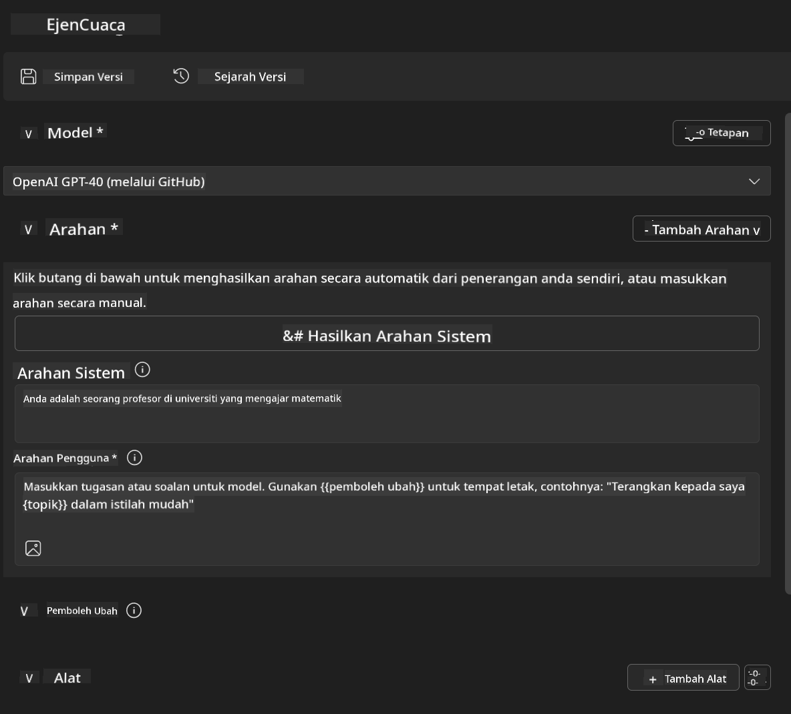
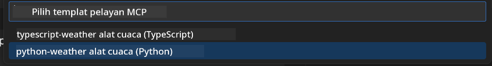
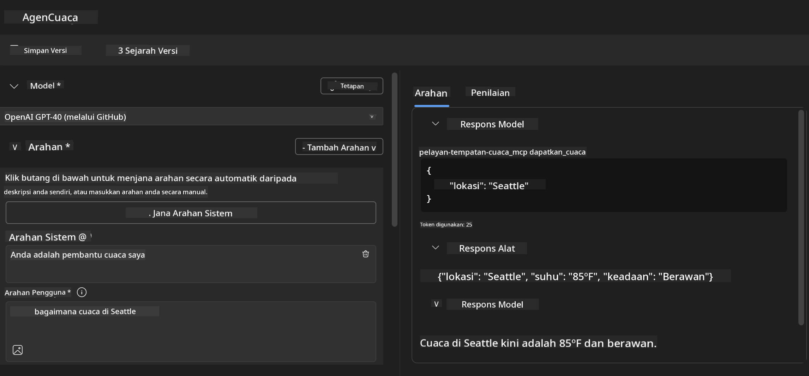
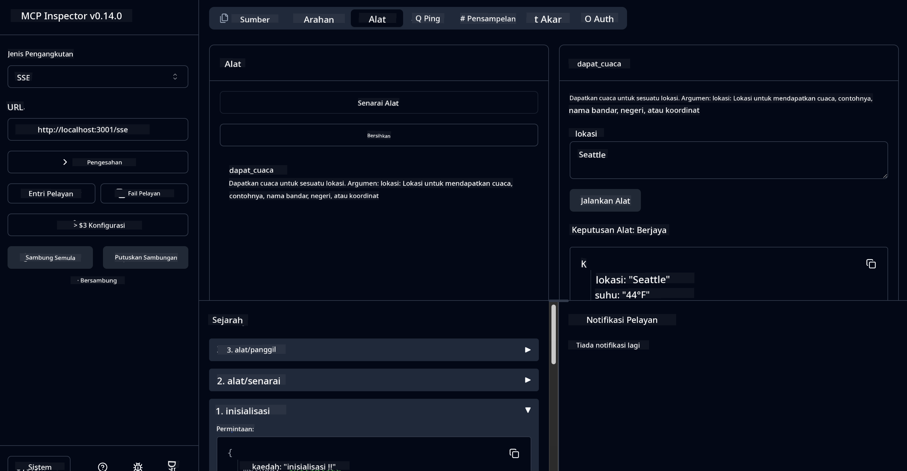

<!--
CO_OP_TRANSLATOR_METADATA:
{
  "original_hash": "dd8da3f75addcef453fe11f02a270217",
  "translation_date": "2025-07-14T08:17:17+00:00",
  "source_file": "10-StreamliningAIWorkflowsBuildingAnMCPServerWithAIToolkit/lab3/README.md",
  "language_code": "ms"
}
-->
# 🔧 Modul 3: Pembangunan MCP Lanjutan dengan AI Toolkit


## 🎯 Objektif Pembelajaran

Menjelang akhir makmal ini, anda akan dapat:

- ✅ Membina pelayan MCP tersuai menggunakan AI Toolkit
- ✅ Mengkonfigurasi dan menggunakan MCP Python SDK terkini (v1.9.3)
- ✅ Menyediakan dan menggunakan MCP Inspector untuk penyahpepijatan
- ✅ Menyahpepijat pelayan MCP dalam persekitaran Agent Builder dan Inspector
- ✅ Memahami aliran kerja pembangunan pelayan MCP lanjutan

## 📋 Prasyarat

- Menyelesaikan Makmal 2 (Asas MCP)
- VS Code dengan sambungan AI Toolkit dipasang
- Persekitaran Python 3.10+
- Node.js dan npm untuk penyediaan Inspector

## 🏗️ Apa Yang Akan Anda Bina

Dalam makmal ini, anda akan membina **Pelayan MCP Cuaca** yang menunjukkan:
- Pelaksanaan pelayan MCP tersuai
- Integrasi dengan AI Toolkit Agent Builder
- Aliran kerja penyahpepijatan profesional
- Corak penggunaan SDK MCP moden

---

## 🔧 Gambaran Keseluruhan Komponen Teras

### 🐍 MCP Python SDK
Model Context Protocol Python SDK menyediakan asas untuk membina pelayan MCP tersuai. Anda akan menggunakan versi 1.9.3 dengan keupayaan penyahpepijatan yang dipertingkatkan.

### 🔍 MCP Inspector
Alat penyahpepijatan yang kuat yang menyediakan:
- Pemantauan pelayan masa nyata
- Visualisasi pelaksanaan alat
- Pemeriksaan permintaan/respons rangkaian
- Persekitaran ujian interaktif

---

## 📖 Pelaksanaan Langkah demi Langkah

### Langkah 1: Cipta WeatherAgent dalam Agent Builder

1. **Lancarkan Agent Builder** dalam VS Code melalui sambungan AI Toolkit
2. **Cipta agen baru** dengan konfigurasi berikut:
   - Nama Agen: `WeatherAgent`



### Langkah 2: Mulakan Projek Pelayan MCP

1. **Pergi ke Tools** → **Add Tool** dalam Agent Builder
2. **Pilih "MCP Server"** daripada pilihan yang ada
3. **Pilih "Create A new MCP Server"**
4. **Pilih templat `python-weather`**
5. **Namakan pelayan anda:** `weather_mcp`



### Langkah 3: Buka dan Semak Projek

1. **Buka projek yang dijana** dalam VS Code
2. **Semak struktur projek:**
   ```
   weather_mcp/
   ├── src/
   │   ├── __init__.py
   │   └── server.py
   ├── inspector/
   │   ├── package.json
   │   └── package-lock.json
   ├── .vscode/
   │   ├── launch.json
   │   └── tasks.json
   ├── pyproject.toml
   └── README.md
   ```

### Langkah 4: Kemas Kini ke MCP SDK Terkini

> **🔍 Kenapa Kemas Kini?** Kami ingin menggunakan MCP SDK terkini (v1.9.3) dan perkhidmatan Inspector (0.14.0) untuk ciri yang dipertingkatkan dan keupayaan penyahpepijatan yang lebih baik.

#### 4a. Kemas Kini Kebergantungan Python

**Sunting `pyproject.toml`:** kemas kini [./code/weather_mcp/pyproject.toml](../../../../10-StreamliningAIWorkflowsBuildingAnMCPServerWithAIToolkit/lab3/code/weather_mcp/pyproject.toml)

#### 4b. Kemas Kini Konfigurasi Inspector

**Sunting `inspector/package.json`:** kemas kini [./code/weather_mcp/inspector/package.json](../../../../10-StreamliningAIWorkflowsBuildingAnMCPServerWithAIToolkit/lab3/code/weather_mcp/inspector/package.json)

#### 4c. Kemas Kini Kebergantungan Inspector

**Sunting `inspector/package-lock.json`:** kemas kini [./code/weather_mcp/inspector/package-lock.json](../../../../10-StreamliningAIWorkflowsBuildingAnMCPServerWithAIToolkit/lab3/code/weather_mcp/inspector/package-lock.json)

> **📝 Nota:** Fail ini mengandungi definisi kebergantungan yang luas. Di bawah adalah struktur penting - kandungan penuh memastikan penyelesaian kebergantungan yang betul.

> **⚡ Pakej Lock Penuh:** Fail package-lock.json penuh mengandungi ~3000 baris definisi kebergantungan. Di atas menunjukkan struktur utama - gunakan fail yang disediakan untuk penyelesaian kebergantungan lengkap.

### Langkah 5: Konfigurasi Penyahpepijatan VS Code

*Nota: Sila salin fail dalam laluan yang ditetapkan untuk menggantikan fail tempatan yang sepadan*

#### 5a. Kemas Kini Konfigurasi Pelancaran

**Sunting `.vscode/launch.json`:**

```json
{
  "version": "0.2.0",
  "configurations": [
    {
      "name": "Attach to Local MCP",
      "type": "debugpy",
      "request": "attach",
      "connect": {
        "host": "localhost",
        "port": 5678
      },
      "presentation": {
        "hidden": true
      },
      "internalConsoleOptions": "neverOpen",
      "postDebugTask": "Terminate All Tasks"
    },
    {
      "name": "Launch Inspector (Edge)",
      "type": "msedge",
      "request": "launch",
      "url": "http://localhost:6274?timeout=60000&serverUrl=http://localhost:3001/sse#tools",
      "cascadeTerminateToConfigurations": [
        "Attach to Local MCP"
      ],
      "presentation": {
        "hidden": true
      },
      "internalConsoleOptions": "neverOpen"
    },
    {
      "name": "Launch Inspector (Chrome)",
      "type": "chrome",
      "request": "launch",
      "url": "http://localhost:6274?timeout=60000&serverUrl=http://localhost:3001/sse#tools",
      "cascadeTerminateToConfigurations": [
        "Attach to Local MCP"
      ],
      "presentation": {
        "hidden": true
      },
      "internalConsoleOptions": "neverOpen"
    }
  ],
  "compounds": [
    {
      "name": "Debug in Agent Builder",
      "configurations": [
        "Attach to Local MCP"
      ],
      "preLaunchTask": "Open Agent Builder",
    },
    {
      "name": "Debug in Inspector (Edge)",
      "configurations": [
        "Launch Inspector (Edge)",
        "Attach to Local MCP"
      ],
      "preLaunchTask": "Start MCP Inspector",
      "stopAll": true
    },
    {
      "name": "Debug in Inspector (Chrome)",
      "configurations": [
        "Launch Inspector (Chrome)",
        "Attach to Local MCP"
      ],
      "preLaunchTask": "Start MCP Inspector",
      "stopAll": true
    }
  ]
}
```

**Sunting `.vscode/tasks.json`:**

```
{
  "version": "2.0.0",
  "tasks": [
    {
      "label": "Start MCP Server",
      "type": "shell",
      "command": "python -m debugpy --listen 127.0.0.1:5678 src/__init__.py sse",
      "isBackground": true,
      "options": {
        "cwd": "${workspaceFolder}",
        "env": {
          "PORT": "3001"
        }
      },
      "problemMatcher": {
        "pattern": [
          {
            "regexp": "^.*$",
            "file": 0,
            "location": 1,
            "message": 2
          }
        ],
        "background": {
          "activeOnStart": true,
          "beginsPattern": ".*",
          "endsPattern": "Application startup complete|running"
        }
      }
    },
    {
      "label": "Start MCP Inspector",
      "type": "shell",
      "command": "npm run dev:inspector",
      "isBackground": true,
      "options": {
        "cwd": "${workspaceFolder}/inspector",
        "env": {
          "CLIENT_PORT": "6274",
          "SERVER_PORT": "6277",
        }
      },
      "problemMatcher": {
        "pattern": [
          {
            "regexp": "^.*$",
            "file": 0,
            "location": 1,
            "message": 2
          }
        ],
        "background": {
          "activeOnStart": true,
          "beginsPattern": "Starting MCP inspector",
          "endsPattern": "Proxy server listening on port"
        }
      },
      "dependsOn": [
        "Start MCP Server"
      ]
    },
    {
      "label": "Open Agent Builder",
      "type": "shell",
      "command": "echo ${input:openAgentBuilder}",
      "presentation": {
        "reveal": "never"
      },
      "dependsOn": [
        "Start MCP Server"
      ],
    },
    {
      "label": "Terminate All Tasks",
      "command": "echo ${input:terminate}",
      "type": "shell",
      "problemMatcher": []
    }
  ],
  "inputs": [
    {
      "id": "openAgentBuilder",
      "type": "command",
      "command": "ai-mlstudio.agentBuilder",
      "args": {
        "initialMCPs": [ "local-server-weather_mcp" ],
        "triggeredFrom": "vsc-tasks"
      }
    },
    {
      "id": "terminate",
      "type": "command",
      "command": "workbench.action.tasks.terminate",
      "args": "terminateAll"
    }
  ]
}
```

---

## 🚀 Menjalankan dan Menguji Pelayan MCP Anda

### Langkah 6: Pasang Kebergantungan

Selepas membuat perubahan konfigurasi, jalankan arahan berikut:

**Pasang kebergantungan Python:**
```bash
uv sync
```

**Pasang kebergantungan Inspector:**
```bash
cd inspector
npm install
```

### Langkah 7: Nyahpepijat dengan Agent Builder

1. **Tekan F5** atau gunakan konfigurasi **"Debug in Agent Builder"**
2. **Pilih konfigurasi gabungan** dari panel debug
3. **Tunggu pelayan bermula** dan Agent Builder dibuka
4. **Uji pelayan MCP cuaca anda** dengan pertanyaan bahasa semula jadi

Masukkan arahan seperti ini

SYSTEM_PROMPT

```
You are my weather assistant
```

USER_PROMPT

```
How's the weather like in Seattle
```



### Langkah 8: Nyahpepijat dengan MCP Inspector

1. **Gunakan konfigurasi "Debug in Inspector"** (Edge atau Chrome)
2. **Buka antara muka Inspector** di `http://localhost:6274`
3. **Terokai persekitaran ujian interaktif:**
   - Lihat alat yang tersedia
   - Uji pelaksanaan alat
   - Pantau permintaan rangkaian
   - Nyahpepijat respons pelayan



---

## 🎯 Hasil Pembelajaran Utama

Dengan menyelesaikan makmal ini, anda telah:

- [x] **Membina pelayan MCP tersuai** menggunakan templat AI Toolkit
- [x] **Mengemas kini ke MCP SDK terkini** (v1.9.3) untuk fungsi yang dipertingkatkan
- [x] **Mengkonfigurasi aliran kerja penyahpepijatan profesional** untuk Agent Builder dan Inspector
- [x] **Menyediakan MCP Inspector** untuk ujian pelayan interaktif
- [x] **Menguasai konfigurasi penyahpepijatan VS Code** untuk pembangunan MCP

## 🔧 Ciri Lanjutan yang Diterokai

| Ciri | Penerangan | Kes Penggunaan |
|---------|-------------|----------|
| **MCP Python SDK v1.9.3** | Pelaksanaan protokol terkini | Pembangunan pelayan moden |
| **MCP Inspector 0.14.0** | Alat penyahpepijatan interaktif | Ujian pelayan masa nyata |
| **Penyahpepijatan VS Code** | Persekitaran pembangunan bersepadu | Aliran kerja penyahpepijatan profesional |
| **Integrasi Agent Builder** | Sambungan terus AI Toolkit | Ujian agen hujung ke hujung |

## 📚 Sumber Tambahan

- [Dokumentasi MCP Python SDK](https://modelcontextprotocol.io/docs/sdk/python)
- [Panduan Sambungan AI Toolkit](https://code.visualstudio.com/docs/ai/ai-toolkit)
- [Dokumentasi Penyahpepijatan VS Code](https://code.visualstudio.com/docs/editor/debugging)
- [Spesifikasi Model Context Protocol](https://modelcontextprotocol.io/docs/concepts/architecture)

---

**🎉 Tahniah!** Anda telah berjaya menyelesaikan Makmal 3 dan kini boleh membina, nyahpepijat, dan mengedar pelayan MCP tersuai menggunakan aliran kerja pembangunan profesional.

### 🔜 Teruskan ke Modul Seterusnya

Bersedia untuk menggunakan kemahiran MCP anda dalam aliran kerja pembangunan sebenar? Teruskan ke **[Modul 4: Pembangunan MCP Praktikal - Pelayan Klon GitHub Tersuai](../lab4/README.md)** di mana anda akan:
- Membina pelayan MCP yang sedia untuk produksi yang mengautomasikan operasi repositori GitHub
- Melaksanakan fungsi klon repositori GitHub melalui MCP
- Mengintegrasikan pelayan MCP tersuai dengan VS Code dan Mod Agen GitHub Copilot
- Menguji dan mengedar pelayan MCP tersuai dalam persekitaran produksi
- Mempelajari automasi aliran kerja praktikal untuk pembangun

**Penafian**:  
Dokumen ini telah diterjemahkan menggunakan perkhidmatan terjemahan AI [Co-op Translator](https://github.com/Azure/co-op-translator). Walaupun kami berusaha untuk ketepatan, sila ambil perhatian bahawa terjemahan automatik mungkin mengandungi kesilapan atau ketidaktepatan. Dokumen asal dalam bahasa asalnya harus dianggap sebagai sumber yang sahih. Untuk maklumat penting, terjemahan profesional oleh manusia adalah disyorkan. Kami tidak bertanggungjawab atas sebarang salah faham atau salah tafsir yang timbul daripada penggunaan terjemahan ini.