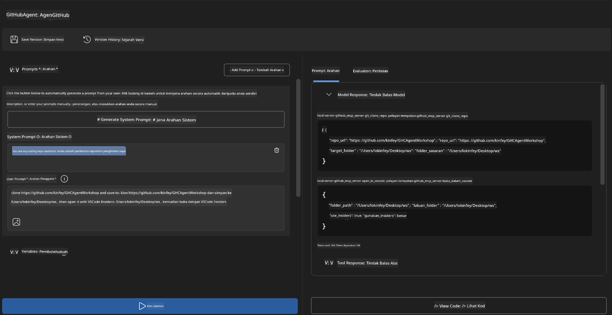
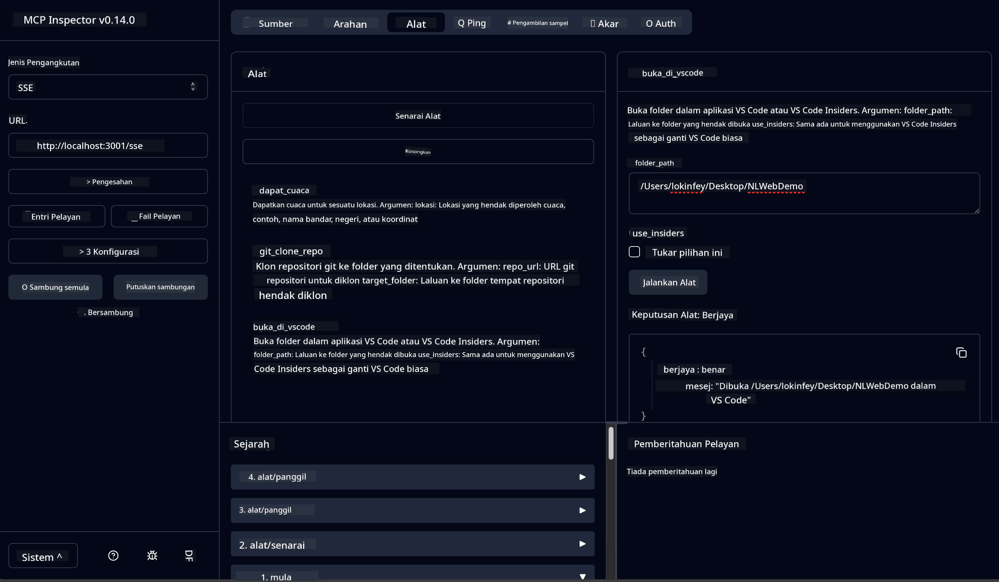

<!--
CO_OP_TRANSLATOR_METADATA:
{
  "original_hash": "f83bc722dc758efffd68667d6a1db470",
  "translation_date": "2025-07-14T08:45:24+00:00",
  "source_file": "10-StreamliningAIWorkflowsBuildingAnMCPServerWithAIToolkit/lab4/README.md",
  "language_code": "ms"
}
-->
# 🐙 Modul 4: Pembangunan MCP Praktikal - Pelayan Klon GitHub Tersuai


> **⚡ Mula Cepat:** Bina pelayan MCP yang sedia untuk produksi yang mengautomasikan klon repositori GitHub dan integrasi VS Code dalam hanya 30 minit!

## 🎯 Objektif Pembelajaran

Menjelang akhir makmal ini, anda akan dapat:

- ✅ Mewujudkan pelayan MCP tersuai untuk aliran kerja pembangunan dunia sebenar
- ✅ Melaksanakan fungsi klon repositori GitHub melalui MCP
- ✅ Mengintegrasikan pelayan MCP tersuai dengan VS Code dan Agent Builder
- ✅ Menggunakan GitHub Copilot Agent Mode dengan alat MCP tersuai
- ✅ Menguji dan melancarkan pelayan MCP tersuai dalam persekitaran produksi

## 📋 Prasyarat

- Menyelesaikan Makmal 1-3 (asas MCP dan pembangunan lanjutan)
- Langganan GitHub Copilot ([pendaftaran percuma tersedia](https://github.com/github-copilot/signup))
- VS Code dengan sambungan AI Toolkit dan GitHub Copilot
- Git CLI dipasang dan dikonfigurasi

## 🏗️ Gambaran Projek

### **Cabaran Pembangunan Dunia Sebenar**
Sebagai pembangun, kita sering menggunakan GitHub untuk mengklon repositori dan membukanya dalam VS Code atau VS Code Insiders. Proses manual ini melibatkan:
1. Membuka terminal/command prompt
2. Menavigasi ke direktori yang dikehendaki
3. Menjalankan arahan `git clone`
4. Membuka VS Code dalam direktori yang diklon

**Penyelesaian MCP kami memudahkan ini menjadi satu arahan pintar sahaja!**

### **Apa yang Akan Anda Bina**
Sebuah **Pelayan Klon GitHub MCP** (`git_mcp_server`) yang menyediakan:

| Ciri | Penerangan | Manfaat |
|---------|-------------|---------|
| 🔄 **Klon Repositori Pintar** | Klon repositori GitHub dengan pengesahan | Semakan ralat automatik |
| 📁 **Pengurusan Direktori Pintar** | Semak dan cipta direktori dengan selamat | Mengelakkan penimpaan |
| 🚀 **Integrasi VS Code Merentas Platform** | Buka projek dalam VS Code/Insiders | Peralihan aliran kerja lancar |
| 🛡️ **Pengendalian Ralat Kukuh** | Tangani isu rangkaian, kebenaran, dan laluan | Kebolehpercayaan sedia produksi |

---

## 📖 Pelaksanaan Langkah demi Langkah

### Langkah 1: Cipta Agen GitHub dalam Agent Builder

1. **Lancarkan Agent Builder** melalui sambungan AI Toolkit
2. **Cipta agen baru** dengan konfigurasi berikut:
   ```
   Agent Name: GitHubAgent
   ```

3. **Mulakan pelayan MCP tersuai:**
   - Pergi ke **Tools** → **Add Tool** → **MCP Server**
   - Pilih **"Create A new MCP Server"**
   - Pilih **templat Python** untuk fleksibiliti maksimum
   - **Nama Pelayan:** `git_mcp_server`

### Langkah 2: Konfigurasikan GitHub Copilot Agent Mode

1. **Buka GitHub Copilot** dalam VS Code (Ctrl/Cmd + Shift + P → "GitHub Copilot: Open")
2. **Pilih Model Agen** dalam antara muka Copilot
3. **Pilih model Claude 3.7** untuk keupayaan penaakulan yang dipertingkatkan
4. **Aktifkan integrasi MCP** untuk akses alat

> **💡 Petua Pro:** Claude 3.7 memberikan kefahaman yang lebih baik tentang aliran kerja pembangunan dan corak pengendalian ralat.

### Langkah 3: Laksanakan Fungsi Teras Pelayan MCP

**Gunakan arahan terperinci berikut dengan GitHub Copilot Agent Mode:**

```
Create two MCP tools with the following comprehensive requirements:

🔧 TOOL A: clone_repository
Requirements:
- Clone any GitHub repository to a specified local folder
- Return the absolute path of the successfully cloned project
- Implement comprehensive validation:
  ✓ Check if target directory already exists (return error if exists)
  ✓ Validate GitHub URL format (https://github.com/user/repo)
  ✓ Verify git command availability (prompt installation if missing)
  ✓ Handle network connectivity issues
  ✓ Provide clear error messages for all failure scenarios

🚀 TOOL B: open_in_vscode
Requirements:
- Open specified folder in VS Code or VS Code Insiders
- Cross-platform compatibility (Windows/Linux/macOS)
- Use direct application launch (not terminal commands)
- Auto-detect available VS Code installations
- Handle cases where VS Code is not installed
- Provide user-friendly error messages

Additional Requirements:
- Follow MCP 1.9.3 best practices
- Include proper type hints and documentation
- Implement logging for debugging purposes
- Add input validation for all parameters
- Include comprehensive error handling
```

### Langkah 4: Uji Pelayan MCP Anda

#### 4a. Uji dalam Agent Builder

1. **Lancarkan konfigurasi debug** untuk Agent Builder
2. **Konfigurasikan agen anda dengan arahan sistem ini:**

```
SYSTEM_PROMPT:
You are my intelligent coding repository assistant. You help developers efficiently clone GitHub repositories and set up their development environment. Always provide clear feedback about operations and handle errors gracefully.
```

3. **Uji dengan senario pengguna yang realistik:**

```
USER_PROMPT EXAMPLES:

Scenario : Basic Clone and Open
"Clone {Your GitHub Repo link such as https://github.com/kinfey/GHCAgentWorkshop
 } and save to {The global path you specify}, then open it with VS Code Insiders"
```



**Hasil Dijangka:**
- ✅ Klon berjaya dengan pengesahan laluan
- ✅ Pelancaran VS Code automatik
- ✅ Mesej ralat jelas untuk senario tidak sah
- ✅ Pengendalian kes tepi yang betul

#### 4b. Uji dalam MCP Inspector




---


**🎉 Tahniah!** Anda telah berjaya mencipta pelayan MCP praktikal yang sedia untuk produksi dan menyelesaikan cabaran aliran kerja pembangunan sebenar. Pelayan klon GitHub tersuai anda menunjukkan kuasa MCP untuk mengautomasikan dan meningkatkan produktiviti pembangun.

### 🏆 Pencapaian Dibuka:
- ✅ **Pembangun MCP** - Mencipta pelayan MCP tersuai
- ✅ **Automator Aliran Kerja** - Memperkemas proses pembangunan  
- ✅ **Pakar Integrasi** - Menghubungkan pelbagai alat pembangunan
- ✅ **Sedia Produksi** - Membangun penyelesaian yang boleh dilancarkan

---

## 🎓 Penyelesaian Bengkel: Perjalanan Anda dengan Model Context Protocol

**Peserta Bengkel yang Dihormati,**

Tahniah kerana telah menyelesaikan keempat-empat modul bengkel Model Context Protocol! Anda telah melalui perjalanan panjang dari memahami konsep asas AI Toolkit hingga membina pelayan MCP sedia produksi yang menyelesaikan cabaran pembangunan dunia sebenar.

### 🚀 Ulasan Laluan Pembelajaran Anda:

**[Modul 1](../lab1/README.md)**: Anda bermula dengan meneroka asas AI Toolkit, ujian model, dan mencipta agen AI pertama anda.

**[Modul 2](../lab2/README.md)**: Anda mempelajari seni bina MCP, mengintegrasikan Playwright MCP, dan membina agen automasi pelayar pertama anda.

**[Modul 3](../lab3/README.md)**: Anda maju ke pembangunan pelayan MCP tersuai dengan pelayan Weather MCP dan menguasai alat debug.

**[Modul 4](../lab4/README.md)**: Kini anda telah menggunakan semua ilmu untuk mencipta alat automasi aliran kerja repositori GitHub yang praktikal.

### 🌟 Apa yang Anda Kuasai:

- ✅ **Ekosistem AI Toolkit**: Model, agen, dan corak integrasi
- ✅ **Seni Bina MCP**: Reka bentuk klien-pelayan, protokol pengangkutan, dan keselamatan
- ✅ **Alat Pembangun**: Dari Playground ke Inspector hingga pelancaran produksi
- ✅ **Pembangunan Tersuai**: Membina, menguji, dan melancarkan pelayan MCP sendiri
- ✅ **Aplikasi Praktikal**: Menyelesaikan cabaran aliran kerja dunia sebenar dengan AI

### 🔮 Langkah Seterusnya Anda:

1. **Bina Pelayan MCP Anda Sendiri**: Gunakan kemahiran ini untuk mengautomasikan aliran kerja unik anda
2. **Sertai Komuniti MCP**: Kongsi ciptaan anda dan belajar daripada orang lain
3. **Terokai Integrasi Lanjutan**: Sambungkan pelayan MCP ke sistem perusahaan
4. **Sumbang kepada Open Source**: Bantu memperbaiki alat dan dokumentasi MCP

Ingat, bengkel ini hanyalah permulaan. Ekosistem Model Context Protocol berkembang pesat, dan anda kini bersedia untuk berada di barisan hadapan alat pembangunan berkuasa AI.

**Terima kasih atas penyertaan dan dedikasi anda untuk belajar!**

Kami berharap bengkel ini telah mencetuskan idea yang akan mengubah cara anda membina dan berinteraksi dengan alat AI dalam perjalanan pembangunan anda.

**Selamat mengod!**

---

**Penafian**:  
Dokumen ini telah diterjemahkan menggunakan perkhidmatan terjemahan AI [Co-op Translator](https://github.com/Azure/co-op-translator). Walaupun kami berusaha untuk ketepatan, sila ambil perhatian bahawa terjemahan automatik mungkin mengandungi kesilapan atau ketidaktepatan. Dokumen asal dalam bahasa asalnya harus dianggap sebagai sumber yang sahih. Untuk maklumat penting, terjemahan profesional oleh manusia adalah disyorkan. Kami tidak bertanggungjawab atas sebarang salah faham atau salah tafsir yang timbul daripada penggunaan terjemahan ini.