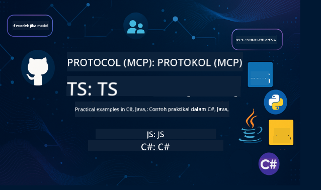

<!--
CO_OP_TRANSLATOR_METADATA:
{
  "original_hash": "866c8877136cb03e1efb9ad633a2f0a6",
  "translation_date": "2025-08-26T18:04:23+00:00",
  "source_file": "README.md",
  "language_code": "ms"
}
-->
 

Ikuti langkah-langkah berikut untuk mula menggunakan sumber ini:
1. **Fork Repositori**: Klik 
2. **Clone Repositori**:   `git clone https://github.com/microsoft/mcp-for-beginners.git`
3. [**Sertai Discord Azure AI Foundry dan berhubung dengan pakar serta pembangun lain**](https://discord.com/invite/ByRwuEEgH4)

### 🌐 Sokongan Pelbagai Bahasa

#### Disokong melalui GitHub Action (Automatik & Sentiasa Terkini)

 [Arabic](../ar/README.md) | [Bengali](../bn/README.md) | [Bulgarian](../bg/README.md) | [Burmese (Myanmar)](../my/README.md) | [Chinese (Simplified)](../zh/README.md) | [Chinese (Traditional, Hong Kong)](../hk/README.md) | [Chinese (Traditional, Macau)](../mo/README.md) | [Chinese (Traditional, Taiwan)](../tw/README.md) | [Croatian](../hr/README.md) | [Czech](../cs/README.md) | [Danish](../da/README.md) | [Dutch](../nl/README.md) | [Finnish](../fi/README.md) | [French](../fr/README.md) | [German](../de/README.md) | [Greek](../el/README.md) | [Hebrew](../he/README.md) | [Hindi](../hi/README.md) | [Hungarian](../hu/README.md) | [Indonesian](../id/README.md) | [Italian](../it/README.md) | [Japanese](../ja/README.md) | [Korean](../ko/README.md) | [Malay](./README.md) | [Marathi](../mr/README.md) | [Nepali](../ne/README.md) | [Norwegian](../no/README.md) | [Persian (Farsi)](../fa/README.md) | [Polish](../pl/README.md) | [Portuguese (Brazil)](../br/README.md) | [Portuguese (Portugal)](../pt/README.md) | [Punjabi (Gurmukhi)](../pa/README.md) | [Romanian](../ro/README.md) | [Russian](../ru/README.md) | [Serbian (Cyrillic)](../sr/README.md) | [Slovak](../sk/README.md) | [Slovenian](../sl/README.md) | [Spanish](../es/README.md) | [Swahili](../sw/README.md) | [Swedish](../sv/README.md) | [Tagalog (Filipino)](../tl/README.md) | [Thai](../th/README.md) | [Turkish](../tr/README.md) | [Ukrainian](../uk/README.md) | [Urdu](../ur/README.md) | [Vietnamese](../vi/README.md)

# 🚀 Kurikulum Model Context Protocol (MCP) untuk Pemula

## **Belajar MCP dengan Contoh Kod Praktikal dalam C#, Java, JavaScript, Rust, Python, dan TypeScript**

## 🧠 Gambaran Keseluruhan Kurikulum Model Context Protocol

**Model Context Protocol (MCP)** ialah rangka kerja terkini yang direka untuk menyeragamkan interaksi antara model AI dan aplikasi klien. Kurikulum sumber terbuka ini menawarkan laluan pembelajaran yang terstruktur, lengkap dengan contoh kod praktikal dan kes penggunaan dunia sebenar, merangkumi bahasa pengaturcaraan popular seperti C#, Java, JavaScript, TypeScript, dan Python.

Sama ada anda seorang pembangun AI, arkitek sistem, atau jurutera perisian, panduan ini adalah sumber komprehensif anda untuk menguasai asas MCP dan strategi pelaksanaannya.

## 🔗 Sumber Rasmi MCP

- 📘 [Dokumentasi MCP](https://modelcontextprotocol.io/) – Tutorial dan panduan pengguna terperinci  
- 📜 [Spesifikasi MCP](https://modelcontextprotocol.io/docs/) – Seni bina protokol dan rujukan teknikal  
- 📜 [Spesifikasi MCP Asal](https://spec.modelcontextprotocol.io/) – Rujukan teknikal lama (mungkin mengandungi butiran tambahan)  
- 🧑‍💻 [Repositori GitHub MCP](https://github.com/modelcontextprotocol) – SDK sumber terbuka, alat, dan contoh kod
- 🌐 [Komuniti MCP](https://github.com/orgs/modelcontextprotocol/discussions) – Sertai perbincangan dan sumbang kepada komuniti

## 🧭 Gambaran Keseluruhan Kurikulum MCP

### 📚 Struktur Kurikulum Lengkap

| Modul | Topik | Penerangan | Pautan |
|-------|-------|------------|--------|
| **Modul 1-3: Asas** | | | |
| 00 | Pengenalan kepada MCP | Gambaran keseluruhan Model Context Protocol dan kepentingannya dalam saluran AI | [Baca lebih lanjut](./00-Introduction/README.md) |
| 01 | Konsep Teras Dijelaskan | Penjelasan mendalam tentang konsep teras MCP | [Baca lebih lanjut](./01-CoreConcepts/README.md) |
| 02 | Keselamatan dalam MCP | Ancaman keselamatan dan amalan terbaik | [Baca lebih lanjut](./02-Security/README.md) |
| 03 | Bermula dengan MCP | Persediaan persekitaran, pelayan/klien asas, integrasi | [Baca lebih lanjut](./03-GettingStarted/README.md) |
| **Modul 3: Membina Pelayan & Klien Pertama Anda** | | | |
| 3.1 | Pelayan Pertama | Cipta pelayan MCP pertama anda | [Panduan](./03-GettingStarted/01-first-server/README.md) |
| 3.2 | Klien Pertama | Bangunkan klien MCP asas | [Panduan](./03-GettingStarted/02-client/README.md) |
| 3.3 | Klien dengan LLM | Integrasi model bahasa besar | [Panduan](./03-GettingStarted/03-llm-client/README.md) |
| 3.4 | Integrasi VS Code | Konsum pelayan MCP dalam VS Code | [Panduan](./03-GettingStarted/04-vscode/README.md) |
| 3.5 | Pelayan stdio | Cipta pelayan menggunakan pengangkutan stdio | [Panduan](./03-GettingStarted/05-stdio-server/README.md) |
| 3.6 | Penstriman HTTP | Laksanakan penstriman HTTP dalam MCP | [Panduan](./03-GettingStarted/06-http-streaming/README.md) |
| 3.7 | Toolkit AI | Gunakan Toolkit AI dengan MCP | [Panduan](./03-GettingStarted/07-aitk/README.md) |
| 3.8 | Ujian | Uji pelaksanaan pelayan MCP anda | [Panduan](./03-GettingStarted/08-testing/README.md) |
| 3.9 | Penghantaran | Hantar pelayan MCP ke pengeluaran | [Panduan](./03-GettingStarted/09-deployment/README.md) |
| **Modul 4-5: Praktikal & Lanjutan** | | | |
| 04 | Pelaksanaan Praktikal | SDK, debugging, ujian, templat prompt boleh guna semula | [Baca lebih lanjut](./04-PracticalImplementation/README.md) |
| 05 | Topik Lanjutan dalam MCP | AI multi-modal, penskalaan, penggunaan perusahaan | [Baca lebih lanjut](./05-AdvancedTopics/README.md) |
| 5.1 | Integrasi Azure | Integrasi MCP dengan Azure | [Panduan](./05-AdvancedTopics/mcp-integration/README.md) |
| 5.2 | Multi-modality | Bekerja dengan pelbagai modaliti | [Panduan](./05-AdvancedTopics/mcp-multi-modality/README.md) |
| 5.3 | Demo OAuth2 | Laksanakan pengesahan OAuth2 | [Panduan](./05-AdvancedTopics/mcp-oauth2-demo/README.md) |
| 5.4 | Konteks Akar | Fahami dan laksanakan konteks akar | [Panduan](./05-AdvancedTopics/mcp-root-contexts/README.md) |
| 5.5 | Penghalaan | Strategi penghalaan MCP | [Panduan](./05-AdvancedTopics/mcp-routing/README.md) |
| 5.6 | Pensampelan | Teknik pensampelan dalam MCP | [Panduan](./05-AdvancedTopics/mcp-sampling/README.md) |
| 5.7 | Penskalaan | Skala pelaksanaan MCP | [Panduan](./05-AdvancedTopics/mcp-scaling/README.md) |
| 5.8 | Keselamatan | Pertimbangan keselamatan lanjutan | [Panduan](./05-AdvancedTopics/mcp-security/README.md) |
| 5.9 | Carian Web | Laksanakan keupayaan carian web | [Panduan](./05-AdvancedTopics/web-search-mcp/README.md) |
| 5.10 | Penstriman Masa Nyata | Bina fungsi penstriman masa nyata | [Panduan](./05-AdvancedTopics/mcp-realtimestreaming/README.md) |
| 5.11 | Carian Masa Nyata | Laksanakan carian masa nyata | [Panduan](./05-AdvancedTopics/mcp-realtimesearch/README.md) |
| 5.12 | Pengesahan Entra ID | Pengesahan dengan Microsoft Entra ID | [Panduan](./05-AdvancedTopics/mcp-security-entra/README.md) |
| 5.13 | Integrasi Foundry | Integrasi dengan Azure AI Foundry | [Panduan](./05-AdvancedTopics/mcp-foundry-agent-integration/README.md) |
| 5.14 | Kejuruteraan Konteks | Teknik untuk kejuruteraan konteks yang berkesan | [Panduan](./05-AdvancedTopics/mcp-contextengineering/README.md) |
| **Modul 6-10: Komuniti & Amalan Terbaik** | | | |
| 06 | Sumbangan Komuniti | Cara menyumbang kepada ekosistem MCP | [Panduan](./06-CommunityContributions/README.md) |
| 07 | Pandangan daripada Pengguna Awal | Kisah pelaksanaan dunia sebenar | [Panduan](./07-LessonsFromEarlyAdoption/README.md) |
| 08 | Amalan Terbaik untuk MCP | Prestasi, toleransi kesalahan, ketahanan | [Panduan](./08-BestPractices/README.md) |
| 09 | Kajian Kes MCP | Contoh pelaksanaan praktikal | [Panduan](./09-CaseStudy/README.md) |
| 10 | Bengkel Praktikal | Membina Pelayan MCP dengan Toolkit AI | [Makmal](./10-StreamliningAIWorkflowsBuildingAnMCPServerWithAIToolkit/README.md) |

### 💻 Projek Kod Contoh

#### Contoh Kalkulator MCP Asas

| Bahasa | Penerangan | Pautan |
|--------|------------|--------|
| C# | Contoh Pelayan MCP | [Lihat Kod](./03-GettingStarted/samples/csharp/README.md) |
| Java | Kalkulator MCP | [Lihat Kod](./03-GettingStarted/samples/java/calculator/README.md) |
| JavaScript | Demo MCP | [Lihat Kod](./03-GettingStarted/samples/javascript/README.md) |
| Python | Pelayan MCP | [Lihat Kod](../../03-GettingStarted/samples/python/mcp_calculator_server.py) |
| TypeScript | Contoh MCP | [Lihat Kod](./03-GettingStarted/samples/typescript/README.md) |
| Rust | Contoh MCP | [Lihat Kod](./03-GettingStarted/samples/rust/README.md) |

#### Pelaksanaan MCP Lanjutan

| Bahasa | Penerangan | Pautan |
|--------|------------|--------|
| C# | Contoh Lanjutan | [View Code](./04-PracticalImplementation/samples/csharp/README.md) |
| Java dengan Spring | Contoh Aplikasi Container | [View Code](./04-PracticalImplementation/samples/java/containerapp/README.md) |
| JavaScript | Contoh Lanjutan | [View Code](./04-PracticalImplementation/samples/javascript/README.md) |
| Python | Implementasi Kompleks | [View Code](../../04-PracticalImplementation/samples/python/READMEmd) |
| TypeScript | Contoh Container | [View Code](./04-PracticalImplementation/samples/typescript/README.md) |

## 🎯 Prasyarat untuk Belajar MCP

Untuk mendapatkan manfaat maksimum daripada kurikulum ini, anda perlu mempunyai:

- Pengetahuan asas tentang pengaturcaraan dalam sekurang-kurangnya salah satu bahasa berikut: C#, Java, JavaScript, Python, atau TypeScript
- Pemahaman tentang model klien-pelayan dan API
- Kefahaman tentang konsep REST dan HTTP
- (Pilihan) Latar belakang dalam konsep AI/ML

- Sertai perbincangan komuniti kami untuk sokongan

## 📚 Panduan Belajar & Sumber

Repositori ini termasuk beberapa sumber untuk membantu anda belajar dengan berkesan:

### Panduan Belajar

Panduan Belajar [Study Guide](./study_guide.md) yang komprehensif tersedia untuk membantu anda menavigasi repositori ini dengan berkesan. Panduan ini termasuk:

- Peta kurikulum visual yang menunjukkan semua topik yang diliputi
- Pecahan terperinci setiap bahagian repositori
- Panduan tentang cara menggunakan projek sampel
- Laluan pembelajaran yang disyorkan untuk tahap kemahiran yang berbeza
- Sumber tambahan untuk melengkapkan perjalanan pembelajaran anda

### Changelog

Kami menyelenggara [Changelog](./changelog.md) terperinci yang menjejaki semua kemas kini penting kepada bahan kurikulum, termasuk:

- Penambahan kandungan baharu
- Perubahan struktur
- Penambahbaikan ciri
- Kemas kini dokumentasi

## 🛠️ Cara Menggunakan Kurikulum Ini dengan Berkesan

Setiap pelajaran dalam panduan ini termasuk:

1. Penjelasan jelas tentang konsep MCP  
2. Contoh kod langsung dalam pelbagai bahasa  
3. Latihan untuk membina aplikasi MCP sebenar  
4. Sumber tambahan untuk pelajar lanjutan  

## Acara 

### [MCP Dev Days Julai 2025](https://developer.microsoft.com/en-us/reactor/series/S-1563/)
#### [➡️Tonton On Demand - MCP Dev Days](https://developer.microsoft.com/en-us/reactor/series/S-1563/)
Bersedia untuk dua hari wawasan teknikal mendalam, sambungan komuniti, dan pembelajaran secara langsung di MCP Dev Days, acara maya yang didedikasikan untuk Model Context Protocol (MCP) — standard yang sedang berkembang yang menghubungkan model AI dan alat yang mereka gunakan.
Anda boleh menonton MCP Dev Days dengan mendaftar di halaman acara kami: https://aka.ms/mcpdevdays. 

#### [Hari 1: Produktiviti MCP, DevTools, & Komuniti:](https://developer.microsoft.com/en-us/reactor/series/S-1563/)

Fokus pada memperkasakan pembangun untuk menggunakan MCP dalam aliran kerja mereka dan meraikan komuniti MCP yang luar biasa. Kami akan disertai oleh ahli komuniti dan rakan kongsi seperti Arcade, Block, Okta, dan Neon untuk melihat bagaimana mereka bekerjasama dengan Microsoft untuk membentuk ekosistem MCP yang terbuka dan boleh diperluas. 
Demo dunia sebenar merentasi VS Code, Visual Studio, GitHub Copilot, dan alat komuniti popular
Aliran kerja pembangunan yang praktikal dan berasaskan konteks
Sesi dan wawasan yang diketuai komuniti
Sama ada anda baru bermula dengan MCP atau sudah membina dengannya, Hari 1 akan memberikan inspirasi dan panduan yang boleh diambil tindakan.

#### [Hari 2: Bina Pelayan MCP dengan Keyakinan](https://developer.microsoft.com/en-us/reactor/series/S-1563/)

Dikhususkan untuk pembina MCP. Kami akan mendalami strategi pelaksanaan dan amalan terbaik untuk mencipta pelayan MCP dan mengintegrasikan MCP ke dalam aliran kerja AI anda.

#### Topik termasuk:

- Membina Pelayan MCP dan mengintegrasikannya ke dalam pengalaman agen
- Pembangunan berasaskan prompt
- Amalan terbaik keselamatan
- Menggunakan blok binaan seperti Functions, ACA, dan API Management
- Penjajaran registry dan alat (1P + 3P)

Jika anda seorang pembangun, pembina alat, atau ahli strategi produk AI, hari ini penuh dengan wawasan yang anda perlukan untuk membina penyelesaian MCP yang boleh diskalakan, selamat, dan bersedia untuk masa depan.

### MCP Boot Camp Ogos 2025
Belajar dalam sesi video intensif cara mencipta pelayan MCP, mengintegrasi dengan VS Code, dan melancarkan secara profesional di Azure berdasarkan kandungan daripada kurikulum MCP untuk Pemula. Dapatkan kemahiran praktikal dalam teknologi yang sudah digunakan oleh syarikat besar.

#### [➡️Tonton On Demand MCP Bootcamp | English](https://developer.microsoft.com/en-us/reactor/series/s-1568/)
#### [➡️Tonton On Demand MCP Bootcamp | Brasil](https://developer.microsoft.com/en-us/reactor/series/S-1566/)
#### [➡️Tonton On Demand MCP Bootcamp | Spanish](https://developer.microsoft.com/en-us/reactor/series/S-1567/)

## 🌟 Terima Kasih Komuniti

Terima kasih kepada Microsoft Valued Professional [Shivam Goyal](https://www.linkedin.com/in/shivam2003/) kerana menyumbang sampel kod penting. 

## 📜 Maklumat Lesen

Kandungan ini dilesenkan di bawah **MIT License**. Untuk terma dan syarat, lihat [LICENSE](../../LICENSE).

## 🤝 Garis Panduan Sumbangan

Projek ini mengalu-alukan sumbangan dan cadangan. Kebanyakan sumbangan memerlukan anda bersetuju dengan
Contributor License Agreement (CLA) yang menyatakan bahawa anda mempunyai hak untuk, dan sebenarnya memberikan kami
hak untuk menggunakan sumbangan anda. Untuk butiran, lawati 
<https://cla.opensource.microsoft.com>.

Apabila anda menghantar permintaan tarik, bot CLA akan secara automatik menentukan sama ada anda perlu memberikan
CLA dan menghias PR dengan sewajarnya (contohnya, pemeriksaan status, komen). Ikuti sahaja arahan
yang diberikan oleh bot. Anda hanya perlu melakukan ini sekali untuk semua repositori yang menggunakan CLA kami.

Projek ini telah mengadopsi [Microsoft Open Source Code of Conduct](https://opensource.microsoft.com/codeofconduct/).
Untuk maklumat lanjut lihat [Code of Conduct FAQ](https://opensource.microsoft.com/codeofconduct/faq/) atau
hubungi [opencode@microsoft.com](mailto:opencode@microsoft.com) dengan sebarang soalan atau komen tambahan.

## 📂 Struktur Repositori

Repositori ini disusun seperti berikut:

- **Kurikulum Teras (00-10)**: Kandungan utama yang disusun dalam sepuluh modul berturutan
- **images/**: Diagram dan ilustrasi yang digunakan sepanjang kurikulum
- **translations/**: Sokongan pelbagai bahasa dengan terjemahan automatik
- **translated_images/**: Versi lokal diagram dan ilustrasi
- **study_guide.md**: Panduan komprehensif untuk menavigasi repositori
- **changelog.md**: Rekod semua perubahan penting kepada bahan kurikulum
- **mcp.json**: Fail konfigurasi untuk spesifikasi MCP
- **CODE_OF_CONDUCT.md, LICENSE, SECURITY.md, SUPPORT.md**: Dokumen tadbir urus projek

## 🎒 Kursus Lain
Pasukan kami menghasilkan kursus lain! Lihat:

- [AI Agents For Beginners](https://github.com/microsoft/ai-agents-for-beginners?WT.mc_id=academic-105485-koreyst)
- [Generative AI for Beginners menggunakan .NET](https://github.com/microsoft/Generative-AI-for-beginners-dotnet?WT.mc_id=academic-105485-koreyst)
- [Generative AI for Beginners menggunakan JavaScript](https://github.com/microsoft/generative-ai-with-javascript?WT.mc_id=academic-105485-koreyst)
- [Generative AI for Beginners](https://github.com/microsoft/generative-ai-for-beginners?WT.mc_id=academic-105485-koreyst)
- [Generative AI for Beginners menggunakan Java](https://github.com/microsoft/generative-ai-for-beginners-java?WT.mc_id=academic-105485-koreyst)
- [ML for Beginners](https://aka.ms/ml-beginners?WT.mc_id=academic-105485-koreyst)
- [Data Science for Beginners](https://aka.ms/datascience-beginners?WT.mc_id=academic-105485-koreyst)
- [AI for Beginners](https://aka.ms/ai-beginners?WT.mc_id=academic-105485-koreyst)
- [Cybersecurity for Beginners](https://github.com/microsoft/Security-101?WT.mc_id=academic-96948-sayoung)
- [Web Dev for Beginners](https://aka.ms/webdev-beginners?WT.mc_id=academic-105485-koreyst)
- [IoT for Beginners](https://aka.ms/iot-beginners?WT.mc_id=academic-105485-koreyst)
- [XR Development for Beginners](https://github.com/microsoft/xr-development-for-beginners?WT.mc_id=academic-105485-koreyst)
- [Mastering GitHub Copilot for AI Paired Programming](https://aka.ms/GitHubCopilotAI?WT.mc_id=academic-105485-koreyst)
- [Mastering GitHub Copilot untuk Pembangun C#/.NET](https://github.com/microsoft/mastering-github-copilot-for-dotnet-csharp-developers?WT.mc_id=academic-105485-koreyst)
- [Choose Your Own Copilot Adventure](https://github.com/microsoft/CopilotAdventures?WT.mc_id=academic-105485-koreyst)

## ™️ Notis Tanda Dagangan

Projek ini mungkin mengandungi tanda dagangan atau logo untuk projek, produk, atau perkhidmatan. Penggunaan yang dibenarkan untuk tanda dagangan atau logo Microsoft mesti mematuhi dan mengikuti
[Microsoft's Trademark & Brand Guidelines](https://www.microsoft.com/legal/intellectualproperty/trademarks/usage/general).
Penggunaan tanda dagangan atau logo Microsoft dalam versi yang diubah suai projek ini tidak boleh menyebabkan kekeliruan atau menyiratkan penajaan oleh Microsoft.
Sebarang penggunaan tanda dagangan atau logo pihak ketiga mesti mematuhi dasar pihak ketiga tersebut.

---

**Penafian**:  
Dokumen ini telah diterjemahkan menggunakan perkhidmatan terjemahan AI [Co-op Translator](https://github.com/Azure/co-op-translator). Walaupun kami berusaha untuk memastikan ketepatan, sila ambil perhatian bahawa terjemahan automatik mungkin mengandungi kesilapan atau ketidaktepatan. Dokumen asal dalam bahasa asalnya harus dianggap sebagai sumber yang berwibawa. Untuk maklumat yang kritikal, terjemahan manusia profesional adalah disyorkan. Kami tidak bertanggungjawab atas sebarang salah faham atau salah tafsir yang timbul daripada penggunaan terjemahan ini.