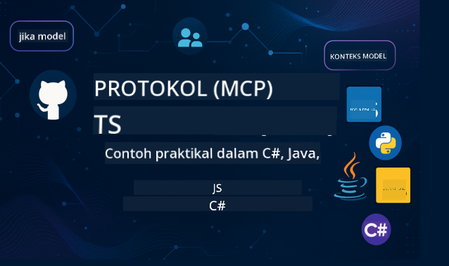

<!--
CO_OP_TRANSLATOR_METADATA:
{
  "original_hash": "2a21391378c12ecfef50f866329dfde0",
  "translation_date": "2025-05-17T05:31:13+00:00",
  "source_file": "README.md",
  "language_code": "ms"
}
-->

Ikuti langkah-langkah ini untuk mula menggunakan sumber ini:
1. **Fork Repositori**: Klik 
2. **Clone Repositori**: `git clone https://github.com/microsoft/mcp-for-beginners.git`
3. [**Sertai Microsoft Azure AI Foundry Discord dan temui pakar serta rakan pembangun**](https://discord.com/invite/ByRwuEEgH4)

### 🌐 Sokongan Pelbagai Bahasa

#### Disokong melalui GitHub Action (Automatik & Sentiasa Terkini)
[French](../fr/README.md) | [Spanish](../es/README.md) | [German](../de/README.md) | [Russian](../ru/README.md) | [Arabic](../ar/README.md) | [Persian (Farsi)](../fa/README.md) | [Urdu](../ur/README.md) | [Chinese (Simplified)](../zh/README.md) | [Chinese (Traditional, Macau)](../mo/README.md) | [Chinese (Traditional, Hong Kong)](../hk/README.md) | [Chinese (Traditional, Taiwan)](../tw/README.md) | [Japanese](../ja/README.md) | [Korean](../ko/README.md) | [Hindi](../hi/README.md) | [Bengali](../bn/README.md) | [Marathi](../mr/README.md) | [Nepali](../ne/README.md) | [Punjabi (Gurmukhi)](../pa/README.md) | [Portuguese (Portugal)](../pt/README.md) | [Portuguese (Brazil)](../br/README.md) | [Italian](../it/README.md) | [Polish](../pl/README.md) | [Turkish](../tr/README.md) | [Greek](../el/README.md) | [Thai](../th/README.md) | [Swedish](../sv/README.md) | [Danish](../da/README.md) | [Norwegian](../no/README.md) | [Finnish](../fi/README.md) | [Dutch](../nl/README.md) | [Hebrew](../he/README.md) | [Vietnamese](../vi/README.md) | [Indonesian](../id/README.md) | [Melayu](./README.md) | [Tagalog (Filipino)](../tl/README.md) | [Swahili](../sw/README.md) | [Hungarian](../hu/README.md) | [Czech](../cs/README.md) | [Slovak](../sk/README.md) | [Romanian](../ro/README.md) | [Bulgarian](../bg/README.md) | [Serbian (Cyrillic)](../sr/README.md) | [Croatian](../hr/README.md) | [Slovenian](../sl/README.md)
# 🚀 Panduan Utama untuk Kurikulum Model Context Protocol (MCP) bagi Pemula

## **Belajar MCP dengan Contoh Kod Praktikal dalam C#, Java, JavaScript, Python, dan TypeScript**

## 🧠 Gambaran Keseluruhan Kurikulum Model Context Protocol

**Model Context Protocol (MCP)** adalah rangka kerja terkini yang direka untuk menyeragamkan interaksi antara model AI dan aplikasi klien. Kurikulum sumber terbuka ini menawarkan laluan pembelajaran yang berstruktur, lengkap dengan contoh kod praktikal dan kes penggunaan dunia sebenar, merentasi bahasa pengaturcaraan popular termasuk C#, Java, JavaScript, TypeScript, dan Python.

Sama ada anda seorang pembangun AI, arkitek sistem, atau jurutera perisian, panduan ini adalah sumber komprehensif anda untuk menguasai asas MCP dan strategi pelaksanaannya.

## 🔗 Sumber Rasmi MCP

- 📘 [Dokumentasi MCP](https://modelcontextprotocol.io/) – Tutorial dan panduan pengguna terperinci  
- 📜 [Spesifikasi MCP](https://spec.modelcontextprotocol.io/) – Seni bina protokol dan rujukan teknikal  
- 🧑‍💻 [Repositori GitHub MCP](https://github.com/modelcontextprotocol) – SDK sumber terbuka, alat, dan contoh kod  

## 🧭 Struktur Lengkap Kurikulum MCP

### 📌 [Pengenalan kepada MCP](./00-Introduction/README.md)

- Apakah Model Context Protocol?
- Mengapa penyeragaman penting dalam saluran AI
- Kes penggunaan praktikal dan manfaat MCP

### 🧩 [Konsep Teras Diterangkan](./01-CoreConcepts/README.md)

- Memahami seni bina klien-pelayan dalam MCP
- Komponen protokol utama: permintaan, respons, dan skema
- Corak pemesejan dan pertukaran data MCP

### 🔐 [Keselamatan dalam MCP](./02-Security/readme.md)

- Mengenal pasti ancaman keselamatan dalam sistem berasaskan MCP
- Teknik dan amalan terbaik untuk melindungi pelaksanaan

### 🚀 [Memulakan dengan MCP](./03-GettingStarted/README.md)

- Persediaan dan konfigurasi persekitaran
- Mencipta pelayan dan klien MCP asas
- Mengintegrasikan MCP dengan aplikasi sedia ada

#### 🧮 Projek Contoh Kalkulator MCP:

  
<strong>Terokai Pelaksanaan Kod Mengikut Bahasa</strong>

  - [Contoh Pelayan MCP C#](./03-GettingStarted/samples/csharp/README.md)
  - [Kalkulator MCP Java](./03-GettingStarted/samples/java/calculator/README.md)
  - [Demo MCP JavaScript](./03-GettingStarted/samples/javascript/README.md)
  - [Pelayan MCP Python](../../03-GettingStarted/samples/python/mcp_calculator_server.py)
  - [Contoh MCP TypeScript](./03-GettingStarted/samples/typescript/README.md)

### 🛠️ [Pelaksanaan Praktikal](./04-PracticalImplementation/README.md)

- Menggunakan SDK merentasi pelbagai bahasa
- Debugging, pengujian, dan pengesahan
- Membina templat dan aliran kerja prompt yang boleh digunakan semula

#### 💡 Projek Kalkulator MCP Lanjutan:

  
<strong>Terokai Sampel Lanjutan</strong>

  - [Sampel C# Lanjutan](./04-PracticalImplementation/samples/csharp/README.md)
  - [Contoh Aplikasi Kontena Java](./04-PracticalImplementation/samples/java/containerapp/README.md)
  - [Sampel JavaScript Lanjutan](./04-PracticalImplementation/samples/javascript/README.md)
  - [Pelaksanaan Kompleks Python](../../04-PracticalImplementation/samples/python/mcp_sample.py)
  - [Sampel Kontena TypeScript](./04-PracticalImplementation/samples/typescript/README.md)

### 🎓 [Topik Lanjutan dalam MCP](./05-AdvancedTopics/README.md)

- Aliran kerja AI multi-modal dan kebolehlanjutan
- Strategi penskalaan yang selamat
- MCP dalam ekosistem perusahaan

### 🌍 [Sumbangan Komuniti](./06-CommunityContributions/README.md)

- Cara menyumbang kod dan dokumen
- Bekerjasama melalui GitHub
- Peningkatan dan maklum balas yang didorong oleh komuniti

### 📈 [Wawasan dari Penggunaan Awal](./07-CaseStudies/README.md)

- Pelaksanaan dunia sebenar dan apa yang berkesan
- Membangun dan melancarkan penyelesaian berasaskan MCP
- Trend dan peta jalan masa depan

### 📏 [Amalan Terbaik untuk MCP](./08-BestPractices/README.md)

- Penalaan prestasi dan pengoptimuman
- Merancang sistem MCP yang toleran terhadap kerosakan
- Strategi pengujian dan ketahanan

### 📊 [Kajian Kes MCP](./09-CaseStudy/Readme.md)

- Penerokaan mendalam ke dalam seni bina penyelesaian MCP
- Cetak biru pelancaran dan petua integrasi
- Diagram beranotasi dan panduan projek

## 🎯 Prasyarat untuk Mempelajari MCP

Untuk mendapatkan manfaat maksimum daripada kurikulum ini, anda harus mempunyai:

- Pengetahuan asas tentang C#, Java, atau Python
- Memahami model klien-pelayan dan API
- (Pilihan) Keakraban dengan konsep pembelajaran mesin

## 🛠️ Cara Menggunakan Kurikulum Ini dengan Berkesan

Setiap pelajaran dalam panduan ini termasuk:

1. Penjelasan jelas tentang konsep MCP  
2. Contoh kod langsung dalam pelbagai bahasa  
3. Latihan untuk membina aplikasi MCP sebenar  
4. Sumber tambahan untuk pelajar lanjutan  

## 📜 Maklumat Lesen

Kandungan ini dilesenkan di bawah **Lesen MIT**. Untuk terma dan syarat, lihat [LICENSE](../../LICENSE).

## 🤝 Garis Panduan Sumbangan

Projek ini mengalu-alukan sumbangan dan cadangan. Kebanyakan sumbangan memerlukan anda untuk bersetuju dengan
Perjanjian Lesen Penyumbang (CLA) yang menyatakan bahawa anda mempunyai hak untuk, dan benar-benar memberikan kami
hak untuk menggunakan sumbangan anda. Untuk maklumat lanjut, lawati <https://cla.opensource.microsoft.com>.

Apabila anda menyerahkan permintaan tarik, bot CLA akan secara automatik menentukan sama ada anda perlu menyediakan
CLA dan menghiasi PR dengan sewajarnya (contohnya, semakan status, komen). Ikuti sahaja arahan
yang diberikan oleh bot. Anda hanya perlu melakukan ini sekali untuk semua repositori yang menggunakan CLA kami.

Projek ini telah menerima pakai [Kod Etika Sumber Terbuka Microsoft](https://opensource.microsoft.com/codeofconduct/).
Untuk maklumat lanjut lihat [FAQ Kod Etika](https://opensource.microsoft.com/codeofconduct/faq/) atau
hubungi [opencode@microsoft.com](mailto:opencode@microsoft.com) dengan sebarang soalan atau komen tambahan.

## ™️ Notis Cap Dagangan

Projek ini mungkin mengandungi cap dagangan atau logo untuk projek, produk, atau perkhidmatan. Penggunaan yang dibenarkan untuk cap dagangan atau logo Microsoft adalah tertakluk kepada dan mesti mengikuti
[Panduan Cap Dagangan & Jenama Microsoft](https://www.microsoft.com/legal/intellectualproperty/trademarks/usage/general).
Penggunaan cap dagangan atau logo Microsoft dalam versi yang diubah suai daripada projek ini tidak boleh menyebabkan kekeliruan atau menyiratkan tajaan Microsoft.
Sebarang penggunaan cap dagangan atau logo pihak ketiga adalah tertakluk kepada polisi pihak ketiga tersebut.

**Penafian**:  
Dokumen ini telah diterjemahkan menggunakan perkhidmatan terjemahan AI [Co-op Translator](https://github.com/Azure/co-op-translator). Walaupun kami berusaha untuk ketepatan, sila ambil perhatian bahawa terjemahan automatik mungkin mengandungi kesilapan atau ketidaktepatan. Dokumen asal dalam bahasa asalnya harus dianggap sebagai sumber yang berwibawa. Untuk maklumat penting, terjemahan manusia profesional adalah disyorkan. Kami tidak bertanggungjawab atas sebarang salah faham atau salah tafsir yang timbul daripada penggunaan terjemahan ini.