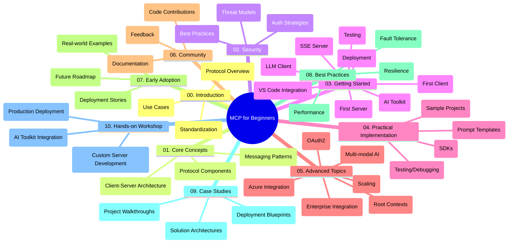

<!--
CO_OP_TRANSLATOR_METADATA:
{
  "original_hash": "a607d4febc94caee9a12b77795f7fc9a",
  "translation_date": "2025-07-13T15:16:50+00:00",
  "source_file": "study_guide.md",
  "language_code": "ms"
}
-->
# Model Context Protocol (MCP) untuk Pemula - Panduan Belajar

Panduan belajar ini memberikan gambaran keseluruhan tentang struktur dan kandungan repositori untuk kurikulum "Model Context Protocol (MCP) untuk Pemula". Gunakan panduan ini untuk menavigasi repositori dengan cekap dan memanfaatkan sumber yang tersedia dengan sebaiknya.

## Gambaran Keseluruhan Repositori

Model Context Protocol (MCP) adalah rangka kerja standard untuk interaksi antara model AI dan aplikasi klien. Repositori ini menyediakan kurikulum menyeluruh dengan contoh kod praktikal dalam C#, Java, JavaScript, Python, dan TypeScript, direka untuk pembangun AI, arkitek sistem, dan jurutera perisian.

## Peta Kurikulum Visual

## Struktur Repositori

Repositori ini disusun kepada sepuluh bahagian utama, setiap satu memberi tumpuan kepada aspek berbeza MCP:

1. **Pengenalan (00-Introduction/)**
   - Gambaran keseluruhan Model Context Protocol
   - Mengapa standardisasi penting dalam saluran AI
   - Kes penggunaan praktikal dan manfaat

2. **Konsep Teras (01-CoreConcepts/)**
   - Seni bina klien-pelayan
   - Komponen utama protokol
   - Corak penghantaran mesej dalam MCP

3. **Keselamatan (02-Security/)**
   - Ancaman keselamatan dalam sistem berasaskan MCP
   - Amalan terbaik untuk mengamankan pelaksanaan
   - Strategi pengesahan dan kebenaran

4. **Memulakan (03-GettingStarted/)**
   - Persediaan dan konfigurasi persekitaran
   - Membina pelayan dan klien MCP asas
   - Integrasi dengan aplikasi sedia ada
   - Subseksyen untuk pelayan pertama, klien pertama, klien LLM, integrasi VS Code, pelayan SSE, AI Toolkit, ujian, dan penyebaran

5. **Pelaksanaan Praktikal (04-PracticalImplementation/)**
   - Menggunakan SDK dalam pelbagai bahasa pengaturcaraan
   - Teknik debug, ujian, dan pengesahan
   - Membina templat prompt dan aliran kerja yang boleh digunakan semula
   - Projek contoh dengan contoh pelaksanaan

6. **Topik Lanjutan (05-AdvancedTopics/)**
   - Aliran kerja AI multi-modal dan kebolehsambungan
   - Strategi penskalaan selamat
   - MCP dalam ekosistem perusahaan
   - Topik khusus termasuk integrasi Azure, multi-modaliti, OAuth2, konteks akar, penghalaan, pensampelan, penskalaan, keselamatan, integrasi carian web, dan penstriman.

7. **Sumbangan Komuniti (06-CommunityContributions/)**
   - Cara menyumbang kod dan dokumentasi
   - Bekerjasama melalui GitHub
   - Penambahbaikan dan maklum balas yang dipacu komuniti

8. **Pengajaran dari Penggunaan Awal (07-LessonsfromEarlyAdoption/)**
   - Pelaksanaan dunia sebenar dan kisah kejayaan
   - Membina dan menyebarkan penyelesaian berasaskan MCP
   - Tren dan peta jalan masa depan

9. **Amalan Terbaik (08-BestPractices/)**
   - Penalaan prestasi dan pengoptimuman
   - Reka bentuk sistem MCP tahan ralat
   - Strategi ujian dan ketahanan

10. **Kajian Kes (09-CaseStudy/)**
    - Analisis mendalam seni bina penyelesaian MCP
    - Pelan penyebaran dan petua integrasi
    - Rajah beranotasi dan panduan projek

11. **Bengkel Praktikal (10-StreamliningAIWorkflowsBuildingAnMCPServerWithAIToolkit/)**
    - Bengkel praktikal menyeluruh menggabungkan MCP dengan AI Toolkit Microsoft untuk VS Code
    - Membina aplikasi pintar yang menghubungkan model AI dengan alat dunia sebenar
    - Modul praktikal merangkumi asas, pembangunan pelayan tersuai, dan strategi penyebaran produksi

## Projek Contoh

Repositori ini mengandungi pelbagai projek contoh yang menunjukkan pelaksanaan MCP dalam pelbagai bahasa pengaturcaraan:

### Contoh Kalkulator MCP Asas
- Contoh Pelayan MCP C#
- Kalkulator MCP Java
- Demo MCP JavaScript
- Pelayan MCP Python
- Contoh MCP TypeScript

### Projek Kalkulator MCP Lanjutan
- Contoh C# Lanjutan
- Contoh Aplikasi Kontena Java
- Contoh Lanjutan JavaScript
- Pelaksanaan Kompleks Python
- Contoh Kontena TypeScript

## Sumber Tambahan

Repositori ini termasuk sumber sokongan:

- **Folder Imej**: Mengandungi rajah dan ilustrasi yang digunakan sepanjang kurikulum
- **Terjemahan**: Sokongan pelbagai bahasa dengan terjemahan automatik dokumentasi
- **Sumber Rasmi MCP**:
  - [MCP Documentation](https://modelcontextprotocol.io/)
  - [MCP Specification](https://spec.modelcontextprotocol.io/)
  - [MCP GitHub Repository](https://github.com/modelcontextprotocol)

## Cara Menggunakan Repositori Ini

1. **Pembelajaran Berurutan**: Ikuti bab mengikut urutan (00 hingga 10) untuk pengalaman pembelajaran yang tersusun.
2. **Fokus Bahasa Tertentu**: Jika berminat dengan bahasa pengaturcaraan tertentu, terokai direktori contoh untuk pelaksanaan dalam bahasa pilihan anda.
3. **Pelaksanaan Praktikal**: Mulakan dengan bahagian "Memulakan" untuk menyediakan persekitaran dan membina pelayan serta klien MCP pertama anda.
4. **Eksplorasi Lanjutan**: Setelah selesa dengan asas, terokai topik lanjutan untuk memperluas pengetahuan anda.
5. **Penglibatan Komuniti**: Sertai [Azure AI Foundry Discord](https://discord.com/invite/ByRwuEEgH4) untuk berhubung dengan pakar dan pembangun lain.

## Menyumbang

Repositori ini mengalu-alukan sumbangan daripada komuniti. Lihat bahagian Sumbangan Komuniti untuk panduan cara menyumbang.

---

*Panduan belajar ini dibuat pada 11 Jun 2025, dan memberikan gambaran keseluruhan repositori sehingga tarikh tersebut. Kandungan repositori mungkin telah dikemas kini sejak itu.*

**Penafian**:  
Dokumen ini telah diterjemahkan menggunakan perkhidmatan terjemahan AI [Co-op Translator](https://github.com/Azure/co-op-translator). Walaupun kami berusaha untuk ketepatan, sila ambil perhatian bahawa terjemahan automatik mungkin mengandungi kesilapan atau ketidaktepatan. Dokumen asal dalam bahasa asalnya harus dianggap sebagai sumber yang sahih. Untuk maklumat penting, terjemahan profesional oleh manusia adalah disyorkan. Kami tidak bertanggungjawab atas sebarang salah faham atau salah tafsir yang timbul daripada penggunaan terjemahan ini.