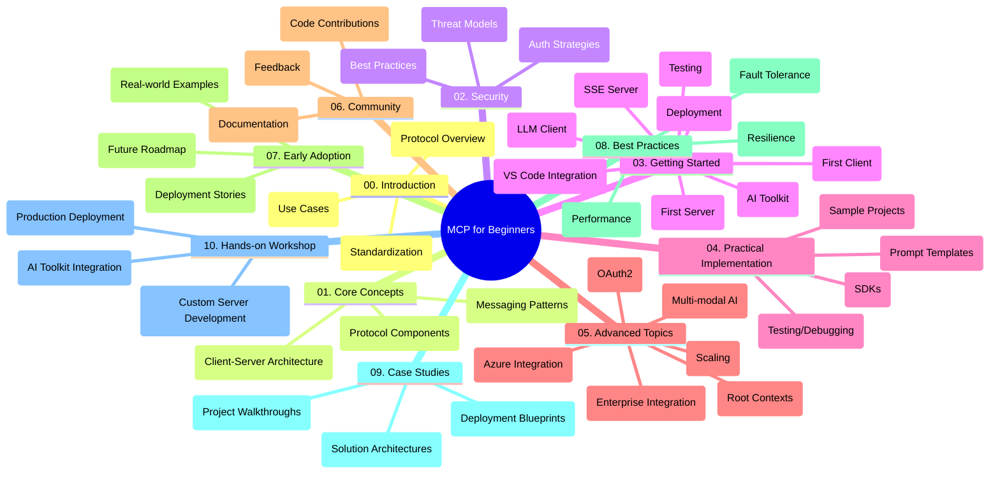

<!--
CO_OP_TRANSLATOR_METADATA:
{
  "original_hash": "a607d4febc94caee9a12b77795f7fc9a",
  "translation_date": "2025-06-11T16:48:21+00:00",
  "source_file": "study_guide.md",
  "language_code": "ms"
}
-->
# Model Context Protocol (MCP) למתחילים - מדריך לימוד

מדריך לימוד זה מספק סקירה של מבנה התיקייה והתוכן של תוכנית הלימודים "Model Context Protocol (MCP) למתחילים". השתמש במדריך זה כדי לנווט בתיקייה ביעילות ולהפיק את המרב מהמשאבים הזמינים.

## סקירת התיקייה

Model Context Protocol (MCP) הוא מסגרת סטנדרטית לאינטראקציות בין מודלים של בינה מלאכותית ליישומי לקוח. תיקייה זו מציעה תוכנית לימודים מקיפה עם דוגמאות קוד מעשיות ב-C#, Java, JavaScript, Python ו-TypeScript, המתאימה למפתחי AI, אדריכלי מערכות ומהנדסי תוכנה.

## מפת תוכנית לימודים ויזואלית

## מבנה התיקייה

התיקייה מחולקת לעשרה חלקים עיקריים, שכל אחד מתמקד בהיבטים שונים של MCP:

1. **Introduction (00-Introduction/)**
   - סקירה של Model Context Protocol
   - למה סטנדרטיזציה חשובה בצינורות AI
   - מקרי שימוש מעשיים ויתרונות

2. **Core Concepts (01-CoreConcepts/)**
   - ארכיטקטורת לקוח-שרת
   - רכיבי הפרוטוקול המרכזיים
   - דפוסי הודעות ב-MCP

3. **Security (02-Security/)**
   - איומי אבטחה במערכות מבוססות MCP
   - שיטות עבודה מומלצות לאבטחת יישומים
   - אסטרטגיות אימות והרשאה

4. **Getting Started (03-GettingStarted/)**
   - הגדרת סביבה וקונפיגורציה
   - יצירת שרתי ולקוחות MCP בסיסיים
   - אינטגרציה עם יישומים קיימים
   - תת-חלקים לשרת ראשון, לקוח ראשון, לקוח LLM, אינטגרציה עם VS Code, שרת SSE, AI Toolkit, בדיקות ופריסה

5. **Practical Implementation (04-PracticalImplementation/)**
   - שימוש ב-SDKs בשפות תכנות שונות
   - ניפוי שגיאות, בדיקות וטכניקות אימות
   - יצירת תבניות פרומפט וזרימות עבודה לשימוש חוזר
   - פרויקטים לדוגמה עם דוגמאות מימוש

6. **Advanced Topics (05-AdvancedTopics/)**
   - זרימות עבודה רב-מודליות והרחבות
   - אסטרטגיות סקיילינג מאובטחות
   - MCP במערכות ארגוניות
   - נושאים מיוחדים כולל אינטגרציה עם Azure, רב-מודליות, OAuth2, הקשרים שורשיים, ניתוב, דגימה, סקיילינג, אבטחה, אינטגרציית חיפוש באינטרנט וזרימה בזמן אמת.

7. **Community Contributions (06-CommunityContributions/)**
   - איך לתרום קוד ותיעוד
   - שיתוף פעולה דרך GitHub
   - שיפורים והערות מהקהילה

8. **Lessons from Early Adoption (07-LessonsfromEarlyAdoption/)**
   - מימושים וסיפורי הצלחה מהשטח
   - בנייה ופריסה של פתרונות מבוססי MCP
   - מגמות ומפת דרכים עתידית

9. **Best Practices (08-BestPractices/)**
   - כיוונון ביצועים ואופטימיזציה
   - תכנון מערכות MCP חסינות לתקלות
   - אסטרטגיות בדיקה וחוסן

10. **Case Studies (09-CaseStudy/)**
    - ניתוחים מעמיקים של ארכיטקטורות פתרונות MCP
    - תבניות פריסה וטיפים לאינטגרציה
    - דיאגרמות מפורטות והסברים לפרויקטים

11. **Hands-on Workshop (10-StreamliningAIWorkflowsBuildingAnMCPServerWithAIToolkit/)**
    - סדנה מעשית מקיפה המשלבת MCP עם Microsoft AI Toolkit ל-VS Code
    - בניית יישומים חכמים שמקשרים בין מודלי AI לכלים מעשיים
    - מודולים פרקטיים הכוללים יסודות, פיתוח שרת מותאם ופריסת ייצור

## פרויקטים לדוגמה

בתיקייה קיימים מספר פרויקטים לדוגמה המדגימים מימוש MCP בשפות תכנות שונות:

### דוגמאות בסיסיות למחשבון MCP
- דוגמת שרת MCP ב-C#
- מחשבון MCP ב-Java
- דמו MCP ב-JavaScript
- שרת MCP ב-Python
- דוגמה ב-TypeScript

### פרויקטים מתקדמים למחשבון MCP
- דוגמה מתקדמת ב-C#
- אפליקציית מכולה ב-Java
- דוגמה מתקדמת ב-JavaScript
- מימוש מורכב ב-Python
- דוגמת מכולה ב-TypeScript

## משאבים נוספים

התיקייה כוללת משאבים תומכים:

- **תיקיית Images**: מכילה דיאגרמות ואיורים לאורך כל התוכנית
- **תרגומים**: תמיכה בריבוי שפות עם תרגומים אוטומטיים של התיעוד
- **משאבים רשמיים של MCP**:
  - [MCP Documentation](https://modelcontextprotocol.io/)
  - [MCP Specification](https://spec.modelcontextprotocol.io/)
  - [MCP GitHub Repository](https://github.com/modelcontextprotocol)

## איך להשתמש בתיקייה זו

1. **למידה בסדר כרונולוגי**: עקבו אחרי הפרקים בסדר (00 עד 10) ללמידה מסודרת.
2. **מיקוד בשפה ספציפית**: אם אתם מעוניינים בשפת תכנות מסוימת, בדקו את תיקיות הדוגמאות למימושים בשפה המועדפת עליכם.
3. **מימוש מעשי**: התחילו ב-"Getting Started" כדי להגדיר את הסביבה וליצור את שרת ולקוח MCP הראשונים שלכם.
4. **חקירה מתקדמת**: לאחר שתרגישו בנוח עם הבסיס, עברו לנושאים המתקדמים להרחבת הידע.
5. **מעורבות בקהילה**: הצטרפו ל-[Azure AI Foundry Discord](https://discord.com/invite/ByRwuEEgH4) כדי להתחבר למומחים ולמפתחים נוספים.

## תרומה

תיקייה זו מקבלת בברכה תרומות מהקהילה. ראו את החלק Community Contributions לקבלת הנחיות כיצד לתרום.

---

*מדריך לימוד זה נוצר ב-11 ביוני 2025, ומספק סקירה של התיקייה נכון לתאריך זה. ייתכן שתוכן התיקייה עודכן מאז.*

**Penafian**:  
Dokumen ini telah diterjemahkan menggunakan perkhidmatan terjemahan AI [Co-op Translator](https://github.com/Azure/co-op-translator). Walaupun kami berusaha untuk ketepatan, sila ambil perhatian bahawa terjemahan automatik mungkin mengandungi kesilapan atau ketidaktepatan. Dokumen asal dalam bahasa asalnya harus dianggap sebagai sumber yang sahih. Untuk maklumat penting, terjemahan profesional oleh manusia adalah disyorkan. Kami tidak bertanggungjawab terhadap sebarang salah faham atau salah tafsir yang timbul daripada penggunaan terjemahan ini.