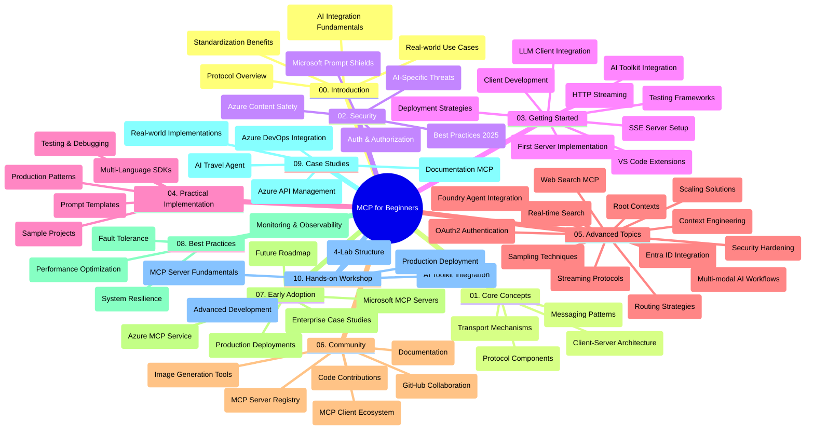

<!--
CO_OP_TRANSLATOR_METADATA:
{
  "original_hash": "e2c6ed897fa98fa08e0146101776c7ff",
  "translation_date": "2025-07-18T10:11:38+00:00",
  "source_file": "study_guide.md",
  "language_code": "ms"
}
-->
# Protokol Konteks Model (MCP) untuk Pemula - Panduan Pembelajaran

Panduan pembelajaran ini memberikan gambaran keseluruhan tentang struktur dan kandungan repositori untuk kurikulum "Protokol Konteks Model (MCP) untuk Pemula". Gunakan panduan ini untuk menavigasi repositori dengan cekap dan memanfaatkan sumber yang tersedia dengan sebaiknya.

## Gambaran Keseluruhan Repositori

Protokol Konteks Model (MCP) adalah rangka kerja standard untuk interaksi antara model AI dan aplikasi klien. Pada mulanya dicipta oleh Anthropic, MCP kini diselenggara oleh komuniti MCP yang lebih luas melalui organisasi rasmi GitHub. Repositori ini menyediakan kurikulum menyeluruh dengan contoh kod praktikal dalam C#, Java, JavaScript, Python, dan TypeScript, direka untuk pembangun AI, arkitek sistem, dan jurutera perisian.

## Peta Kurikulum Visual

## Struktur Repositori

Repositori ini disusun kepada sepuluh bahagian utama, setiap satu memberi tumpuan kepada aspek berbeza MCP:

1. **Pengenalan (00-Introduction/)**
   - Gambaran keseluruhan Protokol Konteks Model
   - Mengapa standardisasi penting dalam saluran AI
   - Kes penggunaan praktikal dan manfaat

2. **Konsep Teras (01-CoreConcepts/)**
   - Seni bina klien-pelayan
   - Komponen utama protokol
   - Corak penghantaran mesej dalam MCP

3. **Keselamatan (02-Security/)**
   - Ancaman keselamatan dalam sistem berasaskan MCP
   - Amalan terbaik untuk memastikan keselamatan pelaksanaan
   - Strategi pengesahan dan kebenaran
   - **Dokumentasi Keselamatan Menyeluruh**:
     - Amalan Terbaik Keselamatan MCP 2025
     - Panduan Pelaksanaan Keselamatan Kandungan Azure
     - Kawalan dan Teknik Keselamatan MCP
     - Rujukan Pantas Amalan Terbaik MCP
   - **Topik Keselamatan Utama**:
     - Serangan suntikan prompt dan pencemaran alat
     - Pengambilalihan sesi dan masalah wakil keliru
     - Kelemahan laluan token
     - Kebenaran berlebihan dan kawalan akses
     - Keselamatan rantaian bekalan untuk komponen AI
     - Integrasi Microsoft Prompt Shields

4. **Memulakan (03-GettingStarted/)**
   - Persediaan dan konfigurasi persekitaran
   - Membina pelayan dan klien MCP asas
   - Integrasi dengan aplikasi sedia ada
   - Termasuk bahagian untuk:
     - Pelaksanaan pelayan pertama
     - Pembangunan klien
     - Integrasi klien LLM
     - Integrasi VS Code
     - Pelayan Server-Sent Events (SSE)
     - Penstriman HTTP
     - Integrasi AI Toolkit
     - Strategi pengujian
     - Garis panduan penyebaran

5. **Pelaksanaan Praktikal (04-PracticalImplementation/)**
   - Menggunakan SDK dalam pelbagai bahasa pengaturcaraan
   - Teknik debug, ujian, dan pengesahan
   - Membina templat prompt dan aliran kerja yang boleh digunakan semula
   - Projek contoh dengan contoh pelaksanaan

6. **Topik Lanjutan (05-AdvancedTopics/)**
   - Teknik kejuruteraan konteks
   - Integrasi agen Foundry
   - Aliran kerja AI pelbagai modal
   - Demo pengesahan OAuth2
   - Kebolehan carian masa nyata
   - Penstriman masa nyata
   - Pelaksanaan konteks akar
   - Strategi penghalaan
   - Teknik pensampelan
   - Pendekatan penskalaan
   - Pertimbangan keselamatan
   - Integrasi keselamatan Entra ID
   - Integrasi carian web

7. **Sumbangan Komuniti (06-CommunityContributions/)**
   - Cara menyumbang kod dan dokumentasi
   - Bekerjasama melalui GitHub
   - Penambahbaikan dan maklum balas yang dipacu komuniti
   - Menggunakan pelbagai klien MCP (Claude Desktop, Cline, VSCode)
   - Bekerja dengan pelayan MCP popular termasuk penjanaan imej

8. **Pengajaran dari Penggunaan Awal (07-LessonsfromEarlyAdoption/)**
   - Pelaksanaan dunia sebenar dan kisah kejayaan
   - Membina dan menyebarkan penyelesaian berasaskan MCP
   - Tren dan peta jalan masa depan
   - **Panduan Pelayan MCP Microsoft**: Panduan menyeluruh untuk 10 pelayan MCP Microsoft yang sedia untuk produksi termasuk:
     - Pelayan MCP Microsoft Learn Docs
     - Pelayan MCP Azure (15+ penyambung khusus)
     - Pelayan MCP GitHub
     - Pelayan MCP Azure DevOps
     - Pelayan MCP MarkItDown
     - Pelayan MCP SQL Server
     - Pelayan MCP Playwright
     - Pelayan MCP Dev Box
     - Pelayan MCP Azure AI Foundry
     - Pelayan MCP Microsoft 365 Agents Toolkit

9. **Amalan Terbaik (08-BestPractices/)**
   - Penalaan prestasi dan pengoptimuman
   - Reka bentuk sistem MCP tahan ralat
   - Strategi ujian dan ketahanan

10. **Kajian Kes (09-CaseStudy/)**
    - Contoh integrasi Pengurusan API Azure
    - Contoh pelaksanaan ejen pelancongan
    - Integrasi Azure DevOps dengan kemas kini YouTube
    - Contoh pelaksanaan MCP dokumentasi
    - Contoh pelaksanaan dengan dokumentasi terperinci

11. **Bengkel Praktikal (10-StreamliningAIWorkflowsBuildingAnMCPServerWithAIToolkit/)**
    - Bengkel praktikal menyeluruh menggabungkan MCP dengan AI Toolkit
    - Membina aplikasi pintar yang menghubungkan model AI dengan alat dunia sebenar
    - Modul praktikal merangkumi asas, pembangunan pelayan tersuai, dan strategi penyebaran produksi
    - **Struktur Makmal**:
      - Makmal 1: Asas Pelayan MCP
      - Makmal 2: Pembangunan Pelayan MCP Lanjutan
      - Makmal 3: Integrasi AI Toolkit
      - Makmal 4: Penyebaran dan Penskalakan Produksi
    - Pendekatan pembelajaran berasaskan makmal dengan arahan langkah demi langkah

## Sumber Tambahan

Repositori ini termasuk sumber sokongan:

- **Folder Imej**: Mengandungi rajah dan ilustrasi yang digunakan sepanjang kurikulum
- **Terjemahan**: Sokongan pelbagai bahasa dengan terjemahan automatik dokumentasi
- **Sumber Rasmi MCP**:
  - [MCP Documentation](https://modelcontextprotocol.io/)
  - [MCP Specification](https://spec.modelcontextprotocol.io/)
  - [MCP GitHub Repository](https://github.com/modelcontextprotocol)

## Cara Menggunakan Repositori Ini

1. **Pembelajaran Berurutan**: Ikuti bab mengikut urutan (00 hingga 10) untuk pengalaman pembelajaran yang tersusun.
2. **Fokus Bahasa Tertentu**: Jika berminat dengan bahasa pengaturcaraan tertentu, terokai direktori contoh untuk pelaksanaan dalam bahasa pilihan anda.
3. **Pelaksanaan Praktikal**: Mulakan dengan bahagian "Memulakan" untuk menyediakan persekitaran dan membina pelayan serta klien MCP pertama anda.
4. **Eksplorasi Lanjutan**: Setelah mahir dengan asas, terokai topik lanjutan untuk memperluas pengetahuan anda.
5. **Penglibatan Komuniti**: Sertai komuniti MCP melalui perbincangan GitHub dan saluran Discord untuk berhubung dengan pakar dan pembangun lain.

## Klien dan Alat MCP

Kurikulum merangkumi pelbagai klien dan alat MCP:

1. **Klien Rasmi**:
   - Visual Studio Code
   - MCP dalam Visual Studio Code
   - Claude Desktop
   - Claude dalam VSCode
   - Claude API

2. **Klien Komuniti**:
   - Cline (berasaskan terminal)
   - Cursor (penyunting kod)
   - ChatMCP
   - Windsurf

3. **Alat Pengurusan MCP**:
   - MCP CLI
   - MCP Manager
   - MCP Linker
   - MCP Router

## Pelayan MCP Popular

Repositori ini memperkenalkan pelbagai pelayan MCP, termasuk:

1. **Pelayan MCP Microsoft Rasmi**:
   - Pelayan MCP Microsoft Learn Docs
   - Pelayan MCP Azure (15+ penyambung khusus)
   - Pelayan MCP GitHub
   - Pelayan MCP Azure DevOps
   - Pelayan MCP MarkItDown
   - Pelayan MCP SQL Server
   - Pelayan MCP Playwright
   - Pelayan MCP Dev Box
   - Pelayan MCP Azure AI Foundry
   - Pelayan MCP Microsoft 365 Agents Toolkit

2. **Pelayan Rujukan Rasmi**:
   - Filesystem
   - Fetch
   - Memory
   - Sequential Thinking

3. **Penjanaan Imej**:
   - Azure OpenAI DALL-E 3
   - Stable Diffusion WebUI
   - Replicate

4. **Alat Pembangunan**:
   - Git MCP
   - Terminal Control
   - Code Assistant

5. **Pelayan Khusus**:
   - Salesforce
   - Microsoft Teams
   - Jira & Confluence

## Penyumbangan

Repositori ini mengalu-alukan sumbangan daripada komuniti. Lihat bahagian Sumbangan Komuniti untuk panduan bagaimana menyumbang dengan berkesan kepada ekosistem MCP.

## Log Perubahan

| Tarikh | Perubahan |
|--------|-----------|
| 18 Julai 2025 | - Dikemaskini struktur repositori untuk memasukkan Panduan Pelayan MCP Microsoft - Ditambah senarai menyeluruh 10 pelayan MCP Microsoft yang sedia untuk produksi - Diperbaiki bahagian Pelayan MCP Popular dengan Pelayan MCP Microsoft Rasmi - Dikemaskini bahagian Kajian Kes dengan contoh fail sebenar - Ditambah butiran Struktur Makmal untuk Bengkel Praktikal |
| 16 Julai 2025 | - Dikemaskini struktur repositori mengikut kandungan semasa - Ditambah bahagian Klien dan Alat MCP - Ditambah bahagian Pelayan MCP Popular - Dikemaskini Peta Kurikulum Visual dengan semua topik semasa - Diperbaiki bahagian Topik Lanjutan dengan semua bidang khusus - Dikemaskini Kajian Kes untuk mencerminkan contoh sebenar - Menjelaskan asal usul MCP yang dicipta oleh Anthropic |
| 11 Jun 2025 | - Penciptaan awal panduan pembelajaran - Ditambah Peta Kurikulum Visual - Disusun struktur repositori - Termasuk projek contoh dan sumber tambahan |

---

*Panduan pembelajaran ini dikemaskini pada 18 Julai 2025, dan memberikan gambaran keseluruhan repositori sehingga tarikh tersebut. Kandungan repositori mungkin dikemaskini selepas tarikh ini.*

**Penafian**:  
Dokumen ini telah diterjemahkan menggunakan perkhidmatan terjemahan AI [Co-op Translator](https://github.com/Azure/co-op-translator). Walaupun kami berusaha untuk ketepatan, sila ambil maklum bahawa terjemahan automatik mungkin mengandungi kesilapan atau ketidaktepatan. Dokumen asal dalam bahasa asalnya harus dianggap sebagai sumber yang sahih. Untuk maklumat penting, terjemahan profesional oleh manusia adalah disyorkan. Kami tidak bertanggungjawab atas sebarang salah faham atau salah tafsir yang timbul daripada penggunaan terjemahan ini.