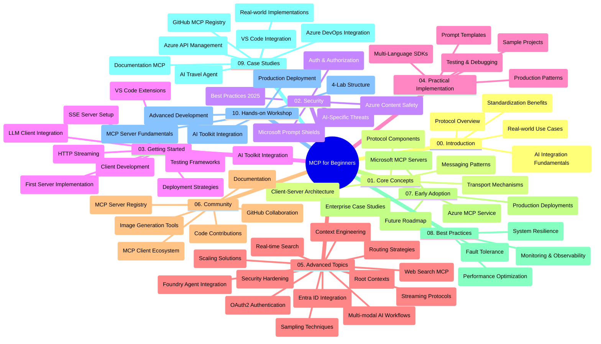

<!--
CO_OP_TRANSLATOR_METADATA:
{
  "original_hash": "719117a0a5f34ade7b5dfb61ee06fb13",
  "translation_date": "2025-09-26T18:49:50+00:00",
  "source_file": "study_guide.md",
  "language_code": "ms"
}
-->
# Protokol Konteks Model (MCP) untuk Pemula - Panduan Pembelajaran

Panduan pembelajaran ini memberikan gambaran keseluruhan tentang struktur repositori dan kandungan untuk kurikulum "Protokol Konteks Model (MCP) untuk Pemula". Gunakan panduan ini untuk menavigasi repositori dengan cekap dan memanfaatkan sumber yang tersedia sepenuhnya.

## Gambaran Repositori

Protokol Konteks Model (MCP) adalah kerangka kerja standard untuk interaksi antara model AI dan aplikasi klien. Pada mulanya dicipta oleh Anthropic, MCP kini dikendalikan oleh komuniti MCP yang lebih luas melalui organisasi GitHub rasmi. Repositori ini menyediakan kurikulum komprehensif dengan contoh kod praktikal dalam C#, Java, JavaScript, Python, dan TypeScript, direka untuk pembangun AI, arkitek sistem, dan jurutera perisian.

## Peta Kurikulum Visual

## Struktur Repositori

Repositori ini disusun kepada sepuluh bahagian utama, setiap satu memberi fokus kepada aspek berbeza MCP:

1. **Pengenalan (00-Introduction/)**
   - Gambaran keseluruhan Protokol Konteks Model
   - Kepentingan standardisasi dalam saluran AI
   - Kes penggunaan praktikal dan manfaatnya

2. **Konsep Asas (01-CoreConcepts/)**
   - Seni bina klien-pelayan
   - Komponen utama protokol
   - Corak pemesejan dalam MCP

3. **Keselamatan (02-Security/)**
   - Ancaman keselamatan dalam sistem berasaskan MCP
   - Amalan terbaik untuk melindungi pelaksanaan
   - Strategi pengesahan dan kebenaran
   - **Dokumentasi Keselamatan Komprehensif**:
     - Amalan Terbaik Keselamatan MCP 2025
     - Panduan Pelaksanaan Keselamatan Kandungan Azure
     - Kawalan dan Teknik Keselamatan MCP
     - Rujukan Cepat Amalan Terbaik MCP
   - **Topik Keselamatan Utama**:
     - Serangan suntikan prompt dan keracunan alat
     - Rampasan sesi dan masalah wakil yang keliru
     - Kerentanan laluan token
     - Kebenaran berlebihan dan kawalan akses
     - Keselamatan rantaian bekalan untuk komponen AI
     - Integrasi Microsoft Prompt Shields

4. **Memulakan (03-GettingStarted/)**
   - Persediaan dan konfigurasi persekitaran
   - Membuat pelayan dan klien MCP asas
   - Integrasi dengan aplikasi sedia ada
   - Termasuk bahagian untuk:
     - Pelaksanaan pelayan pertama
     - Pembangunan klien
     - Integrasi klien LLM
     - Integrasi VS Code
     - Pelayan Server-Sent Events (SSE)
     - Penstriman HTTP
     - Integrasi AI Toolkit
     - Strategi ujian
     - Garis panduan penyebaran

5. **Pelaksanaan Praktikal (04-PracticalImplementation/)**
   - Menggunakan SDK dalam pelbagai bahasa pengaturcaraan
   - Teknik debugging, ujian, dan pengesahan
   - Membuat templat prompt dan aliran kerja yang boleh digunakan semula
   - Projek contoh dengan contoh pelaksanaan

6. **Topik Lanjutan (05-AdvancedTopics/)**
   - Teknik kejuruteraan konteks
   - Integrasi agen Foundry
   - Aliran kerja AI multi-modal
   - Demo pengesahan OAuth2
   - Keupayaan carian masa nyata
   - Penstriman masa nyata
   - Pelaksanaan konteks akar
   - Strategi penghalaan
   - Teknik pensampelan
   - Pendekatan penskalaan
   - Pertimbangan keselamatan
   - Integrasi keselamatan Entra ID
   - Integrasi carian web

7. **Sumbangan Komuniti (06-CommunityContributions/)**
   - Cara menyumbang kod dan dokumentasi
   - Bekerjasama melalui GitHub
   - Penambahbaikan dan maklum balas yang didorong oleh komuniti
   - Menggunakan pelbagai klien MCP (Claude Desktop, Cline, VSCode)
   - Bekerja dengan pelayan MCP popular termasuk penjanaan imej

8. **Pengajaran daripada Penggunaan Awal (07-LessonsfromEarlyAdoption/)**
   - Pelaksanaan dunia sebenar dan kisah kejayaan
   - Membina dan menyebarkan penyelesaian berasaskan MCP
   - Trend dan peta jalan masa depan
   - **Panduan Pelayan MCP Microsoft**: Panduan komprehensif kepada 10 pelayan MCP Microsoft yang sedia untuk pengeluaran termasuk:
     - Pelayan MCP Microsoft Learn Docs
     - Pelayan MCP Azure (15+ penyambung khusus)
     - Pelayan MCP GitHub
     - Pelayan MCP Azure DevOps
     - Pelayan MCP MarkItDown
     - Pelayan MCP SQL Server
     - Pelayan MCP Playwright
     - Pelayan MCP Dev Box
     - Pelayan MCP Azure AI Foundry
     - Pelayan MCP Microsoft 365 Agents Toolkit

9. **Amalan Terbaik (08-BestPractices/)**
   - Penalaan prestasi dan pengoptimuman
   - Reka bentuk sistem MCP yang tahan kerosakan
   - Strategi ujian dan ketahanan

10. **Kajian Kes (09-CaseStudy/)**
    - **Tujuh kajian kes komprehensif** yang menunjukkan kepelbagaian MCP dalam pelbagai senario:
    - **Ejen Perjalanan AI Azure**: Orkestrasi multi-agen dengan Azure OpenAI dan AI Search
    - **Integrasi Azure DevOps**: Mengautomasi proses aliran kerja dengan kemas kini data YouTube
    - **Pengambilan Dokumentasi Masa Nyata**: Klien konsol Python dengan penstriman HTTP
    - **Penjana Pelan Pembelajaran Interaktif**: Aplikasi web Chainlit dengan AI perbualan
    - **Dokumentasi Dalam Editor**: Integrasi VS Code dengan aliran kerja GitHub Copilot
    - **Pengurusan API Azure**: Integrasi API perusahaan dengan penciptaan pelayan MCP
    - **Pendaftaran MCP GitHub**: Pembangunan ekosistem dan platform integrasi agen
    - Contoh pelaksanaan merangkumi integrasi perusahaan, produktiviti pembangun, dan pembangunan ekosistem

11. **Bengkel Praktikal (10-StreamliningAIWorkflowsBuildingAnMCPServerWithAIToolkit/)**
    - Bengkel praktikal komprehensif menggabungkan MCP dengan AI Toolkit
    - Membina aplikasi pintar yang menghubungkan model AI dengan alat dunia sebenar
    - Modul praktikal merangkumi asas, pembangunan pelayan khusus, dan strategi penyebaran pengeluaran
    - **Struktur Makmal**:
      - Makmal 1: Asas Pelayan MCP
      - Makmal 2: Pembangunan Pelayan MCP Lanjutan
      - Makmal 3: Integrasi AI Toolkit
      - Makmal 4: Penyebaran Pengeluaran dan Penskalaan
    - Pendekatan pembelajaran berasaskan makmal dengan arahan langkah demi langkah

## Sumber Tambahan

Repositori ini termasuk sumber sokongan:

- **Folder Imej**: Mengandungi diagram dan ilustrasi yang digunakan sepanjang kurikulum
- **Terjemahan**: Sokongan pelbagai bahasa dengan terjemahan dokumentasi automatik
- **Sumber Rasmi MCP**:
  - [Dokumentasi MCP](https://modelcontextprotocol.io/)
  - [Spesifikasi MCP](https://spec.modelcontextprotocol.io/)
  - [Repositori GitHub MCP](https://github.com/modelcontextprotocol)

## Cara Menggunakan Repositori Ini

1. **Pembelajaran Berurutan**: Ikuti bab-bab mengikut urutan (00 hingga 10) untuk pengalaman pembelajaran yang terstruktur.
2. **Fokus Khusus Bahasa**: Jika anda berminat dengan bahasa pengaturcaraan tertentu, terokai direktori sampel untuk pelaksanaan dalam bahasa pilihan anda.
3. **Pelaksanaan Praktikal**: Mulakan dengan bahagian "Memulakan" untuk menyediakan persekitaran anda dan mencipta pelayan dan klien MCP pertama anda.
4. **Penerokaan Lanjutan**: Setelah selesa dengan asas, terokai topik lanjutan untuk memperluaskan pengetahuan anda.
5. **Penglibatan Komuniti**: Sertai komuniti MCP melalui perbincangan GitHub dan saluran Discord untuk berhubung dengan pakar dan pembangun lain.

## Klien dan Alat MCP

Kurikulum ini merangkumi pelbagai klien dan alat MCP:

1. **Klien Rasmi**:
   - Visual Studio Code 
   - MCP dalam Visual Studio Code
   - Claude Desktop
   - Claude dalam VSCode 
   - Claude API

2. **Klien Komuniti**:
   - Cline (berasaskan terminal)
   - Cursor (editor kod)
   - ChatMCP
   - Windsurf

3. **Alat Pengurusan MCP**:
   - MCP CLI
   - MCP Manager
   - MCP Linker
   - MCP Router

## Pelayan MCP Popular

Repositori ini memperkenalkan pelbagai pelayan MCP, termasuk:

1. **Pelayan MCP Microsoft Rasmi**:
   - Pelayan MCP Microsoft Learn Docs
   - Pelayan MCP Azure (15+ penyambung khusus)
   - Pelayan MCP GitHub
   - Pelayan MCP Azure DevOps
   - Pelayan MCP MarkItDown
   - Pelayan MCP SQL Server
   - Pelayan MCP Playwright
   - Pelayan MCP Dev Box
   - Pelayan MCP Azure AI Foundry
   - Pelayan MCP Microsoft 365 Agents Toolkit

2. **Pelayan Rujukan Rasmi**:
   - Filesystem
   - Fetch
   - Memory
   - Sequential Thinking

3. **Penjanaan Imej**:
   - Azure OpenAI DALL-E 3
   - Stable Diffusion WebUI
   - Replicate

4. **Alat Pembangunan**:
   - Git MCP
   - Kawalan Terminal
   - Pembantu Kod

5. **Pelayan Khusus**:
   - Salesforce
   - Microsoft Teams
   - Jira & Confluence

## Menyumbang

Repositori ini mengalu-alukan sumbangan daripada komuniti. Lihat bahagian Sumbangan Komuniti untuk panduan tentang cara menyumbang dengan berkesan kepada ekosistem MCP.

## Log Perubahan

| Tarikh | Perubahan |
|-------|-----------|
| 26 September 2025 | - Menambah kajian kes Pendaftaran MCP GitHub ke bahagian 09-CaseStudy - Mengemas kini Kajian Kes untuk mencerminkan tujuh kajian kes komprehensif - Mempertingkatkan penerangan kajian kes dengan butiran pelaksanaan khusus - Mengemas kini Peta Kurikulum Visual untuk memasukkan Pendaftaran MCP GitHub - Menyemak semula struktur panduan pembelajaran untuk mencerminkan fokus pembangunan ekosistem |
| 18 Julai 2025 | - Mengemas kini struktur repositori untuk memasukkan Panduan Pelayan MCP Microsoft - Menambah senarai komprehensif 10 pelayan MCP Microsoft yang sedia untuk pengeluaran - Mempertingkatkan bahagian Pelayan MCP Popular dengan Pelayan MCP Microsoft Rasmi - Mengemas kini bahagian Kajian Kes dengan contoh fail sebenar - Menambah butiran Struktur Makmal untuk Bengkel Praktikal |
| 16 Julai 2025 | - Mengemas kini struktur repositori untuk mencerminkan kandungan semasa - Menambah bahagian Klien dan Alat MCP - Menambah bahagian Pelayan MCP Popular - Mengemas kini Peta Kurikulum Visual dengan semua topik semasa - Mempertingkatkan bahagian Topik Lanjutan dengan semua kawasan khusus - Mengemas kini Kajian Kes untuk mencerminkan contoh sebenar - Menjelaskan asal usul MCP sebagai ciptaan Anthropic |
| 11 Jun 2025 | - Penciptaan awal panduan pembelajaran - Menambah Peta Kurikulum Visual - Menggariskan struktur repositori - Termasuk projek contoh dan sumber tambahan |

---

*Panduan pembelajaran ini dikemas kini pada 26 September 2025, dan memberikan gambaran keseluruhan repositori sehingga tarikh tersebut. Kandungan repositori mungkin dikemas kini selepas tarikh ini.*

---

