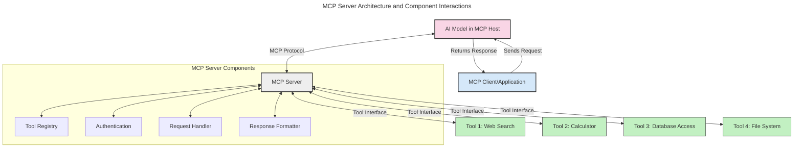
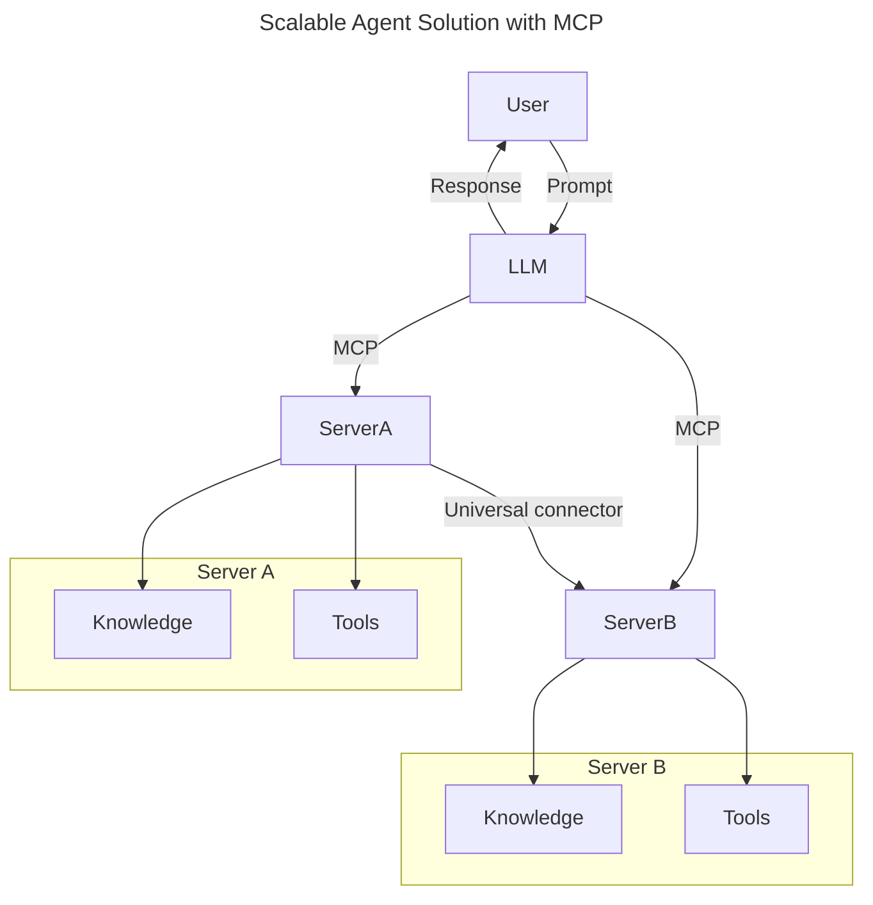
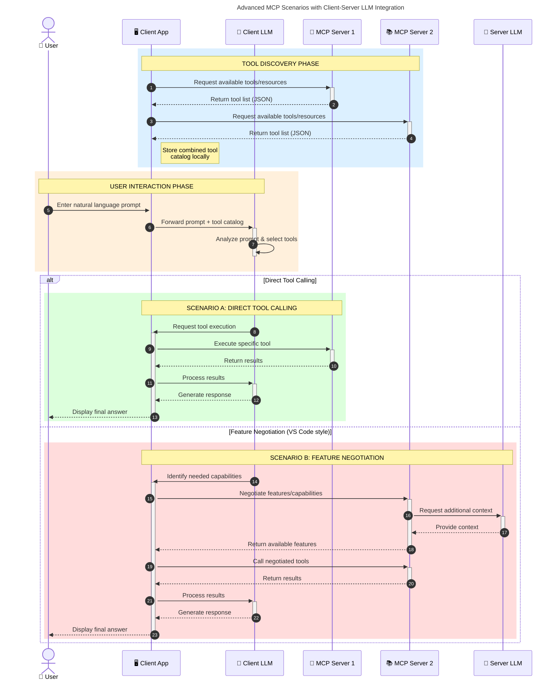

<!--
CO_OP_TRANSLATOR_METADATA:
{
  "original_hash": "105c2ddbb77bc38f7e9df009e1b06e45",
  "translation_date": "2025-07-04T19:17:35+00:00",
  "source_file": "00-Introduction/README.md",
  "language_code": "my"
}
-->
# Model Context Protocol (MCP) အကြောင်းအရာသိရှိခြင်း: Scalable AI Applications များအတွက် အရေးကြီးမှု

Generative AI applications များသည် အသုံးပြုသူများအား သဘာဝဘာသာစကားဖြင့် အက်ပ်နှင့် ဆက်သွယ်နိုင်စေသော အဆင့်တစ်ခုဖြစ်သည်။ သို့သော် အချိန်နှင့် အရင်းအမြစ်များ ပိုမိုထည့်သွင်းလာသည်နှင့်အမျှ၊ လုပ်ဆောင်ချက်များနှင့် အရင်းအမြစ်များကို လွယ်ကူစွာ ပေါင်းစပ်နိုင်ရန်၊ အက်ပ်တစ်ခုတွင် မော်ဒယ်တစ်ခုထက် မော်ဒယ်များစွာ အသုံးပြုနိုင်ရန်နှင့် မော်ဒယ်အသီးသီး၏ အထူးသဖြင့် အချက်အလက်များကို ကိုင်တွယ်နိုင်ရန် လိုအပ်သည်။ အကျဉ်းချုပ်အားဖြင့် Gen AI applications များကို စတင်ဖန်တီးရတာ လွယ်ကူပေမယ့်၊ တိုးတက်ပြီး ရှုပ်ထွေးလာသည်နှင့်အမျှ အဆောက်အအုံတစ်ခု သတ်မှတ်ရန် လိုအပ်လာပြီး၊ အက်ပ်များကို တူညီသောနည်းလမ်းဖြင့် ဖန်တီးနိုင်ရန် စံချိန်စံညွှန်းတစ်ခုလိုအပ်လာသည်။ ဒီမှာ MCP က အရာအားလုံးကို စနစ်တကျ စီမံခန့်ခွဲပေးပြီး စံချိန်စံညွှန်းတစ်ခု ပေးစွမ်းပေးသည်။

---

## **🔍 Model Context Protocol (MCP) ဆိုတာဘာလဲ?**

**Model Context Protocol (MCP)** သည် **ဖွင့်လှစ်ပြီး စံချိန်စံညွှန်းထားသော အင်တာဖေ့စ်** တစ်ခုဖြစ်ပြီး၊ Large Language Models (LLMs) များအား ပြင်ပကိရိယာများ၊ API များနှင့် ဒေတာရင်းမြစ်များနှင့် အဆင်ပြေစွာ ဆက်သွယ်နိုင်စေသည်။ ၎င်းသည် AI မော်ဒယ်များ၏ လေ့ကျင့်မှုဒေတာအပြင်ပိုင်းတွင် လုပ်ဆောင်နိုင်စွမ်းများ တိုးတက်စေပြီး၊ ပိုမိုတိုးချဲ့နိုင်ပြီး တုံ့ပြန်မှုမြန်ဆန်သော AI စနစ်များ ဖန်တီးရန် စနစ်တကျ ဖွဲ့စည်းပေးသည်။

---

## **🎯 AI တွင် စံချိန်စံညွှန်းထားခြင်း အရေးကြီးသည့်အကြောင်း**

Generative AI applications များ ရှုပ်ထွေးလာသည်နှင့်အမျှ၊ **တိုးချဲ့နိုင်မှု၊ တိုးတက်နိုင်မှု** နှင့် **ထိန်းသိမ်းနိုင်မှု** များအတွက် စံချိန်စံညွှန်းများကို လက်ခံအသုံးပြုခြင်း အရေးကြီးသည်။ MCP သည် အောက်ပါအချက်များအား ဖြေရှင်းပေးသည်-

- မော်ဒယ်နှင့် ကိရိယာများ ပေါင်းစပ်မှုကို ညီညွတ်စေခြင်း
- တစ်ခါတည်း အသုံးပြုသော မတည်ငြိမ်သော ဖြေရှင်းချက်များ လျော့နည်းစေခြင်း
- မော်ဒယ်များစွာကို တစ်ခုတည်းသော စနစ်အတွင်း တည်ရှိနိုင်စေခြင်း

---

## **📚 သင်ယူရမည့် ရည်မှန်းချက်များ**

ဒီဆောင်းပါးအဆုံးသတ်ချိန်တွင် သင်သည်-

- **Model Context Protocol (MCP)** ကို သတ်မှတ်နိုင်ပြီး ၎င်း၏ အသုံးပြုမှုများကို နားလည်နိုင်မည်
- MCP သည် မော်ဒယ်နှင့် ကိရိယာ ဆက်သွယ်မှုကို မည်သို့ စံချိန်စံညွှန်းထားသည်ကို နားလည်နိုင်မည်
- MCP အဆောက်အအုံ၏ အဓိက အစိတ်အပိုင်းများကို ဖော်ထုတ်နိုင်မည်
- စီးပွားရေးနှင့် ဖွံ့ဖြိုးတိုးတက်မှုဆိုင်ရာ MCP ၏ လက်တွေ့အသုံးချမှုများကို ရှာဖွေသိရှိနိုင်မည်

---

## **💡 Model Context Protocol (MCP) သည် ဘာကြောင့် ပြောင်းလဲမှုဖြစ်စေသနည်း**

### **🔗 MCP သည် AI ဆက်သွယ်မှုများတွင် ခွဲခြားမှုများကို ဖြေရှင်းပေးသည်**

MCP မရှိမီ မော်ဒယ်များနှင့် ကိရိယာများ ပေါင်းစပ်ရန်အတွက်-

- ကိရိယာနှင့် မော်ဒယ် တစ်စုံတစ်ရာအတွက် ကိုယ်ပိုင်ကုဒ်ရေးရန်လိုအပ်သည်
- တစ်ဦးချင်း API များ မစံချိန်စံညွှန်းဖြစ်ကြောင်း
- အဆင့်မြှင့်တင်မှုများကြောင့် မကြာခဏ ချိုးဖောက်မှုများ ဖြစ်ပေါ်သည်
- ကိရိယာများ ပိုမိုများလာသည်နှင့်အမျှ တိုးချဲ့နိုင်မှု မကောင်း

### **✅ MCP စံချိန်စံညွှန်းထားခြင်း၏ အကျိုးကျေးဇူးများ**

| **အကျိုးကျေးဇူး**          | **ဖော်ပြချက်**                                                                 |
|----------------------------|--------------------------------------------------------------------------------|
| ဆက်သွယ်နိုင်မှု             | LLM များသည် ကွဲပြားသော ကုန်ပစ္စည်းပေးသူများ၏ ကိရိယာများနှင့် အဆင်ပြေစွာ လုပ်ဆောင်နိုင်သည်       |
| ညီညွတ်မှု                 | ပလက်ဖောင်းနှင့် ကိရိယာများအတွင်း တူညီသော အပြုအမူရှိသည်                          |
| ပြန်လည်အသုံးပြုနိုင်မှု     | တစ်ကြိမ်တည်း ဖန်တီးထားသော ကိရိယာများကို စီမံကိန်းများနှင့် စနစ်များအတွင်း အသုံးပြုနိုင်သည်         |
| ဖွံ့ဖြိုးတိုးတက်မှု မြန်ဆန်ခြင်း | စံချိန်စံညွှန်းထားသော plug-and-play အင်တာဖေ့စ်များ အသုံးပြုခြင်းဖြင့် ဖွံ့ဖြိုးရေးအချိန် လျော့နည်းစေသည် |

---

## **🧱 MCP အဆောက်အအုံ အမြင်အနှံ**

MCP သည် **client-server မော်ဒယ်** ကို လိုက်နာပြီး-

- **MCP Hosts** တွင် AI မော်ဒယ်များ လည်ပတ်သည်
- **MCP Clients** မှ တောင်းဆိုမှုများ စတင်ပေးပို့သည်
- **MCP Servers** မှ context, ကိရိယာများနှင့် စွမ်းဆောင်ရည်များ ပေးဆောင်သည်

### **အဓိက အစိတ်အပိုင်းများ**

- **Resources** – မော်ဒယ်များအတွက် စတိတ်တစ်ခု သို့မဟုတ် လှုပ်ရှားမှုရှိသော ဒေတာများ  
- **Prompts** – ဦးတည်ချက်ပေးသော workflow များ  
- **Tools** – ရှာဖွေမှု၊ တွက်ချက်မှုကဲ့သို့ လုပ်ဆောင်နိုင်သော function များ  
- **Sampling** – recursive ဆက်သွယ်မှုများဖြင့် agentic အပြုအမူ

---

## MCP Servers များ မည်သို့ လည်ပတ်သနည်း

MCP servers များသည် အောက်ပါနည်းဖြင့် လည်ပတ်သည်-

- **တောင်းဆိုမှု လည်ပတ်မှု**:  
    1. MCP Client သည် MCP Host တွင် လည်ပတ်နေသော AI မော်ဒယ်သို့ တောင်းဆိုမှု ပေးပို့သည်။  
    2. AI မော်ဒယ်သည် ပြင်ပကိရိယာများ သို့မဟုတ် ဒေတာလိုအပ်သည်ကို သိရှိသည်။  
    3. မော်ဒယ်သည် MCP Server နှင့် စံချိန်စံညွှန်းထားသော protocol ဖြင့် ဆက်သွယ်သည်။  

- **MCP Server ၏ လုပ်ဆောင်ချက်များ**:  
    - Tool Registry: ရရှိနိုင်သော ကိရိယာများနှင့် ၎င်းတို့၏ စွမ်းဆောင်ရည်များကို စာရင်းသွင်းထားသည်။  
    - Authentication: ကိရိယာအသုံးပြုခွင့်များကို စစ်ဆေးသည်။  
    - Request Handler: မော်ဒယ်မှ တောင်းဆိုသော ကိရိယာတောင်းဆိုမှုများကို ကိုင်တွယ်သည်။  
    - Response Formatter: ကိရိယာထုတ်လွှင့်ချက်များကို မော်ဒယ်နားလည်နိုင်သော ပုံစံဖြင့် ဖွဲ့စည်းပေးသည်။  

- **ကိရိယာ လုပ်ဆောင်မှု**:  
    - ဆာဗာသည် တောင်းဆိုမှုများကို သင့်တော်သော ပြင်ပကိရိယာများသို့ လမ်းညွှန်ပေးသည်။  
    - ကိရိယာများသည် ၎င်းတို့၏ အထူးပြုလုပ်ဆောင်ချက်များ (ရှာဖွေမှု၊ တွက်ချက်မှု၊ ဒေတာဘေ့စ် မေးခွန်းများ စသည်) ကို လုပ်ဆောင်သည်။  
    - ရလဒ်များကို တူညီသော ပုံစံဖြင့် မော်ဒယ်သို့ ပြန်ပေးပို့သည်။  

- **တုံ့ပြန်မှု ပြီးစီးခြင်း**:  
    - AI မော်ဒယ်သည် ကိရိယာထုတ်လွှင့်ချက်များကို ၎င်း၏ တုံ့ပြန်မှုထဲတွင် ထည့်သွင်းသည်။  
    - နောက်ဆုံးတုံ့ပြန်မှုကို client application သို့ ပြန်ပို့သည်။

## 👨‍💻 MCP Server တည်ဆောက်နည်း (ဥပမာများနှင့်အတူ)

MCP servers များသည် LLM ၏ စွမ်းဆောင်ရည်များကို ဒေတာနှင့် လုပ်ဆောင်ချက်များဖြင့် တိုးချဲ့နိုင်စေသည်။

စမ်းသပ်လိုပါသလား? ဘာသာစကားအမျိုးမျိုးဖြင့် ရိုးရှင်းသော MCP server တစ်ခု ဖန်တီးခြင်း ဥပမာများမှာ-

- **Python ဥပမာ**: https://github.com/modelcontextprotocol/python-sdk

- **TypeScript ဥပမာ**: https://github.com/modelcontextprotocol/typescript-sdk

- **Java ဥပမာ**: https://github.com/modelcontextprotocol/java-sdk

- **C#/.NET ဥပမာ**: https://github.com/modelcontextprotocol/csharp-sdk

## 🌍 MCP ၏ လက်တွေ့အသုံးချမှုများ

MCP သည် AI စွမ်းဆောင်ရည်များကို တိုးချဲ့ခြင်းဖြင့် အမျိုးမျိုးသော လျှောက်လွှာများကို ခွင့်ပြုသည်-

| **လျှောက်လွှာ**              | **ဖော်ပြချက်**                                                                 |
|------------------------------|--------------------------------------------------------------------------------|
| စီးပွားရေး ဒေတာ ပေါင်းစည်းမှု  | LLM များကို ဒေတာဘေ့စ်များ၊ CRM များ သို့မဟုတ် အတွင်းကိရိယာများနှင့် ချိတ်ဆက်ခြင်း               |
| Agentic AI စနစ်များ           | ကိရိယာအသုံးပြုခွင့်နှင့် ဆုံးဖြတ်ချက်လုပ်ငန်းစဉ်များပါရှိသော ကိုယ်ပိုင်အေးဂျင့်များ ဖန်တီးခြင်း       |
| Multi-modal လျှောက်လွှာများ   | စာသား၊ ပုံနှင့် အသံ ကိရိယာများကို တစ်ခုတည်းသော AI အက်ပ်အတွင်း ပေါင်းစပ်ခြင်း                      |
| အချိန်နှင့်တပြေးညီ ဒေတာ ပေါင်းစည်းမှု | AI ဆက်သွယ်မှုများတွင် လက်ရှိ ဒေတာများကို ထည့်သွင်းခြင်းဖြင့် တိကျမှန်ကန်သော ရလဒ်များ ရရှိစေခြင်း         |

### 🧠 MCP = AI ဆက်သွယ်မှုများအတွက် စံချိန်စံညွှန်းတစ်ခု

Model Context Protocol (MCP) သည် USB-C ကဲ့သို့ စက်ပစ္စည်းများအတွက် ဖိဇစ်ဆက်သွယ်မှုများကို စံချိန်စံညွှန်းထားသည့်အတိုင်း AI ဆက်သွယ်မှုများအတွက် စံချိန်စံညွှန်းတစ်ခုအဖြစ် လုပ်ဆောင်သည်။ AI ကမ္ဘာတွင် MCP သည် မော်ဒယ်များ (client များ) ကို ပြင်ပကိရိယာများနှင့် ဒေတာပေးသူများ (server များ) နှင့် အဆင်ပြေစွာ ပေါင်းစည်းနိုင်သော interface တစ်ခု ပေးသည်။ ၎င်းက API သို့မဟုတ် ဒေတာရင်းမြစ် တစ်ခုချင်းစီအတွက် မတူညီသော ကိုယ်ပိုင် protocol များ လိုအပ်မှုကို ဖယ်ရှားပေးသည်။

MCP ကို လိုက်နာသော ကိရိယာတစ်ခု (MCP server ဟု ခေါ်သည်) သည် စံချိန်စံညွှန်းတစ်ခုအတိုင်း လုပ်ဆောင်ပြီး၊ ၎င်းတို့ပေးသော ကိရိယာများ သို့မဟုတ် လုပ်ဆောင်ချက်များကို စာရင်းပြုစုထားနိုင်ပြီး AI အေးဂျင့်မှ တောင်းဆိုမှု ရောက်လာသည်နှင့်အမျှ လုပ်ဆောင်ပေးနိုင်သည်။ MCP ကို ထောက်ပံ့သော AI အေးဂျင့်ပလက်ဖောင်းများသည် ဆာဗာများမှ ရရှိနိုင်သော ကိရိယာများကို ရှာဖွေတွေ့ရှိပြီး စံချိန်စံညွှန်း protocol ဖြင့် ခေါ်ယူနိုင်သည်။

### 💡 အသိပညာရရှိမှုကို လွယ်ကူစေခြင်း

ကိရိယာများသာမက MCP သည် အသိပညာရရှိမှုကိုလည်း လွယ်ကူစေသည်။ ၎င်းသည် အက်ပ်များအား LLM များနှင့် မတူညီသော ဒေတာရင်းမြစ်များ ချိတ်ဆက်ပေး၍ context ပေးနိုင်စေသည်။ ဥပမာအားဖြင့် MCP server တစ်ခုသည် ကုမ္ပဏီ၏ စာရွက်စာတမ်းများကို ကိုယ်စားပြုနိုင်ပြီး၊ အေးဂျင့်များသည် လိုအပ်သလို သက်ဆိုင်ရာ အချက်အလက်များ ရယူနိုင်သည်။ အခြားဆာဗာတစ်ခုက အီးမေးလ်ပို့ခြင်း သို့မဟုတ် မှတ်တမ်းများ ပြင်ဆင်ခြင်းကဲ့သို့ လုပ်ဆောင်ချက်များကို ကိုင်တွယ်နိုင်သည်။ အေးဂျင့်အမြင်မှ ၎င်းတို့သည် အသုံးပြုနိုင်သော ကိရိယာများသာဖြစ်ပြီး၊ တချို့ကိရိယာများသည် ဒေတာ (အသိပညာ context) ပြန်ပေးပြီး၊ တချို့ကိရိယာများသည် လုပ်ဆောင်ချက်များ ဆောင်ရွက်ပေးသည်။ MCP သည် နှစ်မျိုးစလုံးကို ထိရောက်စွာ စီမံခန့်ခွဲပေးသည်။

MCP server တစ်ခုနှင့် ချိတ်ဆက်သော အေးဂျင့်သည် ဆာဗာ၏ ရရှိနိုင်သော စွမ်းဆောင်ရည်များနှင့် အသုံးပြုနိုင်သော ဒေတာများကို စံချိန်စံညွှန်းပုံစံဖြင့် အလိုအလျောက် သင်ယူနိုင်သည်။ ၎င်းစံချိန်စံညွှန်းသည် ကိရိယာရရှိနိုင်မှုကို အပြောင်းအလဲရှိစေသည်။ ဥပမာအားဖြင့် MCP server အသစ်တစ်ခုကို အေးဂျင့်စနစ်ထဲ ထည့်သွင်းခြင်းဖြင့် ၎င်း၏ လုပ်ဆောင်ချက်များကို အခြားပြင်ဆင်မှုမလိုဘဲ ချက်ချင်း အသုံးပြုနိုင်သည်။

ဒီလို ပေါင်းစည်းမှုသည် mermaid diagram တွင် ဖော်ပြထားသည့် လည်ပတ်မှုစနစ်နှင့် ကိုက်ညီပြီး၊ ဆာဗာများသည် ကိရိယာများနှင့် အသိပညာများကို ပေးဆောင်ကာ စနစ်များအကြား အဆင်ပြေစွာ ပူးပေါင်းဆောင်ရွက်နိုင်စေသည်။

### 👉 ဥပမာ- Scalable Agent ဖြေရှင်းချက်

### 🔄 Client-Side LLM ပေါင်းစပ်မှုပါ Advanced MCP အခြေအနေများ

အခြေခံ MCP အဆောက်အအုံအပြင်၊ client နှင့် server နှစ်ဖက်လုံးတွင် LLM များပါရှိပြီး ပိုမိုတိုးတက်သော ဆက်သွယ်မှုများ ဖြစ်ပေါ်စေသော အခြေအနေများရှိသည်-

## 🔐 MCP အသုံးပြုခြင်း၏ လက်တွေ့အကျိုးကျေးဇူးများ

MCP အသုံးပြုခြင်း၏ လက်တွေ့အကျိုးကျေးဇူးများမှာ-

- **အသစ်ပြန်လည်ရရှိမှု**: မော်ဒယ်များသည် လ

**အကြောင်းကြားချက်**  
ဤစာတမ်းကို AI ဘာသာပြန်ဝန်ဆောင်မှု [Co-op Translator](https://github.com/Azure/co-op-translator) ဖြင့် ဘာသာပြန်ထားပါသည်။ ကျွန်ုပ်တို့သည် တိကျမှန်ကန်မှုအတွက် ကြိုးစားသော်လည်း အလိုအလျောက် ဘာသာပြန်ခြင်းတွင် အမှားများ သို့မဟုတ် မှားယွင်းချက်များ ပါဝင်နိုင်ကြောင်း သတိပြုပါရန် မေတ္တာရပ်ခံအပ်ပါသည်။ မူရင်းစာတမ်းကို မိမိဘာသာစကားဖြင့်သာ တရားဝင်အရင်းအမြစ်အဖြစ် ယူဆသင့်ပါသည်။ အရေးကြီးသော အချက်အလက်များအတွက် လူ့ဘာသာပြန်ပညာရှင်မှ ဘာသာပြန်ခြင်းကို အကြံပြုပါသည်။ ဤဘာသာပြန်ချက်ကို အသုံးပြုရာမှ ဖြစ်ပေါ်လာနိုင်သည့် နားလည်မှုမှားယွင်းမှုများအတွက် ကျွန်ုပ်တို့သည် တာဝန်မယူပါ။