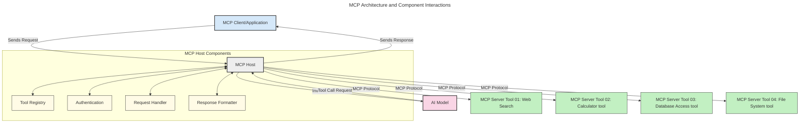
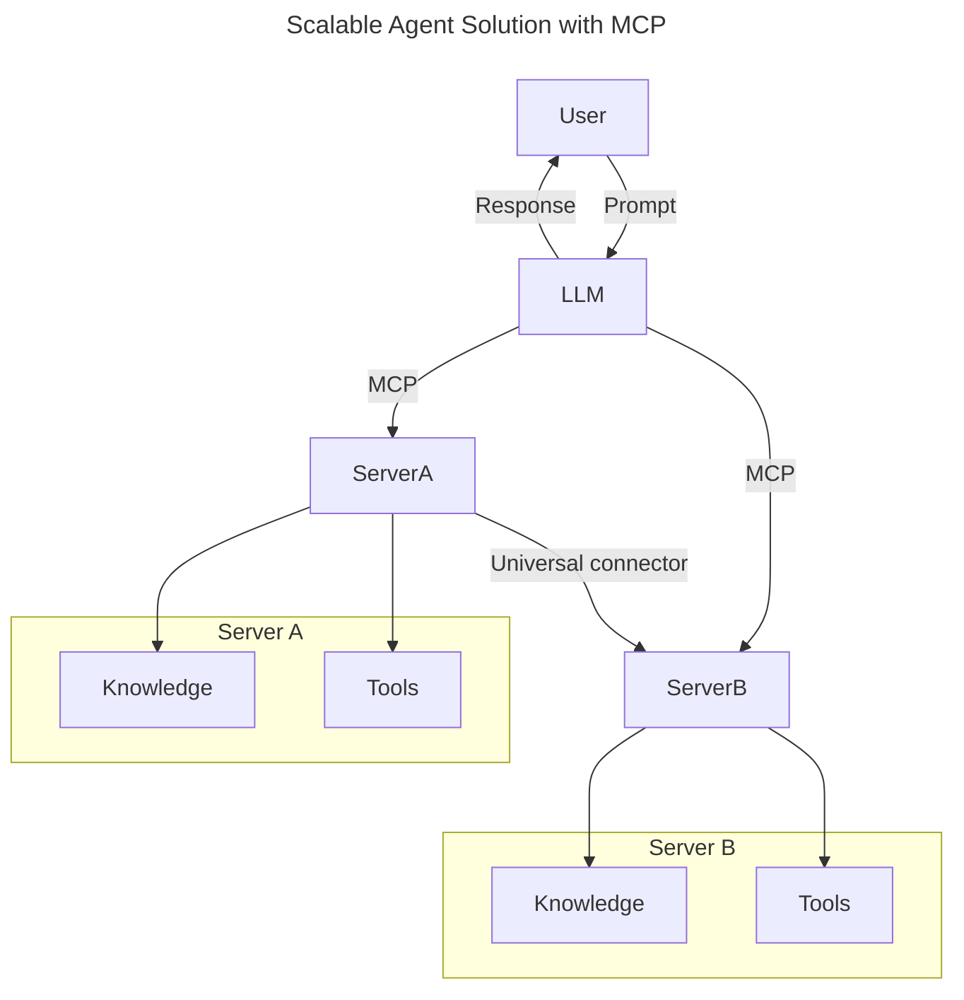
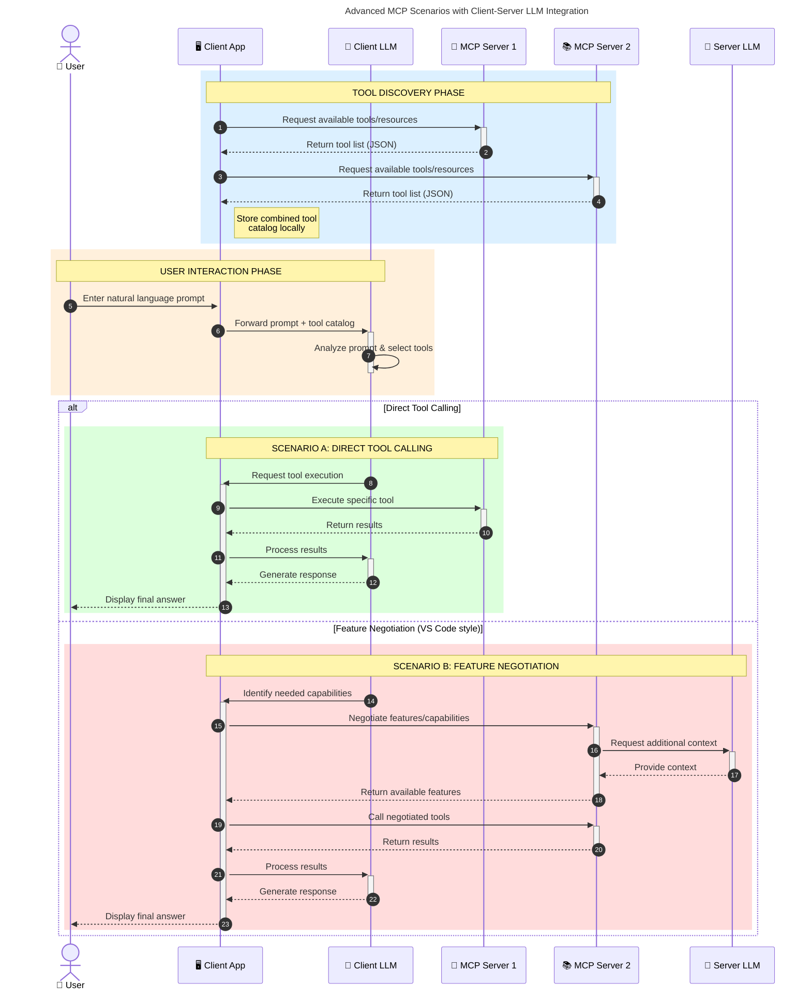

<!--
CO_OP_TRANSLATOR_METADATA:
{
  "original_hash": "0df1ee78a6dd8300f3a040ca5b411c2e",
<<<<<<< HEAD
  "translation_date": "2025-08-18T23:39:23+00:00",
=======
  "translation_date": "2025-08-18T19:00:07+00:00",
>>>>>>> origin/main
  "source_file": "00-Introduction/README.md",
  "language_code": "my"
}
-->
<<<<<<< HEAD
# Model Context Protocol (MCP) ကိုမိတ်ဆက်ခြင်း: Scalable AI Applications အတွက် အရေးပါမှု
=======
# Model Context Protocol (MCP) ကိုမိတ်ဆက်ခြင်း: Scalable AI Applications အတွက် အရေးကြီးသောအကြောင်းအရာ
>>>>>>> origin/main

_(ဤသင်ခန်းစာ၏ ဗီဒီယိုကို ကြည့်ရန် အထက်ပါပုံကို နှိပ်ပါ)_

<<<<<<< HEAD
Generative AI အက်ပလီကေးရှင်းများသည် သုံးစွဲသူများကို သဘာဝဘာသာစကားဖြင့် အက်ပလီကေးရှင်းနှင့် အလွယ်တကူ အပြန်အလှန် ဆက်သွယ်နိုင်စေသော တိုးတက်မှုကြီးတစ်ခုဖြစ်သည်။ သို့သော် အက်ပလီကေးရှင်းများကို ပိုမိုတိုးတက်စေရန် အချိန်နှင့် အရင်းအမြစ်များကို ရင်းနှီးမြှုပ်နှံသည့်အခါ၊ အက်ပလီကေးရှင်းကို တိုးချဲ့နိုင်စေရန်၊ မော်ဒယ်များစွာကို ထည့်သွင်းအသုံးပြုနိုင်စေရန်နှင့် မော်ဒယ်၏ အမျိုးမျိုးသော အကျိုးသက်ရောက်မှုများကို ကိုင်တွယ်နိုင်စေရန် လွယ်ကူသော နည်းလမ်းများကို ပေါင်းစပ်နိုင်စေရန် သေချာစေရန်လိုအပ်သည်။ အကျဉ်းချုပ်အားဖြင့် Gen AI အက်ပလီကေးရှင်းများကို စတင်ဖွဲ့စည်းရန် လွယ်ကူသော်လည်း၊ ၎င်းတို့သည် ကြီးထွားလာပြီး ပိုမိုရှုပ်ထွေးလာသည့်အခါ၊ အဆောက်အအုံကို သတ်မှတ်ရန် စတင်လိုအပ်လာပြီး အက်ပလီကေးရှင်းများကို တစ်စည်းတစ်လုံးဖြစ်စေရန် စံသတ်မှတ်ချက်တစ်ခုကို အားထားရမည်ဖြစ်သည်။ ဒီအချိန်မှာ MCP က အရာတွေကို စနစ်တကျ စီမံခန့်ခွဲပြီး စံသတ်မှတ်ချက်ကို ပေးစွမ်းနိုင်သည်။
=======
Generative AI အက်ပလီကေးရှင်းများသည် သဘာဝဘာသာစကားကို အသုံးပြု၍ အက်ပလီကေးရှင်းနှင့် အလွယ်တကူ အပြန်အလှန် ဆက်သွယ်နိုင်စေသော တိုးတက်မှုကြီးတစ်ခုဖြစ်သည်။ သို့သော်၊ ဤအက်ပလီကေးရှင်းများအတွက် အချိန်နှင့် အရင်းအမြစ်များ ပိုမိုရင်းနှီးမြှုပ်နှံသည့်အခါ၊ အက်ပလီကေးရှင်းကို တိုးချဲ့နိုင်စေရန်၊ မော်ဒယ်များစွာကို ထည့်သွင်းအသုံးပြုနိုင်စေရန်နှင့် မော်ဒယ်၏ အမျိုးမျိုးသော အကျိုးသက်ရောက်မှုများကို ကိုင်တွယ်နိုင်စေရန် လွယ်ကူသော နည်းလမ်းများဖြင့် လုပ်ဆောင်နိုင်စေရန် သေချာစေရန်လိုအပ်သည်။ အကျဉ်းချုပ်အားဖြင့် Generative AI အက်ပလီကေးရှင်းများကို စတင်ဖွဲ့စည်းရန် လွယ်ကူသော်လည်း၊ ၎င်းတို့သည် ကြီးထွားလာပြီး ရှုပ်ထွေးလာသည့်အခါ၊ အဆောက်အအုံကို သတ်မှတ်ရန် စတင်လိုအပ်လာပြီး အက်ပလီကေးရှင်းများကို တစ်စည်းတစ်လုံးဖြစ်စေရန် စံသတ်မှတ်ချက်တစ်ခုကို အားထားရမည်ဖြစ်သည်။ ဤနေရာတွင် MCP သည် အစီအစဉ်တစ်ခုကို စနစ်တကျ ဖွဲ့စည်းရန်နှင့် စံသတ်မှတ်ချက်ကို ပေးရန် အရေးပါလာသည်။
>>>>>>> origin/main

---

## **🔍 Model Context Protocol (MCP) ဆိုတာဘာလဲ?**

<<<<<<< HEAD
**Model Context Protocol (MCP)** သည် **ပွင့်လင်းပြီး စံပြအင်တာဖေ့စ်** တစ်ခုဖြစ်ပြီး Large Language Models (LLMs) များကို အပြင်ဘက်ကိရိယာများ၊ APIs နှင့် ဒေတာရင်းမြစ်များနှင့် အလွယ်တကူ ဆက်သွယ်နိုင်စေသည်။ ၎င်းသည် AI မော်ဒယ်များ၏ လုပ်ဆောင်နိုင်စွမ်းကို ၎င်းတို့၏ လေ့ကျင့်ထားသော ဒေတာအပြင်ပိုမိုတိုးတက်စေရန် တစ်စည်းတစ်လုံးဖြစ်သော architecture ကို ပံ့ပိုးပေးပြီး ပိုမိုထက်မြက်သော၊ Scalable ဖြစ်သော၊ တုံ့ပြန်မှုမြန်သော AI စနစ်များကို ဖန်တီးနိုင်စေသည်။
=======
**Model Context Protocol (MCP)** သည် **ဖွင့်လှစ်ထားသော စံပြအင်တာဖေ့စ်** တစ်ခုဖြစ်ပြီး Large Language Models (LLMs) များကို အပြင်ပန်းကိရိယာများ၊ APIs နှင့် ဒေတာအရင်းအမြစ်များနှင့် အဆင်ပြေစွာ ဆက်သွယ်နိုင်စေသည်။ ၎င်းသည် AI မော်ဒယ်များ၏ လုပ်ဆောင်နိုင်စွမ်းကို ၎င်းတို့၏ လေ့ကျင့်ထားသော ဒေတာအကျိုးသက်ရောက်မှုများထက် ကျော်လွန်စေပြီး ပိုမိုထက်မြက်သော၊ Scalable ဖြစ်သော၊ တုံ့ပြန်မှုမြန်သော AI စနစ်များကို ဖွံ့ဖြိုးတိုးတက်စေသည်။
>>>>>>> origin/main

---

## **🎯 AI တွင် စံသတ်မှတ်ချက်များ အရေးကြီးသောအကြောင်း**

<<<<<<< HEAD
Generative AI အက်ပလီကေးရှင်းများ ပိုမိုရှုပ်ထွေးလာသည့်အခါ၊ **Scalability, Extensibility, Maintainability** နှင့် **Vendor Lock-in ကိုရှောင်ရှားခြင်း** ကို သေချာစေရန် စံသတ်မှတ်ချက်များကို လက်ခံအသုံးပြုရန် အရေးကြီးသည်။ MCP သည် အောက်ပါလိုအပ်ချက်များကို ဖြေရှင်းပေးသည်-

- မော်ဒယ်-ကိရိယာ ပေါင်းစပ်မှုများကို တစ်စည်းတစ်လုံးဖြစ်စေသည်  
- တစ်ခါသုံး Custom Solutions များကို လျှော့ချပေးသည်  
- Vendor များကွဲပြားသည့် မော်ဒယ်များစွာကို တစ်စနစ်အတွင်းတွင် ပေါင်းစပ်အသုံးပြုနိုင်စေသည်  

**Note:** MCP သည် ပွင့်လင်းစံသတ်မှတ်ချက်အဖြစ် ကြေညာထားသော်လည်း IEEE, IETF, W3C, ISO သို့မဟုတ် အခြားစံသတ်မှတ်ချက်အဖွဲ့များမှတစ်ဆင့် MCP ကို စံပြအဖြစ် သတ်မှတ်ရန် အစီအစဉ်မရှိပါ။
=======
Generative AI အက်ပလီကေးရှင်းများသည် ပိုမိုရှုပ်ထွေးလာသည့်အခါ၊ **Scalability, Extensibility, Maintainability** နှင့် **Vendor Lock-in ကိုရှောင်ရှားခြင်း** ကို သေချာစေရန် စံသတ်မှတ်ချက်များကို လက်ခံအသုံးပြုရန် အရေးကြီးသည်။ MCP သည် ဤလိုအပ်ချက်များကို ဖြေရှင်းပေးသည်-

- မော်ဒယ်-ကိရိယာ ပေါင်းစည်းမှုများကို တစ်စည်းတစ်လုံးဖြစ်စေသည်  
- တစ်ခါသုံး Custom Solutions များကို လျှော့ချစေသည်  
- Vendor များကွဲပြားသည့် မော်ဒယ်များစွာကို တစ်စနစ်အတွင်းတွင် ပေါင်းစည်းအသုံးပြုနိုင်စေသည်  

**Note:** MCP သည် ဖွင့်လှစ်ထားသော စံသတ်မှတ်ချက်အဖြစ် ကြေညာထားသော်လည်း IEEE, IETF, W3C, ISO သို့မဟုတ် အခြားစံသတ်မှတ်ချက်အဖွဲ့များမှတစ်ဆင့် MCP ကို စံသတ်မှတ်ရန် အစီအစဉ်မရှိပါ။
>>>>>>> origin/main

---

## **📚 သင်ယူရမည့်အရာများ**

ဤဆောင်းပါးကို ဖတ်ပြီးဆုံးသည့်အခါ၊ သင်သည်-

- **Model Context Protocol (MCP)** နှင့် ၎င်း၏ အသုံးချနိုင်မှုများကို သတ်မှတ်နိုင်မည်  
<<<<<<< HEAD
- MCP သည် မော်ဒယ်နှင့် ကိရိယာများအကြား ဆက်သွယ်မှုကို စံပြအဖြစ် ဖန်တီးပေးသည့် နည်းလမ်းကို နားလည်နိုင်မည်  
- MCP architecture ၏ အဓိကအစိတ်အပိုင်းများကို ဖော်ထုတ်နိုင်မည်  
- MCP ၏ လုပ်ငန်းနှင့် ဖွံ့ဖြိုးရေးအခြေအနေများတွင် အမှန်တကယ်အသုံးချမှုများကို ရှာဖွေနိုင်မည်  

---

## **💡 Model Context Protocol (MCP) သည် Game-Changer ဖြစ်သောအကြောင်း**

### **🔗 MCP သည် AI Interaction များတွင် Fragmentation ကို ဖြေရှင်းပေးသည်**

MCP မရှိမီ၊ မော်ဒယ်များနှင့် ကိရိယာများကို ပေါင်းစပ်ရန်-

- ကိရိယာ-မော်ဒယ် တစ်စုံတစ်ခုအတွက် Custom Code ရေးရန်လိုအပ်သည်  
- Vendor တစ်ခုစီအတွက် Non-standard APIs များကို အသုံးပြုရသည်  
- Update များကြောင့် မကြာခဏ Break ဖြစ်သည်  
- ကိရိယာများ ပိုမိုများလာသည့်အခါ Scalability မရှိပါ  

### **✅ MCP Standardization ၏ အကျိုးကျေးဇူးများ**

| **အကျိုးကျေးဇူး**          | **ဖော်ပြချက်**                                                                |
|--------------------------|--------------------------------------------------------------------------------|
| Interoperability         | LLMs များသည် Vendor များကွဲပြားသည့် ကိရိယာများနှင့် အလွယ်တကူ ဆက်သွယ်နိုင်စေသည် |
| Consistency              | Platform များနှင့် ကိရိယာများအကြား တစ်စည်းတစ်လုံးဖြစ်သော လုပ်ဆောင်မှုကို ပံ့ပိုးပေးသည် |
| Reusability              | တစ်ကြိမ်တည်း ဖန်တီးထားသော ကိရိယာများကို Project များနှင့် စနစ်များအတွင်း အသုံးပြုနိုင်သည် |
| Accelerated Development  | စံပြ Plug-and-Play အင်တာဖေ့စ်များကို အသုံးပြုခြင်းဖြင့် ဖွံ့ဖြိုးရေးအချိန်ကို လျှော့ချပေးသည် |

---

## **🧱 MCP Architecture ၏ အထွေထွေအမြင်**

MCP သည် **Client-Server Model** ကို လိုက်နာပြီး-

- **MCP Hosts** သည် AI မော်ဒယ်များကို လည်ပတ်စေသည်  
- **MCP Clients** သည် Request များကို စတင်သည်  
- **MCP Servers** သည် Context, Tools, နှင့် Capabilities များကို ပံ့ပိုးပေးသည်  

### **အဓိကအစိတ်အပိုင်းများ:**
=======
- MCP သည် မော်ဒယ်နှင့် ကိရိယာများအကြား ဆက်သွယ်မှုကို စံသတ်မှတ်ပေးသည့် နည်းလမ်းကို နားလည်နိုင်မည်  
- MCP အဆောက်အအုံ၏ အဓိကအစိတ်အပိုင်းများကို ဖော်ထုတ်နိုင်မည်  
- MCP ကို လုပ်ငန်းနှင့် ဖွံ့ဖြိုးတိုးတက်မှုအခြေအနေများတွင် အသုံးချနိုင်သည့် နည်းလမ်းများကို ရှာဖွေတွေ့ရှိနိုင်မည်  

---

## **💡 Model Context Protocol (MCP) သည် Game-Changer ဖြစ်ရသည့်အကြောင်း**

### **🔗 MCP သည် AI Interaction များတွင် Fragmentation ကို ဖြေရှင်းပေးသည်**

MCP မရှိမီ၊ မော်ဒယ်များနှင့် ကိရိယာများကို ပေါင်းစည်းရန်-

- ကိရိယာ-မော်ဒယ် တစ်စုံတစ်ခုစီအတွက် Custom Code ရေးရန်လိုအပ်သည်  
- Vendor တစ်ခုစီအတွက် Non-standard APIs အသုံးပြုရသည်  
- Update များကြောင့် မကြာခဏ Break ဖြစ်ရသည်  
- ကိရိယာများ ပိုမိုများလာသည့်အခါ Scalability မရှိပါ  

### **✅ MCP Standardization ရရှိခြင်း၏ အကျိုးကျေးဇူးများ**

| **အကျိုးကျေးဇူး**          | **ဖော်ပြချက်**                                                                 |
|--------------------------|--------------------------------------------------------------------------------|
| Interoperability         | LLMs များသည် Vendor များကွဲပြားသည့် ကိရိယာများနှင့် အဆင်ပြေစွာ လုပ်ဆောင်နိုင်စေသည် |
| Consistency              | Platform များနှင့် ကိရိယာများအတွင်း Uniform Behavior ရရှိစေသည်                 |
| Reusability              | တစ်ကြိမ်တည်း ဖွဲ့စည်းထားသော ကိရိယာများကို Project များနှင့် စနစ်များအတွင်း အသုံးပြုနိုင်စေသည် |
| Accelerated Development  | Standardized, Plug-and-Play Interface များကို အသုံးပြုခြင်းဖြင့် ဖွံ့ဖြိုးတိုးတက်မှုအချိန်ကို လျှော့ချစေသည် |

---

## **🧱 MCP အဆောက်အအုံ၏ အခြေခံအကြောင်းအရာ**

MCP သည် **Client-Server Model** ကို လိုက်နာသည်၊ ၎င်းတွင်-

- **MCP Hosts** သည် AI မော်ဒယ်များကို လည်ပတ်စေသည်  
- **MCP Clients** သည် Request များကို စတင်ပေးပို့သည်  
- **MCP Servers** သည် Context, Tools, နှင့် Capabilities များကို ပေးသည်  

### **အဓိကအစိတ်အပိုင်းများ**:
>>>>>>> origin/main

- **Resources** – မော်ဒယ်များအတွက် Static သို့မဟုတ် Dynamic ဒေတာ  
- **Prompts** – Guided Generation အတွက် Predefined Workflows  
- **Tools** – Search, Calculations ကဲ့သို့သော လုပ်ဆောင်နိုင်သော Functions  
- **Sampling** – Recursive Interactions မှတစ်ဆင့် Agentic Behavior  

---

<<<<<<< HEAD
## MCP Servers ၏ လုပ်ဆောင်ပုံ

MCP Servers သည် အောက်ပါအတိုင်း လည်ပတ်သည်-

- **Request Flow**:
    1. End User သို့မဟုတ် ၎င်းတို့အတွက် Software မှ Request တစ်ခုကို စတင်သည်။  
    2. **MCP Client** သည် Request ကို **MCP Host** သို့ ပို့သည်။  
    3. **AI Model** သည် User Prompt ကို လက်ခံပြီး Tool Calls တစ်ခု သို့မဟုတ် အများကြီးကို တောင်းဆိုနိုင်သည်။  
    4. **MCP Host** သည် မော်ဒယ်ကို မဟုတ်ဘဲ **MCP Server(s)** နှင့် စံပြ Protocol ကို အသုံးပြု၍ ဆက်သွယ်သည်။  
- **MCP Host Functionality**:
    - **Tool Registry**: ရရှိနိုင်သော Tools များနှင့် ၎င်းတို့၏ လုပ်ဆောင်နိုင်မှုများကို Catalog အဖြစ် ထိန်းသိမ်းသည်။  
    - **Authentication**: Tool Access အတွက် Permission များကို အတည်ပြုသည်။  
    - **Request Handler**: မော်ဒယ်မှ Tool Requests များကို ကိုင်တွယ်သည်။  
    - **Response Formatter**: Tool Outputs များကို မော်ဒယ်နားလည်နိုင်သော Format အဖြစ် ဖွဲ့စည်းသည်။  
- **MCP Server Execution**:
    - **MCP Host** သည် Tool Calls များကို Specialized Functions (ဥပမာ- Search, Calculations, Database Queries) ပံ့ပိုးပေးသော **MCP Servers** များသို့ ပို့သည်။  
    - **MCP Servers** သည် ၎င်းတို့၏ လုပ်ဆောင်မှုများကို ပြုလုပ်ပြီး **MCP Host** သို့ Consistent Format ဖြင့် ရလဒ်များကို ပြန်ပို့သည်။  
    - **MCP Host** သည် ရလဒ်များကို Format ပြုလုပ်ပြီး **AI Model** သို့ ပြန်ပို့သည်။  
- **Response Completion**:
    - **AI Model** သည် Tool Outputs များကို နောက်ဆုံးအဖြေတွင် ထည့်သွင်းသည်။  
    - **MCP Host** သည် Response ကို **MCP Client** သို့ ပြန်ပို့ပြီး End User သို့မဟုတ် Calling Software သို့ ပို့သည်။  
=======
## MCP Servers အလုပ်လုပ်ပုံ

MCP Servers သည် အောက်ပါနည်းလမ်းဖြင့် လည်ပတ်သည်-

- **Request Flow**:
    1. End User သို့မဟုတ် ၎င်းတို့အတွက် Software တစ်ခုမှ Request ကို စတင်ပေးပို့သည်။  
    2. **MCP Client** သည် Request ကို **MCP Host** သို့ ပေးပို့ပြီး AI Model Runtime ကို စီမံခန့်ခွဲသည်။  
    3. **AI Model** သည် User Prompt ကို လက်ခံပြီး Tool Calls တစ်ခု သို့မဟုတ် အများအပြားမှတစ်ဆင့် အပြင်ပန်းကိရိယာများ သို့မဟုတ် ဒေတာကို Access လုပ်ရန် တောင်းဆိုနိုင်သည်။  
    4. **MCP Host** သည် မော်ဒယ်ကို မဟုတ်ဘဲ **MCP Server(s)** သို့ Standardized Protocol ကို အသုံးပြု၍ ဆက်သွယ်သည်။  
- **MCP Host Functionality**:
    - **Tool Registry**: ရရှိနိုင်သော Tools နှင့် ၎င်းတို့၏ လုပ်ဆောင်နိုင်စွမ်းများကို Catalog အဖြစ် ထိန်းသိမ်းသည်။  
    - **Authentication**: Tool Access အတွက် Permission များကို အတည်ပြုသည်။  
    - **Request Handler**: မော်ဒယ်မှ Tool Requests များကို လုပ်ဆောင်သည်။  
    - **Response Formatter**: Tool Outputs များကို မော်ဒယ်နားလည်နိုင်သော Format အဖြစ် ဖွဲ့စည်းသည်။  
- **MCP Server Execution**:
    - **MCP Host** သည် Tool Calls များကို Specialized Functions (ဥပမာ- Search, Calculations, Database Queries) ပေးသော **MCP Servers** သို့ ပေးပို့သည်။  
    - **MCP Servers** သည် ၎င်းတို့၏ လုပ်ဆောင်မှုများကို ပြုလုပ်ပြီး **MCP Host** သို့ Consistent Format ဖြင့် ရလဒ်များကို ပြန်ပေးသည်။  
    - **MCP Host** သည် ရလဒ်များကို Format ပြုလုပ်ပြီး **AI Model** သို့ ပြန်ပေးသည်။  
- **Response Completion**:
    - **AI Model** သည် Tool Outputs များကို နောက်ဆုံး Response အဖြစ် ပေါင်းစည်းသည်။  
    - **MCP Host** သည် Response ကို **MCP Client** သို့ ပြန်ပေးပြီး End User သို့မဟုတ် Calling Software သို့ ပေးပို့သည်။  
>>>>>>> origin/main

<<<<<<< HEAD
## 👨‍💻 MCP Server တစ်ခုကို ဖန်တီးခြင်း (ဥပမာများနှင့်အတူ)

MCP Servers များသည် LLM ၏ လုပ်ဆောင်နိုင်မှုများကို တိုးချဲ့ရန် ဒေတာနှင့် လုပ်ဆောင်မှုများကို ပံ့ပိုးပေးသည်။

စတင်စမ်းသပ်လိုပါသလား? MCP Servers များကို အမျိုးမျိုးသော Programming Language/Stack များတွင် ဖန်တီးရန် SDK များနှင့် ဥပမာများကို အောက်ပါတွင် ရှာဖွေပါ-

- **Python SDK**: https://github.com/modelcontextprotocol/python-sdk

- **TypeScript SDK**: https://github.com/modelcontextprotocol/typescript-sdk

- **Java SDK**: https://github.com/modelcontextprotocol/java-sdk

- **C#/.NET SDK**: https://github.com/modelcontextprotocol/csharp-sdk

## 🌍 MCP ၏ အမှန်တကယ်အသုံးချမှုများ

MCP သည် AI ၏ လုပ်ဆောင်နိုင်မှုများကို တိုးချဲ့ခြင်းဖြင့် အမျိုးမျိုးသော အက်ပလီကေးရှင်းများကို ပံ့ပိုးပေးသည်-

| **Application**              | **ဖော်ပြချက်**                                                                |
|------------------------------|--------------------------------------------------------------------------------|
| Enterprise Data Integration  | LLMs များကို Databases, CRMs သို့မဟုတ် Internal Tools များနှင့် ချိတ်ဆက်သည် |
| Agentic AI Systems           | Tool Access နှင့် Decision-Making Workflows ဖြင့် Autonomous Agents များကို ဖန်တီးသည် |
| Multi-modal Applications     | Text, Image, Audio Tools များကို Unified AI App တစ်ခုအတွင်း ပေါင်းစပ်သည် |
| Real-time Data Integration   | AI Interaction များတွင် Live Data ကို ထည့်သွင်းပြီး ပိုမိုတိကျသော Output များကို ပေးစွမ်းသည် |

### 🧠 MCP = AI Interaction များအတွက် Universal Standard

Model Context Protocol (MCP) သည် AI Interaction များအတွက် Universal Standard အဖြစ် လုပ်ဆောင်ပြီး USB-C သည် Devices များအတွက် Physical Connections ကို စံပြအဖြစ် ဖန်တီးသည့်နည်းလမ်းနှင့် ဆင်တူသည်။ AI ကမ္ဘာတွင် MCP သည် Consistent Interface ကို ပံ့ပိုးပေးပြီး မော်ဒယ်များ (Clients) ကို Tools နှင့် Data Providers (Servers) နှင့် Seamless Integration ပြုလုပ်နိုင်စေသည်။ ၎င်းသည် API သို့မဟုတ် Data Source တစ်ခုစီအတွက် Custom Protocol များကို လိုအပ်ခြင်းကို ဖယ်ရှားပေးသည်။

MCP အောက်တွင် MCP-Compatible Tool (MCP Server ဟုခေါ်သည်) သည် Unified Standard ကို လိုက်နာသည်။ Servers များသည် ၎င်းတို့၏ Tools သို့မဟုတ် Actions များကို ဖော်ပြပြီး AI Agent မှ တောင်းဆိုသောအခါ ၎င်းတို့ကို အကောင်အထည်ဖော်နိုင်သည်။ MCP ကို ပံ့ပိုးသော AI Agent Platforms များသည် Servers များမှ ရရှိနိုင်သော Tools များကို ရှာဖွေပြီး Standard Protocol မှတစ်ဆင့် ၎င်းတို့ကို အသုံးပြုနိုင်သည်။

### 💡 Knowledge Access ကို ပံ့ပိုးပေးသည်

Tools များပေးခြင်းအပြင် MCP သည် Knowledge Access ကိုလည်း ပံ့ပိုးပေးသည်။ ၎င်းသည် Applications များကို LLMs များနှင့် ချိတ်ဆက်ပြီး အမျိုးမျိုးသော Data Sources များမှ Context ကို ပေးစွမ်းနိုင်စေသည်။ ဥပမာအားဖြင့် MCP Server တစ်ခုသည် ကုမ္ပဏီ၏ Document Repository ကို ကိုယ်စားပြုနိုင်ပြီး Agents များကို လိုအပ်သောအခါ သက်ဆိုင်ရာ အချက်အလက်များကို ရယူနိုင်စေသည်။ အခြား Server တစ်ခုသည် Emails ပို့ခြင်း သို့မဟုတ် Records များ Update ပြုလုပ်ခြင်းကဲ့သို့သော Specific Actions များကို ကိုင်တွယ်နိုင်သည်။ Agent ၏ အမြင်အရ၊ ၎င်းတို့သည် အသုံးပြုနိုင်သော Tools များဖြစ်ပြီး Tools တစ်ချို့သည် Data (Knowledge Context) ကို ပြန်ပေးသည်၊ အခြား Tools များသည် Actions များကို ပြုလုပ်ပေးသည်။ MCP သည် ၎င်းတို့နှစ်ခုလုံးကို ထိရောက်စွာ စီမံခန့်ခွဲပေးသည်။

Agent တစ်ခုသည် MCP Server တစ်ခုနှင့် ချိတ်ဆက်သည့်အခါ Server ၏ ရရှိနိုင်သော လုပ်ဆောင်နိုင်မှုများနှင့် Access လုပ်နိုင်သော Data များကို Standard Format မှတစ်ဆင့် အလိုအလျောက် သင်ယူနိုင်သည်။ ဤ Standardization သည် Dynamic Tool Availability ကို ပံ့ပိုးပေးသည်။ ဥပမာအားဖြင့် Agent ၏ စနစ်တွင် MCP Server အသစ်တစ်ခုကို ထည့်သွင်းခြင်းဖြင့် ၎င်း၏ Functions များကို Agent ၏ Instruction များကို ထပ်မံ Customize ပြုလုပ်ရန် မလိုအပ်ဘဲ ချက်ချင်း အသုံးပြုနိုင်သည်။

ဤ Integration သည် Servers များက Tools နှင့် Knowledge ကို ပံ့ပိုးပေးသည့် Flow ကို ဖော်ပြသည့် အောက်ပါ Diagram နှင့် ကိုက်ညီသည်။
=======
## 👨‍💻 MCP Server တစ်ခုကို ဖွဲ့စည်းပုံ (ဥပမာများနှင့်အတူ)

MCP Servers များသည် LLM များ၏ လုပ်ဆောင်နိုင်စွမ်းကို တိုးချဲ့ရန် ဒေတာနှင့် လုပ်ဆောင်မှုများကို ပေးသည်။

စမ်းသပ်ရန် အဆင်သင့်ဖြစ်ပါသလား? MCP Servers များကို ဖွဲ့စည်းရန် အမျိုးမျိုးသော ဘာသာစကား/Stack-specific SDK များနှင့် ဥပမာများကို အောက်တွင် ဖော်ပြထားသည်-

- **Python SDK**: https://github.com/modelcontextprotocol/python-sdk  
- **TypeScript SDK**: https://github.com/modelcontextprotocol/typescript-sdk  
- **Java SDK**: https://github.com/modelcontextprotocol/java-sdk  
- **C#/.NET SDK**: https://github.com/modelcontextprotocol/csharp-sdk  

## 🌍 MCP ၏ အမှန်တကယ်အသုံးချနိုင်မှုများ

MCP သည် AI ၏ လုပ်ဆောင်နိုင်စွမ်းကို တိုးချဲ့ခြင်းဖြင့် အမျိုးမျိုးသော အက်ပလီကေးရှင်းများကို အကောင်အထည်ဖော်နိုင်စေသည်-

| **Application**              | **ဖော်ပြချက်**                                                                 |
|------------------------------|--------------------------------------------------------------------------------|
| Enterprise Data Integration  | LLMs များကို Databases, CRMs သို့မဟုတ် Internal Tools များနှင့် ချိတ်ဆက်သည်         |
| Agentic AI Systems           | Tool Access နှင့် Decision-making Workflows များဖြင့် Autonomous Agents များကို ဖွဲ့စည်းသည် |
| Multi-modal Applications     | Text, Image, Audio Tools များကို Unified AI App တစ်ခုအတွင်း ပေါင်းစည်းသည်         |
| Real-time Data Integration   | AI Interaction များအတွက် ပိုမိုတိကျသော၊ လက်ရှိ Output များရရှိစေရန် Live Data ကို ထည့်သွင်းသည် |

### 🧠 MCP = AI Interaction များအတွက် Universal Standard

Model Context Protocol (MCP) သည် AI Interaction များအတွက် Universal Standard အဖြစ် လုပ်ဆောင်သည်။ USB-C သည် Devices များအတွက် Physical Connections ကို စံသတ်မှတ်ပေးသည့်နည်းလမ်းနှင့် တူသည်။ AI ကမ္ဘာတွင် MCP သည် Consistent Interface ကို ပေးပြီး မော်ဒယ်များ (Clients) ကို အပြင်ပန်း Tools နှင့် Data Providers (Servers) များနှင့် အဆင်ပြေစွာ ပေါင်းစည်းနိုင်စေသည်။ 

MCP အောက်တွင် MCP-Compatible Tool (MCP Server ဟုခေါ်သည်) သည် Unified Standard ကို လိုက်နာသည်။ ဤ Servers များသည် ၎င်းတို့ ပေးနိုင်သော Tools သို့မဟုတ် Actions များကို စာရင်းပြုစုပြီး AI Agent တောင်းဆိုသည့်အခါ ၎င်းတို့ကို လုပ်ဆောင်ပေးနိုင်သည်။ MCP ကို ပံ့ပိုးသော AI Agent Platforms များသည် Servers များမှ ရရှိနိုင်သော Tools များကို ရှာဖွေပြီး Standard Protocol ကို အသုံးပြု၍ ၎င်းတို့ကို Invoke လုပ်နိုင်သည်။

### 💡 Knowledge Access ကို Facilitates လုပ်ဆောင်ခြင်း

Tools ပေးခြင်းအပြင် MCP သည် Knowledge Access ကိုလည်း Facilitates လုပ်ဆောင်သည်။ ၎င်းသည် Applications များကို LLMs များနှင့် ချိတ်ဆက်ရန် ဒေတာအရင်းအမြစ်များကို ပေးခြင်းဖြင့် Context ကို ပံ့ပိုးပေးသည်။ ဥပမာအားဖြင့် MCP Server တစ်ခုသည် ကုမ္ပဏီ၏ Document Repository ကို ကိုယ်စားပြုနိုင်ပြီး Agents များကို လိုအပ်သောအခါ သက်ဆိုင်ရာ အချက်အလက်များကို Retrieve လုပ်နိုင်စေသည်။ 

Agent တစ်ခုသည် MCP Server သို့ ချိတ်ဆက်သည့်အခါ Server ၏ ရရှိနိုင်သော လုပ်ဆောင်နိုင်စွမ်းများနှင့် ဒေတာများကို Standard Format မှတစ်ဆင့် အလိုအလျောက် သင်ယူနိုင်သည်။ 

ဤ Integration Process သည် အောက်ပါ Diagram တွင် ဖော်ပြထားသည့် Flow နှင့် ကိုက်ညီသည်-
>>>>>>> origin/main

### 👉 ဥပမာ: Scalable Agent Solution

### 🔄 Client-Side LLM Integration ဖြင့် Advanced MCP Scenarios

<<<<<<< HEAD
အခြေခံ MCP Architecture အပြင်၊ Client နှင့် Server နှစ်ခုစလုံးတွင် LLMs ပါဝင်ပြီး ပိုမိုတိုးတက်သော Interaction များကို ဖန်တီးနိုင်သည့် Advanced Scenarios များလည်း ရှိသည်။ အောက်ပါ Diagram တွင် **Client App** သည် IDE တစ်ခုဖြစ်ပြီး User အတွက် MCP Tools များစွာ ရရှိနိုင်သည်-
=======
အခြေခံ MCP Architecture အပြင် Client နှင့် Server နှစ်ခုစလုံးတွင် LLMs ပါဝင်သော Advanced Scenarios များလည်း ရှိသည်။ အောက်ပါ Diagram တွင် **Client App** သည် IDE တစ်ခုဖြစ်ပြီး MCP Tools များစွာကို LLM အသုံးပြုနိုင်သည်-
>>>>>>> origin/main

<<<<<<< HEAD
## 🔐 MCP ၏ အကျိုးကျေးဇူးများ

MCP ကို အသုံးပြုခြင်း၏ အကျိုးကျေးဇူးများမှာ-

- **Freshness**: မော်ဒယ်များသည် ၎င်းတို့၏ Training Data အပြင် Up-to-date Information ကို Access လုပ်နိုင်သည်  
- **Capability Extension**: မော်ဒယ်များသည် ၎င်းတို့မလေ့ကျင့်ထားသော Tasks များအတွက် Specialized Tools များကို အသုံးပြုနိုင်သည်  
- **Reduced Hallucinations**: External Data Sources များက Fact-Based Grounding ကို ပံ့ပိုးပေးသည်  
- **Privacy**: Sensitive Data များကို Prompt များတွင် Embed မလုပ်ဘဲ Secure Environment အတွင်း ထိန်းသိမ်းနိုင်သည်  

## 📌 အဓိက Takeaways

MCP ကို အသုံးပြုခြင်း၏ အဓိက Takeaways များမှာ-

- **MCP** သည် AI မော်ဒယ်များနှင့် Tools နှင့် Data အကြား ဆက်သွယ်မှုကို စံပြအဖြစ် ဖန်တီးပေးသည်  
- **Extensibility, Consistency, Interoperability** ကို ပံ့ပိုးပေးသည်  
- MCP သည် **Development Time ကို လျှော့ချပြီး Reliability ကို တိုးတက်စေကာ Model Capabilities ကို တိုးချဲ့ပ

**ဝက်ဘ်ဆိုက်မှတ်ချက်**:  
ဤစာရွက်စာတမ်းကို AI ဘာသာပြန်ဝန်ဆောင်မှု [Co-op Translator](https://github.com/Azure/co-op-translator) ကို အသုံးပြု၍ ဘာသာပြန်ထားပါသည်။ ကျွန်ုပ်တို့သည် တိကျမှန်ကန်မှုအတွက် ကြိုးစားနေပါသော်လည်း၊ အလိုအလျောက်ဘာသာပြန်ဆိုမှုများတွင် အမှားများ သို့မဟုတ် မတိကျမှုများ ပါဝင်နိုင်သည်ကို ကျေးဇူးပြု၍ သတိပြုပါ။ မူရင်းစာရွက်စာတမ်းကို ၎င်း၏ မူလဘာသာစကားဖြင့် အာဏာတည်သောရင်းမြစ်အဖြစ် သတ်မှတ်ပါ။ အရေးကြီးသော အချက်အလက်များအတွက် လူ့ဘာသာပြန်ပညာရှင်များမှ ပြန်ဆိုမှုကို အကြံပြုပါသည်။ ဤဘာသာပြန်ကို အသုံးပြုခြင်းမှ ဖြစ်ပေါ်လာသော နားလည်မှုမှားများ သို့မဟုတ် အဓိပ္ပာယ်မှားများအတွက် ကျွန်ုပ်တို့သည် တာဝန်မယူပါ။
=======
## 🔐 MCP အသုံးပြုခြင်း၏ အကျိုးကျေးဇူးများ

MCP အသုံးပြုခြင်း၏ အကျိုးကျေးဇူးများမှာ-

- **Freshness**: မော်ဒယ်များသည် ၎င်းတို့၏ Training Data ထက် ကျော်လွန်သော Up-to-date အချက်အလက်များကို Access လုပ်နိုင်သည်  
- **Capability Extension**: မော်ဒယ်များသည် ၎င်းတို့ မလေ့ကျင့်ထားသော Tasks များအတွက် Specialized Tools များကို အသုံးပြုနိုင်သည်  
- **Reduced Hallucinations**: အပြင်ပန်း ဒေတာအရင်းအမြစ်များသည် အချက်အလက်များကို Factually Grounding လုပ်ပေးသည်  
- **Privacy**: Sensitive Data များကို Prompt အတွင်း Embed မလုပ်ဘဲ Secure Environment အတွင်း ထိန်းသိမ်းနိုင်သည်  

## 📌 အဓိကအကျဉ်းချုပ်

MCP အသုံးပြုခြင်းအတွက် အဓိကအကျဉ်းချုပ်များမှာ-

- **MCP** သည် AI မော်ဒယ်များနှင့် Tools နှင့် Data အကြား ဆက်သွယ်မှုကို စံသတ်မှတ်ပေးသည်  
- **Extensibility, Consistency, Interoperability** ကို ပံ့ပိုးပေးသည်  
- MCP သည် **Development Time ကို လျှော့ချခြင်း၊ Reliability ကို တိုးတက်စေခြင်း၊ Model Capabilities ကို တိုးချဲ့ခြင်း** ကို ကူညီပေးသည်  
- Client-Server Architecture သည် **Flexible, Extensible AI Applications** များကို ဖွဲ့စည်းနိုင်စေသည်  

## 🧠 လေ့ကျင့်ခန်း

သင်ဖွဲ့စည်းလိုသော AI Application တစ်ခုအကြောင်း စဉ်းစားပါ-

- ၎င်း၏ လုပ်ဆောင်နိုင်စွမ်းကို တိုးချဲ့ရန် **External Tools သို့မဟုတ် Data** များကို ဘယ်လိုအသုံးချနိုင်မလဲ?  
- MCP သည် Integration ကို **ပိုမိုလွယ်ကူစေခြင်းနှင့် ယုံကြည်ရစေခြင်း** အတွက် ဘယ်လိုကူညီနိုင်မလဲ?  

## အပိုဆောင်းအရင်းအမြစ်များ

- [MCP GitHub Repository](https://github.com/modelcontextprotocol)

## အခုဘာလုပ်မလဲ

နောက်တစ်ခု: [Chapter 1: Core Concepts](../01

**ဝက်ဘ်ဆိုက်မှတ်ချက်**:  
ဤစာရွက်စာတမ်းကို AI ဘာသာပြန်ဝန်ဆောင်မှု [Co-op Translator](https://github.com/Azure/co-op-translator) ကို အသုံးပြု၍ ဘာသာပြန်ထားပါသည်။ ကျွန်ုပ်တို့သည် တိကျမှန်ကန်မှုအတွက် ကြိုးစားနေသော်လည်း၊ အလိုအလျောက်ဘာသာပြန်ခြင်းတွင် အမှားများ သို့မဟုတ် မမှန်ကန်မှုများ ပါဝင်နိုင်သည်ကို သတိပြုပါ။ မူလဘာသာစကားဖြင့် ရေးသားထားသော စာရွက်စာတမ်းကို အာဏာတည်သော ရင်းမြစ်အဖြစ် သတ်မှတ်သင့်ပါသည်။ အရေးကြီးသော အချက်အလက်များအတွက် လူ့ဘာသာပြန်ပညာရှင်များကို အသုံးပြုရန် အကြံပြုပါသည်။ ဤဘာသာပြန်ကို အသုံးပြုခြင်းမှ ဖြစ်ပေါ်လာသော နားလည်မှုမှားများ သို့မဟုတ် အဓိပ္ပါယ်မှားများအတွက် ကျွန်ုပ်တို့သည် တာဝန်မယူပါ။ 
>>>>>>> origin/main
