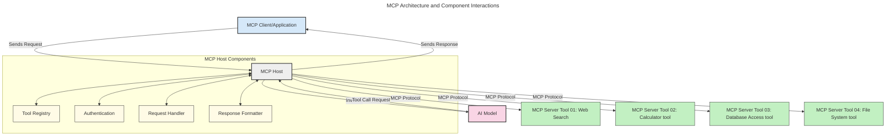

<!--
CO_OP_TRANSLATOR_METADATA:
{
  "original_hash": "0df1ee78a6dd8300f3a040ca5b411c2e",
  "translation_date": "2025-08-19T19:00:42+00:00",
  "source_file": "00-Introduction/README.md",
  "language_code": "my"
}
-->
# မော်ဒယ်အကြောင်းအရာ ပရိုတိုကော (MCP) ကိုမိတ်ဆက်ခြင်း - အကြီးစား AI အက်ပ်များအတွက် အရေးကြီးမှု

_(အထက်ပါပုံကိုနှိပ်ပြီး ဒီသင်ခန်းစာရဲ့ဗီဒီယိုကိုကြည့်ပါ)_

Generative AI အက်ပ်များသည် သုံးစွဲသူများကို သဘာဝဘာသာစကားဖြင့် အလွယ်တကူ အက်ပ်နှင့် အပြန်အလှန်ဆက်သွယ်နိုင်စေသော တိုးတက်မှုကြီးတစ်ခုဖြစ်သည်။ သို့သော်လည်း ဒီလိုအက်ပ်များအတွက် အချိန်နှင့် အရင်းအမြစ်များကို ပိုမိုရင်းနှီးမြှုပ်နှံသည့်အခါတွင်၊ လုပ်ဆောင်ချက်များနှင့် အရင်းအမြစ်များကို အလွယ်တကူ ပေါင်းစည်းနိုင်စေရန်၊ မော်ဒယ်တစ်ခုထက်ပိုမိုအသုံးပြုနိုင်စေရန်နှင့် မော်ဒယ်၏ အထူးပြုလုပ်ဆောင်ချက်များကို ကိုင်တွယ်နိုင်စေရန် သေချာစေရန်လိုအပ်သည်။ အတိုချုပ်အားဖြင့် Generative AI အက်ပ်များကို စတင်ဖန်တီးရန် လွယ်ကူသော်လည်း၊ အက်ပ်များကြီးထွားလာပြီး ရှုပ်ထွေးလာသည့်အခါတွင် အဆောက်အအုံတစ်ခုကို သတ်မှတ်ရန် စတင်လိုအပ်လာပြီး၊ သင့်အက်ပ်များကို တစ်စည်းတည်းဖြစ်စေရန် စံသတ်မှတ်ချက်တစ်ခုကို အားထားရမည်ဖြစ်သည်။ ဒီအချိန်မှာပဲ MCP က အရာများကို စနစ်တကျ စီမံခန့်ခွဲပေးပြီး စံသတ်မှတ်ချက်တစ်ခုကို ပေးစွမ်းနိုင်သည်။

---

## **🔍 မော်ဒယ်အကြောင်းအရာ ပရိုတိုကော (MCP) ဆိုတာဘာလဲ?**

**မော်ဒယ်အကြောင်းအရာ ပရိုတိုကော (MCP)** သည် **ဖွင့်လှစ်ထားသော စံသတ်မှတ်ထားသော အင်တာဖေ့စ်** တစ်ခုဖြစ်ပြီး၊ အကြီးစားဘာသာစကားမော်ဒယ်များ (LLMs) ကို ပြင်ပကိရိယာများ၊ API များနှင့် ဒေတာအရင်းအမြစ်များနှင့် အဆင်ပြေစွာ ဆက်သွယ်နိုင်စေသည်။ ၎င်းသည် AI မော်ဒယ်များ၏ လုပ်ဆောင်နိုင်စွမ်းကို သင်ကြားမှုဒေတာအပြင်ဘက်တွင် တိုးတက်စေပြီး၊ ပိုမိုထက်မြက်သော၊ အတိုင်းအတာကျသော၊ တုံ့ပြန်မှုမြန်သော AI စနစ်များကို ဖန်တီးနိုင်စေသည်။

---

## **🎯 AI တွင် စံသတ်မှတ်ချက်များ အရေးကြီးသောအကြောင်း**

Generative AI အက်ပ်များသည် ပိုမိုရှုပ်ထွေးလာသည့်အခါတွင်၊ **အတိုင်းအတာကျမှု၊ တိုးချဲ့နိုင်မှု၊ ပြုပြင်ထိန်းသိမ်းနိုင်မှု** နှင့် **ရောင်းချသူတစ်ဦးထဲကို မပိတ်မိစေရန်** စံသတ်မှတ်ချက်များကို လက်ခံအသုံးပြုရန် အရေးကြီးသည်။ MCP သည် အောက်ပါလိုအပ်ချက်များကို ဖြေရှင်းပေးသည်-

- မော်ဒယ်နှင့် ကိရိယာများကို တစ်စည်းတည်းဖြစ်စေခြင်း  
- တစ်ခါသုံး၊ မတည်ငြိမ်သော ဖြေရှင်းချက်များကို လျှော့ချခြင်း  
- ကွဲပြားသောရောင်းချသူများမှ မော်ဒယ်များစွာကို တစ်စနစ်တည်းအတွင်းတွင် ရှိစေခြင်း  

**Note:** MCP သည် ဖွင့်လှစ်ထားသော စံသတ်မှတ်ချက်အဖြစ် ကြေငြာထားသော်လည်း၊ IEEE, IETF, W3C, ISO သို့မဟုတ် အခြားစံသတ်မှတ်ချက်အဖွဲ့အစည်းများမှတဆင့် MCP ကို စံသတ်မှတ်ရန် အစီအစဉ်မရှိပါ။

---

## **📚 သင်ယူရမည့် ရည်မှန်းချက်များ**

ဒီဆောင်းပါးကို ဖတ်ပြီးဆုံးသည့်အခါတွင်၊ သင်သည်-

- **မော်ဒယ်အကြောင်းအရာ ပရိုတိုကော (MCP)** နှင့် ၎င်း၏ အသုံးပြုမှုများကို သတ်မှတ်နိုင်မည်  
- MCP သည် မော်ဒယ်နှင့် ကိရိယာများအကြား ဆက်သွယ်မှုကို စံသတ်မှတ်ပုံကို နားလည်မည်  
- MCP အဆောက်အအုံ၏ အဓိကအစိတ်အပိုင်းများကို ဖော်ထုတ်နိုင်မည်  
- MCP ၏ လက်တွေ့အသုံးချမှုများကို စီးပွားရေးနှင့် ဖွံ့ဖြိုးတိုးတက်မှုအခြေအနေများတွင် ရှာဖွေနိုင်မည်  

---

## **💡 မော်ဒယ်အကြောင်းအရာ ပရိုတိုကော (MCP) သည် ဘာကြောင့် အရေးကြီးသလဲ**

### **🔗 MCP သည် AI ဆက်သွယ်မှုများတွင် အပိုင်းပိုင်းဖြစ်မှုကို ဖြေရှင်းပေးသည်**

MCP မရှိမီက၊ မော်ဒယ်များနှင့် ကိရိယာများကို ပေါင်းစည်းရန်အတွက်-

- ကိရိယာနှင့် မော်ဒယ် တစ်စုံတစ်ခုစီအတွက် စိတ်ကြိုက်ကုဒ်ရေးရန်လိုအပ်သည်  
- ရောင်းချသူတစ်ဦးစီအတွက် မစံသတ်မှတ်ထားသော API များကို အသုံးပြုရသည်  
- အဆက်မပြတ် အပ်ဒိတ်များကြောင့် ပြတ်တောက်မှုများဖြစ်ပေါ်သည်  
- ကိရိယာများ ပိုမိုများလာသည့်အခါတွင် အတိုင်းအတာကျမှုမရှိခြင်း  

### **✅ MCP စံသတ်မှတ်ချက်၏ အကျိုးကျေးဇူးများ**

| **အကျိုးကျေးဇူး**          | **ဖော်ပြချက်**                                                                 |
|--------------------------|-----------------------------------------------------------------------------|
| အပြန်အလှန်လုပ်ဆောင်နိုင်မှု | LLM များသည် ကွဲပြားသောရောင်းချသူများမှ ကိရိယာများနှင့် အဆင်ပြေစွာ လုပ်ဆောင်နိုင်သည်         |
| တိကျမှု                  | ပလက်ဖောင်းများနှင့် ကိရိယာများအနှံ့ တူညီသော အပြုအမူကို ရရှိစေသည်                     |
| ပြန်လည်အသုံးပြုနိုင်မှု      | တစ်ကြိမ်တည်း ဖန်တီးထားသော ကိရိယာများကို စီမံကိန်းများနှင့် စနစ်များအနှံ့ အသုံးပြုနိုင်သည်         |
| ဖွံ့ဖြိုးတိုးတက်မှုမြန်ဆန်မှု  | စံသတ်မှတ်ထားသော plug-and-play အင်တာဖေ့စ်များကို အသုံးပြုခြင်းဖြင့် ဖွံ့ဖြိုးတိုးတက်မှုအချိန်ကို လျှော့ချသည် |  

---

## **🧱 MCP အဆောက်အအုံ၏ အထွေထွေအမြင်**

MCP သည် **client-server မော်ဒယ်** ကို လိုက်နာပြီး၊

- **MCP Hosts** သည် AI မော်ဒယ်များကို လည်ပတ်စေသည်  
- **MCP Clients** သည် တောင်းဆိုမှုများကို စတင်သည်  
- **MCP Servers** သည် အကြောင်းအရာ၊ ကိရိယာများနှင့် လုပ်ဆောင်နိုင်စွမ်းများကို ပေးသည်  

### **အဓိကအစိတ်အပိုင်းများ**:

- **အရင်းအမြစ်များ** – မော်ဒယ်များအတွက် အတည်ပြုထားသော ဒေတာ သို့မဟုတ် မတည်ငြိမ်သော ဒေတာ  
- **Prompts** – လမ်းညွှန်မှုများအတွက် ကြိုတင်သတ်မှတ်ထားသော လုပ်ငန်းစဉ်များ  
- **Tools** – ရှာဖွေမှု၊ တွက်ချက်မှုများလိုသည့် လုပ်ဆောင်နိုင်သော function များ  
- **Sampling** – Recursive interactions ဖြင့် အေးဂျင့်အပြုအမူ  

---

## MCP Servers အလုပ်လုပ်ပုံ

MCP servers သည် အောက်ပါအတိုင်း လည်ပတ်သည်-

- **တောင်းဆိုမှုစီးဆင်းမှု**:
    1. အဆုံးသုံးစွဲသူ သို့မဟုတ် ၎င်းတို့အတွက် လုပ်ဆောင်နေသော ဆော့ဖ်ဝဲမှ တောင်းဆိုမှုတစ်ခု စတင်သည်။
    2. **MCP Client** သည် **MCP Host** သို့ တောင်းဆိုမှုကို ပေးပို့ပြီး၊ ၎င်းသည် AI မော်ဒယ် runtime ကို စီမံခန့်ခွဲသည်။
    3. **AI မော်ဒယ်** သည် သုံးစွဲသူ၏ prompt ကို လက်ခံပြီး၊ တစ်ခု သို့မဟုတ် အများအပြား tool calls ဖြင့် ပြင်ပကိရိယာများ သို့မဟုတ် ဒေတာများကို အသုံးပြုရန် တောင်းဆိုနိုင်သည်။
    4. **MCP Host** သည် မော်ဒယ်ကို မဟုတ်ဘဲ၊ စံသတ်မှတ်ထားသော ပရိုတိုကောကို အသုံးပြု၍ သင့်လျော်သော **MCP Server(s)** နှင့် ဆက်သွယ်သည်။
- **MCP Host လုပ်ဆောင်ချက်များ**:
    - **Tool Registry**: ရရှိနိုင်သော ကိရိယာများနှင့် ၎င်းတို့၏ လုပ်ဆောင်နိုင်စွမ်းများကို စာရင်းပြုစုထားသည်။
    - **Authentication**: ကိရိယာအသုံးပြုခွင့်များကို အတည်ပြုသည်။
    - **Request Handler**: မော်ဒယ်မှ လာသော tool requests များကို ကိုင်တွယ်သည်။
    - **Response Formatter**: ကိရိယာ output များကို မော်ဒယ်နားလည်နိုင်သော ပုံစံဖြင့် ဖွဲ့စည်းသည်။
- **MCP Server လုပ်ဆောင်မှု**:
    - **MCP Host** သည် tool calls များကို အထူးလုပ်ဆောင်ချက်များ (ဥပမာ- ရှာဖွေမှု၊ တွက်ချက်မှုများ၊ ဒေတာဘေ့စ် query များ) ကို ပေးသော **MCP Servers** တစ်ခု သို့မဟုတ် အများအပြားသို့ လမ်းညွှန်ပေးသည်။
    - **MCP Servers** သည် ၎င်းတို့၏ လုပ်ဆောင်ချက်များကို ဆောင်ရွက်ပြီး၊ **MCP Host** သို့ အမြဲတမ်းတူညီသော ပုံစံဖြင့် ရလဒ်များကို ပြန်ပေးသည်။
    - **MCP Host** သည် ၎င်းတို့ရလဒ်များကို ဖော်စည်းပြီး **AI မော်ဒယ်** သို့ ပြန်ပေးပို့သည်။
- **တုံ့ပြန်မှု ပြီးဆုံးခြင်း**:
    - **AI မော်ဒယ်** သည် tool outputs များကို နောက်ဆုံးတုံ့ပြန်မှုအတွင်း ထည့်သွင်းသည်။
    - **MCP Host** သည် ဒီတုံ့ပြန်မှုကို **MCP Client** သို့ ပြန်ပေးပြီး၊ ၎င်းသည် အဆုံးသုံးစွဲသူ သို့မဟုတ် တောင်းဆိုနေသော ဆော့ဖ်ဝဲသို့ ပေးပို့သည်။

## 👨‍💻 MCP Server တစ်ခုကို ဘယ်လိုတည်ဆောက်မလဲ (ဥပမာများနှင့်အတူ)

MCP servers သည် LLM ၏ လုပ်ဆောင်နိုင်စွမ်းများကို ဒေတာနှင့် လုပ်ဆောင်ချက်များပေးခြင်းဖြင့် တိုးချဲ့ပေးသည်။

စမ်းသပ်ဖို့ အဆင်သင့်လား? MCP servers တည်ဆောက်ရန်အတွက် အောက်ပါ ဘာသာစကားနှင့်/သို့မဟုတ် stack-specific SDK များနှင့် ဥပမာများကို ကြည့်ပါ-

- **Python SDK**: https://github.com/modelcontextprotocol/python-sdk

- **TypeScript SDK**: https://github.com/modelcontextprotocol/typescript-sdk

- **Java SDK**: https://github.com/modelcontextprotocol/java-sdk

- **C#/.NET SDK**: https://github.com/modelcontextprotocol/csharp-sdk

## 🌍 MCP ၏ လက်တွေ့အသုံးချမှုများ

MCP သည် AI ၏ လုပ်ဆောင်နိုင်စွမ်းများကို တိုးချဲ့ခြင်းဖြင့် အမျိုးမျိုးသော အက်ပ်များကို အကောင်အထည်ဖော်နိုင်စေသည်-

| **လျှောက်လွှာ**               | **ဖော်ပြချက်**                                                                 |
|------------------------------|-----------------------------------------------------------------------------|
| စီးပွားရေးဒေတာပေါင်းစည်းမှု   | LLM များကို ဒေတာဘေ့စ်များ၊ CRM များ သို့မဟုတ် အတွင်းရေးကိရိယာများနှင့် ချိတ်ဆက်ပါ         |
| အေးဂျင့် AI စနစ်များ         | ကိရိယာအသုံးပြုခွင့်နှင့် ဆုံးဖြတ်ချက်လုပ်ငန်းစဉ်များဖြင့် ကိုယ်တိုင်လုပ်ဆောင်နိုင်သော အေးဂျင့်များကို ဖန်တီးပါ |
| Multi-modal အက်ပ်များ        | စာသား၊ ပုံနှင့် အသံကိရိယာများကို တစ်ခုတည်းသော AI အက်ပ်အတွင်း ပေါင်းစည်းပါ            |
| အချိန်နှင့်တပြေးညီ ဒေတာပေါင်းစည်းမှု | AI ဆက်သွယ်မှုများအတွက် ပိုမိုတိကျသော၊ လက်ရှိအချက်အလက်များကို ပေးပါ                     |

### 🧠 MCP = AI ဆက်သွယ်မှုများအတွက် အထွေထွေစံ

မော်ဒယ်အကြောင်းအရာ ပရိုတိုကော (MCP) သည် AI ဆက်သွယ်မှုများအတွက် အထွေထွေစံအဖြစ် လုပ်ဆောင်သည်။ USB-C သည် စက်ပစ္စည်းများအတွက် ရုပ်ပိုင်းဆိုင်ရာ ချိတ်ဆက်မှုများကို စံသတ်မှတ်ပုံတူပင် MCP သည် မော်ဒယ်များ (clients) ကို ပြင်ပကိရိယာများနှင့် ဒေတာပေးသွင်းသူများ (servers) နှင့် အဆင်ပြေစွာ ပေါင်းစည်းနိုင်စေသော တစ်စည်းတည်းသော အင်တာဖေ့စ်ကို ပေးသည်။ ၎င်းသည် API သို့မဟုတ် ဒေတာအရင်းအမြစ် တစ်ခုစီအတွက် ကွဲပြားသော စိတ်ကြိုက်ပရိုတိုကောများလိုအပ်မှုကို ဖယ်ရှားပေးသည်။

MCP အောက်တွင်၊ MCP ကိုက်ညီသော tool (MCP server ဟုခေါ်သည်) သည် တစ်စည်းတည်းသော စံသတ်မှတ်ချက်ကို လိုက်နာသည်။ ၎င်း server များသည် ၎င်းတို့ပေးသော ကိရိယာများ သို့မဟုတ် လုပ်ဆောင်ချက်များကို စာရင်းပြုစုပြီး၊ AI အေးဂျင့်တစ်ခုမှ တောင်းဆိုသည့်အခါ ၎င်းတို့ကို ဆောင်ရွက်ပေးနိုင်သည်။ MCP ကို ပံ့ပိုးသော AI အေးဂျင့်ပလက်ဖောင်းများသည် server များမှ ရရှိနိုင်သော ကိရိယာများကို ရှာဖွေပြီး၊ ဒီစံသတ်မှတ်ထားသော ပရိုတိုကောမှတဆင့် ၎င်းတို့ကို ခေါ်ယူနိုင်သည်။

### 💡 အသိပညာရရှိမှုကို လွယ်ကူစေသည်

ကိရိယာများပေးခြင်းအပြင်၊ MCP သည် အသိပညာရရှိမှုကိုလည်း လွယ်ကူစေသည်။ ၎င်းသည် AI အက်ပ်များကို အကြီးစားဘာသာစကားမော်ဒယ်များ (LLMs) သို့ အကြောင်းအရာပေးနိုင်စေရန် ဒေတာအရင်းအမြစ်များနှင့် ချိတ်ဆက်ပေးသည်။ ဥပမာအားဖြင့်၊ MCP server တစ်ခုသည် ကုမ္ပဏီ၏ စာရွက်စာတမ်းသိုလှောင်မှုကို ကိုယ်စားပြုနိုင်ပြီး၊ အေးဂျင့်များကို လိုအပ်သောအချက်အလက်များကို တောင်းဆိုမှုအပေါ်မူတည်၍ ပြန်ပေးနိုင်သည်။ အခြား server တစ်ခုသည် အီးမေးလ်ပို့ခြင်း သို့မဟုတ် မှတ်တမ်းများကို အပ်ဒိတ်လုပ်ခြင်းကဲ့သို့သော အထူးလုပ်ဆောင်ချက်များကို ကိုင်တွယ်နိုင်သည်။ အေးဂျင့်၏အမြင်အရ၊ ၎င်းတို့သည် အသုံးပြုနိုင်သော tool များသာဖြ

**အကြောင်းကြားချက်**:  
ဤစာရွက်စာတမ်းကို AI ဘာသာပြန်ဝန်ဆောင်မှု [Co-op Translator](https://github.com/Azure/co-op-translator) ကို အသုံးပြု၍ ဘာသာပြန်ထားပါသည်။ ကျွန်ုပ်တို့သည် တိကျမှုအတွက် ကြိုးစားနေသော်လည်း၊ အလိုအလျောက် ဘာသာပြန်မှုများတွင် အမှားများ သို့မဟုတ် မတိကျမှုများ ပါဝင်နိုင်သည်ကို သတိပြုပါ။ မူရင်းစာရွက်စာတမ်းကို ၎င်း၏ မူရင်းဘာသာစကားဖြင့် အာဏာတရ အရင်းအမြစ်အဖြစ် သတ်မှတ်သင့်ပါသည်။ အရေးကြီးသော အချက်အလက်များအတွက် လူက ဘာသာပြန်မှုကို အသုံးပြုရန် အကြံပြုပါသည်။ ဤဘာသာပြန်မှုကို အသုံးပြုခြင်းမှ ဖြစ်ပေါ်လာသော အလွဲအမှားများ သို့မဟုတ် အနားယူမှုများအတွက် ကျွန်ုပ်တို့သည် တာဝန်မယူပါ။