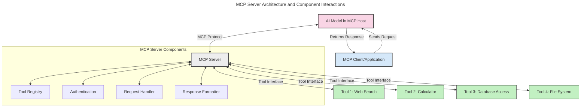
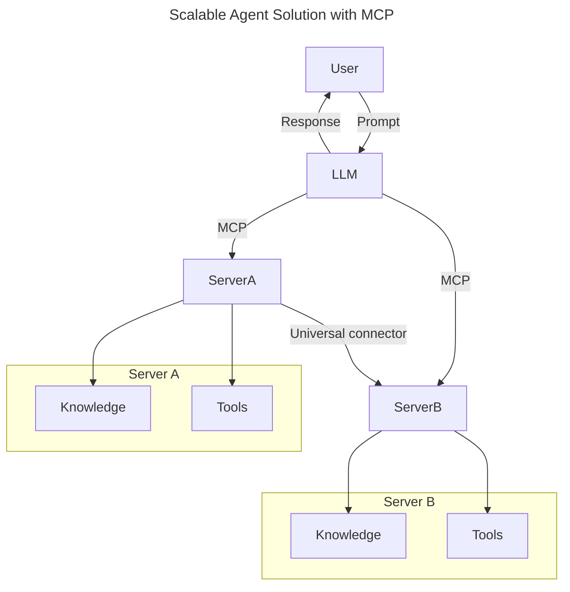
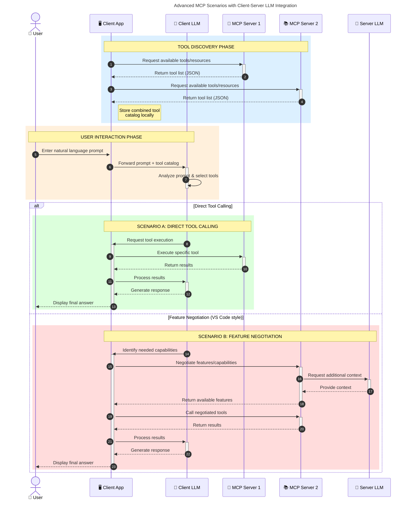

<!--
CO_OP_TRANSLATOR_METADATA:
{
  "original_hash": "1446979020432f512c883848d7eca144",
  "translation_date": "2025-06-17T16:24:12+00:00",
  "source_file": "00-Introduction/README.md",
  "language_code": "my"
}
-->
# Model Context Protocol (MCP) အကြောင်းအရာသိရှိမှု: Scalable AI Applications အတွက် အရေးကြီးတဲ့ အကြောင်း

Generative AI applications တွေဟာ သဘာဝဘာသာစကားနဲ့ အသုံးပြုသူတွေကို အလွယ်တကူ ဆက်သွယ်နိုင်စေတဲ့ အဆင့်မြှင့်တင်မှုတစ်ခုဖြစ်ပါတယ်။ သို့သော် ဒီလို application တွေမှာ အချိန်နဲ့ အရင်းအမြစ်များပိုမိုရင်းနှီးလာတာနဲ့အမျှ၊ လုပ်ဆောင်ချက်တွေနဲ့ အရင်းအမြစ်တွေကို အလွယ်တကူ ပေါင်းစပ်နိုင်ပြီး၊ တိုးချဲ့နိုင်ပြီး၊ မျိုးစုံသော မော်ဒယ်များကို ထောက်ပံ့နိုင်ဖို့လိုအပ်ပါတယ်။ ရိုးရိုး Gen AI apps တွေကို စတင်ဖန်တီးရတာ လွယ်ကူပေမယ့်၊ ကြီးထွားလာပြီး ရှုပ်ထွေးလာတာနဲ့အမျှ အဆောက်အအုံတစ်ခုကို သတ်မှတ်ဖို့ လိုလာပြီး၊ application တွေကို တူညီတဲ့ စံနှုန်းနဲ့ တည်ဆောက်ဖို့ လိုအပ်လာပါတယ်။ ဒီမှာ MCP က အရာတွေကို စနစ်တကျ စီမံခန့်ခွဲပေးပြီး စံချိန်စံညွှန်းတစ်ခုအဖြစ် ပါဝင်လာတာဖြစ်ပါတယ်။

---

## **🔍 Model Context Protocol (MCP) ဆိုတာဘာလဲ?**

**Model Context Protocol (MCP)** ဆိုတာကတော့ **အဖွင့်၊ စံနှုန်းသတ်မှတ်ထားသော အင်တာဖေ့စ်တစ်ခုဖြစ်ပြီး** Large Language Models (LLMs) တွေကို အခြားကိရိယာများ၊ API များနဲ့ ဒေတာရင်းမြစ်များနဲ့ ပြတ်သားစွာ ဆက်သွယ်နိုင်စေပါတယ်။ ဒီကိရိယာက AI မော်ဒယ်တွေကို သင်ကြားမှုဒေတာအပြင်ပိုင်းမှာ လုပ်ဆောင်နိုင်စွမ်းတိုးမြှင့်ပေးပြီး ပိုမိုစမတ်၊ တိုးချဲ့နိုင်ပြီး တုံ့ပြန်မှုမြန်ဆန်တဲ့ AI စနစ်တွေ ဖန်တီးနိုင်စေပါတယ်။

---

## **🎯 AI တွင် စံချိန်စံညွှန်းအရေးကြီးတဲ့အကြောင်း**

Generative AI application တွေ ရှုပ်ထွေးလာတာနဲ့အမျှ၊ **တိုးချဲ့နိုင်မှု၊ တိုးမြှင့်နိုင်မှု၊ ထိန်းသိမ်းနိုင်မှု** အတွက် စံချိန်စံညွှန်းတွေ အသုံးပြုဖို့ မရှိမဖြစ်လိုအပ်လာပါတယ်။ MCP က ဒီလိုလိုအပ်ချက်တွေကို ဖြေရှင်းပေးပါတယ် -

- မော်ဒယ်နဲ့ ကိရိယာပေါင်းစပ်မှုကို စုပေါင်းတည်းဖြတ်ခြင်း
- တစ်ခါတည်း အသုံးပြုတဲ့ မတည်ငြိမ်တဲ့ ဖြေရှင်းနည်းတွေ လျော့နည်းစေခြင်း
- မော်ဒယ်များစွာကို တစ် ecosystem အတွင်းတည်း တည်ရှိနိုင်စေခြင်း

---

## **📚 သင်ယူရမည့် အချက်များ**

ဒီဆောင်းပါးအဆုံးသတ်တဲ့အခါမှာ -

- **Model Context Protocol (MCP)** ကို သတ်မှတ်နိုင်မည်နှင့် အသုံးပြုမှုများကို နားလည်နိုင်မည်
- MCP က မော်ဒယ်နဲ့ ကိရိယာ ဆက်သွယ်မှုကို ဘယ်လို စံချိန်စံညွှန်းတင်ထားသည်ကို နားလည်နိုင်မည်
- MCP architecture ၏ အဓိက အစိတ်အပိုင်းများကို ဖော်ထုတ်နိုင်မည်
- စီးပွားရေးနှင့် ဖွံ့ဖြိုးတိုးတက်မှုအတွက် MCP ၏ အကောင်အထည်ဖော်မှုများကို ရှာဖွေနိုင်မည်

---

## **💡 Model Context Protocol (MCP) သည် ဘာကြောင့် Game-Changer ဖြစ်သနည်း**

### **🔗 MCP က AI ဆက်သွယ်မှုများရှိ ခွဲခြားမှုကို ဖြေရှင်းပေးသည်**

MCP မရှိခင်မှာ မော်ဒယ်နဲ့ ကိရိယာတွေ ပေါင်းစပ်ဖို့ -

- ကိရိယာနဲ့ မော်ဒယ် တစ်စုံတစ်ခုစီအတွက် ကိုယ်ပိုင်ကုဒ်ရေးဖို့လိုသည်
- Vendor တစ်ဦးချင်းစီအတွက် မစံနှုန်းမဲ့ API များရှိသည်
- Update များကြောင့် အကြိမ်ကြိမ် ချိုးဖောက်မှုများဖြစ်ပေါ်သည်
- ကိရိယာများ ပိုမိုတိုးလာတာနဲ့အမျှ တိုးချဲ့မှု မကောင်းစေ

### **✅ MCP စံချိန်စံညွှန်းအကျိုးကျေးဇူးများ**

| **အကျိုးကျေးဇူး**          | **ဖော်ပြချက်**                                                                |
|----------------------------|------------------------------------------------------------------------------|
| ပေါင်းစည်းဆက်သွယ်မှု       | LLM များကို ကွဲပြားသော vendor များ၏ ကိရိယာများနှင့် ပြတ်သားစွာ လုပ်ဆောင်နိုင်စေခြင်း |
| တူညီမှု                   | ပလက်ဖောင်းနှင့် ကိရိယာများအတွင်း တူညီသော လုပ်ဆောင်မှု                       |
| ပြန်လည်အသုံးပြုနိုင်မှု     | တစ်ကြိမ်တည်း ဖန်တီးထားသော ကိရိယာများကို ပရောဂျက်များနှင့် စနစ်များအတွင်း အသုံးပြုနိုင်ခြင်း |
| ဖွံ့ဖြိုးတိုးတက်မှု မြန်ဆန်ခြင်း | စံချိန်စံညွှန်းပြု plug-and-play အင်တာဖေ့စ်များ အသုံးပြုခြင်းဖြင့် ဖွံ့ဖြိုးမှုအချိန် လျှော့ချနိုင်ခြင်း |

---

## **🧱 MCP Architecture အဆင့်မြင့် အကျဉ်းချုပ်**

MCP သည် **client-server မော်ဒယ်** ကိုလိုက်နာပြီး -

- **MCP Hosts** မှ AI မော်ဒယ်များကို လည်ပတ်စေသည်
- **MCP Clients** မှ တောင်းဆိုမှုများ စတင်ပေးသည်
- **MCP Servers** မှ context, tools, နှင့် စွမ်းရည်များကို ပေးဆောင်သည်

### **အဓိက အစိတ်အပိုင်းများ**

- **Resources** – မော်ဒယ်များအတွက် တည်ငြိမ် သို့မဟုတ် အပြောင်းအလဲရှိသော ဒေတာများ  
- **Prompts** – ဦးတည်ချက်ပေးထားသော workflow များ  
- **Tools** – ရှာဖွေမှု၊ တွက်ချက်မှု စသည့် လုပ်ဆောင်နိုင်သော function များ  
- **Sampling** – မော်ဒယ်အပြန်အလှန် ဆက်သွယ်မှုများမှ တစ်ဆင့် လုပ်ဆောင်မှုအပြုအမူ

---

## MCP Servers များ ဘယ်လို လည်ပတ်ကြသလဲ

MCP servers တွေ လည်ပတ်ပုံ -

- **တောင်းဆိုမှု လည်ပတ်မှု**:  
    1. MCP Client က MCP Host မှာ လည်ပတ်နေသော AI Model ထံ တောင်းဆိုမှု ပို့သည်။  
    2. AI Model က အပြင်ကိရိယာများ သို့မဟုတ် ဒေတာလိုအပ်သည်ကို သတိပြုသည်။  
    3. မော်ဒယ်က MCP Server နဲ့ စံချိန်စံညွှန်း protocol ကို အသုံးပြု ဆက်သွယ်သည်။

- **MCP Server ၏ လုပ်ဆောင်ချက်များ**:  
    - Tool Registry: ရနိုင်သော ကိရိယာများနှင့် ၎င်းတို့၏ စွမ်းရည်များကို စာရင်းသွင်းထားသည်။  
    - Authentication: ကိရိယာ အသုံးပြုခွင့်များကို စစ်ဆေးသည်။  
    - Request Handler: မော်ဒယ်မှ တောင်းဆိုချက်များကို ဆက်လက် စီမံသည်။  
    - Response Formatter: ကိရိယာ output များကို မော်ဒယ် နားလည်နိုင်သော ပုံစံသို့ ပြင်ဆင်ပေးသည်။

- **ကိရိယာ အကောင်အထည်ဖော်မှု**:  
    - Server က တောင်းဆိုမှုများကို သင့်တော်သော ကိရိယာများသို့ လမ်းညွှန်ပေးသည်။  
    - ကိရိယာများက ရှာဖွေမှု၊ တွက်ချက်မှု၊ ဒေတာဘေ့စ် စစ်ဆေးမှု စသည့် လုပ်ဆောင်ချက်များကို ဆောင်ရွက်သည်။  
    - ရလဒ်များကို စံချိန်စံညွှန်း ပုံစံဖြင့် မော်ဒယ်ထံ ပြန်ပို့သည်။

- **တုံ့ပြန်မှု ပြီးစီးခြင်း**:  
    - AI မော်ဒယ်က ကိရိယာ output များကို သူ့တုံ့ပြန်မှုထဲ ထည့်သွင်းသည်။  
    - နောက်ဆုံး တုံ့ပြန်မှုကို client application သို့ ပြန်ပို့သည်။

## 👨‍💻 MCP Server တည်ဆောက်နည်း (ဥပမာများနှင့်)

MCP servers တွေက LLM စွမ်းရည်များကို ဒေတာနဲ့ လုပ်ဆောင်ချက်များ ဖြည့်စွက်ပေးနိုင်ပါတယ်။

စတင်ကြည့်ချင်ပါသလား? ဘာသာစကားအမျိုးမျိုးဖြင့် အလွယ်တကူ MCP server တစ်ခု ဖန်တီးနည်း ဥပမာများက -

- **Python ဥပမာ**: https://github.com/modelcontextprotocol/python-sdk

- **TypeScript ဥပမာ**: https://github.com/modelcontextprotocol/typescript-sdk

- **Java ဥပမာ**: https://github.com/modelcontextprotocol/java-sdk

- **C#/.NET ဥပမာ**: https://github.com/modelcontextprotocol/csharp-sdk

## 🌍 MCP ၏ လက်တွေ့အသုံးပြုမှုများ

MCP က AI စွမ်းရည်များ တိုးချဲ့ပေးခြင်းဖြင့် အမျိုးမျိုးသော application များအတွက် အခွင့်အလမ်းပေးသည်။

| **အသုံးပြုမှု**             | **ဖော်ပြချက်**                                                                 |
|------------------------------|--------------------------------------------------------------------------------|
| စီးပွားရေး ဒေတာပေါင်းစည်းမှု | LLM များကို ဒေတာဘေ့စ်၊ CRM များ သို့မဟုတ် အတွင်းရေးကိရိယာများနှင့် ချိတ်ဆက်ပေးခြင်း        |
| Agentic AI စနစ်များ          | ကိရိယာအသုံးပြုခွင့်နှင့် ဆုံးဖြတ်ချက် လုပ်ငန်းစဉ်များ ပါဝင်သော အလိုအလျောက် လုပ်ဆောင်သူများ ဖန်တီးခြင်း  |
| Multi-modal Applications      | စာသား၊ ပုံရိပ်နှင့် အသံကိရိယာများကို တစ်ခုတည်းသော AI application အတွင်း ပေါင်းစပ်အသုံးပြုခြင်း          |
| အချိန်နဲ့တပြေးညီ ဒေတာ ပေါင်းစည်းမှု | AI ဆက်သွယ်မှုများအတွက် တိကျပြီး လက်ရှိ ဒေတာများ ပေးဆောင်နိုင်ခြင်း                                  |

### 🧠 MCP = AI ဆက်သွယ်မှုများအတွက် အထွေထွေ စံချိန်စံညွှန်း

Model Context Protocol (MCP) က AI ဆက်သွယ်မှုများအတွက် အထွေထွေ စံချိန်စံညွှန်းတစ်ခုလိုပါပဲ၊ USB-C က စက်ပစ္စည်းတွေအတွက် ဖိဇစ်ဆက်သွယ်မှုကို စံချိန်တင်ပေးလိုက်သလိုပါပဲ။ AI ကမ္ဘာမှာ MCP က မော်ဒယ် (client) တွေကို အခြားကိရိယာများနဲ့ ဒေတာပေးသူများ (server) တွေနဲ့ ပြတ်သားစွာ ပေါင်းစည်းနိုင်အောင် interface တစ်ခု ပေးပါတယ်။ ဒါကြောင့် API တစ်ခုချင်းစီ သို့မဟုတ် ဒေတာရင်းမြစ်တစ်ခုချင်းစီအတွက် မတူညီတဲ့ ကိုယ်ပိုင် protocol မလိုတော့ပဲ ဖြစ်လာပါတယ်။

MCP ကို ထောက်ခံတဲ့ ကိရိယာတစ်ခု (MCP server ဟုခေါ်) သည် စံချိန်စံညွှန်းတစ်ခုကို လိုက်နာပြီး၊ ၎င်းက ပေးနိုင်တဲ့ ကိရိယာများ သို့မဟုတ် လုပ်ဆောင်ချက်များကို စာရင်းပြုစုထားပြီး AI agent မှ တောင်းဆိုလာသောအခါ လုပ်ဆောင်ပေးနိုင်ပါတယ်။ MCP ကို ထောက်ခံတဲ့ AI agent platform များက Server များမှ ရနိုင်သော ကိရိယာများကို ရှာဖွေပြီး ဒီစံချိန်စံညွှန်းဖြင့် ခေါ်ယူနိုင်ပါတယ်။

### 💡 အသိပညာရရှိမှုကို ပိုမိုလွယ်ကူစေခြင်း

ကိရိယာပေးခြင်းအပြင် MCP က အသိပညာရရှိမှုကိုလည်း ပိုမိုကောင်းမွန်စွာ ထောက်ပံ့ပေးပါတယ်။ MCP က applications တွေကို LLM များအတွက် context ပေးဖို့ အခွင့်အလမ်းပေးပြီး၊ မျိုးစုံသော ဒေတာရင်းမြစ်များနှင့် ချိတ်ဆက်ပေးနိုင်ပါတယ်။ ဥပမာအားဖြင့် MCP server တစ်ခုက ကုမ္ပဏီ၏ စာရွက်စာတမ်းစုစည်းမှုကို ကိုယ်စားပြုနိုင်ပြီး agent တွေက လိုအပ်သလို သတင်းအချက်အလက် ရယူနိုင်ပါတယ်။ အခြား server တစ်ခုက အီးမေးလ်ပို့ခြင်း သို့မဟုတ် မှတ်တမ်းများ update လုပ်ခြင်း စသည့် အထူး လုပ်ဆောင်ချက်များကို ကိုင်တွယ်နိုင်ပါတယ်။ Agent အနေနဲ့ ဒီကိရိယာတွေကို အသုံးပြုနိုင်တဲ့ ကိရိယာများအဖြစ်သာ မြင်တယ် - တချို့က ဒေတာ (အသိပညာ context) ပြန်ပေးပြီး တချို့က လုပ်ဆောင်ချက်များ ဆောင်ရွက်ပေးတယ်။ MCP က ဒီနှစ်မျိုးကို ထိန်းသိမ်းစီမံပေးနိုင်ပါတယ်။

Agent တစ်ခုက MCP server နဲ့ ချိတ်ဆက်တဲ့အခါ server ရဲ့ ရနိုင်သော စွမ်းရည်များနဲ့ အသုံးပြုနိုင်သော ဒေတာများကို စံချိန်စံညွှန်း ပုံစံတစ်ခုနဲ့ အလိုအလျောက် လေ့လာသိရှိသွားပါတယ်။ ဒီစံချိန်စံညွှန်းက ကိရိယာရရှိနိုင်မှုကို ဒိုင်နမစ်ဖြစ်စေပါတယ်။ ဥပမာအားဖြင့် Agent ၏ စနစ်ထဲသို့ MCP server အသစ်တစ်ခု ထည့်သွင်းလိုက်တာနဲ့ တိုက်ရိုက် အသုံးပြုနိုင်သွားပြီး Agent ၏ လမ်းညွှန်ချက်များ ပြင်ဆင်ရန် မလိုတော့ပါ။

ဒီလို ပေါင်းစည်းမှုက mermaid diagram တွင် ဖော်ပြထားသလို server များက ကိရိယာတွေနဲ့ အသိပညာ နှစ်မျိုးစလုံး ပေးဆောင်ပြီး စနစ်အတွင်း အဆင်ပြေစွာ ပူးပေါင်းဆောင်ရွက်နိုင်စေပါတယ်။

### 👉 ဥပမာ - Scalable Agent ဖြေရှင်းချက်

### 🔄 Client-Side LLM Integration ပါဝင်သည့် အဆင့်မြင့် MCP ဇာတ်လမ်းများ

အခြေခံ MCP architecture ထက် ပိုပြီး client နဲ့ server နှစ်ဖက်စလုံးမှာ LLM များပါဝင်တဲ့ အဆင့်မြင့် သဘောတရားတွေရှိပါတယ် -

## 🔐 MCP အသုံးပြုမှု၏ လက်တွေ့ အကျိုးကျေးဇူးများ

MCP အသုံးပြုခြင်း၏ လက်တွေ့အကျိုးကျေးဇူးများမှာ -

- **နောက်ဆုံးပေါ်အချက်အလက်ရရှိမှု**: မော်ဒယ်များသည် သင်ကြားမှုဒေတာအပြင် လက်ရှိသတင်းအချက်အလက်များကိုလည်း ရယူနိုင်သည်  
- **စွမ်းရည်တိုးချဲ့မှု**: မသင်ကြားရသည့် လုပ်ငန်းများအတွက် အထူးကိရိယာများကို အသုံးပြုနိုင်ခြင်း  
- **မှားယွင်းချက် လျော့နည်းခြင်း**: ပြင်ပ ဒေတာရင်းမြစ်များက တိကျမှန်ကန်မှုကို ပံ့ပိုးပေးခြင်း  
- **ကိုယ်ရေးအချက်အလက် ကာကွယ်မှု**: အရေးကြီးသော ဒေတာများကို prompt များထဲ ထည့်သွင်းခြင်းမပြုဘဲ လုံခြုံစွာ ထိန်းသိမ်းနိုင်ခြင်း

## 📌 အဓိက သင်ခန်းစာများ

MCP အသုံးပြုရာတွင် အဓိက သင်ခန်းစာများမှာ -

- **MCP

**သတိပေးချက်**:  
ဤစာတမ်းကို AI ဘာသာပြန်ဝန်ဆောင်မှု [Co-op Translator](https://github.com/Azure/co-op-translator) ဖြင့် ဘာသာပြန်ထားပါသည်။ ကျွန်ုပ်တို့သည် တိကျမှန်ကန်မှုအတွက် ကြိုးစားနေသော်လည်း၊ အလိုအလျောက် ဘာသာပြန်ချက်များတွင် အမှားများ သို့မဟုတ် မှားယွင်းမှုများ ပါဝင်နိုင်ကြောင်း သတိပြုပါရန် မေတ္တာရပ်ခံအပ်ပါသည်။ မူရင်းစာတမ်းကို မူလဘာသာဖြင့်သာ တရားဝင်အချက်အလက်အရင်းအမြစ်အဖြစ် သတ်မှတ်ရန် လိုအပ်ပါသည်။ အရေးကြီးသော အချက်အလက်များအတွက် မျက်မှောက်လူသားဘာသာပြန်ခြင်းကို အကြံပြုပါသည်။ ဤဘာသာပြန်ချက်ကို အသုံးပြုခြင်းကြောင့် ဖြစ်ပေါ်နိုင်သည့် နားလည်မှုမှားယွင်းမှုများ သို့မဟုတ် မှားယွင်းဖော်ပြချက်များအတွက် ကျွန်ုပ်တို့ တာဝန်မယူပါ။