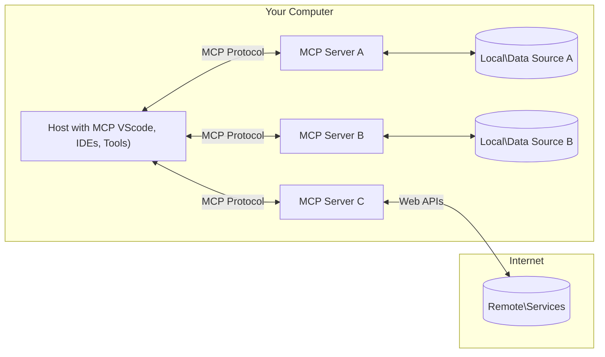

<!--
CO_OP_TRANSLATOR_METADATA:
{
  "original_hash": "355b12a5970c5c9e6db0bee970c751ba",
  "translation_date": "2025-07-13T16:29:05+00:00",
  "source_file": "01-CoreConcepts/README.md",
  "language_code": "my"
}
-->
# 📖 MCP အခြေခံအယူအဆများ: AI ပေါင်းစည်းမှုအတွက် Model Context Protocol ကို ကျွမ်းကျင်စွာ အသုံးပြုခြင်း

[Model Context Protocol (MCP)](https://github.com/modelcontextprotocol) သည် ကြီးမားသောဘာသာစကားမော်ဒယ်များ (LLMs) နှင့် ပြင်ပကိရိယာများ၊ အက်ပလီကေးရှင်းများ၊ ဒေတာရင်းမြစ်များအကြား ဆက်သွယ်မှုကို ထိရောက်စွာ စနစ်တကျ ပြုလုပ်ပေးနိုင်သော အင်အားကြီးပြီး စံသတ်မှတ်ထားသော ဖရိမ်ဝေါ့ခ်ဖြစ်သည်။ ဒီ SEO အတွက် အကောင်းဆုံး လမ်းညွှန်စာအုပ်က MCP ၏ အခြေခံအယူအဆများကို ရှင်းပြပေးမှာဖြစ်ပြီး၊ ၎င်း၏ client-server ဖွဲ့စည်းပုံ၊ အရေးကြီးသော အစိတ်အပိုင်းများ၊ ဆက်သွယ်မှုနည်းလမ်းများနှင့် အကောင်းဆုံး လက်တွေ့အသုံးပြုနည်းများကို နားလည်စေပါလိမ့်မယ်။

## အနှစ်ချုပ်

ဒီသင်ခန်းစာမှာ Model Context Protocol (MCP) စနစ်၏ အခြေခံဖွဲ့စည်းပုံနှင့် အစိတ်အပိုင်းများကို လေ့လာသွားမှာဖြစ်သည်။ MCP ဆက်သွယ်မှုများကို အားပေးသော client-server ဖွဲ့စည်းပုံ၊ အဓိကအစိတ်အပိုင်းများနှင့် ဆက်သွယ်မှုနည်းလမ်းများကို သင်ယူရမည်ဖြစ်သည်။

## 👩‍🎓 အဓိက သင်ယူရမည့် ရည်မှန်းချက်များ

ဒီသင်ခန်းစာပြီးဆုံးချိန်မှာ သင်သည် -

- MCP client-server ဖွဲ့စည်းပုံကို နားလည်နိုင်မည်။
- Hosts, Clients, Servers တို့၏ တာဝန်များနှင့် အခန်းကဏ္ဍများကို ဖော်ထုတ်နိုင်မည်။
- MCP ကို ပေါင်းစည်းမှုအလွယ်တကူဖြစ်စေသော အဓိက လက္ခဏာများကို ခွဲခြမ်းစိတ်ဖြာနိုင်မည်။
- MCP စနစ်အတွင်း သတင်းအချက်အလက်များ ဘယ်လို လည်ပတ်သွားသည်ကို သင်ယူနိုင်မည်။
- .NET, Java, Python, JavaScript တို့တွင် ကုဒ်နမူနာများမှတဆင့် လက်တွေ့ အမြင်ရရှိနိုင်မည်။

## 🔎 MCP ဖွဲ့စည်းပုံ: နက်ရှိုင်းစွာ ကြည့်ရှုခြင်း

MCP စနစ်သည် client-server မော်ဒယ်ပေါ်တွင် တည်ဆောက်ထားသည်။ ဒီ modular ဖွဲ့စည်းပုံက AI အက်ပလီကေးရှင်းများကို ကိရိယာများ၊ ဒေတာဘေ့စ်များ၊ API များနှင့် context အရင်းအမြစ်များနှင့် ထိရောက်စွာ ဆက်သွယ်နိုင်စေသည်။ ဒီဖွဲ့စည်းပုံကို အဓိကအစိတ်အပိုင်းများအဖြစ် ခွဲခြမ်းကြည့်ကြမယ်။

MCP သည် client-server ဖွဲ့စည်းပုံကို လိုက်နာပြီး host application တစ်ခုက server များစွာနှင့် ချိတ်ဆက်နိုင်သည်။



- **MCP Hosts**: VSCode, Claude Desktop, IDE များ သို့မဟုတ် MCP မှတဆင့် ဒေတာရယူလိုသော AI ကိရိယာများကဲ့သို့သော ပရိုဂရမ်များ
- **MCP Clients**: server များနှင့် 1:1 ချိတ်ဆက်မှုကို ထိန်းသိမ်းထားသော protocol clients များ
- **MCP Servers**: စံသတ်မှတ်ထားသော Model Context Protocol ဖြင့် အထူးစွမ်းရည်များကို ဖော်ပြပေးသော အလေးချိန်နည်းသော ပရိုဂရမ်များ
- **Local Data Sources**: သင့်ကွန်ပျူတာတွင်ရှိသော ဖိုင်များ၊ ဒေတာဘေ့စ်များနှင့် ဝန်ဆောင်မှုများကို MCP servers များက လုံခြုံစွာ ဝင်ရောက်အသုံးပြုနိုင်သည်
- **Remote Services**: အင်တာနက်မှတဆင့် ရရှိနိုင်သော ပြင်ပစနစ်များကို MCP servers များက API များဖြင့် ချိတ်ဆက်နိုင်သည်။

MCP Protocol သည် တိုးတက်နေဆဲ စံသတ်မှတ်ချက်ဖြစ်ပြီး နောက်ဆုံးအပ်ဒိတ်များကို [protocol specification](https://modelcontextprotocol.io/specification/2025-06-18/) တွင် ကြည့်ရှုနိုင်ပါသည်။

### 1. Hosts

Model Context Protocol (MCP) တွင် Hosts သည် အသုံးပြုသူများ protocol နှင့် ဆက်သွယ်ရာတွင် အဓိက အင်တာဖေ့စ်အဖြစ် အရေးပါသည်။ Hosts သည် MCP servers များနှင့် ချိတ်ဆက်၍ ဒေတာ၊ ကိရိယာများနှင့် prompt များကို ရယူရန် စတင်ဆောင်ရွက်သော အက်ပလီကေးရှင်းများ သို့မဟုတ် ပတ်ဝန်းကျင်များဖြစ်သည်။ ဥပမာအားဖြင့် Visual Studio Code ကဲ့သို့သော integrated development environments (IDEs), Claude Desktop ကဲ့သို့သော AI ကိရိယာများ သို့မဟုတ် အထူးတာဝန်များအတွက် ဖန်တီးထားသော custom-built agents များ ပါဝင်သည်။

**Hosts** သည် LLM applications ဖြစ်ပြီး ချိတ်ဆက်မှုများကို စတင်ဆောင်ရွက်သည်။ ၎င်းတို့သည် -

- AI မော်ဒယ်များနှင့် ဆက်သွယ်၍ တုံ့ပြန်ချက်များ ထုတ်ပေးသည်။
- MCP servers များနှင့် ချိတ်ဆက်မှုများ စတင်ဆောင်ရွက်သည်။
- စကားပြောစီးဆင်းမှုနှင့် အသုံးပြုသူ အင်တာဖေ့စ်ကို စီမံခန့်ခွဲသည်။
- ခွင့်ပြုချက်နှင့် လုံခြုံရေး ကန့်သတ်ချက်များကို ထိန်းချုပ်သည်။
- ဒေတာမျှဝေခြင်းနှင့် ကိရိယာများ အသုံးပြုခြင်းအတွက် အသုံးပြုသူ၏ သဘောတူညီချက်ကို ကိုင်တွယ်သည်။

### 2. Clients

Clients သည် Hosts နှင့် MCP servers များအကြား ဆက်သွယ်မှုကို အဆင်ပြေစေသော အရေးပါသော အစိတ်အပိုင်းများဖြစ်သည်။ Clients သည် အလယ်အလတ်အဖြစ် လုပ်ဆောင်ကာ Hosts များကို MCP servers များမှ ပေးသော လုပ်ဆောင်ချက်များကို အသုံးပြုခွင့်ပေးသည်။ MCP ဖွဲ့စည်းပုံအတွင်း ဆက်သွယ်မှုနှင့် ဒေတာလဲလှယ်မှုများကို ပြေလည်စေသည်။

**Clients** သည် host application အတွင်း ချိတ်ဆက်သူများဖြစ်သည်။ ၎င်းတို့သည် -

- prompt/ညွှန်ကြားချက်များနှင့် server များသို့ တောင်းဆိုမှုများ ပို့သည်။
- server များနှင့် စွမ်းရည်များကို ညှိနှိုင်းဆွေးနွေးသည်။
- မော်ဒယ်များမှ ကိရိယာများ အသုံးပြုရန် တောင်းဆိုမှုများကို စီမံခန့်ခွဲသည်။
- တုံ့ပြန်ချက်များကို အသုံးပြုသူထံ ပြသသည်။

### 3. Servers

Servers သည် MCP clients များမှ တောင်းဆိုမှုများကို ကိုင်တွယ်ပြီး သင့်တော်သော တုံ့ပြန်ချက်များ ပေးသည်။ ဒေတာ ရယူခြင်း၊ ကိရိယာများ အသုံးပြုခြင်း၊ prompt များ ဖန်တီးခြင်း စသည့် လုပ်ဆောင်ချက်များကို စီမံခန့်ခွဲသည်။ Clients နှင့် Hosts အကြား ဆက်သွယ်မှုကို ထိရောက်စွာ ပြုလုပ်နိုင်ရန် Servers သည် ယုံကြည်စိတ်ချရမှုနှင့် တိကျမှုကို ထိန်းသိမ်းပေးသည်။

**Servers** သည် context နှင့် စွမ်းရည်များ ပေးသော ဝန်ဆောင်မှုများဖြစ်သည်။ ၎င်းတို့သည် -

- ရရှိနိုင်သော လက္ခဏာများ (အရင်းအမြစ်များ၊ prompt များ၊ ကိရိယာများ) ကို မှတ်ပုံတင်သည်။
- client မှ ကိရိယာခေါ်ဆိုမှုများ လက်ခံပြီး ဆောင်ရွက်သည်။
- မော်ဒယ်တုံ့ပြန်ချက်များ တိုးတက်စေရန် context အချက်အလက်များ ပေးသည်။
- output များကို client ထံ ပြန်ပေးပို့သည်။
- လိုအပ်ပါက ဆက်သွယ်မှုများအတွင်း အခြေအနေကို ထိန်းသိမ်းထားသည်။

Servers များကို မည်သူမဆို ဖန်တီးနိုင်ပြီး မော်ဒယ်စွမ်းရည်များကို အထူးပြု လုပ်ဆောင်ချက်များဖြင့် တိုးချဲ့နိုင်သည်။

### 4. Server Features

Model Context Protocol (MCP) တွင် Servers သည် clients, hosts နှင့် ဘာသာစကားမော်ဒယ်များအကြား အပြည့်အဝ ဆက်သွယ်မှုများ ဖြစ်စေသော အခြေခံ အဆောက်အအုံများကို ပံ့ပိုးပေးသည်။ ၎င်းတို့သည် MCP ၏ စွမ်းရည်များကို context, ကိရိယာများနှင့် prompt များဖြင့် တိုးတက်စေသည်။

MCP servers များသည် အောက်ပါ လက္ခဏာများကို ပေးနိုင်သည် -

#### 📑 Resources

Model Context Protocol (MCP) တွင် Resources သည် အသုံးပြုသူများ သို့မဟုတ် AI မော်ဒယ်များ အသုံးပြုနိုင်သော context နှင့် ဒေတာအမျိုးမျိုးကို ဖော်ပြသည်။ ၎င်းတို့တွင် -

- **Contextual Data**: အသုံးပြုသူများ သို့မဟုတ် AI မော်ဒယ်များ အတွက် ဆုံးဖြတ်ချက်ချခြင်းနှင့် လုပ်ငန်းဆောင်ရွက်ခြင်းအတွက် အသုံးပြုနိုင်သော အချက်အလက်များနှင့် context များ။
- **Knowledge Bases နှင့် Document Repositories**: ဆောင်းပါးများ၊ လက်စွဲစာအုပ်များ၊ သုတေသနစာတမ်းများကဲ့သို့ ဖွဲ့စည်းထားသော ဒေတာများနှင့် ဖွဲ့စည်းမထားသော ဒေတာများ စုစည်းထားသော အရင်းအမြစ်များ။
- **Local Files နှင့် Databases**: စက်ပစ္စည်းတွင် ဒေတာသိမ်းဆည်းထားသော ဖိုင်များနှင့် ဒေတာဘေ့စ်များ၊ လုပ်ငန်းဆောင်ရွက်ခြင်းနှင့် ခွဲခြမ်းစိတ်ဖြာခြင်းအတွက် ရရှိနိုင်သည်။
- **APIs နှင့် Web Services**: အွန်လိုင်းရင်းမြစ်များနှင့် ကိရိယာများနှင့် ပေါင်းစည်းနိုင်ရန် အပိုဒေတာနှင့် လုပ်ဆောင်ချက်များ ပေးသော ပြင်ပ အင်တာဖေ့စ်များနှင့် ဝန်ဆောင်မှုများ။

Resource တစ်ခု၏ ဥပမာမှာ ဒေတာဘေ့စ် schema သို့မဟုတ် ဖိုင်တစ်ခုဖြစ်နိုင်ပြီး အောက်ပါအတိုင်း ရယူနိုင်သည် -

```text
file://log.txt
database://schema
```

### 🤖 Prompts

Model Context Protocol (MCP) တွင် Prompts သည် အသုံးပြုသူ လုပ်ငန်းစဉ်များကို လွယ်ကူစေပြီး ဆက်သွယ်မှုကို တိုးတက်စေသော ကြိုတင်သတ်မှတ်ထားသော ပုံစံများနှင့် ဆက်သွယ်မှု နမူနာများ ပါဝင်သည်။ ၎င်းတို့တွင် -

- **ပုံစံသတ်မှတ်ထားသော စာတိုများနှင့် လုပ်ငန်းစဉ်များ**: အသုံးပြုသူများကို အထူးလုပ်ငန်းများနှင့် ဆက်သွယ်မှုများအတွက် လမ်းညွှန်ပေးသော ကြိုတင်ဖွဲ့စည်းထားသော စာတိုများနှင့် လုပ်ငန်းစဉ်များ။
- **ကြိုတင်သတ်မှတ်ထားသော ဆက်သွယ်မှု နမူနာများ**: တိကျပြီး ထိရောက်သော ဆက်သွယ်မှုအတွက် စံသတ်မှတ်ထားသော လုပ်ဆောင်ချက်များနှင့် တုံ့ပြန်ချက်များ၏ အစဉ်လိုက်။
- **အထူးပြု စကားပြောပုံစံများ**: အထူးအမျိုးအစား စကားပြောများအတွက် ကိုက်ညီသော ပုံစံများ၊ သက်ဆိုင်ရာ context နှင့် ကိုက်ညီမှုရှိစေရန်။

Prompt ပုံစံတစ်ခုကို အောက်ပါအတိုင်း ဖော်ပြနိုင်သည် -

```markdown
Generate a product slogan based on the following {{product}} with the following {{keywords}}
```

#### ⛏️ Tools

Model Context Protocol (MCP) တွင် Tools သည် AI မော်ဒယ်က အထူးတာဝန်များ ဆောင်ရွက်ရန် အသုံးပြုနိုင်သော function များဖြစ်သည်။ ၎င်းတို့သည် AI မော်ဒယ်၏ စွမ်းရည်များကို တိုးတက်စေပြီး တိကျယုံကြည်စိတ်ချရသော လုပ်ဆောင်ချက်များ ပေးသည်။ အဓိက အချက်များမှာ -

- **AI မော်ဒယ်က ဆောင်ရွက်နိုင်သော function များ**: Tools သည် AI မော်ဒယ်က ခေါ်ယူ၍ လုပ်ဆောင်နိုင်သော function များဖြစ်သည်။
- **ထူးခြားသော နာမည်နှင့် ဖော်ပြချက်**: Tool တစ်ခုစီတွင် ထူးခြားသော နာမည်နှင့် ၎င်း၏ ရည်ရွယ်ချက်နှင့် လုပ်ဆောင်ချက်ကို ဖော်ပြသည့် အသေးစိတ် ဖော်ပြချက် ရှိသည်။
- **ပါရာမီတာများနှင့် output များ**: Tools သည် သတ်မှတ်ထားသော ပါရာမီတာများကို လက်ခံပြီး တိကျစွာ ဖော်ပြထားသော output များကို ပြန်လည်ပေးပို့သည်။
- **သီးခြား function များ**: Tools များသည် ဝက်ဘ်ရှာဖွေမှု၊ တွက်ချက်မှုများ၊ ဒေတာဘေ့စ် မေးခွန်းများ ကဲ့သို့ သီးခြား function များ ဆောင်ရွက်သည်။

Tool တစ်ခု၏ ဥပမာကို အောက်ပါအတိုင်း ဖော်ပြနိုင်သည် -

```typescript
server.tool(
  "GetProducts",
  {
    pageSize: z.string().optional(),
    pageCount: z.string().optional()
  }, () => {
    // return results from API
  }
)
```

## Client Features

Model Context Protocol (MCP) တွင် clients များသည် servers များအား အဓိက လက္ခဏာများ ပေးစွမ်းကာ protocol အတွင်း လုပ်ဆောင်ချက်နှင့် ဆက်သွယ်မှုကို တိုးတက်စေသည်။ ထူးခြားသော လက္ခဏာတစ်ခုမှာ Sampling ဖြစ်သည်။

### 👉 Sampling

- **Server-Initiated Agentic Behaviors**: Clients များက server များအား အလိုအလျောက် အရေးယူမှုများ သို့မဟုတ် လုပ်ဆောင်ချက်များ စတင်ဆောင်ရွက်နိုင်စေသည်၊ စနစ်၏ dynamic စွမ်းရည်များ တိုးတက်စေသည်။
- **Recursive LLM Interactions**: ဒီလက္ခဏာက ကြီးမားသောဘာသာစကားမော်ဒယ်များ (LLMs) နှင့် အကြိမ်ကြိမ် ဆက်သွယ်မှုများ ပြုလုပ်နိုင်စေပြီး ပိုမိုရှုပ်ထွေးပြီး အဆင့်ဆင့် လုပ်ငန်းစဉ်များကို လုပ်ဆောင်နိုင်စေသည်။
- **Requesting Additional Model Completions**: Servers များက မော်ဒယ်ထံမှ ပိုမိုပြီး ပြည့်စုံသော တုံ့ပြန်ချက်များ ရယူရန် တောင်းဆိုနိုင်သည်။

## MCP တွင် သတင်းအချက်အလက် လည်ပတ်မှု

Model Context Protocol (MCP) သည် hosts, clients, servers နှင့် မော်ဒယ်များအကြား သတင်းအချက်အလက် လည်ပတ်မှုကို စနစ်တကျ သတ်မှတ်ထားသည်။ ဒီလည်ပတ်မှုကို နားလည်ခြင်းက အသုံးပြုသူ တောင်းဆိုမှုများကို မည်သို့ ကိုင်တွယ်ပြီး ပြင်ပကိရိယာများနှင့် ဒေတာများကို မော်ဒယ်တုံ့ပြန်ချက်များထဲသို့ ပေါင်းစည်းသွားသည်ကို ရှင်းလင်းစေသည်။

- **Host သည် ချိတ်ဆက်မှု စတင်သည်**  
  Host application (IDE သို့မဟုတ် စကားပြောအင်တာဖေ့စ်ကဲ့သို့) သည် MCP server တစ်ခုနှင့် ချိတ်ဆက်မှုတစ်ခုကို STDIO, WebSocket သို့မဟုတ် အခြားထောက်ခံထားသော သယ်ယူပို့ဆောင်မှုဖြင့် တည်ဆောက်သည်။

- **စွမ်းရည် ညှိနှိုင်းမှု**  
  Host အတွင်း client နှင့် server တို့သည် ၎င်းတို့ထောက်ခံသော လက္ခဏာများ၊ ကိရိယာများ၊ အရင်းအမြစ်များနှင့် protocol ဗားရှင်းများအကြောင်း အချက်အလက်များ လဲလှယ်သည်။ ၎
MCP သည် protocol အတွင်း လုံခြုံရေးနှင့် ခွင့်ပြုချက်များကို စီမံခန့်ခွဲရန်အတွက် အတွင်းပိုင်းတွင် ပါဝင်သော အယူအဆများနှင့် မက်ကနစ်များစွာ ပါဝင်သည်။

1. **ကိရိယာ ခွင့်ပြုချက် ထိန်းချုပ်မှု**  
  Client များသည် session အတွင်း မော်ဒယ်အသုံးပြုခွင့်ရှိသည့် ကိရိယာများကို သတ်မှတ်နိုင်သည်။ ၎င်းသည် သတ်မှတ်ထားသော ကိရိယာများသာ အသုံးပြုခွင့်ရှိစေရန် အာမခံပေးပြီး မလိုလားအပ်သော သို့မဟုတ် မလုံခြုံသော လုပ်ဆောင်ချက်များ ဖြစ်ပေါ်မှုကို လျော့နည်းစေသည်။ ခွင့်ပြုချက်များကို အသုံးပြုသူ စိတ်ကြိုက်၊ အဖွဲ့အစည်း မူဝါဒများ သို့မဟုတ် ဆက်သွယ်မှုအခြေအနေများအပေါ် မူတည်၍ အလိုအလျောက် ပြင်ဆင်နိုင်သည်။

2. **အတည်ပြုခြင်း**  
  Server များသည် ကိရိယာများ၊ အရင်းအမြစ်များ သို့မဟုတ် အထူးသဖြင့် လုပ်ဆောင်ချက်များကို ဝင်ရောက်ခွင့်ပေးရန် မတိုင်မီ အတည်ပြုမှုကို တောင်းဆိုနိုင်သည်။ ၎င်းတွင် API key များ၊ OAuth token များ သို့မဟုတ် အခြားအတည်ပြုမှု စနစ်များ ပါဝင်နိုင်သည်။ မှန်ကန်သော အတည်ပြုမှုသည် ယုံကြည်စိတ်ချရသော client များနှင့် အသုံးပြုသူများသာ server အပေါ် လုပ်ဆောင်ချက်များကို ခေါ်ယူနိုင်စေရန် အာမခံပေးသည်။

3. **အတည်ပြုခြင်း (Validation)**  
  ကိရိယာခေါ်ယူမှုတိုင်းအတွက် ပါရာမီတာများကို အတည်ပြုမှု ပြုလုပ်ရမည်။ ကိရိယာတိုင်းသည် မျှော်မှန်းထားသော အမျိုးအစားများ၊ ဖော်မတ်များနှင့် ကန့်သတ်ချက်များကို သတ်မှတ်ပြီး server သည် လာရောက်သော တောင်းဆိုမှုများကို ထိုအတိုင်း စစ်ဆေးသည်။ ၎င်းက မမှန်ကန်သော သို့မဟုတ် မကောင်းသော အချက်အလက်များက ကိရိယာများထံ မရောက်ရှိစေရန်ကာကွယ်ပေးပြီး လုပ်ဆောင်ချက်များ၏ တိကျမှန်ကန်မှုကို ထိန်းသိမ်းပေးသည်။

4. **နှုန်းထား ကန့်သတ်ခြင်း**  
  Server အရင်းအမြစ်များကို မတရားအသုံးပြုမှုမှ ကာကွယ်ရန်နှင့် တရားမျှတသော အသုံးပြုမှုကို သေချာစေရန် MCP server များသည် ကိရိယာခေါ်ယူမှုများနှင့် အရင်းအမြစ် ဝင်ရောက်မှုများအတွက် နှုန်းထား ကန့်သတ်မှုများကို အကောင်အထည်ဖော်နိုင်သည်။ နှုန်းထား ကန့်သတ်မှုများကို အသုံးပြုသူအလိုက်၊ session အလိုက် သို့မဟုတ် အထွေထွေ အလိုက် သတ်မှတ်နိုင်ပြီး denial-of-service တိုက်ခိုက်မှုများ သို့မဟုတ် အရင်းအမြစ်များ များပြားစွာ သုံးစွဲမှုမှ ကာကွယ်ပေးသည်။

ဤမက်ကနစ်များကို ပေါင်းစပ်အသုံးပြုခြင်းဖြင့် MCP သည် ဘာသာစကား မော်ဒယ်များကို ပြင်ပကိရိယာများနှင့် ဒေတာအရင်းအမြစ်များနှင့် ပေါင်းစည်းရာတွင် လုံခြုံမှုရှိသော အခြေခံအဆောက်အအုံကို ပံ့ပိုးပေးပြီး အသုံးပြုသူများနှင့် ဖန်တီးသူများအား ဝင်ရောက်ခွင့်နှင့် အသုံးပြုမှုကို အသေးစိတ် ထိန်းချုပ်နိုင်စေသည်။

## Protocol Messages

MCP ဆက်သွယ်မှုတွင် client များ၊ server များနှင့် မော်ဒယ်များအကြား ရိုးရှင်းပြီး ယုံကြည်စိတ်ချရသော ဆက်သွယ်မှုများအတွက် ဖွဲ့စည်းထားသော JSON မက်ဆေ့ခ်ျများကို အသုံးပြုသည်။ အဓိက မက်ဆေ့ခ်ျအမျိုးအစားများမှာ -

- **Client Request**  
  Client မှ server သို့ ပို့သော မက်ဆေ့ခ်ျဖြစ်ပြီး အများအားဖြင့် အောက်ပါအချက်များ ပါဝင်သည် -  
  - အသုံးပြုသူ၏ prompt သို့မဟုတ် command  
  - ဆက်သွယ်မှု သမိုင်းကြောင်း (context)  
  - ကိရိယာ ဖွဲ့စည်းမှုနှင့် ခွင့်ပြုချက်များ  
  - အခြား metadata သို့မဟုတ် session အချက်အလက်များ

- **Model Response**  
  မော်ဒယ်မှ (client မှတဆင့်) ပြန်ပေးပို့သော မက်ဆေ့ခ်ျဖြစ်ပြီး အောက်ပါအချက်များ ပါဝင်သည် -  
  - prompt နှင့် context အပေါ် မူတည်၍ ဖန်တီးထားသော စာသား သို့မဟုတ် ပြီးစီးမှု  
  - မော်ဒယ်က ကိရိယာခေါ်ယူရန်လိုအပ်ကြောင်း သတ်မှတ်ပါက ကိရိယာခေါ်ယူမှု ညွှန်ကြားချက်များ  
  - လိုအပ်သလို အရင်းအမြစ်များ သို့မဟုတ် ထပ်ဆောင်း context ကို ရည်ညွှန်းချက်များ

- **Tool Request**  
  ကိရိယာတစ်ခုကို လုပ်ဆောင်ရန်လိုအပ်သောအခါ client မှ server သို့ ပို့သော မက်ဆေ့ခ်ျဖြစ်ပြီး အောက်ပါအချက်များ ပါဝင်သည် -  
  - ခေါ်ယူမည့် ကိရိယာအမည်  
  - ကိရိယာ၏ schema အတိုင်း အတည်ပြုထားသော ပါရာမီတာများ  
  - တောင်းဆိုမှုကို လိုက်လံစစ်ဆေးရန် context သို့မဟုတ် အမှတ်အသားများ

- **Tool Response**  
  ကိရိယာကို server မှ လုပ်ဆောင်ပြီးနောက် ပြန်ပေးပို့သော မက်ဆေ့ခ်ျဖြစ်ပြီး အောက်ပါအချက်များ ပါဝင်သည် -  
  - ကိရိယာ လုပ်ဆောင်မှုရလဒ်များ (ဖွဲ့စည်းထားသော ဒေတာ သို့မဟုတ် အကြောင်းအရာ)  
  - ကိရိယာခေါ်ယူမှု မအောင်မြင်ပါက အမှား သို့မဟုတ် အခြေအနေ အချက်အလက်များ  
  - လိုအပ်ပါက လုပ်ဆောင်မှုနှင့် ဆက်စပ်သော metadata သို့မဟုတ် မှတ်တမ်းများ

ဤဖွဲ့စည်းထားသော မက်ဆေ့ခ်ျများသည် MCP လုပ်ငန်းစဉ်၏ အဆင့်တိုင်းကို ထင်ရှား၊ လိုက်လံစစ်ဆေးနိုင်ပြီး တိုးချဲ့နိုင်စေရန် အထောက်အကူပြုသည်။ ၎င်းသည် မျိုးစုံသော ဆွေးနွေးမှုများ၊ ကိရိယာချိတ်ဆက်မှုများနှင့် ခိုင်မာသော အမှားကိုင်တွယ်မှုများကို ပံ့ပိုးပေးသည်။

## အဓိက အချက်များ

- MCP သည် client-server ဖွဲ့စည်းမှုဖြင့် မော်ဒယ်များကို ပြင်ပ စွမ်းဆောင်ရည်များနှင့် ချိတ်ဆက်သည်  
- Ecosystem တွင် client များ၊ host များ၊ server များ၊ ကိရိယာများနှင့် ဒေတာအရင်းအမြစ်များ ပါဝင်သည်  
- ဆက်သွယ်မှုကို STDIO, SSE သို့မဟုတ် WebSockets ဖြင့် ပြုလုပ်နိုင်သည်  
- ကိရိယာများသည် မော်ဒယ်များအား ဖော်ပြသော အခြေခံ လုပ်ဆောင်ချက်ယူနစ်များဖြစ်သည်  
- ဖွဲ့စည်းထားသော ဆက်သွယ်မှု protocol များသည် တိကျညီညာသော ဆက်သွယ်မှုများကို အာမခံပေးသည်

## လေ့ကျင့်ခန်း

သင့်လုပ်ငန်းခွင်တွင် အသုံးဝင်မည့် ရိုးရှင်းသော MCP ကိရိယာတစ်ခုကို ဒီဇိုင်းဆွဲပါ။ အောက်ပါအချက်များကို သတ်မှတ်ပါ -  
1. ကိရိယာအမည်  
2. လက်ခံမည့် ပါရာမီတာများ  
3. ထုတ်ပေးမည့် အထွက်  
4. အသုံးပြုသူပြဿနာများကို ဖြေရှင်းရန် မော်ဒယ်က ဤကိရိယာကို မည်သို့ အသုံးပြုနိုင်မည်နည်း

---

## နောက်တစ်ဆင့်

နောက်တစ်ဆင့်: [Chapter 2: Security](../02-Security/README.md)

**အကြောင်းကြားချက်**  
ဤစာတမ်းကို AI ဘာသာပြန်ဝန်ဆောင်မှု [Co-op Translator](https://github.com/Azure/co-op-translator) ဖြင့် ဘာသာပြန်ထားပါသည်။ ကျွန်ုပ်တို့သည် တိကျမှန်ကန်မှုအတွက် ကြိုးစားသော်လည်း အလိုအလျောက် ဘာသာပြန်ခြင်းတွင် အမှားများ သို့မဟုတ် မှားယွင်းချက်များ ပါဝင်နိုင်ကြောင်း သတိပြုပါရန် မေတ္တာရပ်ခံအပ်ပါသည်။ မူရင်းစာတမ်းကို မိမိဘာသာစကားဖြင့်သာ တရားဝင်အချက်အလက်အဖြစ် ယူဆသင့်ပါသည်။ အရေးကြီးသော အချက်အလက်များအတွက် လူ့ဘာသာပြန်ပညာရှင်မှ ဘာသာပြန်ခြင်းကို အကြံပြုပါသည်။ ဤဘာသာပြန်ချက်ကို အသုံးပြုရာမှ ဖြစ်ပေါ်လာနိုင်သည့် နားလည်မှုမှားယွင်းမှုများအတွက် ကျွန်ုပ်တို့သည် တာဝန်မယူပါ။