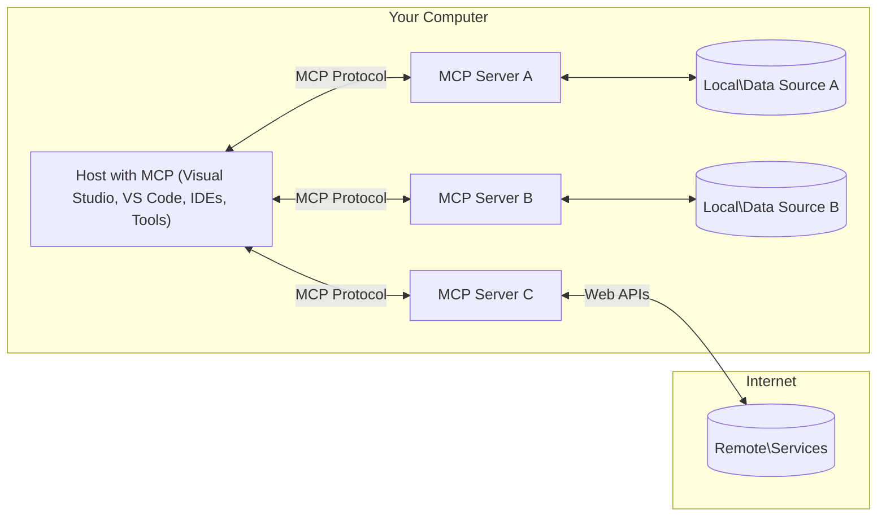

<!--
CO_OP_TRANSLATOR_METADATA:
{
  "original_hash": "904b59de1de9264801242d90a42cdd9d",
  "translation_date": "2025-09-05T11:46:11+00:00",
  "source_file": "01-CoreConcepts/README.md",
  "language_code": "my"
}
-->
# MCP အခြေခံအယူအဆများ: AI ပေါင်းစည်းမှုအတွက် Model Context Protocol ကိုကျွမ်းကျင်စွာအသုံးပြုခြင်း

[](https://youtu.be/earDzWGtE84)

_(ဤသင်ခန်းစာ၏ဗီဒီယိုကိုကြည့်ရန် အထက်ပါပုံကိုနှိပ်ပါ)_

[Model Context Protocol (MCP)](https://github.com/modelcontextprotocol) သည် Large Language Models (LLMs) နှင့် ပြင်ပကိရိယာများ၊ အက်ပလီကေးရှင်းများနှင့် ဒေတာရင်းမြစ်များအကြား ဆက်သွယ်မှုကို အထိရောက်ဆုံးလုပ်ဆောင်ရန်အတွက် စံပြစနစ်တစ်ခုဖြစ်သည်။ ဤလမ်းညွှန်စာအုပ်သည် MCP ၏ အခြေခံအယူအဆများကို သင်အားလမ်းပြပေးမည်ဖြစ်သည်။ သင်သည် ၎င်း၏ client-server ဖွဲ့စည်းမှု၊ အရေးပါသောအစိတ်အပိုင်းများ၊ ဆက်သွယ်မှုစနစ်များနှင့် အကောင်းဆုံးအကောင်အထည်ဖော်နည်းလမ်းများကို လေ့လာနိုင်မည်ဖြစ်သည်။

- **အသုံးပြုသူ၏ထောက်ခံချက်**: ဒေတာရယူမှုနှင့် လုပ်ဆောင်မှုအားလုံးသည် အသုံးပြုသူ၏ ထောက်ခံချက်ရရှိမှသာ အကောင်အထည်ဖော်နိုင်သည်။ အသုံးပြုသူများသည် မည်သည့်ဒေတာကိုရယူမည်နှင့် မည်သည့်လုပ်ဆောင်မှုများကို ပြုလုပ်မည်ကို ရှင်းလင်းစွာနားလည်ပြီး ခွင့်ပြုချက်များနှင့် အာဏာပိုင်မှုများကို အပြည့်အဝထိန်းချုပ်နိုင်ရမည်။

- **ဒေတာကိုယ်ရေးကိုယ်တာအကာအကွယ်**: အသုံးပြုသူ၏ဒေတာကို ထောက်ခံချက်မရှိဘဲ မဖော်ထုတ်ရသလို၊ ဆက်သွယ်မှုတစ်ခုလုံးတွင် ခိုင်မာသော လုံခြုံရေးထိန်းချုပ်မှုများဖြင့် ကာကွယ်ထားရမည်။ မလိုအပ်သော ဒေတာပို့ဆောင်မှုများကို ကာကွယ်ပြီး ကိုယ်ရေးကိုယ်တာအကန့်အသတ်များကို တင်းကြပ်စွာထိန်းသိမ်းရမည်။

- **ကိရိယာအသုံးပြုမှုလုံခြုံမှု**: ကိရိယာတစ်ခုချင်းစီကို အသုံးပြုမည့်အခါ အသုံးပြုသူ၏ ထောက်ခံချက်နှင့် ကိရိယာ၏ လုပ်ဆောင်မှု၊ ပါရာမီတာများနှင့် ဖြစ်နိုင်သောအကျိုးသက်ရောက်မှုများကို ရှင်းလင်းစွာနားလည်ရမည်။ မတော်တဆဖြစ်နိုင်သော၊ မလုံခြုံသော သို့မဟုတ် မကောင်းမခံရနိုင်သော ကိရိယာအသုံးပြုမှုများကို ကာကွယ်ရန် ခိုင်မာသော လုံခြုံရေးအကန့်အသတ်များရှိရမည်။

- **ဆက်သွယ်မှုအလွှာလုံခြုံမှု**: ဆက်သွယ်မှုလမ်းကြောင်းအားလုံးသည် သင့်လျော်သော စာဝှက်ခြင်းနှင့် အတည်ပြုမှုစနစ်များကို အသုံးပြုရမည်။ အဝေးမှဆက်သွယ်မှုများတွင် လုံခြုံသော ဆက်သွယ်မှုပရိုတိုကောများနှင့် သင့်တော်သော အထောက်အထားစီမံခန့်ခွဲမှုများကို အကောင်အထည်ဖော်ရမည်။

#### အကောင်အထည်ဖော်ရေးလမ်းညွှန်ချက်များ:

- **ခွင့်ပြုချက်စီမံခန့်ခွဲမှု**: အသုံးပြုသူများအား မည်သည့် server များ၊ ကိရိယာများနှင့် အရင်းအမြစ်များကို အသုံးပြုခွင့်ပြုမည်ကို ထိန်းချုပ်နိုင်စေရန် အသေးစိတ်ခွင့်ပြုချက်စနစ်များကို အကောင်အထည်ဖော်ပါ။
- **အတည်ပြုမှုနှင့် ခွင့်ပြုချက်**: လုံခြုံသော အတည်ပြုမှုနည်းလမ်းများ (OAuth, API key များ) ကို သက်တမ်းကုန်ဆုံးမှုနှင့် token စီမံခန့်ခွဲမှုမှန်ကန်စွာ အသုံးပြုပါ။
- **အဝင်ဒေတာစစ်ဆေးမှု**: Injection အတိုက်အခံများကို ကာကွယ်ရန် သတ်မှတ်ထားသော schema များအတိုင်း ပါရာမီတာများနှင့် အဝင်ဒေတာအားလုံးကို စစ်ဆေးပါ။
- **မှတ်တမ်းမှတ်သားမှု**: လုံခြုံရေးစောင့်ကြည့်မှုနှင့် လိုက်နာမှုအတွက် လုပ်ဆောင်မှုအားလုံး၏ ပြည့်စုံသောမှတ်တမ်းများကို ထိန်းသိမ်းပါ။

## အကျဉ်းချုပ်

ဤသင်ခန်းစာတွင် Model Context Protocol (MCP) စနစ်၏ အခြေခံဖွဲ့စည်းမှုနှင့် အစိတ်အပိုင်းများကို လေ့လာမည်ဖြစ်သည်။ သင်သည် client-server ဖွဲ့စည်းမှု၊ အဓိကအစိတ်အပိုင်းများနှင့် MCP ဆက်သွယ်မှုများကို အားဖြည့်ပေးသည့် စနစ်များကို နားလည်သိရှိမည်ဖြစ်သည်။

## အဓိကသင်ယူရမည့်ရည်မှန်းချက်များ

ဤသင်ခန်းစာအဆုံးတွင် သင်သည်:

- MCP client-server ဖွဲ့စည်းမှုကို နားလည်မည်။
- Hosts, Clients, နှင့် Servers ၏ အခန်းကဏ္ဍများနှင့် တာဝန်များကို သုံးသပ်နိုင်မည်။
- MCP ကို အလွယ်တကူပေါင်းစည်းနိုင်စေသည့် အဓိကအင်္ဂါရပ်များကို ခွဲခြမ်းစိတ်ဖြာနိုင်မည်။
- MCP စနစ်အတွင်း ဒေတာစီးဆင်းမှုကို လေ့လာနိုင်မည်။
- .NET, Java, Python, နှင့် JavaScript တို့ဖြင့် ကုဒ်ဥပမာများမှ လက်တွေ့အတွေ့အကြုံရရှိမည်။

## MCP ဖွဲ့စည်းမှု: နက်ရှိုင်းစွာလေ့လာခြင်း

MCP စနစ်သည် client-server မော်ဒယ်အပေါ်တွင် တည်ဆောက်ထားသည်။ ဤ module ဖွဲ့စည်းမှုသည် AI အက်ပလီကေးရှင်းများအား ကိရိယာများ၊ ဒေတာဘေ့စ်များ၊ API များနှင့် အခြေအနေဆိုင်ရာအရင်းအမြစ်များနှင့် ထိရောက်စွာ ဆက်သွယ်နိုင်စေရန် အထောက်အကူပြုသည်။ ယခုဖွဲ့စည်းမှုကို အဓိကအစိတ်အပိုင်းများအဖြစ် ခွဲခြမ်းစိတ်ဖြာကြည့်ပါစို့။

MCP ၏ အဓိကမှာ client-server ဖွဲ့စည်းမှုဖြစ်ပြီး၊ host application တစ်ခုသည် server များစွာနှင့် ချိတ်ဆက်နိုင်သည်:



- **MCP Hosts**: VSCode, Claude Desktop, IDEs, သို့မဟုတ် MCP မှတစ်ဆင့် ဒေတာရယူလိုသည့် AI ကိရိယာများ
- **MCP Clients**: Server များနှင့် 1:1 ချိတ်ဆက်မှုကို ထိန်းသိမ်းသည့် protocol clients
- **MCP Servers**: သတ်မှတ်ထားသော Model Context Protocol မှတစ်ဆင့် အထူးစွမ်းဆောင်ရည်များကို ဖော်ထုတ်သည့် ပေါ့ပါးသောပရိုဂရမ်များ
- **ဒေတာရင်းမြစ်ဒေသခံများ**: သင့်ကွန်ပျူတာရှိ ဖိုင်များ၊ ဒေတာဘေ့စ်များနှင့် MCP servers မှ လုံခြုံစွာရယူနိုင်သည့် ဝန်ဆောင်မှုများ
- **အဝေးမှဝန်ဆောင်မှုများ**: API များမှတစ်ဆင့် MCP servers ချိတ်ဆက်နိုင်သည့် အင်တာနက်ပေါ်ရှိ ပြင်ပစနစ်များ

MCP Protocol သည် YYYY-MM-DD ပုံစံဖြင့် ရက်စွဲအခြေခံဗားရှင်းသတ်မှတ်မှုကို အသုံးပြုသည့် စံပြစနစ်တစ်ခုဖြစ်သည်။ လက်ရှိ protocol ဗားရှင်းမှာ **2025-06-18** ဖြစ်သည်။ [protocol specification](https://modelcontextprotocol.io/specification/2025-06-18/) တွင် နောက်ဆုံးအပ်ဒိတ်များကို ကြည့်ရှုနိုင်သည်။

### 1. Hosts

Model Context Protocol (MCP) တွင် **Hosts** ဆိုသည်မှာ အသုံးပြုသူများသည် protocol နှင့် အဓိကအဆက်အသွယ်ပြုသော AI အက်ပလီကေးရှင်းများဖြစ်သည်။ Hosts များသည် MCP servers များစွာနှင့် ချိတ်ဆက်မှုများကို စီမံခန့်ခွဲရန် MCP clients များကို ဖန်တီးပေးသည်။ Hosts ၏ ဥပမာများမှာ:

- **AI အက်ပလီကေးရှင်းများ**: Claude Desktop, Visual Studio Code, Claude Code
- **ဖွံ့ဖြိုးရေးပတ်ဝန်းကျင်များ**: MCP ပေါင်းစည်းမှုပါရှိသော IDE များနှင့် ကုဒ်တည်းဖြတ်သူများ  
- **စိတ်ကြိုက်အက်ပလီကေးရှင်းများ**: ရည်ရွယ်ချက်သတ်မှတ်ထားသော AI အေးဂျင့်များနှင့် ကိရိယာများ

**Hosts** များသည် AI မော်ဒယ်အဆက်အသွယ်များကို စီမံခန့်ခွဲသော အက်ပလီကေးရှင်းများဖြစ်သည်။ ၎င်းတို့သည်:

- **AI မော်ဒယ်များကို စီမံခန့်ခွဲခြင်း**: LLM များကို အကောင်အထည်ဖော်ခြင်း သို့မဟုတ် အပြန်အလှန်ဆက်သွယ်မှုများကို စီမံခြင်း
- **Client ချိတ်ဆက်မှုများကို စီမံခြင်း**: MCP server တစ်ခုချင်းစီအတွက် MCP client တစ်ခုစီ ဖန်တီးခြင်းနှင့် ထိန်းသိမ်းခြင်း
- **အသုံးပြုသူအင်တာဖေ့စ်ကို ထိန်းချုပ်ခြင်း**: စကားဝိုင်းစီးဆင်းမှု၊ အသုံးပြုသူအပြန်အလှန်ဆက်သွယ်မှုများနှင့် အဖြေတင်ဆက်မှုကို စီမံခြင်း  
- **လုံခြုံရေးကို အကောင်အထည်ဖော်ခြင်း**: ခွင့်ပြုချက်များ၊ လုံခြုံရေးကန့်သတ်ချက်များနှင့် အတည်ပြုမှုကို ထိန်းချုပ်ခြင်း
- **အသုံးပြုသူထောက်ခံချက်ကို စီမံခြင်း**: ဒေတာမျှဝေမှုနှင့် ကိရိယာအသုံးပြုမှုအတွက် အသုံးပြုသူ၏ အတည်ပြုမှုကို စီမံခြင်း

### 2. Clients

**Clients** များသည် Hosts နှင့် MCP servers အကြား တစ်ဦးချင်းချင်း ချိတ်ဆက်မှုများကို ထိန်းသိမ်းသည့် အရေးပါသောအစိတ်အပိုင်းများဖြစ်သည်။ MCP client တစ်ခုစီကို Host မှ ဖန်တီးပြီး သတ်မှတ်ထားသော MCP server တစ်ခုနှင့် ချိတ်ဆက်သည်။ ၎င်းသည် စနစ်တကျနှင့် လုံခြုံသော ဆက်သွယ်မှုလမ်းကြောင်းများကို သေချာစေသည်။ Clients များသည် Hosts ကို Server များစွာနှင့် တစ်ချိန်တည်း ချိတ်ဆက်နိုင်စေရန် အထောက်အကူပြုသည်။

**Clients** များသည် host application အတွင်းရှိ ချိတ်ဆက်မှုအစိတ်အပိုင်းများဖြစ်သည်။ ၎င်းတို့သည်:

- **ပရိုတိုကောဆက်သွယ်မှု**: JSON-RPC 2.0 တောင်းဆိုမှုများကို server များထံ ပေးပို့ခြင်း
- **စွမ်းဆောင်ရည်ညှိနှိုင်းမှု**: စတင်ချိန်တွင် server များနှင့် protocol ဗားရှင်းများကို ညှိနှိုင်းခြင်း
- **ကိရိယာအကောင်အထည်ဖော်မှု**: မော်ဒယ်များမှ tool execution တောင်းဆိုမှုများကို စီမံခြင်း
- **အချိန်နှင့်တပြေးညီအပ်ဒိတ်များ**: Server များထံမှ အချက်အလက်များနှင့် အပ်ဒိတ်များကို လက်ခံခြင်း
- **တုံ့ပြန်မှုကို စီမံခြင်း**: Server response များကို အသုံးပြုသူများအတွက် ပြသရန် ဖော်ပြခြင်း

### 3. Servers

**Servers** များသည် MCP clients များအား context, tools, နှင့် စွမ်းဆောင်ရည်များကို ပေးစွမ်းသည့် ပရိုဂရမ်များဖြစ်သည်။ ၎င်းတို့သည် ဒေသတွင် (Host နှင့် တူညီသောစက်ပေါ်တွင်) သို့မဟုတ် အဝေးမှ (ပြင်ပပလက်ဖောင်းများပေါ်တွင်) အကောင်အထည်ဖော်နိုင်သည်။ Server များသည် client တောင်းဆိုမှုများကို ကိုင်တွယ်ပြီး ဖွဲ့စည်းထားသော တုံ့ပြန်မှုများကို ပေးပို့သည်။

**Servers** များသည် context နှင့် စွမ်းဆောင်ရည်များကို ပေးစွမ်းသည့် ဝန်ဆောင်မှုများဖြစ်သည်။ ၎င်းတို့သည်:

- **စွမ်းဆောင်ရည်မှတ်ပုံတင်မှု**: Clients များထံသို့ ရရှိနိုင်သော primitives (resources, prompts, tools) များကို မှတ်ပုံတင်ခြင်း
- **တောင်းဆိုမှုကို ကိုင်တွယ်ခြင်း**: Clients များထံမှ tool calls, resource requests, နှင့် prompt requests များကို လက်ခံပြီး အကောင်အထည်ဖော်ခြင်း
- **အခြေအနေဆိုင်ရာအချက်အလက်ပေးခြင်း**: မော်ဒယ်တုံ့ပြန်မှုများကို တိုးတက်စေရန် context နှင့် ဒေတာများကို ပေးခြင်း
- **အခြေအနေစီမံခန့်ခွဲမှု**: Session state ကို ထိန်းသိမ်းပြီး stateful interactions များကို ကိုင်တွယ်ခြင်း
- **အချိန်နှင့်တပြေးညီအကြောင်းကြားချက်များ**: Clients များထံသို့ စွမ်းဆောင်ရည်ပြောင်းလဲမှုများနှင့် အပ်ဒိတ်များကို ပေးပို့ခြင်း

Server များကို မည်သူမဆို ဖွံ့ဖြိုးနိုင်ပြီး မော်ဒယ်စွမ်းဆောင်ရည်များကို အထူးစွမ်းဆောင်နိုင်စေရန် ဖန်တီးနိုင်သည်။ ၎င်းတို့သည် ဒေသတွင်နှင့် အဝေးမှ deployment အခွင့်အလမ်းများကို ပံ့ပိုးပေးသည်။

### 4. Server Primitives

MCP တွင် Server များသည် Clients, Hosts, နှင့် Language Models အကြား ဆက်သွယ်မှုများကို ပိုမိုကြွယ်ဝစေရန် အခြေခံ primitives သုံးမျိုးကို ပံ့ပိုးပေးသည်။ ၎င်းတို့သည် protocol မှတစ်ဆင့် ရရှိနိုင်သော အချက်အလက်အမျိုးအစားများနှင့် လုပ်ဆောင်မှုများကို သတ်မှတ်ပေးသည်။

Server များသည် အောက်ပါ အခြေခံ primitives သုံးမျိုးမှ မည်သည့်ပေါင်းစပ်မှုကိုမဆို ဖော်ထုတ်နိုင်သည်:

#### Resources

**Resources** ဆိုသည်မှာ AI အက်ပလီကေးရှင်းများအား အခြေအနေဆိုင်ရာအချက်အလက်များကို ပေးစွမ်းသည့် ဒေတာရင်းမြစ်များဖြစ်သည်။ ၎င်းတို့သည် မော်ဒယ်၏ နားလည်မှုနှင့် ဆုံးဖြတ်ချက်ချမှုကို တိုးတက်စေရန် အထောက်အကူပြုသည်:

- **အခြေအနေဆိုင်ရာဒေတာ**: AI မော်ဒယ်များအတွက် ဖွဲ့စည်းထားသော အချက်အလက်များ
- **အသိပညာအခြေခံများ**: စာရွက်စာတမ်းစုစည်းမှုများ၊ ဆောင်းပါးများ၊ လက်စွဲစာအုပ်များနှင့် သုတေသနစာတမ်းများ
- **ဒေတာရင်းမြစ်ဒေသခံများ**: ဖိုင်များ၊ ဒေတာဘေ့စ်များနှင့် ဒေသခံစနစ်အချက်အလက်များ  
- **ပြင်ပဒေတာ**: API တုံ့ပြန်မှုများ၊ ဝက်ဘ်ဝန်ဆောင်မှုများနှင့် အဝေးမှစနစ်ဒေတာ
- **ဒိုင်းနမစ်အကြောင်းအရာ**:
- **JSON-RPC 2.0 Protocol**: ဆက်သွယ်မှုအားလုံးသည် နည်းလမ်းခေါ်ဆိုမှုများ၊ တုံ့ပြန်မှုများနှင့် အသိပေးချက်များအတွက် စံပြ JSON-RPC 2.0 မက်ဆေ့ချ်ဖော်မတ်ကို အသုံးပြုသည်။
- **Lifecycle Management**: Client နှင့် Server အကြား ချိတ်ဆက်မှု စတင်ခြင်း၊ စွမ်းရည်ညှိနှိုင်းမှုနှင့် session ပိတ်သိမ်းခြင်းကို စီမံခန့်ခွဲသည်။
- **Server Primitives**: Server များအနေဖြင့် ကိရိယာများ၊ အရင်းအမြစ်များနှင့် prompt များမှတဆင့် အခြေခံလုပ်ဆောင်ချက်များပေးနိုင်စေသည်။
- **Client Primitives**: Server များအနေဖြင့် LLM များမှ နမူနာယူခြင်း၊ အသုံးပြုသူ input ရယူခြင်းနှင့် log မက်ဆေ့ချ်များပို့ခြင်းကို တောင်းဆိုနိုင်စေသည်။
- **Real-time Notifications**: polling မလိုအပ်ဘဲ အချိန်နှင့်တပြေးညီ dynamic updates များအတွက် asynchronous notifications များကို ပံ့ပိုးပေးသည်။

#### အဓိကအင်္ဂါရပ်များ:

- **Protocol Version Negotiation**: သက်ဆိုင်မှုရှိစေရန် (YYYY-MM-DD) ရက်စွဲအခြေခံ versioning ကို အသုံးပြုသည်။
- **Capability Discovery**: Initialization အတွင်း Client နှင့် Server များအကြား ပံ့ပိုးနိုင်သော feature အချက်အလက်များကို ဖလှယ်သည်။
- **Stateful Sessions**: အကြောင်းအရာဆက်လက်တည်ရှိစေရန် အများအပြားအပြန်အလှန်ဆက်သွယ်မှုများအတွင်း connection state ကို ထိန်းသိမ်းသည်။

### Transport Layer

**Transport Layer** သည် MCP ပါဝင်သူများအကြား ဆက်သွယ်မှုချန်နယ်များ၊ မက်ဆေ့ချ် framing နှင့် authentication ကို စီမံခန့်ခွဲသည်။

#### ပံ့ပိုးထားသော Transport Mechanisms:

1. **STDIO Transport**:
   - process တစ်ခုနှင့် တစ်ခုတိုက်ရိုက်ဆက်သွယ်ရန် standard input/output streams ကို အသုံးပြုသည်။
   - network overhead မရှိဘဲ တစ်စက်ပေါ်တွင် local process များအတွက် အကောင်းဆုံးဖြစ်သည်။
   - MCP server များကို locally အကောင်အထည်ဖော်ရာတွင် အများဆုံးအသုံးပြုသည်။

2. **Streamable HTTP Transport**:
   - client-to-server မက်ဆေ့ချ်များအတွက် HTTP POST ကို အသုံးပြုသည်  
   - server-to-client streaming အတွက် Server-Sent Events (SSE) ကို ရွေးချယ်နိုင်သည်။
   - network များအကြား remote server ဆက်သွယ်မှုကို ပံ့ပိုးပေးသည်။
   - standard HTTP authentication (bearer tokens, API keys, custom headers) ကို ပံ့ပိုးသည်။
   - MCP သည် secure token-based authentication အတွက် OAuth ကို အကြံပြုသည်။

#### Transport Abstraction:

Transport layer သည် data layer မှ ဆက်သွယ်မှုအသေးစိတ်ကို abstract လုပ်ပြီး transport mechanism များအားလုံးတွင် တူညီသော JSON-RPC 2.0 မက်ဆေ့ချ်ဖော်မတ်ကို အသုံးပြုနိုင်စေသည်။ ဒီ abstraction က local နှင့် remote server များအကြား အလွယ်တကူ ပြောင်းလဲနိုင်စေသည်။

### Security Considerations

MCP implementation များသည် protocol operation အားလုံးအတွင်း လုံခြုံမှု၊ ယုံကြည်မှုနှင့် လုံခြုံစိတ်ချမှုရှိစေရန် အရေးကြီးသော လုံခြုံရေးမူဝါဒများကို လိုက်နာရမည်။

- **User Consent and Control**: အသုံးပြုသူများသည် data ကို access လုပ်ခြင်း သို့မဟုတ် လုပ်ဆောင်မှုများကို ပြုလုပ်မီ ရှင်းလင်းသော UI မှတဆင့် data များကို share လုပ်မည်၊ လုပ်ဆောင်မှုများကို အတည်ပြုမည်ဆိုတာကို ထိန်းချုပ်နိုင်ရမည်။
  
- **Data Privacy**: အသုံးပြုသူ data ကို explicit consent မရှိဘဲ မဖော်ထုတ်ရ။ MCP implementation များသည် unauthorized data transmission မဖြစ်စေရန် data privacy ကို အကောင်းဆုံးထိန်းသိမ်းရမည်။

- **Tool Safety**: Tool တစ်ခုကို အသုံးပြုမည်ဆိုပါက အသုံးပြုသူ၏ explicit consent လိုအပ်သည်။ Tool တစ်ခု၏ လုပ်ဆောင်ချက်ကို အသုံးပြုသူများ ရှင်းလင်းစွာနားလည်နိုင်ရမည်။

### Code Examples: Key Components

### .NET Example: MCP Server တစ်ခုဖန်တီးခြင်း

```csharp
using System;
using System.Threading.Tasks;
using ModelContextProtocol.Server;
using ModelContextProtocol.Server.Transport;
using ModelContextProtocol.Server.Tools;

public class WeatherServer
{
    public static async Task Main(string[] args)
    {
        // Create an MCP server
        var server = new McpServer(
            name: "Weather MCP Server",
            version: "1.0.0"
        );
        
        // Register our custom weather tool
        server.AddTool<string, WeatherData>("weatherTool", 
            description: "Gets current weather for a location",
            execute: async (location) => {
                // Call weather API (simplified)
                var weatherData = await GetWeatherDataAsync(location);
                return weatherData;
            });
        
        // Connect the server using stdio transport
        var transport = new StdioServerTransport();
        await server.ConnectAsync(transport);
        
        Console.WriteLine("Weather MCP Server started");
        
        // Keep the server running until process is terminated
        await Task.Delay(-1);
    }
    
    private static async Task<WeatherData> GetWeatherDataAsync(string location)
    {
        // This would normally call a weather API
        // Simplified for demonstration
        await Task.Delay(100); // Simulate API call
        return new WeatherData { 
            Temperature = 72.5,
            Conditions = "Sunny",
            Location = location
        };
    }
}

public class WeatherData
{
    public double Temperature { get; set; }
    public string Conditions { get; set; }
    public string Location { get; set; }
}
```

### Java Example: MCP Server Components

```java
import io.modelcontextprotocol.server.McpServer;
import io.modelcontextprotocol.server.McpToolDefinition;
import io.modelcontextprotocol.server.transport.StdioServerTransport;
import io.modelcontextprotocol.server.tool.ToolExecutionContext;
import io.modelcontextprotocol.server.tool.ToolResponse;

public class WeatherMcpServer {
    public static void main(String[] args) throws Exception {
        // Create an MCP server
        McpServer server = McpServer.builder()
            .name("Weather MCP Server")
            .version("1.0.0")
            .build();
            
        // Register a weather tool
        server.registerTool(McpToolDefinition.builder("weatherTool")
            .description("Gets current weather for a location")
            .parameter("location", String.class)
            .execute((ToolExecutionContext ctx) -> {
                String location = ctx.getParameter("location", String.class);
                
                // Get weather data (simplified)
                WeatherData data = getWeatherData(location);
                
                // Return formatted response
                return ToolResponse.content(
                    String.format("Temperature: %.1f°F, Conditions: %s, Location: %s", 
                    data.getTemperature(), 
                    data.getConditions(), 
                    data.getLocation())
                );
            })
            .build());
        
        // Connect the server using stdio transport
        try (StdioServerTransport transport = new StdioServerTransport()) {
            server.connect(transport);
            System.out.println("Weather MCP Server started");
            // Keep server running until process is terminated
            Thread.currentThread().join();
        }
    }
    
    private static WeatherData getWeatherData(String location) {
        // Implementation would call a weather API
        // Simplified for example purposes
        return new WeatherData(72.5, "Sunny", location);
    }
}

class WeatherData {
    private double temperature;
    private String conditions;
    private String location;
    
    public WeatherData(double temperature, String conditions, String location) {
        this.temperature = temperature;
        this.conditions = conditions;
        this.location = location;
    }
    
    public double getTemperature() {
        return temperature;
    }
    
    public String getConditions() {
        return conditions;
    }
    
    public String getLocation() {
        return location;
    }
}
```

### Python Example: MCP Server တစ်ခုတည်ဆောက်ခြင်း

```python
pip install fastmcp
```  
Code Sample:

```python
#!/usr/bin/env python3
import asyncio
from fastmcp import FastMCP
from fastmcp.transports.stdio import serve_stdio

# Create a FastMCP server
mcp = FastMCP(
    name="Weather MCP Server",
    version="1.0.0"
)

@mcp.tool()
def get_weather(location: str) -> dict:
    """Gets current weather for a location."""
    return {
        "temperature": 72.5,
        "conditions": "Sunny",
        "location": location
    }

# Alternative approach using a class
class WeatherTools:
    @mcp.tool()
    def forecast(self, location: str, days: int = 1) -> dict:
        """Gets weather forecast for a location for the specified number of days."""
        return {
            "location": location,
            "forecast": [
                {"day": i+1, "temperature": 70 + i, "conditions": "Partly Cloudy"}
                for i in range(days)
            ]
        }

# Register class tools
weather_tools = WeatherTools()

# Start the server
if __name__ == "__main__":
    asyncio.run(serve_stdio(mcp))
```

### JavaScript Example: MCP Server ဖန်တီးခြင်း

```javascript
// Using the official Model Context Protocol SDK
import { McpServer } from "@modelcontextprotocol/sdk/server/mcp.js";
import { StdioServerTransport } from "@modelcontextprotocol/sdk/server/stdio.js";
import { z } from "zod"; // For parameter validation

// Create an MCP server
const server = new McpServer({
  name: "Weather MCP Server",
  version: "1.0.0"
});

// Define a weather tool
server.tool(
  "weatherTool",
  {
    location: z.string().describe("The location to get weather for")
  },
  async ({ location }) => {
    // This would normally call a weather API
    // Simplified for demonstration
    const weatherData = await getWeatherData(location);
    
    return {
      content: [
        { 
          type: "text", 
          text: `Temperature: ${weatherData.temperature}°F, Conditions: ${weatherData.conditions}, Location: ${weatherData.location}` 
        }
      ]
    };
  }
);

// Define a forecast tool
server.tool(
  "forecastTool",
  {
    location: z.string(),
    days: z.number().default(3).describe("Number of days for forecast")
  },
  async ({ location, days }) => {
    // This would normally call a weather API
    // Simplified for demonstration
    const forecast = await getForecastData(location, days);
    
    return {
      content: [
        { 
          type: "text", 
          text: `${days}-day forecast for ${location}: ${JSON.stringify(forecast)}` 
        }
      ]
    };
  }
);

// Helper functions
async function getWeatherData(location) {
  // Simulate API call
  return {
    temperature: 72.5,
    conditions: "Sunny",
    location: location
  };
}

async function getForecastData(location, days) {
  // Simulate API call
  return Array.from({ length: days }, (_, i) => ({
    day: i + 1,
    temperature: 70 + Math.floor(Math.random() * 10),
    conditions: i % 2 === 0 ? "Sunny" : "Partly Cloudy"
  }));
}

// Connect the server using stdio transport
const transport = new StdioServerTransport();
server.connect(transport).catch(console.error);

console.log("Weather MCP Server started");
```

---

## Security and Authorization

MCP သည် security နှင့် authorization ကို စီမံရန် အများအပြား built-in concept များနှင့် mechanism များပါရှိသည်။

1. **Tool Permission Control**:  
  Session အတွင်း model သုံးနိုင်သော tool များကို client မှ သတ်မှတ်နိုင်သည်။ 

2. **Authentication**:  
  Server များသည် tool များ၊ resource များ သို့မဟုတ် sensitive operation များကို အသုံးပြုခွင့်ပေးမီ authentication လိုအပ်သည်။

3. **Validation**:  
  Tool invocation အတွက် parameter validation ကို enforce လုပ်သည်။

4. **Rate Limiting**:  
  Server resource များကို မတရားအသုံးပြုမှုကို ကာကွယ်ရန် rate limiting ကို အသုံးပြုသည်။

---

## Protocol Messages & Communication Flow

MCP သည် structured **JSON-RPC 2.0** မက်ဆေ့ချ်များကို အသုံးပြုသည်။

### Core Message Types:

#### **Initialization Messages**
- **`initialize` Request**: connection ကို စတင်ပြီး protocol version နှင့် capabilities ကို ညှိနှိုင်းသည်။
- **`initialize` Response**: supported features နှင့် server အချက်အလက်ကို အတည်ပြုသည်။  
- **`notifications/initialized`**: initialization ပြီးဆုံးပြီး session အသင့်ဖြစ်ကြောင်း signal ပေးသည်။

#### **Discovery Messages**
- **`tools/list` Request**: server မှရရှိနိုင်သော tool များကို ရှာဖွေသည်။
- **`resources/list` Request**: ရရှိနိုင်သော resource များကို ရှာဖွေသည်။
- **`prompts/list` Request**: ရရှိနိုင်သော prompt template များကို ရယူသည်။

#### **Execution Messages**  
- **`tools/call` Request**: သတ်မှတ်ထားသော parameter များနှင့် tool တစ်ခုကို အကောင်အထည်ဖော်သည်။
- **`resources/read` Request**: သတ်မှတ်ထားသော resource မှ content ကို ရယူသည်။
- **`prompts/get` Request**: optional parameter များနှင့် prompt template ကို ရယူသည်။

#### **Client-side Messages**
- **`sampling/complete` Request**: Server သည် client မှ LLM completion ကို တောင်းဆိုသည်။
- **`elicitation/request`**: Server သည် client interface မှ user input ကို တောင်းဆိုသည်။
- **Logging Messages**: Server သည် structured log မက်ဆေ့ချ်များကို client သို့ ပို့သည်။

#### **Notification Messages**
- **`notifications/tools/list_changed`**: tool များပြောင်းလဲမှုကို server မှ client သို့ အသိပေးသည်။
- **`notifications/resources/list_changed`**: resource များပြောင်းလဲမှုကို server မှ client သို့ အသိပေးသည်။  
- **`notifications/prompts/list_changed`**: prompt များပြောင်းလဲမှုကို server မှ client သို့ အသိပေးသည်။

---

## Key Takeaways

- **Architecture**: MCP သည် client-server architecture ကို အသုံးပြုသည်။
- **Participants**: MCP ecosystem တွင် host (AI application), client (protocol connector), server (capability provider) များပါဝင်သည်။
- **Transport Mechanisms**: STDIO (local) နှင့် Streamable HTTP (remote) ကို ပံ့ပိုးသည်။
- **Core Primitives**: Server များသည် tool, resource, prompt များကို expose လုပ်သည်။
- **Client Primitives**: Server များသည် sampling, elicitation, logging ကို client မှတောင်းဆိုနိုင်သည်။
- **Protocol Foundation**: JSON-RPC 2.0 ကို အခြေခံပြီး date-based versioning (current: 2025-06-18) ကို အသုံးပြုသည်။
- **Real-time Capabilities**: dynamic updates နှင့် real-time synchronization အတွက် notification များကို ပံ့ပိုးသည်။
- **Security First**: အသုံးပြုသူ၏ explicit consent, data privacy နှင့် secure transport ကို အရေးပါသော လိုအပ်ချက်များအဖြစ် သတ်မှတ်ထားသည်။

---

## Exercise

သင့် domain အတွက် အသုံးဝင်သော MCP tool တစ်ခုကို ဒီဇိုင်းဆွဲပါ။  
1. Tool အမည်  
2. Accept လုပ်သော parameter များ  
3. Return ပြန်သော output  
4. Model သည် user problem များကို ဖြေရှင်းရန် tool ကို ဘယ်လိုအသုံးပြုမည်?  

---

## What's next

Next: [Chapter 2: Security](../02-Security/README.md)

---

**ဝက်ဘ်ဆိုက်မှတ်ချက်**:  
ဤစာရွက်စာတမ်းကို AI ဘာသာပြန်ဝန်ဆောင်မှု [Co-op Translator](https://github.com/Azure/co-op-translator) ကို အသုံးပြု၍ ဘာသာပြန်ထားပါသည်။ ကျွန်ုပ်တို့သည် တိကျမှန်ကန်မှုအတွက် ကြိုးစားနေပါသော်လည်း၊ အလိုအလျောက်ဘာသာပြန်မှုများတွင် အမှားများ သို့မဟုတ် မမှန်ကန်မှုများ ပါဝင်နိုင်သည်ကို ကျေးဇူးပြု၍ သတိပြုပါ။ မူရင်းစာရွက်စာတမ်းကို ၎င်း၏ မူလဘာသာစကားဖြင့် အာဏာတည်သောရင်းမြစ်အဖြစ် သတ်မှတ်သင့်ပါသည်။ အရေးကြီးသော အချက်အလက်များအတွက် လူ့ဘာသာပြန်ပညာရှင်များ၏ ဝန်ဆောင်မှုကို အကြံပြုပါသည်။ ဤဘာသာပြန်မှုကို အသုံးပြုခြင်းမှ ဖြစ်ပေါ်လာသော နားလည်မှုမှားများ သို့မဟုတ် အဓိပ္ပါယ်မှားများအတွက် ကျွန်ုပ်တို့သည် တာဝန်မယူပါ။