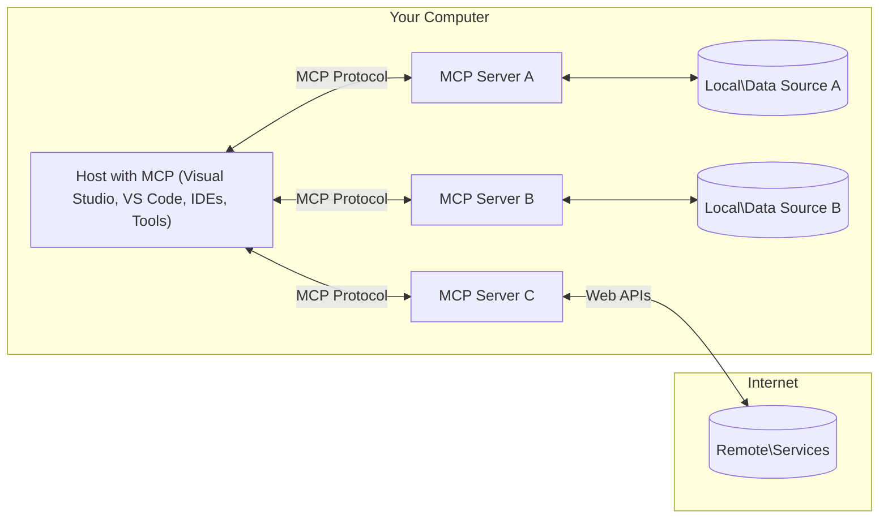

<!--
CO_OP_TRANSLATOR_METADATA:
{
  "original_hash": "0a6a7bcb289c024a91289e0444cb370b",
  "translation_date": "2025-08-18T23:14:26+00:00",
  "source_file": "01-CoreConcepts/README.md",
  "language_code": "my"
}
-->
# MCP အခြေခံအယူအဆများ: AI ပေါင်းစည်းမှုအတွက် Model Context Protocol ကိုကျွမ်းကျင်စွာအသုံးပြုခြင်း

[](https://youtu.be/earDzWGtE84)

_(ဤသင်ခန်းစာ၏ဗီဒီယိုကိုကြည့်ရန် အထက်ပါပုံကိုနှိပ်ပါ)_

[Model Context Protocol (MCP)](https://gi- **အသုံးပြုသူ၏ထောက်ခံချက်**: ဒေတာရယူခြင်းနှင့် လုပ်ဆောင်မှုများအားလုံးသည် အသုံးပြုသူ၏ထောက်ခံချက်ရရှိမှသာ အကောင်အထည်ဖော်မည်ဖြစ်သည်။ အသုံးပြုသူများသည် မည်သည့်ဒေတာကိုရယူမည်နှင့် မည်သည့်လုပ်ဆောင်မှုများကိုပြုလုပ်မည်ကို ရှင်းလင်းစွာနားလည်ပြီး ခွင့်ပြုချက်များနှင့် အာဏာပေးမှုများကို အသေးစိတ်ထိန်းချုပ်နိုင်ရမည်။

- **ဒေတာကိုယ်ရေးကိုယ်တာအကာအကွယ်**: အသုံးပြုသူ၏ဒေတာကို ထောက်ခံချက်မရှိဘဲ မဖော်ထုတ်ရသလို၊ အပြည့်အဝအကာအကွယ်ပေးထားသော လုပ်ဆောင်မှုဆိုင်ရာလမ်းကြောင်းတစ်လျှောက်လုံးတွင် ထိန်းသိမ်းထားရမည်။ ခွင့်မပြုထားသောဒေတာပို့ဆောင်မှုများကိုတားဆီးပြီး ကိုယ်ရေးကိုယ်တာအကန့်အသတ်များကို တင်းကြပ်စွာထိန်းသိမ်းရမည်။

- **ကိရိယာအသုံးပြုမှုလုံခြုံမှု**: ကိရိယာတစ်ခုချင်းစီကို အသုံးပြုရန်အတွက် အသုံးပြုသူ၏ထောက်ခံချက်နှင့် ကိရိယာ၏လုပ်ဆောင်မှု၊ ပါရာမီတာများနှင့် ဖြစ်နိုင်သောသက်ရောက်မှုများကို ရှင်းလင်းစွာနားလည်မှုလိုအပ်သည်။ မတော်တဆဖြစ်ရပ်များ၊ မလုံခြုံသောလုပ်ဆောင်မှုများ သို့မဟုတ် မကောင်းဆိုးရွားသောလုပ်ဆောင်မှုများကို တားဆီးရန် လုံခြုံရေးအကန့်အသတ်များကို တင်းကြပ်စွာထိန်းသိမ်းရမည်။

- **သယ်ယူပို့ဆောင်မှုအလွှာလုံခြုံမှု**: ဆက်သွယ်မှုလမ်းကြောင်းအားလုံးတွင် သင့်လျော်သော စာဝှက်ခြင်းနှင့် အတည်ပြုမှုစနစ်များကို အသုံးပြုရမည်။ အဝေးမှဆက်သွယ်မှုများတွင် လုံခြုံသော သယ်ယူပို့ဆောင်မှုပရိုတိုကောများနှင့် သင့်တော်သော အထောက်အထားစီမံခန့်ခွဲမှုကို အကောင်အထည်ဖော်ရမည်။

#### အကောင်အထည်ဖော်မှုအညွှန်းများ:

- **ခွင့်ပြုချက်စီမံခန့်ခွဲမှု**: အသုံးပြုသူများအား မည်သည့် server များ၊ ကိရိယာများနှင့် အရင်းအမြစ်များကို အသုံးပြုခွင့်ပြုမည်ကို ထိန်းချုပ်နိုင်စေရန် အသေးစိတ်ခွင့်ပြုချက်စနစ်များကို အကောင်အထည်ဖော်ပါ  
- **အတည်ပြုမှုနှင့် အာဏာပေးမှု**: လုံခြုံသော အတည်ပြုမှုနည်းလမ်းများ (OAuth, API key များ) ကို သက်တမ်းကုန်ဆုံးမှုနှင့် token စီမံခန့်ခွဲမှုမှန်ကန်စွာအသုံးပြုပါ  
- **အဝင်ဒေတာစစ်ဆေးမှု**: Injection အတိုက်အခံများကိုတားဆီးရန် သတ်မှတ်ထားသော schema များအတိုင်း ပါရာမီတာများနှင့် အဝင်ဒေတာအားလုံးကို စစ်ဆေးပါ  
- **မှတ်တမ်းမှတ်သားမှု**: လုံခြုံရေးစောင့်ကြည့်မှုနှင့် လိုက်နာမှုအတွက် လုပ်ဆောင်မှုအားလုံး၏ ပြည့်စုံသောမှတ်တမ်းများကို ထိန်းသိမ်းပါ  

[Model Context Protocol (MCP)](https://modelcontextprotocol.io/specification/2025-06-18/) သည် အကြီးမားသောဘာသာစကားမော်ဒယ်များ (LLMs) နှင့် အပြင်ပကိရိယာများ၊ အက်ပလီကေးရှင်းများနှင့် ဒေတာရင်းမြစ်များအကြား ဆက်သွယ်မှုကို အကောင်းဆုံးလုပ်ဆောင်ပေးသည့် စံပြစနစ်တစ်ခုဖြစ်သည်။ ဤလမ်းညွှန်စာအုပ်သည် MCP ၏ အခြေခံအယူအဆများကို နားလည်စေရန် client-server ဖွဲ့စည်းမှု၊ အရေးပါသောအစိတ်အပိုင်းများ၊ ဆက်သွယ်မှုစနစ်များနှင့် အကောင်အထည်ဖော်မှုအကောင်းဆုံးလေ့ကျင့်မှုများကို ရှင်းလင်းပြသမည်ဖြစ်သည်။

## အကျဉ်းချုပ်

ဤသင်ခန်းစာသည် Model Context Protocol (MCP) စနစ်၏ အခြေခံဖွဲ့စည်းမှုနှင့် အစိတ်အပိုင်းများကို လေ့လာမည်ဖြစ်သည်။ MCP ၏ client-server ဖွဲ့စည်းမှု၊ အရေးပါသောအခန်းကဏ္ဍများနှင့် MCP အပြန်အလှန်ဆက်သွယ်မှုများကို အားဖြည့်ပေးသည့် စနစ်များကို သင်လေ့လာနိုင်မည်။

## အဓိကသင်ယူရမည့်ရည်မှန်းချက်များ

ဤသင်ခန်းစာအဆုံးတွင် သင်သည်-

- MCP client-server ဖွဲ့စည်းမှုကို နားလည်မည်။
- Hosts, Clients, နှင့် Servers ၏ အခန်းကဏ္ဍများနှင့် တာဝန်များကို သုံးသပ်နိုင်မည်။
- MCP ကို အလွယ်တကူပေါင်းစည်းနိုင်စေရန် အဓိကအင်္ဂါရပ်များကို ခွဲခြမ်းစိတ်ဖြာနိုင်မည်။
- MCP စနစ်အတွင်း ဒေတာစီးဆင်းမှုကို နားလည်မည်။
- .NET, Java, Python, နှင့် JavaScript တို့ဖြင့် လက်တွေ့ဥပမာများမှ အတွေ့အကြုံရရှိမည်။

## MCP ဖွဲ့စည်းမှု: နက်နက်ရှိုင်းရှိုင်းကြည့်ရှုခြင်း

MCP စနစ်သည် client-server မော်ဒယ်တစ်ခုအပေါ် အခြေခံထားသည်။ ဤ module ဖွဲ့စည်းမှုသည် AI အက်ပလီကေးရှင်းများအား ကိရိယာများ၊ ဒေတာဘေ့စ်များ၊ API များနှင့် အခြေခံအရင်းအမြစ်များနှင့် ထိရောက်စွာပေါင်းစည်းနိုင်စေရန် အထောက်အကူပြုသည်။ ယခုဖွဲ့စည်းမှုကို အဓိကအစိတ်အပိုင်းများအဖြစ် ခွဲခြမ်းစိတ်ဖြာကြည့်ပါမည်။

MCP ၏ အခြေခံတွင် client-server ဖွဲ့စည်းမှုတစ်ခုရှိပြီး host application တစ်ခုသည် server များစွာနှင့် ချိတ်ဆက်နိုင်သည်-



- **MCP Hosts**: VSCode, Claude Desktop, IDEs, သို့မဟုတ် MCP မှတစ်ဆင့် ဒေတာရယူလိုသော AI ကိရိယာများ  
- **MCP Clients**: Server များနှင့် 1:1 ချိတ်ဆက်မှုကို ထိန်းသိမ်းထားသည့် protocol clients  
- **MCP Servers**: Model Context Protocol စံစနစ်မှတစ်ဆင့် အထူးစွမ်းဆောင်ရည်များကို ဖော်ထုတ်ပေးသည့် ပေါ့ပါးသောပရိုဂရမ်များ  
- **ဒေတာရင်းမြစ်ဒေသခံများ**: သင့်ကွန်ပျူတာရှိ ဖိုင်များ၊ ဒေတာဘေ့စ်များနှင့် ဝန်ဆောင်မှုများကို MCP servers မှ လုံခြုံစွာရယူနိုင်သည်  
- **အဝေးမှဝန်ဆောင်မှုများ**: MCP servers မှ API များမှတစ်ဆင့် ချိတ်ဆက်နိုင်သည့် အင်တာနက်ပေါ်ရှိ အပြင်ပစနစ်များ  

MCP Protocol သည် YYYY-MM-DD ပုံစံဖြင့် ရက်စွဲအခြေခံဗားရှင်းသတ်မှတ်မှုကို အသုံးပြုသည့် တိုးတက်နေသောစံစနစ်တစ်ခုဖြစ်သည်။ လက်ရှိ protocol ဗားရှင်းမှာ **2025-06-18** ဖြစ်သည်။ [protocol specification](https://modelcontextprotocol.io/specification/2025-06-18/) တွင် နောက်ဆုံးအပ်ဒိတ်များကို ကြည့်ရှုနိုင်သည်။

### 1. Hosts

Model Context Protocol (MCP) တွင် **Hosts** သည် အသုံးပြုသူများမှ protocol နှင့် အဓိကအဆက်အသွယ်အဖြစ် တာဝန်ထမ်းဆောင်သည့် AI အက်ပလီကေးရှင်းများဖြစ်သည်။ Hosts များသည် MCP server များစွာနှင့် ချိတ်ဆက်မှုများကို စီမံခန့်ခွဲရန် MCP clients များကို ဖန်တီးပေးသည်။ Hosts ၏ ဥပမာများမှာ-

- **AI အက်ပလီကေးရှင်းများ**: Claude Desktop, Visual Studio Code, Claude Code  
- **ဖွံ့ဖြိုးတိုးတက်မှုပတ်ဝန်းကျင်များ**: MCP ပေါင်းစည်းမှုပါရှိသော IDE များနှင့် ကုဒ်တည်းဖြတ်သူများ  
- **စိတ်ကြိုက်အက်ပလီကေးရှင်းများ**: ရည်ရွယ်ချက်သတ်မှတ်ထားသော AI အေးဂျင့်များနှင့် ကိရိယာများ  

**Hosts** သည် AI မော်ဒယ်အပြန်အလှန်ဆက်သွယ်မှုများကို စီမံခန့်ခွဲသည့် အက်ပလီကေးရှင်းများဖြစ်သည်။ ၎င်းတို့သည်-

- **AI မော်ဒယ်များကို စီမံခန့်ခွဲခြင်း**: LLM များကို အကောင်အထည်ဖော်ခြင်း သို့မဟုတ် အပြန်အလှန်ဆက်သွယ်မှုများကို စီမံခန့်ခွဲခြင်း  
- **Client ချိတ်ဆက်မှုများကို စီမံခန့်ခွဲခြင်း**: MCP server တစ်ခုချင်းစီအတွက် MCP client တစ်ခုစီကို ဖန်တီးပြီး ထိန်းသိမ်းခြင်း  
- **အသုံးပြုသူအင်တာဖေ့စ်ကို ထိန်းချုပ်ခြင်း**: စကားဝိုင်းစီးဆင်းမှု၊ အသုံးပြုသူအပြန်အလှန်ဆက်သွယ်မှုများနှင့် တုံ့ပြန်မှုတင်ဆက်မှုကို စီမံခန့်ခွဲခြင်း  
- **လုံခြုံရေးကို အကောင်အထည်ဖော်ခြင်း**: ခွင့်ပြုချက်များ၊ လုံခြုံရေးကန့်သတ်ချက်များနှင့် အတည်ပြုမှုကို ထိန်းချုပ်ခြင်း  
- **အသုံးပြုသူထောက်ခံချက်ကို စီမံခန့်ခွဲခြင်း**: ဒေတာမျှဝေမှုနှင့် ကိရိယာအသုံးပြုမှုအတွက် အသုံးပြုသူ၏အတည်ပြုမှုကို စီမံခန့်ခွဲခြင်း  

### 2. Clients

**Clients** သည် Hosts နှင့် MCP servers အကြား တစ်ဦးချင်းချင်း ချိတ်ဆက်မှုများကို ထိန်းသိမ်းထားသည့် အရေးပါသောအစိတ်အပိုင်းများဖြစ်သည်။ MCP client တစ်ခုစီသည် Host မှ ဖန်တီးပြီး သတ်မှတ်ထားသော MCP server တစ်ခုနှင့် ချိတ်ဆက်ရန် အသုံးပြုသည်။ Clients များစွာသည် Hosts များအား Server များစွာနှင့် တစ်ပြိုင်နက်ချိတ်ဆက်နိုင်စေရန် အထောက်အကူပြုသည်။

**Clients** သည် host application အတွင်းရှိ ချိတ်ဆက်မှုအစိတ်အပိုင်းများဖြစ်သည်။ ၎င်းတို့သည်-

- **Protocol ဆက်သွယ်မှု**: JSON-RPC 2.0 တောင်းဆိုမှုများကို server များထံ ပေးပို့ခြင်း  
- **စွမ်းဆောင်ရည်ညှိနှိုင်းမှု**: စတင်ချိတ်ဆက်မှုအတွင်း server များနှင့် protocol ဗားရှင်းများကို ညှိနှိုင်းခြင်း  
- **ကိရိယာအကောင်အထည်ဖော်မှု**: မော်ဒယ်များမှ tool execution တောင်းဆိုမှုများကို စီမံခန့်ခွဲခြင်း  
- **အချိန်နှင့်တပြေးညီအပ်ဒိတ်များ**: Server များမှ အချိန်နှင့်တပြေးညီအချက်အလက်များကို စီမံခန့်ခွဲခြင်း  
- **တုံ့ပြန်မှုကို စီမံခြင်း**: Server response များကို အသုံးပြုသူများအတွက် ဖော်ပြရန် ပြင်ဆင်ခြင်း  

### 3. Servers

**Servers** သည် MCP clients များအား context, tools, နှင့် စွမ်းဆောင်ရည်များကို ပေးစွမ်းသည့် ပရိုဂရမ်များဖြစ်သည်...
- **Lifecycle Management**: Client နှင့် Server အကြား ချိတ်ဆက်မှု စတင်ခြင်း၊ စွမ်းရည်ညှိနှိုင်းခြင်းနှင့် session ပိတ်သိမ်းခြင်းကို စီမံခန့်ခွဲသည်  
- **Server Primitives**: Server များအနေဖြင့် အခြေခံလုပ်ဆောင်ချက်များကို ကိရိယာများ၊ အရင်းအမြစ်များနှင့် prompt များမှတဆင့် ပေးဆောင်နိုင်စေသည်  
- **Client Primitives**: Server များအနေဖြင့် LLM များမှ sampling တောင်းဆိုခြင်း၊ အသုံးပြုသူ input ရယူခြင်းနှင့် log message များပို့ခြင်းကို request ပြုနိုင်စေသည်  
- **Real-time Notifications**: polling မလိုအပ်ဘဲ dynamic updates များအတွက် asynchronous notifications များကို ပံ့ပိုးပေးသည်  

#### Key Features:

- **Protocol Version Negotiation**: Compatibility အတွက် date-based versioning (YYYY-MM-DD) ကို အသုံးပြုသည်  
- **Capability Discovery**: Initialization အတွင်း Client နှင့် Server များအကြား ပံ့ပိုးနိုင်သော feature အချက်အလက်များကို လဲလှယ်သည်  
- **Stateful Sessions**: အကြောင်းအရာဆက်လက်တည်ရှိစေရန် အများအပြားသော အပြန်အလှန်ဆက်သွယ်မှုများအတွင်း connection state ကို ထိန်းသိမ်းထားသည်  

### Transport Layer

**Transport Layer** သည် MCP ပါဝင်သူများအကြား ဆက်သွယ်မှု channel များ၊ message framing နှင့် authentication ကို စီမံခန့်ခွဲသည်။

#### Supported Transport Mechanisms:

1. **STDIO Transport**:
   - Process တိုက်ရိုက်ဆက်သွယ်မှုအတွက် standard input/output stream များကို အသုံးပြုသည်  
   - Network overhead မရှိသော တစ်စက်ရုံအတွင်း local process များအတွက် အကောင်းဆုံးဖြစ်သည်  
   - MCP server implementation များအတွက် အများဆုံးအသုံးပြုသည်  

2. **Streamable HTTP Transport**:
   - Client-to-server message များအတွက် HTTP POST ကို အသုံးပြုသည်  
   - Server-to-client streaming အတွက် Optional Server-Sent Events (SSE) ကို ပံ့ပိုးသည်  
   - Network များအတွင်း remote server များနှင့် ဆက်သွယ်မှုကို အကောင်းဆုံးဖြစ်စေသည်  
   - Standard HTTP authentication (bearer tokens, API keys, custom headers) ကို ပံ့ပိုးသည်  
   - MCP သည် secure token-based authentication အတွက် OAuth ကို အကြံပြုသည်  

#### Transport Abstraction:

Transport layer သည် data layer မှ ဆက်သွယ်မှုအသေးစိတ်ကို abstract လုပ်ပေးပြီး transport mechanism များအားလုံးအတွက် JSON-RPC 2.0 message format တူညီစွာ အသုံးပြုနိုင်စေသည်။ Application များအနေဖြင့် local နှင့် remote server များအကြား အလွယ်တကူ ပြောင်းလဲနိုင်စေသည်။

### Security Considerations

MCP implementation များအနေဖြင့် protocol operation များအတွင်း လုံခြုံမှု၊ ယုံကြည်မှုနှင့် လုံခြုံစိတ်ချရမှုကို အာမခံရန် အရေးကြီးသော လုံခြုံရေးမူဝါဒများကို လိုက်နာရမည်။

- **User Consent and Control**: Data ကို access လုပ်ခြင်း သို့မဟုတ် operation များကို ပြုလုပ်မီ အသုံးပြုသူ၏ သဘောတူညီမှုကို ရယူရမည်။ Data များကို မျှဝေမည့်အရာနှင့် ခွင့်ပြုထားသော လုပ်ဆောင်ချက်များကို အသုံးပြုသူအနေဖြင့် ရှင်းလင်းစွာ ထိန်းချုပ်နိုင်ရမည်။  
- **Data Privacy**: အသုံးပြုသူ data များကို သဘောတူညီမှုမရှိဘဲ မဖော်ထုတ်ရ။ Access control များဖြင့် data ကို ကာကွယ်ရမည်။  
- **Tool Safety**: Tool တစ်ခုခုကို အသုံးပြုမီ အသုံးပြုသူ၏ သဘောတူညီမှုကို ရယူရမည်။ Tool ၏ လုပ်ဆောင်ချက်များကို ရှင်းလင်းစွာ နားလည်စေရန်နှင့် မလိုလားအပ်သော tool execution များကို ကာကွယ်ရန် လုံခြုံရေးအကန့်အသတ်များကို ထိန်းသိမ်းရမည်။  

### Code Examples: Key Components

#### .NET Example: Creating a Simple MCP Server with Tools

```csharp
using System;
using System.Threading.Tasks;
using ModelContextProtocol.Server;
using ModelContextProtocol.Server.Transport;
using ModelContextProtocol.Server.Tools;

public class WeatherServer
{
    public static async Task Main(string[] args)
    {
        // Create an MCP server
        var server = new McpServer(
            name: "Weather MCP Server",
            version: "1.0.0"
        );
        
        // Register our custom weather tool
        server.AddTool<string, WeatherData>("weatherTool", 
            description: "Gets current weather for a location",
            execute: async (location) => {
                // Call weather API (simplified)
                var weatherData = await GetWeatherDataAsync(location);
                return weatherData;
            });
        
        // Connect the server using stdio transport
        var transport = new StdioServerTransport();
        await server.ConnectAsync(transport);
        
        Console.WriteLine("Weather MCP Server started");
        
        // Keep the server running until process is terminated
        await Task.Delay(-1);
    }
    
    private static async Task<WeatherData> GetWeatherDataAsync(string location)
    {
        // This would normally call a weather API
        // Simplified for demonstration
        await Task.Delay(100); // Simulate API call
        return new WeatherData { 
            Temperature = 72.5,
            Conditions = "Sunny",
            Location = location
        };
    }
}

public class WeatherData
{
    public double Temperature { get; set; }
    public string Conditions { get; set; }
    public string Location { get; set; }
}
```

#### Java Example: MCP Server Components

```java
import io.modelcontextprotocol.server.McpServer;
import io.modelcontextprotocol.server.McpToolDefinition;
import io.modelcontextprotocol.server.transport.StdioServerTransport;
import io.modelcontextprotocol.server.tool.ToolExecutionContext;
import io.modelcontextprotocol.server.tool.ToolResponse;

public class WeatherMcpServer {
    public static void main(String[] args) throws Exception {
        // Create an MCP server
        McpServer server = McpServer.builder()
            .name("Weather MCP Server")
            .version("1.0.0")
            .build();
            
        // Register a weather tool
        server.registerTool(McpToolDefinition.builder("weatherTool")
            .description("Gets current weather for a location")
            .parameter("location", String.class)
            .execute((ToolExecutionContext ctx) -> {
                String location = ctx.getParameter("location", String.class);
                
                // Get weather data (simplified)
                WeatherData data = getWeatherData(location);
                
                // Return formatted response
                return ToolResponse.content(
                    String.format("Temperature: %.1f°F, Conditions: %s, Location: %s", 
                    data.getTemperature(), 
                    data.getConditions(), 
                    data.getLocation())
                );
            })
            .build());
        
        // Connect the server using stdio transport
        try (StdioServerTransport transport = new StdioServerTransport()) {
            server.connect(transport);
            System.out.println("Weather MCP Server started");
            // Keep server running until process is terminated
            Thread.currentThread().join();
        }
    }
    
    private static WeatherData getWeatherData(String location) {
        // Implementation would call a weather API
        // Simplified for example purposes
        return new WeatherData(72.5, "Sunny", location);
    }
}

class WeatherData {
    private double temperature;
    private String conditions;
    private String location;
    
    public WeatherData(double temperature, String conditions, String location) {
        this.temperature = temperature;
        this.conditions = conditions;
        this.location = location;
    }
    
    public double getTemperature() {
        return temperature;
    }
    
    public String getConditions() {
        return conditions;
    }
    
    public String getLocation() {
        return location;
    }
}
```

#### Python Example: Building an MCP Server

```python
#!/usr/bin/env python3
import asyncio
from mcp.server.fastmcp import FastMCP
from mcp.server.transports.stdio import serve_stdio

# Create a FastMCP server
mcp = FastMCP(
    name="Weather MCP Server",
    version="1.0.0"
)

@mcp.tool()
def get_weather(location: str) -> dict:
    """Gets current weather for a location."""
    # This would normally call a weather API
    # Simplified for demonstration
    return {
        "temperature": 72.5,
        "conditions": "Sunny",
        "location": location
    }

# Alternative approach using a class
class WeatherTools:
    @mcp.tool()
    def forecast(self, location: str, days: int = 1) -> dict:
        """Gets weather forecast for a location for the specified number of days."""
        # This would normally call a weather API forecast endpoint
        # Simplified for demonstration
        return {
            "location": location,
            "forecast": [
                {"day": i+1, "temperature": 70 + i, "conditions": "Partly Cloudy"}
                for i in range(days)
            ]
        }

# Instantiate the class to register its tools
weather_tools = WeatherTools()

# Start the server using stdio transport
if __name__ == "__main__":
    asyncio.run(serve_stdio(mcp))
```

#### JavaScript Example: Creating an MCP Server

```javascript
// Using the official Model Context Protocol SDK
import { McpServer } from "@modelcontextprotocol/sdk/server/mcp.js";
import { StdioServerTransport } from "@modelcontextprotocol/sdk/server/stdio.js";
import { z } from "zod"; // For parameter validation

// Create an MCP server
const server = new McpServer({
  name: "Weather MCP Server",
  version: "1.0.0"
});

// Define a weather tool
server.tool(
  "weatherTool",
  {
    location: z.string().describe("The location to get weather for")
  },
  async ({ location }) => {
    // This would normally call a weather API
    // Simplified for demonstration
    const weatherData = await getWeatherData(location);
    
    return {
      content: [
        { 
          type: "text", 
          text: `Temperature: ${weatherData.temperature}°F, Conditions: ${weatherData.conditions}, Location: ${weatherData.location}` 
        }
      ]
    };
  }
);

// Define a forecast tool
server.tool(
  "forecastTool",
  {
    location: z.string(),
    days: z.number().default(3).describe("Number of days for forecast")
  },
  async ({ location, days }) => {
    // This would normally call a weather API
    // Simplified for demonstration
    const forecast = await getForecastData(location, days);
    
    return {
      content: [
        { 
          type: "text", 
          text: `${days}-day forecast for ${location}: ${JSON.stringify(forecast)}` 
        }
      ]
    };
  }
);

// Helper functions
async function getWeatherData(location) {
  // Simulate API call
  return {
    temperature: 72.5,
    conditions: "Sunny",
    location: location
  };
}

async function getForecastData(location, days) {
  // Simulate API call
  return Array.from({ length: days }, (_, i) => ({
    day: i + 1,
    temperature: 70 + Math.floor(Math.random() * 10),
    conditions: i % 2 === 0 ? "Sunny" : "Partly Cloudy"
  }));
}

// Connect the server using stdio transport
const transport = new StdioServerTransport();
server.connect(transport).catch(console.error);

console.log("Weather MCP Server started");
```

### Security and Authorization

MCP သည် protocol အတွင်း security နှင့် authorization ကို စီမံရန် built-in concept များနှင့် mechanism များကို ပံ့ပိုးပေးသည်။

1. **Tool Permission Control**:  
   Session အတွင်း model သုံးနိုင်မည့် tool များကို client အနေဖြင့် သတ်မှတ်နိုင်သည်။  
2. **Authentication**:  
   Tool များ၊ resource များ သို့မဟုတ် sensitive operation များကို အသုံးပြုခွင့်ပေးမီ authentication လိုအပ်သည်။  
3. **Validation**:  
   Tool invocation များအတွက် parameter validation ကို enforce လုပ်သည်။  
4. **Rate Limiting**:  
   Server resource များကို fair usage အတွက် rate limiting ကို အသုံးပြုနိုင်သည်။  

### Protocol Messages & Communication Flow

MCP သည် **JSON-RPC 2.0** message များကို အသုံးပြု၍ host, client နှင့် server များအကြား ရှင်းလင်းပြီး ယုံကြည်ရသော ဆက်သွယ်မှုများကို အကောင်အထည်ဖော်သည်။

#### Core Message Types:

- **Initialization Messages**  
- **Discovery Messages**  
- **Execution Messages**  
- **Client-side Messages**  
- **Notification Messages**  

### Key Takeaways

- **Architecture**: MCP သည် client-server architecture ကို အသုံးပြုသည်  
- **Participants**: Host, client, server များပါဝင်သည်  
- **Transport Mechanisms**: STDIO (local) နှင့် Streamable HTTP (remote) ကို ပံ့ပိုးသည်  
- **Core Primitives**: Tool, resource, prompt များကို server မှ expose လုပ်သည်  
- **Client Primitives**: Sampling, elicitation, logging request များကို server မှ client ကို ပြုလုပ်နိုင်သည်  
- **Protocol Foundation**: JSON-RPC 2.0 ကို အခြေခံပြီး date-based versioning ကို အသုံးပြုသည်  
- **Real-time Capabilities**: Notifications များကို dynamic updates အတွက် ပံ့ပိုးသည်  
- **Security First**: User consent, data privacy, secure transport များကို အရေးပါသော အခြေခံလိုအပ်ချက်အဖြစ် သတ်မှတ်ထားသည်  

### Exercise

သင့် domain အတွက် အသုံးဝင်မည့် MCP tool တစ်ခုကို ဒီဇိုင်းဆွဲပါ။  
1. Tool အမည်  
2. Accept လုပ်မည့် parameter များ  
3. Return ပြန်ပေးမည့် output  
4. Model အနေဖြင့် user problem များကို ဖြေရှင်းရန် tool ကို ဘယ်လိုအသုံးပြုမည်  

---

### What's next

Next: [Chapter 2: Security](../02-Security/README.md)

**ဝက်ဘ်ဆိုက်မှတ်ချက်**:  
ဤစာရွက်စာတမ်းကို AI ဘာသာပြန်ဝန်ဆောင်မှု [Co-op Translator](https://github.com/Azure/co-op-translator) ကို အသုံးပြု၍ ဘာသာပြန်ထားပါသည်။ ကျွန်ုပ်တို့သည် တိကျမှန်ကန်မှုအတွက် ကြိုးစားနေပါသော်လည်း၊ အလိုအလျောက်ဘာသာပြန်ဆိုမှုများတွင် အမှားများ သို့မဟုတ် မမှန်ကန်မှုများ ပါဝင်နိုင်သည်ကို ကျေးဇူးပြု၍ သိရှိထားပါ။ မူရင်းစာရွက်စာတမ်းကို ၎င်း၏ မူလဘာသာစကားဖြင့် အာဏာတည်သောရင်းမြစ်အဖြစ် သတ်မှတ်ရန် လိုအပ်ပါသည်။ အရေးကြီးသော အချက်အလက်များအတွက် လူပညာရှင်များမှ လက်တွေ့ဘာသာပြန်ဆိုမှုကို အကြံပြုပါသည်။ ဤဘာသာပြန်ဆိုမှုကို အသုံးပြုခြင်းမှ ဖြစ်ပေါ်လာသော နားလည်မှုမှားများ သို့မဟုတ် အဓိပ္ပါယ်မှားများအတွက် ကျွန်ုပ်တို့သည် တာဝန်မယူပါ။