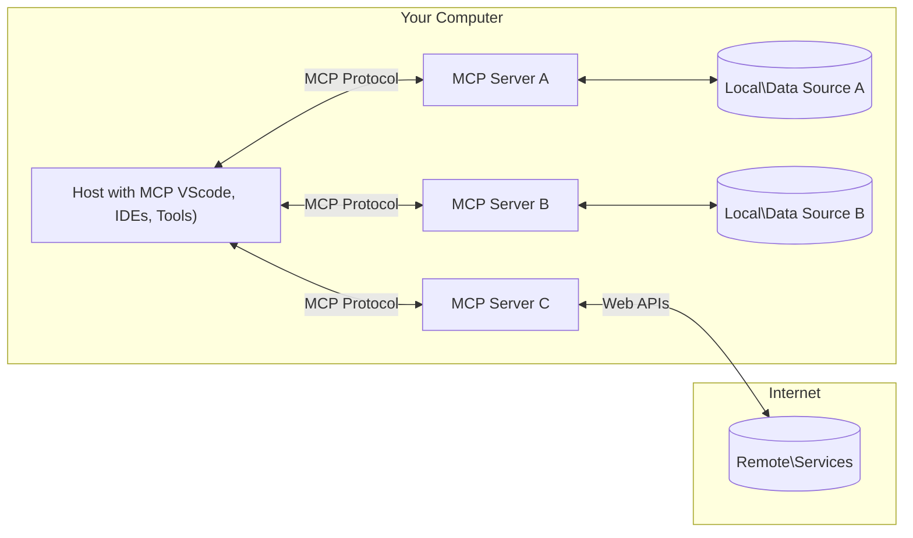

<!--
CO_OP_TRANSLATOR_METADATA:
{
  "original_hash": "b3b4a6ad10c3c0edbf7fa7cfa0ec496b",
  "translation_date": "2025-07-02T07:39:01+00:00",
  "source_file": "01-CoreConcepts/README.md",
  "language_code": "my"
}
-->
# 📖 MCP အခြေခံအယူအဆများ: AI ပေါင်းစည်းမှုအတွက် Model Context Protocol ကိုကျွမ်းကျင်စွာအသုံးပြုခြင်း

[Model Context Protocol (MCP)](https://github.com/modelcontextprotocol) သည် ကြီးမားသောဘာသာစကားမော်ဒယ်များ (LLMs) နှင့် ပြင်ပကိရိယာများ၊ အက်ပလီကေးရှင်းများ၊ ဒေတာရင်းမြစ်များအကြား ဆက်သွယ်မှုကို ထိရောက်စွာ စနစ်တကျ တိုးတက်စေသည့် အင်အားကြီးပြီး စံချိန်စံညွှန်းထားသော ဖွဲ့စည်းပုံတစ်ခုဖြစ်သည်။ ဒီ SEO အတွက် အဆင်ပြေသောလမ်းညွှန်စာအုပ်က MCP ၏ အဓိကအယူအဆများကို သင်ကြားပေးမှာဖြစ်ပြီး၊ ၎င်း၏ client-server ဖွဲ့စည်းပုံ၊ အရေးပါသောအစိတ်အပိုင်းများ၊ ဆက်သွယ်မှုနည်းလမ်းများနှင့် အကောင်းဆုံးအကောင်အထည်ဖော်နည်းများကို နားလည်စေပါလိမ့်မည်။

## အနှစ်ချုပ်

ဒီသင်ခန်းစာမှာ Model Context Protocol (MCP) စနစ်၏ အခြေခံဖွဲ့စည်းပုံနှင့် အစိတ်အပိုင်းများကို လေ့လာသွားမှာဖြစ်သည်။ သင်သည် client-server ဖွဲ့စည်းပုံ၊ အဓိကအစိတ်အပိုင်းများနှင့် MCP ဆက်သွယ်မှုများကို အာရုံစိုက်လေ့လာရမည်ဖြစ်သည်။

## 👩‍🎓 အဓိကသင်ယူရမည့်အချက်များ

ဒီသင်ခန်းစာကုန်ဆုံးချိန်တွင် သင်သည် -

- MCP client-server ဖွဲ့စည်းပုံကို နားလည်နိုင်မည်။
- Hosts, Clients, Servers ၏ အခန်းကဏ္ဍများနှင့် တာဝန်များကို ဖော်ထုတ်နိုင်မည်။
- MCP ကို ညှိနှိုင်းပေါင်းစည်းမှု အလွယ်တကူဖြစ်စေသည့် အဓိကအင်္ဂါရပ်များကို ခွဲခြမ်းစိတ်ဖြာနိုင်မည်။
- MCP စနစ်အတွင်း သတင်းအချက်အလက်များ ဘယ်လိုလည်ပတ်နေသည်ကို လေ့လာနိုင်မည်။
- .NET, Java, Python, JavaScript မှာ ရေးထားသော ကုဒ်ဥပမာများမှတဆင့် လက်တွေ့အသုံးချမှုများကို သိရှိနိုင်မည်။

## 🔎 MCP ဖွဲ့စည်းပုံ: ပိုမိုနက်နဲစွာကြည့်ရှုခြင်း

MCP စနစ်သည် client-server ပုံစံအပေါ် အခြေခံထားသည်။ ဒီ modular ဖွဲ့စည်းပုံက AI အက်ပလီကေးရှင်းများကို ကိရိယာများ၊ ဒေတာဘေ့စ်များ၊ API များနှင့် ပတ်ဝန်းကျင်အရင်းအမြစ်များနှင့် ထိရောက်စွာ ဆက်သွယ်နိုင်စေသည်။ ဒီဖွဲ့စည်းပုံကို အဓိကအစိတ်အပိုင်းများအဖြစ် ခွဲခြမ်းကြည့်ကြရအောင်။

MCP ၏ အခြေခံမှာ client-server ဖွဲ့စည်းပုံဖြစ်ပြီး host application တစ်ခုက server များစွာနှင့် ချိတ်ဆက်နိုင်သည်။



- **MCP Hosts**: VSCode, Claude Desktop, IDE များ သို့မဟုတ် MCP မှတဆင့် ဒေတာများကို ရယူလိုသော AI ကိရိယာများကဲ့သို့သော ပရိုဂရမ်များ
- **MCP Clients**: Server များနှင့် 1:1 ချိတ်ဆက်မှုကို ထိန်းသိမ်းထားသော protocol clients များ
- **MCP Servers**: စံချိန်စံညွှန်း Model Context Protocol အတိုင်း အထူးစွမ်းရည်များကို ဖော်ပြပေးသည့် ပရိုဂရမ်အသေးစားများ
- **Local Data Sources**: သင့်ကွန်ပျူတာတွင်ရှိသော ဖိုင်များ၊ ဒေတာဘေ့စ်များနှင့် MCP servers များက လုံခြုံစွာ ဝင်ရောက်အသုံးပြုနိုင်သော ဝန်ဆောင်မှုများ
- **Remote Services**: MCP servers များက API များမှတဆင့် ချိတ်ဆက်နိုင်သော အင်တာနက်ပေါ်ရှိ ပြင်ပစနစ်များ

MCP Protocol သည် တိုးတက်ဆဲ စံချိန်စံညွှန်းဖြစ်ပြီး နောက်ဆုံးထွက် protocol specification ကို [protocol specification](https://modelcontextprotocol.io/specification/2025-06-18/) မှာ ကြည့်ရှုနိုင်ပါသည်။

### 1. Hosts

Model Context Protocol (MCP) တွင် Hosts သည် အသုံးပြုသူများ protocol နှင့် ဆက်သွယ်ရာတွင် အဓိကအင်တာဖေ့စ်အဖြစ် အရေးပါသော အခန်းကဏ္ဍကို ထမ်းဆောင်သည်။ Hosts များမှာ MCP servers များနှင့် ချိတ်ဆက်၍ ဒေတာ၊ ကိရိယာများနှင့် prompt များကို ရယူလိုသော အက်ပလီကေးရှင်းများ သို့မဟုတ် ပတ်ဝန်းကျင်များဖြစ်သည်။ ဥပမာအနေနှင့် Visual Studio Code ကဲ့သို့သော IDE များ၊ Claude Desktop ကဲ့သို့သော AI ကိရိယာများ သို့မဟုတ် အထူးအတွက် ဖန်တီးထားသော custom agents များ ပါဝင်သည်။

**Hosts** သည် LLM applications များဖြစ်ပြီး ချိတ်ဆက်မှုများကို စတင်ပြုလုပ်သည်။ ၎င်းတို့သည် -

- AI မော်ဒယ်များနှင့် ဆက်သွယ်၍ တုံ့ပြန်ချက်များ ထုတ်ပေးသည်။
- MCP servers များနှင့် ချိတ်ဆက်မှု စတင်သည်။
- စကားဝိုင်းလည်ပတ်မှုနှင့် အသုံးပြုသူအင်တာဖေ့စ်ကို စီမံခန့်ခွဲသည်။
- ခွင့်ပြုချက်နှင့် လုံခြုံရေး ကန့်သတ်ချက်များကို ထိန်းချုပ်သည်။
- ဒေတာမျှဝေခြင်းနှင့် ကိရိယာ အသုံးပြုခြင်းအတွက် အသုံးပြုသူ သဘောတူညီမှုကို ကိုင်တွယ်သည်။

### 2. Clients

Clients များသည် Hosts နှင့် MCP servers များအကြား ဆက်သွယ်မှုကို အထောက်အကူပြုသော အရေးပါသောအစိတ်အပိုင်းများဖြစ်သည်။ Clients သည် အလယ်အလတ်အဖြစ် လုပ်ဆောင်ပြီး Hosts များအား MCP servers များပေးသော လုပ်ဆောင်ချက်များကို အသုံးပြုခွင့်ပြုသည်။ MCP ဖွဲ့စည်းပုံအတွင်း ဆက်သွယ်မှု ပျော်မွေ့စေပြီး ဒေတာလဲလှယ်မှု ထိရောက်စေသည်။

**Clients** သည် host application အတွင်း ချိတ်ဆက်သူများဖြစ်သည်။ ၎င်းတို့သည် -

- Server များသို့ prompt/ညွှန်ကြားချက်များဖြင့် တောင်းဆိုမှုများ ပေးပို့သည်။
- Server များနှင့် စွမ်းဆောင်ရည်များကို ညှိနှိုင်းသည်။
- မော်ဒယ်များမှ ကိရိယာ အမိန့်များကို စီမံခန့်ခွဲသည်။
- တုံ့ပြန်ချက်များကို အသုံးပြုသူထံ ပြသသည်။

### 3. Servers

Servers များသည် MCP clients များမှ တောင်းဆိုမှုများကို ကိုင်တွယ်ပြီး သင့်တော်သော တုံ့ပြန်ချက်များ ပေးပို့ရန် တာဝန်ရှိသည်။ ဒေတာ ရယူခြင်း၊ ကိရိယာ လုပ်ဆောင်ခြင်းနှင့် prompt ဖန်တီးခြင်းကဲ့သို့သော လုပ်ငန်းစဉ်များကို စီမံခန့်ခွဲသည်။ Servers များသည် clients နှင့် Hosts အကြား ဆက်သွယ်မှုကို ထိရောက်စွာနှင့် ယုံကြည်စိတ်ချစွာ ပြုလုပ်နိုင်ရန် အာမခံသည်။

**Servers** သည် context နှင့် စွမ်းဆောင်ရည်များကို ပေးသည့် ဝန်ဆောင်မှုများဖြစ်သည်။ ၎င်းတို့သည် -

- ရနိုင်သော လက္ခဏာများ (ရင်းမြစ်များ၊ prompt များ၊ ကိရိယာများ) ကို မှတ်ပုံတင်သည်။
- Client မှ ကိရိယာခေါ်ဆိုမှုများကို လက်ခံပြီး အကောင်အထည်ဖော်သည်။
- မော်ဒယ်တုံ့ပြန်ချက်များအား မြှင့်တင်ရန် ပတ်ဝန်းကျင်သတင်းအချက်အလက် ပေးသည်။
- တုံ့ပြန်ချက်များကို client ထံ ပြန်ပေးပို့သည်။
- လိုအပ်ပါက ဆက်သွယ်မှုများအတွင်း အခြေအနေကို ထိန်းသိမ်းထားသည်။

Servers များကို မည်သူမဆို မော်ဒယ်စွမ်းရည်များကို အထူးပြု လုပ်ဆောင်ချက်များဖြင့် တိုးချဲ့ဖန်တီးနိုင်သည်။

### 4. Server Features

Model Context Protocol (MCP) ၏ Servers များသည် clients, hosts နှင့် ဘာသာစကားမော်ဒယ်များအကြား အပြည့်အဝ ဆက်သွယ်မှုများကို ချဲ့ထွင်ပေးသည့် အခြေခံဖွဲ့စည်းပုံများကို ပံ့ပိုးပေးသည်။ ဤအင်္ဂါရပ်များသည် MCP ၏ စွမ်းရည်များကို ဖွံ့ဖြိုးတိုးတက်စေရန် ဖွဲ့စည်းထားသော ပတ်ဝန်းကျင်၊ ကိရိယာများနှင့် prompt များကို ပေးစွမ်းသည်။

MCP servers များက အောက်ပါ အင်္ဂါရပ်များကို တစ်ခုခု သို့မဟုတ် အများအပြား ပေးနိုင်သည် -

#### 📑 Resources

Model Context Protocol (MCP) ၏ Resources တွင် အသုံးပြုသူများ သို့မဟုတ် AI မော်ဒယ်များ အသုံးချနိုင်သော ပတ်ဝန်းကျင်နှင့် ဒေတာအမျိုးမျိုး ပါဝင်သည်။ ၎င်းတို့မှာ -

- **ပတ်ဝန်းကျင် ဒေတာ**: အသုံးပြုသူများ သို့မဟုတ် AI မော်ဒယ်များ အတွက် ဆုံးဖြတ်ချက်ချခြင်းနှင့် လုပ်ငန်းတာဝန်များ အတွက် အသုံးချနိုင်သော သတင်းအချက်အလက်များ။
- **အသိပညာအခြေခံများနှင့် စာရွက်စာတမ်း စုစည်းမှုများ**: ဆောင်းပါးများ၊ လက်စွဲစာအုပ်များ၊ သုတေသနစာတမ်းများကဲ့သို့ ဖွဲ့စည်းထားသော ဒေတာများနှင့် မဖွဲ့စည်းထားသော ဒေတာများ စုစည်းထားခြင်း။
- **ဒေသတွင်း ဖိုင်များနှင့် ဒေတာဘေ့စ်များ**: စက်ပစ္စည်းများတွင် ဒေသတွင်း သိမ်းဆည်းထားသော ဒေတာများ သို့မဟုတ် ဒေတာဘေ့စ်များ၊ ချဲ့ထွင်သုံးစွဲနိုင်သည်။
- **API များနှင့် ဝဘ်ဝန်ဆောင်မှုများ**: အွန်လိုင်းရင်းမြစ်များနှင့် ကိရိယာများနှင့် ပေါင်းစည်းနိုင်ရန် အပို ဒေတာများနှင့် လုပ်ဆောင်ချက်များ ပေးသည့် ပြင်ပအင်တာဖေ့စ်များ။

Resource ၏ ဥပမာတစ်ခုမှာ ဒေတာဘေ့စ် schema သို့မဟုတ် ဖိုင်တစ်ခု ဖြစ်နိုင်ပြီး အောက်ပါအတိုင်း ဝင်ရောက်အသုံးပြုနိုင်သည် -

```text
file://log.txt
database://schema
```

### 🤖 Prompts

Model Context Protocol (MCP) ၏ Prompts တွင် အသုံးပြုသူလုပ်ငန်းစဉ်များကို လွယ်ကူစေရန်နှင့် ဆက်သွယ်မှုကို တိုးတက်စေရန် ကြိုတင်သတ်မှတ်ထားသော စမ်းသပ်ပုံစံများနှင့် ဆက်သွယ်မှု ပုံစံများ ပါဝင်သည်။ ၎င်းတို့မှာ -

- **ပုံစံပြုထားသော စာတိုများနှင့် လုပ်ငန်းစဉ်များ**: အသုံးပြုသူများကို အထူးလုပ်ငန်းများနှင့် ဆက်သွယ်မှုများအတွက် ဦးတည်ညွှန်ကြားပေးသည့် ကြိုတင်ဖွဲ့စည်းထားသော စာတိုများနှင့် လုပ်ငန်းစဉ်များ။
- **ကြိုတင်သတ်မှတ်ထားသော ဆက်သွယ်မှု ပုံစံများ**: တူညီပြီး ထိရောက်သော ဆက်သွယ်မှုအတွက် စံချိန်စံညွှန်းထားသော လုပ်ဆောင်ချက်များနှင့် တုံ့ပြန်ချက်များ စဉ်ဆက်မပြတ်။
- **အထူးပြု ဆွေးနွေးမှု ပုံစံများ**: အထူးပြု ဆွေးနွေးမှုအမျိုးအစားများအတွက် ကိုက်ညီသည့် ပုံစံများ၊ ပတ်ဝန်းကျင်နှင့် သင့်တော်သော ဆက်သွယ်မှုများကို အာမခံသည်။

Prompt ပုံစံတစ်ခုမှာ အောက်ပါအတိုင်း ဖြစ်နိုင်သည် -

```markdown
Generate a product slogan based on the following {{product}} with the following {{keywords}}
```

#### ⛏️ Tools

Model Context Protocol (MCP) ၏ Tools များသည် AI မော်ဒယ်က တိကျသော လုပ်ငန်းများ ပြုလုပ်ရန် အကောင်အထည်ဖော်နိုင်သော function များဖြစ်သည်။ ၎င်းတို့သည် AI မော်ဒယ်၏ စွမ်းရည်များကို တိုးမြှင့်ရန် ဖွဲ့စည်းထားပြီး ယုံကြည်စိတ်ချရသော လုပ်ဆောင်ချက်များ ပေးစွမ်းသည်။ အဓိက အချက်များမှာ -

- **AI မော်ဒယ်က လုပ်ဆောင်နိုင်သော function များ**: Tools များသည် AI မော်ဒယ်က ဖိတ်ခေါ်၍ အမျိုးမျိုးသော လုပ်ငန်းများ ပြုလုပ်နိုင်သည့် function များဖြစ်သည်။
- **ထူးခြားသော နာမည်နှင့် ဖော်ပြချက်**: Tools တစ်ခုချင်းစီမှာ ထူးခြားသည့် နာမည်နှင့် ၎င်း၏ ရည်ရွယ်ချက်နှင့် လုပ်ဆောင်ချက်ကို ဖော်ပြသည့် အသေးစိတ်ဖော်ပြချက် ရှိသည်။
- **parameters များနှင့် output များ**: Tools များသည် သတ်မှတ်ထားသော parameters များကို လက်ခံပြီး ဖွဲ့စည်းထားသော output များ ပြန်ပေးသည်၊ ထိုကဲ့သို့ စနစ်တကျနှင့် ခန့်မှန်းနိုင်သော ရလဒ်များ ထုတ်ပေးသည်။
- **ခွဲခြားထားသော function များ**: Tools များသည် ဝဘ်ရှာဖွေမှုများ၊ တွက်ချက်မှုများ၊ ဒေတာဘေ့စ် မေးခွန်းများ ကဲ့သို့ ခွဲခြားထားသော function များကို လုပ်ဆောင်သည်။

Tool ဥပမာတစ်ခုမှာ အောက်ပါအတိုင်း ဖြစ်နိုင်သည် -

```typescript
server.tool(
  "GetProducts",
  {
    pageSize: z.string().optional(),
    pageCount: z.string().optional()
  }, () => {
    // return results from API
  }
)
```

## Client Features

Model Context Protocol (MCP) တွင် clients များသည် servers များအား အဓိက feature အချို့ ပေးစွမ်းပြီး protocol ၏ စုစည်းမှုနှင့် ဆက်သွယ်မှုကို တိုးတက်စေသည်။ ထူးခြားသော feature တစ်ခုမှာ Sampling ဖြစ်သည်။

### 👉 Sampling

- **Server မှ စတင်သော Agentic လုပ်ဆောင်မှုများ**: Clients များက servers များအား အလိုအလျောက် အရေးကြီး လုပ်ဆောင်ချက်များ စတင်လုပ်ဆောင်နိုင်စေရန် ခွင့်ပြုသည်၊ စနစ်၏ ဒိုင်နမစ်စွမ်းရည်များ တိုးတက်စေသည်။
- **Recursive LLM ဆက်သွယ်မှုများ**: ဒီ feature သည် ကြီးမားသော ဘာသာစကားမော်ဒယ်များ (LLMs) နှင့် ထပ်ခါတလဲလဲ ဆက်သွယ်နိုင်စေရန် ခွင့်ပြုသည်၊ လုပ်ငန်းများကို ပိုမိုရှုပ်ထွေးပြီး ထပ်တလဲလဲ လုပ်ဆောင်နိုင်သည်။
- **မော်ဒယ်မှ အပိုပြီး ပြည့်စုံမှုများ တောင်းဆိုခြင်း**: Servers များက မော်ဒယ်ထံမှ အပိုပြီး ပြည့်စုံသော တုံ့ပြန်ချက်များကို တောင်းဆိုနိုင်သည်၊ တုံ့ပြန်ချက်များ သေချာပြီး ပတ်ဝန်းကျင်နှင့် ကိုက်ညီစေရန်။

## MCP အတွင်း သတင်းအချက်အလက် လည်ပတ်မှု

Model Context Protocol (MCP) သည် hosts, clients, servers နှင့် မော်ဒယ်များအကြား သတင်းအချက်အလက် လည်ပတ်မှုတစ်ခုကို ဖေါ်ပြထားသည်။ ဒီလည်ပတ်မှုကို နားလည်ခြင်းဖြင့် အသုံးပြုသူ တောင်းဆိုချက်များ ဘယ်လို ကိုင်

**အကြောင်းကြားချက်**  
ဤစာရွက်စာတမ်းကို AI ဘာသာပြန်ဝန်ဆောင်မှု [Co-op Translator](https://github.com/Azure/co-op-translator) ကို အသုံးပြု၍ ဘာသာပြန်ထားပါသည်။ တိကျမှန်ကန်မှုအတွက် ကြိုးစားသော်လည်း အလိုအလျောက် ဘာသာပြန်ချက်များတွင် အမှားများ သို့မဟုတ် မှားယွင်းချက်များ ရှိနိုင်ပါကြောင်း သတိပြုပါရန်။ မူရင်းစာရွက်စာတမ်းကို မူလဘာသာဖြင့်သာ တရားဝင်အရင်းအမြစ်အဖြစ် သတ်မှတ်သင့်ပါသည်။ အရေးကြီးသော အချက်အလက်များအတွက် လူ့ဘာသာပြန်ကျွမ်းကျင်သူများ၏ ဘာသာပြန်ချက်ကို အသုံးပြုရန် အကြံပြုပါသည်။ ဤဘာသာပြန်ချက် အသုံးပြုမှုကြောင့် ဖြစ်ပေါ်လာနိုင်သည့် နားလည်မှားယွင်းမှုများအတွက် ကျွန်ုပ်တို့တာဝန်မရှိပါ။