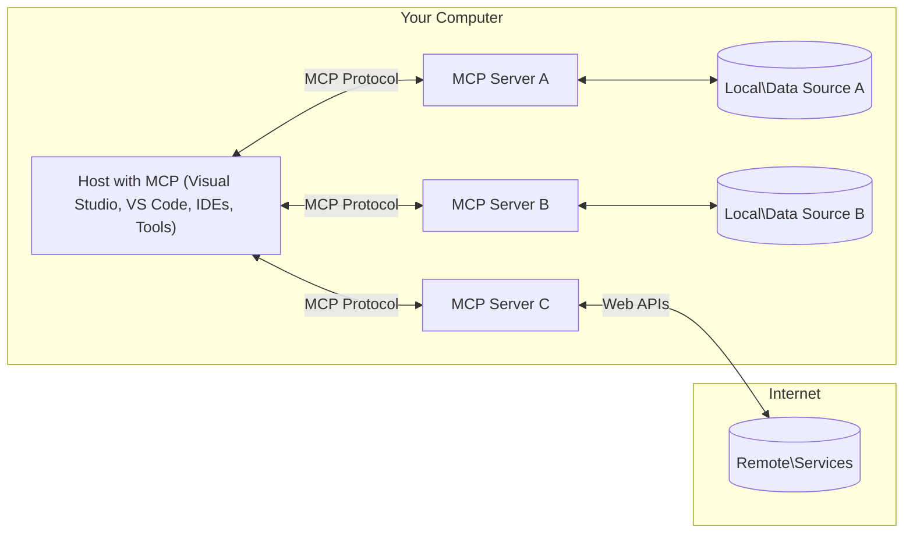

<!--
CO_OP_TRANSLATOR_METADATA:
{
  "original_hash": "88b863a69b4f18b15e82da358ffd3489",
  "translation_date": "2025-08-21T13:57:58+00:00",
  "source_file": "01-CoreConcepts/README.md",
  "language_code": "my"
}
-->
# MCP အဓိကအကြောင်းအရာများ: AI ပေါင်းစည်းမှုအတွက် Model Context Protocol ကိုကျွမ်းကျင်စွာအသုံးပြုခြင်း

[](https://youtu.be/earDzWGtE84)

_(ဤသင်ခန်းစာ၏ဗီဒီယိုကိုကြည့်ရန် အထက်ပါပုံကိုနှိပ်ပါ)_

[Model Context Protocol (MCP)](https://github.com/modelcontextprotocol) သည် Large Language Models (LLMs) နှင့် ပြင်ပကိရိယာများ၊ အပလီကေးရှင်းများနှင့် ဒေတာအရင်းအမြစ်များအကြား ဆက်သွယ်မှုကို အကောင်းဆုံးဖြစ်စေသော စံပြစနစ်တစ်ခုဖြစ်သည်။  
ဤလမ်းညွှန်စာအုပ်သည် MCP ၏ အဓိကအကြောင်းအရာများကို သင်ကြားပေးမည်ဖြစ်သည်။ Client-server စနစ်၊ အရေးကြီးသောအစိတ်အပိုင်းများ၊ ဆက်သွယ်မှုစနစ်များနှင့် အကောင်းဆုံးအကောင်အထည်ဖော်နည်းများကို သင်လေ့လာနိုင်မည်ဖြစ်သည်။

- **အသုံးပြုသူ၏ သဘောတူညီမှု**: ဒေတာဝင်ရောက်မှုနှင့် လုပ်ဆောင်မှုအားလုံးသည် အသုံးပြုသူ၏ သဘောတူညီမှုကို ရရှိထားရမည်။ အသုံးပြုသူများသည် ဝင်ရောက်မည့်ဒေတာနှင့် လုပ်ဆောင်မည့်အရာများကို ရှင်းလင်းစွာနားလည်ပြီး ခွင့်ပြုချက်များနှင့် အာဏာပေးမှုများကို အသေးစိတ်ထိန်းချုပ်နိုင်ရမည်။

- **ဒေတာကိုယ်ရေးကိုယ်တာအကာအကွယ်**: အသုံးပြုသူ၏ ဒေတာကို သဘောတူညီမှုမရှိဘဲ မဖော်ထုတ်ရ။ ဆက်သွယ်မှုတစ်ခုလုံးတွင် ခိုင်မာသော ဝင်ရောက်ခွင့်ထိန်းချုပ်မှုများဖြင့် ကာကွယ်ထားရမည်။ မလိုလားအပ်သော ဒေတာပို့ဆောင်မှုများကို တားဆီးပြီး ကိုယ်ရေးကိုယ်တာအကန့်အသတ်များကို တင်းကျပ်စွာထိန်းသိမ်းရမည်။

- **ကိရိယာအသုံးပြုမှုလုံခြုံမှု**: ကိရိယာတစ်ခုချင်းစီကို အသုံးပြုမည့်အခါ အသုံးပြုသူ၏ သဘောတူညီမှုနှင့် ကိရိယာ၏ လုပ်ဆောင်နိုင်မှု၊ ပါရာမီတာများနှင့် ဖြစ်နိုင်သော သက်ရောက်မှုများကို ရှင်းလင်းစွာနားလည်ရမည်။ မလိုလားအပ်သော၊ မလုံခြုံသော သို့မဟုတ် မကောင်းမဆိုးသော ကိရိယာအသုံးပြုမှုများကို တားဆီးရန် ခိုင်မာသော လုံခြုံရေးကန့်သတ်ချက်များရှိရမည်။

- **သယ်ယူပို့ဆောင်မှုအလွှာလုံခြုံမှု**: ဆက်သွယ်မှုလမ်းကြောင်းအားလုံးသည် သင့်လျော်သော စာဝှက်ခြင်းနှင့် အတည်ပြုမှုစနစ်များကို အသုံးပြုရမည်။ ဝေးလံသောဆက်သွယ်မှုများတွင် လုံခြုံသော သယ်ယူပို့ဆောင်မှုနည်းလမ်းများနှင့် သင့်လျော်သော အထောက်အထားစီမံခန့်ခွဲမှုများကို အကောင်အထည်ဖော်ရမည်။

#### အကောင်အထည်ဖော်မှုလမ်းညွှန်ချက်များ:

- **ခွင့်ပြုချက်စီမံခန့်ခွဲမှု**: အသုံးပြုသူများအား ဝင်ရောက်ခွင့်ရှိသော server များ၊ ကိရိယာများနှင့် အရင်းအမြစ်များကို ထိန်းချုပ်နိုင်စေရန် အသေးစိတ်ခွင့်ပြုချက်စနစ်များကို အကောင်အထည်ဖော်ပါ  
- **အတည်ပြုမှုနှင့် အာဏာပေးမှု**: လုံခြုံသော အတည်ပြုမှုနည်းလမ်းများ (OAuth, API key များ) ကို သက်တမ်းကုန်ဆုံးမှုနှင့် token စီမံခန့်ခွဲမှုမှန်ကန်စွာ အသုံးပြုပါ  
- **အဝင်ဒေတာစစ်ဆေးမှု**: Injection အတိုက်အခံများကို တားဆီးရန် သတ်မှတ်ထားသော schema များအတိုင်း ပါရာမီတာများနှင့် အဝင်ဒေတာအားလုံးကို စစ်ဆေးပါ  
- **မှတ်တမ်းသိမ်းဆည်းမှု**: လုံခြုံရေးစောင့်ကြည့်မှုနှင့် လိုက်နာမှုအတွက် လုပ်ဆောင်မှုအားလုံး၏ ပြည့်စုံသော မှတ်တမ်းများကို ထိန်းသိမ်းပါ  

## အကျဉ်းချုပ်

ဤသင်ခန်းစာတွင် Model Context Protocol (MCP) စနစ်၏ အခြေခံဖွဲ့စည်းမှုနှင့် အစိတ်အပိုင်းများကို လေ့လာမည်ဖြစ်သည်။ MCP ဆက်သွယ်မှုများကို အားပေးသော client-server စနစ်၊ အဓိကအစိတ်အပိုင်းများနှင့် ဆက်သွယ်မှုစနစ်များကို သင်လေ့လာနိုင်မည်ဖြစ်သည်။

## အဓိကသင်ယူရမည့်ရည်ရွယ်ချက်များ

ဤသင်ခန်းစာအဆုံးတွင် သင်သည်-

- MCP client-server စနစ်ကို နားလည်နိုင်မည်။
- Hosts, Clients, နှင့် Servers ၏ အခန်းကဏ္ဍများနှင့် တာဝန်များကို သတ်မှတ်နိုင်မည်။
- MCP ကို အပြောင်းအလဲများအတွက် တိကျသော ပေါင်းစည်းမှုအလွှာဖြစ်စေသော အဓိကအင်္ဂါရပ်များကို ခွဲခြားနိုင်မည်။
- MCP စနစ်အတွင်း ဒေတာစီးဆင်းမှုကို လေ့လာနိုင်မည်။
- .NET, Java, Python, နှင့် JavaScript တို့ဖြင့် ကုဒ်ဥပမာများမှ လက်တွေ့အမြင်များ ရရှိနိုင်မည်။

## MCP ဖွဲ့စည်းမှု: နက်ရှိုင်းစွာလေ့လာခြင်း

MCP စနစ်သည် client-server မော်ဒယ်ပေါ်တွင် တည်ဆောက်ထားသည်။ ဤ module-based ဖွဲ့စည်းမှုသည် AI အပလီကေးရှင်းများအား ကိရိယာများ၊ ဒေတာဘေ့စ်များ၊ API များနှင့် အကြောင်းအရာဆိုင်ရာ အရင်းအမြစ်များနှင့် ထိရောက်စွာ ဆက်သွယ်နိုင်စေသည်။ ယခုဖွဲ့စည်းမှုကို အဓိကအစိတ်အပိုင်းများအဖြစ် ခွဲခြားကြည့်ရှုကြမည်။

MCP ၏ အခြေခံတွင် client-server ဖွဲ့စည်းမှုကို လိုက်နာပြီး host application တစ်ခုသည် server များစွာနှင့် ချိတ်ဆက်နိုင်သည်-



- **MCP Hosts**: VSCode, Claude Desktop, IDEs, သို့မဟုတ် MCP မှတစ်ဆင့် ဒေတာဝင်ရောက်လိုသော AI ကိရိယာများ  
- **MCP Clients**: Server များနှင့် 1:1 ဆက်သွယ်မှုကို ထိန်းသိမ်းထားသော protocol clients  
- **MCP Servers**: Model Context Protocol စံစနစ်ဖြင့် အထူးစွမ်းဆောင်ရည်များကို ဖော်ထုတ်သော ပေါ့ပါးသော ပရိုဂရမ်များ  
- **Local Data Sources**: MCP servers မှ လုံခြုံစွာ ဝင်ရောက်နိုင်သော သင့်ကွန်ပျူတာ၏ ဖိုင်များ၊ ဒေတာဘေ့စ်များနှင့် ဝန်ဆောင်မှုများ  
- **Remote Services**: MCP servers မှ API များမှတစ်ဆင့် ချိတ်ဆက်နိုင်သော အင်တာနက်ပေါ်ရှိ ပြင်ပစနစ်များ  

MCP Protocol သည် YYYY-MM-DD ပုံစံဖြင့် ရက်စွဲအခြေပြု ဗားရှင်းစနစ်ကို အသုံးပြုသော တိုးတက်နေသော စံစနစ်တစ်ခုဖြစ်သည်။ လက်ရှိ protocol ဗားရှင်းမှာ **2025-06-18** ဖြစ်သည်။ [protocol specification](https://modelcontextprotocol.io/specification/2025-06-18/) တွင် နောက်ဆုံးအပ်ဒိတ်များကို ကြည့်ရှုနိုင်သည်။

### 1. Hosts

Model Context Protocol (MCP) တွင် **Hosts** သည် အသုံးပြုသူများမှ protocol နှင့် အဓိကအဆက်အသွယ်အဖြစ် တာဝန်ယူသော AI အပလီကေးရှင်းများဖြစ်သည်။ Hosts များသည် MCP server များစွာနှင့် ချိတ်ဆက်မှုများကို စီမံခန့်ခွဲရန် MCP clients များကို ဖန်တီးပေးသည်။ Host များ၏ ဥပမာများမှာ-

- **AI အပလီကေးရှင်းများ**: Claude Desktop, Visual Studio Code, Claude Code  
- **ဖွံ့ဖြိုးရေးပတ်ဝန်းကျင်များ**: MCP ပေါင်းစည်းမှုပါရှိသော IDE များနှင့် ကုဒ်တည်းဖြတ်သူများ  
- **စိတ်ကြိုက်အပလီကေးရှင်းများ**: ရည်ရွယ်ချက်အထူးပြု AI အေးဂျင့်များနှင့် ကိရိယာများ  

**Hosts** သည် AI မော်ဒယ်အဆက်အသွယ်များကို စီမံခန့်ခွဲသော အပလီကေးရှင်းများဖြစ်သည်။ ၎င်းတို့သည်-

- **AI မော်ဒယ်များကို စီမံခန့်ခွဲခြင်း**: LLM များကို အကောင်အထည်ဖော်ခြင်း သို့မဟုတ် အပြန်အလှန်ဆက်သွယ်ခြင်းဖြင့် AI လုပ်ငန်းစဉ်များကို စီမံခန့်ခွဲသည်  
- **Client ချိတ်ဆက်မှုများကို စီမံခန့်ခွဲခြင်း**: MCP server တစ်ခုချင်းစီအတွက် MCP client တစ်ခုစီကို ဖန်တီးပြီး ထိန်းသိမ်းသည်  
- **အသုံးပြုသူအင်တာဖေ့စ်ကို ထိန်းချုပ်ခြင်း**: စကားဝိုင်းစီးဆင်းမှု၊ အသုံးပြုသူအပြန်အလှန်ဆက်သွယ်မှုများနှင့် အဖြေတင်ပြမှုကို စီမံခန့်ခွဲသည်  
- **လုံခြုံရေးကို အာမခံခြင်း**: ခွင့်ပြုချက်များ၊ လုံခြုံရေးကန့်သတ်ချက်များနှင့် အတည်ပြုမှုများကို ထိန်းချုပ်သည်  
- **အသုံးပြုသူ၏ သဘောတူညီမှုကို စီမံခန့်ခွဲခြင်း**: ဒေတာမျှဝေမှုနှင့် ကိရိယာအသုံးပြုမှုအတွက် အသုံးပြုသူ၏ အတည်ပြုမှုကို စီမံခန့်ခွဲသည်  

### 2. Clients

**Clients** သည် Hosts နှင့် MCP servers အကြား တစ်ဦးချင်းဆက်သွယ်မှုများကို ထိန်းသိမ်းထားသော အရေးကြီးအစိတ်အပိုင်းများဖြစ်သည်။ MCP client တစ်ခုစီသည် Host မှ ဖန်တီးပြီး သီးသန့် MCP server တစ်ခုနှင့် ချိတ်ဆက်ထားသည်။ Clients များသည် Hosts များအား တစ်ချိန်တည်းတွင် server များစွာနှင့် ချိတ်ဆက်နိုင်စေသည်။

**Clients** သည် host application အတွင်းရှိ ချိတ်ဆက်မှုအစိတ်အပိုင်းများဖြစ်သည်။ ၎င်းတို့သည်-

- **Protocol ဆက်သွယ်မှု**: JSON-RPC 2.0 တောင်းဆိုမှုများကို server များသို့ ပို့ပေးသည်  
- **စွမ်းဆောင်ရည်ညှိနှိုင်းမှု**: စတင်ချိန်တွင် server များနှင့် protocol ဗားရှင်းများနှင့် အင်္ဂါရပ်များကို ညှိနှိုင်းသည်  
- **ကိရိယာအကောင်အထည်ဖော်မှု**: မော်ဒယ်များမှ tool execution တောင်းဆိုမှုများကို စီမံခန့်ခွဲပြီး အဖြေများကို ပြန်လည်ဆောင်ရွက်သည်  
- **အချိန်နှင့်တပြေးညီ အပ်ဒိတ်များ**: server များမှ အကြောင်းကြားချက်များနှင့် အပ်ဒိတ်များကို စီမံခန့်ခွဲသည်  
- **အဖြေများကို စီမံခြင်း**: server ၏ အဖြေများကို အသုံးပြုသူများအတွက် ပြသရန် ဖော်ပြပေးသည်  

### 3. Servers

**Servers** သည် MCP clients များအား context, tools, နှင့် စွမ်းဆောင်ရည်များကို ပေးစွမ်းသော ပရိုဂရမ်များဖြစ်သည်။ ၎င်းတို့သည် local (Host နှင့် တူညီသောစက်ပေါ်တွင်) သို့မဟုတ် remote (ပြင်ပပလက်ဖောင်းများပေါ်တွင်) အကောင်အထည်ဖော်နိုင်ပြီး client တောင်းဆိုမှုများကို ကိုင်တွယ်ပြီး ဖွဲ့စည်းထားသော အဖြေများကို ပေးသည်။ Servers များသည် Model Context Protocol စံစနစ်ဖြင့် အထူးစွမ်းဆောင်ရည်များကို ဖော်ထုတ်သည်။

**Servers** သည် context နှင့် စွမ်းဆောင်ရည်များကို ပေးစွမ်းသော ဝန်ဆောင်မှုများဖြစ်သည်။ ၎င်းတို့သည်-

- **စွမ်းဆောင်ရည်မှတ်ပုံတင်မှု**: Clients များအား ရရှိနိုင်သော primitives (အရင်းအမြစ်များ, prompts, tools) များကို မှတ်ပုံတင်ပြီး ဖော်ထုတ်သည်  
- **တောင်းဆိုမှုကို ကိုင်တွယ်ခြင်း**: Clients များမှ tool calls, resource requests, နှင့် prompt requests များကို လက်ခံပြီး အကောင်အထည်ဖော်သည်  
- **အကြောင်းအရာပေးခြင်း**: မော်ဒယ်၏ အဖြေများကို မြှင့်တင်ရန် အကြောင်းအရာဆိုင်ရာ ဒေတာများကို ပေးသည်  
- **အခြေအနေစီမံခန့်ခွဲမှု**: လိုအပ်ပါက session state ကို ထိန်းသိမ်းပြီး stateful interactions များကို ကိုင်တွယ်သည်  
- **အချိန်နှင့်တပြေးညီ အကြောင်းကြားချက်များ**: Clients များအား စွမ်းဆောင်ရည်ပြောင်းလဲမှုများနှင့် အပ်ဒိတ်များကို ပေးပို့သည်  

Servers များကို မည်သူမဆို ဖွံ့ဖြိုးတိုးတက်စေပြီး အထူးစွမ်းဆောင်ရည်များဖြင့် မော်ဒယ်များကို တိုးချဲ့နိုင်သည်။ ၎င်းတို့သည် local နှင့် remote deployment အခြေအနေများနှစ်မျိုးလုံးကို ပံ့ပိုးပေးသည်။

### 4. Server Primitives

Model Context Protocol (MCP) တွင် Servers များသည် Clients, Hosts, နှင့် Language Models အကြား ချိတ်ဆက်မှုများကို ပိုမိုကြွယ်ဝစေသော အခြေခံအဆောက်အအုံများကို ပေးစွမ်းသည်။ Servers များသည် အောက်ပါ အခြေခံ primitives သုံးမျိုးကို ဖော်ထုတ်နိုင်သည်-

#### Resources

**Resources** သည် AI အပလီကေးရှင်းများအား အကြောင်းအရာဆိုင်ရာ ဒေတာများကို ပေးစွမ်းသော ဒေတာအရင်းအမြစ်များဖြစ်သည်။ ၎င်းတို့သည် မော်ဒယ်၏ နားလည်မှုနှင့် ဆုံးဖြတ်ချက်ချမှုများကို မြှင့်တင်စေသော static သို့မဟုတ် dynamic အကြောင်းအရာများကို ကိုယ်စားပြုသည်-

- **အကြောင်းအရာဆိုင်ရာ ဒေတာများ**: AI မော်ဒယ်များအတွက် ဖွဲ့စည်းထားသော အချက်အလက်များ  
- **အသိပညာအရင်းအမြစ်များ**: စာရွက်စာတမ်းများ၊ ဆောင်းပါးများ၊ လက်စွဲစာအုပ်များနှင့် သုတေသနစာတမ်းများ  
- **Local Data Sources**: ဖိုင်များ, ဒေတာဘေ့စ်များ, နှင့် local system အချက်အလက်များ  
- **ပြင်ပဒေတာများ**: API တုံ့ပြန်မှုများ, web services, နှင့် remote system ဒေတာများ  
- **Dynamic Content**: ပြင်ပအခြေအနေများအပေါ်မူတည်၍ အချိန်နှင့်တပြေးညီ အပ်ဒိတ်လုပ်ဆောင်သော ဒေတာများ  

Resources များကို URIs ဖြင့် သတ်မှတ်ပြီး `resources/list` နှင့် `resources/read` နည်းလမ်းများမှတစ်ဆင့် ရှာဖ
- **JSON-RPC 2.0 Protocol**: ဆက်သွယ်မှုအားလုံးသည် နည်းလမ်းခေါ်ဆိုမှုများ၊ တုံ့ပြန်မှုများနှင့် အသိပေးချက်များအတွက် စံပြ JSON-RPC 2.0 မက်ဆေ့ချ်ဖော်မတ်ကို အသုံးပြုသည်  
- **Lifecycle Management**: Client နှင့် Server အကြား ချိတ်ဆက်မှု စတင်ခြင်း၊ စွမ်းရည်ညှိနှိုင်းမှုနှင့် အစည်းအဝေးအဆုံးသတ်ခြင်းကို စီမံခန့်ခွဲသည်  
- **Server Primitives**: Server များအနေဖြင့် အဓိကလုပ်ဆောင်ချက်များကို ကိရိယာများ၊ အရင်းအမြစ်များနှင့် အကြံပြုချက်များမှတဆင့် ပံ့ပိုးပေးနိုင်စေသည်  
- **Client Primitives**: Server များအနေဖြင့် LLM များမှ နမူနာယူခြင်း၊ အသုံးပြုသူထံမှ အချက်အလက်တောင်းခံခြင်းနှင့် မှတ်တမ်းမက်ဆေ့ချ်များပို့ခြင်းကို တောင်းဆိုနိုင်စေသည်  
- **Real-time Notifications**: Polling မလိုအပ်ဘဲ အချိန်နှင့်တပြေးညီ အသိပေးချက်များကို ပံ့ပိုးပေးသည်  

#### အဓိကအင်္ဂါရပ်များ:

- **Protocol Version Negotiation**: သက်ဆိုင်မှုရှိစေရန် (YYYY-MM-DD) အခြေခံထားသော ဗားရှင်းစနစ်ကို အသုံးပြုသည်  
- **Capability Discovery**: Client နှင့် Server များအကြား စတင်ချိန်တွင် ပံ့ပိုးနိုင်သော အင်္ဂါရပ်များကို ဖလှယ်သည်  
- **Stateful Sessions**: အကြောင်းအရာဆက်စပ်မှုအတွက် အများအပြား အပြန်အလှန်ဆက်သွယ်မှုများအတွင်း ချိတ်ဆက်မှုအခြေအနေကို ထိန်းသိမ်းထားသည်  

### Transport Layer

**Transport Layer** သည် MCP ပါဝင်သူများအကြား ဆက်သွယ်မှုချန်နယ်များ၊ မက်ဆေ့ချ်ဖရိမ်မင်နှင့် authentication ကို စီမံခန့်ခွဲသည်။

#### ပံ့ပိုးထားသော Transport Mechanisms:

1. **STDIO Transport**:
   - တိုက်ရိုက် process ဆက်သွယ်မှုအတွက် standard input/output streams ကို အသုံးပြုသည်  
   - တူညီသောစက်ပေါ်တွင် အခြေခံထားသော local process များအတွက် အကောင်းဆုံးဖြစ်သည်  
   - Local MCP server အကောင်အထည်ဖော်မှုများအတွက် အများဆုံးအသုံးပြုသည်  

2. **Streamable HTTP Transport**:
   - Client-to-server မက်ဆေ့ချ်များအတွက် HTTP POST ကို အသုံးပြုသည်  
   - Server-to-client streaming အတွက် Server-Sent Events (SSE) ကို ရွေးချယ်နိုင်သည်  
   - ကွန်ရက်များအကြား remote server ဆက်သွယ်မှုကို ပံ့ပိုးပေးသည်  
   - Standard HTTP authentication (bearer tokens, API keys, custom headers) ကို ပံ့ပိုးပေးသည်  
   - MCP သည် လုံခြုံသော token-based authentication အတွက် OAuth ကို အကြံပြုသည်  

#### Transport Abstraction:

Transport layer သည် data layer မှ ဆက်သွယ်မှုအသေးစိတ်ကို ခွဲထုတ်ပေးပြီး transport mechanisms အားလုံးအတွက် တူညီသော JSON-RPC 2.0 မက်ဆေ့ချ်ဖော်မတ်ကို အသုံးပြုနိုင်စေသည်။ ယင်း abstraction သည် local နှင့် remote server များအကြား အလွယ်တကူ ပြောင်းလဲနိုင်စေသည်။

### လုံခြုံရေးစဉ်းစားချက်များ

MCP အကောင်အထည်ဖော်မှုများသည် protocol လုပ်ဆောင်ချက်အားလုံးအတွင်း လုံခြုံမှု၊ ယုံကြည်စိတ်ချမှုနှင့် လုံခြုံရေးကို သေချာစေရန် အရေးကြီးသော လုံခြုံရေးမူဝါဒများကို လိုက်နာရမည်ဖြစ်သည်။

- **User Consent and Control**: အသုံးပြုသူများသည် မည်သည့်ဒေတာကို ရယူမည်၊ မည်သည့်လုပ်ဆောင်ချက်များကို ခွင့်ပြုမည်ဆိုသည်ကို ရှင်းလင်းစွာ သိရှိပြီး အတည်ပြုရန် လိုအပ်သည်။  
- **Data Privacy**: အသုံးပြုသူဒေတာကို ခွင့်ပြုချက်မရှိဘဲ မဖော်ထုတ်ရ၊ လုံခြုံရေးထိန်းချုပ်မှုများဖြင့် ကာကွယ်ရမည်။  
- **Tool Safety**: မည်သည့် tool ကိုမဆို အသုံးပြုမီ အသုံးပြုသူ၏ ခွင့်ပြုချက်ကို ရယူရမည်။ Tool ၏ လုပ်ဆောင်ချက်များကို အသုံးပြုသူများ သိရှိနားလည်စေရန် အထောက်အကူပြုရမည်။  

ဤလုံခြုံရေးမူဝါဒများကို လိုက်နာခြင်းအားဖြင့် MCP သည် အသုံးပြုသူ၏ ယုံကြည်မှု၊ ကိုယ်ရေးအချက်အလက်လုံခြုံမှုနှင့် လုံခြုံရေးကို ထိန်းသိမ်းထားနိုင်သည်။

## Code Examples: အဓိကအစိတ်အပိုင်းများ

အောက်တွင် MCP server အစိတ်အပိုင်းများနှင့် tools များကို အကောင်အထည်ဖော်ရန် နမူနာကို နာမည်ကြီး programming language များဖြင့် ဖော်ပြထားသည်။

### .NET နမူနာ: MCP Server တစ်ခု ဖန်တီးခြင်း

ဤနမူနာသည် custom tools များဖြင့် MCP server တစ်ခုကို .NET ဖြင့် အကောင်အထည်ဖော်ပုံကို ပြသသည်။

```csharp
using System;
using System.Threading.Tasks;
using ModelContextProtocol.Server;
using ModelContextProtocol.Server.Transport;
using ModelContextProtocol.Server.Tools;

public class WeatherServer
{
    public static async Task Main(string[] args)
    {
        // Create an MCP server
        var server = new McpServer(
            name: "Weather MCP Server",
            version: "1.0.0"
        );
        
        // Register our custom weather tool
        server.AddTool<string, WeatherData>("weatherTool", 
            description: "Gets current weather for a location",
            execute: async (location) => {
                // Call weather API (simplified)
                var weatherData = await GetWeatherDataAsync(location);
                return weatherData;
            });
        
        // Connect the server using stdio transport
        var transport = new StdioServerTransport();
        await server.ConnectAsync(transport);
        
        Console.WriteLine("Weather MCP Server started");
        
        // Keep the server running until process is terminated
        await Task.Delay(-1);
    }
    
    private static async Task<WeatherData> GetWeatherDataAsync(string location)
    {
        // This would normally call a weather API
        // Simplified for demonstration
        await Task.Delay(100); // Simulate API call
        return new WeatherData { 
            Temperature = 72.5,
            Conditions = "Sunny",
            Location = location
        };
    }
}

public class WeatherData
{
    public double Temperature { get; set; }
    public string Conditions { get; set; }
    public string Location { get; set; }
}
```

### Java နမူနာ: MCP Server အစိတ်အပိုင်းများ

ဤနမူနာသည် .NET နမူနာနှင့် တူသော MCP server နှင့် tool registration ကို Java ဖြင့် ပြသသည်။

```java
import io.modelcontextprotocol.server.McpServer;
import io.modelcontextprotocol.server.McpToolDefinition;
import io.modelcontextprotocol.server.transport.StdioServerTransport;
import io.modelcontextprotocol.server.tool.ToolExecutionContext;
import io.modelcontextprotocol.server.tool.ToolResponse;

public class WeatherMcpServer {
    public static void main(String[] args) throws Exception {
        // Create an MCP server
        McpServer server = McpServer.builder()
            .name("Weather MCP Server")
            .version("1.0.0")
            .build();
            
        // Register a weather tool
        server.registerTool(McpToolDefinition.builder("weatherTool")
            .description("Gets current weather for a location")
            .parameter("location", String.class)
            .execute((ToolExecutionContext ctx) -> {
                String location = ctx.getParameter("location", String.class);
                
                // Get weather data (simplified)
                WeatherData data = getWeatherData(location);
                
                // Return formatted response
                return ToolResponse.content(
                    String.format("Temperature: %.1f°F, Conditions: %s, Location: %s", 
                    data.getTemperature(), 
                    data.getConditions(), 
                    data.getLocation())
                );
            })
            .build());
        
        // Connect the server using stdio transport
        try (StdioServerTransport transport = new StdioServerTransport()) {
            server.connect(transport);
            System.out.println("Weather MCP Server started");
            // Keep server running until process is terminated
            Thread.currentThread().join();
        }
    }
    
    private static WeatherData getWeatherData(String location) {
        // Implementation would call a weather API
        // Simplified for example purposes
        return new WeatherData(72.5, "Sunny", location);
    }
}

class WeatherData {
    private double temperature;
    private String conditions;
    private String location;
    
    public WeatherData(double temperature, String conditions, String location) {
        this.temperature = temperature;
        this.conditions = conditions;
        this.location = location;
    }
    
    public double getTemperature() {
        return temperature;
    }
    
    public String getConditions() {
        return conditions;
    }
    
    public String getLocation() {
        return location;
    }
}
```

### Python နမူနာ: MCP Server တည်ဆောက်ခြင်း

ဤနမူနာတွင် Python ဖြင့် MCP server တစ်ခုကို တည်ဆောက်ပုံနှင့် tools ဖန်တီးပုံကို ပြသသည်။

```python
#!/usr/bin/env python3
import asyncio
from mcp.server.fastmcp import FastMCP
from mcp.server.transports.stdio import serve_stdio

# Create a FastMCP server
mcp = FastMCP(
    name="Weather MCP Server",
    version="1.0.0"
)

@mcp.tool()
def get_weather(location: str) -> dict:
    """Gets current weather for a location."""
    # This would normally call a weather API
    # Simplified for demonstration
    return {
        "temperature": 72.5,
        "conditions": "Sunny",
        "location": location
    }

# Alternative approach using a class
class WeatherTools:
    @mcp.tool()
    def forecast(self, location: str, days: int = 1) -> dict:
        """Gets weather forecast for a location for the specified number of days."""
        # This would normally call a weather API forecast endpoint
        # Simplified for demonstration
        return {
            "location": location,
            "forecast": [
                {"day": i+1, "temperature": 70 + i, "conditions": "Partly Cloudy"}
                for i in range(days)
            ]
        }

# Instantiate the class to register its tools
weather_tools = WeatherTools()

# Start the server using stdio transport
if __name__ == "__main__":
    asyncio.run(serve_stdio(mcp))
```

### JavaScript နမူနာ: MCP Server ဖန်တီးခြင်း

ဤနမူနာသည် JavaScript ဖြင့် MCP server တစ်ခုကို ဖန်တီးခြင်းနှင့် weather ဆိုင်ရာ tools နှစ်ခုကို register ပြုလုပ်ပုံကို ပြသသည်။

```javascript
// Using the official Model Context Protocol SDK
import { McpServer } from "@modelcontextprotocol/sdk/server/mcp.js";
import { StdioServerTransport } from "@modelcontextprotocol/sdk/server/stdio.js";
import { z } from "zod"; // For parameter validation

// Create an MCP server
const server = new McpServer({
  name: "Weather MCP Server",
  version: "1.0.0"
});

// Define a weather tool
server.tool(
  "weatherTool",
  {
    location: z.string().describe("The location to get weather for")
  },
  async ({ location }) => {
    // This would normally call a weather API
    // Simplified for demonstration
    const weatherData = await getWeatherData(location);
    
    return {
      content: [
        { 
          type: "text", 
          text: `Temperature: ${weatherData.temperature}°F, Conditions: ${weatherData.conditions}, Location: ${weatherData.location}` 
        }
      ]
    };
  }
);

// Define a forecast tool
server.tool(
  "forecastTool",
  {
    location: z.string(),
    days: z.number().default(3).describe("Number of days for forecast")
  },
  async ({ location, days }) => {
    // This would normally call a weather API
    // Simplified for demonstration
    const forecast = await getForecastData(location, days);
    
    return {
      content: [
        { 
          type: "text", 
          text: `${days}-day forecast for ${location}: ${JSON.stringify(forecast)}` 
        }
      ]
    };
  }
);

// Helper functions
async function getWeatherData(location) {
  // Simulate API call
  return {
    temperature: 72.5,
    conditions: "Sunny",
    location: location
  };
}

async function getForecastData(location, days) {
  // Simulate API call
  return Array.from({ length: days }, (_, i) => ({
    day: i + 1,
    temperature: 70 + Math.floor(Math.random() * 10),
    conditions: i % 2 === 0 ? "Sunny" : "Partly Cloudy"
  }));
}

// Connect the server using stdio transport
const transport = new StdioServerTransport();
server.connect(transport).catch(console.error);

console.log("Weather MCP Server started");
```

ဤ JavaScript နမူနာသည် MCP client တစ်ခုကို ဖန်တီးပြီး server နှင့် ချိတ်ဆက်ခြင်း၊ prompt ပေးပို့ခြင်းနှင့် tool calls များကို ပြန်လည်ဆန်းစစ်ပုံကို ပြသသည်။

## လုံခြုံရေးနှင့် ခွင့်ပြုချက်

MCP သည် protocol အတွင်း လုံခြုံရေးနှင့် ခွင့်ပြုချက်များကို စီမံခန့်ခွဲရန် အဆင့်မြင့်စနစ်များကို ပံ့ပိုးပေးထားသည်။

1. **Tool Permission Control**:  
   Client များအနေဖြင့် session အတွင်း model သုံးနိုင်သည့် tools များကို သတ်မှတ်နိုင်သည်။  
2. **Authentication**:  
   Server များအနေဖြင့် tools, resources, သို့မဟုတ် sensitive operations များကို အသုံးပြုခွင့်မပေးမီ authentication လိုအပ်သည်။  
3. **Validation**:  
   Tool invocation များအတွက် parameter validation ကို အတည်ပြုသည်။  
4. **Rate Limiting**:  
   Server resources များကို မတရားအသုံးမပြုနိုင်စေရန် rate limiting ကို အသုံးပြုသည်။  

ဤစနစ်များပေါင်းစပ်ခြင်းအားဖြင့် MCP သည် language models နှင့် tools များကို လုံခြုံစွာ ပေါင်းစပ်အသုံးပြုနိုင်စေသည်။

## Protocol Messages & Communication Flow

MCP ဆက်သွယ်မှုသည် **JSON-RPC 2.0** မက်ဆေ့ချ်များကို အသုံးပြု၍ host, client, server များအကြား ရှင်းလင်းတိကျသော ဆက်သွယ်မှုများကို ပံ့ပိုးပေးသည်။

### အဓိက မက်ဆေ့ချ်အမျိုးအစားများ:

#### **Initialization Messages**
- **`initialize` Request**: ချိတ်ဆက်မှုကို စတင်ပြီး protocol version နှင့် စွမ်းရည်များကို ညှိနှိုင်းသည်  
- **`initialize` Response**: ပံ့ပိုးနိုင်သော အင်္ဂါရပ်များနှင့် server အချက်အလက်များကို အတည်ပြုသည်  
- **`notifications/initialized`**: Initialization ပြီးဆုံးပြီး session အသင့်ဖြစ်ကြောင်း အသိပေးသည်  

#### **Discovery Messages**
- **`tools/list` Request**: Server မှ ရရှိနိုင်သော tools များကို ရှာဖွေသည်  
- **`resources/list` Request**: ရရှိနိုင်သော resources (ဒေတာအရင်းအမြစ်များ) ကို ဖော်ပြသည်  
- **`prompts/list` Request**: ရရှိနိုင်သော prompt templates များကို ရယူသည်  

#### **Execution Messages**  
- **`tools/call` Request**: သတ်မှတ်ထားသော parameters များဖြင့် tool တစ်ခုကို အကောင်အထည်ဖော်သည်  
- **`resources/read` Request**: သတ်မှတ်ထားသော resource မှ content ကို ရယူသည်  
- **`prompts/get` Request**: parameters များနှင့်အတူ prompt template တစ်ခုကို ရယူသည်  

#### **Client-side Messages**
- **`sampling/complete` Request**: Server သည် client ထံမှ LLM completion ကို တောင်းဆိုသည်  
- **`elicitation/request`**: Server သည် client interface မှတဆင့် အသုံးပြုသူ input ကို တောင်းဆိုသည်  
- **Logging Messages**: Server သည် client ထံသို့ structured log messages များကို ပို့သည်  

#### **Notification Messages**
- **`notifications/tools/list_changed`**: Tool များပြောင်းလဲမှုကို Server မှ Client ကို အသိပေးသည်  
- **`notifications/resources/list_changed`**: Resource များပြောင်းလဲမှုကို Server မှ Client ကို အသိပေးသည်  
- **`notifications/prompts/list_changed`**: Prompt များပြောင်းလဲမှုကို Server မှ Client ကို အသိပေးသည်  

### မက်ဆေ့ချ်ဖွဲ့စည်းမှု:

MCP မက်ဆေ့ချ်အားလုံးသည် JSON-RPC 2.0 ဖော်မတ်ကို လိုက်နာပြီး:
- **Request Messages**: `id`, `method`, နှင့် optional `params` ပါဝင်သည်  
- **Response Messages**: `id` နှင့် `result` သို့မဟုတ် `error` ပါဝင်သည်  
- **Notification Messages**: `method` နှင့် optional `params` ပါဝင်ပြီး (no `id` or response expected)  

ဤဖွဲ့စည်းမှုသည် အချိန်နှင့်တပြေးညီ အချက်အလက်များ၊ tool chaining နှင့် error handling များအတွက် ယုံကြည်စိတ်ချရသော ဆက်သွယ်မှုကို ပံ့ပိုးပေးသည်။

## အဓိကအချက်များ

- **Architecture**: MCP သည် client-server architecture ကို အသုံးပြုသည်  
- **Participants**: Host (AI applications), Client (protocol connectors), Server (capability providers)  
- **Transport Mechanisms**: STDIO (local) နှင့် Streamable HTTP (remote)  
- **Core Primitives**: Server များသည် tools, resources, prompts များကို ပံ့ပိုးပေးသည်  
- **Client Primitives**: Server များသည် sampling, elicitation, logging ကို တောင်းဆိုနိုင်သည်  
- **Protocol Foundation**: JSON-RPC 2.0 နှင့် date-based versioning (current: 2025-06-18)  
- **Real-time Capabilities**: အသိပေးချက်များနှင့် အချိန်နှင့်တပြေးညီ synchronization  
- **Security First**: အသုံးပြုသူခွင့်ပြုချက်၊ ဒေတာလုံခြုံရေးနှင့် လုံခြုံသော transport  

## လေ့ကျင့်ခန်း

သင့်လုပ်ငန်းနယ်ပယ်အတွက် အသုံးဝင်မည့် MCP tool တစ်ခုကို ဒီဇိုင်းဆွဲပါ။  
1. Tool ၏ နာမည်  
2. လက်ခံမည့် parameters  
3. ပြန်ပေးမည့် output  
4. Model သည် အသုံးပြုသူ၏ ပြဿနာများကို ဖြေရှင်းရန် tool ကို မည်သို့အသုံးပြုမည်  

---

## နောက်တစ်ခု

နောက်တစ်ခု: [Chapter 2: Security](../02-Security/README.md)

**ဝက်ဘ်ဆိုက်မှတ်ချက်**:  
ဤစာရွက်စာတမ်းကို AI ဘာသာပြန်ဝန်ဆောင်မှု [Co-op Translator](https://github.com/Azure/co-op-translator) ကို အသုံးပြု၍ ဘာသာပြန်ထားပါသည်။ ကျွန်ုပ်တို့သည် တိကျမှန်ကန်မှုအတွက် ကြိုးစားနေပါသော်လည်း၊ အလိုအလျောက်ဘာသာပြန်ဆိုမှုများတွင် အမှားများ သို့မဟုတ် မမှန်ကန်မှုများ ပါဝင်နိုင်သည်ကို ကျေးဇူးပြု၍ သတိပြုပါ။ မူရင်းစာရွက်စာတမ်းကို ၎င်း၏ မူလဘာသာစကားဖြင့် အာဏာတည်သောရင်းမြစ်အဖြစ် သတ်မှတ်သင့်ပါသည်။ အရေးကြီးသော အချက်အလက်များအတွက် ပရော်ဖက်ရှင်နယ် လူသားဘာသာပြန်ကို အကြံပြုပါသည်။ ဤဘာသာပြန်ကို အသုံးပြုခြင်းမှ ဖြစ်ပေါ်လာသော နားလည်မှုမှားများ သို့မဟုတ် အဓိပ္ပါယ်မှားများအတွက် ကျွန်ုပ်တို့သည် တာဝန်မယူပါ။