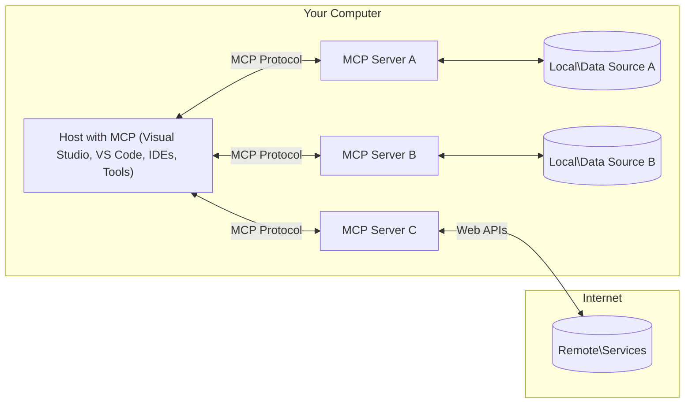

<!--
CO_OP_TRANSLATOR_METADATA:
{
  "original_hash": "0a6a7bcb289c024a91289e0444cb370b",
  "translation_date": "2025-08-19T18:31:57+00:00",
  "source_file": "01-CoreConcepts/README.md",
  "language_code": "my"
}
-->
# MCP အဓိကအကြောင်းအရာများ: AI ပေါင်းစည်းမှုအတွက် Model Context Protocol ကိုကျွမ်းကျင်စွာအသုံးပြုခြင်း

[](https://youtu.be/earDzWGtE84)

_(အထက်ပါပုံကိုနှိပ်ပြီး ဒီသင်ခန်းစာ၏ဗီဒီယိုကိုကြည့်ပါ)_

[Model Context Protocol (MCP)](https://gi- **အသုံးပြုသူ၏ထောက်ခံချက်**: ဒေတာဝင်ရောက်မှုနှင့် လုပ်ဆောင်မှုအားလုံးသည် အသုံးပြုသူ၏ရှင်းလင်းသောအတည်ပြုချက်ကိုလိုအပ်သည်။ အသုံးပြုသူများသည် ဝင်ရောက်မည့်ဒေတာနှင့် လုပ်ဆောင်မည့်အရာများကို အပြည့်အဝနားလည်ပြီး ခွင့်ပြုချက်များနှင့် အာဏာပေးမှုများကို အသေးစိတ်ထိန်းချုပ်နိုင်ရမည်။

- **ဒေတာကိုယ်ရေးကိုယ်တာကာကွယ်မှု**: အသုံးပြုသူ၏ဒေတာကို ရှင်းလင်းသောထောက်ခံချက်ဖြင့်သာ ဖော်ထုတ်ရမည်။ ဒေတာအပြန်အလှန်လုပ်ဆောင်မှုတစ်လျှောက်လုံးတွင် ခိုင်မာသောဝင်ရောက်ခွင့်ထိန်းချုပ်မှုများဖြင့် ကာကွယ်ထားရမည်။ ခွင့်မပြုထားသောဒေတာပို့ဆောင်မှုများကို တားဆီးပြီး ကိုယ်ရေးကိုယ်တာအကန့်အသတ်များကို တင်းကျပ်စွာထိန်းသိမ်းရမည်။

- **ကိရိယာအသုံးပြုမှုလုံခြုံမှု**: ကိရိယာတစ်ခုချင်းစီကို အသုံးပြုသူ၏ရှင်းလင်းသောအတည်ပြုချက်ဖြင့်သာ အသုံးပြုခွင့်ပြုရမည်။ ကိရိယာ၏လုပ်ဆောင်မှု၊ ပါရာမီတာများနှင့် ဖြစ်နိုင်သောသက်ရောက်မှုများကို အသုံးပြုသူများနားလည်စေရမည်။ မတော်တဆဖြစ်နိုင်သော၊ မလုံခြုံသော သို့မဟုတ် မကောင်းမဆိုးသော ကိရိယာအသုံးပြုမှုများကို တားဆီးရန် လုံခြုံရေးအကန့်အသတ်များကို ထိန်းသိမ်းရမည်။

- **သယ်ယူပို့ဆောင်မှုအလွှာလုံခြုံမှု**: ဆက်သွယ်မှုလိုင်းအားလုံးတွင် သင့်တော်သောစနစ်များဖြင့် စာဝှက်ခြင်းနှင့် အတည်ပြုခြင်းကို အသုံးပြုရမည်။ အဝေးမှဆက်သွယ်မှုများတွင် လုံခြုံသောသယ်ယူပို့ဆောင်မှုပရိုတိုကောများနှင့် သင့်တော်သောလက်မှတ်စီမံခန့်ခွဲမှုကို အသုံးပြုရမည်။

#### အကောင်အထည်ဖော်ရန်လမ်းညွှန်ချက်များ:

- **ခွင့်ပြုချက်စီမံခန့်ခွဲမှု**: အသုံးပြုသူများအား ဝင်ရောက်ခွင့်ရှိသော server များ၊ ကိရိယာများနှင့် အရင်းအမြစ်များကို ထိန်းချုပ်နိုင်စေရန် အသေးစိတ်ခွင့်ပြုချက်စနစ်များကို အကောင်အထည်ဖော်ပါ  
- **အတည်ပြုခြင်းနှင့် အာဏာပေးခြင်း**: လုံခြုံသောအတည်ပြုစနစ်များ (OAuth, API key များ) ကို သက်တမ်းကုန်ဆုံးမှုနှင့် token စီမံခန့်ခွဲမှုဖြင့် အသုံးပြုပါ  
- **အဝင်ဒေတာစစ်ဆေးမှု**: Injection တိုက်ခိုက်မှုများကို တားဆီးရန် သတ်မှတ်ထားသော schema များအတိုင်း ပါရာမီတာများနှင့် အဝင်ဒေတာအားလုံးကို စစ်ဆေးပါ  
- **မှတ်တမ်းသိမ်းဆည်းမှု**: လုံခြုံရေးစောင့်ကြည့်မှုနှင့် လိုက်နာမှုအတွက် လုပ်ဆောင်မှုအားလုံး၏ ပြည့်စုံသောမှတ်တမ်းများကို ထိန်းသိမ်းပါ  

[Model Context Protocol (MCP)](https://modelcontextprotocol.io/specification/2025-06-18/) သည် Large Language Models (LLMs) နှင့် အပြင်ပကိရိယာများ၊ အပလီကေးရှင်းများနှင့် ဒေတာအရင်းအမြစ်များအကြား ဆက်သွယ်မှုကို အကောင်းဆုံးဖြစ်စေသော စံပြစနစ်တစ်ခုဖြစ်သည်။ ဒီလမ်းညွှန်စာအုပ်သည် MCP ၏ အဓိကအကြောင်းအရာများကို ရှင်းလင်းပြသပြီး client-server architecture၊ အရေးပါသောအစိတ်အပိုင်းများ၊ ဆက်သွယ်မှုစနစ်များနှင့် အကောင်အထည်ဖော်မှုအကောင်းဆုံးလက်တွေ့နည်းလမ်းများကို နားလည်စေရန် ကူညီပါမည်။

## အကျဉ်းချုပ်

ဒီသင်ခန်းစာတွင် Model Context Protocol (MCP) စနစ်၏ အခြေခံဖွဲ့စည်းပုံနှင့် အစိတ်အပိုင်းများကို လေ့လာပါမည်။ MCP ၏ client-server architecture၊ အဓိကအစိတ်အပိုင်းများနှင့် ဆက်သွယ်မှုစနစ်များကို နားလည်စေရန် သင်လေ့လာနိုင်ပါမည်။

## အဓိကသင်ယူရမည့်ရည်မှန်းချက်များ

ဒီသင်ခန်းစာအဆုံးတွင် သင်သည်-

- MCP client-server architecture ကို နားလည်နိုင်မည်။
- Hosts, Clients, နှင့် Servers ၏ အခန်းကဏ္ဍများကို သတ်မှတ်နိုင်မည်။
- MCP ကို အပြောင်းအလဲများအတွက် ထိရောက်သောပေါင်းစည်းမှုအလွှာဖြစ်စေသော အဓိကအင်္ဂါရပ်များကို ခွဲခြားနိုင်မည်။
- MCP စနစ်အတွင်း ဒေတာစီးဆင်းမှုကို နားလည်နိုင်မည်။
- .NET, Java, Python, နှင့် JavaScript တို့ဖြင့် လက်တွေ့နမူနာများမှ အမြင်ရရှိနိုင်မည်။

## MCP ဖွဲ့စည်းပုံ: နက်ရှိုင်းစွာလေ့လာခြင်း

MCP စနစ်သည် client-server မော်ဒယ်အပေါ် အခြေခံထားသည်။ ဒီမော်ဂျူးဖွဲ့စည်းပုံသည် AI အပလီကေးရှင်းများကို ကိရိယာများ၊ ဒေတာဘေ့စ်များ၊ API များနှင့် အကြောင်းအရာဆိုင်ရာအရင်းအမြစ်များနှင့် ထိရောက်စွာပေါင်းစည်းစေသည်။ ဒီဖွဲ့စည်းပုံကို အဓိကအစိတ်အပိုင်းများအဖြစ် ခွဲခြားကြည့်ပါမည်။

MCP ၏ အဓိကအချက်မှာ client-server architecture ကို လိုက်နာခြင်းဖြစ်ပြီး host application တစ်ခုသည် server များစွာနှင့် ချိတ်ဆက်နိုင်သည်-



- **MCP Hosts**: VSCode, Claude Desktop, IDEs, သို့မဟုတ် MCP မှတစ်ဆင့် ဒေတာဝင်ရောက်လိုသော AI ကိရိယာများ  
- **MCP Clients**: Server များနှင့် 1:1 ချိတ်ဆက်မှုကို ထိန်းသိမ်းထားသော protocol clients  
- **MCP Servers**: Model Context Protocol စံပြစနစ်ဖြင့် အထူးစွမ်းဆောင်ရည်များကို ဖော်ထုတ်သော အလင်းလွှာပရိုဂရမ်များ  
- **Local Data Sources**: သင့်ကွန်ပျူတာ၏ ဖိုင်များ၊ ဒေတာဘေ့စ်များနှင့် MCP servers မှ လုံခြုံစွာဝင်ရောက်နိုင်သော ဝန်ဆောင်မှုများ  
- **Remote Services**: MCP servers မှ API များဖြင့် ချိတ်ဆက်နိုင်သော အင်တာနက်ပေါ်ရှိ အပြင်ပစနစ်များ  

MCP Protocol သည် YYYY-MM-DD ပုံစံဖြင့် နောက်ဆုံးရက်စွဲအခြေခံဗားရှင်းကို အသုံးပြုသော စံပြစနစ်တစ်ခုဖြစ်သည်။ လက်ရှိ protocol ဗားရှင်းမှာ **2025-06-18** ဖြစ်သည်။ [protocol specification](https://modelcontextprotocol.io/specification/2025-06-18/) တွင် နောက်ဆုံးရရှိထားသော အပ်ဒိတ်များကို ကြည့်ရှုနိုင်ပါသည်။

### 1. Hosts

Model Context Protocol (MCP) တွင် **Hosts** သည် အသုံးပြုသူများ MCP နှင့် အပြန်အလှန်ဆက်သွယ်နိုင်သော အဓိကမျက်နှာပြင်အဖြစ် တာဝန်ယူသော AI အပလီကေးရှင်းများဖြစ်သည်။ Hosts များသည် MCP server များစွာနှင့် ချိတ်ဆက်မှုများကို စီမံခန့်ခွဲရန် MCP clients များကို ဖန်တီးခြင်းဖြင့် စီမံဆောင်ရွက်သည်။ Host များ၏ ဥပမာများမှာ-

- **AI အပလီကေးရှင်းများ**: Claude Desktop, Visual Studio Code, Claude Code  
- **ဖွံ့ဖြိုးရေးပတ်ဝန်းကျင်များ**: MCP ပေါင်းစည်းမှုပါဝင်သော IDEs နှင့် code editors  
- **စိတ်ကြိုက်အပလီကေးရှင်းများ**: ရည်ရွယ်ချက်အထူးပြု AI အေးဂျင့်များနှင့် ကိရိယာများ  

**Hosts** သည် AI မော်ဒယ်အပြန်အလှန်ဆက်သွယ်မှုများကို စီမံဆောင်ရွက်သော အပလီကေးရှင်းများဖြစ်သည်။  

- **AI မော်ဒယ်များကို စီမံခန့်ခွဲခြင်း**: LLM များကို အကောင်အထည်ဖော်ခြင်း သို့မဟုတ် အပြန်အလှန်ဆက်သွယ်ခြင်းဖြင့် AI လုပ်ငန်းစဉ်များကို စီမံဆောင်ရွက်သည်  
- **Client ချိတ်ဆက်မှုများကို စီမံခန့်ခွဲခြင်း**: MCP server တစ်ခုချင်းစီအတွက် MCP client တစ်ခုစီကို ဖန်တီးပြီး ထိန်းသိမ်းသည်  
- **အသုံးပြုသူမျက်နှာပြင်ကို ထိန်းချုပ်ခြင်း**: စကားဝိုင်းစီးဆင်းမှု၊ အသုံးပြုသူအပြန်အလှန်ဆက်သွယ်မှုများနှင့် တုံ့ပြန်မှုတင်ပြမှုကို စီမံဆောင်ရွက်သည်  
- **လုံခြုံရေးကို အာမခံခြင်း**: ခွင့်ပြုချက်များ၊ လုံခြုံရေးကန့်သတ်ချက်များနှင့် အတည်ပြုမှုများကို ထိန်းချုပ်သည်  
- **အသုံးပြုသူထောက်ခံချက်ကို စီမံခန့်ခွဲခြင်း**: ဒေတာမျှဝေမှုနှင့် ကိရိယာအသုံးပြုမှုအတွက် အသုံးပြုသူ၏အတည်ပြုချက်ကို စီမံဆောင်ရွက်သည်  

### 2. Clients

**Clients** သည် Hosts နှင့် MCP servers အကြား တစ်ဦးချင်းချင်းချိတ်ဆက်မှုများကို ထိန်းသိမ်းထားသော အရေးပါသောအစိတ်အပိုင်းများဖြစ်သည်။ MCP client တစ်ခုချင်းစီကို Host မှ ဖန်တီးပြီး သတ်မှတ်ထားသော MCP server တစ်ခုနှင့် ချိတ်ဆက်ရန် အသုံးပြုသည်။ Clients များစွာသည် Hosts များကို server များစွာနှင့် တစ်ပြိုင်တည်းချိတ်ဆက်နိုင်စေသည်။

**Clients** သည် host application အတွင်းရှိ ချိတ်ဆက်မှုအစိတ်အပိုင်းများဖြစ်သည်။  

- **Protocol ဆက်သွယ်မှု**: JSON-RPC 2.0 တုံ့ပြန်မှုများကို server များသို့ prompts နှင့် ညွှန်ကြားချက်များဖြင့် ပေးပို့သည်  
- **စွမ်းဆောင်ရည်ညှိနှိုင်းမှု**: စတင်ချိန်တွင် server များနှင့် protocol ဗားရှင်းများနှင့် ပံ့ပိုးမှုစွမ်းဆောင်ရည်များကို ညှိနှိုင်းသည်  
- **ကိရိယာအသုံးပြုမှု**: မော်ဒယ်များမှ ကိရိယာအသုံးပြုမှုတောင်းဆိုမှုများကို စီမံဆောင်ရွက်ပြီး တုံ့ပြန်မှုများကို လုပ်ဆောင်သည်  
- **အချိန်နှင့်တပြေးညီအပ်ဒိတ်များ**: server များမှ အကြောင်းကြားချက်များနှင့် အချိန်နှင့်တပြေးညီအပ်ဒိတ်များကို စီမံဆောင်ရွက်သည်  
- **တုံ့ပြန်မှုကို စီမံဆောင်ရွက်ခြင်း**: server တုံ့ပြန်မှုများကို အသုံးပြုသူများအတွက် ပြသရန် အဆင့်မြှင့်တင်သည်  

### 3. Servers

**Servers** သည် MCP clients များကို အကြောင်းအရာ၊ ကိရိယာများနှင့် စွမ်းဆောင်ရည်များပေးသော ပရိုဂရမ်များဖြစ်သည်။ Server များသည် local (Host နှင့် တူသောစက်ပေါ်တွင်) သို့မဟုတ် remote (ပြင်ပပလက်ဖောင်းများပေါ်တွင်) အကောင်အထည်ဖော်နိုင်ပြီး client တောင်းဆိုမှုများကို စီမံဆောင်ရွက်ပြီး ဖွဲ့စည်းထားသောတုံ့ပြန်မှုများကို ပေးပို့သည်။ Server များသည် Model Context Protocol စံပြစနစ်ဖြင့် အထူးစွမ်းဆောင်ရည်များကို ဖော်ထုတ်သည်။

**Servers** သည် အကြောင်းအရာနှင့် စွမ်းဆောင်ရည်များပေးသော ဝန်ဆောင်မှုများဖြစ်သည်။  

- **စွမ်းဆောင်ရည်မှတ်ပုံတင်ခြင်း**: client များအား ရရှိနိုင်သော primitives (အရင်းအမြစ်များ၊ prompts, tools) များကို မှတ်ပုံတင်ပြီး ဖော်ထုတ်သည်  
- **တောင်းဆိုမှုကို စီမံဆောင်ရွက်ခြင်း**: client များမှ tool calls, resource requests, prompt requests တောင်းဆိုမှုများကို လက်ခံပြီး ဆောင်ရွက်သည်  
- **အကြောင်းအရာပေးခြင်း**: မော်ဒယ်တုံ့ပြန်မှုများကို မြှင့်တင်ရန် အကြောင်းအရာဆိုင်ရာအချက်အလက်များနှင့် ဒေတာများကို ပေးသည်  
- **အခြေအနေစီမံခန့်ခွဲမှု**: session အခြေအနေကို ထိန်းသိမ်းပြီး လိုအပ်ပါက stateful interactions များကို စီမံဆောင်ရွက်သည်  
- **အချိန်နှင့်တပြေးညီအကြောင်းကြားချက်များ**: client များနှင့် ချိတ်ဆက်ထားသော စွမ်းဆောင်ရည်ပြောင်းလဲမှုများနှင့် အပ်ဒိတ်များကို ပေးပို့သည်  

Server များကို မည်သူမဆို ဖွံ့ဖြိုးတိုးတက်စေပြီး အထူးစွမ်းဆောင်ရည်များဖြင့် မော်ဒယ်စွမ်းရည်များကို တိုးချဲ့နိုင်သည်။ Server များသည် local နှင့် remote deployment အခြေအနေများနှစ်မျိုးလုံးကို ပံ့ပိုးပေးသည်။  

### 4. Server Primitives

Model Context Protocol (MCP) တွင် Server များသည် client, host, နှင့် language models အကြား ပိုမိုချောမွေ့သောအပြန်အလှန်ဆက်သွယ်မှုများအတွက် အခြေခံအဆောက်အအုံများဖြစ်သော **primitives** သုံးမျိုးကို ပေးသည်။  

MCP servers များသည် အောက်ပါ core primitives သုံးမျိုးမှ မည်သည့်ပေါင်းစပ်မှုကိုမဆို ဖော်ထုတ်နိုင်သည်-  

#### Resources

**Resources** သည် AI အပလီကေးရှင်းများကို အကြောင်းအရာဆိုင်ရာအချက်အလက်များပေးသော ဒေတာအရင်းအမြစ်များဖြစ်သည်။  

- **အကြောင်းအရာဆိုင်ရာဒေတာ**: AI မော်ဒယ်များအတွက် ဖွဲ့စည်းထားသောအချက်အလက်များ  
- **အသိပညာအခြေခံများ**: စာရွက်စာတမ်းများ၊ ဆောင်းပါးများ၊ လက်စွဲစာအုပ်များနှင့် သုတေသနစာတမ်းများ  
- **Local Data Sources**: ဖိုင်များ၊ ဒေတာဘေ့စ်များနှင့် local system အချက်အလက်များ  
- **ပြင်ပဒေတာ**: API တုံ့ပြန်မှုများ၊ ဝန်ဆောင်မှုများနှင့် remote system ဒေတာ  
- **Dynamic Content**: ပြင်ပအခြေအနေများအပေါ်မူတည်ပြီး အချ
- **Lifecycle Management**: Client နှင့် Server အကြား ချိတ်ဆက်မှု စတင်ခြင်း၊ စွမ်းရည်များ ဆွေးနွေးခြင်း၊ Session ပိတ်သိမ်းခြင်းများကို စီမံခန့်ခွဲသည်။
- **Server Primitives**: Server များအနေဖြင့် Tools, Resources, Prompt များကို အသုံးပြု၍ အခြေခံလုပ်ဆောင်ချက်များ ပေးနိုင်စေသည်။
- **Client Primitives**: Server များအနေဖြင့် LLMs မှ Sample ရယူခြင်း၊ User Input ရယူခြင်း၊ Log Messages ပို့ခြင်းများကို တောင်းဆိုနိုင်စေသည်။
- **Real-time Notifications**: Polling မလိုအပ်ဘဲ အချိန်နှင့်တပြေးညီ အချက်အလက်များကို အလိုအလျောက် အသိပေးနိုင်စေသည်။

#### အဓိက အင်္ဂါရပ်များ:

- **Protocol Version Negotiation**: Compatibility အတွက် ရက်စွဲအခြေခံ Versioning (YYYY-MM-DD) ကို အသုံးပြုသည်။
- **Capability Discovery**: Initialization အတွင်း Client နှင့် Server များအကြား ပံ့ပိုးနိုင်သော Feature အချက်အလက်များကို လဲလှယ်သည်။
- **Stateful Sessions**: အကြောင်းအရာဆက်လက်တည်ရှိစေရန် အများအပြား အပြန်အလှန်ဆက်သွယ်မှုများအတွင်း Connection State ကို ထိန်းသိမ်းထားသည်။

### Transport Layer

**Transport Layer** သည် MCP ပါဝင်သူများအကြား ဆက်သွယ်မှု Channel များ၊ Message Framing နှင့် Authentication ကို စီမံခန့်ခွဲသည်။

#### ပံ့ပိုးထားသော Transport Mechanisms:

1. **STDIO Transport**:
   - Process များအကြား တိုက်ရိုက် ဆက်သွယ်မှုအတွက် Standard Input/Output Streams ကို အသုံးပြုသည်။
   - Network Overhead မရှိဘဲ တစ်စက်ရုံအတွင်း Process များအတွက် အကောင်းဆုံးဖြစ်သည်။
   - MCP Server များကို တစ်စက်ရုံအတွင်း အကောင်းဆုံး အသုံးပြုနိုင်သည်။

2. **Streamable HTTP Transport**:
   - Client-to-Server Messages အတွက် HTTP POST ကို အသုံးပြုသည်။
   - Server-to-Client Streaming အတွက် Server-Sent Events (SSE) ကို ရွေးချယ်အသုံးပြုနိုင်သည်။
   - Network များအကြား Remote Server ဆက်သွယ်မှုကို ပံ့ပိုးသည်။
   - Standard HTTP Authentication (Bearer Tokens, API Keys, Custom Headers) ကို ပံ့ပိုးသည်။
   - MCP သည် Token-based Authentication အတွက် OAuth ကို အကြံပြုသည်။

#### Transport Abstraction:

Transport Layer သည် Data Layer မှ Communication အသေးစိတ်များကို ခွဲထုတ်ထားပြီး Transport Mechanisms များအားလုံးအတွက် JSON-RPC 2.0 Message Format တူညီစွာ အသုံးပြုနိုင်စေသည်။ Application များအနေဖြင့် Local Server နှင့် Remote Server အကြား အလွယ်တကူ ပြောင်းလဲအသုံးပြုနိုင်စေသည်။

### Security Considerations

MCP Implementation များအနေဖြင့် Protocol Operations အားလုံးအတွင်း လုံခြုံမှု၊ ယုံကြည်မှုနှင့် လုံခြုံစိတ်ချမှုကို အာမခံရန် အရေးကြီးသော လုံခြုံရေး မူဝါဒများကို လိုက်နာရမည်။

- **User Consent and Control**: Data ကို Access လုပ်ခြင်း သို့မဟုတ် Operation များကို လုပ်ဆောင်မီ User အနေဖြင့် ရှင်းလင်းသော UI များမှ Review နှင့် အတည်ပြုနိုင်စေရန် Explicit Consent ပေးရမည်။
- **Data Privacy**: User Data ကို Explicit Consent မရှိဘဲ Exposure မဖြစ်စေရန် Access Control များဖြင့် ကာကွယ်ရမည်။
- **Tool Safety**: Tool မည်သည့်အခါမဆို အသုံးပြုမီ Explicit User Consent လိုအပ်သည်။ Tool ၏ Functionality ကို ရှင်းလင်းစွာ နားလည်စေရန်နှင့် Tool Execution များကို မလိုလားအပ်သောအခြေအနေများမှ ကာကွယ်ရန် Security Boundaries များကို ထိန်းသိမ်းရမည်။

Security Principles များကို လိုက်နာခြင်းအားဖြင့် MCP သည် User Trust, Privacy နှင့် Safety ကို အာမခံပြီး အင်အားကြီး AI Integration များကို ပံ့ပိုးနိုင်သည်။

## Code Examples: Key Components

အောက်တွင် MCP Server Component များနှင့် Tools များကို အကောင်အထည်ဖော်ရန် အသုံးပြုနိုင်သော Programming Language များဖြင့် Code Examples များကို ဖော်ပြထားသည်။

### .NET Example: Creating a Simple MCP Server with Tools

အောက်တွင် MCP Server ကို Tools များနှင့်အတူ အကောင်အထည်ဖော်ရန် .NET Code Example ကို ဖော်ပြထားသည်။ Tools များကို သတ်မှတ်ခြင်းနှင့် Register လုပ်ခြင်း၊ Request များကို Handle လုပ်ခြင်း၊ Server ကို MCP Protocol ဖြင့် ချိတ်ဆက်ခြင်းကို ဖော်ပြထားသည်။

```csharp
using System;
using System.Threading.Tasks;
using ModelContextProtocol.Server;
using ModelContextProtocol.Server.Transport;
using ModelContextProtocol.Server.Tools;

public class WeatherServer
{
    public static async Task Main(string[] args)
    {
        // Create an MCP server
        var server = new McpServer(
            name: "Weather MCP Server",
            version: "1.0.0"
        );
        
        // Register our custom weather tool
        server.AddTool<string, WeatherData>("weatherTool", 
            description: "Gets current weather for a location",
            execute: async (location) => {
                // Call weather API (simplified)
                var weatherData = await GetWeatherDataAsync(location);
                return weatherData;
            });
        
        // Connect the server using stdio transport
        var transport = new StdioServerTransport();
        await server.ConnectAsync(transport);
        
        Console.WriteLine("Weather MCP Server started");
        
        // Keep the server running until process is terminated
        await Task.Delay(-1);
    }
    
    private static async Task<WeatherData> GetWeatherDataAsync(string location)
    {
        // This would normally call a weather API
        // Simplified for demonstration
        await Task.Delay(100); // Simulate API call
        return new WeatherData { 
            Temperature = 72.5,
            Conditions = "Sunny",
            Location = location
        };
    }
}

public class WeatherData
{
    public double Temperature { get; set; }
    public string Conditions { get; set; }
    public string Location { get; set; }
}
```

### Java Example: MCP Server Components

အထက်ပါ .NET Example နှင့် တူသော MCP Server နှင့် Tool Registration ကို Java ဖြင့် အကောင်အထည်ဖော်ထားသည်။

```java
import io.modelcontextprotocol.server.McpServer;
import io.modelcontextprotocol.server.McpToolDefinition;
import io.modelcontextprotocol.server.transport.StdioServerTransport;
import io.modelcontextprotocol.server.tool.ToolExecutionContext;
import io.modelcontextprotocol.server.tool.ToolResponse;

public class WeatherMcpServer {
    public static void main(String[] args) throws Exception {
        // Create an MCP server
        McpServer server = McpServer.builder()
            .name("Weather MCP Server")
            .version("1.0.0")
            .build();
            
        // Register a weather tool
        server.registerTool(McpToolDefinition.builder("weatherTool")
            .description("Gets current weather for a location")
            .parameter("location", String.class)
            .execute((ToolExecutionContext ctx) -> {
                String location = ctx.getParameter("location", String.class);
                
                // Get weather data (simplified)
                WeatherData data = getWeatherData(location);
                
                // Return formatted response
                return ToolResponse.content(
                    String.format("Temperature: %.1f°F, Conditions: %s, Location: %s", 
                    data.getTemperature(), 
                    data.getConditions(), 
                    data.getLocation())
                );
            })
            .build());
        
        // Connect the server using stdio transport
        try (StdioServerTransport transport = new StdioServerTransport()) {
            server.connect(transport);
            System.out.println("Weather MCP Server started");
            // Keep server running until process is terminated
            Thread.currentThread().join();
        }
    }
    
    private static WeatherData getWeatherData(String location) {
        // Implementation would call a weather API
        // Simplified for example purposes
        return new WeatherData(72.5, "Sunny", location);
    }
}

class WeatherData {
    private double temperature;
    private String conditions;
    private String location;
    
    public WeatherData(double temperature, String conditions, String location) {
        this.temperature = temperature;
        this.conditions = conditions;
        this.location = location;
    }
    
    public double getTemperature() {
        return temperature;
    }
    
    public String getConditions() {
        return conditions;
    }
    
    public String getLocation() {
        return location;
    }
}
```

### Python Example: Building an MCP Server

Python ဖြင့် MCP Server တည်ဆောက်ပုံကို ဖော်ပြထားသည်။ Tools များကို ဖန်တီးရန် နည်းလမ်းနှစ်မျိုးကိုလည်း ဖော်ပြထားသည်။

```python
#!/usr/bin/env python3
import asyncio
from mcp.server.fastmcp import FastMCP
from mcp.server.transports.stdio import serve_stdio

# Create a FastMCP server
mcp = FastMCP(
    name="Weather MCP Server",
    version="1.0.0"
)

@mcp.tool()
def get_weather(location: str) -> dict:
    """Gets current weather for a location."""
    # This would normally call a weather API
    # Simplified for demonstration
    return {
        "temperature": 72.5,
        "conditions": "Sunny",
        "location": location
    }

# Alternative approach using a class
class WeatherTools:
    @mcp.tool()
    def forecast(self, location: str, days: int = 1) -> dict:
        """Gets weather forecast for a location for the specified number of days."""
        # This would normally call a weather API forecast endpoint
        # Simplified for demonstration
        return {
            "location": location,
            "forecast": [
                {"day": i+1, "temperature": 70 + i, "conditions": "Partly Cloudy"}
                for i in range(days)
            ]
        }

# Instantiate the class to register its tools
weather_tools = WeatherTools()

# Start the server using stdio transport
if __name__ == "__main__":
    asyncio.run(serve_stdio(mcp))
```

### JavaScript Example: Creating an MCP Server

JavaScript ဖြင့် MCP Server တည်ဆောက်ပုံနှင့် Weather ဆိုင်ရာ Tools နှစ်ခုကို Register လုပ်ပုံကို ဖော်ပြထားသည်။

```javascript
// Using the official Model Context Protocol SDK
import { McpServer } from "@modelcontextprotocol/sdk/server/mcp.js";
import { StdioServerTransport } from "@modelcontextprotocol/sdk/server/stdio.js";
import { z } from "zod"; // For parameter validation

// Create an MCP server
const server = new McpServer({
  name: "Weather MCP Server",
  version: "1.0.0"
});

// Define a weather tool
server.tool(
  "weatherTool",
  {
    location: z.string().describe("The location to get weather for")
  },
  async ({ location }) => {
    // This would normally call a weather API
    // Simplified for demonstration
    const weatherData = await getWeatherData(location);
    
    return {
      content: [
        { 
          type: "text", 
          text: `Temperature: ${weatherData.temperature}°F, Conditions: ${weatherData.conditions}, Location: ${weatherData.location}` 
        }
      ]
    };
  }
);

// Define a forecast tool
server.tool(
  "forecastTool",
  {
    location: z.string(),
    days: z.number().default(3).describe("Number of days for forecast")
  },
  async ({ location, days }) => {
    // This would normally call a weather API
    // Simplified for demonstration
    const forecast = await getForecastData(location, days);
    
    return {
      content: [
        { 
          type: "text", 
          text: `${days}-day forecast for ${location}: ${JSON.stringify(forecast)}` 
        }
      ]
    };
  }
);

// Helper functions
async function getWeatherData(location) {
  // Simulate API call
  return {
    temperature: 72.5,
    conditions: "Sunny",
    location: location
  };
}

async function getForecastData(location, days) {
  // Simulate API call
  return Array.from({ length: days }, (_, i) => ({
    day: i + 1,
    temperature: 70 + Math.floor(Math.random() * 10),
    conditions: i % 2 === 0 ? "Sunny" : "Partly Cloudy"
  }));
}

// Connect the server using stdio transport
const transport = new StdioServerTransport();
server.connect(transport).catch(console.error);

console.log("Weather MCP Server started");
```

JavaScript Example တွင် MCP Client တစ်ခုကို Server နှင့် ချိတ်ဆက်ခြင်း၊ Prompt ပို့ခြင်း၊ Response ကို Process လုပ်ခြင်းနှင့် Tool Calls များကို Handle လုပ်ပုံကို ဖော်ပြထားသည်။

## Security and Authorization

MCP သည် Protocol အတွင်း Security နှင့် Authorization ကို စီမံခန့်ခွဲရန် အတွက် အဓိက Mechanisms များကို ပံ့ပိုးထားသည်။

1. **Tool Permission Control**:  
   Model သည် Session အတွင်း အသုံးပြုနိုင်သော Tools များကို Clients အနေဖြင့် သတ်မှတ်နိုင်သည်။ User Preference, Organization Policy, Interaction Context အပေါ်မူတည်၍ Permission များကို Dynamic အဖြစ် Configure လုပ်နိုင်သည်။

2. **Authentication**:  
   Server များအနေဖြင့် Tools, Resources သို့မဟုတ် Sensitive Operations များကို Access လုပ်ခွင့်ပေးမီ Authentication လိုအပ်သည်။ API Keys, OAuth Tokens သို့မဟုတ် အခြား Authentication Schemes များကို အသုံးပြုနိုင်သည်။

3. **Validation**:  
   Tool Invocation များအတွက် Parameter Validation ကို Server အနေဖြင့် အတိအကျ ပြုလုပ်သည်။ Tool တစ်ခုစီသည် Parameter များအတွက် Type, Format, Constraint များကို သတ်မှတ်ထားပြီး Server သည် Request များကို Validate လုပ်သည်။

4. **Rate Limiting**:  
   Server Resource များကို မတရားအသုံးချမှုမှ ကာကွယ်ရန် Tool Calls နှင့် Resource Access အတွက် Rate Limiting ကို MCP Server များအနေဖြင့် ပြုလုပ်နိုင်သည်။

Mechanisms များပေါင်းစပ်ခြင်းအားဖြင့် MCP သည် Language Models ကို External Tools နှင့် Data Sources များနှင့် ချိတ်ဆက်ရာတွင် လုံခြုံမှုရှိသော အခြေခံအဆောက်အအုံကို ပံ့ပိုးပေးသည်။

## Protocol Messages & Communication Flow

MCP Communication သည် Host, Client, Server များအကြား JSON-RPC 2.0 Message များကို အသုံးပြု၍ ရှင်းလင်းပြီး ယုံကြည်စိတ်ချရသော ဆက်သွယ်မှုများကို ပံ့ပိုးသည်။

### Core Message Types:

#### **Initialization Messages**
- **`initialize` Request**: Connection ကို စတင်ပြီး Protocol Version နှင့် Capabilities ကို ဆွေးနွေးသည်။
- **`initialize` Response**: Supported Features နှင့် Server အချက်အလက်များကို အတည်ပြုသည်။
- **`notifications/initialized`**: Initialization ပြီးဆုံးပြီး Session အသင့်ဖြစ်ကြောင်း Signal ပေးသည်။

#### **Discovery Messages**
- **`tools/list` Request**: Server မှ ရရှိနိုင်သော Tools များကို ရှာဖွေသည်။
- **`resources/list` Request**: ရရှိနိုင်သော Resources (Data Sources) များကို ရှာဖွေသည်။
- **`prompts/list` Request**: Prompt Template များကို ရယူသည်။

#### **Execution Messages**  
- **`tools/call` Request**: သတ်မှတ်ထားသော Tool ကို Parameter များနှင့်အတူ Execute လုပ်သည်။
- **`resources/read` Request**: သတ်မှတ်ထားသော Resource မှ Content ကို Retrieve လုပ်သည်။
- **`prompts/get` Request**: Prompt Template ကို Optional Parameters များနှင့်အတူ Fetch လုပ်သည်။

#### **Client-side Messages**
- **`sampling/complete` Request**: Server အနေဖြင့် Client မှ LLM Completion ကို တောင်းဆိုသည်။
- **`elicitation/request`**: Server အနေဖြင့် Client Interface မှ User Input ကို တောင်းဆိုသည်။
- **Logging Messages**: Server မှ Client သို့ Structured Log Messages များ ပို့သည်။

#### **Notification Messages**
- **`notifications/tools/list_changed`**: Tool များပြောင်းလဲမှုကို Server မှ Client သို့ အသိပေးသည်။
- **`notifications/resources/list_changed`**: Resource များပြောင်းလဲမှုကို Server မှ Client သို့ အသိပေးသည်။
- **`notifications/prompts/list_changed`**: Prompt များပြောင်းလဲမှုကို Server မှ Client သို့ အသိပေးသည်။

### Message Structure:

MCP Messages အားလုံးသည် JSON-RPC 2.0 Format ကို လိုက်နာပြီး:
- **Request Messages**: `id`, `method`, Optional `params` ပါဝင်သည်။
- **Response Messages**: `id` နှင့် `result` သို့မဟုတ် `error` ပါဝင်သည်။
- **Notification Messages**: `method` နှင့် Optional `params` ပါဝင်ပြီး Response မလိုအပ်ပါ။

Message Structure သည် Real-time Updates, Tool Chaining, Robust Error Handling စသည်တို့ကို ပံ့ပိုးနိုင်သော ရှင်းလင်းပြီး ယုံကြည်စိတ်ချရသော ဆက်သွယ်မှုကို အာမခံသည်။

## Key Takeaways

- **Architecture**: MCP သည် Client-Server Architecture ကို အသုံးပြုပြီး Host များအနေဖြင့် Server များနှင့် Client များကို စီမံခန့်ခွဲသည်။
- **Participants**: Ecosystem တွင် Host (AI Applications), Client (Protocol Connectors), Server (Capability Providers) များ ပါဝင်သည်။
- **Transport Mechanisms**: STDIO (Local) နှင့် Streamable HTTP (Remote) ကို ပံ့ပိုးသည်။
- **Core Primitives**: Server များအနေဖြင့် Tools (Executable Functions), Resources (Data Sources), Prompts (Templates) များကို Exposure လုပ်သည်။
- **Client Primitives**: Server များအနေဖြင့် Sampling (LLM Completions), Elicitation (User Input), Logging ကို Client မှ တောင်းဆိုနိုင်သည်။
- **Protocol Foundation**: JSON-RPC 2.0 ကို အခြေခံပြီး Date-based Versioning (Current: 2025-06-18) ကို အသုံးပြုသည်။
- **Real-time Capabilities**: Dynamic Updates နှင့် Real-time Synchronization အတွက် Notifications ကို ပံ့ပိုးသည်။
- **Security First**: Explicit User Consent, Data Privacy Protection, Secure Transport များကို အခြေခံလိုအပ်ချက်အဖြစ် သတ်မှတ်ထားသည်။

## Exercise

သင့် Domain အတွက် အသုံးဝင်မည့် MCP Tool တစ်ခုကို Design လုပ်ပါ။  
1. Tool ၏ အမည်  
2. Accept လုပ်မည့် Parameters  
3. Return ပြန်မည့် Output  
4. Model အနေဖြင့် User Problems ကို ဖြေရှင်းရန် Tool ကို ဘယ်လိုအသုံးပြုမည် 

---

## What's next

Next: [Chapter 2: Security](../02-Security/README.md)

**ဝက်ဘ်ဆိုက်မှတ်ချက်**:  
ဤစာရွက်စာတမ်းကို AI ဘာသာပြန်ဝန်ဆောင်မှု [Co-op Translator](https://github.com/Azure/co-op-translator) ကို အသုံးပြု၍ ဘာသာပြန်ထားပါသည်။ ကျွန်ုပ်တို့သည် တိကျမှန်ကန်မှုအတွက် ကြိုးစားနေပါသော်လည်း၊ အလိုအလျောက်ဘာသာပြန်ဆိုမှုများတွင် အမှားများ သို့မဟုတ် မတိကျမှုများ ပါဝင်နိုင်သည်ကို ကျေးဇူးပြု၍ သတိပြုပါ။ မူရင်းစာရွက်စာတမ်းကို ၎င်း၏ မူလဘာသာစကားဖြင့် အာဏာတည်သောရင်းမြစ်အဖြစ် သတ်မှတ်ရန် လိုအပ်ပါသည်။ အရေးကြီးသောအချက်အလက်များအတွက် လူ့ဘာသာပြန်ပညာရှင်များမှ ပရော်ဖက်ရှင်နယ်ဘာသာပြန်ဆိုမှုကို အကြံပြုပါသည်။ ဤဘာသာပြန်ဆိုမှုကို အသုံးပြုခြင်းမှ ဖြစ်ပေါ်လာသော နားလည်မှုမှားများ သို့မဟုတ် အဓိပ္ပါယ်မှားများအတွက် ကျွန်ုပ်တို့သည် တာဝန်မယူပါ။