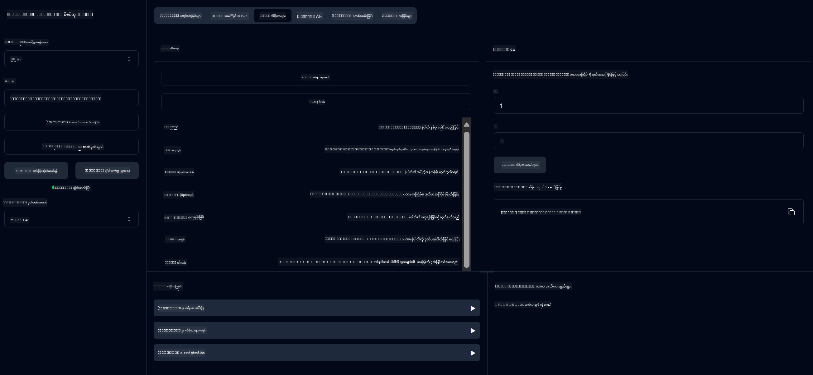
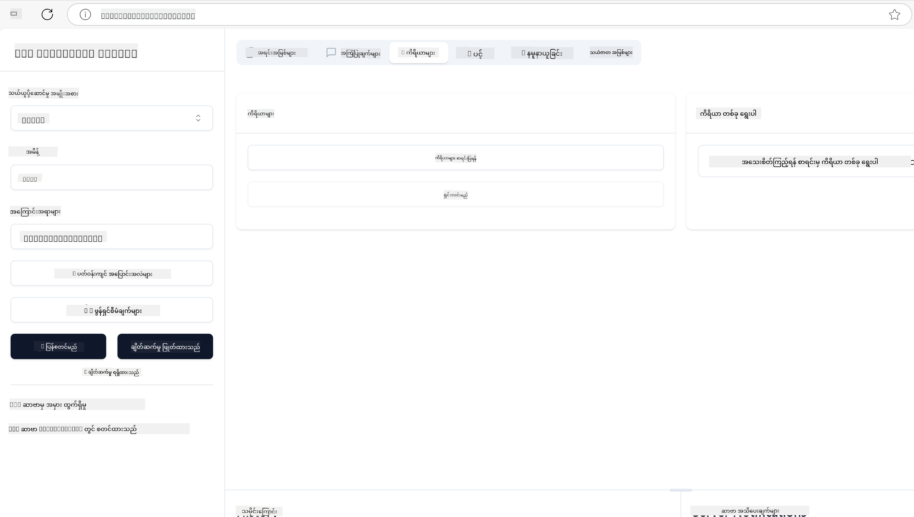
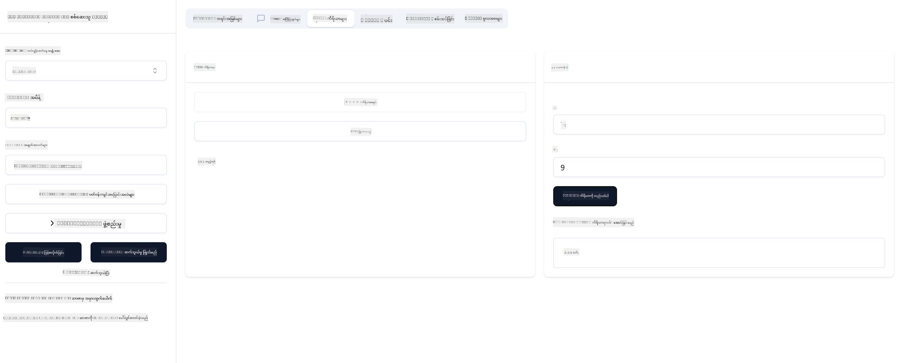

<!--
CO_OP_TRANSLATOR_METADATA:
{
  "original_hash": "ec11ee93f31fdadd94facd3e3d22f9e6",
  "translation_date": "2025-09-09T22:21:13+00:00",
  "source_file": "03-GettingStarted/01-first-server/README.md",
  "language_code": "my"
}
-->
# MCP စတင်အသုံးပြုခြင်း

Model Context Protocol (MCP) နှင့် စတင်အဆင့်များကို ကြိုဆိုပါတယ်! MCP ကို ပထမဆုံးအသုံးပြုနေသူဖြစ်စေ၊ MCP ကို နက်နက်ရှိုင်းရှိုင်း နားလည်လိုသူဖြစ်စေ၊ ဒီလမ်းညွှန်စာအုပ်က သင့်ကို အရေးကြီးသော စနစ်တပ်ဆင်ခြင်းနှင့် ဖွံ့ဖြိုးတိုးတက်မှု လုပ်ငန်းစဉ်များကို လမ်းညွှန်ပေးပါမယ်။ MCP က AI မော်ဒယ်များနှင့် အက်ပလီကေးရှင်းများအကြား အဆင်ပြေစွာ ပေါင်းစည်းမှုကို ဘယ်လိုဖြစ်စေမလဲဆိုတာကို ရှာဖွေတွေ့ရှိနိုင်ပြီး MCP-powered ဖြေရှင်းချက်များကို တည်ဆောက်ခြင်းနှင့် စမ်းသပ်ခြင်းအတွက် သင့်ပတ်ဝန်းကျင်ကို အလျင်အမြန် ပြင်ဆင်နိုင်မယ့် နည်းလမ်းများကိုလည်း သင်ယူနိုင်ပါမယ်။

> TLDR; သင် AI အက်ပလီကေးရှင်းများကို တည်ဆောက်ပါက၊ LLM (large language model) ကို ပိုမိုကျွမ်းကျင်စေရန် Tools နှင့် အခြားအရင်းအမြစ်များကို ထည့်သွင်းနိုင်သည်ကို သိပြီးဖြစ်ပါသည်။ သို့သော် Tools နှင့် အရင်းအမြစ်များကို Server ပေါ်တွင်ထားပါက၊ အက်ပလီကေးရှင်းနှင့် Server ၏ စွမ်းရည်များကို LLM ရှိ/မရှိ Client မည်သူမဆို အသုံးပြုနိုင်ပါသည်။

## အကျဉ်းချုပ်

ဒီသင်ခန်းစာက MCP ပတ်ဝန်းကျင်များကို စနစ်တကျ တပ်ဆင်ခြင်းနှင့် MCP အက်ပလီကေးရှင်းများကို ပထမဆုံး တည်ဆောက်ခြင်းအတွက် လက်တွေ့ လမ်းညွှန်ချက်များကို ပေးပါမယ်။ MCP server များကို တည်ဆောက်ခြင်း၊ Host applications များကို ဖန်တီးခြင်း၊ သင့် implementation များကို စမ်းသပ်ခြင်းတို့ကို သင်ယူနိုင်ပါမယ်။

Model Context Protocol (MCP) သည် LLM များကို context ပေးရန် အက်ပလီကေးရှင်းများအတွက် စံပြပုံစံတစ်ခုဖြစ်သည်။ MCP ကို AI အက်ပလီကေးရှင်းများအတွက် USB-C port တစ်ခုလို ထင်ပါ - ဒါဟာ AI မော်ဒယ်များကို အမျိုးမျိုးသော ဒေတာအရင်းအမြစ်များနှင့် Tools များနှင့် ချိတ်ဆက်ရန် စံပြနည်းလမ်းတစ်ခုကို ပေးသည်။

## သင်ယူရမည့်ရည်ရွယ်ချက်များ

ဒီသင်ခန်းစာအဆုံးတွင် သင်သည် အောက်ပါအရာများကို လုပ်နိုင်ပါမည်-

- C#, Java, Python, TypeScript, နှင့် Rust တွင် MCP အတွက် ဖွံ့ဖြိုးတိုးတက်မှု ပတ်ဝန်းကျင်များကို တပ်ဆင်ခြင်း
- အထူးစွမ်းဆောင်ရည်များ (resources, prompts, tools) ပါဝင်သော MCP server များကို တည်ဆောက်ခြင်းနှင့် deploy လုပ်ခြင်း
- MCP server များနှင့် ချိတ်ဆက်သော Host applications များကို ဖန်တီးခြင်း
- MCP implementation များကို စမ်းသပ်ခြင်းနှင့် Debugging လုပ်ခြင်း

## MCP ပတ်ဝန်းကျင်ကို တပ်ဆင်ခြင်း

MCP နှင့် အလုပ်လုပ်ရန် မစတင်မီ၊ သင့်ဖွံ့ဖြိုးတိုးတက်မှု ပတ်ဝန်းကျင်ကို ပြင်ဆင်ပြီး အခြေခံ workflow ကို နားလည်ထားရန် အရေးကြီးပါသည်။ ဒီအပိုင်းက MCP နှင့် စတင်အလုပ်လုပ်ရန် အဆင်ပြေစေရန် အခြေခံတပ်ဆင်ခြင်းအဆင့်များကို လမ်းညွှန်ပေးပါမယ်။

### လိုအပ်ချက်များ

MCP ဖွံ့ဖြိုးတိုးတက်မှုကို စတင်မီ၊ အောက်ပါအရာများရှိကြောင်း သေချာပါစေ-

- **ဖွံ့ဖြိုးတိုးတက်မှု ပတ်ဝန်းကျင်**: သင်ရွေးချယ်ထားသော programming language (C#, Java, Python, TypeScript, Rust) အတွက်
- **IDE/Editor**: Visual Studio, Visual Studio Code, IntelliJ, Eclipse, PyCharm, သို့မဟုတ် မည်သည့် modern code editor မဆို
- **Package Managers**: NuGet, Maven/Gradle, pip, npm/yarn, Cargo
- **API Keys**: Host applications တွင် အသုံးပြုမည့် AI services များအတွက်

## MCP Server အခြေခံဖွဲ့စည်းပုံ

MCP server တစ်ခုတွင် အောက်ပါအရာများပါဝင်သည်-

- **Server Configuration**: Port, authentication, နှင့် အခြား settings များကို တပ်ဆင်ခြင်း
- **Resources**: LLM များအတွက် ရရှိနိုင်သော ဒေတာနှင့် context
- **Tools**: မော်ဒယ်များက invoke လုပ်နိုင်သော စွမ်းဆောင်ရည်များ
- **Prompts**: Text ကို ဖန်တီးခြင်း သို့မဟုတ် ဖွဲ့စည်းခြင်းအတွက် Template များ

TypeScript တွင် ရိုးရှင်းသော ဥပမာတစ်ခုကတော့-

```typescript
import { McpServer, ResourceTemplate } from "@modelcontextprotocol/sdk/server/mcp.js";
import { StdioServerTransport } from "@modelcontextprotocol/sdk/server/stdio.js";
import { z } from "zod";

// Create an MCP server
const server = new McpServer({
  name: "Demo",
  version: "1.0.0"
});

// Add an addition tool
server.tool("add",
  { a: z.number(), b: z.number() },
  async ({ a, b }) => ({
    content: [{ type: "text", text: String(a + b) }]
  })
);

// Add a dynamic greeting resource
server.resource(
  "file",
  // The 'list' parameter controls how the resource lists available files. Setting it to undefined disables listing for this resource.
  new ResourceTemplate("file://{path}", { list: undefined }),
  async (uri, { path }) => ({
    contents: [{
      uri: uri.href,
      text: `File, ${path}!`
    }]
  })
);

// Add a file resource that reads the file contents
server.resource(
  "file",
  new ResourceTemplate("file://{path}", { list: undefined }),
  async (uri, { path }) => {
    let text;
    try {
      text = await fs.readFile(path, "utf8");
    } catch (err) {
      text = `Error reading file: ${err.message}`;
    }
    return {
      contents: [{
        uri: uri.href,
        text
      }]
    };
  }
);

server.prompt(
  "review-code",
  { code: z.string() },
  ({ code }) => ({
    messages: [{
      role: "user",
      content: {
        type: "text",
        text: `Please review this code:\n\n${code}`
      }
    }]
  })
);

// Start receiving messages on stdin and sending messages on stdout
const transport = new StdioServerTransport();
await server.connect(transport);
```

အထက်ပါ code တွင်-

- MCP TypeScript SDK မှ လိုအပ်သော classes များကို import လုပ်ထားသည်။
- MCP server instance အသစ်တစ်ခုကို ဖန်တီးပြီး configure လုပ်ထားသည်။
- Custom tool (`calculator`) ကို handler function ဖြင့် register လုပ်ထားသည်။
- MCP requests များကို လက်ခံရန် server ကို စတင်ထားသည်။

## စမ်းသပ်ခြင်းနှင့် Debugging

MCP server ကို စမ်းသပ်မတိုင်မီ၊ ရရှိနိုင်သော tools များနှင့် Debugging အတွက် အကောင်းဆုံး လုပ်နည်းများကို နားလည်ထားရန် အရေးကြီးပါသည်။ ထိရောက်သော စမ်းသပ်မှုက သင့် server သည် မျှော်လင့်ထားသည့်အတိုင်း လုပ်ဆောင်နေကြောင်း သေချာစေပြီး ပြဿနာများကို အလျင်အမြန် ရှာဖွေပြီး ဖြေရှင်းနိုင်စေပါသည်။ အောက်ပါအပိုင်းတွင် MCP implementation ကို အတည်ပြုရန် အကြံပြုထားသော နည်းလမ်းများကို ဖော်ပြထားသည်။

MCP သည် server များကို စမ်းသပ်ခြင်းနှင့် Debugging လုပ်ရန် အကူအညီပေးသော tools များကို ပေးသည်-

- **Inspector tool**: ဒီ graphical interface က သင့် server နှင့် ချိတ်ဆက်ပြီး tools, prompts, resources များကို စမ်းသပ်နိုင်သည်။
- **curl**: Command line tool တစ်ခုဖြစ်သော curl သို့မဟုတ် HTTP commands များကို run လုပ်နိုင်သော အခြား clients များကို အသုံးပြု၍ server နှင့် ချိတ်ဆက်နိုင်သည်။

### MCP Inspector ကို အသုံးပြုခြင်း

[MCP Inspector](https://github.com/modelcontextprotocol/inspector) သည် visual testing tool တစ်ခုဖြစ်ပြီး အောက်ပါအရာများကို ကူညီပေးသည်-

1. **Server Capabilities ရှာဖွေခြင်း**: ရရှိနိုင်သော resources, tools, prompts များကို အလိုအလျောက် detect လုပ်ခြင်း
2. **Tool Execution စမ်းသပ်ခြင်း**: အမျိုးမျိုးသော parameters များကို စမ်းသပ်ပြီး တုံ့ပြန်မှုများကို အချိန်နှင့်တပြေးညီ ကြည့်ရှုခြင်း
3. **Server Metadata ကြည့်ရှုခြင်း**: Server info, schemas, configurations များကို စစ်ဆေးခြင်း

```bash
# ex TypeScript, installing and running MCP Inspector
npx @modelcontextprotocol/inspector node build/index.js
```

အထက်ပါ commands များကို run လုပ်သောအခါ MCP Inspector သည် သင့် browser တွင် ဒေသတွင်း web interface တစ်ခုကို ဖွင့်လှစ်ပါမယ်။ သင့် MCP servers, tools, resources, prompts များကို ပြသထားသော dashboard ကို တွေ့မြင်နိုင်ပါမယ်။ ဒီ interface က tool execution ကို interactively စမ်းသပ်ခြင်း၊ server metadata ကို စစ်ဆေးခြင်း၊ တုံ့ပြန်မှုများကို အချိန်နှင့်တပြေးညီ ကြည့်ရှုခြင်းတို့ကို လုပ်ဆောင်နိုင်စေပြီး သင့် MCP server implementation များကို အတည်ပြုရန်နှင့် Debugging လုပ်ရန် ပိုမိုလွယ်ကူစေပါသည်။

## MCP Server တစ်ခုကို တည်ဆောက်ခြင်း

[Core concepts](/01-CoreConcepts/README.md) ကို ယခင်သင်ခန်းစာတွင် ဖော်ပြခဲ့ပြီးဖြစ်သည်။ အခုတော့ ဒီအရာများကို လက်တွေ့အသုံးချရအောင် လုပ်ဆောင်ကြမယ်။

### Server တစ်ခုက ဘာလုပ်နိုင်မလဲ

Code ရေးမတိုင်မီ၊ Server တစ်ခုက ဘာလုပ်နိုင်မလဲကို သတိပြုကြရအောင်-

MCP server တစ်ခုက-

- ဒေသတွင်း ဖိုင်များနှင့် ဒေတာဘေ့စ်များကို access လုပ်နိုင်သည်
- Remote APIs များနှင့် ချိတ်ဆက်နိုင်သည်
- Computations များကို ဆောင်ရွက်နိုင်သည်
- အခြား tools နှင့် services များနှင့် ပေါင်းစည်းနိုင်သည်
- အသုံးပြုသူ interface ကို ပေးနိုင်သည်

အခုတော့ ဘာလုပ်နိုင်မလဲ သိပြီးဖြစ်တဲ့အတွက် coding စတင်ကြမယ်။

## လေ့ကျင့်ခန်း: Server တစ်ခု ဖန်တီးခြင်း

Server တစ်ခုကို ဖန်တီးရန် အောက်ပါအဆင့်များကို လိုက်နာပါ-

- MCP SDK ကို install လုပ်ပါ။
- Project တစ်ခုကို ဖန်တီးပြီး project structure ကို ပြင်ဆင်ပါ။
- Server code ကို ရေးပါ။
- Server ကို စမ်းသပ်ပါ။

### -1- Project ဖန်တီးခြင်း

#### TypeScript

```sh
# Create project directory and initialize npm project
mkdir calculator-server
cd calculator-server
npm init -y
```

#### Python

```sh
# Create project dir
mkdir calculator-server
cd calculator-server
# Open the folder in Visual Studio Code - Skip this if you are using a different IDE
code .
```

#### .NET

```sh
dotnet new console -n McpCalculatorServer
cd McpCalculatorServer
```

#### Java

Spring Boot project တစ်ခုကို ဖန်တီးပါ-

```bash
curl https://start.spring.io/starter.zip \
  -d dependencies=web \
  -d javaVersion=21 \
  -d type=maven-project \
  -d groupId=com.example \
  -d artifactId=calculator-server \
  -d name=McpServer \
  -d packageName=com.microsoft.mcp.sample.server \
  -o calculator-server.zip
```

Zip ဖိုင်ကို extract လုပ်ပါ-

```bash
unzip calculator-server.zip -d calculator-server
cd calculator-server
# optional remove the unused test
rm -rf src/test/java
```

pom.xml ဖိုင်တွင် အောက်ပါ configuration ကို အပြည့်အစုံ ထည့်ပါ-

```xml
<?xml version="1.0" encoding="UTF-8"?>
<project xmlns="http://maven.apache.org/POM/4.0.0"
    xmlns:xsi="http://www.w3.org/2001/XMLSchema-instance"
    xsi:schemaLocation="http://maven.apache.org/POM/4.0.0 http://maven.apache.org/xsd/maven-4.0.0.xsd">
    <modelVersion>4.0.0</modelVersion>
    
    <!-- Spring Boot parent for dependency management -->
    <parent>
        <groupId>org.springframework.boot</groupId>
        <artifactId>spring-boot-starter-parent</artifactId>
        <version>3.5.0</version>
        <relativePath />
    </parent>

    <!-- Project coordinates -->
    <groupId>com.example</groupId>
    <artifactId>calculator-server</artifactId>
    <version>0.0.1-SNAPSHOT</version>
    <name>Calculator Server</name>
    <description>Basic calculator MCP service for beginners</description>

    <!-- Properties -->
    <properties>
        <java.version>21</java.version>
        <maven.compiler.source>21</maven.compiler.source>
        <maven.compiler.target>21</maven.compiler.target>
    </properties>

    <!-- Spring AI BOM for version management -->
    <dependencyManagement>
        <dependencies>
            <dependency>
                <groupId>org.springframework.ai</groupId>
                <artifactId>spring-ai-bom</artifactId>
                <version>1.0.0-SNAPSHOT</version>
                <type>pom</type>
                <scope>import</scope>
            </dependency>
        </dependencies>
    </dependencyManagement>

    <!-- Dependencies -->
    <dependencies>
        <dependency>
            <groupId>org.springframework.ai</groupId>
            <artifactId>spring-ai-starter-mcp-server-webflux</artifactId>
        </dependency>
        <dependency>
            <groupId>org.springframework.boot</groupId>
            <artifactId>spring-boot-starter-actuator</artifactId>
        </dependency>
        <dependency>
         <groupId>org.springframework.boot</groupId>
         <artifactId>spring-boot-starter-test</artifactId>
         <scope>test</scope>
      </dependency>
    </dependencies>

    <!-- Build configuration -->
    <build>
        <plugins>
            <plugin>
                <groupId>org.springframework.boot</groupId>
                <artifactId>spring-boot-maven-plugin</artifactId>
            </plugin>
            <plugin>
                <groupId>org.apache.maven.plugins</groupId>
                <artifactId>maven-compiler-plugin</artifactId>
                <configuration>
                    <release>21</release>
                </configuration>
            </plugin>
        </plugins>
    </build>

    <!-- Repositories for Spring AI snapshots -->
    <repositories>
        <repository>
            <id>spring-milestones</id>
            <name>Spring Milestones</name>
            <url>https://repo.spring.io/milestone</url>
            <snapshots>
                <enabled>false</enabled>
            </snapshots>
        </repository>
        <repository>
            <id>spring-snapshots</id>
            <name>Spring Snapshots</name>
            <url>https://repo.spring.io/snapshot</url>
            <releases>
                <enabled>false</enabled>
            </releases>
        </repository>
    </repositories>
</project>
```

#### Rust

```sh
mkdir calculator-server
cd calculator-server
cargo init
```

### -2- Dependencies ထည့်သွင်းခြင်း

Project ဖန်တီးပြီးနောက် Dependencies များကို ထည့်သွင်းပါ-

#### TypeScript

```sh
# If not already installed, install TypeScript globally
npm install typescript -g

# Install the MCP SDK and Zod for schema validation
npm install @modelcontextprotocol/sdk zod
npm install -D @types/node typescript
```

#### Python

```sh
# Create a virtual env and install dependencies
python -m venv venv
venv\Scripts\activate
pip install "mcp[cli]"
```

#### Java

```bash
cd calculator-server
./mvnw clean install -DskipTests
```

#### Rust

```sh
cargo add rmcp --features server,transport-io
cargo add serde
cargo add tokio --features rt-multi-thread
```

### -3- Project Files ဖန်တီးခြင်း

#### TypeScript

*package.json* ဖိုင်ကို ဖွင့်ပြီး အောက်ပါ content ဖြင့် အစားထိုးပါ-

```json
{
  "name": "calculator-server",
  "version": "1.0.0",
  "main": "index.js",
  "type": "module",
  "scripts": {
    "start": "tsc && node ./build/index.js",
    "build": "tsc && node ./build/index.js"
  },
  "keywords": [],
  "author": "",
  "license": "ISC",
  "description": "A simple calculator server using Model Context Protocol",
  "dependencies": {
    "@modelcontextprotocol/sdk": "^1.16.0",
    "zod": "^3.25.76"
  },
  "devDependencies": {
    "@types/node": "^24.0.14",
    "typescript": "^5.8.3"
  }
}
```

*tsconfig.json* ဖိုင်ကို ဖန်တီးပြီး အောက်ပါ content ထည့်ပါ-

```json
{
  "compilerOptions": {
    "target": "ES2022",
    "module": "Node16",
    "moduleResolution": "Node16",
    "outDir": "./build",
    "rootDir": "./src",
    "strict": true,
    "esModuleInterop": true,
    "skipLibCheck": true,
    "forceConsistentCasingInFileNames": true
  },
  "include": ["src/**/*"],
  "exclude": ["node_modules"]
}
```

Source code အတွက် directory တစ်ခု ဖန်တီးပါ-

```sh
mkdir src
touch src/index.ts
```

#### Python

*server.py* ဖိုင်တစ်ခု ဖန်တီးပါ-

```sh
touch server.py
```

#### .NET

လိုအပ်သော NuGet packages များကို install လုပ်ပါ-

```sh
dotnet add package ModelContextProtocol --prerelease
dotnet add package Microsoft.Extensions.Hosting
```

#### Java

Java Spring Boot projects အတွက် project structure ကို အလိုအလျောက် ဖန်တီးထားသည်။

#### Rust

Rust အတွက် `cargo init` ကို run လုပ်သောအခါ *src/main.rs* ဖိုင်ကို default အနေဖြင့် ဖန်တီးထားသည်။ Default code ကို ဖျက်ပါ။

### -4- Server Code ရေးခြင်း

#### TypeScript

*index.ts* ဖိုင်တစ်ခု ဖန်တီးပြီး အောက်ပါ code ထည့်ပါ-

```typescript
import { McpServer, ResourceTemplate } from "@modelcontextprotocol/sdk/server/mcp.js";
import { StdioServerTransport } from "@modelcontextprotocol/sdk/server/stdio.js";
import { z } from "zod";
 
// Create an MCP server
const server = new McpServer({
  name: "Calculator MCP Server",
  version: "1.0.0"
});
```

Server တစ်ခုရှိပြီးဖြစ်သော်လည်း အလုပ်မလုပ်သေးပါ။ အခုတော့ အလုပ်လုပ်စေပါမယ်။

#### Python

```python
# server.py
from mcp.server.fastmcp import FastMCP

# Create an MCP server
mcp = FastMCP("Demo")
```

#### .NET

```csharp
using Microsoft.Extensions.DependencyInjection;
using Microsoft.Extensions.Hosting;
using Microsoft.Extensions.Logging;
using ModelContextProtocol.Server;
using System.ComponentModel;

var builder = Host.CreateApplicationBuilder(args);
builder.Logging.AddConsole(consoleLogOptions =>
{
    // Configure all logs to go to stderr
    consoleLogOptions.LogToStandardErrorThreshold = LogLevel.Trace;
});

builder.Services
    .AddMcpServer()
    .WithStdioServerTransport()
    .WithToolsFromAssembly();
await builder.Build().RunAsync();

// add features
```

#### Java

Java အတွက် core server components များကို ဖန်တီးပါ။ Main application class ကို အောက်ပါအတိုင်း ပြင်ဆင်ပါ-

*src/main/java/com/microsoft/mcp/sample/server/McpServerApplication.java*:

```java
package com.microsoft.mcp.sample.server;

import org.springframework.ai.tool.ToolCallbackProvider;
import org.springframework.ai.tool.method.MethodToolCallbackProvider;
import org.springframework.boot.SpringApplication;
import org.springframework.boot.autoconfigure.SpringBootApplication;
import org.springframework.context.annotation.Bean;
import com.microsoft.mcp.sample.server.service.CalculatorService;

@SpringBootApplication
public class McpServerApplication {

    public static void main(String[] args) {
        SpringApplication.run(McpServerApplication.class, args);
    }
    
    @Bean
    public ToolCallbackProvider calculatorTools(CalculatorService calculator) {
        return MethodToolCallbackProvider.builder().toolObjects(calculator).build();
    }
}
```

Calculator service ကို ဖန်တီးပါ-

*src/main/java/com/microsoft/mcp/sample/server/service/CalculatorService.java*:

```java
package com.microsoft.mcp.sample.server.service;

import org.springframework.ai.tool.annotation.Tool;
import org.springframework.stereotype.Service;

/**
 * Service for basic calculator operations.
 * This service provides simple calculator functionality through MCP.
 */
@Service
public class CalculatorService {

    /**
     * Add two numbers
     * @param a The first number
     * @param b The second number
     * @return The sum of the two numbers
     */
    @Tool(description = "Add two numbers together")
    public String add(double a, double b) {
        double result = a + b;
        return formatResult(a, "+", b, result);
    }

    /**
     * Subtract one number from another
     * @param a The number to subtract from
     * @param b The number to subtract
     * @return The result of the subtraction
     */
    @Tool(description = "Subtract the second number from the first number")
    public String subtract(double a, double b) {
        double result = a - b;
        return formatResult(a, "-", b, result);
    }

    /**
     * Multiply two numbers
     * @param a The first number
     * @param b The second number
     * @return The product of the two numbers
     */
    @Tool(description = "Multiply two numbers together")
    public String multiply(double a, double b) {
        double result = a * b;
        return formatResult(a, "*", b, result);
    }

    /**
     * Divide one number by another
     * @param a The numerator
     * @param b The denominator
     * @return The result of the division
     */
    @Tool(description = "Divide the first number by the second number")
    public String divide(double a, double b) {
        if (b == 0) {
            return "Error: Cannot divide by zero";
        }
        double result = a / b;
        return formatResult(a, "/", b, result);
    }

    /**
     * Calculate the power of a number
     * @param base The base number
     * @param exponent The exponent
     * @return The result of raising the base to the exponent
     */
    @Tool(description = "Calculate the power of a number (base raised to an exponent)")
    public String power(double base, double exponent) {
        double result = Math.pow(base, exponent);
        return formatResult(base, "^", exponent, result);
    }

    /**
     * Calculate the square root of a number
     * @param number The number to find the square root of
     * @return The square root of the number
     */
    @Tool(description = "Calculate the square root of a number")
    public String squareRoot(double number) {
        if (number < 0) {
            return "Error: Cannot calculate square root of a negative number";
        }
        double result = Math.sqrt(number);
        return String.format("√%.2f = %.2f", number, result);
    }

    /**
     * Calculate the modulus (remainder) of division
     * @param a The dividend
     * @param b The divisor
     * @return The remainder of the division
     */
    @Tool(description = "Calculate the remainder when one number is divided by another")
    public String modulus(double a, double b) {
        if (b == 0) {
            return "Error: Cannot divide by zero";
        }
        double result = a % b;
        return formatResult(a, "%", b, result);
    }

    /**
     * Calculate the absolute value of a number
     * @param number The number to find the absolute value of
     * @return The absolute value of the number
     */
    @Tool(description = "Calculate the absolute value of a number")
    public String absolute(double number) {
        double result = Math.abs(number);
        return String.format("|%.2f| = %.2f", number, result);
    }

    /**
     * Get help about available calculator operations
     * @return Information about available operations
     */
    @Tool(description = "Get help about available calculator operations")
    public String help() {
        return "Basic Calculator MCP Service\n\n" +
               "Available operations:\n" +
               "1. add(a, b) - Adds two numbers\n" +
               "2. subtract(a, b) - Subtracts the second number from the first\n" +
               "3. multiply(a, b) - Multiplies two numbers\n" +
               "4. divide(a, b) - Divides the first number by the second\n" +
               "5. power(base, exponent) - Raises a number to a power\n" +
               "6. squareRoot(number) - Calculates the square root\n" + 
               "7. modulus(a, b) - Calculates the remainder of division\n" +
               "8. absolute(number) - Calculates the absolute value\n\n" +
               "Example usage: add(5, 3) will return 5 + 3 = 8";
    }

    /**
     * Format the result of a calculation
     */
    private String formatResult(double a, String operator, double b, double result) {
        return String.format("%.2f %s %.2f = %.2f", a, operator, b, result);
    }
}
```

**Production-ready service အတွက် optional components:**

Startup configuration ကို ဖန်တီးပါ-

*src/main/java/com/microsoft/mcp/sample/server/config/StartupConfig.java*:

```java
package com.microsoft.mcp.sample.server.config;

import org.springframework.boot.CommandLineRunner;
import org.springframework.context.annotation.Bean;
import org.springframework.context.annotation.Configuration;

@Configuration
public class StartupConfig {
    
    @Bean
    public CommandLineRunner startupInfo() {
        return args -> {
            System.out.println("\n" + "=".repeat(60));
            System.out.println("Calculator MCP Server is starting...");
            System.out.println("SSE endpoint: http://localhost:8080/sse");
            System.out.println("Health check: http://localhost:8080/actuator/health");
            System.out.println("=".repeat(60) + "\n");
        };
    }
}
```

Health controller ကို ဖန်တီးပါ-

*src/main/java/com/microsoft/mcp/sample/server/controller/HealthController.java*:

```java
package com.microsoft.mcp.sample.server.controller;

import org.springframework.http.ResponseEntity;
import org.springframework.web.bind.annotation.GetMapping;
import org.springframework.web.bind.annotation.RestController;
import java.time.LocalDateTime;
import java.util.HashMap;
import java.util.Map;

@RestController
public class HealthController {
    
    @GetMapping("/health")
    public ResponseEntity<Map<String, Object>> healthCheck() {
        Map<String, Object> response = new HashMap<>();
        response.put("status", "UP");
        response.put("timestamp", LocalDateTime.now().toString());
        response.put("service", "Calculator MCP Server");
        return ResponseEntity.ok(response);
    }
}
```

Exception handler ကို ဖန်တီးပါ-

*src/main/java/com/microsoft/mcp/sample/server/exception/GlobalExceptionHandler.java*:

```java
package com.microsoft.mcp.sample.server.exception;

import org.springframework.http.HttpStatus;
import org.springframework.http.ResponseEntity;
import org.springframework.web.bind.annotation.ExceptionHandler;
import org.springframework.web.bind.annotation.RestControllerAdvice;

@RestControllerAdvice
public class GlobalExceptionHandler {

    @ExceptionHandler(IllegalArgumentException.class)
    public ResponseEntity<ErrorResponse> handleIllegalArgumentException(IllegalArgumentException ex) {
        ErrorResponse error = new ErrorResponse(
            "Invalid_Input", 
            "Invalid input parameter: " + ex.getMessage());
        return new ResponseEntity<>(error, HttpStatus.BAD_REQUEST);
    }

    public static class ErrorResponse {
        private String code;
        private String message;

        public ErrorResponse(String code, String message) {
            this.code = code;
            this.message = message;
        }

        // Getters
        public String getCode() { return code; }
        public String getMessage() { return message; }
    }
}
```

Custom banner ကို ဖန်တီးပါ-

*src/main/resources/banner.txt*:

```text
_____      _            _       _             
 / ____|    | |          | |     | |            
| |     __ _| | ___ _   _| | __ _| |_ ___  _ __ 
| |    / _` | |/ __| | | | |/ _` | __/ _ \| '__|
| |___| (_| | | (__| |_| | | (_| | || (_) | |   
 \_____\__,_|_|\___|\__,_|_|\__,_|\__\___/|_|   
                                                
Calculator MCP Server v1.0
Spring Boot MCP Application
```

#### Rust

*src/main.rs* ဖိုင်၏ အပေါ်ပိုင်းတွင် အောက်ပါ code ကို ထည့်ပါ-

```rust
use rmcp::{
    handler::server::{router::tool::ToolRouter, tool::Parameters},
    model::{ServerCapabilities, ServerInfo},
    schemars, tool, tool_handler, tool_router,
    transport::stdio,
    ServerHandler, ServiceExt,
};
use std::error::Error;
```

Calculator request ကို ကိုယ်စားပြုသော struct တစ်ခု ဖန်တီးပါ-

```rust
#[derive(Debug, serde::Deserialize, schemars::JsonSchema)]
pub struct CalculatorRequest {
    pub a: f64,
    pub b: f64,
}
```

Calculator server ကို ကိုယ်စားပြုသော struct တစ်ခု ဖန်တီးပါ-

```rust
#[derive(Debug, Clone)]
pub struct Calculator {
    tool_router: ToolRouter<Self>,
}
```

Calculator struct ကို implement လုပ်ပြီး server handler ကို ဖန်တီးပါ-

```rust
#[tool_router]
impl Calculator {
    pub fn new() -> Self {
        Self {
            tool_router: Self::tool_router(),
        }
    }
}

#[tool_handler]
impl ServerHandler for Calculator {
    fn get_info(&self) -> ServerInfo {
        ServerInfo {
            instructions: Some("A simple calculator tool".into()),
            capabilities: ServerCapabilities::builder().enable_tools().build(),
            ..Default::default()
        }
    }
}
```

Main function ကို implement လုပ်ပြီး server ကို စတင်ပါ-

```rust
#[tokio::main]
async fn main() -> Result<(), Box<dyn Error>> {
    let service = Calculator::new().serve(stdio()).await?;
    service.waiting().await?;
    Ok(())
}
```

Server သည် အခြေခံအချက်အလက်များကို ပေးနိုင်ရန် ပြင်ဆင်ပြီးဖြစ်သည်။ အခုတော့ addition လုပ်ဆောင်နိုင်သော tool တစ်ခုကို ထည့်ပါမယ်။

### -5- Tool နှင့် Resource ထည့်သွင်းခြင်း

Tool နှင့် Resource ကို အောက်ပါ code ဖြင့် ထည့်ပါ-

#### TypeScript

```typescript
server.tool(
  "add",
  { a: z.number(), b: z.number() },
  async ({ a, b }) => ({
    content: [{ type: "text", text: String(a + b) }]
  })
);

server.resource(
  "greeting",
  new ResourceTemplate("greeting://{name}", { list: undefined }),
  async (uri, { name }) => ({
    contents: [{
      uri: uri.href,
      text: `Hello, ${name}!`
    }]
  })
);
```

Tool သည် `a` နှင့် `b` parameters ကို ယူပြီး response ကို အောက်ပါပုံစံဖြင့် ထုတ်ပေးသည်-

```typescript
{
  contents: [{
    type: "text", content: "some content"
  }]
}
```

Resource သည် "greeting" string ကို access လုပ်ပြီး `name` parameter ကို ယူပြီး Tool နှင့် ဆင်တူသော response ကို ထုတ်ပေးသည်-

```typescript
{
  uri: "<href>",
  text: "a text"
}
```

#### Python

```python
# Add an addition tool
@mcp.tool()
def add(a: int, b: int) -> int:
    """Add two numbers"""
    return a + b


# Add a dynamic greeting resource
@mcp.resource("greeting://{name}")
def get_greeting(name: str) -> str:
    """Get a personalized greeting"""
    return f"Hello, {name}!"
```

အထက်ပါ code တွင်-

- `add` tool ကို ဖန်တီးထားပြီး `a` နှင့် `p` parameters (integer) ကို ယူသည်။
- `greeting` resource ကို ဖန်တီးထားပြီး `name` parameter ကို ယူသည်။

#### .NET

Program.cs ဖိုင်တွင် အောက်ပါ code ကို ထည့်ပါ-

```csharp
[McpServerToolType]
public static class CalculatorTool
{
    [McpServerTool, Description("Adds two numbers")]
    public static string Add(int a, int b) => $"Sum {a + b}";
}
```

#### Java

Tools များကို ယခင်အဆင့်တွင် ဖန်တီးပြီးဖြစ်သည်။

#### Rust

`impl Calculator` block အတွင်း tool အသစ်တစ်ခုကို ထည့်ပါ-

```rust
#[tool(description = "Adds a and b")]
async fn add(
    &self,
    Parameters(CalculatorRequest { a, b }): Parameters<CalculatorRequest>,
) -> String {
    (a + b).to_string()
}
```

### -6- နောက်ဆုံး Code

Server ကို စတင်နိုင်ရန် နောက်ဆုံး code ကို ထည့်ပါ-

#### TypeScript

```typescript
// Start receiving messages on stdin and sending messages on stdout
const transport = new StdioServerTransport();
await server.connect(transport);
```

Full code ကတော့-

```typescript
// index.ts
import { McpServer, ResourceTemplate } from "@modelcontextprotocol/sdk/server/mcp.js";
import { StdioServerTransport } from "@modelcontextprotocol/sdk/server/stdio.js";
import { z } from "zod";

// Create an MCP server
const server = new McpServer({
  name: "Calculator MCP Server",
  version: "1.0.0"
});

// Add an addition tool
server.tool(
  "add",
  { a: z.number(), b: z.number() },
  async ({ a, b }) => ({
    content: [{ type: "text", text: String(a + b) }]
  })
);

// Add a dynamic greeting resource
server.resource(
  "greeting",
  new ResourceTemplate("greeting://{name}", { list: undefined }),
  async (uri, { name }) => ({
    contents: [{
      uri: uri.href,
      text: `Hello, ${name}!`
    }]
  })
);

// Start receiving messages on stdin and sending messages on stdout
const transport = new StdioServerTransport();
server.connect(transport);
```

#### Python

```python
# server.py
from mcp.server.fastmcp import FastMCP

# Create an MCP server
mcp = FastMCP("Demo")


# Add an addition tool
@mcp.tool()
def add(a: int, b: int) -> int:
    """Add two numbers"""
    return a + b


# Add a dynamic greeting resource
@mcp.resource("greeting://{name}")
def get_greeting(name: str) -> str:
    """Get a personalized greeting"""
    return f"Hello, {name}!"

# Main execution block - this is required to run the server
if __name__ == "__main__":
    mcp.run()
```

#### .NET

Program.cs ဖိုင်ကို အောက်ပါ content ဖြင့် ဖန်တီးပါ-

```csharp
using Microsoft.Extensions.DependencyInjection;
using Microsoft.Extensions.Hosting;
using Microsoft.Extensions.Logging;
using ModelContextProtocol.Server;
using System.ComponentModel;

var builder = Host.CreateApplicationBuilder(args);
builder.Logging.AddConsole(consoleLogOptions =>
{
    // Configure all logs to go to stderr
    consoleLogOptions.LogToStandardErrorThreshold = LogLevel.Trace;
});

builder.Services
    .AddMcpServer()
    .WithStdioServerTransport()
    .WithToolsFromAssembly();
await builder.Build().RunAsync();

[McpServerToolType]
public static class CalculatorTool
{
    [McpServerTool, Description("Adds two numbers")]
    public static string Add(int a, int b) => $"Sum {a + b}";
}
```

#### Java

Main application class အပြည့်အစုံကတော့-

```java
// McpServerApplication.java
package com.microsoft.mcp.sample.server;

import org.springframework.ai.tool.ToolCallbackProvider;
import org.springframework.ai.tool.method.MethodToolCallbackProvider;
import org.springframework.boot.SpringApplication;
import org.springframework.boot.autoconfigure.SpringBootApplication;
import org.springframework.context.annotation.Bean;
import com.microsoft.mcp.sample.server.service.CalculatorService;

@SpringBootApplication
public class McpServerApplication {

    public static void main(String[] args) {
        SpringApplication.run(McpServerApplication.class, args);
    }
    
    @Bean
    public ToolCallbackProvider calculatorTools(CalculatorService calculator) {
        return MethodToolCallbackProvider.builder().toolObjects(calculator).build();
    }
}
```

#### Rust

Rust server ၏ နောက်ဆုံး code ကတော့-

```rust
use rmcp::{
    ServerHandler, ServiceExt,
    handler::server::{router::tool::ToolRouter, tool::Parameters},
    model::{ServerCapabilities, ServerInfo},
    schemars, tool, tool_handler, tool_router,
    transport::stdio,
};
use std::error::Error;

#[derive(Debug, serde::Deserialize, schemars::JsonSchema)]
pub struct CalculatorRequest {
    pub a: f64,
    pub b: f64,
}

#[derive(Debug, Clone)]
pub struct Calculator {
    tool_router: ToolRouter<Self>,
}

#[tool_router]
impl Calculator {
    pub fn new() -> Self {
        Self {
            tool_router: Self::tool_router(),
        }
    }
    
    #[tool(description = "Adds a and b")]
    async fn add(
        &self,
        Parameters(CalculatorRequest { a, b }): Parameters<CalculatorRequest>,
    ) -> String {
        (a + b).to_string()
    }
}

#[tool_handler]
impl ServerHandler for Calculator {
    fn get_info(&self) -> ServerInfo {
        ServerInfo {
            instructions: Some("A simple calculator tool".into()),
            capabilities: ServerCapabilities::builder().enable_tools().build(),
            ..Default::default()
        }
    }
}

#[tokio::main]
async fn main() -> Result<(), Box<dyn Error>> {
    let service = Calculator::new().serve(stdio()).await?;
    service.waiting().await?;
    Ok(())
}
```

### -7- Server ကို စမ်းသပ်ခြင်း

Server ကို အောက်ပါ command ဖြင့် စတင်ပါ-

#### TypeScript

```sh
npm run build
```

#### Python

```sh
mcp run server.py
```

> MCP Inspector ကို အသုံးပြုရန် `mcp dev server.py` ကို အသုံးပြုပါ။ ဒါဟာ Inspector ကို အလိုအလျောက် ဖွင့်ပြီး proxy session token ကို ပေးသည်။ `mcp run server.py` ကို အသုံးပြုပါက Inspector ကို manually စတင်ပြီး connection ကို configure လုပ်ရန် လိုအပ်ပါသည်။

#### .NET

Project directory အတွင်းရှိကြောင်း သေချာပါ-

```sh
cd McpCalculatorServer
dotnet run
```

#### Java

```bash
./mvnw clean install -DskipTests
java -jar target/calculator-server-0.0.1-SNAPSHOT.jar
```

#### Rust

Server ကို format လုပ်ပြီး run လုပ်ရန် အောက်ပါ commands ကို အသုံးပြုပါ-

```sh
cargo fmt
cargo run
```

### -8- Inspector ကို အသုံးပြု၍ Run လုပ်ခြင်း

Inspector သည် Server ကို စတင်ပြီး interact လုပ်နိုင်စေရန် ကူညီပေးသော tool တစ်ခုဖြစ်သည်။ အခုတော့ စတင်ကြမယ်-

> [!NOTE]
> "command" field တွင် သင့် runtime-specific server run command ပါဝင်နိုင်သည်။

#### TypeScript

```sh
npx @modelcontextprotocol/inspector node build/index.js
```

သို့မဟုတ် *package.json* တွင် `"inspector": "npx @modelcontextprotocol/inspector node build/index.js"` အဖြစ် ထည့်ပြီး `npm run inspector` ကို run လုပ်ပါ။

Python သည် Node.js tool ဖြစ်သော inspector ကို wrap လုပ်ထားသည်။ အောက်ပါအတိုင်း tool ကို call လုပ်နိုင်သည်-

```sh
mcp dev server.py
```

သို့သော် tool ၏ methods အားလုံးကို implement


**သင်သည် server နှင့် ချိတ်ဆက်ပြီးပါပြီ**
**Java server စမ်းသပ်မှု အပိုင်းကို အပြီးသတ်ခဲ့ပါပြီ**

နောက်အပိုင်းမှာ server နှင့် အပြန်အလှန် ဆက်သွယ်မှုအကြောင်း ဖြစ်ပါသည်။

သင်သည် အောက်ပါ user interface ကို တွေ့ရမည်ဖြစ်သည်-


1. Connect ခလုတ်ကို ရွေးချယ်ပြီး server နှင့် ချိတ်ဆက်ပါ။
   Server နှင့် ချိတ်ဆက်ပြီးလျှင် အောက်ပါအတိုင်း တွေ့ရမည်ဖြစ်သည်-

   

1. "Tools" နှင့် "listTools" ကို ရွေးချယ်ပါ၊ "Add" ပေါ်လာမည်ဖြစ်သည်။ "Add" ကို ရွေးချယ်ပြီး parameter values ဖြည့်ပါ။

   သင်သည် အောက်ပါအဖြေကို တွေ့ရမည်၊ အဓိကအားဖြင့် "add" tool မှ ရလဒ်ဖြစ်သည်-

   

အောင်မြင်ပါတယ်၊ သင်သည် သင့်ရဲ့ ပထမဆုံး server ကို ဖန်တီးပြီး အောင်မြင်စွာ run လိုက်ပါပြီ!

#### Rust

Rust server ကို MCP Inspector CLI ဖြင့် run လိုချင်ပါက အောက်ပါ command ကို အသုံးပြုပါ-

```sh
npx @modelcontextprotocol/inspector cargo run --cli --method tools/call --tool-name add --tool-arg a=1 b=2
```

### တရားဝင် SDKs

MCP သည် အမျိုးမျိုးသော programming language များအတွက် တရားဝင် SDKs များကို ပေးထားပါသည်-

- [C# SDK](https://github.com/modelcontextprotocol/csharp-sdk) - Microsoft နှင့် ပူးပေါင်း၍ ထိန်းသိမ်းထားသည်
- [Java SDK](https://github.com/modelcontextprotocol/java-sdk) - Spring AI နှင့် ပူးပေါင်း၍ ထိန်းသိမ်းထားသည်
- [TypeScript SDK](https://github.com/modelcontextprotocol/typescript-sdk) - တရားဝင် TypeScript အကောင်အထည်
- [Python SDK](https://github.com/modelcontextprotocol/python-sdk) - တရားဝင် Python အကောင်အထည်
- [Kotlin SDK](https://github.com/modelcontextprotocol/kotlin-sdk) - တရားဝင် Kotlin အကောင်အထည်
- [Swift SDK](https://github.com/modelcontextprotocol/swift-sdk) - Loopwork AI နှင့် ပူးပေါင်း၍ ထိန်းသိမ်းထားသည်
- [Rust SDK](https://github.com/modelcontextprotocol/rust-sdk) - တရားဝင် Rust အကောင်အထည်

## အဓိကအချက်များ

- MCP development environment ကို language-specific SDKs ဖြင့် အလွယ်တကူ စတင်နိုင်သည်
- MCP servers ဖန်တီးခြင်းတွင် tool များကို ရှင်းလင်းသော schema များဖြင့် ဖန်တီးပြီး register လုပ်ရမည်
- MCP implementation များကို ယုံကြည်စိတ်ချရစေရန် စမ်းသပ်ခြင်းနှင့် debugging လုပ်ခြင်း အရေးကြီးသည်

## နမူနာများ

- [Java Calculator](../samples/java/calculator/README.md)
- [.Net Calculator](../../../../03-GettingStarted/samples/csharp)
- [JavaScript Calculator](../samples/javascript/README.md)
- [TypeScript Calculator](../samples/typescript/README.md)
- [Python Calculator](../../../../03-GettingStarted/samples/python)
- [Rust Calculator](../../../../03-GettingStarted/samples/rust)

## လုပ်ငန်းတာဝန်

သင်နှစ်သက်သော tool တစ်ခုဖြင့် ရိုးရှင်းသော MCP server တစ်ခု ဖန်တီးပါ-

1. သင်နှစ်သက်သော programming language (.NET, Java, Python, TypeScript, or Rust) ဖြင့် tool ကို implement လုပ်ပါ။
2. Input parameters နှင့် return values ကို သတ်မှတ်ပါ။
3. Inspector tool ကို run လုပ်ပြီး server သက်သာစွာ အလုပ်လုပ်သည်ကို အတည်ပြုပါ။
4. အမျိုးမျိုးသော input များဖြင့် စမ်းသပ်ပါ။

## ဖြေရှင်းချက်

[Solution](./solution/README.md)

## ထပ်ဆောင်းအရင်းအမြစ်များ

- [Build Agents using Model Context Protocol on Azure](https://learn.microsoft.com/azure/developer/ai/intro-agents-mcp)
- [Remote MCP with Azure Container Apps (Node.js/TypeScript/JavaScript)](https://learn.microsoft.com/samples/azure-samples/mcp-container-ts/mcp-container-ts/)
- [.NET OpenAI MCP Agent](https://learn.microsoft.com/samples/azure-samples/openai-mcp-agent-dotnet/openai-mcp-agent-dotnet/)

## နောက်တစ်ခု

နောက်တစ်ခု- [Getting Started with MCP Clients](../02-client/README.md)

---

**အကြောင်းကြားချက်**:  
ဤစာရွက်စာတမ်းကို AI ဘာသာပြန်ဝန်ဆောင်မှု [Co-op Translator](https://github.com/Azure/co-op-translator) ကို အသုံးပြု၍ ဘာသာပြန်ထားပါသည်။ ကျွန်ုပ်တို့သည် တိကျမှုအတွက် ကြိုးစားနေသော်လည်း၊ အလိုအလျောက် ဘာသာပြန်မှုများတွင် အမှားများ သို့မဟုတ် မတိကျမှုများ ပါဝင်နိုင်သည်ကို သတိပြုပါ။ မူရင်းစာရွက်စာတမ်းကို ၎င်း၏ မူရင်းဘာသာစကားဖြင့် အာဏာတရားရှိသော အရင်းအမြစ်အဖြစ် ရှုလေ့ရှိသင့်ပါသည်။ အရေးကြီးသော အချက်အလက်များအတွက် လူ့ဘာသာပြန်ပညာရှင်များမှ ပရော်ဖက်ရှင်နယ် ဘာသာပြန်မှုကို အကြံပြုပါသည်။ ဤဘာသာပြန်မှုကို အသုံးပြုခြင်းမှ ဖြစ်ပေါ်လာသော အလွဲအလွတ်များ သို့မဟုတ် အနားလွဲမှုများအတွက် ကျွန်ုပ်တို့သည် တာဝန်မယူပါ။