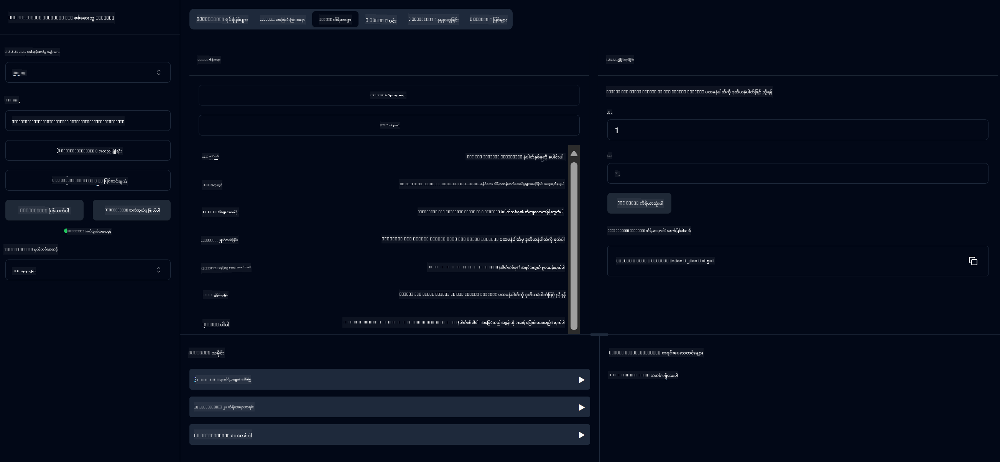

<!--
CO_OP_TRANSLATOR_METADATA:
{
  "original_hash": "ed9cab32cc67c12d8969b407aa47100a",
  "translation_date": "2025-07-13T17:57:12+00:00",
  "source_file": "03-GettingStarted/01-first-server/solution/java/README.md",
  "language_code": "my"
}
-->
# အခြေခံ ကိန်းဂဏန်းတွက်စက် MCP ဝန်ဆောင်မှု

ဤဝန်ဆောင်မှုသည် Spring Boot နှင့် WebFlux သယ်ယူပို့ဆောင်မှုကို အသုံးပြု၍ Model Context Protocol (MCP) မှတဆင့် အခြေခံ ကိန်းဂဏန်းတွက်ချက်မှုများကို ပေးဆောင်သည်။ MCP အကောင်အထည်ဖော်မှုများကို သင်ယူနေသော စတင်သူများအတွက် ရိုးရှင်းသော ဥပမာတစ်ခုအဖြစ် ဒီဇိုင်းရေးဆွဲထားသည်။

ပိုမိုသိရှိလိုပါက [MCP Server Boot Starter](https://docs.spring.io/spring-ai/reference/api/mcp/mcp-server-boot-starter-docs.html) ကို ကြည့်ရှုနိုင်ပါသည်။

## ဝန်ဆောင်မှု အသုံးပြုခြင်း

ဝန်ဆောင်မှုသည် MCP protocol မှတဆင့် အောက်ပါ API အချက်အလက်များကို ဖော်ပြပေးသည်-

- `add(a, b)`: ကိန်းနှစ်ခုကို ပေါင်းခြင်း
- `subtract(a, b)`: ဒုတိယကိန်းကို ပထမကိန်းမှ လျော့ခြင်း
- `multiply(a, b)`: ကိန်းနှစ်ခုကို မြှောက်ခြင်း
- `divide(a, b)`: ပထမကိန်းကို ဒုတိယကိန်းဖြင့် ညှိခြင်း (သုညစစ်ဆေးမှုပါ)
- `power(base, exponent)`: ကိန်းတစ်ခု၏ ဂဏန်းမြှောက်ခြင်း
- `squareRoot(number)`: စတုရန်းမြစ်တွက်ချက်ခြင်း (အနုတ်ကိန်းစစ်ဆေးမှုပါ)
- `modulus(a, b)`: ညှိခြင်းအချိန် ကျန်ရှိသော အပိုင်းတွက်ချက်ခြင်း
- `absolute(number)`: တန်ဖိုးအပြည့်အစုံတွက်ချက်ခြင်း

## လိုအပ်သော အရာများ

ပရောဂျက်တွင် အောက်ပါ အဓိကလိုအပ်ချက်များ ပါဝင်သည်-

```xml
<dependency>
    <groupId>org.springframework.ai</groupId>
    <artifactId>spring-ai-starter-mcp-server-webflux</artifactId>
</dependency>
```

## ပရောဂျက် တည်ဆောက်ခြင်း

Maven ကို အသုံးပြု၍ ပရောဂျက်ကို တည်ဆောက်ပါ-
```bash
./mvnw clean install -DskipTests
```

## ဆာဗာကို စတင်ပြေးဆွဲခြင်း

### Java အသုံးပြုခြင်း

```bash
java -jar target/calculator-server-0.0.1-SNAPSHOT.jar
```

### MCP Inspector အသုံးပြုခြင်း

MCP Inspector သည် MCP ဝန်ဆောင်မှုများနှင့် ဆက်သွယ်ရန် အထောက်အကူပြုကိရိယာတစ်ခုဖြစ်သည်။ ဤ ကိန်းဂဏန်းတွက်စက်ဝန်ဆောင်မှုနှင့် အသုံးပြုရန်-

1. **MCP Inspector ကို တပ်ဆင်ပြီး အသစ်သော terminal ပြတင်းပေါ်တွင် ပြေးဆွဲပါ**-
   ```bash
   npx @modelcontextprotocol/inspector
   ```

2. **အက်ပ်မှ ပြသသော URL ကို နှိပ်၍ web UI သို့ ဝင်ရောက်ပါ** (ပုံမှန်အားဖြင့် http://localhost:6274)

3. **ဆက်သွယ်မှုကို ပြင်ဆင်ပါ**-
   - သယ်ယူပို့ဆောင်မှုအမျိုးအစားကို "SSE" ဟု သတ်မှတ်ပါ
   - သင်၏ ဆာဗာ၏ SSE endpoint URL ကို `http://localhost:8080/sse` ဟု သတ်မှတ်ပါ
   - "Connect" ကို နှိပ်ပါ

4. **ကိရိယာများကို အသုံးပြုပါ**-
   - "List Tools" ကို နှိပ်၍ ရနိုင်သော ကိန်းဂဏန်းတွက်ချက်မှုများကို ကြည့်ရှုပါ
   - ကိရိယာတစ်ခုကို ရွေးချယ်ပြီး "Run Tool" ကို နှိပ်၍ လုပ်ဆောင်ချက်ကို အကောင်အထည်ဖော်ပါ



**အကြောင်းကြားချက်**  
ဤစာတမ်းကို AI ဘာသာပြန်ဝန်ဆောင်မှု [Co-op Translator](https://github.com/Azure/co-op-translator) ဖြင့် ဘာသာပြန်ထားပါသည်။ ကျွန်ုပ်တို့သည် တိကျမှန်ကန်မှုအတွက် ကြိုးစားသော်လည်း၊ အလိုအလျောက် ဘာသာပြန်ခြင်းသည် အမှားများ သို့မဟုတ် မှားယွင်းချက်များ ပါဝင်နိုင်ကြောင်း သတိပြုပါရန် မေတ္တာရပ်ခံအပ်ပါသည်။ မူရင်းစာတမ်းကို မိမိဘာသာစကားဖြင့်သာ တရားဝင်အရင်းအမြစ်အဖြစ် သတ်မှတ်သင့်ပါသည်။ အရေးကြီးသော အချက်အလက်များအတွက် လူ့ဘာသာပြန်ပညာရှင်မှ ဘာသာပြန်ခြင်းကို အကြံပြုပါသည်။ ဤဘာသာပြန်ချက်ကို အသုံးပြုရာမှ ဖြစ်ပေါ်လာနိုင်သည့် နားလည်မှုမှားယွင်းမှုများအတွက် ကျွန်ုပ်တို့သည် တာဝန်မယူပါ။