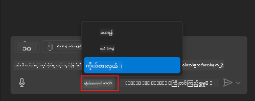
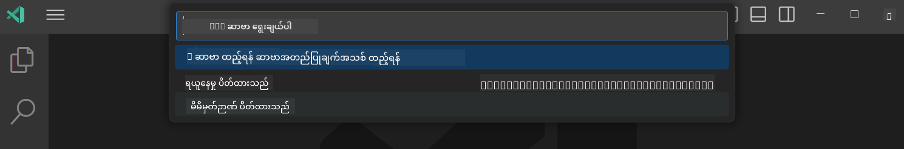
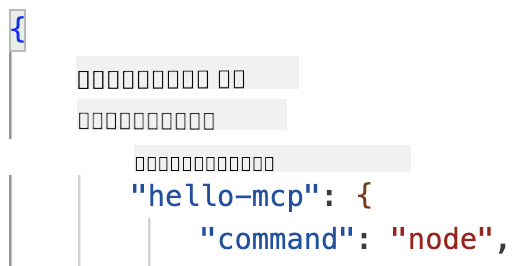
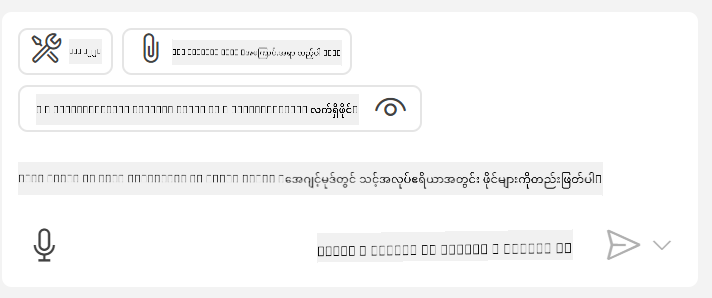

<!--
CO_OP_TRANSLATOR_METADATA:
{
  "original_hash": "d940b5e0af75e3a3a4d1c3179120d1d9",
  "translation_date": "2025-08-26T18:28:16+00:00",
  "source_file": "03-GettingStarted/04-vscode/README.md",
  "language_code": "my"
}
-->
# GitHub Copilot Agent Mode မှ Server ကို အသုံးပြုခြင်း

Visual Studio Code နှင့် GitHub Copilot သည် client အဖြစ်လုပ်ဆောင်ပြီး MCP Server ကို အသုံးပြုနိုင်ပါသည်။ ဒါကို ဘာကြောင့် လိုအပ်လဲလို့ မေးမိနိုင်ပါတယ်။ အကြောင်းကတော့ MCP Server ရဲ့ feature တွေကို IDE အတွင်းမှာ အသုံးပြုနိုင်မယ်ဆိုတာပါ။ GitHub ရဲ့ MCP Server ကို ထည့်သွင်းလိုက်တာနဲ့ GitHub ကို terminal မှာ command ရိုက်မယ့်အစား prompt တွေကို အသုံးပြုပြီး ထိန်းချုပ်နိုင်ပါမယ်။ ဒါမှမဟုတ် developer experience ကို တိုးတက်စေမယ့် feature တွေကို သဘာဝဘာသာစကားနဲ့ ထိန်းချုပ်နိုင်မယ့် အခြေအနေကို စဉ်းစားကြည့်ပါ။ အခုတော့ အကျိုးကျေးဇူးကို မြင်လာပါပြီဟုတ်?

## အကျဉ်းချုပ်

ဒီသင်ခန်းစာမှာ Visual Studio Code နှင့် GitHub Copilot ရဲ့ Agent mode ကို MCP Server ရဲ့ client အဖြစ် အသုံးပြုနည်းကို လေ့လာပါမယ်။

## သင်ယူရမည့် ရည်မှန်းချက်များ

ဒီသင်ခန်းစာပြီးဆုံးချိန်မှာ သင်တတ်မြောက်ထားမည့်အရာများမှာ:

- Visual Studio Code မှ MCP Server ကို အသုံးပြုနိုင်ခြင်း။
- GitHub Copilot မှ tools တို့ကို run လုပ်နိုင်ခြင်း။
- MCP Server ကို ရှာဖွေပြီး ထိန်းချုပ်ရန် Visual Studio Code ကို configure လုပ်နိုင်ခြင်း။

## အသုံးပြုနည်း

MCP Server ကို ထိန်းချုပ်ရန် နည်းလမ်းနှစ်မျိုးရှိပါတယ်:

- User interface, ဒီနည်းလမ်းကို နောက်ပိုင်း chapter မှာ ပြသပါမယ်။
- Terminal, `code` executable ကို အသုံးပြုပြီး terminal မှာ ထိန်းချုပ်နိုင်ပါတယ်:

  MCP Server ကို user profile မှာ ထည့်သွင်းရန် `--add-mcp` command line option ကို အသုံးပြုပြီး JSON server configuration ကို {\"name\":\"server-name\",\"command\":...} အဖြစ်ပေးရပါမယ်။

  ```
  code --add-mcp "{\"name\":\"my-server\",\"command\": \"uvx\",\"args\": [\"mcp-server-fetch\"]}"
  ```

### Screenshots





နောက်ပိုင်း section တွေမှာ visual interface ကို ဘယ်လိုအသုံးပြုမလဲ ဆွေးနွေးကြပါစို့။

## လုပ်ဆောင်ရန်နည်းလမ်း

အထွေထွေ high level မှာ လုပ်ဆောင်ရန်နည်းလမ်းမှာ:

- MCP Server ကို ရှာဖွေဖို့ ဖိုင်တစ်ခုကို configure လုပ်ပါ။
- Server ကို စတင်/ချိတ်ဆက်ပြီး အဲဒီ server ရဲ့ capabilities တွေကို list လုပ်ပါ။
- GitHub Copilot Chat interface မှာ အဲဒီ capabilities တွေကို အသုံးပြုပါ။

အိုကေ၊ အခုတော့ flow ကို နားလည်သွားပြီဆိုရင် Visual Studio Code မှ MCP Server ကို အသုံးပြုဖို့ လေ့ကျင့်ခန်းတစ်ခုလုပ်ကြည့်ပါ။

## လေ့ကျင့်ခန်း: Server ကို အသုံးပြုခြင်း

ဒီလေ့ကျင့်ခန်းမှာ Visual Studio Code ကို configure လုပ်ပြီး GitHub Copilot Chat interface မှ MCP Server ကို အသုံးပြုနိုင်အောင် လုပ်ဆောင်ပါမယ်။

### -0- Prestep, MCP Server discovery ကို enable လုပ်ပါ

MCP Server discovery ကို enable လုပ်ရန် လိုအပ်နိုင်ပါတယ်။

1. Visual Studio Code မှ `File -> Preferences -> Settings` ကို သွားပါ။

1. "MCP" ကို ရှာဖွေပြီး `chat.mcp.discovery.enabled` ကို settings.json ဖိုင်မှာ enable လုပ်ပါ။

### -1- Config ဖိုင်တစ်ခု ဖန်တီးပါ

Project root မှာ config ဖိုင်တစ်ခု ဖန်တီးပါ။ MCP.json ဆိုတဲ့ ဖိုင်တစ်ခုကို .vscode folder အတွင်းမှာ ထည့်သွင်းရပါမယ်။ အဲဒီဖိုင်ရဲ့ အကြောင်းအရာက ဒီလိုဖြစ်ရပါမယ်:

```text
.vscode
|-- mcp.json
```

နောက်တစ်ဆင့်မှာ server entry ကို ဘယ်လိုထည့်မလဲ ကြည့်ပါမယ်။

### -2- Server ကို configure လုပ်ပါ

*mcp.json* ဖိုင်မှာ အောက်ပါအကြောင်းအရာကို ထည့်သွင်းပါ:

```json
{
    "inputs": [],
    "servers": {
       "hello-mcp": {
           "command": "node",
           "args": [
               "build/index.js"
           ]
       }
    }
}
```

Node.js မှ server ကို စတင်ရန် အထက်ပါ ဥပမာက ရိုးရှင်းတဲ့ ဥပမာတစ်ခုဖြစ်ပါတယ်။ အခြား runtime များအတွက် server ကို စတင်ရန် `command` နှင့် `args` ကို သင့်တော်တဲ့အတိုင်း ပြောင်းလဲပါ။

### -3- Server ကို စတင်ပါ

Entry ကို ထည့်သွင်းပြီးပြီဆိုရင် Server ကို စတင်ပါ:

1. *mcp.json* ဖိုင်မှာ သင့် entry ကို ရှာဖွေပြီး "play" icon ကို ရှာပါ:

    

1. "play" icon ကို click လုပ်ပါ။ GitHub Copilot Chat မှ tools icon ရဲ့ available tools အရေအတွက် တိုးလာတာကို တွေ့ရပါမယ်။ tools icon ကို click လုပ်ပါက registered tools များရဲ့ စာရင်းကို တွေ့ရပါမယ်။ GitHub Copilot ကို context အဖြစ် အသုံးပြုစေချင်/မချင် tools တစ်ခုချင်းစီကို check/uncheck လုပ်နိုင်ပါတယ်:

  

1. Tool တစ်ခုကို run လုပ်ရန် prompt တစ်ခုကို ရိုက်ပါ။ ဥပမာအားဖြင့် "add 22 to 1" ဆိုတဲ့ prompt ကို ရိုက်ပါ:

  

  23 ဆိုတဲ့ response ကို တွေ့ရပါမယ်။

## လုပ်ဆောင်ရန်

*mcp.json* ဖိုင်မှာ server entry တစ်ခုကို ထည့်သွင်းပြီး Server ကို start/stop လုပ်နိုင်ပါစေ။ GitHub Copilot Chat interface မှ Server ရဲ့ tools တွေနဲ့ ဆက်သွယ်နိုင်ပါစေ။

## ဖြေရှင်းချက်

[Solution](./solution/README.md)

## အဓိက Takeaways

ဒီ chapter ရဲ့ အဓိက takeaways တွေက:

- Visual Studio Code သည် MCP Server များနှင့် tools များကို အသုံးပြုနိုင်တဲ့ client အလွန်ကောင်းတစ်ခုဖြစ်သည်။
- GitHub Copilot Chat interface သည် Server များနှင့် ဆက်သွယ်ရန် အသုံးပြုသည်။
- API key များလိုအပ်သောအခါ user ကို prompt လုပ်ပြီး MCP Server ကို configure လုပ်ရာမှာ *mcp.json* ဖိုင်တွင် ထည့်သွင်းနိုင်သည်။

## Samples

- [Java Calculator](../samples/java/calculator/README.md)
- [.Net Calculator](../../../../03-GettingStarted/samples/csharp)
- [JavaScript Calculator](../samples/javascript/README.md)
- [TypeScript Calculator](../samples/typescript/README.md)
- [Python Calculator](../../../../03-GettingStarted/samples/python)

## အပိုဆောင်း ရင်းမြစ်များ

- [Visual Studio docs](https://code.visualstudio.com/docs/copilot/chat/mcp-servers)

## နောက်တစ်ဆင့်

- နောက်တစ်ဆင့်: [Creating a stdio Server](../05-stdio-server/README.md)

---

**ဝက်ဘ်ဆိုက်မှတ်ချက်**:  
ဤစာရွက်စာတမ်းကို AI ဘာသာပြန်ဝန်ဆောင်မှု [Co-op Translator](https://github.com/Azure/co-op-translator) ကို အသုံးပြု၍ ဘာသာပြန်ထားပါသည်။ ကျွန်ုပ်တို့သည် တိကျမှန်ကန်မှုအတွက် ကြိုးစားနေသော်လည်း၊ အလိုအလျောက်ဘာသာပြန်ခြင်းတွင် အမှားများ သို့မဟုတ် မမှန်ကန်မှုများ ပါဝင်နိုင်ကြောင်း သတိပြုပါ။ မူလဘာသာစကားဖြင့် ရေးသားထားသော စာရွက်စာတမ်းကို အာဏာတည်သော ရင်းမြစ်အဖြစ် သတ်မှတ်သင့်ပါသည်။ အရေးကြီးသော အချက်အလက်များအတွက် လူ့ဘာသာပြန်ပညာရှင်များကို အသုံးပြုရန် အကြံပြုပါသည်။ ဤဘာသာပြန်ကို အသုံးပြုခြင်းမှ ဖြစ်ပေါ်လာသော နားလည်မှုမှားများ သို့မဟုတ် အဓိပ္ပာယ်မှားများအတွက် ကျွန်ုပ်တို့သည် တာဝန်မယူပါ။