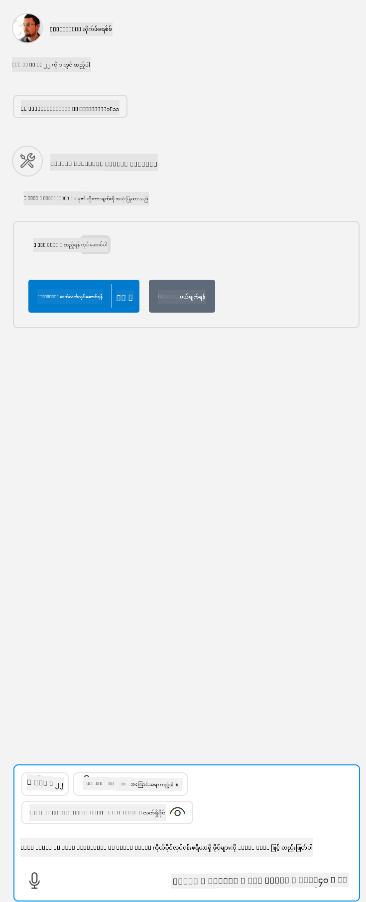

<!--
CO_OP_TRANSLATOR_METADATA:
{
  "original_hash": "5ef8f5821c1a04f7b1fc4f15098ecab8",
  "translation_date": "2025-07-13T19:46:58+00:00",
  "source_file": "03-GettingStarted/04-vscode/solution/README.md",
  "language_code": "my"
}
-->
ဒါဟာ `node build/index.js` လို command တစ်ခုကို chạy လုပ်တာနဲ့ ကိုက်ညီပါတယ်။

- သင့် server ဖိုင်ရှိရာနေရာနဲ့ သင့်ရွေးချယ်ထားတဲ့ runtime နဲ့ server တည်နေရာအပေါ်မူတည်ပြီး server entry ကို သင့် server ဖိုင်ရှိရာနေရာသို့ သို့မဟုတ် server ကို စတင်ဖို့လိုအပ်တဲ့ command ပြောင်းလဲပါ။

## server ထဲမှာ features တွေကို အသုံးပြုခြင်း

- *mcp.json* ကို *./vscode* ဖိုလ်ဒါထဲ ထည့်ပြီးနောက် `play` icon ကို နှိပ်ပါ။

    GitHub Copilot ရဲ့ chat field အပေါ်မှာ တည်ရှိတဲ့ tooling icon က အသုံးပြုနိုင်တဲ့ tools အရေအတွက် တိုးလာတာကို တွေ့မြင်ရပါမယ်။

## tool တစ်ခု chạy လုပ်ခြင်း

- သင့် chat ပြတင်းပေါ်မှာ သင့် tool ရဲ့ ဖော်ပြချက်နဲ့ ကိုက်ညီတဲ့ prompt တစ်ခု ရိုက်ထည့်ပါ။ ဥပမာ `add` tool ကို ဖွင့်ချင်ရင် "add 3 to 20" လို့ ရိုက်ပါ။

    chat text box အပေါ်မှာ tool တစ်ခုကို ရွေးချယ်ဖို့ ပြသထားတာကို တွေ့မြင်ရပါမယ်၊ ဥပမာအတိုင်း ဒီပုံစံလိုဖြစ်ပါတယ်-

    

    tool ကို ရွေးချယ်လိုက်ရင် "23" ဆိုတဲ့ နံပါတ်ရလဒ်ကို ရရှိမှာဖြစ်ပြီး၊ အထက်မှာ ပြောခဲ့တဲ့ prompt နဲ့ ကိုက်ညီပါလိမ့်မယ်။

**အကြောင်းကြားချက်**  
ဤစာတမ်းကို AI ဘာသာပြန်ဝန်ဆောင်မှု [Co-op Translator](https://github.com/Azure/co-op-translator) ဖြင့် ဘာသာပြန်ထားပါသည်။ ကျွန်ုပ်တို့သည် တိကျမှန်ကန်မှုအတွက် ကြိုးစားသော်လည်း၊ အလိုအလျောက် ဘာသာပြန်ခြင်းများတွင် အမှားများ သို့မဟုတ် မှားယွင်းချက်များ ပါဝင်နိုင်ကြောင်း သတိပြုပါရန် မေတ္တာရပ်ခံအပ်ပါသည်။ မူရင်းစာတမ်းကို မိမိဘာသာစကားဖြင့်သာ တရားဝင်အရင်းအမြစ်အဖြစ် သတ်မှတ်သင့်ပါသည်။ အရေးကြီးသော အချက်အလက်များအတွက် လူ့ဘာသာပြန်ပညာရှင်မှ ဘာသာပြန်ခြင်းကို အကြံပြုပါသည်။ ဤဘာသာပြန်ချက်ကို အသုံးပြုရာမှ ဖြစ်ပေါ်လာနိုင်သည့် နားလည်မှုမှားယွင်းမှုများအတွက် ကျွန်ုပ်တို့ တာဝန်မယူပါ။