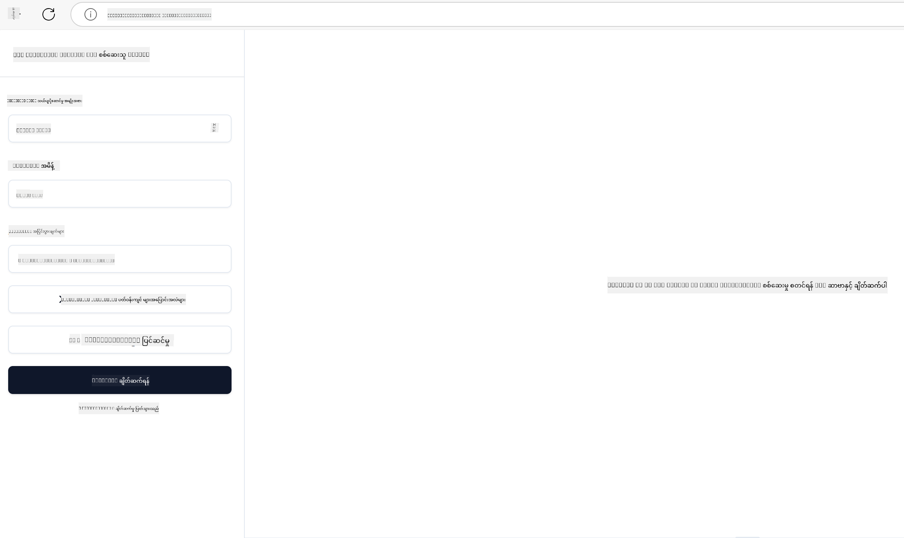

<!--
CO_OP_TRANSLATOR_METADATA:
{
  "original_hash": "4e34e34e84f013e73c7eaa6d09884756",
  "translation_date": "2025-07-13T22:04:48+00:00",
  "source_file": "03-GettingStarted/08-testing/README.md",
  "language_code": "my"
}
-->
## စမ်းသပ်ခြင်းနှင့် အမှားရှာဖွေခြင်း

MCP ဆာဗာကို စမ်းသပ်မတိုင်မီ၊ ရရှိနိုင်သောကိရိယာများနှင့် အမှားရှာဖွေရာတွင် အသုံးပြုသင့်သောနည်းလမ်းများကို နားလည်ထားခြင်းမှာ အရေးကြီးပါသည်။ ထိရောက်သော စမ်းသပ်မှုသည် သင့်ဆာဗာသည် မျှော်မှန်းထားသလို လုပ်ဆောင်နေကြောင်း သေချာစေပြီး ပြဿနာများကို အမြန်ဆုံး ရှာဖွေဖြေရှင်းနိုင်စေပါသည်။ အောက်ပါအပိုင်းတွင် သင့် MCP အကောင်အထည်ဖော်မှုကို စစ်ဆေးရန် အကြံပြုနည်းလမ်းများကို ဖော်ပြထားပါသည်။

## အနှစ်ချုပ်

ဤသင်ခန်းစာတွင် သင့်တော်သော စမ်းသပ်နည်းလမ်းရွေးချယ်ခြင်းနှင့် ထိရောက်ဆုံး စမ်းသပ်ကိရိယာကို အသုံးပြုနည်းကို ဖော်ပြပါသည်။

## သင်ယူရမည့် ရည်မှန်းချက်များ

ဤသင်ခန်းစာပြီးဆုံးသည်နှင့်အမျှ သင်သည် -

- စမ်းသပ်ခြင်းအတွက် မတူညီသောနည်းလမ်းများကို ဖော်ပြနိုင်မည်။
- သင့်ကုဒ်ကို ထိရောက်စွာ စမ်းသပ်ရန် ကိရိယာများကို အသုံးပြုနိုင်မည်။

## MCP ဆာဗာများ စမ်းသပ်ခြင်း

MCP သည် သင့်ဆာဗာများကို စမ်းသပ်ခြင်းနှင့် အမှားရှာဖွေရေးအတွက် ကိရိယာများကို ပံ့ပိုးပေးပါသည် -

- **MCP Inspector**: CLI ကိရိယာအဖြစ်နှင့် မြင်ကွင်းဆိုင်ရာကိရိယာအဖြစ် အသုံးပြုနိုင်သော command line ကိရိယာတစ်ခု။
- **လက်ဖြင့် စမ်းသပ်ခြင်း**: curl ကဲ့သို့သော ကိရိယာကို အသုံးပြု၍ web request များကို လုပ်ဆောင်နိုင်သလို HTTP လုပ်ဆောင်နိုင်သည့် ကိရိယာ များကိုလည်း အသုံးပြုနိုင်သည်။
- **ယူနစ် စမ်းသပ်ခြင်း**: သင့်နှစ်သက်ရာ စမ်းသပ်မှု framework ကို အသုံးပြု၍ ဆာဗာနှင့် client ၏ လုပ်ဆောင်ချက်များကို စမ်းသပ်နိုင်သည်။

### MCP Inspector အသုံးပြုခြင်း

ဤကိရိယာ၏ အသုံးပြုနည်းကို ယခင်သင်ခန်းစာများတွင် ဖော်ပြခဲ့ပြီးဖြစ်သော်လည်း အထွေထွေ အဆင့်မြင့်အနေနှင့် ပြောကြားလိုပါသည်။ Node.js ဖြင့် တည်ဆောက်ထားပြီး `npx` executable ကို ခေါ်ယူ၍ အသုံးပြုနိုင်ပါသည်။ ၎င်းကိရိယာကို ယာယီ ဒေါင်းလုပ်လုပ်ပြီး တောင်းဆိုမှု ပြီးဆုံးသည့်အခါ မလိုအပ်တော့သော ဖိုင်များကို ကိုယ်တိုင် ဖျက်ပစ်ပါသည်။

[MCP Inspector](https://github.com/modelcontextprotocol/inspector) သည် -

- **ဆာဗာ၏ စွမ်းဆောင်ရည်များ ရှာဖွေခြင်း**: ရရှိနိုင်သော အရင်းအမြစ်များ၊ ကိရိယာများနှင့် prompt များကို အလိုအလျောက် ရှာဖွေသည်။
- **ကိရိယာ လုပ်ဆောင်မှု စမ်းသပ်ခြင်း**: မတူညီသော ပါရာမီတာများကို စမ်းသပ်ပြီး တုံ့ပြန်ချက်များကို တိုက်ရိုက် ကြည့်ရှုနိုင်သည်။
- **ဆာဗာ Metadata ကြည့်ရှုခြင်း**: ဆာဗာအချက်အလက်များ၊ schema များနှင့် ဖွဲ့စည်းမှုများကို စစ်ဆေးနိုင်သည်။

ကိရိယာကို ပုံမှန်အသုံးပြုမှုမှာ အောက်ပါအတိုင်း ဖြစ်ပါသည် -

```bash
npx @modelcontextprotocol/inspector node build/index.js
```

အထက်ပါ command သည် MCP နှင့် ၎င်း၏ မြင်ကွင်းဆိုင်ရာ အင်တာဖေ့စ်ကို စတင်ပြီး သင့် browser တွင် ဒေသဆိုင်ရာ web interface ကို ဖွင့်ပေးပါသည်။ သင့်မှတ်ပုံတင်ထားသော MCP ဆာဗာများ၊ ၎င်းတို့၏ ရရှိနိုင်သော ကိရိယာများ၊ အရင်းအမြစ်များနှင့် prompt များကို dashboard ပေါ်တွင် မြင်ရမည်ဖြစ်သည်။ ဤအင်တာဖေ့စ်မှတဆင့် ကိရိယာ လုပ်ဆောင်မှုကို အပြန်အလှန် စမ်းသပ်နိုင်ပြီး ဆာဗာ metadata ကို စစ်ဆေးနိုင်ကာ တုံ့ပြန်ချက်များကို တိုက်ရိုက် ကြည့်ရှုနိုင်သည်။ ထို့ကြောင့် သင့် MCP ဆာဗာ အကောင်အထည်ဖော်မှုများကို အတိအကျ စစ်ဆေးပြီး အမှားရှာဖွေရာတွင် အထောက်အကူဖြစ်စေပါသည်။

ဤကိရိယာ၏ ပုံစံက ဒီလို ဖြစ်နိုင်ပါသည် - 

CLI mode ဖြင့်လည်း အသုံးပြုနိုင်ပြီး ၎င်းအတွက် `--cli` attribute ကို ထည့်သွင်းရပါမည်။ CLI mode ဖြင့် ကိရိယာအား စတင်အသုံးပြုသော ဥပမာမှာ ဆာဗာပေါ်ရှိ ကိရိယာအားလုံးကို စာရင်းပြသပါသည် -

```sh
npx @modelcontextprotocol/inspector --cli node build/index.js --method tools/list
```

### လက်ဖြင့် စမ်းသပ်ခြင်း

ဆာဗာ၏ စွမ်းဆောင်ရည်များကို စမ်းသပ်ရန် inspector ကိရိယာကို အသုံးပြုခြင်းအပြင် HTTP အသုံးပြုနိုင်သော client တစ်ခုဖြစ်သော curl ကဲ့သို့သော ကိရိယာကိုလည်း အသုံးပြုနိုင်ပါသည်။

curl ဖြင့် MCP ဆာဗာများကို တိုက်ရိုက် HTTP request များဖြင့် စမ်းသပ်နိုင်သည် -

```bash
# Example: Test server metadata
curl http://localhost:3000/v1/metadata

# Example: Execute a tool
curl -X POST http://localhost:3000/v1/tools/execute \
  -H "Content-Type: application/json" \
  -d '{"name": "calculator", "parameters": {"expression": "2+2"}}'
```

အထက်ပါ curl အသုံးပြုမှုမှ တွေ့ရသလို၊ tool အမည်နှင့် ပါရာမီတာများပါဝင်သော payload ဖြင့် POST request တစ်ခုကို အသုံးပြုကာ tool ကို ခေါ်ယူသည်။ သင့်အတွက် သင့်တော်သော နည်းလမ်းကို အသုံးပြုပါ။ CLI ကိရိယာများသည် အများအားဖြင့် အသုံးပြုရ လျင်မြန်ပြီး script များရေးရန် အဆင်ပြေသောကြောင့် CI/CD ပတ်ဝန်းကျင်တွင် အထောက်အကူဖြစ်နိုင်ပါသည်။

### ယူနစ် စမ်းသပ်ခြင်း

သင့် tool များနှင့် အရင်းအမြစ်များအတွက် ယူနစ် စမ်းသပ်မှုများ ဖန်တီး၍ ၎င်းတို့သည် မျှော်မှန်းထားသည့်အတိုင်း လုပ်ဆောင်နေကြောင်း သေချာစေပါ။ ဥပမာ စမ်းသပ်ကုဒ် အချို့မှာ -

```python
import pytest

from mcp.server.fastmcp import FastMCP
from mcp.shared.memory import (
    create_connected_server_and_client_session as create_session,
)

# Mark the whole module for async tests
pytestmark = pytest.mark.anyio


async def test_list_tools_cursor_parameter():
    """Test that the cursor parameter is accepted for list_tools.

    Note: FastMCP doesn't currently implement pagination, so this test
    only verifies that the cursor parameter is accepted by the client.
    """

 server = FastMCP("test")

    # Create a couple of test tools
    @server.tool(name="test_tool_1")
    async def test_tool_1() -> str:
        """First test tool"""
        return "Result 1"

    @server.tool(name="test_tool_2")
    async def test_tool_2() -> str:
        """Second test tool"""
        return "Result 2"

    async with create_session(server._mcp_server) as client_session:
        # Test without cursor parameter (omitted)
        result1 = await client_session.list_tools()
        assert len(result1.tools) == 2

        # Test with cursor=None
        result2 = await client_session.list_tools(cursor=None)
        assert len(result2.tools) == 2

        # Test with cursor as string
        result3 = await client_session.list_tools(cursor="some_cursor_value")
        assert len(result3.tools) == 2

        # Test with empty string cursor
        result4 = await client_session.list_tools(cursor="")
        assert len(result4.tools) == 2
    
```

အထက်ပါကုဒ်သည် အောက်ပါအတိုင်း လုပ်ဆောင်ပါသည် -

- pytest framework ကို အသုံးပြုကာ function အဖြစ် စမ်းသပ်မှုများ ဖန်တီးနိုင်ပြီး assert စာကြောင်းများကို အသုံးပြုသည်။
- ကွဲပြားသော tool နှစ်ခုပါဝင်သည့် MCP ဆာဗာတစ်ခု ဖန်တီးသည်။
- သတ်မှတ်ထားသော အခြေအနေများ ပြည့်မှီကြောင်း `assert` စာကြောင်းဖြင့် စစ်ဆေးသည်။

[အပြည့်အစုံဖိုင်ကို ဒီမှာ ကြည့်ရှုနိုင်ပါသည်](https://github.com/modelcontextprotocol/python-sdk/blob/main/tests/client/test_list_methods_cursor.py)

အထက်ဖော်ပြထားသော ဖိုင်အရ သင့်ဆာဗာကို စမ်းသပ်၍ စွမ်းဆောင်ရည်များ သင့်တော်စွာ ဖန်တီးထားကြောင်း သေချာစေပါ။

အဓိက SDK များတွင်လည်း ဆင်တူသော စမ်းသပ်မှု အပိုင်းများ ရှိသဖြင့် သင့်ရွေးချယ်ထားသော runtime အတွက် ကိုက်ညီစွာ ပြင်ဆင်နိုင်ပါသည်။

## နမူနာများ

- [Java Calculator](../samples/java/calculator/README.md)
- [.Net Calculator](../../../../03-GettingStarted/samples/csharp)
- [JavaScript Calculator](../samples/javascript/README.md)
- [TypeScript Calculator](../samples/typescript/README.md)
- [Python Calculator](../../../../03-GettingStarted/samples/python)

## အပိုဆောင်း အရင်းအမြစ်များ

- [Python SDK](https://github.com/modelcontextprotocol/python-sdk)

## နောက်တစ်ဆင့်

- နောက်တစ်ဆင့်: [Deployment](../09-deployment/README.md)

**အကြောင်းကြားချက်**  
ဤစာတမ်းကို AI ဘာသာပြန်ဝန်ဆောင်မှု [Co-op Translator](https://github.com/Azure/co-op-translator) ဖြင့် ဘာသာပြန်ထားပါသည်။ ကျွန်ုပ်တို့သည် တိကျမှန်ကန်မှုအတွက် ကြိုးစားနေသော်လည်း၊ အလိုအလျောက် ဘာသာပြန်ခြင်းများတွင် အမှားများ သို့မဟုတ် မှားယွင်းချက်များ ပါဝင်နိုင်ကြောင်း သတိပြုပါရန် မေတ္တာရပ်ခံအပ်ပါသည်။ မူရင်းစာတမ်းကို မိမိဘာသာစကားဖြင့်သာ တရားဝင်အရင်းအမြစ်အဖြစ် ယူဆသင့်ပါသည်။ အရေးကြီးသော အချက်အလက်များအတွက် လူ့ဘာသာပြန်ပညာရှင်မှ ဘာသာပြန်ခြင်းကို အကြံပြုပါသည်။ ဤဘာသာပြန်ချက်ကို အသုံးပြုရာမှ ဖြစ်ပေါ်လာနိုင်သည့် နားလည်မှုမှားယွင်းမှုများအတွက် ကျွန်ုပ်တို့သည် တာဝန်မယူပါ။